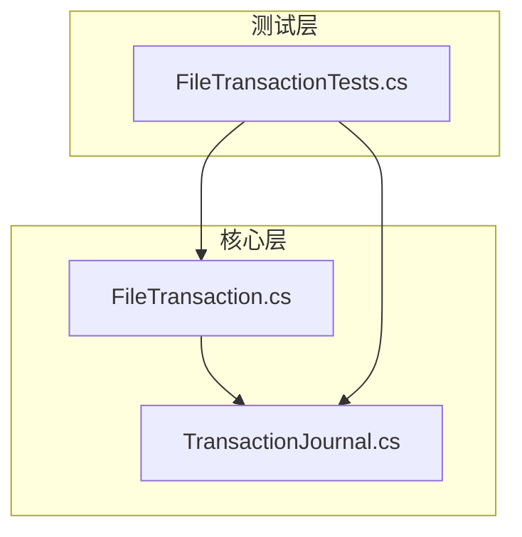
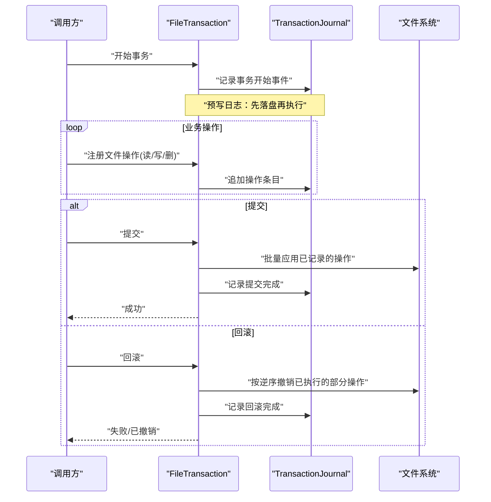
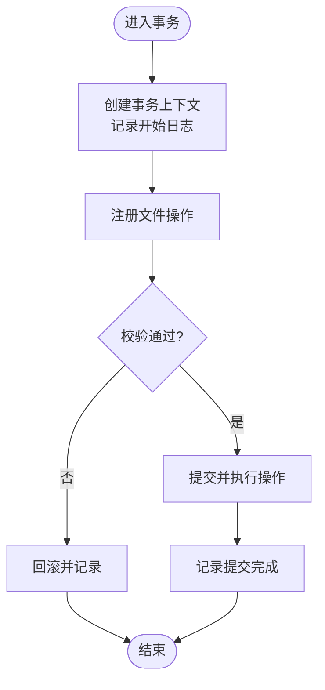
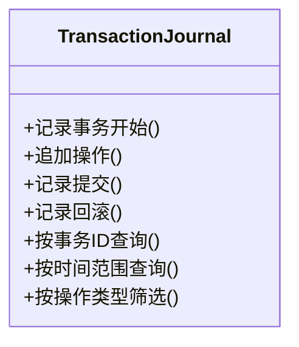
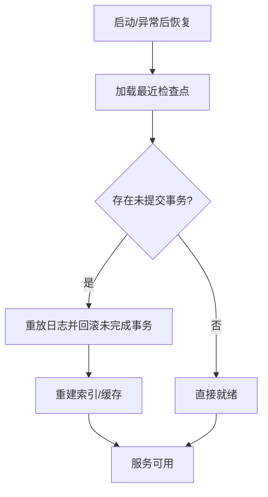
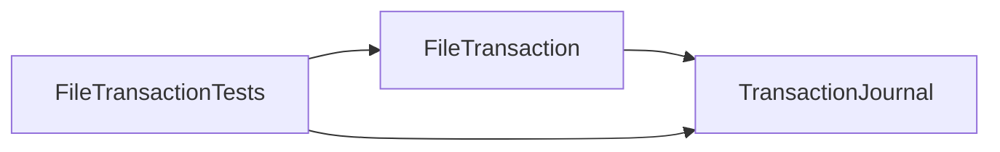

# 事务处理系统

<cite>
**本文引用的文件**   
- [FileTransaction.cs](file://src/Crystalfly.Core/Transactions/FileTransaction.cs)
- [TransactionJournal.cs](file://src/Crystalfly.Core/Models/TransactionJournal.cs)
- [FileTransactionTests.cs](file://tests/Crystalfly.Core.Tests/Transactions/FileTransactionTests.cs)
</cite>

## 目录
1. [简介](#简介)
2. [项目结构](#项目结构)
3. [核心组件](#核心组件)
4. [架构总览](#架构总览)
5. [详细组件分析](#详细组件分析)
6. [依赖关系分析](#依赖关系分析)
7. [性能考量](#性能考量)
8. [故障排查指南](#故障排查指南)
9. [结论](#结论)
10. [附录](#附录)

## 简介
本文件面向 Crystalfly 的事务处理子系统，聚焦于文件级事务与事务日志。文档围绕以下目标展开：
- 描述 FileTransaction 的事务管理机制：开始、提交、回滚的完整流程
- 解释 TransactionJournal 的记录格式与查询机制
- 说明文件级事务的一致性策略：预写日志（WAL）、检查点与恢复
- 讨论隔离级别、并发控制与死锁预防
- 明确事务边界、嵌套事务与长事务优化
- 提供监控、调试与性能分析工具的使用建议
- 给出复杂业务场景下的事务设计模式与最佳实践

## 项目结构
事务相关代码位于 Core 层，包含事务实现与模型定义，并在测试项目中覆盖关键路径。

图表来源
- [FileTransaction.cs](file://src/Crystalfly.Core/Transactions/FileTransaction.cs)
- [TransactionJournal.cs](file://src/Crystalfly.Core/Models/TransactionJournal.cs)
- [FileTransactionTests.cs](file://tests/Crystalfly.Core.Tests/Transactions/FileTransactionTests.cs)

章节来源
- [FileTransaction.cs](file://src/Crystalfly.Core/Transactions/FileTransaction.cs)
- [TransactionJournal.cs](file://src/Crystalfly.Core/Models/TransactionJournal.cs)
- [FileTransactionTests.cs](file://tests/Crystalfly.Core.Tests/Transactions/FileTransactionTests.cs)

## 核心组件
- FileTransaction：封装一次文件变更事务的生命周期，负责记录操作、执行写入、提交或回滚，并维护一致性状态。
- TransactionJournal：持久化事务日志的结构与读写接口，用于记录事务元数据与操作序列，支持按条件查询与回放。

章节来源
- [FileTransaction.cs](file://src/Crystalfly.Core/Transactions/FileTransaction.cs)
- [TransactionJournal.cs](file://src/Crystalfly.Core/Models/TransactionJournal.cs)

## 架构总览
下图展示了事务从开始到提交/回滚的关键交互，以及日志在其中的作用。

图表来源
- [FileTransaction.cs](file://src/Crystalfly.Core/Transactions/FileTransaction.cs)
- [TransactionJournal.cs](file://src/Crystalfly.Core/Models/TransactionJournal.cs)

## 详细组件分析

### FileTransaction 事务生命周期
- 事务开始
  - 分配唯一事务标识
  - 初始化内部操作队列与状态
  - 向日志写入“开始”记录
- 操作注册与执行
  - 将待执行的写/删等操作以幂等形式记录到日志
  - 可选：在提交前进行校验与冲突检测
- 提交
  - 顺序执行所有已记录操作
  - 写入“提交完成”记录
  - 清理临时状态
- 回滚
  - 若部分操作已执行，则按逆序撤销
  - 写入“回滚完成”记录
  - 清理临时状态

图表来源
- [FileTransaction.cs](file://src/Crystalfly.Core/Transactions/FileTransaction.cs)

章节来源
- [FileTransaction.cs](file://src/Crystalfly.Core/Transactions/FileTransaction.cs)

### TransactionJournal 日志格式与查询
- 记录类型
  - 事务开始、操作项、提交完成、回滚完成等
- 字段要素
  - 事务ID、时间戳、操作类型、目标路径、快照/差异信息、状态码等
- 写入策略
  - 追加式写入，保证原子性（如使用原子写入/同步刷新）
- 查询机制
  - 按事务ID检索
  - 按时间范围过滤
  - 按操作类型筛选
  - 支持回放与审计导出

图表来源
- [TransactionJournal.cs](file://src/Crystalfly.Core/Models/TransactionJournal.cs)

章节来源
- [TransactionJournal.cs](file://src/Crystalfly.Core/Models/TransactionJournal.cs)

### 一致性策略：预写日志、检查点与恢复
- 预写日志（WAL）
  - 任何变更前先落盘日志，确保崩溃后可恢复
- 检查点
  - 定期生成一致快照或索引，缩短恢复时间
- 恢复流程
  - 读取最近检查点
  - 重放其后日志至一致状态
  - 对未完成事务进行回滚

图表来源
- [FileTransaction.cs](file://src/Crystalfly.Core/Transactions/FileTransaction.cs)
- [TransactionJournal.cs](file://src/Crystalfly.Core/Models/TransactionJournal.cs)

章节来源
- [FileTransaction.cs](file://src/Crystalfly.Core/Transactions/FileTransaction.cs)
- [TransactionJournal.cs](file://src/Crystalfly.Core/Models/TransactionJournal.cs)

### 隔离级别、并发控制与死锁预防
- 隔离级别
  - 默认采用可串行化的强一致语义；对于只读路径可采用快照读降低竞争
- 并发控制
  - 基于资源粒度的锁（文件或目录），避免跨粒度锁升级
  - 写路径加排他锁，读路径共享锁
- 死锁预防
  - 固定加锁顺序（例如按路径字典序）
  - 超时与重试策略
  - 必要时引入等待图检测与回退

章节来源
- [FileTransaction.cs](file://src/Crystalfly.Core/Transactions/FileTransaction.cs)

### 事务边界、嵌套事务与长事务优化
- 事务边界
  - 以业务单元为界，最小化持有锁的时间
  - 将大任务拆分为多个小事务，提高吞吐与可恢复性
- 嵌套事务
  - 支持子事务：子事务失败不影响父事务，但会触发局部回滚
  - 子事务提交时合并到父事务日志
- 长事务优化
  - 分阶段提交：准备阶段仅记录日志，提交阶段再执行
  - 增量检查点：周期性落盘中间状态
  - 异步回放：后台线程回放日志，前台快速响应

章节来源
- [FileTransaction.cs](file://src/Crystalfly.Core/Transactions/FileTransaction.cs)
- [TransactionJournal.cs](file://src/Crystalffly.Core/Models/TransactionJournal.cs)

### 监控、调试与性能分析
- 监控指标
  - 事务成功率/失败率、平均耗时、P99/P999 延迟
  - 日志大小增长、回放耗时、检查点间隔
  - 锁等待时长、死锁次数
- 调试手段
  - 启用详细日志：记录每个操作的参数与结果
  - 导出事务回放脚本，复现问题
  - 针对热点路径添加采样计时
- 性能分析
  - I/O 热点定位：关注磁盘同步频率与批量化程度
  - 锁竞争分析：统计锁持有时间与等待队列长度
  - 日志压缩与归档：减少回放成本

章节来源
- [FileTransaction.cs](file://src/Crystalfly.Core/Transactions/FileTransaction.cs)
- [TransactionJournal.cs](file://src/Crystalfly.Core/Models/TransactionJournal.cs)

### 复杂业务场景的设计模式与最佳实践
- 安装/卸载模组
  - 将下载、解压、清单更新、依赖修复放入同一事务
  - 失败时自动回滚，保证实例一致性
- 多文件批量更新
  - 使用批量写入与原子替换，避免中间态可见
- 版本迁移
  - 以迁移脚本为单位组织事务，支持向前/向后兼容的回滚
- 审计与合规
  - 利用事务日志作为不可变审计轨迹，支持追溯与取证

章节来源
- [FileTransaction.cs](file://src/Crystalfly.Core/Transactions/FileTransaction.cs)
- [TransactionJournal.cs](file://src/Crystalfly.Core/Models/TransactionJournal.cs)

## 依赖关系分析
事务子系统内部依赖清晰：事务控制器依赖日志模块；测试用例覆盖关键路径。

图表来源
- [FileTransaction.cs](file://src/Crystalfly.Core/Transactions/FileTransaction.cs)
- [TransactionJournal.cs](file://src/Crystalfly.Core/Models/TransactionJournal.cs)
- [FileTransactionTests.cs](file://tests/Crystalfly.Core.Tests/Transactions/FileTransactionTests.cs)

章节来源
- [FileTransaction.cs](file://src/Crystalfly.Core/Transactions/FileTransaction.cs)
- [TransactionJournal.cs](file://src/Crystalfly.Core/Models/TransactionJournal.cs)
- [FileTransactionTests.cs](file://tests/Crystalfly.Core.Tests/Transactions/FileTransactionTests.cs)

## 性能考量
- 日志写入
  - 使用顺序追加与批量刷新，降低随机写开销
- 提交阶段
  - 尽量批量化文件操作，减少系统调用次数
- 检查点
  - 合理设置检查点间隔，平衡恢复时间与存储占用
- 并发
  - 细粒度锁与无锁读路径结合，提升并发吞吐
- 存储介质
  - 针对 SSD/HDD 调整同步策略与缓冲区大小

[本节为通用指导，不直接分析具体文件]

## 故障排查指南
- 常见问题
  - 事务未提交：检查日志中是否存在“提交完成”记录
  - 回滚不完整：确认是否按逆序撤销且幂等
  - 死锁：观察锁等待图与超时重试日志
- 定位步骤
  - 根据事务ID检索日志，逐步回放
  - 对比检查点与最终状态，定位不一致点
  - 开启详细日志，复现场景并采集堆栈
- 恢复建议
  - 优先从最近检查点恢复
  - 重放未完成的日志段并回滚未完成事务
  - 重建索引与缓存后验证一致性

章节来源
- [FileTransaction.cs](file://src/Crystalfly.Core/Transactions/FileTransaction.cs)
- [TransactionJournal.cs](file://src/Crystalfly.Core/Models/TransactionJournal.cs)

## 结论
Crystalfly 的文件级事务系统以预写日志为核心，配合检查点与恢复机制，提供了强一致性与高可用的保障。通过明确的边界、合理的并发控制与完善的监控调试能力，可在复杂业务场景中稳定运行。建议在工程实践中遵循最小事务边界、幂等设计与可观测性原则，以获得更好的性能与可维护性。

[本节为总结性内容，不直接分析具体文件]

## 附录
- 术语
  - WAL：预写日志
  - 检查点：一致状态的快照
  - 幂等：重复执行不会产生副作用
- 参考
  - 单元测试用例可用于理解行为契约与边界条件

[本节为补充信息，不直接分析具体文件]