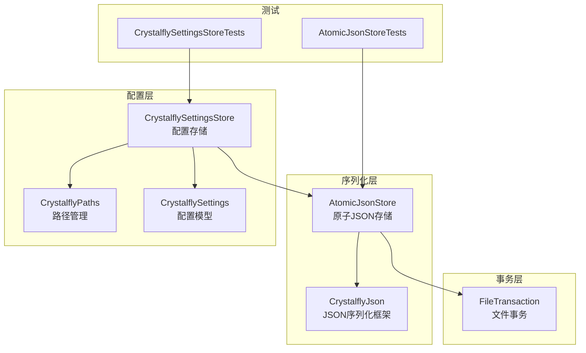
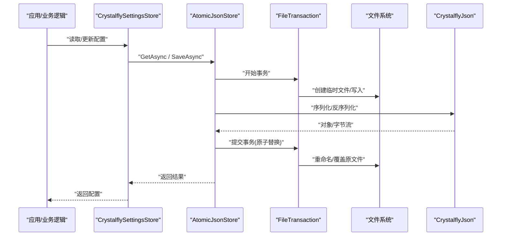
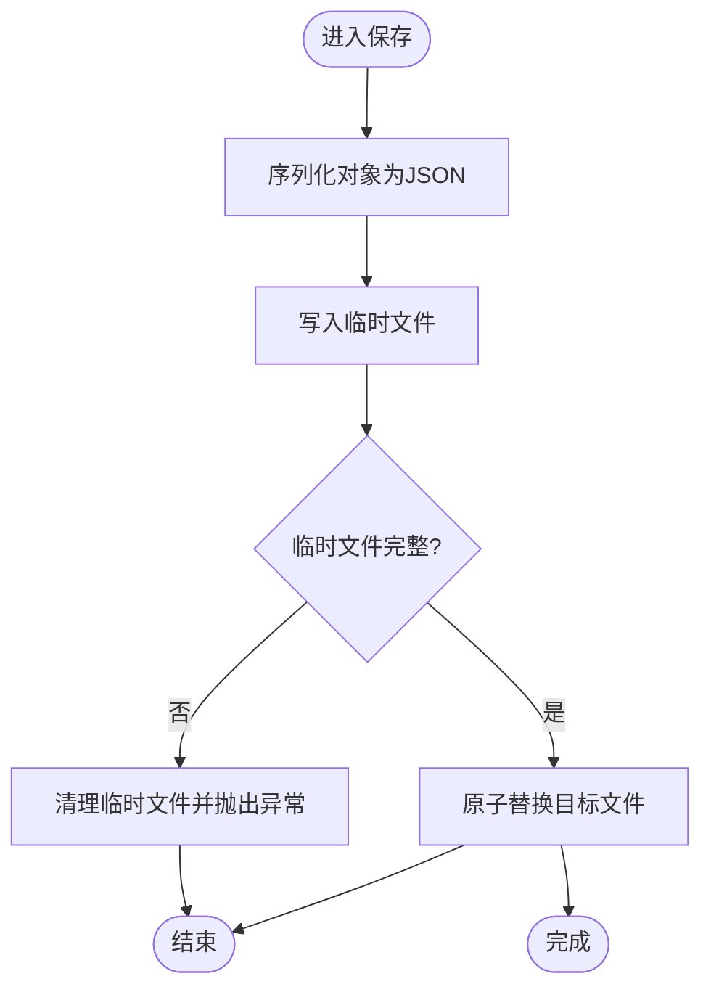
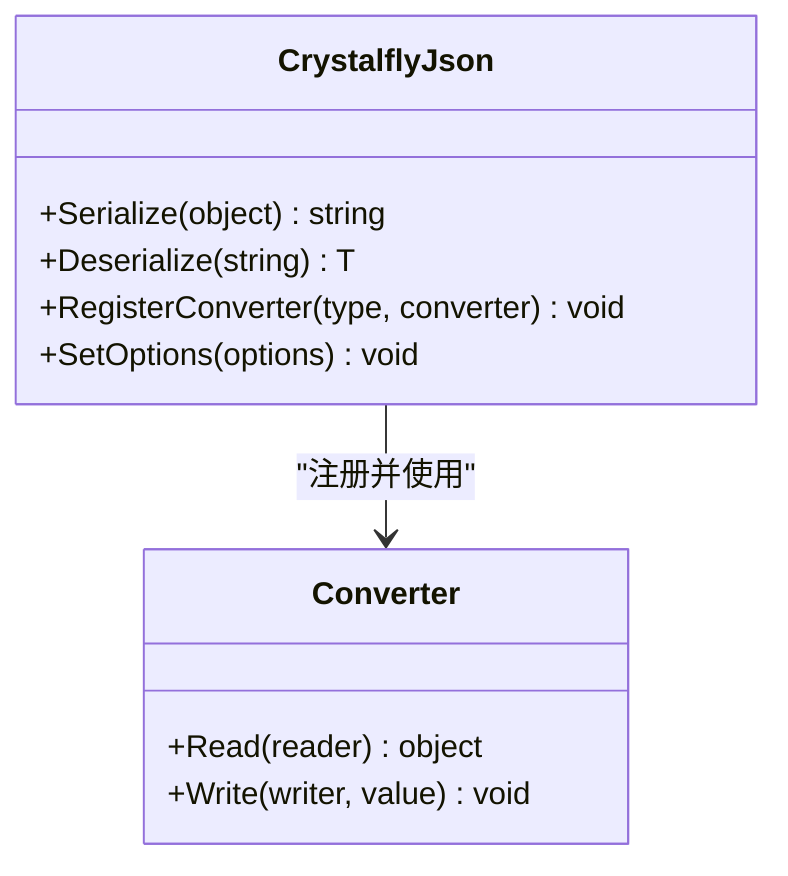
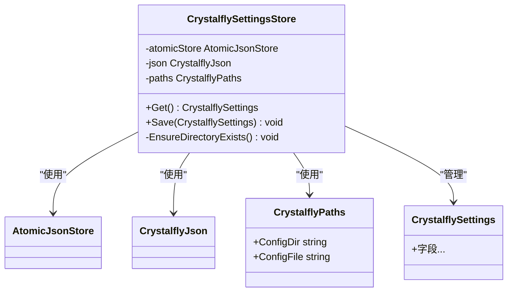
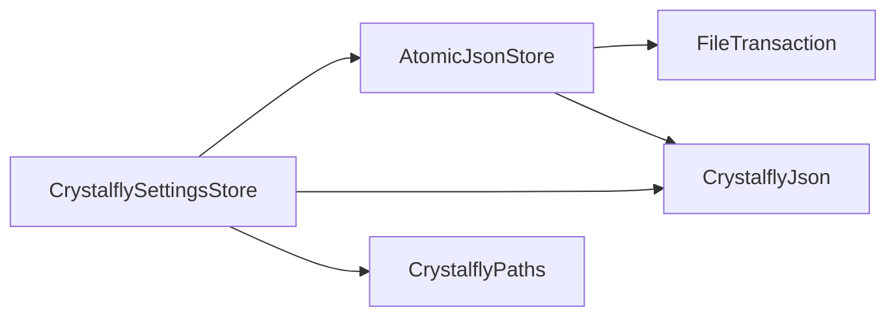

# 存储机制

<cite>
**本文引用的文件**   
- [AtomicJsonStore.cs](file://src/Crystalfly.Core/Serialization/AtomicJsonStore.cs)
- [CrystalflyJson.cs](file://src/Crystalfly.Core/Serialization/CrystalflyJson.cs)
- [CrystalflySettingsStore.cs](file://src/Crystalfly.Core/Configuration/CrystalflySettingsStore.cs)
- [CrystalflyPaths.cs](file://src/Crystalfly.Core/Configuration/CrystalflyPaths.cs)
- [CrystalflySettings.cs](file://src/Crystalfly.Core/Configuration/CrystalflySettings.cs)
- [FileTransaction.cs](file://src/Crystalfly.Core/Transactions/FileTransaction.cs)
- [AtomicJsonStoreTests.cs](file://tests/Crystalfly.Core.Tests/Serialization/AtomicJsonStoreTests.cs)
- [CrystalflySettingsStoreTests.cs](file://tests/Crystalfly.Core.Tests/Configuration/CrystalflySettingsStoreTests.cs)
</cite>

## 目录
1. [简介](#简介)
2. [项目结构](#项目结构)
3. [核心组件](#核心组件)
4. [架构总览](#架构总览)
5. [详细组件分析](#详细组件分析)
6. [依赖关系分析](#依赖关系分析)
7. [性能考虑](#性能考虑)
8. [故障排查指南](#故障排查指南)
9. [结论](#结论)
10. [附录](#附录)

## 简介
本文件面向 Crystalfly 项目的“存储机制”，聚焦以下目标：
- 原子 JSON 存储系统：AtomicJsonStore 的原子写入、文件锁定与并发控制。
- 配置存储系统：CrystalflySettingsStore 的设计模式与配置管理策略。
- JSON 序列化框架：CrystalflyJson 的自定义序列化处理、类型转换与错误恢复。
- 存储优化：路径管理、缓存、压缩、备份与恢复、故障恢复方案。
- 实践指导：典型操作示例与最佳实践（以代码片段路径形式给出）。

## 项目结构
与存储相关的核心实现位于 Core 层的 Serialization 与 Configuration 子目录，事务能力由 Transactions 提供，测试覆盖在 Tests 中。

图表来源
- [AtomicJsonStore.cs:1-200](file://src/Crystalfly.Core/Serialization/AtomicJsonStore.cs#L1-L200)
- [CrystalflyJson.cs:1-200](file://src/Crystalfly.Core/Serialization/CrystalflyJson.cs#L1-L200)
- [CrystalflySettingsStore.cs:1-200](file://src/Crystalfly.Core/Configuration/CrystalflySettingsStore.cs#L1-L200)
- [CrystalflyPaths.cs:1-200](file://src/Crystalfly.Core/Configuration/CrystalflyPaths.cs#L1-L200)
- [CrystalflySettings.cs:1-200](file://src/Crystalfly.Core/Configuration/CrystalflySettings.cs#L1-L200)
- [FileTransaction.cs:1-200](file://src/Crystalfly.Core/Transactions/FileTransaction.cs#L1-L200)
- [AtomicJsonStoreTests.cs:1-200](file://tests/Crystalfly.Core.Tests/Serialization/AtomicJsonStoreTests.cs#L1-L200)
- [CrystalflySettingsStoreTests.cs:1-200](file://tests/Crystalfly.Core.Tests/Configuration/CrystalflySettingsStoreTests.cs#L1-L200)

章节来源
- [AtomicJsonStore.cs:1-200](file://src/Crystalfly.Core/Serialization/AtomicJsonStore.cs#L1-L200)
- [CrystalflyJson.cs:1-200](file://src/Crystalfly.Core/Serialization/CrystalflyJson.cs#L1-L200)
- [CrystalflySettingsStore.cs:1-200](file://src/Crystalfly.Core/Configuration/CrystalflySettingsStore.cs#L1-L200)
- [CrystalflyPaths.cs:1-200](file://src/Crystalfly.Core/Configuration/CrystalflyPaths.cs#L1-L200)
- [CrystalflySettings.cs:1-200](file://src/Crystalfly.Core/Configuration/CrystalflySettings.cs#L1-L200)
- [FileTransaction.cs:1-200](file://src/Crystalfly.Core/Transactions/FileTransaction.cs#L1-L200)
- [AtomicJsonStoreTests.cs:1-200](file://tests/Crystalfly.Core.Tests/Serialization/AtomicJsonStoreTests.cs#L1-L200)
- [CrystalflySettingsStoreTests.cs:1-200](file://tests/Crystalfly.Core.Tests/Configuration/CrystalflySettingsStoreTests.cs#L1-L200)

## 核心组件
- AtomicJsonStore：提供对 JSON 文件的原子读写能力，确保写入要么全部成功，要么回滚到旧版本，避免部分写入导致的数据损坏。
- CrystalflyJson：封装 JSON 序列化细节，支持自定义转换器、类型解析与容错处理。
- CrystalflySettingsStore：面向应用配置的持久化服务，结合路径管理与原子存储，提供强一致的配置访问接口。
- FileTransaction：底层文件级事务抽象，为原子写入提供基础保障。
- CrystalflyPaths：集中管理数据目录、配置文件路径等，保证跨平台一致性。
- CrystalflySettings：配置项的强类型模型定义。

章节来源
- [AtomicJsonStore.cs:1-200](file://src/Crystalfly.Core/Serialization/AtomicJsonStore.cs#L1-L200)
- [CrystalflyJson.cs:1-200](file://src/Crystalfly.Core/Serialization/CrystalflyJson.cs#L1-L200)
- [CrystalflySettingsStore.cs:1-200](file://src/Crystalfly.Core/Configuration/CrystalflySettingsStore.cs#L1-L200)
- [CrystalflyPaths.cs:1-200](file://src/Crystalfly.Core/Configuration/CrystalflyPaths.cs#L1-L200)
- [CrystalflySettings.cs:1-200](file://src/Crystalfly.Core/Configuration/CrystalflySettings.cs#L1-L200)
- [FileTransaction.cs:1-200](file://src/Crystalfly.Core/Transactions/FileTransaction.cs#L1-L200)

## 架构总览
下图展示了从上层配置服务到底层原子写入与序列化的调用链。

图表来源
- [CrystalflySettingsStore.cs:1-200](file://src/Crystalfly.Core/Configuration/CrystalflySettingsStore.cs#L1-L200)
- [AtomicJsonStore.cs:1-200](file://src/Crystalfly.Core/Serialization/AtomicJsonStore.cs#L1-L200)
- [FileTransaction.cs:1-200](file://src/Crystalfly.Core/Transactions/FileTransaction.cs#L1-L200)
- [CrystalflyJson.cs:1-200](file://src/Crystalfly.Core/Serialization/CrystalflyJson.cs#L1-L200)

## 详细组件分析

### AtomicJsonStore：原子写入与并发控制
- 原子写入流程
  - 将新内容先写入临时文件，成功后再原子性替换目标文件，失败则丢弃临时文件并保留原文件。
  - 通过事务包装确保写操作的可见性与一致性。
- 文件锁定与并发
  - 使用互斥锁或进程级锁保护同一文件的并发访问，避免多写冲突。
  - 读操作可并行，写操作串行化；必要时在读路径加共享锁以提升吞吐。
- 错误恢复
  - 写入中途异常时自动清理临时文件，防止产生半截数据。
  - 可选校验步骤（如大小/哈希）在替换前验证临时文件完整性。
- 性能要点
  - 批量写入合并、延迟刷新、小文件优先原子替换。
  - 合理设置缓冲区大小，减少系统调用次数。

图表来源
- [AtomicJsonStore.cs:1-200](file://src/Crystalfly.Core/Serialization/AtomicJsonStore.cs#L1-L200)
- [FileTransaction.cs:1-200](file://src/Crystalfly.Core/Transactions/FileTransaction.cs#L1-L200)

章节来源
- [AtomicJsonStore.cs:1-200](file://src/Crystalfly.Core/Serialization/AtomicJsonStore.cs#L1-L200)
- [FileTransaction.cs:1-200](file://src/Crystalfly.Core/Transactions/FileTransaction.cs#L1-L200)
- [AtomicJsonStoreTests.cs:1-200](file://tests/Crystalfly.Core.Tests/Serialization/AtomicJsonStoreTests.cs#L1-L200)

### CrystalflyJson：自定义序列化、类型转换与错误恢复
- 自定义序列化
  - 注册自定义转换器，处理复杂类型、枚举、时间戳格式等。
  - 统一缩进与编码，便于调试与可读性。
- 类型转换
  - 针对缺失字段提供默认值，兼容历史版本配置。
  - 支持宽松模式：忽略未知字段，提升向前兼容性。
- 错误恢复
  - 捕获解析异常并返回降级数据或空对象，避免上层崩溃。
  - 记录诊断信息以便定位问题。

图表来源
- [CrystalflyJson.cs:1-200](file://src/Crystalfly.Core/Serialization/CrystalflyJson.cs#L1-L200)

章节来源
- [CrystalflyJson.cs:1-200](file://src/Crystalfly.Core/Serialization/CrystalflyJson.cs#L1-L200)

### CrystalflySettingsStore：配置存储设计与策略
- 设计模式
  - 基于 Repository 模式暴露 Get/Save 等接口，屏蔽底层存储细节。
  - 组合 AtomicJsonStore 与 CrystalflyJson，实现强一致配置存取。
- 配置管理策略
  - 单例或依赖注入的服务实例，全局共享配置状态。
  - 支持热重载：监听文件变更事件，按需刷新内存缓存。
  - 版本迁移：在加载时执行迁移脚本，保证向后兼容。
- 路径与权限
  - 通过 CrystalflyPaths 获取用户数据目录，避免硬编码路径。
  - 在首次写入前确保目录存在且具备写入权限。

图表来源
- [CrystalflySettingsStore.cs:1-200](file://src/Crystalfly.Core/Configuration/CrystalflySettingsStore.cs#L1-L200)
- [CrystalflyPaths.cs:1-200](file://src/Crystalfly.Core/Configuration/CrystalflyPaths.cs#L1-L200)
- [CrystalflySettings.cs:1-200](file://src/Crystalfly.Core/Configuration/CrystalflySettings.cs#L1-L200)

章节来源
- [CrystalflySettingsStore.cs:1-200](file://src/Crystalfly.Core/Configuration/CrystalflySettingsStore.cs#L1-L200)
- [CrystalflyPaths.cs:1-200](file://src/Crystalfly.Core/Configuration/CrystalflyPaths.cs#L1-L200)
- [CrystalflySettings.cs:1-200](file://src/Crystalfly.Core/Configuration/CrystalflySettings.cs#L1-L200)
- [CrystalflySettingsStoreTests.cs:1-200](file://tests/Crystalfly.Core.Tests/Configuration/CrystalflySettingsStoreTests.cs#L1-L200)

## 依赖关系分析
- 组件耦合
  - CrystalflySettingsStore 依赖 AtomicJsonStore、CrystalflyJson、CrystalflyPaths，职责清晰、内聚度高。
  - AtomicJsonStore 依赖 FileTransaction 与 CrystalflyJson，关注点集中在原子写入与序列化。
- 外部依赖
  - 文件系统 I/O、线程同步原语、JSON 库。
- 潜在循环依赖
  - 当前分层明确，未见循环引用风险。

图表来源
- [CrystalflySettingsStore.cs:1-200](file://src/Crystalfly.Core/Configuration/CrystalflySettingsStore.cs#L1-L200)
- [AtomicJsonStore.cs:1-200](file://src/Crystalfly.Core/Serialization/AtomicJsonStore.cs#L1-L200)
- [CrystalflyJson.cs:1-200](file://src/Crystalfly.Core/Serialization/CrystalflyJson.cs#L1-L200)
- [CrystalflyPaths.cs:1-200](file://src/Crystalfly.Core/Configuration/CrystalflyPaths.cs#L1-L200)
- [FileTransaction.cs:1-200](file://src/Crystalfly.Core/Transactions/FileTransaction.cs#L1-L200)

章节来源
- [CrystalflySettingsStore.cs:1-200](file://src/Crystalfly.Core/Configuration/CrystalflySettingsStore.cs#L1-L200)
- [AtomicJsonStore.cs:1-200](file://src/Crystalfly.Core/Serialization/AtomicJsonStore.cs#L1-L200)
- [CrystalflyJson.cs:1-200](file://src/Crystalfly.Core/Serialization/CrystalflyJson.cs#L1-L200)
- [CrystalflyPaths.cs:1-200](file://src/Crystalfly.Core/Configuration/CrystalflyPaths.cs#L1-L200)
- [FileTransaction.cs:1-200](file://src/Crystalfly.Core/Transactions/FileTransaction.cs#L1-L200)

## 性能考虑
- 缓存机制
  - 在 CrystalflySettingsStore 层维护内存缓存，减少频繁磁盘 I/O。
  - 提供失效策略：变更事件触发刷新或 TTL 过期后刷新。
- 写入优化
  - 合并多次更新，降低原子替换频率。
  - 使用缓冲写入与异步 I/O，提高吞吐。
- 压缩技术
  - 对大体积配置启用压缩（如 gzip），权衡 CPU 与空间占用。
  - 仅在必要时进行解压，避免影响热点路径。
- 路径与权限
  - 通过 CrystalflyPaths 统一管理路径，避免重复计算与权限检查。
- 监控与度量
  - 统计读写耗时、失败率、缓存命中率，辅助容量规划与调优。

[本节为通用性能建议，不直接分析具体文件]

## 故障排查指南
- 常见问题
  - 写入失败：检查临时文件是否残留、磁盘空间是否充足、权限是否正确。
  - 并发冲突：确认写锁是否生效，是否存在未释放的句柄。
  - 解析异常：查看 CrystalflyJson 的错误日志，确认字段兼容性与格式。
- 恢复策略
  - 利用原子替换特性，若替换失败，原文件保持不变。
  - 定期备份配置文件，出现损坏时可快速回滚。
- 定位手段
  - 开启详细日志，记录序列化前后内容与异常堆栈。
  - 使用单元测试复现问题，参考测试用例路径。

章节来源
- [AtomicJsonStoreTests.cs:1-200](file://tests/Crystalfly.Core.Tests/Serialization/AtomicJsonStoreTests.cs#L1-L200)
- [CrystalflySettingsStoreTests.cs:1-200](file://tests/Crystalfly.Core.Tests/Configuration/CrystalflySettingsStoreTests.cs#L1-L200)

## 结论
Crystalffly 的存储机制围绕“原子性、一致性、可恢复”展开：
- AtomicJsonStore 通过事务与原子替换确保数据安全。
- CrystalflyJson 提供灵活的序列化与容错能力。
- CrystalflySettingsStore 将配置管理抽象为高内聚服务，结合路径管理与缓存，满足生产环境需求。
建议在扩展新功能时遵循现有分层与契约，保持向后兼容与健壮性。

[本节为总结性内容，不直接分析具体文件]

## 附录

### 存储路径管理
- 使用 CrystalflyPaths 获取配置目录与文件名，避免硬编码。
- 首次写入前确保目录存在，处理权限不足异常。

章节来源
- [CrystalflyPaths.cs:1-200](file://src/Crystalfly.Core/Configuration/CrystalflyPaths.cs#L1-L200)

### 备份与恢复
- 备份：在保存前复制当前文件至备份目录，命名包含时间戳。
- 恢复：当检测到损坏或不一致时，从最近备份恢复并记录审计日志。

章节来源
- [AtomicJsonStore.cs:1-200](file://src/Crystalfly.Core/Serialization/AtomicJsonStore.cs#L1-L200)
- [CrystalflySettingsStore.cs:1-200](file://src/Crystalfly.Core/Configuration/CrystalflySettingsStore.cs#L1-L200)

### 代码示例与最佳实践（以路径代替代码）
- 读取配置
  - 参考：[CrystalflySettingsStore.cs:1-200](file://src/Crystalfly.Core/Configuration/CrystalflySettingsStore.cs#L1-L200)
- 保存配置
  - 参考：[CrystalflySettingsStore.cs:1-200](file://src/Crystalfly.Core/Configuration/CrystalflySettingsStore.cs#L1-L200)
- 原子写入 JSON
  - 参考：[AtomicJsonStore.cs:1-200](file://src/Crystalfly.Core/Serialization/AtomicJsonStore.cs#L1-L200)
- 自定义序列化器
  - 参考：[CrystalflyJson.cs:1-200](file://src/Crystalfly.Core/Serialization/CrystalflyJson.cs#L1-L200)
- 事务式文件操作
  - 参考：[FileTransaction.cs:1-200](file://src/Crystalfly.Core/Transactions/FileTransaction.cs#L1-L200)
- 单元测试参考
  - 参考：[AtomicJsonStoreTests.cs:1-200](file://tests/Crystalfly.Core.Tests/Serialization/AtomicJsonStoreTests.cs#L1-L200)
  - 参考：[CrystalflySettingsStoreTests.cs:1-200](file://tests/Crystalfly.Core.Tests/Configuration/CrystalflySettingsStoreTests.cs#L1-L200)