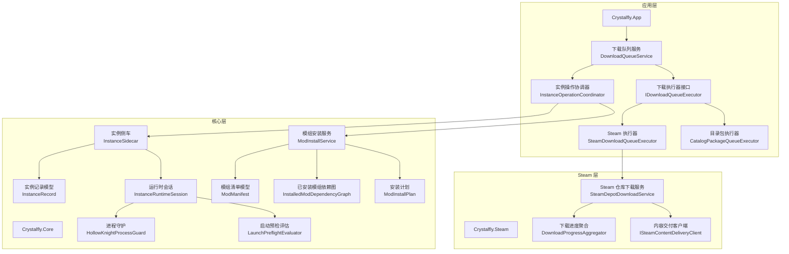
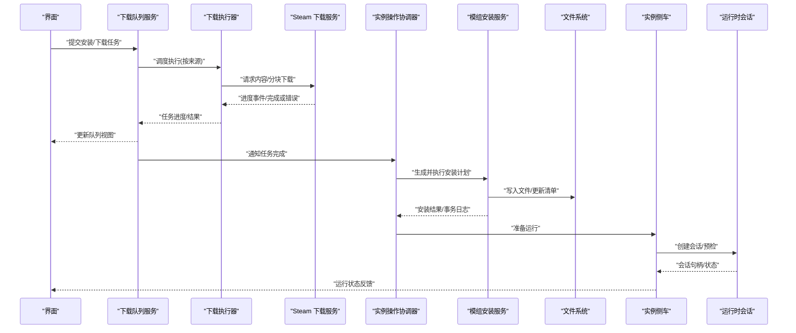
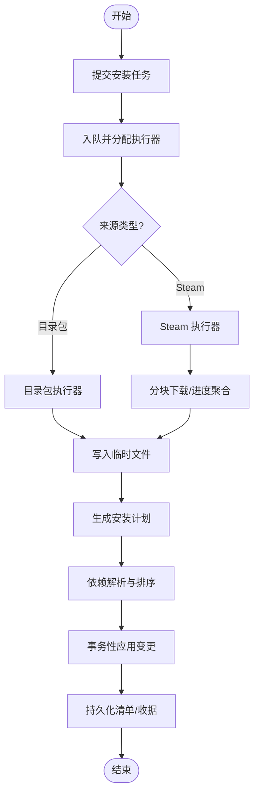
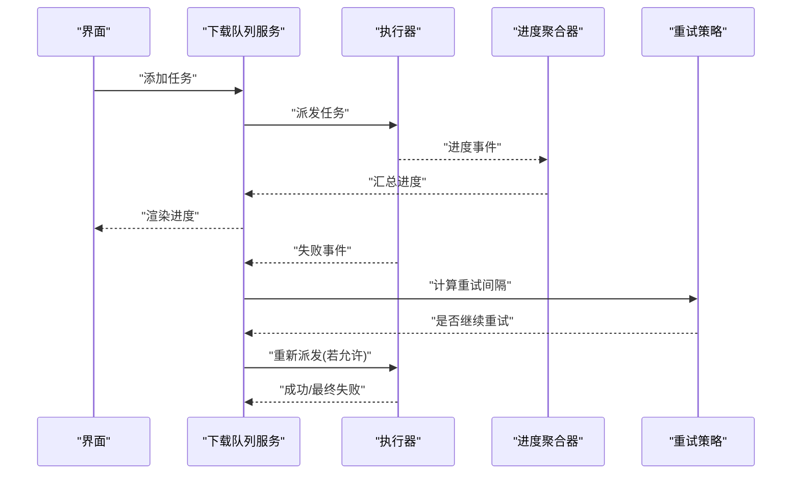
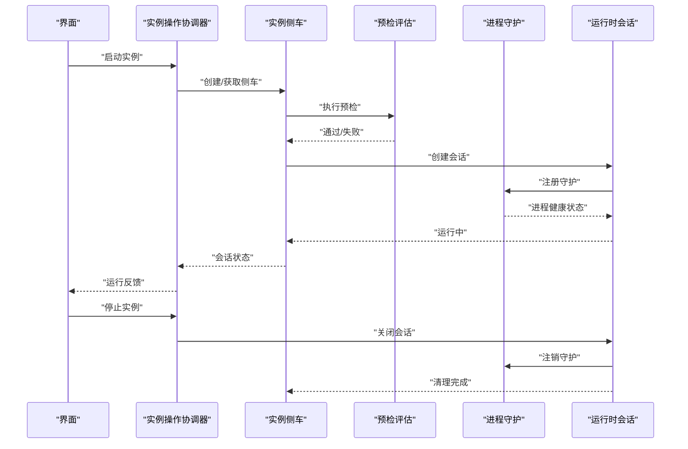
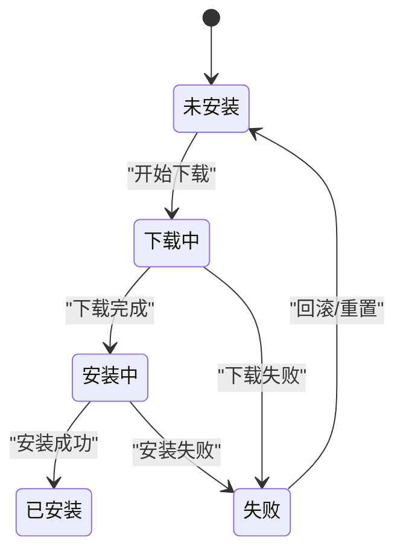
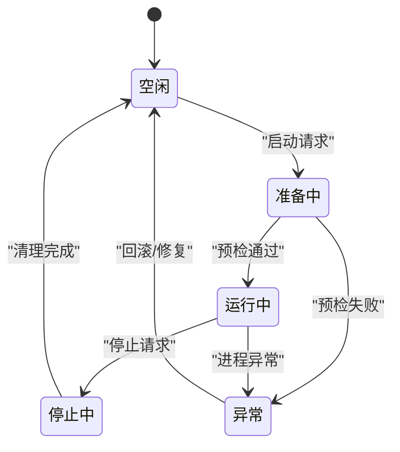
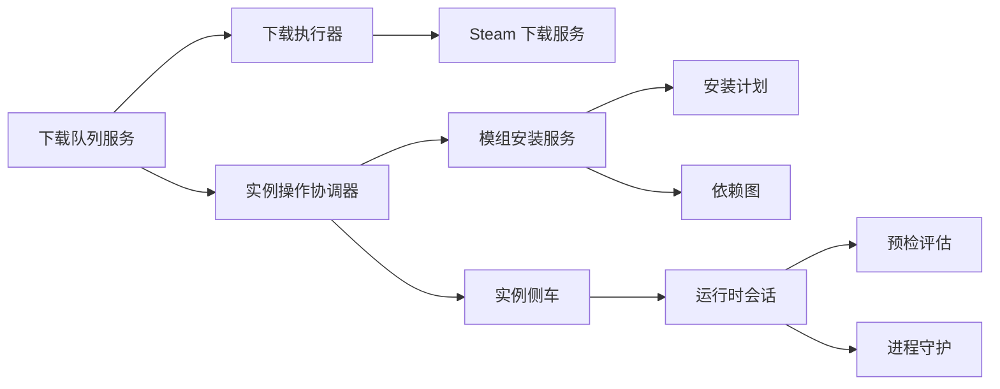

# 数据流图与状态转换

<cite>
**本文引用的文件**   
- [src/Crystalfly.App/Downloads/DownloadQueueService.cs](file://src/Crystalfly.App/Downloads/DownloadQueueService.cs)
- [src/Crystalfly.App/Downloads/CatalogPackageQueueExecutor.cs](file://src/Crystalfly.App/Downloads/CatalogPackageQueueExecutor.cs)
- [src/Crystalfly.App/Downloads/SteamDownloadQueueExecutor.cs](file://src/Crystalfly.App/Downloads/SteamDownloadQueueExecutor.cs)
- [src/Crystalfly.App/Downloads/InstanceOperationCoordinator.cs](file://src/Crystalfly.App/Downloads/InstanceOperationCoordinator.cs)
- [src/Crystalfly.App/Downloads/ModInstallQueueGroupFactory.cs](file://src/Crystalfly.App/Downloads/ModInstallQueueGroupFactory.cs)
- [src/Crystalfly.App/Downloads/ModDependencyRepairQueueGroupFactory.cs](file://src/Crystalfly.App/Downloads/ModDependencyRepairQueueGroupFactory.cs)
- [src/Crystalfly.App/Downloads/SteamDownloadQueueGroupFactory.cs](file://src/Crystalfly.App/Downloads/SteamDownloadQueueGroupFactory.cs)
- [src/Crystalfly.App/Downloads/IDownloadQueueExecutor.cs](file://src/Crystalfly.App/Downloads/IDownloadQueueExecutor.cs)
- [src/Crystalfly.App/Downloads/DownloadQueueModels.cs](file://src/Crystalfly.App/Downloads/DownloadQueueModels.cs)
- [src/Crystalfly.Core/Mods/ModInstallService.cs](file://src/Crystalfly.Core/Mods/ModInstallService.cs)
- [src/Crystalfly.Core/Mods/ModInstallPlan.cs](file://src/Crystalfly.Core/Mods/ModInstallPlan.cs)
- [src/Crystalfly.Core/Mods/InstalledModDependencyGraph.cs](file://src/Crystalfly.Core/Mods/InstalledModDependencyGraph.cs)
- [src/Crystalfly.Core/Mods/ModManager.cs](file://src/Crystalfly.Core/Mods/ModManager.cs)
- [src/Crystalfly.Core/Instances/InstanceSidecar.cs](file://src/Crystalfly.Core/Instances/InstanceSidecar.cs)
- [src/Crystalfly.Core/Runtime/InstanceRuntimeSession.cs](file://src/Crystalfly.Core/Runtime/InstanceRuntimeSession.cs)
- [src/Crystalfly.Core/Runtime/LaunchPreflightEvaluator.cs](file://src/Crystalfly.Core/Runtime/LaunchPreflightEvaluator.cs)
- [src/Crystalfly.Core/Runtime/HollowKnightProcessGuard.cs](file://src/Crystalfly.Core/Runtime/HollowKnightProcessGuard.cs)
- [src/Crystalfly.Core/Models/ModManifest.cs](file://src/Crystalfly.Core/Models/ModManifest.cs)
- [src/Crystalfly.Core/Models/InstanceRecord.cs](file://src/Crystalfly.Core/Models/InstanceRecord.cs)
- [src/Crystalfly.Steam/Downloads/SteamDepotDownloadService.cs](file://src/Crystalfly.Steam/Downloads/SteamDepotDownloadService.cs)
- [src/Crystalfly.Steam/Downloads/ISteamContentDeliveryClient.cs](file://src/Crystalfly.Steam/Downloads/ISteamContentDeliveryClient.cs)
- [src/Crystalfly.Steam/Downloads/DownloadProgressAggregator.cs](file://src/Crystalfly.Steam/Downloads/DownloadProgressAggregator.cs)
</cite>

## 目录
1. [简介](#简介)
2. [项目结构](#项目结构)
3. [核心组件](#核心组件)
4. [架构总览](#架构总览)
5. [详细组件分析](#详细组件分析)
6. [依赖关系分析](#依赖关系分析)
7. [性能考虑](#性能考虑)
8. [故障排查指南](#故障排查指南)
9. [结论](#结论)
10. [附录](#附录)

## 简介
本文件聚焦 Crystalfly 的数据流与状态转换，覆盖以下关键流程：
- 模组安装流程：从用户操作到文件落盘的全链路数据流向。
- 下载队列处理流程：任务调度、进度聚合、错误重试与回退。
- 实例运行时会话流程：启动前检查、进程保护、资源清理。
同时给出 ModManifest 与 InstanceRecord 的状态机、异常处理与回滚机制，以及监控与调试方法。

## 项目结构
围绕数据流与状态的核心代码分布在三个工程：
- Crystalfly.App：UI 与下载队列编排（队列服务、执行器、协调器）。
- Crystalfly.Core：领域模型与服务（模组安装、实例侧车、运行时会话、预检评估、进程守护）。
- Crystalfly.Steam：Steam 内容分发客户端与下载进度聚合。

图表来源
- [src/Crystalfly.App/Downloads/DownloadQueueService.cs](file://src/Crystalfly.App/Downloads/DownloadQueueService.cs)
- [src/Crystalfly.App/Downloads/CatalogPackageQueueExecutor.cs](file://src/Crystalfly.App/Downloads/CatalogPackageQueueExecutor.cs)
- [src/Crystalfly.App/Downloads/SteamDownloadQueueExecutor.cs](file://src/Crystalfly.App/Downloads/SteamDownloadQueueExecutor.cs)
- [src/Crystalfly.App/Downloads/InstanceOperationCoordinator.cs](file://src/Crystalfly.App/Downloads/InstanceOperationCoordinator.cs)
- [src/Crystalfly.Core/Mods/ModInstallService.cs](file://src/Crystalfly.Core/Mods/ModInstallService.cs)
- [src/Crystalfly.Core/Mods/ModInstallPlan.cs](file://src/Crystalfly.Core/Mods/ModInstallPlan.cs)
- [src/Crystalfly.Core/Mods/InstalledModDependencyGraph.cs](file://src/Crystalfly.Core/Mods/InstalledModDependencyGraph.cs)
- [src/Crystalfly.Core/Instances/InstanceSidecar.cs](file://src/Crystalfly.Core/Instances/InstanceSidecar.cs)
- [src/Crystalfly.Core/Runtime/InstanceRuntimeSession.cs](file://src/Crystalfly.Core/Runtime/InstanceRuntimeSession.cs)
- [src/Crystalfly.Core/Runtime/LaunchPreflightEvaluator.cs](file://src/Crystalfly.Core/Runtime/LaunchPreflightEvaluator.cs)
- [src/Crystalfly.Core/Runtime/HollowKnightProcessGuard.cs](file://src/Crystalfly.Core/Runtime/HollowKnightProcessGuard.cs)
- [src/Crystalfly.Core/Models/ModManifest.cs](file://src/Crystalfly.Core/Models/ModManifest.cs)
- [src/Crystalfly.Core/Models/InstanceRecord.cs](file://src/Crystalfly.Core/Models/InstanceRecord.cs)
- [src/Crystalfly.Steam/Downloads/SteamDepotDownloadService.cs](file://src/Crystalfly.Steam/Downloads/SteamDepotDownloadService.cs)
- [src/Crystalfly.Steam/Downloads/ISteamContentDeliveryClient.cs](file://src/Crystalfly.Steam/Downloads/ISteamContentDeliveryClient.cs)
- [src/Crystalfly.Steam/Downloads/DownloadProgressAggregator.cs](file://src/Crystalfly.Steam/Downloads/DownloadProgressAggregator.cs)

章节来源
- [src/Crystalfly.App/Downloads/DownloadQueueService.cs](file://src/Crystalfly.App/Downloads/DownloadQueueService.cs)
- [src/Crystalfly.Core/Mods/ModInstallService.cs](file://src/Crystalfly.Core/Mods/ModInstallService.cs)
- [src/Crystalfly.Core/Instances/InstanceSidecar.cs](file://src/Crystalfly.Core/Instances/InstanceSidecar.cs)
- [src/Crystalfly.Core/Runtime/InstanceRuntimeSession.cs](file://src/Crystalfly.Core/Runtime/InstanceRuntimeSession.cs)
- [src/Crystalfly.Steam/Downloads/SteamDepotDownloadService.cs](file://src/Crystalfly.Steam/Downloads/SteamDepotDownloadService.cs)

## 核心组件
- 下载队列服务：负责将下载任务入队、调度执行器、聚合进度、失败重试与取消。
- 下载执行器：抽象不同来源的下载实现（目录包、Steam），统一进度与结果上报。
- 实例操作协调器：在 UI 与核心服务之间协调“安装/修复/运行”等跨域操作。
- 模组安装服务：基于安装计划与依赖图执行安装事务，保证原子性与可回滚。
- 实例侧车与会话：封装实例生命周期、启动预检、进程守护与资源清理。
- Steam 下载服务与客户端：对接 Steam 内容分发，提供分块下载与进度聚合。

章节来源
- [src/Crystalfly.App/Downloads/DownloadQueueService.cs](file://src/Crystalfly.App/Downloads/DownloadQueueService.cs)
- [src/Crystalfly.App/Downloads/IDownloadQueueExecutor.cs](file://src/Crystalfly.App/Downloads/IDownloadQueueExecutor.cs)
- [src/Crystalfly.App/Downloads/CatalogPackageQueueExecutor.cs](file://src/Crystalfly.App/Downloads/CatalogPackageQueueExecutor.cs)
- [src/Crystalfly.App/Downloads/SteamDownloadQueueExecutor.cs](file://src/Crystalfly.App/Downloads/SteamDownloadQueueExecutor.cs)
- [src/Crystalfly.App/Downloads/InstanceOperationCoordinator.cs](file://src/Crystalfly.App/Downloads/InstanceOperationCoordinator.cs)
- [src/Crystalfly.Core/Mods/ModInstallService.cs](file://src/Crystalfly.Core/Mods/ModInstallService.cs)
- [src/Crystalfly.Core/Mods/ModInstallPlan.cs](file://src/Crystalfly.Core/Mods/ModInstallPlan.cs)
- [src/Crystalfly.Core/Mods/InstalledModDependencyGraph.cs](file://src/Crystalfly.Core/Mods/InstalledModDependencyGraph.cs)
- [src/Crystalfly.Core/Instances/InstanceSidecar.cs](file://src/Crystalfly.Core/Instances/InstanceSidecar.cs)
- [src/Crystalfly.Core/Runtime/InstanceRuntimeSession.cs](file://src/Crystalfly.Core/Runtime/InstanceRuntimeSession.cs)
- [src/Crystalfly.Steam/Downloads/SteamDepotDownloadService.cs](file://src/Crystalfly.Steam/Downloads/SteamDepotDownloadService.cs)
- [src/Crystalfly.Steam/Downloads/DownloadProgressAggregator.cs](file://src/Crystalfly.Steam/Downloads/DownloadProgressAggregator.cs)

## 架构总览
下图展示从 UI 触发到最终落盘与运行的端到端数据流。

图表来源
- [src/Crystalfly.App/Downloads/DownloadQueueService.cs](file://src/Crystalfly.App/Downloads/DownloadQueueService.cs)
- [src/Crystalfly.App/Downloads/SteamDownloadQueueExecutor.cs](file://src/Crystalfly.App/Downloads/SteamDownloadQueueExecutor.cs)
- [src/Crystalfly.Steam/Downloads/SteamDepotDownloadService.cs](file://src/Crystalfly.Steam/Downloads/SteamDepotDownloadService.cs)
- [src/Crystalfly.App/Downloads/InstanceOperationCoordinator.cs](file://src/Crystalfly.App/Downloads/InstanceOperationCoordinator.cs)
- [src/Crystalfly.Core/Mods/ModInstallService.cs](file://src/Crystalfly.Core/Mods/ModInstallService.cs)
- [src/Crystalfly.Core/Instances/InstanceSidecar.cs](file://src/Crystalfly.Core/Instances/InstanceSidecar.cs)
- [src/Crystalfly.Core/Runtime/InstanceRuntimeSession.cs](file://src/Crystalfly.Core/Runtime/InstanceRuntimeSession.cs)

## 详细组件分析

### 模组安装流程（从用户操作到文件落盘）
- 入口：用户在界面发起安装，由下载队列服务接收并调度对应执行器。
- 下载阶段：根据来源选择 Catalog 或 Steam 执行器；Steam 路径通过 Steam 下载服务与内容交付客户端进行分块下载，进度经聚合器汇总后回调队列服务。
- 安装阶段：协调器收到完成信号后，调用模组安装服务生成安装计划，结合依赖图确定顺序与冲突策略，执行事务性写入与清单更新。
- 落盘与持久化：安装服务对目标目录进行原子写入，更新 ModManifest 与相关收据，确保一致性。

图表来源
- [src/Crystalfly.App/Downloads/CatalogPackageQueueExecutor.cs](file://src/Crystalfly.App/Downloads/CatalogPackageQueueExecutor.cs)
- [src/Crystalfly.App/Downloads/SteamDownloadQueueExecutor.cs](file://src/Crystalfly.App/Downloads/SteamDownloadQueueExecutor.cs)
- [src/Crystalfly.Steam/Downloads/SteamDepotDownloadService.cs](file://src/Crystalfly.Steam/Downloads/SteamDepotDownloadService.cs)
- [src/Crystalfly.App/Downloads/DownloadQueueService.cs](file://src/Crystalfly.App/Downloads/DownloadQueueService.cs)
- [src/Crystalfly.Core/Mods/ModInstallService.cs](file://src/Crystalfly.Core/Mods/ModInstallService.cs)
- [src/Crystalfly.Core/Mods/ModInstallPlan.cs](file://src/Crystalfly.Core/Mods/ModInstallPlan.cs)
- [src/Crystalfly.Core/Mods/InstalledModDependencyGraph.cs](file://src/Crystalfly.Core/Mods/InstalledModDependencyGraph.cs)

章节来源
- [src/Crystalfly.App/Downloads/DownloadQueueService.cs](file://src/Crystalfly.App/Downloads/DownloadQueueService.cs)
- [src/Crystalfly.App/Downloads/CatalogPackageQueueExecutor.cs](file://src/Crystalfly.App/Downloads/CatalogPackageQueueExecutor.cs)
- [src/Crystalfly.App/Downloads/SteamDownloadQueueExecutor.cs](file://src/Crystalfly.App/Downloads/SteamDownloadQueueExecutor.cs)
- [src/Crystalfly.Core/Mods/ModInstallService.cs](file://src/Crystalfly.Core/Mods/ModInstallService.cs)
- [src/Crystalfly.Core/Mods/ModInstallPlan.cs](file://src/Crystalfly.Core/Mods/ModInstallPlan.cs)
- [src/Crystalfly.Core/Mods/InstalledModDependencyGraph.cs](file://src/Crystalfly.Core/Mods/InstalledModDependencyGraph.cs)

### 下载队列处理流程（任务调度、进度跟踪、错误重试）
- 任务调度：队列服务维护任务集合，按优先级/并发度调度执行器。
- 进度跟踪：各执行器上报进度事件，聚合器合并多源进度，UI 实时刷新。
- 错误重试：网络/权限/校验失败时，队列服务支持指数退避与最大重试次数；不可恢复错误标记为失败并允许用户干预。

图表来源
- [src/Crystalfly.App/Downloads/DownloadQueueService.cs](file://src/Crystalfly.App/Downloads/DownloadQueueService.cs)
- [src/Crystalfly.App/Downloads/IDownloadQueueExecutor.cs](file://src/Crystalfly.App/Downloads/IDownloadQueueExecutor.cs)
- [src/Crystalfly.Steam/Downloads/DownloadProgressAggregator.cs](file://src/Crystalfly.Steam/Downloads/DownloadProgressAggregator.cs)

章节来源
- [src/Crystalfly.App/Downloads/DownloadQueueService.cs](file://src/Crystalfly.App/Downloads/DownloadQueueService.cs)
- [src/Crystalfly.Steam/Downloads/DownloadProgressAggregator.cs](file://src/Crystalfly.Steam/Downloads/DownloadProgressAggregator.cs)

### 实例运行时会话流程（启动前检查、进程保护、资源清理）
- 启动前检查：预检评估器验证环境、依赖、版本与完整性。
- 进程保护：守护器监控游戏进程，防止意外退出或重复启动。
- 资源清理：会话结束时释放句柄、清理临时文件、更新实例记录。

图表来源
- [src/Crystalfly.Core/Runtime/LaunchPreflightEvaluator.cs](file://src/Crystalfly.Core/Runtime/LaunchPreflightEvaluator.cs)
- [src/Crystalfly.Core/Runtime/HollowKnightProcessGuard.cs](file://src/Crystalfly.Core/Runtime/HollowKnightProcessGuard.cs)
- [src/Crystalfly.Core/Runtime/InstanceRuntimeSession.cs](file://src/Crystalfly.Core/Runtime/InstanceRuntimeSession.cs)
- [src/Crystalfly.Core/Instances/InstanceSidecar.cs](file://src/Crystalfly.Core/Instances/InstanceSidecar.cs)
- [src/Crystalfly.App/Downloads/InstanceOperationCoordinator.cs](file://src/Crystalfly.App/Downloads/InstanceOperationCoordinator.cs)

章节来源
- [src/Crystalfly.Core/Runtime/LaunchPreflightEvaluator.cs](file://src/Crystalfly.Core/Runtime/LaunchPreflightEvaluator.cs)
- [src/Crystalfly.Core/Runtime/HollowKnightProcessGuard.cs](file://src/Crystalfly.Core/Runtime/HollowKnightProcessGuard.cs)
- [src/Crystalfly.Core/Runtime/InstanceRuntimeSession.cs](file://src/Crystalfly.Core/Runtime/InstanceRuntimeSession.cs)
- [src/Crystalfly.Core/Instances/InstanceSidecar.cs](file://src/Crystalfly.Core/Instances/InstanceSidecar.cs)
- [src/Crystalfly.App/Downloads/InstanceOperationCoordinator.cs](file://src/Crystalfly.App/Downloads/InstanceOperationCoordinator.cs)

### 对象状态转换图

#### ModManifest 状态机
- 未安装 → 下载中：进入下载阶段，标记待下载清单项。
- 下载中 → 安装中：下载完成，进入安装阶段。
- 安装中 → 已安装：事务性写入成功，更新清单与收据。
- 任意中间态 → 失败：出现不可恢复错误，保留部分日志以便诊断。

图表来源
- [src/Crystalfly.Core/Models/ModManifest.cs](file://src/Crystalfly.Core/Models/ModManifest.cs)
- [src/Crystalfly.Core/Mods/ModInstallService.cs](file://src/Crystalfly.Core/Mods/ModInstallService.cs)

#### InstanceRecord 生命周期状态
- 空闲：未被运行或操作占用。
- 准备中：启动前检查与资源准备。
- 运行中：会话已创建且进程受守护。
- 停止中：正在关闭会话与清理资源。
- 异常：发生错误，需人工介入或自动回滚。

图表来源
- [src/Crystalfly.Core/Models/InstanceRecord.cs](file://src/Crystalfly.Core/Models/InstanceRecord.cs)
- [src/Crystalfly.Core/Runtime/InstanceRuntimeSession.cs](file://src/Crystalfly.Core/Runtime/InstanceRuntimeSession.cs)
- [src/Crystalfly.Core/Instances/InstanceSidecar.cs](file://src/Crystalfly.Core/Instances/InstanceSidecar.cs)

### 数据传递方式与消息格式
- 队列任务消息：包含任务标识、来源类型、目标实例、参数与元数据（如重试计数、时间戳）。
- 进度事件：包含任务标识、累计字节、速度、百分比与来源子任务明细。
- 安装计划：包含待安装/卸载的模组列表、依赖拓扑、冲突解决策略与回滚点。
- 会话状态：包含实例标识、运行状态、进程 ID、资源句柄与错误上下文。

章节来源
- [src/Crystalfly.App/Downloads/DownloadQueueModels.cs](file://src/Crystalfly.App/Downloads/DownloadQueueModels.cs)
- [src/Crystalfly.Core/Mods/ModInstallPlan.cs](file://src/Crystalfly.Core/Mods/ModInstallPlan.cs)
- [src/Crystalfly.Core/Runtime/InstanceRuntimeSession.cs](file://src/Crystalfly.Core/Runtime/InstanceRuntimeSession.cs)

### 异常处理与状态回滚机制
- 下载异常：网络超时、校验失败、权限不足等触发重试；超过阈值则标记失败并提示用户。
- 安装异常：文件写入失败、依赖冲突、清单不一致等触发事务回滚，恢复到最近一致快照。
- 运行异常：进程崩溃、端口占用、资源泄漏等触发守护重启或会话重建；必要时清理临时文件并更新实例记录。

章节来源
- [src/Crystalfly.Core/Mods/ModInstallService.cs](file://src/Crystalfly.Core/Mods/ModInstallService.cs)
- [src/Crystalfly.Core/Runtime/InstanceRuntimeSession.cs](file://src/Crystalfly.Core/Runtime/InstanceRuntimeSession.cs)
- [src/Crystalfly.Core/Instances/InstanceSidecar.cs](file://src/Crystalfly.Core/Instances/InstanceSidecar.cs)

## 依赖关系分析
- 应用层依赖核心层的安装与运行时能力，并通过协调器解耦 UI 与业务。
- 下载执行器依赖 Steam 层的内容交付与进度聚合。
- 安装服务依赖依赖图与安装计划，确保幂等与可回滚。
- 运行时会话依赖预检与守护，保障稳定性与可观测性。

图表来源
- [src/Crystalfly.App/Downloads/DownloadQueueService.cs](file://src/Crystalfly.App/Downloads/DownloadQueueService.cs)
- [src/Crystalfly.App/Downloads/IDownloadQueueExecutor.cs](file://src/Crystalfly.App/Downloads/IDownloadQueueExecutor.cs)
- [src/Crystalfly.Steam/Downloads/SteamDepotDownloadService.cs](file://src/Crystalfly.Steam/Downloads/SteamDepotDownloadService.cs)
- [src/Crystalfly.App/Downloads/InstanceOperationCoordinator.cs](file://src/Crystalfly.App/Downloads/InstanceOperationCoordinator.cs)
- [src/Crystalfly.Core/Mods/ModInstallService.cs](file://src/Crystalfly.Core/Mods/ModInstallService.cs)
- [src/Crystalfly.Core/Mods/ModInstallPlan.cs](file://src/Crystalfly.Core/Mods/ModInstallPlan.cs)
- [src/Crystalfly.Core/Mods/InstalledModDependencyGraph.cs](file://src/Crystalfly.Core/Mods/InstalledModDependencyGraph.cs)
- [src/Crystalfly.Core/Instances/InstanceSidecar.cs](file://src/Crystalfly.Core/Instances/InstanceSidecar.cs)
- [src/Crystalfly.Core/Runtime/InstanceRuntimeSession.cs](file://src/Crystalfly.Core/Runtime/InstanceRuntimeSession.cs)
- [src/Crystalfly.Core/Runtime/LaunchPreflightEvaluator.cs](file://src/Crystalfly.Core/Runtime/LaunchPreflightEvaluator.cs)
- [src/Crystalfly.Core/Runtime/HollowKnightProcessGuard.cs](file://src/Crystalfly.Core/Runtime/HollowKnightProcessGuard.cs)

章节来源
- [src/Crystalfly.App/Downloads/DownloadQueueService.cs](file://src/Crystalfly.App/Downloads/DownloadQueueService.cs)
- [src/Crystalfly.Core/Mods/ModInstallService.cs](file://src/Crystalfly.Core/Mods/ModInstallService.cs)
- [src/Crystalfly.Core/Instances/InstanceSidecar.cs](file://src/Crystalfly.Core/Instances/InstanceSidecar.cs)
- [src/Crystalfly.Core/Runtime/InstanceRuntimeSession.cs](file://src/Crystalfly.Core/Runtime/InstanceRuntimeSession.cs)
- [src/Crystalfly.Steam/Downloads/SteamDepotDownloadService.cs](file://src/Crystalfly.Steam/Downloads/SteamDepotDownloadService.cs)

## 性能考虑
- 下载并发控制：限制并行任务数，避免带宽与磁盘争用。
- 进度聚合优化：批量合并进度事件，减少 UI 刷新频率。
- 安装事务批量化：最小化文件 I/O 次数，使用原子写入与快照回滚。
- 进程守护轻量级：心跳检测周期可调，避免频繁系统调用。

[本节为通用指导，不直接分析具体文件]

## 故障排查指南
- 下载失败：检查网络连通、Steam 认证、本地权限与磁盘空间；查看队列服务的重试日志与错误码。
- 安装失败：核对依赖图与安装计划，确认冲突解决策略；查看事务日志与回滚点。
- 运行异常：检查预检报告、进程守护状态与会话句柄；必要时清理临时文件并重建会话。

章节来源
- [src/Crystalfly.App/Downloads/DownloadQueueService.cs](file://src/Crystalfly.App/Downloads/DownloadQueueService.cs)
- [src/Crystalfly.Core/Mods/ModInstallService.cs](file://src/Crystalfly.Core/Mods/ModInstallService.cs)
- [src/Crystalfly.Core/Runtime/InstanceRuntimeSession.cs](file://src/Crystalfly.Core/Runtime/InstanceRuntimeSession.cs)
- [src/Crystalfly.Core/Instances/InstanceSidecar.cs](file://src/Crystalfly.Core/Instances/InstanceSidecar.cs)

## 结论
通过分层设计与明确的状态机，Crystalfly 实现了可靠的模组安装与实例运行管理。下载队列与安装事务保证了高可用与可回滚，运行时会话与进程守护提升了稳定性。配合完善的监控与调试手段，可在复杂环境下快速定位问题并恢复服务。

## 附录
- 关键文件路径参考：
  - 下载队列与执行器：[DownloadQueueService.cs](file://src/Crystalfly.App/Downloads/DownloadQueueService.cs)、[IDownloadQueueExecutor.cs](file://src/Crystalfly.App/Downloads/IDownloadQueueExecutor.cs)、[CatalogPackageQueueExecutor.cs](file://src/Crystalfly.App/Downloads/CatalogPackageQueueExecutor.cs)、[SteamDownloadQueueExecutor.cs](file://src/Crystalfly.App/Downloads/SteamDownloadQueueExecutor.cs)
  - 协调与计划：[InstanceOperationCoordinator.cs](file://src/Crystalfly.App/Downloads/InstanceOperationCoordinator.cs)、[ModInstallPlan.cs](file://src/Crystalfly.Core/Mods/ModInstallPlan.cs)
  - 安装与依赖：[ModInstallService.cs](file://src/Crystalfly.Core/Mods/ModInstallService.cs)、[InstalledModDependencyGraph.cs](file://src/Crystalfly.Core/Mods/InstalledModDependencyGraph.cs)
  - 运行时与会话：[InstanceSidecar.cs](file://src/Crystalfly.Core/Instances/InstanceSidecar.cs)、[InstanceRuntimeSession.cs](file://src/Crystalfly.Core/Runtime/InstanceRuntimeSession.cs)、[LaunchPreflightEvaluator.cs](file://src/Crystalfly.Core/Runtime/LaunchPreflightEvaluator.cs)、[HollowKnightProcessGuard.cs](file://src/Crystalfly.Core/Runtime/HollowKnightProcessGuard.cs)
  - Steam 下载：[SteamDepotDownloadService.cs](file://src/Crystalfly.Steam/Downloads/SteamDepotDownloadService.cs)、[ISteamContentDeliveryClient.cs](file://src/Crystalfly.Steam/Downloads/ISteamContentDeliveryClient.cs)、[DownloadProgressAggregator.cs](file://src/Crystalfly.Steam/Downloads/DownloadProgressAggregator.cs)
  - 模型与消息：[ModManifest.cs](file://src/Crystalfly.Core/Models/ModManifest.cs)、[InstanceRecord.cs](file://src/Crystalfly.Core/Models/InstanceRecord.cs)、[DownloadQueueModels.cs](file://src/Crystalfly.App/Downloads/DownloadQueueModels.cs)