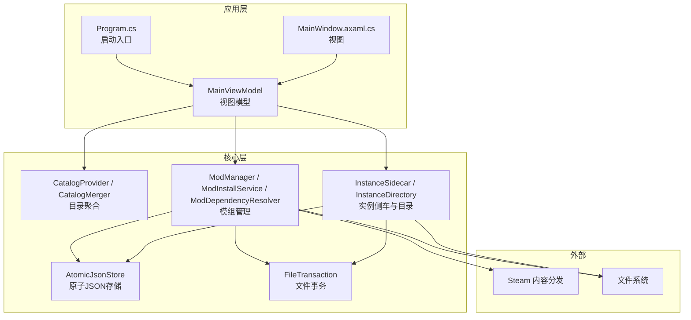
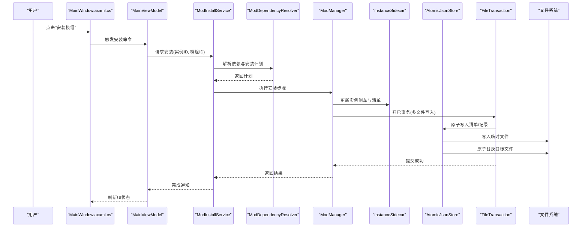
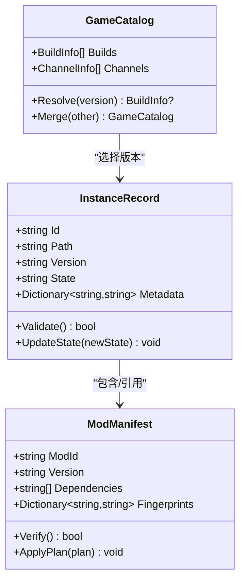
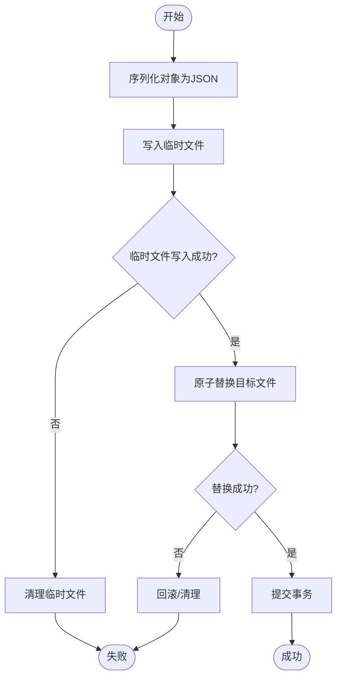
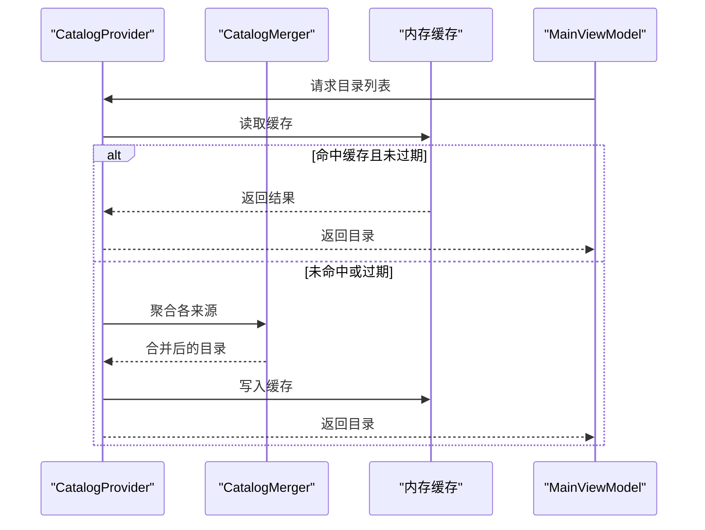
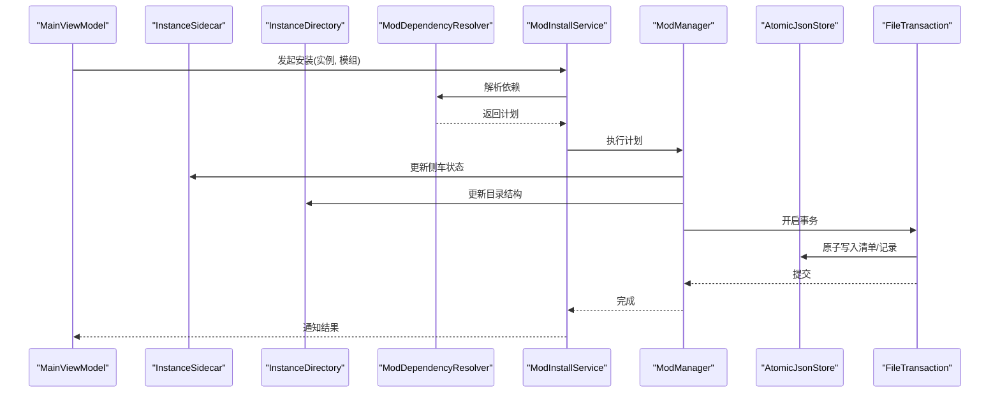
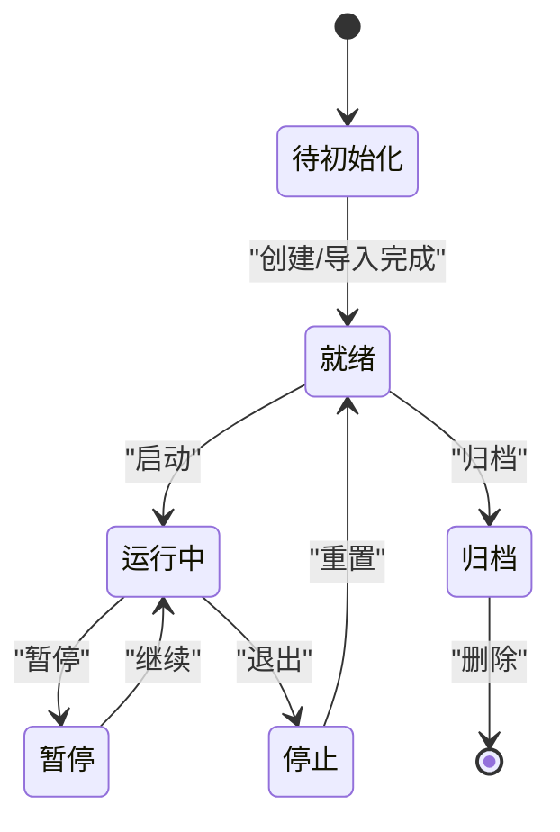
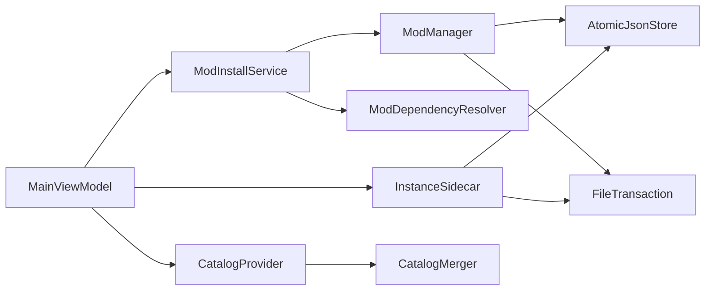

# 数据流设计

<cite>
**本文引用的文件**   
- [src/Crystalfly.Core/Models/InstanceRecord.cs](file://src/Crystalfly.Core/Models/InstanceRecord.cs)
- [src/Crystalfly.Core/Models/ModManifest.cs](file://src/Crystalfly.Core/Models/ModManifest.cs)
- [src/Crystalfly.Core/Models/GameCatalog.cs](file://src/Crystalfly.Core/Models/GameCatalog.cs)
- [src/Crystalfly.Core/Serialization/AtomicJsonStore.cs](file://src/Crystalfly.Core/Serialization/AtomicJsonStore.cs)
- [src/Crystalfly.Core/Transactions/FileTransaction.cs](file://src/Crystalfly.Core/Transactions/FileTransaction.cs)
- [src/Crystalfly.Core/Instances/InstanceSidecar.cs](file://src/Crystalfly.Core/Instances/InstanceSidecar.cs)
- [src/Crystalfly.Core/Instances/InstanceDirectory.cs](file://src/Crystalfly.Core/Instances/InstanceDirectory.cs)
- [src/Crystalfly.Core/Mods/ModManager.cs](file://src/Crystalfly.Core/Mods/ModManager.cs)
- [src/Crystalfly.Core/Mods/ModInstallService.cs](file://src/Crystalfly.Core/Mods/ModInstallService.cs)
- [src/Crystalfly.Core/Mods/ModDependencyResolver.cs](file://src/Crystalfly.Core/Mods/ModDependencyResolver.cs)
- [src/Crystalfly.Core/Catalog/CatalogProvider.cs](file://src/Crystalfly.Core/Catalog/CatalogProvider.cs)
- [src/Crystalfly.Core/Catalog/CatalogMerger.cs](file://src/Crystalfly.Core/Catalog/CatalogMerger.cs)
- [src/Crystalfly.App/ViewModels/MainViewModel.cs](file://src/Crystalfly.App/ViewModels/MainViewModel.cs)
- [src/Crystalfly.App/Views/MainWindow.axaml.cs](file://src/Crystalfly.App/Views/MainWindow.axaml.cs)
- [src/Crystalfly.App/Program.cs](file://src/Crystalfly.App/Program.cs)
</cite>

## 目录
1. [简介](#简介)
2. [项目结构](#项目结构)
3. [核心组件](#核心组件)
4. [架构总览](#架构总览)
5. [详细组件分析](#详细组件分析)
6. [依赖关系分析](#依赖关系分析)
7. [性能考虑](#性能考虑)
8. [故障排查指南](#故障排查指南)
9. [结论](#结论)
10. [附录](#附录)

## 简介
本文件面向 Crystalfly 的数据流设计，聚焦从用户界面操作到业务逻辑处理、再到数据存储的完整链路。文档重点说明关键数据模型（如 InstanceRecord、ModManifest、GameCatalog）的生命周期与管理策略，解释原子 JSON 存储机制与事务处理如何保证一致性，并阐述缓存策略、数据同步机制与冲突解决方案。同时提供数据流图与状态转换图，覆盖并发访问、数据迁移与版本兼容性等工程问题。

## 项目结构
Crystalfly 采用分层组织：UI 层（WPF/Avalonia 应用）、核心领域服务（实例、模组、目录、序列化、事务、运行时等），以及 Steam 集成模块。数据流贯穿 UI 视图模型、核心服务与持久化层，通过原子写入和事务封装确保一致性与可恢复性。

图表来源
- [src/Crystalfly.App/Program.cs](file://src/Crystalfly.App/Program.cs)
- [src/Crystalfly.App/Views/MainWindow.axaml.cs](file://src/Crystalfly.App/Views/MainWindow.axaml.cs)
- [src/Crystalfly.App/ViewModels/MainViewModel.cs](file://src/Crystalfly.App/ViewModels/MainViewModel.cs)
- [src/Crystalfly.Core/Catalog/CatalogProvider.cs](file://src/Crystalfly.Core/Catalog/CatalogProvider.cs)
- [src/Crystalfly.Core/Catalog/CatalogMerger.cs](file://src/Crystalfly.Core/Catalog/CatalogMerger.cs)
- [src/Crystalfly.Core/Mods/ModManager.cs](file://src/Crystalfly.Core/Mods/ModManager.cs)
- [src/Crystalfly.Core/Mods/ModInstallService.cs](file://src/Crystalfly.Core/Mods/ModInstallService.cs)
- [src/Crystalfly.Core/Mods/ModDependencyResolver.cs](file://src/Crystalfly.Core/Mods/ModDependencyResolver.cs)
- [src/Crystalfly.Core/Instances/InstanceSidecar.cs](file://src/Crystalfly.Core/Instances/InstanceSidecar.cs)
- [src/Crystalfly.Core/Instances/InstanceDirectory.cs](file://src/Crystalfly.Core/Instances/InstanceDirectory.cs)
- [src/Crystalfly.Core/Serialization/AtomicJsonStore.cs](file://src/Crystalfly.Core/Serialization/AtomicJsonStore.cs)
- [src/Crystalfly.Core/Transactions/FileTransaction.cs](file://src/Crystalfly.Core/Transactions/FileTransaction.cs)

章节来源
- [src/Crystalfly.App/Program.cs](file://src/Crystalfly.App/Program.cs)
- [src/Crystalfly.App/Views/MainWindow.axaml.cs](file://src/Crystalfly.App/Views/MainWindow.axaml.cs)
- [src/Crystalfly.App/ViewModels/MainViewModel.cs](file://src/Crystalfly.App/ViewModels/MainViewModel.cs)

## 核心组件
- 数据模型
  - InstanceRecord：描述游戏实例元数据与配置，作为实例生命周期管理的核心载体。
  - ModManifest：描述已安装模组的清单信息，包括依赖、版本与校验值。
  - GameCatalog：描述游戏构建与渠道信息，用于解析可用版本与更新源。
- 存储与事务
  - AtomicJsonStore：提供基于“先写临时文件再原子替换”的原子 JSON 持久化能力。
  - FileTransaction：封装多文件操作的原子事务，支持回滚与提交。
- 领域服务
  - ModManager/ModInstallService/ModDependencyResolver：负责模组安装计划生成、依赖解析与执行。
  - InstanceSidecar/InstanceDirectory：维护实例侧车文件与目录布局，协调实例级数据。
  - CatalogProvider/CatalogMerger：聚合官方与自定义目录源，合并去重并提供查询接口。
- UI 与编排
  - MainViewModel：承载用户交互状态，编排调用核心服务，驱动数据流。
  - MainWindow.axaml.cs：视图绑定与事件转发，将用户操作转化为命令或方法调用。

章节来源
- [src/Crystalfly.Core/Models/InstanceRecord.cs](file://src/Crystalfly.Core/Models/InstanceRecord.cs)
- [src/Crystalfly.Core/Models/ModManifest.cs](file://src/Crystalfly.Core/Models/ModManifest.cs)
- [src/Crystalfly.Core/Models/GameCatalog.cs](file://src/Crystalfly.Core/Models/GameCatalog.cs)
- [src/Crystalfly.Core/Serialization/AtomicJsonStore.cs](file://src/Crystalfly.Core/Serialization/AtomicJsonStore.cs)
- [src/Crystalfly.Core/Transactions/FileTransaction.cs](file://src/Crystalfly.Core/Transactions/FileTransaction.cs)
- [src/Crystalfly.Core/Mods/ModManager.cs](file://src/Crystalfly.Core/Mods/ModManager.cs)
- [src/Crystalfly.Core/Mods/ModInstallService.cs](file://src/Crystalfly.Core/Mods/ModInstallService.cs)
- [src/Crystalfly.Core/Mods/ModDependencyResolver.cs](file://src/Crystalfly.Core/Mods/ModDependencyResolver.cs)
- [src/Crystalfly.Core/Instances/InstanceSidecar.cs](file://src/Crystalfly.Core/Instances/InstanceSidecar.cs)
- [src/Crystalfly.Core/Instances/InstanceDirectory.cs](file://src/Crystalfly.Core/Instances/InstanceDirectory.cs)
- [src/Crystalfly.Core/Catalog/CatalogProvider.cs](file://src/Crystalfly.Core/Catalog/CatalogProvider.cs)
- [src/Crystalfly.Core/Catalog/CatalogMerger.cs](file://src/Crystalfly.Core/Catalog/CatalogMerger.cs)
- [src/Crystalfly.App/ViewModels/MainViewModel.cs](file://src/Crystalfly.App/ViewModels/MainViewModel.cs)
- [src/Crystalfly.App/Views/MainWindow.axaml.cs](file://src/Crystalfly.App/Views/MainWindow.axaml.cs)

## 架构总览
下图展示从 UI 到核心服务再到持久化的端到端数据流路径，强调原子写入与事务边界。

图表来源
- [src/Crystalfly.App/Views/MainWindow.axaml.cs](file://src/Crystalfly.App/Views/MainWindow.axaml.cs)
- [src/Crystalfly.App/ViewModels/MainViewModel.cs](file://src/Crystalfly.App/ViewModels/MainViewModel.cs)
- [src/Crystalfly.Core/Mods/ModInstallService.cs](file://src/Crystalfly.Core/Mods/ModInstallService.cs)
- [src/Crystalfly.Core/Mods/ModDependencyResolver.cs](file://src/Crystalfly.Core/Mods/ModDependencyResolver.cs)
- [src/Crystalfly.Core/Mods/ModManager.cs](file://src/Crystalfly.Core/Mods/ModManager.cs)
- [src/Crystalfly.Core/Instances/InstanceSidecar.cs](file://src/Crystalfly.Core/Instances/InstanceSidecar.cs)
- [src/Crystalfly.Core/Serialization/AtomicJsonStore.cs](file://src/Crystalfly.Core/Serialization/AtomicJsonStore.cs)
- [src/Crystalfly.Core/Transactions/FileTransaction.cs](file://src/Crystalfly.Core/Transactions/FileTransaction.cs)

## 详细组件分析

### 数据模型与生命周期
- InstanceRecord
  - 职责：描述实例标识、路径、版本、状态与扩展字段；在创建、克隆、导入、删除时更新。
  - 生命周期：创建→就绪→运行中→暂停/停止→归档/删除。
  - 存储：通过 Sidecar 与 Directory 协作，使用原子 JSON 持久化。
- ModManifest
  - 职责：记录已安装模组的元数据、依赖关系、版本指纹与校验信息。
  - 生命周期：安装→验证→启用/禁用→卸载；变更需经事务提交。
  - 存储：按实例维度落盘，配合依赖解析器进行一致性检查。
- GameCatalog
  - 职责：描述游戏构建、渠道与资源索引；由 CatalogProvider 聚合多个来源。
  - 生命周期：加载→合并→缓存→失效重建。
  - 存储：内存缓存为主，必要时持久化快照供离线使用。

图表来源
- [src/Crystalfly.Core/Models/InstanceRecord.cs](file://src/Crystalfly.Core/Models/InstanceRecord.cs)
- [src/Crystalfly.Core/Models/ModManifest.cs](file://src/Crystalfly.Core/Models/ModManifest.cs)
- [src/Crystalfly.Core/Models/GameCatalog.cs](file://src/Crystalfly.Core/Models/GameCatalog.cs)

章节来源
- [src/Crystalfly.Core/Models/InstanceRecord.cs](file://src/Crystalfly.Core/Models/InstanceRecord.cs)
- [src/Crystalfly.Core/Models/ModManifest.cs](file://src/Crystalfly.Core/Models/ModManifest.cs)
- [src/Crystalfly.Core/Models/GameCatalog.cs](file://src/Crystalfly.Core/Models/GameCatalog.cs)

### 原子 JSON 存储与事务
- 原子写入流程
  - 将对象序列化为临时文件，成功后以原子方式替换目标文件，避免部分写入导致损坏。
  - 失败时清理临时文件，保持目标文件不变。
- 事务边界
  - 多文件写入（如 Manifest、Sidecar、日志）统一纳入事务，提交前不对外可见。
  - 异常时自动回滚，确保跨文件一致性。

图表来源
- [src/Crystalfly.Core/Serialization/AtomicJsonStore.cs](file://src/Crystalfly.Core/Serialization/AtomicJsonStore.cs)
- [src/Crystalfly.Core/Transactions/FileTransaction.cs](file://src/Crystalfly.Core/Transactions/FileTransaction.cs)

章节来源
- [src/Crystalfly.Core/Serialization/AtomicJsonStore.cs](file://src/Crystalfly.Core/Serialization/AtomicJsonStore.cs)
- [src/Crystalfly.Core/Transactions/FileTransaction.cs](file://src/Crystalfly.Core/Transactions/FileTransaction.cs)

### 目录与缓存策略
- 目录聚合
  - CatalogProvider 聚合官方与自定义目录源，CatalogMerger 负责合并与去重。
- 缓存策略
  - 内存缓存目录结果，设置过期时间；当底层源变化或显式失效时重建。
- 数据同步
  - 后台任务定期拉取最新目录，增量合并后发布变更事件，UI 订阅刷新。

图表来源
- [src/Crystalfly.Core/Catalog/CatalogProvider.cs](file://src/Crystalfly.Core/Catalog/CatalogProvider.cs)
- [src/Crystalfly.Core/Catalog/CatalogMerger.cs](file://src/Crystalfly.Core/Catalog/CatalogMerger.cs)
- [src/Crystalfly.App/ViewModels/MainViewModel.cs](file://src/Crystalfly.App/ViewModels/MainViewModel.cs)

章节来源
- [src/Crystalfly.Core/Catalog/CatalogProvider.cs](file://src/Crystalfly.Core/Catalog/CatalogProvider.cs)
- [src/Crystalfly.Core/Catalog/CatalogMerger.cs](file://src/Crystalfly.Core/Catalog/CatalogMerger.cs)
- [src/Crystalfly.App/ViewModels/MainViewModel.cs](file://src/Crystalfly.App/ViewModels/MainViewModel.cs)

### 实例与模组数据流
- 实例侧车与目录
  - InstanceSidecar 维护实例级元数据与配置文件；InstanceDirectory 管理目录结构与扫描。
- 模组安装流程
  - ModDependencyResolver 生成安装计划；ModInstallService 协调下载、校验与部署；ModManager 执行具体步骤并更新清单。
- 一致性保障
  - 所有涉及清单与记录的写入均通过事务与原子存储完成，失败即回滚。

图表来源
- [src/Crystalfly.Core/Instances/InstanceSidecar.cs](file://src/Crystalfly.Core/Instances/InstanceSidecar.cs)
- [src/Crystalfly.Core/Instances/InstanceDirectory.cs](file://src/Crystalfly.Core/Instances/InstanceDirectory.cs)
- [src/Crystalfly.Core/Mods/ModDependencyResolver.cs](file://src/Crystalfly.Core/Mods/ModDependencyResolver.cs)
- [src/Crystalfly.Core/Mods/ModInstallService.cs](file://src/Crystalfly.Core/Mods/ModInstallService.cs)
- [src/Crystalfly.Core/Mods/ModManager.cs](file://src/Crystalfly.Core/Mods/ModManager.cs)
- [src/Crystalfly.Core/Serialization/AtomicJsonStore.cs](file://src/Crystalfly.Core/Serialization/AtomicJsonStore.cs)
- [src/Crystalfly.Core/Transactions/FileTransaction.cs](file://src/Crystalfly.Core/Transactions/FileTransaction.cs)
- [src/Crystalfly.App/ViewModels/MainViewModel.cs](file://src/Crystalfly.App/ViewModels/MainViewModel.cs)

章节来源
- [src/Crystalfly.Core/Instances/InstanceSidecar.cs](file://src/Crystalfly.Core/Instances/InstanceSidecar.cs)
- [src/Crystalfly.Core/Instances/InstanceDirectory.cs](file://src/Crystalfly.Core/Instances/InstanceDirectory.cs)
- [src/Crystalfly.Core/Mods/ModDependencyResolver.cs](file://src/Crystalfly.Core/Mods/ModDependencyResolver.cs)
- [src/Crystalfly.Core/Mods/ModInstallService.cs](file://src/Crystalfly.Core/Mods/ModInstallService.cs)
- [src/Crystalfly.Core/Mods/ModManager.cs](file://src/Crystalfly.Core/Mods/ModManager.cs)
- [src/Crystalfly.App/ViewModels/MainViewModel.cs](file://src/Crystalfly.App/ViewModels/MainViewModel.cs)

### 状态转换图（实例）

[此图为概念性状态转换，不直接映射具体源码文件]

## 依赖关系分析
- 组件耦合
  - UI 仅依赖 ViewModel，ViewModel 依赖核心服务，核心服务之间通过明确接口协作。
  - 存储与事务被广泛复用，降低重复实现风险。
- 外部依赖
  - Steam 内容分发用于包下载；文件系统用于持久化；网络用于目录拉取。
- 潜在循环
  - 当前分层清晰，未见循环依赖；若新增功能应遵循单向依赖原则。

图表来源
- [src/Crystalfly.App/ViewModels/MainViewModel.cs](file://src/Crystalfly.App/ViewModels/MainViewModel.cs)
- [src/Crystalfly.Core/Mods/ModInstallService.cs](file://src/Crystalfly.Core/Mods/ModInstallService.cs)
- [src/Crystalfly.Core/Catalog/CatalogProvider.cs](file://src/Crystalfly.Core/Catalog/CatalogProvider.cs)
- [src/Crystalfly.Core/Instances/InstanceSidecar.cs](file://src/Crystalfly.Core/Instances/InstanceSidecar.cs)
- [src/Crystalfly.Core/Mods/ModDependencyResolver.cs](file://src/Crystalfly.Core/Mods/ModDependencyResolver.cs)
- [src/Crystalfly.Core/Mods/ModManager.cs](file://src/Crystalfly.Core/Mods/ModManager.cs)
- [src/Crystalfly.Core/Serialization/AtomicJsonStore.cs](file://src/Crystalfly.Core/Serialization/AtomicJsonStore.cs)
- [src/Crystalfly.Core/Transactions/FileTransaction.cs](file://src/Crystalfly.Core/Transactions/FileTransaction.cs)
- [src/Crystalfly.Core/Catalog/CatalogMerger.cs](file://src/Crystalfly.Core/Catalog/CatalogMerger.cs)

章节来源
- [src/Crystalfly.App/ViewModels/MainViewModel.cs](file://src/Crystalfly.App/ViewModels/MainViewModel.cs)
- [src/Crystalfly.Core/Mods/ModInstallService.cs](file://src/Crystalfly.Core/Mods/ModInstallService.cs)
- [src/Crystalfly.Core/Catalog/CatalogProvider.cs](file://src/Crystalfly.Core/Catalog/CatalogProvider.cs)
- [src/Crystalfly.Core/Instances/InstanceSidecar.cs](file://src/Crystalfly.Core/Instances/InstanceSidecar.cs)
- [src/Crystalfly.Core/Mods/ModDependencyResolver.cs](file://src/Crystalfly.Core/Mods/ModDependencyResolver.cs)
- [src/Crystalfly.Core/Mods/ModManager.cs](file://src/Crystalfly.Core/Mods/ModManager.cs)
- [src/Crystalfly.Core/Serialization/AtomicJsonStore.cs](file://src/Crystalfly.Core/Serialization/AtomicJsonStore.cs)
- [src/Crystalfly.Core/Transactions/FileTransaction.cs](file://src/Crystalfly.Core/Transactions/FileTransaction.cs)
- [src/Crystalfly.Core/Catalog/CatalogMerger.cs](file://src/Crystalfly.Core/Catalog/CatalogMerger.cs)

## 性能考虑
- 批量写入与事务合并：将多次小写入合并为一次事务，减少磁盘 I/O 次数。
- 原子替换开销：大文件替换可能耗时，建议分块或预校验后再替换。
- 目录缓存命中率：合理设置过期时间与失效策略，避免频繁重建。
- 并发控制：对同一实例的写操作加锁，避免竞态条件。
- 异步与背压：长耗时任务（下载、解压）使用异步队列，防止阻塞 UI。

## 故障排查指南
- 常见错误
  - 原子写入失败：检查临时文件权限与磁盘空间，确认替换阶段是否被占用。
  - 事务回滚：查看回滚日志，定位首个失败的文件操作。
  - 依赖冲突：核对 ModManifest 的依赖声明与实际文件指纹。
- 诊断步骤
  - 启用详细日志，记录每次事务的开始、提交与回滚。
  - 校验清单完整性：对比指纹与预期值，定位不一致项。
  - 隔离测试：在干净实例上复现问题，逐步缩小范围。

章节来源
- [src/Crystalfly.Core/Serialization/AtomicJsonStore.cs](file://src/Crystalfly.Core/Serialization/AtomicJsonStore.cs)
- [src/Crystalfly.Core/Transactions/FileTransaction.cs](file://src/Crystalfly.Core/Transactions/FileTransaction.cs)
- [src/Crystalfly.Core/Mods/ModManager.cs](file://src/Crystalfly.Core/Mods/ModManager.cs)

## 结论
Crystalfly 的数据流设计围绕“原子写入+事务边界”的核心原则，结合清晰的领域服务分层与缓存策略，实现了高一致性与可恢复性的数据管理。通过明确的模型生命周期与状态机，系统能够稳健地处理并发访问、数据迁移与版本兼容等复杂场景。建议在后续迭代中持续完善监控指标与自动化测试，进一步提升可靠性与可观测性。

## 附录
- 并发访问
  - 读多写少：读路径无锁，写路径按实例粒度加锁。
  - 乐观锁：在清单中引入版本号字段，冲突时重试或提示用户。
- 数据迁移
  - 版本化 Schema：对关键清单引入版本字段，迁移脚本按版本顺序执行。
  - 向后兼容：旧格式读取时自动转换为新格式并落盘。
- 版本兼容性
  - 目录版本：Catalog 提供版本信息，客户端根据最低兼容版本决定是否升级。
  - 灰度发布：通过渠道与构建指纹控制不同用户的更新节奏。