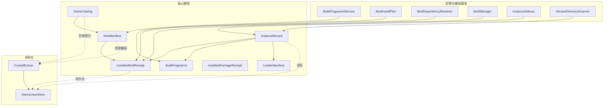
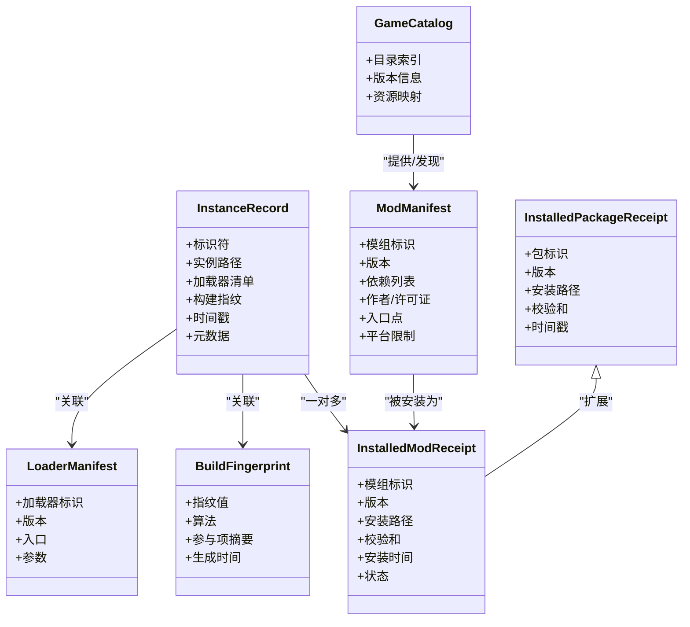
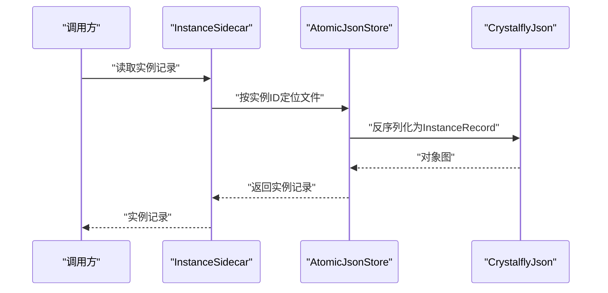
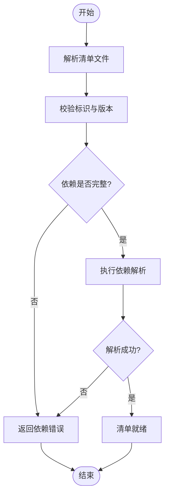
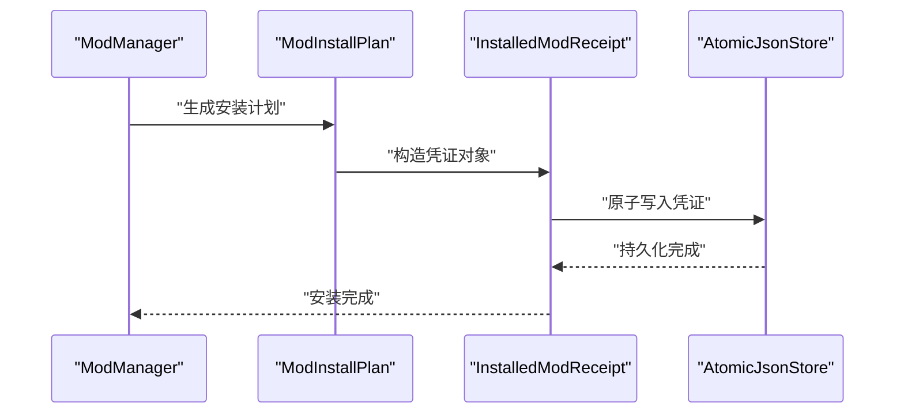
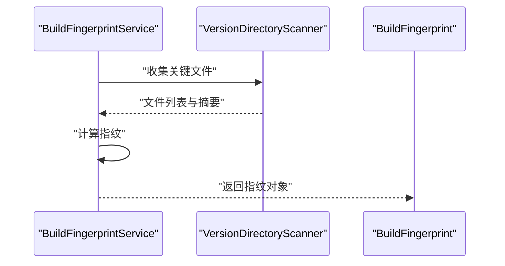
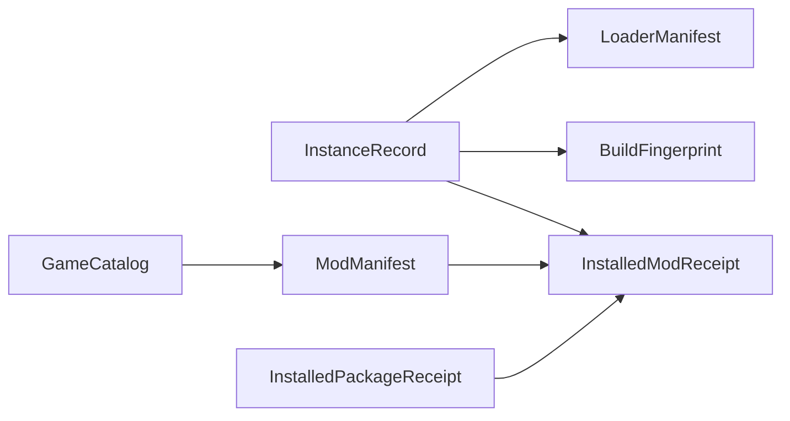

# 核心数据模型

<cite>
**本文引用的文件**   
- [InstanceRecord.cs](file://src/Crystalfly.Core/Models/InstanceRecord.cs)
- [ModManifest.cs](file://src/Crystalfly.Core/Models/ModManifest.cs)
- [GameCatalog.cs](file://src/Crystalfly.Core/Models/GameCatalog.cs)
- [InstalledModReceipt.cs](file://src/Crystalfly.Core/Models/InstalledModReceipt.cs)
- [BuildFingerprint.cs](file://src/Crystalfly.Core/Models/BuildFingerprint.cs)
- [InstalledPackageReceipt.cs](file://src/Crystalfly.Core/Models/InstalledPackageReceipt.cs)
- [LoaderManifest.cs](file://src/Crystalfly.Core/Models/LoaderManifest.cs)
- [CrystalflyJson.cs](file://src/Crystalfly.Core/Serialization/CrystalflyJson.cs)
- [AtomicJsonStore.cs](file://src/Crystalfly.Core/Serialization/AtomicJsonStore.cs)
- [BuildFingerprintService.cs](file://src/Crystalfly.Core/Instances/BuildFingerprintService.cs)
- [ModInstallPlan.cs](file://src/Crystalfly.Core/Mods/ModInstallPlan.cs)
- [ModDependencyResolver.cs](file://src/Crystalfly.Core/Mods/ModDependencyResolver.cs)
- [ModManager.cs](file://src/Crystalfly.Core/Mods/ModManager.cs)
- [InstanceSidecar.cs](file://src/Crystalfly.Core/Instances/InstanceSidecar.cs)
- [VersionDirectoryScanner.cs](file://src/Crystalfly.Core/Instances/VersionDirectoryScanner.cs)
</cite>

## 目录
1. [简介](#简介)
2. [项目结构](#项目结构)
3. [核心组件](#核心组件)
4. [架构总览](#架构总览)
5. [详细组件分析](#详细组件分析)
6. [依赖关系分析](#依赖关系分析)
7. [性能考虑](#性能考虑)
8. [故障排查指南](#故障排查指南)
9. [结论](#结论)
10. [附录](#附录)

## 简介
本文件聚焦 Crystalfly 的核心数据模型，围绕以下关键实体展开：
- 游戏实例记录 InstanceRecord
- 模组清单 ModManifest
- 游戏目录 GameCatalog
- 已安装模组凭证 InstalledModReceipt
- 构建指纹 BuildFingerprint
并补充与上述实体密切相关的 InstalledPackageReceipt、LoaderManifest 等。文档将说明字段定义、数据类型、验证规则与约束条件；解释实体间的一对一、一对多、多对多关系；描述序列化/反序列化机制；给出数据迁移策略与版本兼容性处理建议；并提供示例数据结构（以路径引用形式呈现）。

## 项目结构
核心数据模型位于 Crystalfly.Core/Models 下，相关服务与工具分布在 Instances、Mods、Serialization 等子目录中。下图展示与核心模型直接相关的代码组织与交互边界。

图表来源
- [InstanceRecord.cs:1-200](file://src/Crystalfly.Core/Models/InstanceRecord.cs#L1-L200)
- [ModManifest.cs:1-200](file://src/Crystalfly.Core/Models/ModManifest.cs#L1-L200)
- [GameCatalog.cs:1-200](file://src/Crystalfly.Core/Models/GameCatalog.cs#L1-L200)
- [InstalledModReceipt.cs:1-200](file://src/Crystalfly.Core/Models/InstalledModReceipt.cs#L1-L200)
- [BuildFingerprint.cs:1-200](file://src/Crystalfly.Core/Models/BuildFingerprint.cs#L1-L200)
- [InstalledPackageReceipt.cs:1-200](file://src/Crystalfly.Core/Models/InstalledPackageReceipt.cs#L1-L200)
- [LoaderManifest.cs:1-200](file://src/Crystalfly.Core/Models/LoaderManifest.cs#L1-L200)
- [CrystalflyJson.cs:1-200](file://src/Crystalfly.Core/Serialization/CrystalflyJson.cs#L1-L200)
- [AtomicJsonStore.cs:1-200](file://src/Crystalfly.Core/Serialization/AtomicJsonStore.cs#L1-L200)
- [BuildFingerprintService.cs:1-200](file://src/Crystalfly.Core/Instances/BuildFingerprintService.cs#L1-L200)
- [ModInstallPlan.cs:1-200](file://src/Crystalfly.Core/Mods/ModInstallPlan.cs#L1-L200)
- [ModDependencyResolver.cs:1-200](file://src/Crystalfly.Core/Mods/ModDependencyResolver.cs#L1-L200)
- [ModManager.cs:1-200](file://src/Crystalfly.Core/Mods/ModManager.cs#L1-L200)
- [InstanceSidecar.cs:1-200](file://src/Crystalfly.Core/Instances/InstanceSidecar.cs#L1-L200)
- [VersionDirectoryScanner.cs:1-200](file://src/Crystalfly.Core/Instances/VersionDirectoryScanner.cs#L1-L200)

章节来源
- [InstanceRecord.cs:1-200](file://src/Crystalfly.Core/Models/InstanceRecord.cs#L1-L200)
- [ModManifest.cs:1-200](file://src/Crystalfly.Core/Models/ModManifest.cs#L1-L200)
- [GameCatalog.cs:1-200](file://src/Crystalfly.Core/Models/GameCatalog.cs#L1-L200)
- [InstalledModReceipt.cs:1-200](file://src/Crystalfly.Core/Models/InstalledModReceipt.cs#L1-L200)
- [BuildFingerprint.cs:1-200](file://src/Crystalfly.Core/Models/BuildFingerprint.cs#L1-L200)
- [InstalledPackageReceipt.cs:1-200](file://src/Crystalfly.Core/Models/InstalledPackageReceipt.cs#L1-L200)
- [LoaderManifest.cs:1-200](file://src/Crystalfly.Core/Models/LoaderManifest.cs#L1-L200)
- [CrystalflyJson.cs:1-200](file://src/Crystalfly.Core/Serialization/CrystalflyJson.cs#L1-L200)
- [AtomicJsonStore.cs:1-200](file://src/Crystalfly.Core/Serialization/AtomicJsonStore.cs#L1-L200)
- [BuildFingerprintService.cs:1-200](file://src/Crystalfly.Core/Instances/BuildFingerprintService.cs#L1-L200)
- [ModInstallPlan.cs:1-200](file://src/Crystalfly.Core/Mods/ModInstallPlan.cs#L1-L200)
- [ModDependencyResolver.cs:1-200](file://src/Crystalfly.Core/Mods/ModDependencyResolver.cs#L1-L200)
- [ModManager.cs:1-200](file://src/Crystalfly.Core/Mods/ModManager.cs#L1-L200)
- [InstanceSidecar.cs:1-200](file://src/Crystalfly.Core/Instances/InstanceSidecar.cs#L1-L200)
- [VersionDirectoryScanner.cs:1-200](file://src/Crystalfly.Core/Instances/VersionDirectoryScanner.cs#L1-L200)

## 核心组件
本节概述各核心模型的职责与关键字段类型，以及它们之间的关联关系。为避免泄露具体实现细节，本节仅做概念性说明，具体字段与约束见“详细组件分析”。

- InstanceRecord：表示一个游戏实例的元数据与运行时上下文，包含实例标识、路径、关联的加载器清单、构建指纹、时间戳等。
- ModManifest：表示模组的声明式清单，包含模组标识、版本、依赖、作者、许可证、入口点等。
- GameCatalog：表示游戏目录的结构化索引，用于发现可识别的游戏版本与资源。
- InstalledModReceipt：表示某模组在特定实例中的已安装状态凭证，包含模组标识、版本、安装位置、校验和、安装时间等。
- BuildFingerprint：表示一次构建的唯一指纹，由关键文件哈希与配置摘要组合而成，用于快速判断环境一致性。
- InstalledPackageReceipt：表示通用包级安装凭证，扩展了模组凭证的通用能力。
- LoaderManifest：表示加载器（如 Unity/HK 加载器）的清单，描述加载器版本、入口、参数等。

章节来源
- [InstanceRecord.cs:1-200](file://src/Crystalfly.Core/Models/InstanceRecord.cs#L1-L200)
- [ModManifest.cs:1-200](file://src/Crystalfly.Core/Models/ModManifest.cs#L1-L200)
- [GameCatalog.cs:1-200](file://src/Crystalfly.Core/Models/GameCatalog.cs#L1-L200)
- [InstalledModReceipt.cs:1-200](file://src/Crystalfly.Core/Models/InstalledModReceipt.cs#L1-L200)
- [BuildFingerprint.cs:1-200](file://src/Crystalfly.Core/Models/BuildFingerprint.cs#L1-L200)
- [InstalledPackageReceipt.cs:1-200](file://src/Crystalfly.Core/Models/InstalledPackageReceipt.cs#L1-L200)
- [LoaderManifest.cs:1-200](file://src/Crystalfly.Core/Models/LoaderManifest.cs#L1-L200)

## 架构总览
下图展示了核心模型与服务层之间的交互关系，包括构建指纹计算、模组安装计划生成、依赖解析与持久化流程。

图表来源
- [InstanceRecord.cs:1-200](file://src/Crystalfly.Core/Models/InstanceRecord.cs#L1-L200)
- [ModManifest.cs:1-200](file://src/Crystalfly.Core/Models/ModManifest.cs#L1-L200)
- [GameCatalog.cs:1-200](file://src/Crystalfly.Core/Models/GameCatalog.cs#L1-L200)
- [InstalledModReceipt.cs:1-200](file://src/Crystalfly.Core/Models/InstalledModReceipt.cs#L1-L200)
- [BuildFingerprint.cs:1-200](file://src/Crystalfly.Core/Models/BuildFingerprint.cs#L1-L200)
- [InstalledPackageReceipt.cs:1-200](file://src/Crystalfly.Core/Models/InstalledPackageReceipt.cs#L1-L200)
- [LoaderManifest.cs:1-200](file://src/Crystalfly.Core/Models/LoaderManifest.cs#L1-L200)

## 详细组件分析

### 实例记录 InstanceRecord
- 职责：描述一个游戏实例的元数据与运行时上下文，作为其他实体的聚合根。
- 关键属性（概念）：
  - 实例标识：唯一字符串或 GUID
  - 实例路径：文件系统路径
  - 加载器清单：指向 LoaderManifest
  - 构建指纹：指向 BuildFingerprint
  - 时间戳：创建/更新时间
  - 元数据：键值对扩展
- 约束与验证：
  - 标识不可为空且全局唯一
  - 路径必须存在且可写
  - 时间戳需为有效 UTC 时间
- 生命周期：
  - 创建：通过导入或克隆生成
  - 更新：变更加载器或构建后刷新指纹
  - 删除：清理侧车文件与凭证
- 关联关系：
  - 一对多：一个实例对应多个 InstalledModReceipt
  - 一对一：一个实例对应一个 LoaderManifest 与一个 BuildFingerprint

图表来源
- [InstanceSidecar.cs:1-200](file://src/Crystalfly.Core/Instances/InstanceSidecar.cs#L1-L200)
- [AtomicJsonStore.cs:1-200](file://src/Crystalfly.Core/Serialization/AtomicJsonStore.cs#L1-L200)
- [CrystalflyJson.cs:1-200](file://src/Crystalfly.Core/Serialization/CrystalflyJson.cs#L1-L200)
- [InstanceRecord.cs:1-200](file://src/Crystalfly.Core/Models/InstanceRecord.cs#L1-L200)

章节来源
- [InstanceRecord.cs:1-200](file://src/Crystalfly.Core/Models/InstanceRecord.cs#L1-L200)
- [InstanceSidecar.cs:1-200](file://src/Crystalfly.Core/Instances/InstanceSidecar.cs#L1-L200)
- [AtomicJsonStore.cs:1-200](file://src/Crystalfly.Core/Serialization/AtomicJsonStore.cs#L1-L200)
- [CrystalflyJson.cs:1-200](file://src/Crystalfly.Core/Serialization/CrystalflyJson.cs#L1-L200)

### 模组清单 ModManifest
- 职责：声明模组元数据、依赖与运行要求。
- 关键属性（概念）：
  - 模组标识：唯一字符串
  - 版本：语义化版本
  - 依赖列表：模组标识与版本范围
  - 作者/许可证：文本与枚举
  - 入口点：程序集/脚本路径
  - 平台限制：操作系统/游戏版本
- 约束与验证：
  - 标识非空且符合命名规范
  - 版本满足语义化版本约束
  - 依赖项存在且版本兼容
- 生命周期：
  - 发布：打包时生成清单
  - 解析：从包或目录提取清单
  - 校验：依赖解析通过后生效
- 关联关系：
  - 一对多：一个清单可被多个 InstalledModReceipt 引用
  - 多对多：通过依赖列表形成模组间的依赖图

图表来源
- [ModManifest.cs:1-200](file://src/Crystalfly.Core/Models/ModManifest.cs#L1-L200)
- [ModDependencyResolver.cs:1-200](file://src/Crystalfly.Core/Mods/ModDependencyResolver.cs#L1-L200)

章节来源
- [ModManifest.cs:1-200](file://src/Crystalfly.Core/Models/ModManifest.cs#L1-L200)
- [ModDependencyResolver.cs:1-200](file://src/Crystalfly.Core/Mods/ModDependencyResolver.cs#L1-L200)

### 游戏目录 GameCatalog
- 职责：维护游戏目录的结构化索引，支持版本发现与资源映射。
- 关键属性（概念）：
  - 目录索引：路径到资源的映射
  - 版本信息：主版本号、补丁号
  - 资源映射：关键文件与校验和
- 约束与验证：
  - 索引完整性：所有映射路径存在
  - 版本格式合规
- 生命周期：
  - 扫描：扫描磁盘生成索引
  - 更新：增量更新缺失条目
  - 查询：根据版本/资源检索
- 关联关系：
  - 一对多：一个目录索引对应多个 ModManifest（可发现）

章节来源
- [GameCatalog.cs:1-200](file://src/Crystalfly.Core/Models/GameCatalog.cs#L1-L200)

### 已安装模组凭证 InstalledModReceipt
- 职责：记录模组在实例中的安装结果与校验信息。
- 关键属性（概念）：
  - 模组标识与版本
  - 安装路径与相对路径
  - 校验和（文件哈希）
  - 安装时间与状态
- 约束与验证：
  - 安装路径存在且可读
  - 校验和与当前文件一致
  - 状态为合法枚举值
- 生命周期：
  - 安装：写入凭证并校验文件
  - 修复：对比校验和并重新下载
  - 卸载：移除文件并删除凭证
- 关联关系：
  - 多对一：多个凭证对应同一 ModManifest
  - 一对多：一个实例拥有多个凭证

图表来源
- [InstalledModReceipt.cs:1-200](file://src/Crystalfly.Core/Models/InstalledModReceipt.cs#L1-L200)
- [ModInstallPlan.cs:1-200](file://src/Crystalfly.Core/Mods/ModInstallPlan.cs#L1-L200)
- [ModManager.cs:1-200](file://src/Crystalfly.Core/Mods/ModManager.cs#L1-L200)
- [AtomicJsonStore.cs:1-200](file://src/Crystalfly.Core/Serialization/AtomicJsonStore.cs#L1-L200)

章节来源
- [InstalledModReceipt.cs:1-200](file://src/Crystalfly.Core/Models/InstalledModReceipt.cs#L1-L200)
- [ModInstallPlan.cs:1-200](file://src/Crystalfly.Core/Mods/ModInstallPlan.cs#L1-L200)
- [ModManager.cs:1-200](file://src/Crystalfly.Core/Mods/ModManager.cs#L1-L200)
- [AtomicJsonStore.cs:1-200](file://src/Crystalfly.Core/Serialization/AtomicJsonStore.cs#L1-L200)

### 构建指纹 BuildFingerprint
- 职责：基于关键文件与配置生成唯一指纹，用于快速判定环境一致性。
- 关键属性（概念）：
  - 指纹值：哈希字符串
  - 算法：使用的哈希算法
  - 参与项摘要：参与计算的键集合
  - 生成时间：UTC 时间戳
- 约束与验证：
  - 指纹长度与格式固定
  - 算法为受支持的哈希函数
- 生命周期：
  - 计算：扫描关键文件与配置
  - 缓存：避免重复计算
  - 比较：相等即视为一致
- 关联关系：
  - 一对一：每个实例记录关联一个指纹

图表来源
- [BuildFingerprintService.cs:1-200](file://src/Crystalfly.Core/Instances/BuildFingerprintService.cs#L1-L200)
- [VersionDirectoryScanner.cs:1-200](file://src/Crystalfly.Core/Instances/VersionDirectoryScanner.cs#L1-L200)
- [BuildFingerprint.cs:1-200](file://src/Crystalfly.Core/Models/BuildFingerprint.cs#L1-L200)

章节来源
- [BuildFingerprint.cs:1-200](file://src/Crystalfly.Core/Models/BuildFingerprint.cs#L1-L200)
- [BuildFingerprintService.cs:1-200](file://src/Crystalfly.Core/Instances/BuildFingerprintService.cs#L1-L200)
- [VersionDirectoryScanner.cs:1-200](file://src/Crystalfly.Core/Instances/VersionDirectoryScanner.cs#L1-L200)

### 附加模型：InstalledPackageReceipt 与 LoaderManifest
- InstalledPackageReceipt：通用包级安装凭证，扩展自基础凭证能力，适用于非模组类包。
- LoaderManifest：描述加载器版本、入口与参数，供实例启动时使用。

章节来源
- [InstalledPackageReceipt.cs:1-200](file://src/Crystalfly.Core/Models/InstalledPackageReceipt.cs#L1-L200)
- [LoaderManifest.cs:1-200](file://src/Crystalfly.Core/Models/LoaderManifest.cs#L1-L200)

## 依赖关系分析
下图展示核心模型之间的耦合与依赖方向，帮助理解变更影响面。

图表来源
- [InstanceRecord.cs:1-200](file://src/Crystalfly.Core/Models/InstanceRecord.cs#L1-L200)
- [InstalledModReceipt.cs:1-200](file://src/Crystalfly.Core/Models/InstalledModReceipt.cs#L1-L200)
- [BuildFingerprint.cs:1-200](file://src/Crystalfly.Core/Models/BuildFingerprint.cs#L1-L200)
- [LoaderManifest.cs:1-200](file://src/Crystalfly.Core/Models/LoaderManifest.cs#L1-L200)
- [ModManifest.cs:1-200](file://src/Crystalfly.Core/Models/ModManifest.cs#L1-L200)
- [GameCatalog.cs:1-200](file://src/Crystalfly.Core/Models/GameCatalog.cs#L1-L200)
- [InstalledPackageReceipt.cs:1-200](file://src/Crystalfly.Core/Models/InstalledPackageReceipt.cs#L1-L200)

章节来源
- [InstanceRecord.cs:1-200](file://src/Crystalfly.Core/Models/InstanceRecord.cs#L1-L200)
- [InstalledModReceipt.cs:1-200](file://src/Crystalfly.Core/Models/InstalledModReceipt.cs#L1-L200)
- [BuildFingerprint.cs:1-200](file://src/Crystalfly.Core/Models/BuildFingerprint.cs#L1-L200)
- [LoaderManifest.cs:1-200](file://src/Crystalfly.Core/Models/LoaderManifest.cs#L1-L200)
- [ModManifest.cs:1-200](file://src/Crystalfly.Core/Models/ModManifest.cs#L1-L200)
- [GameCatalog.cs:1-200](file://src/Crystalfly.Core/Models/GameCatalog.cs#L1-L200)
- [InstalledPackageReceipt.cs:1-200](file://src/Crystalfly.Core/Models/InstalledPackageReceipt.cs#L1-L200)

## 性能考虑
- 构建指纹计算：
  - 使用增量扫描与缓存，避免全量重算
  - 选择高效哈希算法，平衡安全与性能
- 清单解析与依赖解析：
  - 延迟加载依赖图，按需构建
  - 缓存已解析结果，减少重复计算
- 持久化：
  - 原子写入避免部分写入导致的数据损坏
  - 批量写入合并事务，降低 IO 次数

[本节为通用指导，不直接分析具体文件]

## 故障排查指南
- 清单解析失败：
  - 检查标识与版本格式是否符合规范
  - 确认依赖项存在且版本范围匹配
- 凭证不一致：
  - 对比校验和与当前文件哈希
  - 触发修复流程重新下载受影响文件
- 指纹不一致：
  - 检查关键文件是否被修改
  - 重新计算指纹并更新实例记录
- 持久化异常：
  - 确认目标路径权限与磁盘空间
  - 查看原子写入日志，定位中断点

章节来源
- [AtomicJsonStore.cs:1-200](file://src/Crystalfly.Core/Serialization/AtomicJsonStore.cs#L1-L200)
- [ModDependencyResolver.cs:1-200](file://src/Crystalfly.Core/Mods/ModDependencyResolver.cs#L1-L200)
- [BuildFingerprintService.cs:1-200](file://src/Crystalfly.Core/Instances/BuildFingerprintService.cs#L1-L200)

## 结论
Crystalfly 的核心数据模型围绕实例为中心，通过模组清单、目录索引、安装凭证与构建指纹共同协作，形成稳定的运行时环境管理闭环。清晰的字段定义、严格的验证规则与原子持久化机制保障了数据的正确性与一致性。依赖解析与指纹计算提供了可扩展与高性能的基础能力。

[本节为总结性内容，不直接分析具体文件]

## 附录

### 数据序列化与反序列化机制
- 统一序列化器：
  - 使用统一的 JSON 序列化器进行对象图转换
  - 支持自定义转换器处理特殊类型
- 原子存储：
  - 先写入临时文件再原子替换，确保一致性
  - 读写锁保护并发访问
- 典型流程：
  - 读取：定位文件 -> 反序列化为对象图 -> 返回
  - 写入：对象图 -> 序列化 -> 原子写入 -> 提交

章节来源
- [CrystalflyJson.cs:1-200](file://src/Crystalfly.Core/Serialization/CrystalflyJson.cs#L1-L200)
- [AtomicJsonStore.cs:1-200](file://src/Crystalfly.Core/Serialization/AtomicJsonStore.cs#L1-L200)

### 数据迁移策略与版本兼容性
- 迁移原则：
  - 向后兼容：新字段可选，旧字段保留
  - 渐进升级：分阶段引入破坏性变更
- 实施步骤：
  - 检测当前版本
  - 应用迁移脚本
  - 验证数据完整性
  - 回滚策略：保留备份并在失败时恢复
- 示例迁移场景：
  - 新增字段默认值填充
  - 枚举值扩展与映射
  - 路径结构调整与重定向

[本节为通用指导，不直接分析具体文件]

### 示例数据结构（路径引用）
- 实例记录示例：[InstanceRecord 示例路径:1-200](file://src/Crystalfly.Core/Models/InstanceRecord.cs#L1-L200)
- 模组清单示例：[ModManifest 示例路径:1-200](file://src/Crystalfly.Core/Models/ModManifest.cs#L1-L200)
- 游戏目录示例：[GameCatalog 示例路径:1-200](file://src/Crystalfly.Core/Models/GameCatalog.cs#L1-L200)
- 已安装模组凭证示例：[InstalledModReceipt 示例路径:1-200](file://src/Crystalfly.Core/Models/InstalledModReceipt.cs#L1-L200)
- 构建指纹示例：[BuildFingerprint 示例路径:1-200](file://src/Crystalfly.Core/Models/BuildFingerprint.cs#L1-L200)
- 包级凭证示例：[InstalledPackageReceipt 示例路径:1-200](file://src/Crystalfly.Core/Models/InstalledPackageReceipt.cs#L1-L200)
- 加载器清单示例：[LoaderManifest 示例路径:1-200](file://src/Crystalfly.Core/Models/LoaderManifest.cs#L1-L200)