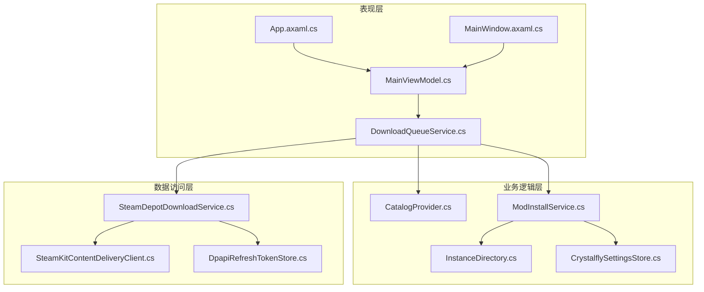
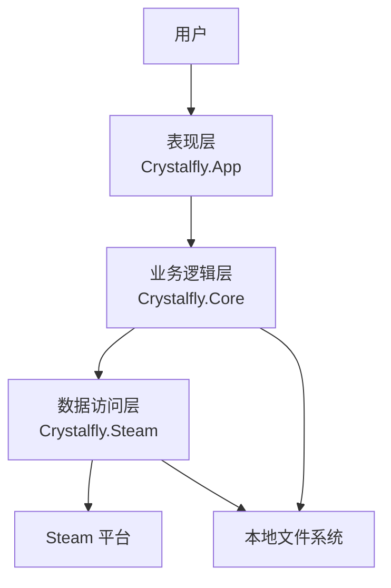
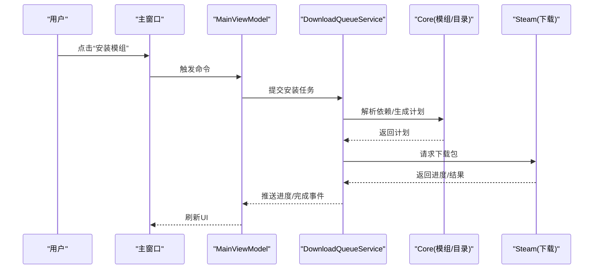
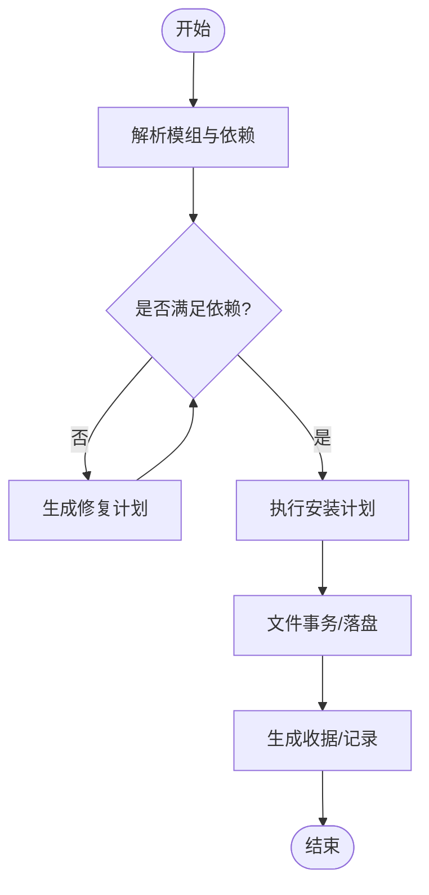
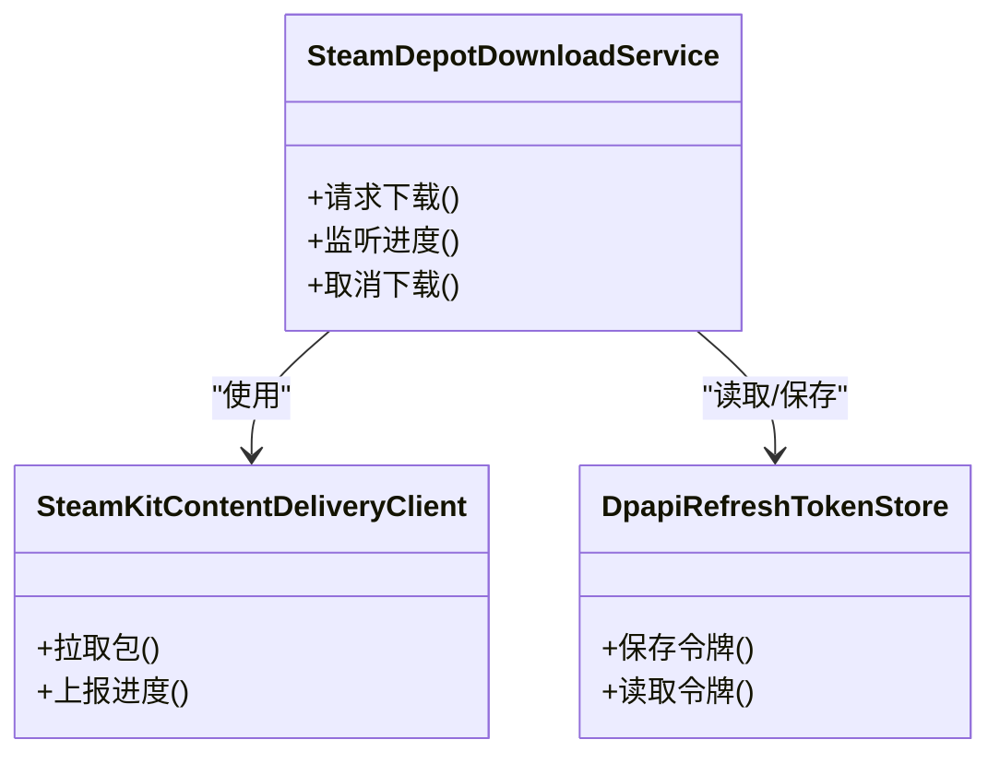
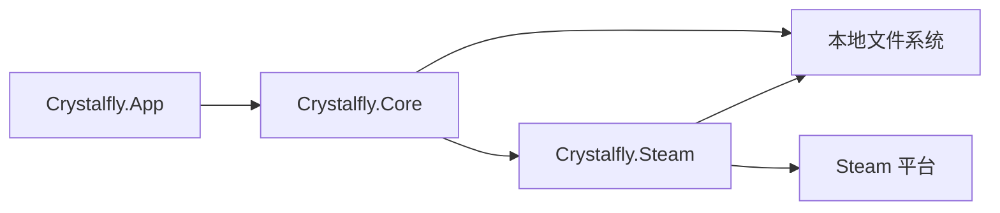

# 整体架构概览

<cite>
**本文引用的文件**   
- [Program.cs](file://src/Crystalfly.App/Program.cs)
- [App.axaml.cs](file://src/Crystalfly.App/App.axaml.cs)
- [MainWindow.axaml.cs](file://src/Crystalfly.App/Views/MainWindow.axaml.cs)
- [MainViewModel.cs](file://src/Crystalfly.App/ViewModels/MainViewModel.cs)
- [DownloadQueueService.cs](file://src/Crystalfly.App/Downloads/DownloadQueueService.cs)
- [CatalogProvider.cs](file://src/Crystalfly.Core/Catalog/CatalogProvider.cs)
- [ModInstallService.cs](file://src/Crystalffly.Core/Mods/ModInstallService.cs)
- [InstanceDirectory.cs](file://src/Crystalfly.Core/Instances/InstanceDirectory.cs)
- [CrystalflySettingsStore.cs](file://src/Crystalfly.Core/Configuration/CrystalflySettingsStore.cs)
- [SteamDepotDownloadService.cs](file://src/Crystalfly.Steam/Downloads/SteamDepotDownloadService.cs)
- [SteamKitContentDeliveryClient.cs](file://src/Crystalfly.Steam/Downloads/SteamKitContentDeliveryClient.cs)
- [DpapiRefreshTokenStore.cs](file://src/Crystalfly.Steam/Security/DpapiRefreshTokenStore.cs)
</cite>

## 目录
1. [简介](#简介)
2. [项目结构](#项目结构)
3. [核心组件](#核心组件)
4. [架构总览](#架构总览)
5. [详细组件分析](#详细组件分析)
6. [依赖关系分析](#依赖关系分析)
7. [性能考量](#性能考量)
8. [故障排查指南](#故障排查指南)
9. [结论](#结论)
10. [附录](#附录)

## 简介
本文件为 Crystalfly 项目的整体架构概览，聚焦三层架构模式：表现层（Crystalfly.App）、业务逻辑层（Crystalfly.Core）与数据访问层（Crystalfly.Steam）。文档解释各层职责、通信机制、系统上下文与外部依赖交互，并给出架构决策的原因与权衡。同时提供技术栈概览与版本兼容性说明，帮助读者快速理解系统设计与扩展点。

## 项目结构
仓库采用多工程分层组织，按“应用/核心/平台”划分：
- 表现层（Crystalfly.App）：基于 Avalonia UI 的桌面客户端，负责用户界面、视图模型与下载队列编排。
- 业务逻辑层（Crystalfly.Core）：封装游戏实例管理、模组安装与依赖解析、目录与配置、序列化、运行时前置检查等核心能力。
- 数据访问层（Crystalfly.Steam）：封装 Steam 平台相关能力，包括认证、令牌持久化、内容分发与下载。

图表来源
- [App.axaml.cs](file://src/Crystalfly.App/App.axaml.cs)
- [MainWindow.axaml.cs](file://src/Crystalfly.App/Views/MainWindow.axaml.cs)
- [MainViewModel.cs](file://src/Crystalfly.App/ViewModels/MainViewModel.cs)
- [DownloadQueueService.cs](file://src/Crystalfly.App/Downloads/DownloadQueueService.cs)
- [CatalogProvider.cs](file://src/Crystalfly.Core/Catalog/CatalogProvider.cs)
- [ModInstallService.cs](file://src/Crystalfly.Core/Mods/ModInstallService.cs)
- [InstanceDirectory.cs](file://src/Crystalfly.Core/Instances/InstanceDirectory.cs)
- [CrystalflySettingsStore.cs](file://src/Crystalfly.Core/Configuration/CrystalflySettingsStore.cs)
- [SteamDepotDownloadService.cs](file://src/Crystalfly.Steam/Downloads/SteamDepotDownloadService.cs)
- [SteamKitContentDeliveryClient.cs](file://src/Crystalfly.Steam/Downloads/SteamKitContentDeliveryClient.cs)
- [DpapiRefreshTokenStore.cs](file://src/Crystalfly.Steam/Security/DpapiRefreshTokenStore.cs)

章节来源
- [Program.cs](file://src/Crystalfly.App/Program.cs)
- [App.axaml.cs](file://src/Crystalfly.App/App.axaml.cs)
- [MainWindow.axaml.cs](file://src/Crystalfly.App/Views/MainWindow.axaml.cs)
- [MainViewModel.cs](file://src/Crystalfly.App/ViewModels/MainViewModel.cs)
- [DownloadQueueService.cs](file://src/Crystalfly.App/Downloads/DownloadQueueService.cs)
- [CatalogProvider.cs](file://src/Crystalfly.Core/Catalog/CatalogProvider.cs)
- [ModInstallService.cs](file://src/Crystalfly.Core/Mods/ModInstallService.cs)
- [InstanceDirectory.cs](file://src/Crystalfly.Core/Instances/InstanceDirectory.cs)
- [CrystalflySettingsStore.cs](file://src/Crystalfly.Core/Configuration/CrystalflySettingsStore.cs)
- [SteamDepotDownloadService.cs](file://src/Crystalfly.Steam/Downloads/SteamDepotDownloadService.cs)
- [SteamKitContentDeliveryClient.cs](file://src/Crystalfly.Steam/Downloads/SteamKitContentDeliveryClient.cs)
- [DpapiRefreshTokenStore.cs](file://src/Crystalfly.Steam/Security/DpapiRefreshTokenStore.cs)

## 核心组件
- 应用启动与生命周期
  - 入口程序负责初始化 UI 框架与应用上下文，随后创建主窗口与根视图模型，完成依赖注入与资源加载。
- 表现层（Crystalfly.App）
  - 主窗口与主题样式定义用户界面；视图模型承载状态与命令；下载队列服务协调批量任务（如模组安装、依赖修复、更新）。
- 业务逻辑层（Crystalfly.Core）
  - 目录与实例管理：定位与枚举游戏实例、构建指纹、导入/克隆/删除实例。
  - 模组与依赖：解析依赖图、生成安装计划、执行安装与回滚策略。
  - 目录与配置：读取/写入设置、路径解析、原子化 JSON 存储。
  - 目录扫描与快照：版本目录扫描、命名快照服务。
  - 运行时前置检查：进程守护、启动前评估。
- 数据访问层（Crystalfly.Steam）
  - 认证与会话：二维码挑战回调、刷新令牌存储（DPAPI）。
  - 内容分发与下载：通过 SteamKit 客户端访问内容交付网络，聚合下载进度，抽象下载路径与产物模型。

章节来源
- [Program.cs](file://src/Crystalfly.App/Program.cs)
- [App.axaml.cs](file://src/Crystalfly.App/App.axaml.cs)
- [MainWindow.axaml.cs](file://src/Crystalfly.App/Views/MainWindow.axaml.cs)
- [MainViewModel.cs](file://src/Crystalfly.App/ViewModels/MainViewModel.cs)
- [DownloadQueueService.cs](file://src/Crystalfly.App/Downloads/DownloadQueueService.cs)
- [CatalogProvider.cs](file://src/Crystalfly.Core/Catalog/CatalogProvider.cs)
- [ModInstallService.cs](file://src/Crystalfly.Core/Mods/ModInstallService.cs)
- [InstanceDirectory.cs](file://src/Crystalfly.Core/Instances/InstanceDirectory.cs)
- [CrystalflySettingsStore.cs](file://src/Crystalfly.Core/Configuration/CrystalflySettingsStore.cs)
- [SteamDepotDownloadService.cs](file://src/Crystalfly.Steam/Downloads/SteamDepotDownloadService.cs)
- [SteamKitContentDeliveryClient.cs](file://src/Crystalfly.Steam/Downloads/SteamKitContentDeliveryClient.cs)
- [DpapiRefreshTokenStore.cs](file://src/Crystalfly.Steam/Security/DpapiRefreshTokenStore.cs)

## 架构总览
下图展示系统上下文与外部依赖的交互关系：用户通过 UI 发起操作，应用层调用核心服务进行规划与执行，核心服务再委托 Steam 层进行认证与下载，最终落盘到本地文件系统。

图表来源
- [App.axaml.cs](file://src/Crystalfly.App/App.axaml.cs)
- [MainViewModel.cs](file://src/Crystalfly.App/ViewModels/MainViewModel.cs)
- [DownloadQueueService.cs](file://src/Crystalfly.App/Downloads/DownloadQueueService.cs)
- [ModInstallService.cs](file://src/Crystalfly.Core/Mods/ModInstallService.cs)
- [InstanceDirectory.cs](file://src/Crystalfly.Core/Instances/InstanceDirectory.cs)
- [SteamDepotDownloadService.cs](file://src/Crystalfly.Steam/Downloads/SteamDepotDownloadService.cs)
- [SteamKitContentDeliveryClient.cs](file://src/Crystalfly.Steam/Downloads/SteamKitContentDeliveryClient.cs)

## 详细组件分析

### 表现层（Crystalfly.App）
- 职责
  - 渲染界面、绑定视图模型、处理用户交互。
  - 编排下载队列，将复杂任务拆分为可并行执行的组与项。
- 关键流程
  - 启动后创建主窗口与根视图模型，注册主题与资源。
  - 用户触发“安装/修复/更新”等操作时，视图模型构造任务并提交至下载队列服务。
  - 队列服务根据任务类型选择具体执行器（例如 Steam 下载执行器），并聚合进度反馈给 UI。

图表来源
- [MainWindow.axaml.cs](file://src/Crystalfly.App/Views/MainWindow.axaml.cs)
- [MainViewModel.cs](file://src/Crystalfly.App/ViewModels/MainViewModel.cs)
- [DownloadQueueService.cs](file://src/Crystalfly.App/Downloads/DownloadQueueService.cs)
- [ModInstallService.cs](file://src/Crystalfly.Core/Mods/ModInstallService.cs)
- [SteamDepotDownloadService.cs](file://src/Crystalfly.Steam/Downloads/SteamDepotDownloadService.cs)

章节来源
- [MainWindow.axaml.cs](file://src/Crystalfly.App/Views/MainWindow.axaml.cs)
- [MainViewModel.cs](file://src/Crystalfly.App/ViewModels/MainViewModel.cs)
- [DownloadQueueService.cs](file://src/Crystalfly.App/Downloads/DownloadQueueService.cs)

### 业务逻辑层（Crystalfly.Core）
- 职责
  - 提供与平台无关的核心能力：目录/实例管理、模组安装与依赖解析、配置与序列化、运行时前置检查、快照等。
- 关键流程（以模组安装为例）
  - 从目录与服务中获取目标实例与模组清单。
  - 计算依赖图并生成安装计划。
  - 执行文件事务（原子写入/回滚）。
  - 记录日志与收据，供后续审计与恢复。

图表来源
- [ModInstallService.cs](file://src/Crystalfly.Core/Mods/ModInstallService.cs)
- [InstanceDirectory.cs](file://src/Crystalfly.Core/Instances/InstanceDirectory.cs)
- [CrystalflySettingsStore.cs](file://src/Crystalfly.Core/Configuration/CrystalflySettingsStore.cs)

章节来源
- [ModInstallService.cs](file://src/Crystalfly.Core/Mods/ModInstallService.cs)
- [InstanceDirectory.cs](file://src/Crystalfly.Core/Instances/InstanceDirectory.cs)
- [CrystalflySettingsStore.cs](file://src/Crystalfly.Core/Configuration/CrystalflySettingsStore.cs)

### 数据访问层（Crystalfly.Steam）
- 职责
  - 封装 Steam 平台交互：认证会话、刷新令牌安全存储、内容分发与下载。
- 关键流程（以 Steam 下载为例）
  - 使用 DPAPI 存储的刷新令牌建立会话。
  - 通过 SteamKit 客户端向内容交付网络请求包。
  - 聚合下载进度并暴露统一接口给上层。

图表来源
- [SteamDepotDownloadService.cs](file://src/Crystalfly.Steam/Downloads/SteamDepotDownloadService.cs)
- [SteamKitContentDeliveryClient.cs](file://src/Crystalfly.Steam/Downloads/SteamKitContentDeliveryClient.cs)
- [DpapiRefreshTokenStore.cs](file://src/Crystalfly.Steam/Security/DpapiRefreshTokenStore.cs)

章节来源
- [SteamDepotDownloadService.cs](file://src/Crystalfly.Steam/Downloads/SteamDepotDownloadService.cs)
- [SteamKitContentDeliveryClient.cs](file://src/Crystalfly.Steam/Downloads/SteamKitContentDeliveryClient.cs)
- [DpapiRefreshTokenStore.cs](file://src/Crystalfly.Steam/Security/DpapiRefreshTokenStore.cs)

## 依赖关系分析
- 耦合与内聚
  - 表现层仅依赖核心层的公共接口与数据模型，避免直接访问底层平台细节。
  - 核心层对 Steam 层保持松耦合，通过抽象的服务接口进行协作，便于替换实现或模拟测试。
- 外部依赖
  - Steam 平台：用于认证与内容分发。
  - 本地文件系统：用于实例目录、配置文件、下载产物与快照。
  - 用户界面：Avalonia UI 渲染与事件循环。

图表来源
- [App.axaml.cs](file://src/Crystalfly.App/App.axaml.cs)
- [MainViewModel.cs](file://src/Crystalfly.App/ViewModels/MainViewModel.cs)
- [ModInstallService.cs](file://src/Crystalfly.Core/Mods/ModInstallService.cs)
- [SteamDepotDownloadService.cs](file://src/Crystalfly.Steam/Downloads/SteamDepotDownloadService.cs)

章节来源
- [App.axaml.cs](file://src/Crystalfly.App/App.axaml.cs)
- [MainViewModel.cs](file://src/Crystalfly.App/ViewModels/MainViewModel.cs)
- [ModInstallService.cs](file://src/Crystalfly.Core/Mods/ModInstallService.cs)
- [SteamDepotDownloadService.cs](file://src/Crystalfly.Steam/Downloads/SteamDepotDownloadService.cs)

## 性能考量
- 并发与队列
  - 下载队列服务应限制并发度，避免过多并发导致 Steam CDN 限流或磁盘 I/O 瓶颈。
  - 对大文件下载采用分块与断点续传策略，提升稳定性与吞吐。
- 缓存与去重
  - 对目录扫描、清单解析结果进行缓存，减少重复 IO 与 CPU 开销。
  - 对相同包的下载进行去重，避免重复传输。
- 异步与背压
  - 全链路异步化，避免阻塞 UI 线程；在队列层引入背压控制，防止内存膨胀。
- 资源清理
  - 及时释放 Steam 客户端连接与文件句柄，避免资源泄漏。

[本节为通用指导，不直接分析具体文件]

## 故障排查指南
- 认证失败
  - 检查刷新令牌是否有效、是否被系统策略清除；确认 Steam 登录状态与二次验证流程。
- 下载中断
  - 观察下载进度聚合器输出，确认网络连通性与 Steam CDN 可用性；必要时重试与断点续传。
- 安装失败
  - 查看事务日志与收据，确认依赖解析是否正确；检查目标实例目录权限与磁盘空间。
- UI 无响应
  - 确认后台任务未阻塞 UI 线程；检查队列调度与异常传播路径。

章节来源
- [DpapiRefreshTokenStore.cs](file://src/Crystalfly.Steam/Security/DpapiRefreshTokenStore.cs)
- [SteamDepotDownloadService.cs](file://src/Crystalfly.Steam/Downloads/SteamDepotDownloadService.cs)
- [ModInstallService.cs](file://src/Crystalfly.Core/Mods/ModInstallService.cs)
- [DownloadQueueService.cs](file://src/Crystalfly.App/Downloads/DownloadQueueService.cs)

## 结论
Crystalfly 采用清晰的分层架构：表现层专注交互与编排，核心层沉淀领域能力，数据访问层屏蔽平台差异。该设计提升了可维护性、可测试性与可扩展性。通过队列化与异步化，系统在用户体验与稳定性之间取得良好平衡。未来可在插件化、更多平台适配与更细粒度的错误恢复方面持续演进。

[本节为总结性内容，不直接分析具体文件]

## 附录

### 技术栈概览
- 语言与框架
  - C#/.NET（跨平台桌面）
  - Avalonia UI（跨平台 UI 框架）
  - SteamKit（Steam 平台 SDK）
- 数据存储
  - 本地文件系统（JSON/YAML/二进制）
  - DPAPI（Windows 平台安全存储）
- 构建与脚本
  - PowerShell 脚本（构建、发布、测试）
  - Inno Setup（安装包）

[本节为通用信息，不直接分析具体文件]

### 版本与兼容性
- 操作系统
  - Windows（主要支持）
  - Linux/macOS（视 SteamKit 与 Avalonia 支持情况）
- .NET 运行时
  - 建议使用最新 LTS 版本以获得最佳兼容性与安全性
- Steam 平台
  - 需要有效的 Steam 账号与网络连接
  - 部分区域可能受 CDN 影响，建议配置代理或镜像

[本节为通用信息，不直接分析具体文件]