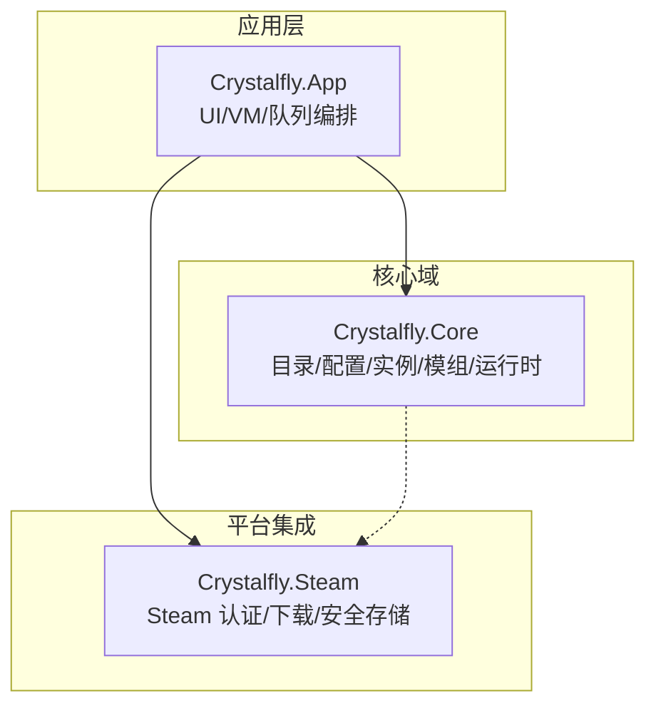
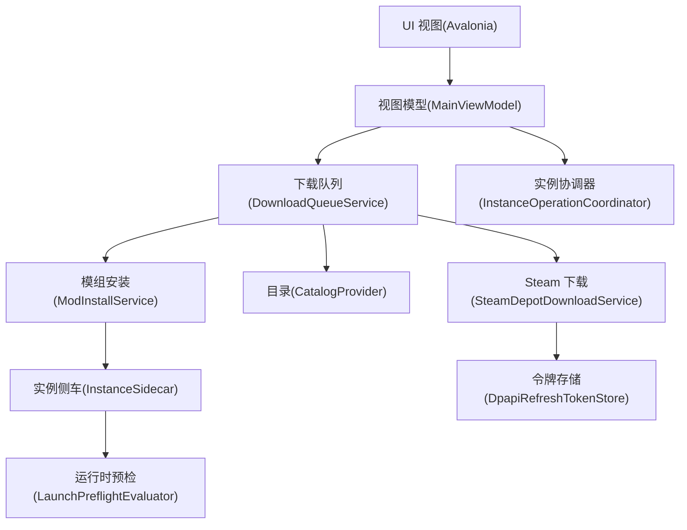
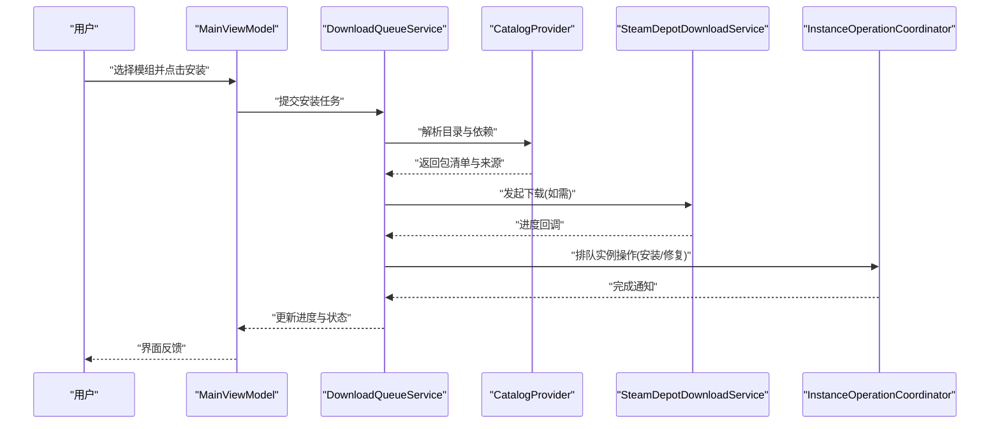
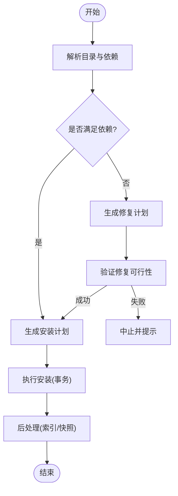
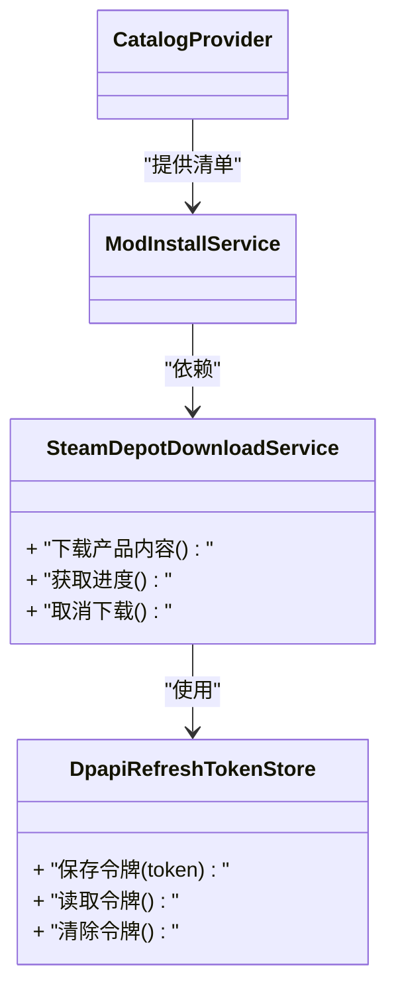
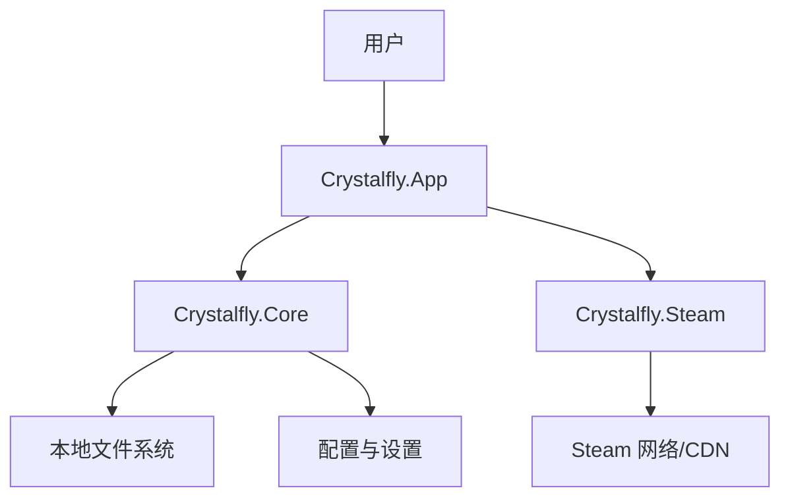
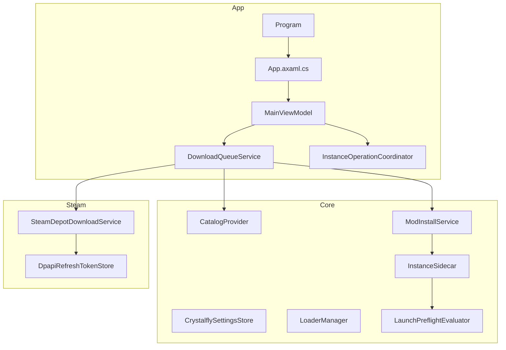

# 架构设计

<cite>
**本文引用的文件**   
- [Crystalfly.slnx](file://Crystalfly.slnx)
- [Directory.Build.props](file://Directory.Build.props)
- [Directory.Packages.props](file://Directory.Packages.props)
- [src/Crystalfly.App/Program.cs](file://src/Crystalfly.App/Program.cs)
- [src/Crystalfly.App/App.axaml.cs](file://src/Crystalfly.App/App.axaml.cs)
- [src/Crystalfly.App/ViewModels/MainViewModel.cs](file://src/Crystalfly.App/ViewModels/MainViewModel.cs)
- [src/Crystalfly.App/Downloads/DownloadQueueService.cs](file://src/Crystalfly.App/Downloads/DownloadQueueService.cs)
- [src/Crystalfly.App/Downloads/InstanceOperationCoordinator.cs](file://src/Crystalfly.App/Downloads/InstanceOperationCoordinator.cs)
- [src/Crystalfly.Core/Crystalfly.Core.csproj](file://src/Crystalfly.Core/Crystalfly.Core.csproj)
- [src/Crystalfly.Core/Catalog/CatalogProvider.cs](file://src/Crystalfly.Core/Catalog/CatalogProvider.cs)
- [src/Crystalfly.Core/Configuration/CrystalflySettingsStore.cs](file://src/Crystalfly.Core/Configuration/CrystalflySettingsStore.cs)
- [src/Crystalfly.Core/Instances/InstanceSidecar.cs](file://src/Crystalfly.Core/Instances/InstanceSidecar.cs)
- [src/Crystalfly.Core/Loaders/LoaderManager.cs](file://src/Crystalfly.Core/Loaders/LoaderManager.cs)
- [src/Crystalfly.Core/Mods/ModInstallService.cs](file://src/Crystalfly.Core/Mods/ModInstallService.cs)
- [src/Crystalfly.Core/Runtime/LaunchPreflightEvaluator.cs](file://src/Crystalfly.Core/Runtime/LaunchPreflightEvaluator.cs)
- [src/Crystalfly.Steam/Crystalfly.Steam.csproj](file://src/Crystalfly.Steam/Crystalfly.Steam.csproj)
- [src/Crystalfly.Steam/Downloads/SteamDepotDownloadService.cs](file://src/Crystalfly.Steam/Downloads/SteamDepotDownloadService.cs)
- [src/Crystalfly.Steam/Security/DpapiRefreshTokenStore.cs](file://src/Crystalfly.Steam/Security/DpapiRefreshTokenStore.cs)
</cite>

## 目录
1. [简介](#简介)
2. [项目结构](#项目结构)
3. [核心组件](#核心组件)
4. [架构总览](#架构总览)
5. [详细组件分析](#详细组件分析)
6. [依赖关系分析](#依赖关系分析)
7. [性能考虑](#性能考虑)
8. [故障排查指南](#故障排查指南)
9. [结论](#结论)
10. [附录](#附录)

## 简介
本架构设计文档面向 Crystalfly 项目的整体设计与实现，聚焦三个主要模块的职责与交互：
- Crystalfly.Core：领域核心，提供目录、配置、实例、加载器、模组安装、运行时预检等能力。
- Crystalfly.App：桌面应用层（Avalonia UI），负责用户界面、视图模型、下载队列编排与操作协调。
- Crystalfly.Steam：Steam 集成层，封装 Steam 认证、令牌持久化与内容分发下载。

文档涵盖高层设计、架构模式、系统边界、通信机制、数据流、集成模式、技术决策与权衡、约束条件、基础设施要求、可扩展性、部署拓扑、横切关注点（安全、监控、灾难恢复）、技术栈与第三方依赖及版本兼容性。

## 项目结构
仓库采用多项目解决方案组织，按职责分层与模块化划分：
- src/Crystalfly.Core：无 UI 的领域库，可被 App 与外部工具复用。
- src/Crystalfly.App：基于 Avalonia 的桌面客户端，包含 Views、ViewModels、样式与资源。
- src/Crystalfly.Steam：Steam 平台相关能力（认证、下载、安全存储）。
- tests：对应各模块的单元测试与 UI 渲染测试。
- catalog、scripts、installer、docs：元数据、构建脚本、安装包与文档。

图表来源
- [Crystalfly.slnx](file://Crystalfly.slnx)
- [src/Crystalfly.App/Program.cs](file://src/Crystalfly.App/Program.cs)
- [src/Crystalfly.Core/Crystalfly.Core.csproj](file://src/Crystalfly.Core/Crystalfly.Core.csproj)
- [src/Crystalfly.Steam/Crystalfly.Steam.csproj](file://src/Crystalfly.Steam/Crystalfly.Steam.csproj)

章节来源
- [Crystalfly.slnx](file://Crystalfly.slnx)
- [Directory.Build.props](file://Directory.Build.props)
- [Directory.Packages.props](file://Directory.Packages.props)

## 核心组件
- 应用入口与生命周期
  - Program.cs：控制台入口，初始化 Avalonia 应用并启动主窗口。
  - App.axaml.cs：应用级服务注册、主题与全局状态初始化。
- 视图模型与业务编排
  - MainViewModel.cs：聚合下载队列、实例操作、市场浏览等命令与状态。
  - DownloadQueueService.cs：下载任务入队、调度与进度聚合。
  - InstanceOperationCoordinator.cs：跨实例操作的并发控制与顺序执行。
- 核心域能力
  - CatalogProvider.cs：统一目录源接入与解析（官方/自定义/内嵌）。
  - CrystalflySettingsStore.cs：设置持久化与路径解析。
  - ModInstallService.cs：模组安装计划生成与执行。
  - LoaderManager.cs：加载器发现、状态检测与生命周期管理。
  - LaunchPreflightEvaluator.cs：运行前环境检查与修复建议。
- Steam 集成
  - SteamDepotDownloadService.cs：通过 SteamKit 进行内容分发下载。
  - DpapiRefreshTokenStore.cs：使用 DPAPI 安全存储刷新令牌。

章节来源
- [src/Crystalfly.App/Program.cs](file://src/Crystalfly.App/Program.cs)
- [src/Crystalfly.App/App.axaml.cs](file://src/Crystalfly.App/App.axaml.cs)
- [src/Crystalfly.App/ViewModels/MainViewModel.cs](file://src/Crystalfly.App/ViewModels/MainViewModel.cs)
- [src/Crystalfly.App/Downloads/DownloadQueueService.cs](file://src/Crystalfly.App/Downloads/DownloadQueueService.cs)
- [src/Crystalfly.App/Downloads/InstanceOperationCoordinator.cs](file://src/Crystalfly.App/Downloads/InstanceOperationCoordinator.cs)
- [src/Crystalfly.Core/Catalog/CatalogProvider.cs](file://src/Crystalfly.Core/Catalog/CatalogProvider.cs)
- [src/Crystalfly.Core/Configuration/CrystalflySettingsStore.cs](file://src/Crystalfly.Core/Configuration/CrystalflySettingsStore.cs)
- [src/Crystalfly.Core/Mods/ModInstallService.cs](file://src/Crystalfly.Core/Mods/ModInstallService.cs)
- [src/Crystalfly.Core/Loaders/LoaderManager.cs](file://src/Crystalfly.Core/Loaders/LoaderManager.cs)
- [src/Crystalfly.Core/Runtime/LaunchPreflightEvaluator.cs](file://src/Crystalfly.Core/Runtime/LaunchPreflightEvaluator.cs)
- [src/Crystalfly.Steam/Downloads/SteamDepotDownloadService.cs](file://src/Crystalfly.Steam/Downloads/SteamDepotDownloadService.cs)
- [src/Crystalfly.Steam/Security/DpapiRefreshTokenStore.cs](file://src/Crystalfly.Steam/Security/DpapiRefreshTokenStore.cs)

## 架构总览
系统采用分层与模块化结合的设计：
- 表现层（App）：MVVM 模式，ViewModel 编排业务，View 仅负责展示。
- 领域层（Core）：以服务为中心，暴露稳定的接口契约，屏蔽平台差异。
- 平台集成层（Steam）：封装 Steam 协议与本地安全存储，供 Core 或 App 按需调用。

图表来源
- [src/Crystalfly.App/ViewModels/MainViewModel.cs](file://src/Crystalfly.App/ViewModels/MainViewModel.cs)
- [src/Crystalfly.App/Downloads/DownloadQueueService.cs](file://src/Crystalfly.App/Downloads/DownloadQueueService.cs)
- [src/Crystalfly.App/Downloads/InstanceOperationCoordinator.cs](file://src/Crystalfly.App/Downloads/InstanceOperationCoordinator.cs)
- [src/Crystalfly.Core/Mods/ModInstallService.cs](file://src/Crystalfly.Core/Mods/ModInstallService.cs)
- [src/Crystalfly.Core/Catalog/CatalogProvider.cs](file://src/Crystalfly.Core/Catalog/CatalogProvider.cs)
- [src/Crystalfly.Core/Instances/InstanceSidecar.cs](file://src/Crystalfly.Core/Instances/InstanceSidecar.cs)
- [src/Crystalfly.Core/Runtime/LaunchPreflightEvaluator.cs](file://src/Crystalfly.Core/Runtime/LaunchPreflightEvaluator.cs)
- [src/Crystalfly.Steam/Downloads/SteamDepotDownloadService.cs](file://src/Crystalfly.Steam/Downloads/SteamDepotDownloadService.cs)
- [src/Crystalfly.Steam/Security/DpapiRefreshTokenStore.cs](file://src/Crystalfly.Steam/Security/DpapiRefreshTokenStore.cs)

## 详细组件分析

### 应用层（Crystalfly.App）
- 职责
  - 应用启动与 DI 容器装配。
  - MVVM 绑定、主题与国际化。
  - 下载队列编排、任务分组与进度展示。
  - 实例操作协调（克隆、导入、删除、修复）。
- 关键类与协作
  - Program.cs：创建并运行 Avalonia 应用。
  - App.axaml.cs：注册服务、注入 ViewModel 与资源。
  - MainViewModel.cs：组合下载队列、实例协调器与目录查询。
  - DownloadQueueService.cs：维护任务队列、并发度与重试策略。
  - InstanceOperationCoordinator.cs：保证同一实例的串行化操作，避免冲突。
- 通信与数据流
  - View -> ViewModel：命令与属性变更事件。
  - ViewModel -> Services：调用下载与实例服务，返回结果与进度。
  - 队列内部：生产者-消费者模型，支持取消与优先级。

图表来源
- [src/Crystalfly.App/ViewModels/MainViewModel.cs](file://src/Crystalfly.App/ViewModels/MainViewModel.cs)
- [src/Crystalfly.App/Downloads/DownloadQueueService.cs](file://src/Crystalfly.App/Downloads/DownloadQueueService.cs)
- [src/Crystalfly.Core/Catalog/CatalogProvider.cs](file://src/Crystalfly.Core/Catalog/CatalogProvider.cs)
- [src/Crystalfly.Steam/Downloads/SteamDepotDownloadService.cs](file://src/Crystalfly.Steam/Downloads/SteamDepotDownloadService.cs)
- [src/Crystalfly.App/Downloads/InstanceOperationCoordinator.cs](file://src/Crystalfly.App/Downloads/InstanceOperationCoordinator.cs)

章节来源
- [src/Crystalfly.App/Program.cs](file://src/Crystalfly.App/Program.cs)
- [src/Crystalfly.App/App.axaml.cs](file://src/Crystalfly.App/App.axaml.cs)
- [src/Crystalfly.App/ViewModels/MainViewModel.cs](file://src/Crystalfly.App/ViewModels/MainViewModel.cs)
- [src/Crystalfly.App/Downloads/DownloadQueueService.cs](file://src/Crystalfly.App/Downloads/DownloadQueueService.cs)
- [src/Crystalfly.App/Downloads/InstanceOperationCoordinator.cs](file://src/Crystalfly.App/Downloads/InstanceOperationCoordinator.cs)

### 核心域（Crystalfly.Core）
- 职责
  - 目录聚合与解析（官方/自定义/内嵌）。
  - 配置与路径管理。
  - 实例生命周期与侧车文件管理。
  - 加载器发现与状态检测。
  - 模组依赖解析、安装计划与执行。
  - 运行前环境评估与修复建议。
- 关键类与协作
  - CatalogProvider.cs：统一目录访问抽象，合并多源数据。
  - CrystalflySettingsStore.cs：读写设置与计算工作目录。
  - ModInstallService.cs：根据依赖图生成安装计划并执行。
  - LoaderManager.cs：扫描与校验加载器包。
  - InstanceSidecar.cs：管理与游戏实例相关的侧车文件。
  - LaunchPreflightEvaluator.cs：检查必要文件、权限与依赖。
- 数据流
  - 目录源 -> 解析器 -> 合并器 -> 消费方（App/Steam）。
  - 安装流程：依赖解析 -> 计划生成 -> 事务式写入 -> 回滚保障。

图表来源
- [src/Crystalfly.Core/Catalog/CatalogProvider.cs](file://src/Crystalfly.Core/Catalog/CatalogProvider.cs)
- [src/Crystalfly.Core/Mods/ModInstallService.cs](file://src/Crystalfly.Core/Mods/ModInstallService.cs)

章节来源
- [src/Crystalfly.Core/Catalog/CatalogProvider.cs](file://src/Crystalfly.Core/Catalog/CatalogProvider.cs)
- [src/Crystalfly.Core/Configuration/CrystalflySettingsStore.cs](file://src/Crystalfly.Core/Configuration/CrystalflySettingsStore.cs)
- [src/Crystalfly.Core/Mods/ModInstallService.cs](file://src/Crystalfly.Core/Mods/ModInstallService.cs)
- [src/Crystalfly.Core/Loaders/LoaderManager.cs](file://src/Crystalfly.Core/Loaders/LoaderManager.cs)
- [src/Crystalfly.Core/Instances/InstanceSidecar.cs](file://src/Crystalfly.Core/Instances/InstanceSidecar.cs)
- [src/Crystalfly.Core/Runtime/LaunchPreflightEvaluator.cs](file://src/Crystalfly.Core/Runtime/LaunchPreflightEvaluator.cs)

### Steam 集成层（Crystalfly.Steam）
- 职责
  - Steam 登录与会话管理。
  - 刷新令牌的安全存储（DPAPI）。
  - 通过 SteamKit 进行内容分发下载与进度上报。
- 关键类与协作
  - SteamDepotDownloadService.cs：封装下载会话、断点续传与速率限制。
  - DpapiRefreshTokenStore.cs：利用操作系统凭据保护敏感信息。
- 集成模式
  - 适配器模式：将 Steam 特定 API 适配为通用下载接口。
  - 观察者模式：进度回调与错误事件上抛至上层队列。

图表来源
- [src/Crystalfly.Steam/Downloads/SteamDepotDownloadService.cs](file://src/Crystalfly.Steam/Downloads/SteamDepotDownloadService.cs)
- [src/Crystalfly.Steam/Security/DpapiRefreshTokenStore.cs](file://src/Crystalfly.Steam/Security/DpapiRefreshTokenStore.cs)
- [src/Crystalfly.Core/Catalog/CatalogProvider.cs](file://src/Crystalfly.Core/Catalog/CatalogProvider.cs)
- [src/Crystalfly.Core/Mods/ModInstallService.cs](file://src/Crystalfly.Core/Mods/ModInstallService.cs)

章节来源
- [src/Crystalfly.Steam/Downloads/SteamDepotDownloadService.cs](file://src/Crystalfly.Steam/Downloads/SteamDepotDownloadService.cs)
- [src/Crystalfly.Steam/Security/DpapiRefreshTokenStore.cs](file://src/Crystalfly.Steam/Security/DpapiRefreshTokenStore.cs)

## 依赖关系分析
- 项目引用
  - Crystalfly.App 引用 Crystalfly.Core 与 Crystalfly.Steam。
  - Crystalfly.Core 不反向引用 App 或 Steam，保持领域纯净。
  - Crystalfly.Steam 独立于 App，可被 Core 或外部进程复用。
- 外部依赖
  - Avalonia UI：用于桌面界面。
  - SteamKit：用于 Steam 内容分发与认证。
  - JSON 序列化与文件系统 IO：用于配置、清单与事务日志。
- 耦合与内聚
  - 通过接口与服务抽象降低耦合；Core 高内聚，对外暴露稳定契约。
  - App 作为编排层，集中处理 UI 与队列逻辑。

图表来源
- [Crystalfly.slnx](file://Crystalfly.slnx)
- [src/Crystalfly.App/Crystalfly.App.csproj](file://src/Crystalfly.App/Crystalfly.App.csproj)
- [src/Crystalfly.Core/Crystalfly.Core.csproj](file://src/Crystalfly.Core/Crystalfly.Core.csproj)
- [src/Crystalfly.Steam/Crystalfly.Steam.csproj](file://src/Crystalfly.Steam/Crystalfly.Steam.csproj)

章节来源
- [Crystalfly.slnx](file://Crystalfly.slnx)
- [Directory.Build.props](file://Directory.Build.props)
- [Directory.Packages.props](file://Directory.Packages.props)

## 性能考虑
- 下载并发与限速
  - 通过队列并发度与速率限制避免网络拥塞与磁盘抖动。
- 依赖解析与计划生成
  - 缓存已解析的目录与依赖图，减少重复计算。
- 事务式写入
  - 批量文件操作采用事务与原子替换，降低部分失败风险。
- UI 响应性
  - 异步任务与进度回调，避免阻塞 UI 线程。

[本节为通用指导，无需源码引用]

## 故障排查指南
- 常见问题定位
  - 下载失败：检查 Steam 令牌有效性、网络连通性与配额限制。
  - 安装中断：查看事务日志与回滚记录，确认依赖是否满足。
  - 实例无法启动：运行预检评估，依据修复建议补齐缺失文件或依赖。
- 诊断手段
  - 启用更详细的日志输出，定位具体阶段。
  - 隔离问题实例，复现最小场景。
  - 清理临时文件与缓存，重新拉取目录与清单。

章节来源
- [src/Crystalfly.Core/Runtime/LaunchPreflightEvaluator.cs](file://src/Crystalfly.Core/Runtime/LaunchPreflightEvaluator.cs)
- [src/Crystalfly.Steam/Security/DpapiRefreshTokenStore.cs](file://src/Crystalfly.Steam/Security/DpapiRefreshTokenStore.cs)
- [src/Crystalfly.Core/Mods/ModInstallService.cs](file://src/Crystalfly.Core/Mods/ModInstallService.cs)

## 结论
Crystalffly 采用清晰的分层与模块化设计，核心域保持稳定与可复用，应用层专注用户体验与编排，Steam 层封装平台细节。通过队列与协调器提升稳定性与可观测性，事务式写入与预检机制增强可靠性。该架构具备良好的扩展性与可维护性，适合持续演进与多平台集成。

[本节为总结，无需源码引用]

## 附录

### 系统上下文图

图表来源
- [src/Crystalfly.App/Program.cs](file://src/Crystalfly.App/Program.cs)
- [src/Crystalfly.Core/Crystalfly.Core.csproj](file://src/Crystalfly.Core/Crystalfly.Core.csproj)
- [src/Crystalfly.Steam/Crystalfly.Steam.csproj](file://src/Crystalfly.Steam/Crystalfly.Steam.csproj)

### 组件分解图

图表来源
- [src/Crystalfly.App/Program.cs](file://src/Crystalfly.App/Program.cs)
- [src/Crystalfly.App/App.axaml.cs](file://src/Crystalfly.App/App.axaml.cs)
- [src/Crystalfly.App/ViewModels/MainViewModel.cs](file://src/Crystalfly.App/ViewModels/MainViewModel.cs)
- [src/Crystalfly.App/Downloads/DownloadQueueService.cs](file://src/Crystalfly.App/Downloads/DownloadQueueService.cs)
- [src/Crystalfly.App/Downloads/InstanceOperationCoordinator.cs](file://src/Crystalfly.App/Downloads/InstanceOperationCoordinator.cs)
- [src/Crystalfly.Core/Catalog/CatalogProvider.cs](file://src/Crystalfly.Core/Catalog/CatalogProvider.cs)
- [src/Crystalfly.Core/Configuration/CrystalflySettingsStore.cs](file://src/Crystalfly.Core/Configuration/CrystalflySettingsStore.cs)
- [src/Crystalfly.Core/Mods/ModInstallService.cs](file://src/Crystalfly.Core/Mods/ModInstallService.cs)
- [src/Crystalfly.Core/Loaders/LoaderManager.cs](file://src/Crystalfly.Core/Loaders/LoaderManager.cs)
- [src/Crystalfly.Core/Instances/InstanceSidecar.cs](file://src/Crystalfly.Core/Instances/InstanceSidecar.cs)
- [src/Crystalfly.Core/Runtime/LaunchPreflightEvaluator.cs](file://src/Crystalfly.Core/Runtime/LaunchPreflightEvaluator.cs)
- [src/Crystalfly.Steam/Downloads/SteamDepotDownloadService.cs](file://src/Crystalfly.Steam/Downloads/SteamDepotDownloadService.cs)
- [src/Crystalfly.Steam/Security/DpapiRefreshTokenStore.cs](file://src/Crystalfly.Steam/Security/DpapiRefreshTokenStore.cs)

### 横切关注点
- 安全性
  - 使用 DPAPI 存储刷新令牌，避免明文泄露。
  - 对目录与文件操作进行权限校验与白名单控制。
- 监控与可观测性
  - 下载进度、安装阶段与错误码上报，便于问题定位。
  - 结构化日志记录关键路径与异常堆栈。
- 灾难恢复
  - 事务式写入与快照机制，失败自动回滚。
  - 预检与修复建议，快速恢复可用状态。

[本节为通用指导，无需源码引用]

### 技术栈与依赖
- 技术栈
  - .NET 运行时与 C# 语言。
  - Avalonia UI 框架用于跨平台桌面界面。
  - SteamKit 用于 Steam 平台集成。
- 版本与兼容性
  - 通过 Directory.Packages.props 统一管理 NuGet 包版本。
  - 目标平台与运行时由 Directory.Build.props 定义。

章节来源
- [Directory.Packages.props](file://Directory.Packages.props)
- [Directory.Build.props](file://Directory.Build.props)

### 部署拓扑
- 单机桌面部署
  - 用户机器直接运行 Crystalfly.App。
  - 依赖本地文件系统与 Steam 客户端/网络。
- 扩展形态
  - 可将 Crystalfly.Core 与 Crystalfly.Steam 抽取为服务端能力，提供 REST/gRPC 接口供多客户端复用。
  - 引入消息队列与对象存储以支撑大规模下载与目录同步。

[本节为概念性说明，无需源码引用]