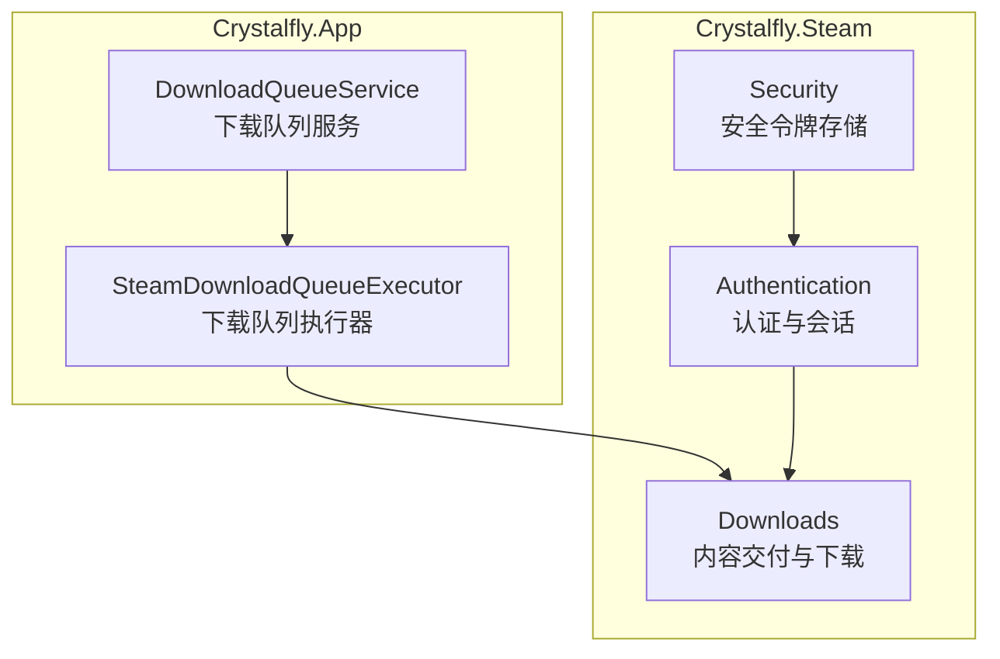
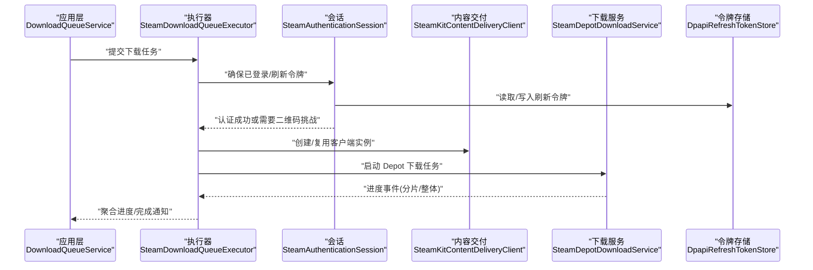
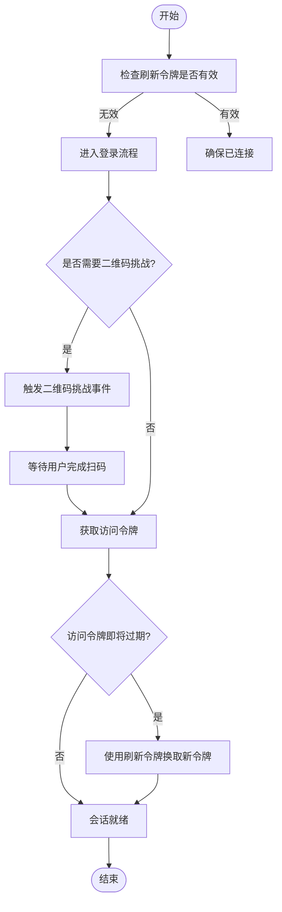
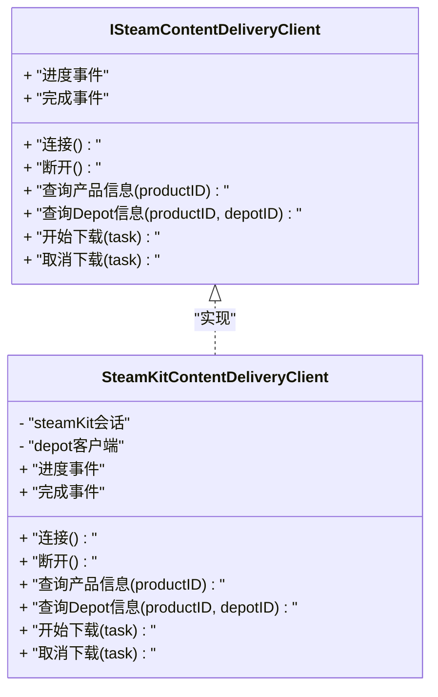
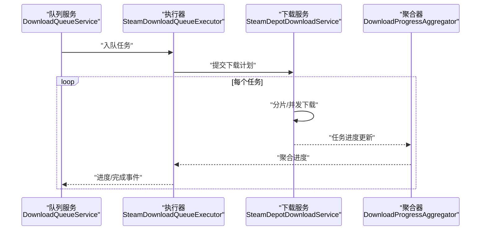
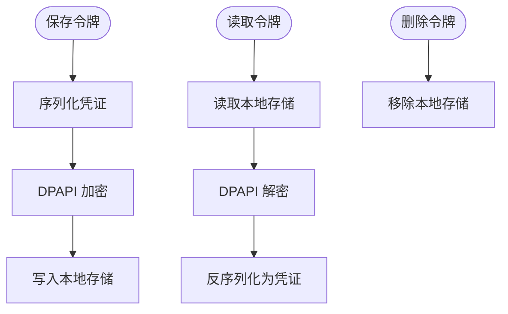

# Steam 集成模块 (Crystalfly.Steam)

<cite>
**本文引用的文件**   
- [SteamAuthenticationSession.cs](file://src/Crystalfly.Steam/Authentication/SteamAuthenticationSession.cs)
- [ISteamGuardCallback.cs](file://src/Crystalfly.Steam/Authentication/ISteamGuardCallback.cs)
- [QrChallengeEventArgs.cs](file://src/Crystalfly.Steam/Authentication/QrChallengeEventArgs.cs)
- [ISteamContentDeliveryClient.cs](file://src/Crystalfly.Steam/Downloads/ISteamContentDeliveryClient.cs)
- [SteamKitContentDeliveryClient.cs](file://src/Crystalfly.Steam/Downloads/SteamKitContentDeliveryClient.cs)
- [SteamDepotDownloadService.cs](file://src/Crystalfly.Steam/Downloads/SteamDepotDownloadService.cs)
- [DownloadProgressAggregator.cs](file://src/Crystalfly.Steam/Downloads/DownloadProgressAggregator.cs)
- [DpapiRefreshTokenStore.cs](file://src/Crystalfly.Steam/Security/DpapiRefreshTokenStore.cs)
- [RefreshTokenCredential.cs](file://src/Crystalfly.Steam/Security/RefreshTokenCredential.cs)
- [SteamDownloadQueueExecutor.cs](file://src/Crystalfly.App/Downloads/SteamDownloadQueueExecutor.cs)
- [DownloadQueueService.cs](file://src/Crystalfly.App/Downloads/DownloadQueueService.cs)
</cite>

## 目录
1. [简介](#简介)
2. [项目结构](#项目结构)
3. [核心组件](#核心组件)
4. [架构总览](#架构总览)
5. [详细组件分析](#详细组件分析)
6. [依赖关系分析](#依赖关系分析)
7. [性能考量](#性能考量)
8. [故障排查指南](#故障排查指南)
9. [结论](#结论)
10. [附录](#附录)

## 简介
本设计文档聚焦于 Crystalfly.Steam 模块，该模块基于 SteamKit2 提供与 Steam 平台的深度集成能力，涵盖认证会话管理、内容交付（下载）与安全令牌持久化等关键职责。文档将深入解析以下方面：
- 认证与会话管理：二维码挑战、令牌刷新、安全回调机制
- 内容交付抽象与实现：ISteamContentDeliveryClient 接口设计与 SteamKitContentDeliveryClient 具体实现
- 下载服务：队列管理与进度聚合
- 安全存储：基于 DPAPI 的刷新令牌存储
- 与核心模块的集成方式与数据交换格式
- API 使用示例与错误处理策略

## 项目结构
Crystalfly.Steam 位于 src/Crystalfly.Steam 下，按职责划分为 Authentication、Downloads、Security 三个子目录；应用层在 Crystalfly.App 中通过下载执行器与队列服务对接该模块。

图表来源
- [SteamAuthenticationSession.cs:1-200](file://src/Crystalfly.Steam/Authentication/SteamAuthenticationSession.cs#L1-L200)
- [ISteamContentDeliveryClient.cs:1-200](file://src/Crystalfly.Steam/Downloads/ISteamContentDeliveryClient.cs#L1-L200)
- [SteamKitContentDeliveryClient.cs:1-200](file://src/Crystalfly.Steam/Downloads/SteamKitContentDeliveryClient.cs#L1-L200)
- [SteamDepotDownloadService.cs:1-200](file://src/Crystalfly.Steam/Downloads/SteamDepotDownloadService.cs#L1-L200)
- [DpapiRefreshTokenStore.cs:1-200](file://src/Crystalfly.Steam/Security/DpapiRefreshTokenStore.cs#L1-L200)
- [SteamDownloadQueueExecutor.cs:1-200](file://src/Crystalfly.App/Downloads/SteamDownloadQueueExecutor.cs#L1-L200)
- [DownloadQueueService.cs:1-200](file://src/Crystalfly.App/Downloads/DownloadQueueService.cs#L1-L200)

章节来源
- [SteamAuthenticationSession.cs:1-200](file://src/Crystalfly.Steam/Authentication/SteamAuthenticationSession.cs#L1-L200)
- [ISteamContentDeliveryClient.cs:1-200](file://src/Crystalfly.Steam/Downloads/ISteamContentDeliveryClient.cs#L1-L200)
- [SteamKitContentDeliveryClient.cs:1-200](file://src/Crystalfly.Steam/Downloads/SteamKitContentDeliveryClient.cs#L1-L200)
- [SteamDepotDownloadService.cs:1-200](file://src/Crystalfly.Steam/Downloads/SteamDepotDownloadService.cs#L1-L200)
- [DpapiRefreshTokenStore.cs:1-200](file://src/Crystalfly.Steam/Security/DpapiRefreshTokenStore.cs#L1-L200)
- [SteamDownloadQueueExecutor.cs:1-200](file://src/Crystalfly.App/Downloads/SteamDownloadQueueExecutor.cs#L1-L200)
- [DownloadQueueService.cs:1-200](file://src/Crystalfly.App/Downloads/DownloadQueueService.cs#L1-L200)

## 核心组件
- 认证与会话
  - SteamAuthenticationSession：封装与 Steam 的认证交互，包括登录流程、二维码挑战、令牌刷新与会话生命周期管理。
  - ISteamGuardCallback：定义安全码/二次验证回调契约，供上层订阅并处理用户交互。
  - QrChallengeEventArgs：承载二维码挑战事件的数据载体。
- 内容交付与下载
  - ISteamContentDeliveryClient：抽象的 Steam 内容交付客户端接口，屏蔽底层实现细节。
  - SteamKitContentDeliveryClient：基于 SteamKit2 的具体实现，负责连接、鉴权、获取 Depot 信息、发起下载任务与处理进度/完成事件。
  - SteamDepotDownloadService：面向业务层的下载服务，协调多个 Depot 的下载任务、重试与状态汇总。
  - DownloadProgressAggregator：聚合多任务进度，计算总体百分比、速率与剩余时间等指标。
- 安全令牌存储
  - DpapiRefreshTokenStore：基于 Windows DPAPI 的安全本地存储，用于持久化刷新令牌。
  - RefreshTokenCredential：刷新令牌的凭证模型。

章节来源
- [SteamAuthenticationSession.cs:1-200](file://src/Crystalfly.Steam/Authentication/SteamAuthenticationSession.cs#L1-L200)
- [ISteamGuardCallback.cs:1-100](file://src/Crystalfly.Steam/Authentication/ISteamGuardCallback.cs#L1-L100)
- [QrChallengeEventArgs.cs:1-100](file://src/Crystalfly.Steam/Authentication/QrChallengeEventArgs.cs#L1-L100)
- [ISteamContentDeliveryClient.cs:1-200](file://src/Crystalfly.Steam/Downloads/ISteamContentDeliveryClient.cs#L1-L200)
- [SteamKitContentDeliveryClient.cs:1-200](file://src/Crystalfly.Steam/Downloads/SteamKitContentDeliveryClient.cs#L1-L200)
- [SteamDepotDownloadService.cs:1-200](file://src/Crystalfly.Steam/Downloads/SteamDepotDownloadService.cs#L1-L200)
- [DownloadProgressAggregator.cs:1-200](file://src/Crystalfly.Steam/Downloads/DownloadProgressAggregator.cs#L1-L200)
- [DpapiRefreshTokenStore.cs:1-200](file://src/Crystalfly.Steam/Security/DpapiRefreshTokenStore.cs#L1-L200)
- [RefreshTokenCredential.cs:1-100](file://src/Crystalfly.Steam/Security/RefreshTokenCredential.cs#L1-L100)

## 架构总览
下图展示了从应用层到 Crystalfly.Steam 模块的整体调用链与数据流向。

图表来源
- [DownloadQueueService.cs:1-200](file://src/Crystalfly.App/Downloads/DownloadQueueService.cs#L1-L200)
- [SteamDownloadQueueExecutor.cs:1-200](file://src/Crystalfly.App/Downloads/SteamDownloadQueueExecutor.cs#L1-L200)
- [SteamAuthenticationSession.cs:1-200](file://src/Crystalfly.Steam/Authentication/SteamAuthenticationSession.cs#L1-L200)
- [DpapiRefreshTokenStore.cs:1-200](file://src/Crystalfly.Steam/Security/DpapiRefreshTokenStore.cs#L1-L200)
- [SteamKitContentDeliveryClient.cs:1-200](file://src/Crystalfly.Steam/Downloads/SteamKitContentDeliveryClient.cs#L1-L200)
- [SteamDepotDownloadService.cs:1-200](file://src/Crystalfly.Steam/Downloads/SteamDepotDownloadService.cs#L1-L200)

## 详细组件分析

### 认证与会话管理（SteamAuthenticationSession）
- 职责
  - 维护与 Steam 的认证会话，支持交互式登录、二维码挑战、令牌刷新与自动续期。
  - 暴露安全回调接口以通知上层进行用户交互（如扫码确认）。
- 关键流程
  - 初始化：加载或生成刷新令牌，建立基础连接。
  - 登录：若未登录，触发登录流程；遇到二维码挑战时抛出事件，等待用户完成。
  - 刷新：当访问令牌过期或即将过期时，使用刷新令牌换取新令牌。
  - 退出：清理会话资源，必要时清除敏感缓存。
- 安全机制
  - 刷新令牌由 DpapiRefreshTokenStore 安全存储，避免明文落盘。
  - 二维码挑战通过回调传递，不直接暴露敏感数据给第三方。
- 异常与恢复
  - 网络异常：指数退避重试。
  - 令牌失效：自动刷新；失败则提示重新登录。
  - 用户取消：中断当前登录流程并释放资源。

图表来源
- [SteamAuthenticationSession.cs:1-200](file://src/Crystalfly.Steam/Authentication/SteamAuthenticationSession.cs#L1-L200)
- [ISteamGuardCallback.cs:1-100](file://src/Crystalfly.Steam/Authentication/ISteamGuardCallback.cs#L1-L100)
- [QrChallengeEventArgs.cs:1-100](file://src/Crystalfly.Steam/Authentication/QrChallengeEventArgs.cs#L1-L100)
- [DpapiRefreshTokenStore.cs:1-200](file://src/Crystalfly.Steam/Security/DpapiRefreshTokenStore.cs#L1-L200)

章节来源
- [SteamAuthenticationSession.cs:1-200](file://src/Crystalfly.Steam/Authentication/SteamAuthenticationSession.cs#L1-L200)
- [ISteamGuardCallback.cs:1-100](file://src/Crystalfly.Steam/Authentication/ISteamGuardCallback.cs#L1-L100)
- [QrChallengeEventArgs.cs:1-100](file://src/Crystalfly.Steam/Authentication/QrChallengeEventArgs.cs#L1-L100)
- [DpapiRefreshTokenStore.cs:1-200](file://src/Crystalfly.Steam/Security/DpapiRefreshTokenStore.cs#L1-L200)

### 内容交付客户端（ISteamContentDeliveryClient 与 SteamKitContentDeliveryClient）
- 抽象设计
  - ISteamContentDeliveryClient 定义统一的客户端契约，包括连接、认证、查询产品/Depot、发起下载、监听进度与完成事件、关闭资源等。
- 具体实现
  - SteamKitContentDeliveryClient 基于 SteamKit2 实现上述契约，内部封装 SteamKit 的会话、Depot 客户端与下载管道。
  - 负责处理分片下载、断点续传（若可用）、并发控制与错误重试。
- 与下载服务的协作
  - SteamDepotDownloadService 根据产品与版本信息，构造下载计划，委托客户端执行，并将进度事件聚合上报。

图表来源
- [ISteamContentDeliveryClient.cs:1-200](file://src/Crystalfly.Steam/Downloads/ISteamContentDeliveryClient.cs#L1-L200)
- [SteamKitContentDeliveryClient.cs:1-200](file://src/Crystalfly.Steam/Downloads/SteamKitContentDeliveryClient.cs#L1-L200)

章节来源
- [ISteamContentDeliveryClient.cs:1-200](file://src/Crystalfly.Steam/Downloads/ISteamContentDeliveryClient.cs#L1-L200)
- [SteamKitContentDeliveryClient.cs:1-200](file://src/Crystalfly.Steam/Downloads/SteamKitContentDeliveryClient.cs#L1-L200)

### 下载服务与队列管理（SteamDepotDownloadService 与 SteamDownloadQueueExecutor）
- 下载服务
  - SteamDepotDownloadService 负责解析产品与 Depot 清单，构建下载任务集，调度并发，处理失败重试，并向上传递进度与完成事件。
- 队列执行器
  - SteamDownloadQueueExecutor 作为应用层与下载服务之间的桥梁，接收来自队列服务的任务，绑定认证会话与内容交付客户端，执行并回传结果。
- 进度聚合
  - DownloadProgressAggregator 对多个任务的进度进行加权聚合，输出总体百分比、瞬时速率、累计大小与预估剩余时间等指标。

图表来源
- [SteamDepotDownloadService.cs:1-200](file://src/Crystalfly.Steam/Downloads/SteamDepotDownloadService.cs#L1-L200)
- [SteamDownloadQueueExecutor.cs:1-200](file://src/Crystalfly.App/Downloads/SteamDownloadQueueExecutor.cs#L1-L200)
- [DownloadProgressAggregator.cs:1-200](file://src/Crystalfly.Steam/Downloads/DownloadProgressAggregator.cs#L1-L200)
- [DownloadQueueService.cs:1-200](file://src/Crystalfly.App/Downloads/DownloadQueueService.cs#L1-L200)

章节来源
- [SteamDepotDownloadService.cs:1-200](file://src/Crystalfly.Steam/Downloads/SteamDepotDownloadService.cs#L1-L200)
- [SteamDownloadQueueExecutor.cs:1-200](file://src/Crystalfly.App/Downloads/SteamDownloadQueueExecutor.cs#L1-L200)
- [DownloadProgressAggregator.cs:1-200](file://src/Crystalfly.Steam/Downloads/DownloadProgressAggregator.cs#L1-L200)
- [DownloadQueueService.cs:1-200](file://src/Crystalfly.App/Downloads/DownloadQueueService.cs#L1-L200)

### 安全令牌存储（DpapiRefreshTokenStore）
- 职责
  - 使用 Windows DPAPI 对刷新令牌进行加密存储与解密读取，保证本地安全性。
- 关键操作
  - 保存：序列化凭证后加密写入本地存储。
  - 读取：解密并反序列化为凭证对象。
  - 删除：移除本地存储条目。
- 错误处理
  - 存储不可用或权限不足：返回明确错误，提示上层降级或引导用户修复环境。
  - 解密失败：视为令牌损坏，要求重新登录。

图表来源
- [DpapiRefreshTokenStore.cs:1-200](file://src/Crystalfly.Steam/Security/DpapiRefreshTokenStore.cs#L1-L200)
- [RefreshTokenCredential.cs:1-100](file://src/Crystalfly.Steam/Security/RefreshTokenCredential.cs#L1-L100)

章节来源
- [DpapiRefreshTokenStore.cs:1-200](file://src/Crystalfly.Steam/Security/DpapiRefreshTokenStore.cs#L1-L200)
- [RefreshTokenCredential.cs:1-100](file://src/Crystalfly.Steam/Security/RefreshTokenCredential.cs#L1-L100)

### API 使用示例与错误处理策略
- 典型用法
  - 初始化会话：创建 SteamAuthenticationSession，注册安全回调，配置刷新令牌存储。
  - 登录流程：调用登录方法，若触发二维码挑战，展示二维码并等待用户完成。
  - 下载任务：通过 SteamDownloadQueueExecutor 提交任务，订阅进度与完成事件。
  - 令牌刷新：会话内部自动刷新，无需上层干预；仅在刷新失败时提示重新登录。
- 错误处理建议
  - 网络异常：采用指数退避与最大重试次数限制。
  - 令牌失效：捕获刷新失败异常，引导用户重新登录。
  - 用户取消：及时取消下载任务并释放资源。
  - 存储异常：记录诊断信息并提供降级路径（如临时禁用自动登录）。

章节来源
- [SteamAuthenticationSession.cs:1-200](file://src/Crystalfly.Steam/Authentication/SteamAuthenticationSession.cs#L1-L200)
- [SteamDownloadQueueExecutor.cs:1-200](file://src/Crystalfly.App/Downloads/SteamDownloadQueueExecutor.cs#L1-L200)
- [DpapiRefreshTokenStore.cs:1-200](file://src/Crystalfly.Steam/Security/DpapiRefreshTokenStore.cs#L1-L200)

### 与核心模块的集成与数据交换格式
- 集成方式
  - 应用层通过 DownloadQueueService 管理下载队列，SteamDownloadQueueExecutor 作为适配器调用 Crystalfly.Steam 的下载服务。
  - 认证与会话由 SteamAuthenticationSession 统一管理，为下载流程提供鉴权上下文。
- 数据交换格式
  - 下载任务通常包含产品 ID、Depot ID、目标路径、校验信息等字段。
  - 进度事件包含任务标识、已下载字节数、总字节数、瞬时速率与状态码。
  - 完成事件包含任务标识、最终状态（成功/失败）、错误信息与产物位置。

章节来源
- [DownloadQueueService.cs:1-200](file://src/Crystalfly.App/Downloads/DownloadQueueService.cs#L1-L200)
- [SteamDownloadQueueExecutor.cs:1-200](file://src/Crystalfly.App/Downloads/SteamDownloadQueueExecutor.cs#L1-L200)
- [SteamDepotDownloadService.cs:1-200](file://src/Crystalfly.Steam/Downloads/SteamDepotDownloadService.cs#L1-L200)

## 依赖关系分析
- 内部依赖
  - SteamAuthenticationSession 依赖 DpapiRefreshTokenStore 进行令牌持久化。
  - SteamKitContentDeliveryClient 依赖 SteamAuthenticationSession 提供的会话上下文。
  - SteamDepotDownloadService 依赖 ISteamContentDeliveryClient 抽象，便于替换实现。
  - SteamDownloadQueueExecutor 组合会话、客户端与服务，形成完整的下载流水线。
- 外部依赖
  - SteamKit2：提供与 Steam 服务器的通信、Depot 下载与事件驱动模型。
  - Windows DPAPI：提供本地安全存储能力。

图表来源
- [SteamAuthenticationSession.cs:1-200](file://src/Crystalfly.Steam/Authentication/SteamAuthenticationSession.cs#L1-L200)
- [DpapiRefreshTokenStore.cs:1-200](file://src/Crystalfly.Steam/Security/DpapiRefreshTokenStore.cs#L1-L200)
- [SteamKitContentDeliveryClient.cs:1-200](file://src/Crystalfly.Steam/Downloads/SteamKitContentDeliveryClient.cs#L1-L200)
- [SteamDepotDownloadService.cs:1-200](file://src/Crystalfly.Steam/Downloads/SteamDepotDownloadService.cs#L1-L200)
- [SteamDownloadQueueExecutor.cs:1-200](file://src/Crystalfly.App/Downloads/SteamDownloadQueueExecutor.cs#L1-L200)
- [DownloadQueueService.cs:1-200](file://src/Crystalfly.App/Downloads/DownloadQueueService.cs#L1-L200)

章节来源
- [SteamAuthenticationSession.cs:1-200](file://src/Crystalfly.Steam/Authentication/SteamAuthenticationSession.cs#L1-L200)
- [DpapiRefreshTokenStore.cs:1-200](file://src/Crystalfly.Steam/Security/DpapiRefreshTokenStore.cs#L1-L200)
- [SteamKitContentDeliveryClient.cs:1-200](file://src/Crystalfly.Steam/Downloads/SteamKitContentDeliveryClient.cs#L1-L200)
- [SteamDepotDownloadService.cs:1-200](file://src/Crystalfly.Steam/Downloads/SteamDepotDownloadService.cs#L1-L200)
- [SteamDownloadQueueExecutor.cs:1-200](file://src/Crystalfly.App/Downloads/SteamDownloadQueueExecutor.cs#L1-L200)
- [DownloadQueueService.cs:1-200](file://src/Crystalfly.App/Downloads/DownloadQueueService.cs#L1-L200)

## 性能考量
- 并发与限流
  - 合理设置 Depot 分片并发度，避免过度占用带宽与 CPU。
  - 全局限速与每任务限速相结合，保障系统稳定性。
- 内存与 IO
  - 大文件下载采用流式处理，减少内存峰值。
  - 合并小文件写入，降低文件系统开销。
- 网络健壮性
  - 指数退避与重试上限，避免雪崩效应。
  - 心跳与超时检测，快速发现并恢复网络异常。
- 进度聚合
  - 使用增量更新与节流上报，降低 UI 渲染压力。

[本节为通用指导，不涉及具体文件分析]

## 故障排查指南
- 常见问题
  - 登录失败：检查网络连接、防火墙与代理设置；确认二维码挑战是否被正确展示并完成。
  - 令牌刷新失败：查看本地存储是否可写；尝试删除旧令牌并重新登录。
  - 下载中断：检查磁盘空间与权限；观察进度事件中的错误码与消息。
- 定位步骤
  - 启用详细日志，记录认证、下载与存储相关的关键事件。
  - 复现问题并收集会话上下文、任务列表与进度快照。
  - 针对特定错误码对照官方文档或社区知识库进行排查。

章节来源
- [SteamAuthenticationSession.cs:1-200](file://src/Crystalfly.Steam/Authentication/SteamAuthenticationSession.cs#L1-L200)
- [DpapiRefreshTokenStore.cs:1-200](file://src/Crystalfly.Steam/Security/DpapiRefreshTokenStore.cs#L1-L200)
- [SteamDepotDownloadService.cs:1-200](file://src/Crystalfly.Steam/Downloads/SteamDepotDownloadService.cs#L1-L200)

## 结论
Crystalfly.Steam 模块通过清晰的职责划分与良好的抽象设计，实现了与 Steam 平台的高内聚、低耦合集成。认证与会话管理、内容交付与下载服务、安全令牌存储三大子系统协同工作，提供了稳定、可扩展且安全的 Steam 集成能力。结合完善的错误处理与性能优化策略，该模块能够支撑复杂场景下的批量下载与自动化流程。

[本节为总结性内容，不涉及具体文件分析]

## 附录
- 术语表
  - Depot：Steam 的内容分发单元，包含游戏或补丁的分片文件。
  - 刷新令牌：用于换取短期访问令牌的长期凭证。
  - 二维码挑战：Steam 二次验证的一种交互方式，需用户扫码确认。
- 参考文件
  - 认证与会话：[SteamAuthenticationSession.cs](file://src/Crystalfly.Steam/Authentication/SteamAuthenticationSession.cs)
  - 内容交付：[ISteamContentDeliveryClient.cs](file://src/Crystalfly.Steam/Downloads/ISteamContentDeliveryClient.cs)、[SteamKitContentDeliveryClient.cs](file://src/Crystalfly.Steam/Downloads/SteamKitContentDeliveryClient.cs)
  - 下载服务：[SteamDepotDownloadService.cs](file://src/Crystalfly.Steam/Downloads/SteamDepotDownloadService.cs)、[DownloadProgressAggregator.cs](file://src/Crystalfly.Steam/Downloads/DownloadProgressAggregator.cs)
  - 安全存储：[DpapiRefreshTokenStore.cs](file://src/Crystalfly.Steam/Security/DpapiRefreshTokenStore.cs)、[RefreshTokenCredential.cs](file://src/Crystalfly.Steam/Security/RefreshTokenCredential.cs)
  - 应用集成：[SteamDownloadQueueExecutor.cs](file://src/Crystalfly.App/Downloads/SteamDownloadQueueExecutor.cs)、[DownloadQueueService.cs](file://src/Crystalfly.App/Downloads/DownloadQueueService.cs)