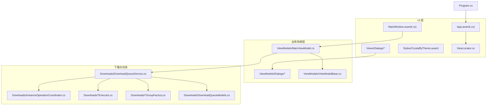
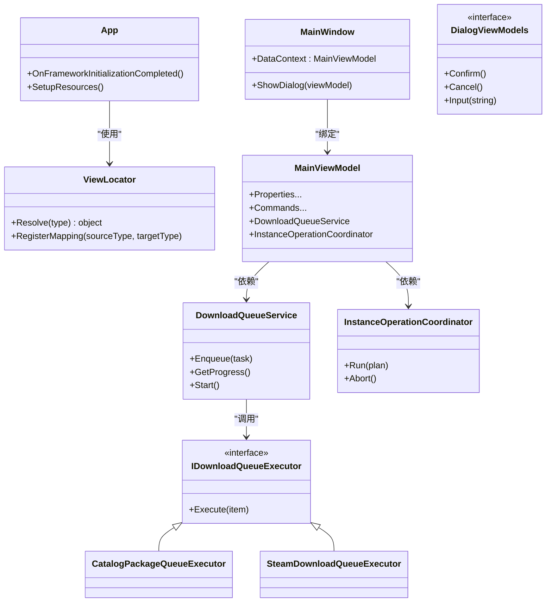
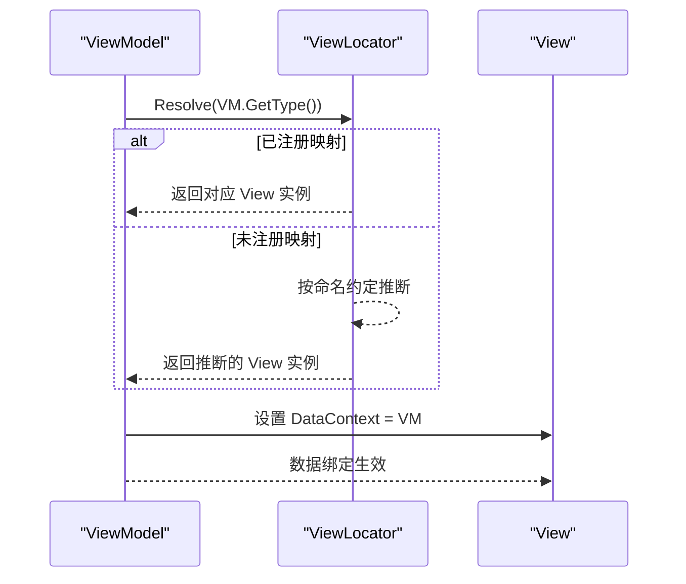
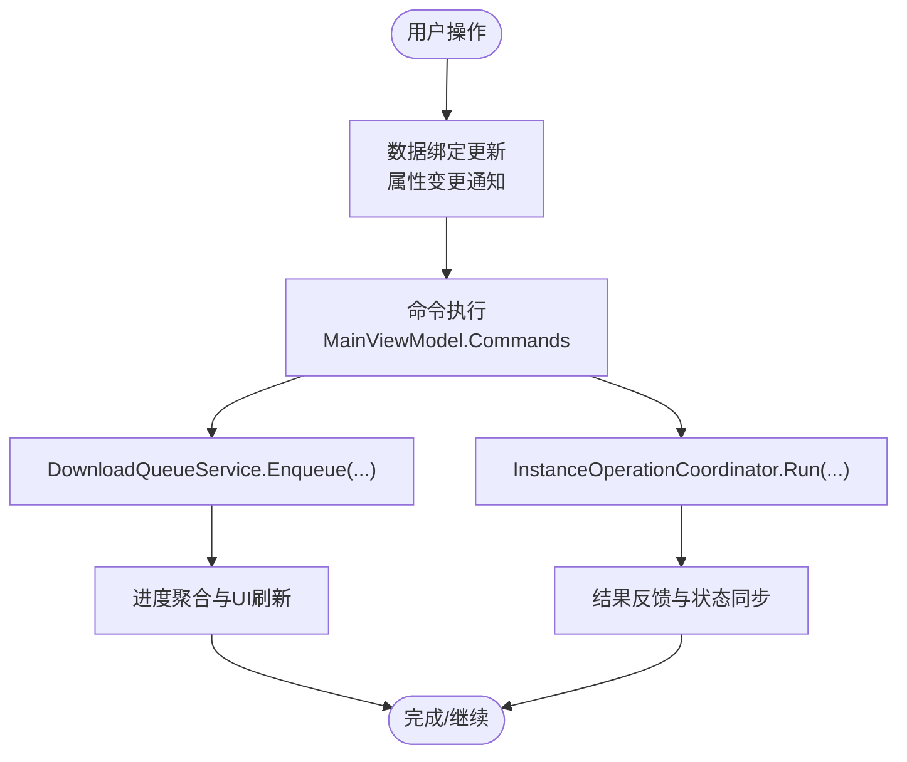
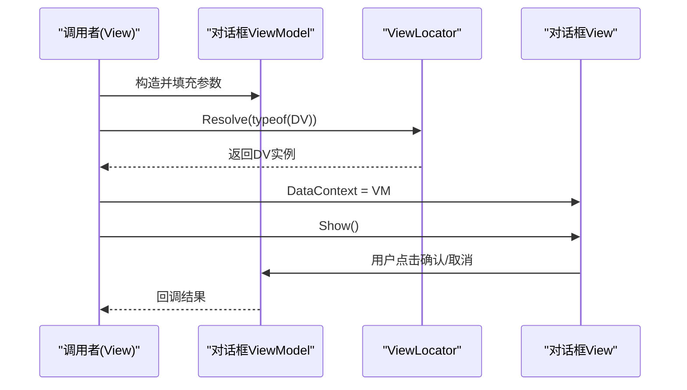
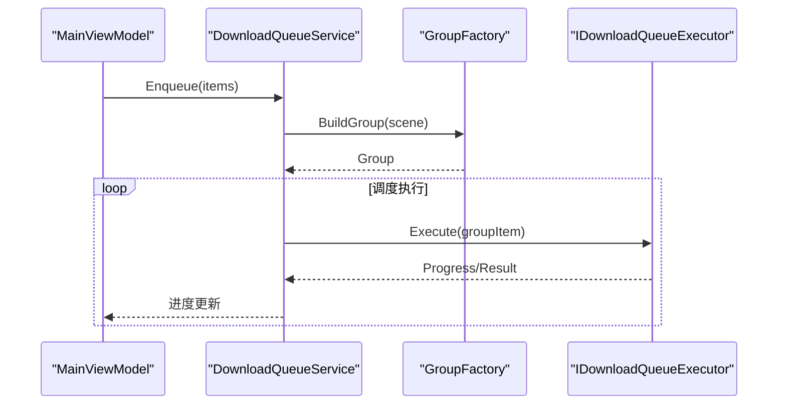
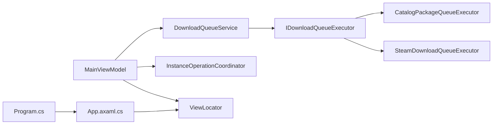

# 应用程序模块 (Crystalfly.App)

<cite>
**本文引用的文件**   
- [Program.cs](file://src/Crystalfly.App/Program.cs)
- [App.axaml](file://src/Crystalfly.App/App.axaml)
- [App.axaml.cs](file://src/Crystalfly.App/App.axaml.cs)
- [ViewLocator.cs](file://src/Crystalfly.App/ViewLocator.cs)
- [MainWindow.axaml](file://src/Crystalfly.App/Views/MainWindow.axaml)
- [MainWindow.axaml.cs](file://src/Crystalfly.App/Views/MainWindow.axaml.cs)
- [MainViewModel.cs](file://src/Crystalfly.App/ViewModels/MainViewModel.cs)
- [MainViewModel.DownloadQueue.cs](file://src/Crystalfly.App/ViewModels/MainViewModel.DownloadQueue.cs)
- [ViewModelBase.cs](file://src/Crystalfly.App/ViewModels/ViewModelBase.cs)
- [CrystalflyTheme.axaml](file://src/Crystalfly.App/Styles/CrystalflyTheme.axaml)
- [ConfirmationDialogView.axaml](file://src/Crystalfly.App/Views/Dialogs/ConfirmationDialogView.axaml)
- [ConfirmationDialogView.axaml.cs](file://src/Crystalfly.App/Views/Dialogs/ConfirmationDialogView.axaml.cs)
- [ConfirmationDialogViewModel.cs](file://src/Crystalfly.App/ViewModels/Dialogs/ConfirmationDialogViewModel.cs)
- [DependencyPlanDialogView.axaml](file://src/Crystalfly.App/Views/Dialogs/DependencyPlanDialogView.axaml)
- [DependencyPlanDialogView.axaml.cs](file://src/Crystalfly.App/Views/Dialogs/DependencyPlanDialogView.axaml.cs)
- [DependencyPlanDialogViewModel.cs](file://src/Crystalfly.App/ViewModels/Dialogs/DependencyPlanDialogViewModel.cs)
- [MarketInstallDialogView.axaml](file://src/Crystalfly.App/Views/Dialogs/MarketInstallDialogView.axaml)
- [MarketInstallDialogView.axaml.cs](file://src/Crystalfly.App/Views/Dialogs/MarketInstallDialogView.axaml.cs)
- [MarketInstallDialogViewModel.cs](file://src/Crystalfly.App/ViewModels/Dialogs/MarketInstallDialogViewModel.cs)
- [TextInputDialogView.axaml](file://src/Crystalfly.App/Views/Dialogs/TextInputDialogView.axaml)
- [TextInputDialogView.axaml.cs](file://src/Crystalfly.App/Views/Dialogs/TextInputDialogView.axaml.cs)
- [TextInputDialogViewModel.cs](file://src/Crystalfly.App/ViewModels/Dialogs/TextInputDialogViewModel.cs)
- [DownloadQueueService.cs](file://src/Crystalfly.App/Downloads/DownloadQueueService.cs)
- [InstanceOperationCoordinator.cs](file://src/Crystalfly.App/Downloads/InstanceOperationCoordinator.cs)
- [CatalogPackageQueueExecutor.cs](file://src/Crystalfly.App/Downloads/CatalogPackageQueueExecutor.cs)
- [SteamDownloadQueueExecutor.cs](file://src/Crystalfly.App/Downloads/SteamDownloadQueueExecutor.cs)
- [ModInstallQueueGroupFactory.cs](file://src/Crystalfly.App/Downloads/ModInstallQueueGroupFactory.cs)
- [ModDependencyRepairQueueGroupFactory.cs](file://src/Crystalfly.App/Downloads/ModDependencyRepairQueueGroupFactory.cs)
- [SteamDownloadQueueGroupFactory.cs](file://src/Crystalfly.App/Downloads/SteamDownloadQueueGroupFactory.cs)
- [IDownloadQueueExecutor.cs](file://src/Crystalfly.App/Downloads/IDownloadQueueExecutor.cs)
- [DownloadQueueModels.cs](file://src/Crystalfly.App/Downloads/DownloadQueueModels.cs)
</cite>

## 目录
1. [简介](#简介)
2. [项目结构](#项目结构)
3. [核心组件](#核心组件)
4. [架构总览](#架构总览)
5. [详细组件分析](#详细组件分析)
6. [依赖关系分析](#依赖关系分析)
7. [性能考虑](#性能考虑)
8. [故障排查指南](#故障排查指南)
9. [结论](#结论)
10. [附录](#附录)

## 简介
本设计文档聚焦于 Crystalfly.App 应用程序模块，该模块作为用户界面层，基于 Avalonia UI 框架实现 MVVM 架构。文档将系统阐述 View-ViewModel-Model 的分层职责、主窗口与对话框组件的组织方式、主题系统与样式定制机制、数据绑定与命令模式的使用、视图定位器（ViewLocator）的工作原理与自定义注册方式，以及与核心模块的集成和依赖注入配置要点。同时提供关键流程的时序图与流程图，帮助读者快速理解并扩展该模块。

## 项目结构
Crystalfly.App 采用按功能域划分的目录组织：
- Views：XAML 视图与代码后置，承载 UI 布局与交互事件
- ViewModels：MVVM 中的 ViewModel 层，负责状态、命令与数据绑定
- Styles：主题与样式资源定义
- Downloads：下载队列、任务编排与执行器相关逻辑
- Program.cs：应用入口，初始化宿主与依赖注入容器
- App.axaml(.cs)：应用级资源、主题与全局生命周期钩子
- ViewLocator.cs：视图定位器，负责根据类型解析对应视图

图表来源
- [Program.cs](file://src/Crystalfly.App/Program.cs)
- [App.axaml.cs](file://src/Crystalfly.App/App.axaml.cs)
- [ViewLocator.cs](file://src/Crystalfly.App/ViewLocator.cs)
- [MainWindow.axaml.cs](file://src/Crystalfly.App/Views/MainWindow.axaml.cs)
- [MainViewModel.cs](file://src/Crystalfly.App/ViewModels/MainViewModel.cs)
- [ViewModelBase.cs](file://src/Crystalfly.App/ViewModels/ViewModelBase.cs)
- [CrystalflyTheme.axaml](file://src/Crystalfly.App/Styles/CrystalflyTheme.axaml)
- [DownloadQueueService.cs](file://src/Crystalfly.App/Downloads/DownloadQueueService.cs)
- [InstanceOperationCoordinator.cs](file://src/Crystalfly.App/Downloads/InstanceOperationCoordinator.cs)
- [IDownloadQueueExecutor.cs](file://src/Crystalfly.App/Downloads/IDownloadQueueExecutor.cs)
- [DownloadQueueModels.cs](file://src/Crystalfly.App/Downloads/DownloadQueueModels.cs)

章节来源
- [Program.cs](file://src/Crystalfly.App/Program.cs)
- [App.axaml.cs](file://src/Crystalfly.App/App.axaml.cs)
- [ViewLocator.cs](file://src/Crystalfly.App/ViewLocator.cs)
- [MainWindow.axaml.cs](file://src/Crystalfly.App/Views/MainWindow.axaml.cs)
- [MainViewModel.cs](file://src/Crystalfly.App/ViewModels/MainViewModel.cs)
- [ViewModelBase.cs](file://src/Crystalfly.App/ViewModels/ViewModelBase.cs)
- [CrystalflyTheme.axaml](file://src/Crystalfly.App/Styles/CrystalflyTheme.axaml)
- [DownloadQueueService.cs](file://src/Crystalfly.App/Downloads/DownloadQueueService.cs)
- [InstanceOperationCoordinator.cs](file://src/Crystalfly.App/Downloads/InstanceOperationCoordinator.cs)
- [IDownloadQueueExecutor.cs](file://src/Crystalfly.App/Downloads/IDownloadQueueExecutor.cs)
- [DownloadQueueModels.cs](file://src/Crystalfly.App/Downloads/DownloadQueueModels.cs)

## 核心组件
- 应用启动与资源加载
  - Program.cs 负责创建 Avalonia 应用实例、设置平台特性与入口点
  - App.axaml(.cs) 负责合并全局资源、设置主题、注册应用级服务或拦截器
- 视图定位器
  - ViewLocator.cs 提供默认的类型到视图映射策略，支持自定义注册以覆盖或扩展映射规则
- 主窗口与主视图模型
  - MainWindow.axaml(.cs) 作为根视图，承载导航区域、列表与详情面板等
  - MainViewModel.cs 聚合应用主要状态与命令，协调下载队列、实例操作等
- 对话框组件族
  - 确认、文本输入、依赖计划、市场安装等对话框，均遵循“视图 + 视图模型”配对
- 主题与样式
  - CrystalflyTheme.axaml 集中定义颜色、控件模板、样式资源，供全局引用
- 下载与任务编排
  - DownloadQueueService.cs 管理下载任务队列、进度聚合与调度
  - InstanceOperationCoordinator.cs 协调实例级别的操作（如安装、修复、卸载）
  - 执行器接口 IDownloadQueueExecutor.cs 及其实现（Catalog/Steam）封装不同来源的下载策略
  - GroupFactory 系列用于按场景构建下载组（模组安装、依赖修复、Steam 内容）
  - DownloadQueueModels.cs 定义队列项、进度、分组等数据结构

章节来源
- [Program.cs](file://src/Crystalfly.App/Program.cs)
- [App.axaml.cs](file://src/Crystalfly.App/App.axaml.cs)
- [ViewLocator.cs](file://src/Crystalfly.App/ViewLocator.cs)
- [MainWindow.axaml.cs](file://src/Crystalfly.App/Views/MainWindow.axaml.cs)
- [MainViewModel.cs](file://src/Crystalfly.App/ViewModels/MainViewModel.cs)
- [ViewModelBase.cs](file://src/Crystalfly.App/ViewModels/ViewModelBase.cs)
- [CrystalflyTheme.axaml](file://src/Crystalfly.App/Styles/CrystalflyTheme.axaml)
- [DownloadQueueService.cs](file://src/Crystalfly.App/Downloads/DownloadQueueService.cs)
- [InstanceOperationCoordinator.cs](file://src/Crystalfly.App/Downloads/InstanceOperationCoordinator.cs)
- [IDownloadQueueExecutor.cs](file://src/Crystalfly.App/Downloads/IDownloadQueueExecutor.cs)
- [DownloadQueueModels.cs](file://src/Crystalfly.App/Downloads/DownloadQueueModels.cs)

## 架构总览
Crystalfly.App 严格遵循 MVVM 分层：
- View：XAML 描述布局与交互，仅持有轻量后置逻辑（如打开对话框、绑定上下文）
- ViewModel：暴露可绑定的属性与命令，处理业务编排与状态变更，不直接访问 UI
- Model/Services：由 Core 与 Steam 模块提供的能力，通过依赖注入在 ViewModel 中消费

图表来源
- [App.axaml.cs](file://src/Crystalfly.App/App.axaml.cs)
- [ViewLocator.cs](file://src/Crystalfly.App/ViewLocator.cs)
- [MainWindow.axaml.cs](file://src/Crystalfly.App/Views/MainWindow.axaml.cs)
- [MainViewModel.cs](file://src/Crystalfly.App/ViewModels/MainViewModel.cs)
- [DownloadQueueService.cs](file://src/Crystalfly.App/Downloads/DownloadQueueService.cs)
- [InstanceOperationCoordinator.cs](file://src/Crystalfly.App/Downloads/InstanceOperationCoordinator.cs)
- [IDownloadQueueExecutor.cs](file://src/Crystalfly.App/Downloads/IDownloadQueueExecutor.cs)
- [CatalogPackageQueueExecutor.cs](file://src/Crystalfly.App/Downloads/CatalogPackageQueueExecutor.cs)
- [SteamDownloadQueueExecutor.cs](file://src/Crystalfly.App/Downloads/SteamDownloadQueueExecutor.cs)

## 详细组件分析

### 视图定位器（ViewLocator）与自定义注册
- 工作原理
  - 默认策略：根据 ViewModel 类型名推断对应 View 类型（例如 XxxViewModel -> XxxView），并在命名空间约定下查找
  - 运行时解析：当需要显示某个 ViewModel 时，ViewLocator 返回其对应的 View 实例
- 自定义注册
  - 提供 RegisterMapping 方法，允许显式指定源类型到目标类型的映射，覆盖默认推断
  - 建议在应用启动阶段（App.axaml.cs）完成所有自定义映射注册
- 典型用法
  - 在主窗口或对话框管理器中，传入 ViewModel 给 ViewLocator.Resolve，获取 View 后展示

图表来源
- [ViewLocator.cs](file://src/Crystalfly.App/ViewLocator.cs)
- [MainWindow.axaml.cs](file://src/Crystalfly.App/Views/MainWindow.axaml.cs)

章节来源
- [ViewLocator.cs](file://src/Crystalfly.App/ViewLocator.cs)
- [MainWindow.axaml.cs](file://src/Crystalfly.App/Views/MainWindow.axaml.cs)

### 主窗口与主视图模型
- 主窗口（MainWindow）
  - 作为根视图，承载应用的主要区域（如侧边栏、列表、详情、工具栏）
  - 通过 DataContext 绑定到 MainViewModel，触发属性变更通知与命令执行
- 主视图模型（MainViewModel）
  - 聚合应用核心状态（如当前选中项、下载队列状态、实例信息）
  - 暴露命令（如开始下载、取消、重试、打开对话框）
  - 组合 DownloadQueueService 与 InstanceOperationCoordinator，协调跨模块操作
  - 通过 ViewModelBase 提供通用的属性变更通知与命令基类能力

图表来源
- [MainWindow.axaml.cs](file://src/Crystalfly.App/Views/MainWindow.axaml.cs)
- [MainViewModel.cs](file://src/Crystalfly.App/ViewModels/MainViewModel.cs)
- [MainViewModel.DownloadQueue.cs](file://src/Crystalfly.App/ViewModels/MainViewModel.DownloadQueue.cs)
- [DownloadQueueService.cs](file://src/Crystalfly.App/Downloads/DownloadQueueService.cs)
- [InstanceOperationCoordinator.cs](file://src/Crystalfly.App/Downloads/InstanceOperationCoordinator.cs)

章节来源
- [MainWindow.axaml.cs](file://src/Crystalfly.App/Views/MainWindow.axaml.cs)
- [MainViewModel.cs](file://src/Crystalfly.App/ViewModels/MainViewModel.cs)
- [MainViewModel.DownloadQueue.cs](file://src/Crystalfly.App/ViewModels/MainViewModel.DownloadQueue.cs)
- [ViewModelBase.cs](file://src/Crystalfly.App/ViewModels/ViewModelBase.cs)

### 对话框组件族
- 统一契约
  - 每个对话框包含一对 View 与 ViewModel，ViewModel 暴露 Confirm/Cancel/Input 等方法
  - 视图通过按钮事件或键盘快捷键触发相应方法，并将结果回传给调用方
- 常见对话框
  - 确认对话框：用于二次确认危险操作
  - 文本输入对话框：收集用户短文本输入
  - 依赖计划对话框：展示依赖分析与修复方案
  - 市场安装对话框：引导从市场选择并安装模组
- 打开流程
  - 主窗口或子视图构造对应 ViewModel，调用 ViewLocator.Resolve 获取 View，设置 DataContext 后 Show

图表来源
- [ConfirmationDialogView.axaml.cs](file://src/Crystalfly.App/Views/Dialogs/ConfirmationDialogView.axaml.cs)
- [ConfirmationDialogViewModel.cs](file://src/Crystalfly.App/ViewModels/Dialogs/ConfirmationDialogViewModel.cs)
- [TextInputDialogView.axaml.cs](file://src/Crystalfly.App/Views/Dialogs/TextInputDialogView.axaml.cs)
- [TextInputDialogViewModel.cs](file://src/Crystalfly.App/ViewModels/Dialogs/TextInputDialogViewModel.cs)
- [DependencyPlanDialogView.axaml.cs](file://src/Crystalfly.App/Views/Dialogs/DependencyPlanDialogView.axaml.cs)
- [DependencyPlanDialogViewModel.cs](file://src/Crystalfly.App/ViewModels/Dialogs/DependencyPlanDialogViewModel.cs)
- [MarketInstallDialogView.axaml.cs](file://src/Crystalfly.App/Views/Dialogs/MarketInstallDialogView.axaml.cs)
- [MarketInstallDialogViewModel.cs](file://src/Crystalfly.App/ViewModels/Dialogs/MarketInstallDialogViewModel.cs)
- [ViewLocator.cs](file://src/Crystalfly.App/ViewLocator.cs)

章节来源
- [ConfirmationDialogView.axaml.cs](file://src/Crystalfly.App/Views/Dialogs/ConfirmationDialogView.axaml.cs)
- [ConfirmationDialogViewModel.cs](file://src/Crystalfly.App/ViewModels/Dialogs/ConfirmationDialogViewModel.cs)
- [TextInputDialogView.axaml.cs](file://src/Crystalfly.App/Views/Dialogs/TextInputDialogView.axaml.cs)
- [TextInputDialogViewModel.cs](file://src/Crystalfly.App/ViewModels/Dialogs/TextInputDialogViewModel.cs)
- [DependencyPlanDialogView.axaml.cs](file://src/Crystalfly.App/Views/Dialogs/DependencyPlanDialogView.axaml.cs)
- [DependencyPlanDialogViewModel.cs](file://src/Crystalfly.App/ViewModels/Dialogs/DependencyPlanDialogViewModel.cs)
- [MarketInstallDialogView.axaml.cs](file://src/Crystalfly.App/Views/Dialogs/MarketInstallDialogView.axaml.cs)
- [MarketInstallDialogViewModel.cs](file://src/Crystalfly.App/ViewModels/Dialogs/MarketInstallDialogViewModel.cs)
- [ViewLocator.cs](file://src/Crystalfly.App/ViewLocator.cs)

### 样式系统与主题定制
- 主题资源
  - CrystalflyTheme.axaml 集中定义颜色、字体、控件模板与通用样式
  - App.axaml 中引入主题资源，确保全局可用
- 定制方式
  - 新增或覆盖样式键值，替换默认外观
  - 为特定控件定义派生样式，保持主题一致性
  - 通过动态资源绑定实现运行时切换主题（如需）

章节来源
- [CrystalflyTheme.axaml](file://src/Crystalfly.App/Styles/CrystalflyTheme.axaml)
- [App.axaml](file://src/Crystalfly.App/App.axaml)

### 下载队列与服务编排
- 下载队列服务（DownloadQueueService）
  - 负责任务的入队、出队、并发控制、进度聚合与错误重试
  - 对外暴露进度查询与启停控制接口
- 执行器（IDownloadQueueExecutor 及实现）
  - CatalogPackageQueueExecutor：基于目录/包清单的下载执行
  - SteamDownloadQueueExecutor：基于 Steam 内容的下载执行
- 组工厂（*GroupFactory）
  - ModInstallQueueGroupFactory：按模组安装场景构建下载组
  - ModDependencyRepairQueueGroupFactory：按依赖修复场景构建下载组
  - SteamDownloadQueueGroupFactory：按 Steam 内容场景构建下载组
- 数据模型（DownloadQueueModels）
  - 定义队列项、进度、分组、状态等数据结构，供 UI 与后台协同

图表来源
- [DownloadQueueService.cs](file://src/Crystalfly.App/Downloads/DownloadQueueService.cs)
- [ModInstallQueueGroupFactory.cs](file://src/Crystalfly.App/Downloads/ModInstallQueueGroupFactory.cs)
- [ModDependencyRepairQueueGroupFactory.cs](file://src/Crystalfly.App/Downloads/ModDependencyRepairQueueGroupFactory.cs)
- [SteamDownloadQueueGroupFactory.cs](file://src/Crystalfly.App/Downloads/SteamDownloadQueueGroupFactory.cs)
- [IDownloadQueueExecutor.cs](file://src/Crystalfly.App/Downloads/IDownloadQueueExecutor.cs)
- [CatalogPackageQueueExecutor.cs](file://src/Crystalfly.App/Downloads/CatalogPackageQueueExecutor.cs)
- [SteamDownloadQueueExecutor.cs](file://src/Crystalfly.App/Downloads/SteamDownloadQueueExecutor.cs)
- [DownloadQueueModels.cs](file://src/Crystalfly.App/Downloads/DownloadQueueModels.cs)

章节来源
- [DownloadQueueService.cs](file://src/Crystalfly.App/Downloads/DownloadQueueService.cs)
- [ModInstallQueueGroupFactory.cs](file://src/Crystalfly.App/Downloads/ModInstallQueueGroupFactory.cs)
- [ModDependencyRepairQueueGroupFactory.cs](file://src/Crystalfly.App/Downloads/ModDependencyRepairQueueGroupFactory.cs)
- [SteamDownloadQueueGroupFactory.cs](file://src/Crystalfly.App/Downloads/SteamDownloadQueueGroupFactory.cs)
- [IDownloadQueueExecutor.cs](file://src/Crystalfly.App/Downloads/IDownloadQueueExecutor.cs)
- [CatalogPackageQueueExecutor.cs](file://src/Crystalfly.App/Downloads/CatalogPackageQueueExecutor.cs)
- [SteamDownloadQueueExecutor.cs](file://src/Crystalfly.App/Downloads/SteamDownloadQueueExecutor.cs)
- [DownloadQueueModels.cs](file://src/Crystalfly.App/Downloads/DownloadQueueModels.cs)

### 与核心模块的集成与依赖注入
- 集成方式
  - 通过 Program.cs 与 App.axaml.cs 初始化 Avalonia 宿主与 DI 容器
  - 在容器中注册 Core 与 Steam 模块的服务（如 Catalog、Instances、Mods、Networking 等）
  - 在 ViewModel 构造函数中注入所需服务，避免硬编码耦合
- 最佳实践
  - 使用作用域区分瞬时/单例服务，避免内存泄漏
  - 对耗时操作使用异步方法与取消令牌，保证 UI 响应性
  - 将 UI 无关的业务逻辑下沉至 Core/Steam 模块，App 层专注编排与呈现

章节来源
- [Program.cs](file://src/Crystalfly.App/Program.cs)
- [App.axaml.cs](file://src/Crystalfly.App/App.axaml.cs)
- [MainViewModel.cs](file://src/Crystalfly.App/ViewModels/MainViewModel.cs)

## 依赖关系分析
- 组件内聚与耦合
  - View 与 ViewModel 松耦合，通过数据绑定与命令通信
  - ViewModel 依赖 Services/Executors，但不感知 UI 细节
  - 下载队列与执行器通过接口解耦，便于替换与测试
- 外部依赖
  - Avalonia UI 框架提供基础 UI 能力
  - Core 与 Steam 模块提供业务与平台能力
- 循环依赖
  - 通过接口与工厂模式避免循环引用；ViewLocator 仅承担类型映射职责

图表来源
- [MainViewModel.cs](file://src/Crystalfly.App/ViewModels/MainViewModel.cs)
- [DownloadQueueService.cs](file://src/Crystalfly.App/Downloads/DownloadQueueService.cs)
- [InstanceOperationCoordinator.cs](file://src/Crystalfly.App/Downloads/InstanceOperationCoordinator.cs)
- [IDownloadQueueExecutor.cs](file://src/Crystalfly.App/Downloads/IDownloadQueueExecutor.cs)
- [CatalogPackageQueueExecutor.cs](file://src/Crystalfly.App/Downloads/CatalogPackageQueueExecutor.cs)
- [SteamDownloadQueueExecutor.cs](file://src/Crystalfly.App/Downloads/SteamDownloadQueueExecutor.cs)
- [ViewLocator.cs](file://src/Crystalfly.App/ViewLocator.cs)
- [App.axaml.cs](file://src/Crystalfly.App/App.axaml.cs)
- [Program.cs](file://src/Crystalfly.App/Program.cs)

章节来源
- [MainViewModel.cs](file://src/Crystalfly.App/ViewModels/MainViewModel.cs)
- [DownloadQueueService.cs](file://src/Crystalfly.App/Downloads/DownloadQueueService.cs)
- [InstanceOperationCoordinator.cs](file://src/Crystalfly.App/Downloads/InstanceOperationCoordinator.cs)
- [IDownloadQueueExecutor.cs](file://src/Crystalfly.App/Downloads/IDownloadQueueExecutor.cs)
- [CatalogPackageQueueExecutor.cs](file://src/Crystalfly.App/Downloads/CatalogPackageQueueExecutor.cs)
- [SteamDownloadQueueExecutor.cs](file://src/Crystalfly.App/Downloads/SteamDownloadQueueExecutor.cs)
- [ViewLocator.cs](file://src/Crystalfly.App/ViewLocator.cs)
- [App.axaml.cs](file://src/Crystalfly.App/App.axaml.cs)
- [Program.cs](file://src/Crystalfly.App/Program.cs)

## 性能考虑
- 数据绑定优化
  - 避免在频繁更新的属性上执行重计算，必要时缓存或延迟计算
  - 使用集合视图与分页渲染减少大列表的 UI 压力
- 异步与并发
  - 下载任务使用异步流与背压控制，避免阻塞 UI 线程
  - 合理设置并发度，结合网络与磁盘 IO 特征调优
- 资源与内存
  - 及时释放对话框与临时对象，避免长生命周期引用导致泄漏
  - 主题资源按需加载，避免一次性载入过多资源

[本节为通用指导，无需源码引用]

## 故障排查指南
- 视图无法解析
  - 检查 ViewLocator 是否已正确注册映射，或命名约定是否符合预期
  - 确认命名空间与类名一致，且程序集可被加载
- 对话框无响应
  - 检查 ViewModel 的命令是否正确绑定，事件是否触发
  - 确认 DataContext 已正确设置，属性变更通知已发出
- 下载失败或卡住
  - 查看 DownloadQueueService 的日志与进度聚合输出
  - 验证执行器实现（Catalog/Steam）的网络与权限配置
  - 检查 GroupFactory 构建的下载组是否完整、依赖是否满足
- 主题异常
  - 确认 CrystalflyTheme.axaml 已被 App.axaml 引用
  - 检查样式键是否存在冲突或未定义的键引用

章节来源
- [ViewLocator.cs](file://src/Crystalfly.App/ViewLocator.cs)
- [MainWindow.axaml.cs](file://src/Crystalfly.App/Views/MainWindow.axaml.cs)
- [DownloadQueueService.cs](file://src/Crystalfly.App/Downloads/DownloadQueueService.cs)
- [CrystalflyTheme.axaml](file://src/Crystalfly.App/Styles/CrystalflyTheme.axaml)

## 结论
Crystalfly.App 以 Avalonia UI 为基础，采用清晰的 MVVM 分层与模块化设计，实现了可扩展的 UI 架构。通过 ViewLocator 简化视图解析，通过下载队列与执行器抽象屏蔽差异，通过主题系统统一外观。配合依赖注入与良好的职责划分，该模块既保证了可维护性与可测试性，也为后续功能扩展提供了坚实基础。

[本节为总结性内容，无需源码引用]

## 附录
- 关键路径参考
  - 应用入口与初始化：[Program.cs](file://src/Crystalfly.App/Program.cs)、[App.axaml.cs](file://src/Crystalfly.App/App.axaml.cs)
  - 视图定位器：[ViewLocator.cs](file://src/Crystalfly.App/ViewLocator.cs)
  - 主窗口与主视图模型：[MainWindow.axaml.cs](file://src/Crystalfly.App/Views/MainWindow.axaml.cs)、[MainViewModel.cs](file://src/Crystalfly.App/ViewModels/MainViewModel.cs)
  - 对话框示例：[ConfirmationDialogView.axaml.cs](file://src/Crystalfly.App/Views/Dialogs/ConfirmationDialogView.axaml.cs)、[TextInputDialogView.axaml.cs](file://src/Crystalfly.App/Views/Dialogs/TextInputDialogView.axaml.cs)、[DependencyPlanDialogView.axaml.cs](file://src/Crystalfly.App/Views/Dialogs/DependencyPlanDialogView.axaml.cs)、[MarketInstallDialogView.axaml.cs](file://src/Crystalfly.App/Views/Dialogs/MarketInstallDialogView.axaml.cs)
  - 主题与样式：[CrystalflyTheme.axaml](file://src/Crystalfly.App/Styles/CrystalflyTheme.axaml)
  - 下载队列与执行器：[DownloadQueueService.cs](file://src/Crystalfly.App/Downloads/DownloadQueueService.cs)、[IDownloadQueueExecutor.cs](file://src/Crystalfly.App/Downloads/IDownloadQueueExecutor.cs)、[CatalogPackageQueueExecutor.cs](file://src/Crystalfly.App/Downloads/CatalogPackageQueueExecutor.cs)、[SteamDownloadQueueExecutor.cs](file://src/Crystalfly.App/Downloads/SteamDownloadQueueExecutor.cs)
  - 组工厂与模型：[ModInstallQueueGroupFactory.cs](file://src/Crystalfly.App/Downloads/ModInstallQueueGroupFactory.cs)、[ModDependencyRepairQueueGroupFactory.cs](file://src/Crystalfly.App/Downloads/ModDependencyRepairQueueGroupFactory.cs)、[SteamDownloadQueueGroupFactory.cs](file://src/Crystalfly.App/Downloads/SteamDownloadQueueGroupFactory.cs)、[DownloadQueueModels.cs](file://src/Crystalfly.App/Downloads/DownloadQueueModels.cs)

[本节为索引性内容，无需源码引用]