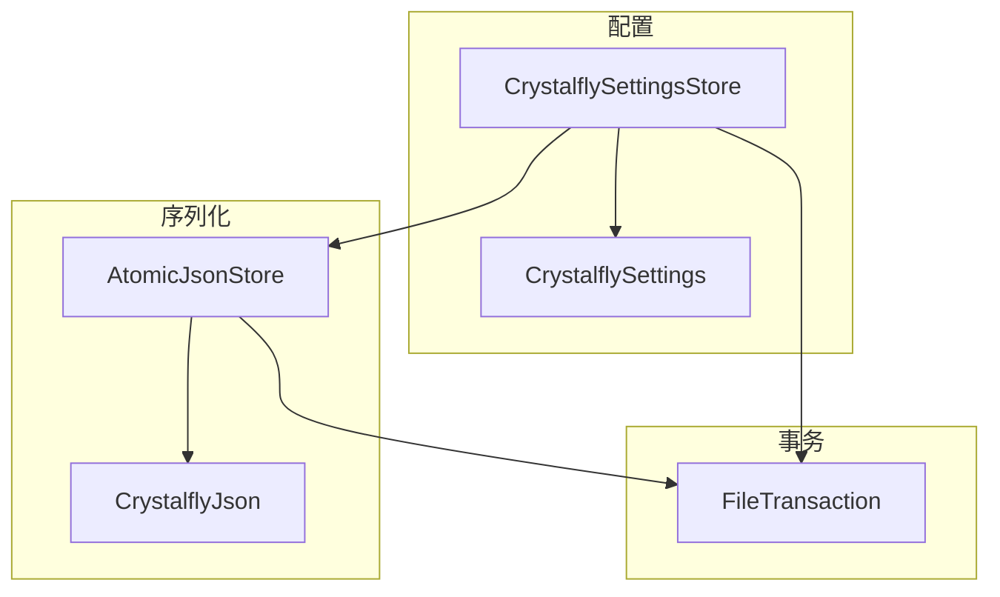
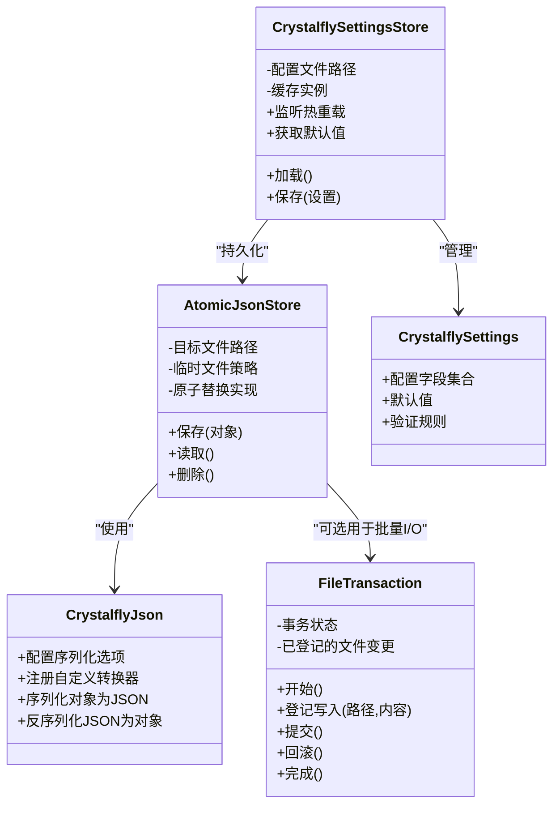
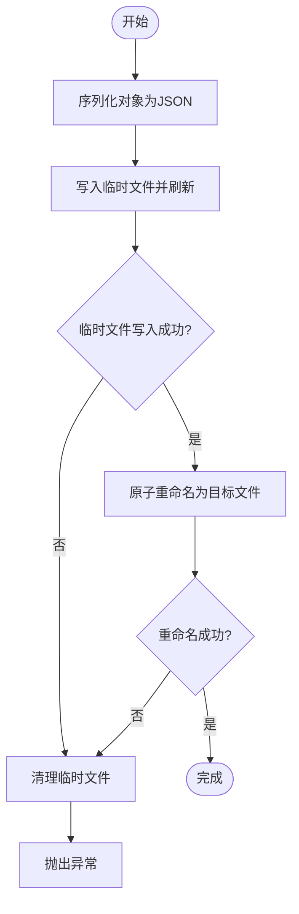
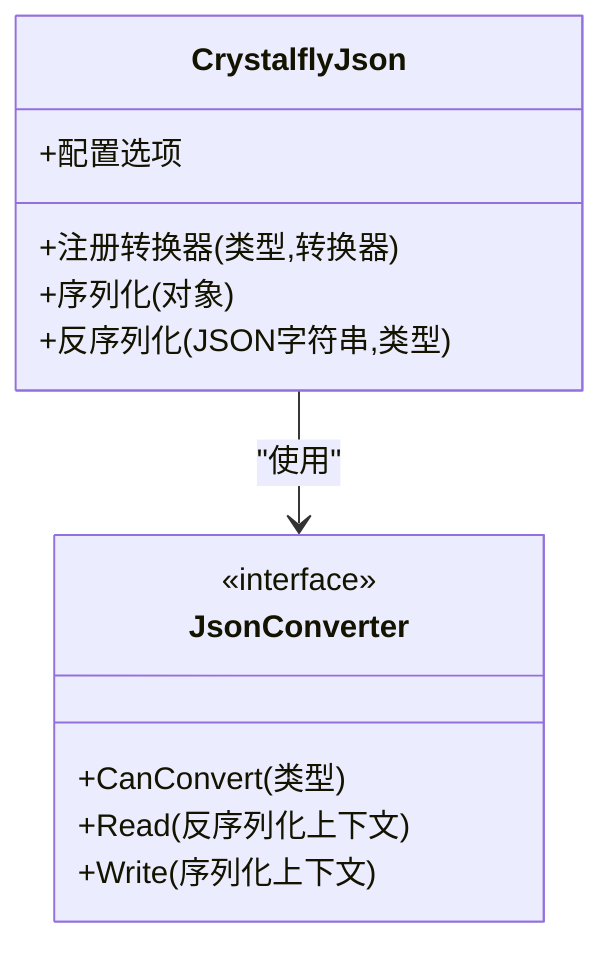
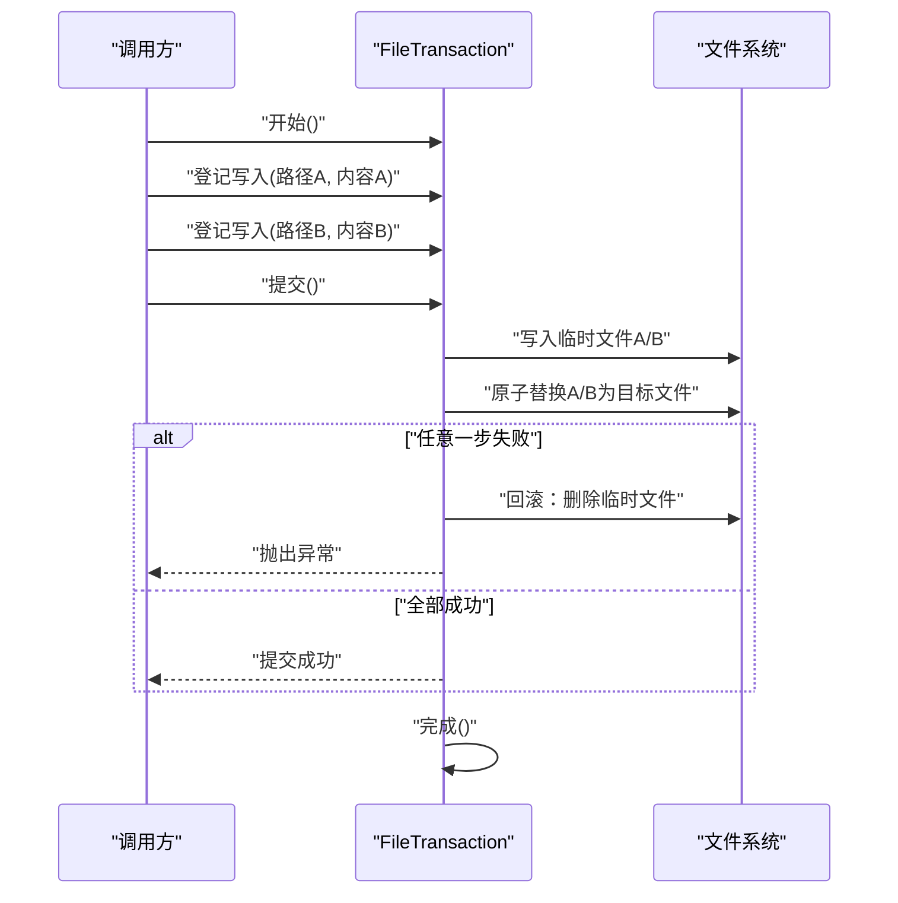
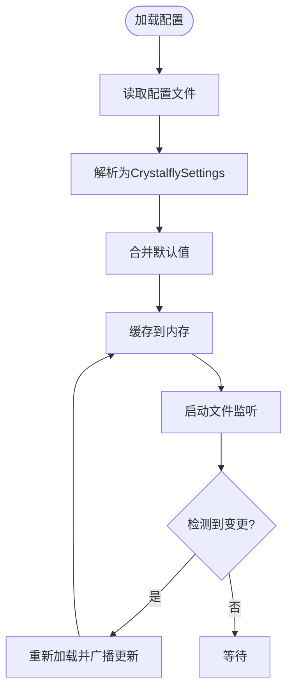
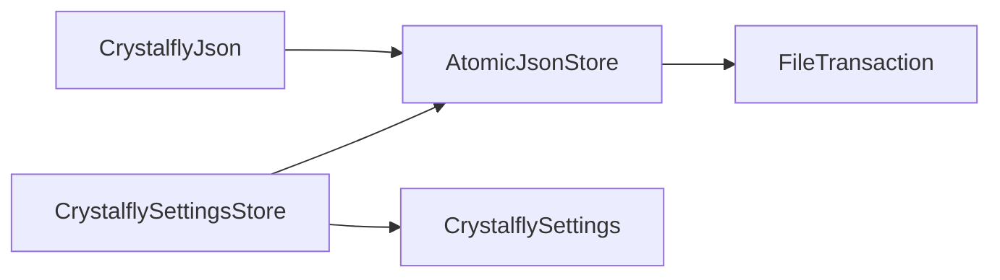

# 序列化与存储

<cite>
**本文引用的文件**   
- [AtomicJsonStore.cs](file://src/Crystalfly.Core/Serialization/AtomicJsonStore.cs)
- [CrystalflyJson.cs](file://src/Crystalfly.Core/Serialization/CrystalflyJson.cs)
- [FileTransaction.cs](file://src/Crystalfly.Core/Transactions/FileTransaction.cs)
- [CrystalflySettings.cs](file://src/Crystalfly.Core/Configuration/CrystalflySettings.cs)
- [CrystalflySettingsStore.cs](file://src/Crystalfly.Core/Configuration/CrystalflySettingsStore.cs)
- [AtomicJsonStoreTests.cs](file://tests/Crystalfly.Core.Tests/Serialization/AtomicJsonStoreTests.cs)
- [FileTransactionTests.cs](file://tests/Crystalfly.Core.Tests/Transactions/FileTransactionTests.cs)
</cite>

## 目录
1. [简介](#简介)
2. [项目结构](#项目结构)
3. [核心组件](#核心组件)
4. [架构总览](#架构总览)
5. [详细组件分析](#详细组件分析)
6. [依赖关系分析](#依赖关系分析)
7. [性能考量](#性能考量)
8. [故障排查指南](#故障排查指南)
9. [结论](#结论)
10. [附录：示例用法](#附录示例用法)

## 简介
本技术文档聚焦于序列化与存储子系统，围绕以下目标展开：
- 原子 JSON 存储（AtomicJsonStore）的事务性写入机制：临时文件、原子替换、回滚保证。
- CrystalflyJson 序列化工具的配置与自定义转换器。
- 文件事务（FileTransaction）的 ACID 特性实现：事务边界、提交/回滚、并发控制。
- 配置存储（CrystalflySettingsStore）的设计模式：配置加载、热重载、默认值处理。
- CrystalflySettings 配置模型的结构与验证规则。
- 提供具体代码示例路径，展示安全的文件读写、配置管理与事务处理实践。

## 项目结构
该子系统位于 Core 层，主要包含三个子域：
- 序列化：AtomicJsonStore、CrystalflyJson
- 事务：FileTransaction
- 配置：CrystalflySettings、CrystalflySettingsStore

图表来源
- [AtomicJsonStore.cs:1-200](file://src/Crystalfly.Core/Serialization/AtomicJsonStore.cs#L1-L200)
- [CrystalflyJson.cs:1-200](file://src/Crystalfly.Core/Serialization/CrystalflyJson.cs#L1-L200)
- [FileTransaction.cs:1-200](file://src/Crystalfly.Core/Transactions/FileTransaction.cs#L1-L200)
- [CrystalflySettings.cs:1-200](file://src/Crystalfly.Core/Configuration/CrystalflySettings.cs#L1-L200)
- [CrystalflySettingsStore.cs:1-200](file://src/Crystalfly.Core/Configuration/CrystalflySettingsStore.cs#L1-L200)

章节来源
- [AtomicJsonStore.cs:1-200](file://src/Crystalfly.Core/Serialization/AtomicJsonStore.cs#L1-L200)
- [CrystalflyJson.cs:1-200](file://src/Crystalfly.Core/Serialization/CrystalflyJson.cs#L1-L200)
- [FileTransaction.cs:1-200](file://src/Crystalfly.Core/Transactions/FileTransaction.cs#L1-L200)
- [CrystalflySettings.cs:1-200](file://src/Crystalfly.Core/Configuration/CrystalflySettings.cs#L1-L200)
- [CrystalflySettingsStore.cs:1-200](file://src/Crystalfly.Core/Configuration/CrystalflySettingsStore.cs#L1-L200)

## 核心组件
- AtomicJsonStore：提供面向 JSON 文件的原子写入能力，通过“写临时文件 + 原子替换”的策略确保崩溃或异常不会导致数据损坏。
- CrystalflyJson：封装 JSON 序列化选项与可扩展的转换器注册机制，支持自定义类型转换。
- FileTransaction：提供基于文件系统的轻量事务抽象，支持在事务边界内执行多个 I/O 操作，并在提交时一次性生效，失败时回滚。
- CrystalflySettings：定义应用配置的数据模型，包含字段、默认值与校验约束。
- CrystalflySettingsStore：负责配置的持久化、加载、热重载与默认值合并策略。

章节来源
- [AtomicJsonStore.cs:1-200](file://src/Crystalfly.Core/Serialization/AtomicJsonStore.cs#L1-L200)
- [CrystalflyJson.cs:1-200](file://src/Crystalfly.Core/Serialization/CrystalflyJson.cs#L1-L200)
- [FileTransaction.cs:1-200](file://src/Crystalfly.Core/Transactions/FileTransaction.cs#L1-L200)
- [CrystalflySettings.cs:1-200](file://src/Crystalfly.Core/Configuration/CrystalflySettings.cs#L1-L200)
- [CrystalflySettingsStore.cs:1-200](file://src/Crystalfly.Core/Configuration/CrystalflySettingsStore.cs#L1-L200)

## 架构总览
下图展示了关键组件之间的协作关系与数据流向：

图表来源
- [AtomicJsonStore.cs:1-200](file://src/Crystalfly.Core/Serialization/AtomicJsonStore.cs#L1-L200)
- [CrystalflyJson.cs:1-200](file://src/Crystalfly.Core/Serialization/CrystalflyJson.cs#L1-L200)
- [FileTransaction.cs:1-200](file://src/Crystalfly.Core/Transactions/FileTransaction.cs#L1-L200)
- [CrystalflySettings.cs:1-200](file://src/Crystalfly.Core/Configuration/CrystalflySettings.cs#L1-L200)
- [CrystalflySettingsStore.cs:1-200](file://src/Crystalfly.Core/Configuration/CrystalflySettingsStore.cs#L1-L200)

## 详细组件分析

### 原子 JSON 存储（AtomicJsonStore）
- 设计要点
  - 临时文件策略：在同一目录下生成唯一命名的临时文件，避免跨文件系统移动导致的非原子行为。
  - 原子替换：使用操作系统级别的原子重命名将临时文件替换为目标文件，确保读端始终看到完整或旧版本数据。
  - 回滚保证：任何中间步骤异常都会清理临时文件，不留下半写状态；若替换失败，目标文件保持不变。
  - 并发安全：建议结合外部锁或文件事务来协调多进程/多线程写入，避免竞态条件。
- 典型流程
  - 序列化对象为 JSON 字节流
  - 写入临时文件并刷新到磁盘
  - 原子重命名为目标文件
  - 成功返回；失败则清理临时文件并抛出异常
- 复杂度与性能
  - 时间复杂度：O(n)，n 为 JSON 大小
  - 空间复杂度：O(n)，需要缓冲 JSON 字节
  - I/O 次数：至少两次写（临时文件 + 原子替换），一次元数据更新（重命名）
- 错误处理
  - 磁盘满、权限不足、路径不存在等异常需被捕获并清理资源
  - 建议在调用方进行重试与降级策略

图表来源
- [AtomicJsonStore.cs:1-200](file://src/Crystalfly.Core/Serialization/AtomicJsonStore.cs#L1-L200)

章节来源
- [AtomicJsonStore.cs:1-200](file://src/Crystalfly.Core/Serialization/AtomicJsonStore.cs#L1-L200)
- [AtomicJsonStoreTests.cs:1-200](file://tests/Crystalfly.Core.Tests/Serialization/AtomicJsonStoreTests.cs#L1-L200)

### CrystalflyJson 序列化工具
- 功能概述
  - 统一序列化选项：缩进、忽略空值、日期格式、数字精度等
  - 自定义转换器：支持注册针对特定类型的转换器，扩展序列化/反序列化逻辑
  - 线程安全：序列化器实例通常可共享，但需注意转换器内部状态
- 配置项
  - 格式化开关、编码、文化信息、最大深度、循环引用策略等
- 自定义转换器
  - 接口契约：提供序列化与反序列化的方法
  - 注册方式：集中式注册表，按类型映射到转换器
  - 优先级与覆盖：后注册的转换器可覆盖先前注册的同类型转换器
- 性能建议
  - 复用序列化器实例
  - 避免频繁创建转换器
  - 对大对象采用流式序列化（如适用）

图表来源
- [CrystalflyJson.cs:1-200](file://src/Crystalfly.Core/Serialization/CrystalflyJson.cs#L1-L200)

章节来源
- [CrystalflyJson.cs:1-200](file://src/Crystalfly.Core/Serialization/CrystalflyJson.cs#L1-L200)

### 文件事务（FileTransaction）
- ACID 特性
  - 原子性：提交时将所有登记的文件变更一次性生效；任一失败则全部回滚
  - 一致性：事务前后文件系统保持一致状态，无中间态暴露给其他读者
  - 隔离性：通过内部登记与延迟提交，避免部分提交造成的可见性问题
  - 持久性：提交成功后，数据落盘；异常时保持原状
- 事务边界
  - 开始：初始化事务上下文
  - 登记写入：记录待写入的路径与内容
  - 提交：批量写入并原子替换
  - 回滚：清理所有临时文件，恢复原状
  - 完成：释放资源
- 并发控制
  - 单进程内：通过内部锁保护事务状态
  - 跨进程：建议配合文件锁或分布式锁，避免多进程同时提交冲突
- 错误处理
  - 部分写入失败：触发回滚并清理临时文件
  - 资源泄漏防护：确保 finally 块中释放句柄与临时文件

图表来源
- [FileTransaction.cs:1-200](file://src/Crystalfly.Core/Transactions/FileTransaction.cs#L1-L200)

章节来源
- [FileTransaction.cs:1-200](file://src/Crystalfly.Core/Transactions/FileTransaction.cs#L1-L200)
- [FileTransactionTests.cs:1-200](file://tests/Crystalfly.Core.Tests/Transactions/FileTransactionTests.cs#L1-L200)

### 配置存储（CrystalflySettingsStore）
- 设计模式
  - 单一职责：仅负责配置的加载、保存、缓存与热重载
  - 依赖注入友好：可通过接口暴露，便于测试与替换
  - 观察者模式：监听配置文件变化，通知订阅者进行热重载
- 功能特性
  - 配置加载：从磁盘读取 JSON 并反序列化为 CrystalflySettings
  - 默认值处理：当缺失字段时使用默认值填充
  - 热重载：监控文件变更事件，自动重新加载配置并广播更新
  - 持久化：将修改后的配置原子保存到磁盘
- 并发与缓存
  - 内存缓存：减少频繁磁盘 I/O
  - 读写锁：保证并发访问的一致性
  - 失效策略：根据文件变更事件或定时任务刷新缓存

图表来源
- [CrystalflySettingsStore.cs:1-200](file://src/Crystalfly.Core/Configuration/CrystalflySettingsStore.cs#L1-L200)

章节来源
- [CrystalfflySettingsStore.cs:1-200](file://src/Crystalfly.Core/Configuration/CrystalflySettingsStore.cs#L1-L200)

### CrystalflySettings 配置模型
- 结构说明
  - 字段集合：涵盖应用运行所需的关键参数
  - 默认值：每个字段提供合理的默认值，确保未配置时的可用性
  - 验证规则：必填、范围、枚举值、正则表达式等约束
- 验证流程
  - 加载后执行验证，失败则拒绝使用或回退到默认值
  - 提供详细的错误消息，便于定位问题
- 扩展性
  - 新增字段时需考虑向后兼容与迁移策略

章节来源
- [CrystalflySettings.cs:1-200](file://src/Crystalfly.Core/Configuration/CrystalflySettings.cs#L1-L200)

## 依赖关系分析
- 组件耦合
  - AtomicJsonStore 依赖 CrystalflyJson 进行序列化
  - CrystalflySettingsStore 依赖 AtomicJsonStore 进行持久化
  - FileTransaction 可作为通用事务工具被上层模块复用
- 外部依赖
  - 文件系统 API
  - 可能的文件锁库（跨进程场景）
- 潜在循环依赖
  - 当前设计无明显循环依赖，注意在扩展时避免引入

图表来源
- [AtomicJsonStore.cs:1-200](file://src/Crystalfly.Core/Serialization/AtomicJsonStore.cs#L1-L200)
- [CrystalflyJson.cs:1-200](file://src/Crystalfly.Core/Serialization/CrystalflyJson.cs#L1-L200)
- [FileTransaction.cs:1-200](file://src/Crystalfly.Core/Transactions/FileTransaction.cs#L1-L200)
- [CrystalflySettings.cs:1-200](file://src/Crystalfly.Core/Configuration/CrystalflySettings.cs#L1-L200)
- [CrystalflySettingsStore.cs:1-200](file://src/Crystalfly.Core/Configuration/CrystalflySettingsStore.cs#L1-L200)

章节来源
- [AtomicJsonStore.cs:1-200](file://src/Crystalfly.Core/Serialization/AtomicJsonStore.cs#L1-L200)
- [CrystalflyJson.cs:1-200](file://src/Crystalfly.Core/Serialization/CrystalflyJson.cs#L1-L200)
- [FileTransaction.cs:1-200](file://src/Crystalfly.Core/Transactions/FileTransaction.cs#L1-L200)
- [CrystalflySettings.cs:1-200](file://src/Crystalfly.Core/Configuration/CrystalflySettings.cs#L1-L200)
- [CrystalflySettingsStore.cs:1-200](file://src/Crystalfly.Core/Configuration/CrystalflySettingsStore.cs#L1-L200)

## 性能考量
- 序列化开销
  - 大对象序列化可能成为瓶颈，建议使用流式序列化或分块处理
  - 复用 CrystalflyJson 实例以减少对象创建成本
- I/O 优化
  - 批量写入优先使用 FileTransaction 减少系统调用次数
  - 合理选择缓冲区大小，平衡内存占用与吞吐
- 并发控制
  - 避免热点文件的高频竞争写入，必要时引入队列或批处理
  - 跨进程场景使用文件锁或分布式锁保障一致性

## 故障排查指南
- 常见问题
  - 权限不足：检查目标目录的读写权限
  - 磁盘空间不足：监控磁盘剩余空间，提前告警
  - 文件被占用：确认没有其他进程锁定目标文件
  - 序列化异常：检查自定义转换器是否正确实现
- 日志与诊断
  - 记录关键步骤的耗时与异常堆栈
  - 输出临时文件路径以便调试
- 恢复策略
  - 自动重试与指数退避
  - 回滚到上一个已知良好的快照

章节来源
- [AtomicJsonStoreTests.cs:1-200](file://tests/Crystalfly.Core.Tests/Serialization/AtomicJsonStoreTests.cs#L1-L200)
- [FileTransactionTests.cs:1-200](file://tests/Crystalfly.Core.Tests/Transactions/FileTransactionTests.cs#L1-L200)

## 结论
本子系统通过原子写入、事务化 I/O 与可扩展的序列化机制，提供了高可靠、易用的配置与数据存储能力。遵循本文档的最佳实践，可在复杂环境下保证数据一致性与系统稳定性。

## 附录：示例用法
以下为各组件的典型用法路径，供参考实现：
- 原子 JSON 存储
  - 保存对象到文件：[AtomicJsonStore.cs:1-200](file://src/Crystalfly.Core/Serialization/AtomicJsonStore.cs#L1-L200)
  - 从文件读取对象：[AtomicJsonStore.cs:1-200](file://src/Crystalfly.Core/Serialization/AtomicJsonStore.cs#L1-L200)
  - 单元测试示例：[AtomicJsonStoreTests.cs:1-200](file://tests/Crystalfly.Core.Tests/Serialization/AtomicJsonStoreTests.cs#L1-L200)
- 自定义序列化转换器
  - 注册转换器与序列化选项：[CrystalflyJson.cs:1-200](file://src/Crystalfly.Core/Serialization/CrystalflyJson.cs#L1-L200)
- 文件事务
  - 开始/登记/提交/回滚流程：[FileTransaction.cs:1-200](file://src/Crystalfly.Core/Transactions/FileTransaction.cs#L1-L200)
  - 事务用例与断言：[FileTransactionTests.cs:1-200](file://tests/Crystalfly.Core.Tests/Transactions/FileTransactionTests.cs#L1-L200)
- 配置管理
  - 加载与保存配置：[CrystalflySettingsStore.cs:1-200](file://src/Crystalfly.Core/Configuration/CrystalflySettingsStore.cs#L1-L200)
  - 配置模型与验证：[CrystalflySettings.cs:1-200](file://src/Crystalfly.Core/Configuration/CrystalflySettings.cs#L1-L200)