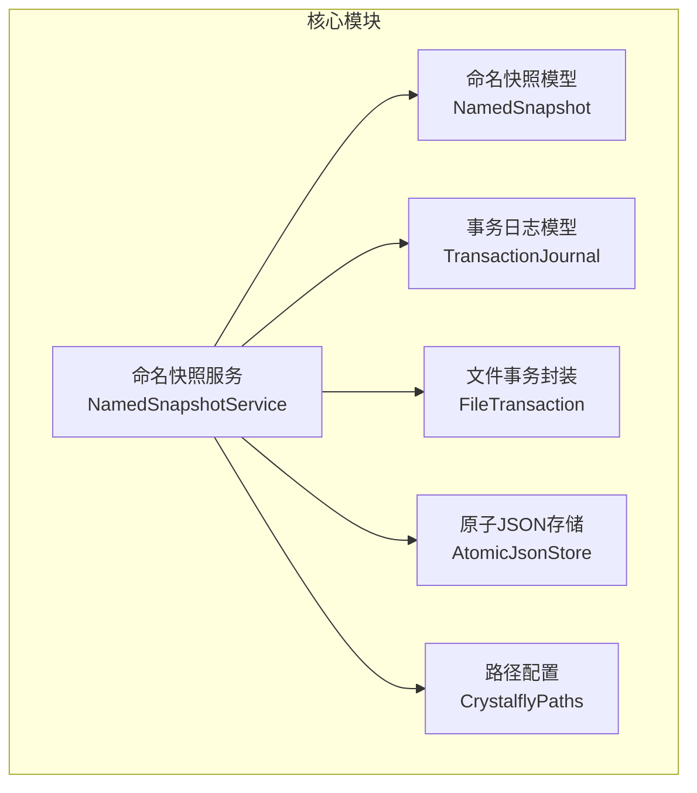
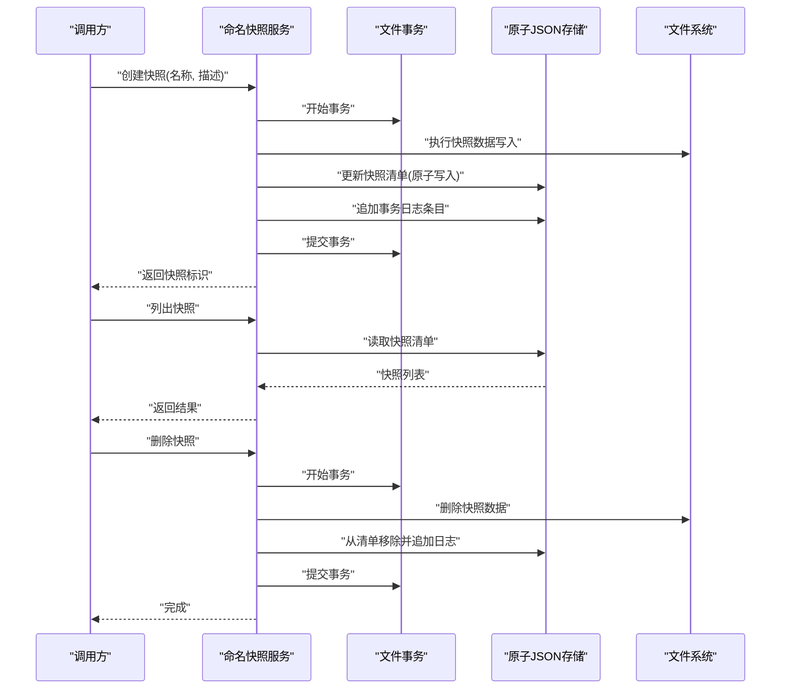
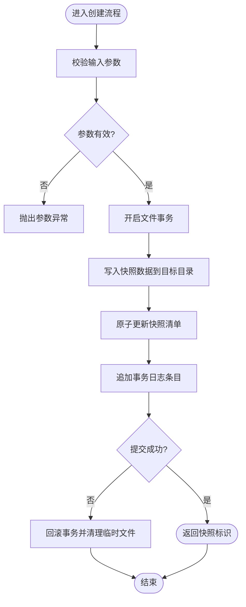
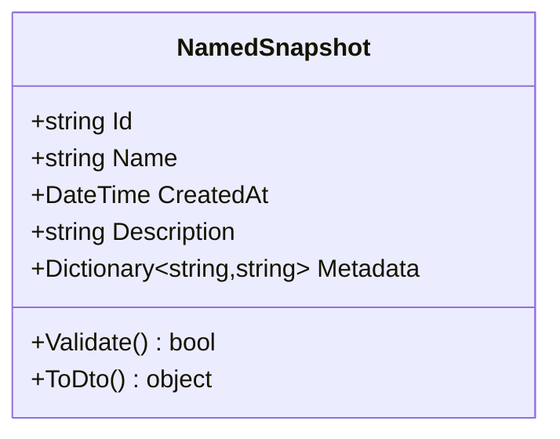
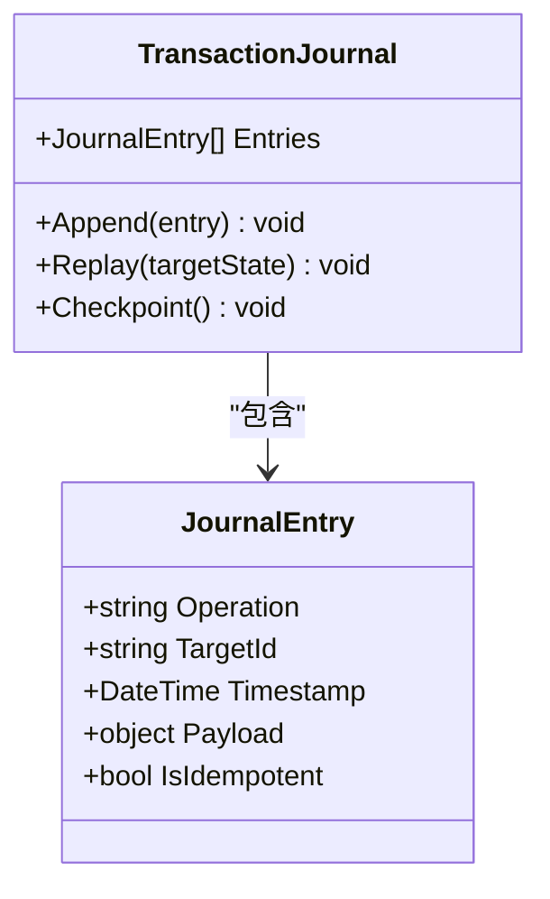
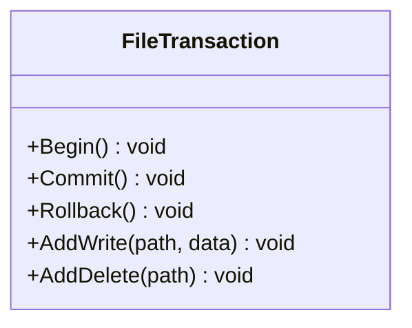
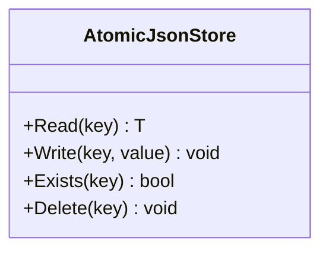
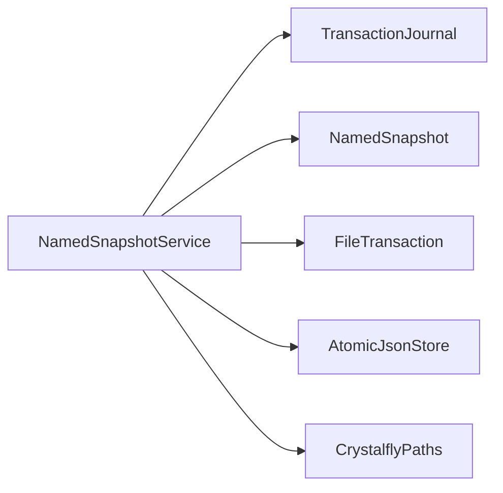

# 快照系统

<cite>
**本文引用的文件**
- [NamedSnapshotService.cs](file://src/Crystalfly.Core/Snapshots/NamedSnapshotService.cs)
- [NamedSnapshot.cs](file://src/Crystalfly.Core/Models/NamedSnapshot.cs)
- [TransactionJournal.cs](file://src/Crystalfly.Core/Models/TransactionJournal.cs)
- [FileTransaction.cs](file://src/Crystalfly.Core/Transactions/FileTransaction.cs)
- [AtomicJsonStore.cs](file://src/Crystalfly.Core/Serialization/AtomicJsonStore.cs)
- [CrystalflyPaths.cs](file://src/Crystalfly.Core/Configuration/CrystalflyPaths.cs)
- [NamedSnapshotServiceTests.cs](file://tests/Crystalfly.Core.Tests/Snapshots/NamedSnapshotServiceTests.cs)
</cite>

## 目录
1. [简介](#简介)
2. [项目结构](#项目结构)
3. [核心组件](#核心组件)
4. [架构总览](#架构总览)
5. [详细组件分析](#详细组件分析)
6. [依赖关系分析](#依赖关系分析)
7. [性能考虑](#性能考虑)
8. [故障排查指南](#故障排查指南)
9. [结论](#结论)
10. [附录：使用示例与最佳实践](#附录使用示例与最佳实践)

## 简介
本技术文档围绕“命名快照服务（NamedSnapshotService）”展开，系统性阐述其快照管理机制、数据模型设计、底层实现原理、事务日志在恢复中的作用，以及性能与最佳实践。目标读者包括需要理解并扩展快照能力的开发者与维护者。

## 项目结构
快照相关代码位于 Crystalfly.Core 模块中，主要包含：
- 服务层：命名快照服务，提供创建、列举、删除等能力
- 模型层：命名快照元数据、事务日志记录
- 事务层：基于文件的原子事务封装
- 序列化层：原子 JSON 存储
- 配置层：路径解析与持久化位置

图表来源
- [NamedSnapshotService.cs](file://src/Crystalfly.Core/Snapshots/NamedSnapshotService.cs)
- [NamedSnapshot.cs](file://src/Crystalfly.Core/Models/NamedSnapshot.cs)
- [TransactionJournal.cs](file://src/Crystalfly.Core/Models/TransactionJournal.cs)
- [FileTransaction.cs](file://src/Crystalfly.Core/Transactions/FileTransaction.cs)
- [AtomicJsonStore.cs](file://src/Crystalfly.Core/Serialization/AtomicJsonStore.cs)
- [CrystalflyPaths.cs](file://src/Crystalfly.Core/Configuration/CrystalflyPaths.cs)

章节来源
- [NamedSnapshotService.cs](file://src/Crystalfly.Core/Snapshots/NamedSnapshotService.cs)
- [NamedSnapshot.cs](file://src/Crystalfly.Core/Models/NamedSnapshot.cs)
- [TransactionJournal.cs](file://src/Crystalfly.Core/Models/TransactionJournal.cs)
- [FileTransaction.cs](file://src/Crystalfly.Core/Transactions/FileTransaction.cs)
- [AtomicJsonStore.cs](file://src/Crystalfly.Core/Serialization/AtomicJsonStore.cs)
- [CrystalflyPaths.cs](file://src/Crystalfly.Core/Configuration/CrystalflyPaths.cs)

## 核心组件
- 命名快照服务（NamedSnapshotService）
  - 职责：对外暴露快照的创建、查询、删除、清理等能力；协调事务日志与持久化存储；保证操作的原子性与一致性。
- 命名快照模型（NamedSnapshot）
  - 职责：描述一次快照的元数据，如唯一标识、名称、时间戳、描述、关联实例或版本指纹等。
- 事务日志模型（TransactionJournal）
  - 职责：记录可回放的操作序列，用于状态重建与一致性恢复。
- 文件事务封装（FileTransaction）
  - 职责：对文件系统操作进行事务化包装，支持回滚与提交。
- 原子JSON存储（AtomicJsonStore）
  - 职责：以原子方式读写 JSON 元数据，避免部分写入导致的不一致。
- 路径配置（CrystalflyPaths）
  - 职责：提供快照与日志的持久化目录、文件名模板等路径信息。

章节来源
- [NamedSnapshotService.cs](file://src/Crystalfly.Core/Snapshots/NamedSnapshotService.cs)
- [NamedSnapshot.cs](file://src/Crystalfly.Core/Models/NamedSnapshot.cs)
- [TransactionJournal.cs](file://src/Crystalfly.Core/Models/TransactionJournal.cs)
- [FileTransaction.cs](file://src/Crystalfly.Core/Transactions/FileTransaction.cs)
- [AtomicJsonStore.cs](file://src/Crystalfly.Core/Serialization/AtomicJsonStore.cs)
- [CrystalflyPaths.cs](file://src/Crystalfly.Core/Configuration/CrystalflyPaths.cs)

## 架构总览
命名快照服务作为门面，聚合以下子系统：
- 元数据管理：通过原子JSON存储维护命名快照清单与事务日志索引
- 事务编排：基于文件事务封装，将多步文件操作组合为单一事务
- 持久化布局：由路径配置决定快照与日志的落盘位置
- 恢复机制：读取事务日志，按序回放以重建目标状态

图表来源
- [NamedSnapshotService.cs](file://src/Crystalfly.Core/Snapshots/NamedSnapshotService.cs)
- [AtomicJsonStore.cs](file://src/Crystalfly.Core/Serialization/AtomicJsonStore.cs)
- [FileTransaction.cs](file://src/Crystalfly.Core/Transactions/FileTransaction.cs)

## 详细组件分析

### 命名快照服务（NamedSnapshotService）
- 关键能力
  - 创建快照：校验参数、开启事务、执行数据写入、更新清单与日志、提交事务
  - 列表查询：读取快照清单，过滤与排序
  - 删除清理：在事务内删除数据、更新清单与日志
  - 恢复支持：结合事务日志进行回放与状态重建（由上层流程驱动）
- 并发控制
  - 通过事务边界与原子写入保障同一快照的串行化修改
  - 建议对同一实例/版本的快照操作加锁，避免竞态
- 错误处理
  - 事务失败时自动回滚已变更的文件与元数据
  - 对磁盘空间不足、权限异常等进行明确错误分类

图表来源
- [NamedSnapshotService.cs](file://src/Crystalfly.Core/Snapshots/NamedSnapshotService.cs)
- [FileTransaction.cs](file://src/Crystalfly.Core/Transactions/FileTransaction.cs)
- [AtomicJsonStore.cs](file://src/Crystalfly.Core/Serialization/AtomicJsonStore.cs)

章节来源
- [NamedSnapshotService.cs](file://src/Crystalfly.Core/Snapshots/NamedSnapshotService.cs)
- [FileTransaction.cs](file://src/Crystalfly.Core/Transactions/FileTransaction.cs)
- [AtomicJsonStore.cs](file://src/Crystalfly.Core/Serialization/AtomicJsonStore.cs)

### 命名快照模型（NamedSnapshot）
- 字段语义
  - 唯一标识：用于区分不同快照
  - 名称：用户可读的快照名
  - 时间戳：快照创建时间
  - 描述：附加说明文本
  - 其他元数据：如关联实例ID、构建指纹、标签等（依具体实现而定）
- 约束与校验
  - 名称唯一性、时间戳单调递增、必填字段非空
- 序列化
  - 采用 JSON 格式，配合原子写入确保元数据一致性

图表来源
- [NamedSnapshot.cs](file://src/Crystalfly.Core/Models/NamedSnapshot.cs)

章节来源
- [NamedSnapshot.cs](file://src/Crystalfly.Core/Models/NamedSnapshot.cs)

### 事务日志模型（TransactionJournal）
- 作用
  - 记录每次快照操作的有序事件，支持回放与状态重建
- 典型条目类型
  - 创建、删除、重命名、属性更新等
- 一致性保证
  - 每条日志具备幂等键，避免重复回放造成副作用
  - 支持检查点，减少回放开销

图表来源
- [TransactionJournal.cs](file://src/Crystalfly.Core/Models/TransactionJournal.cs)

章节来源
- [TransactionJournal.cs](file://src/Crystalfly.Core/Models/TransactionJournal.cs)

### 文件事务封装（FileTransaction）
- 设计要点
  - 将多个文件操作包裹在一个事务中，支持提交与回滚
  - 内部使用临时目录与原子替换策略，避免中间状态可见
- 适用场景
  - 快照数据批量写入、清单与日志的联合更新

图表来源
- [FileTransaction.cs](file://src/Crystalfly.Core/Transactions/FileTransaction.cs)

章节来源
- [FileTransaction.cs](file://src/Crystalfly.Core/Transactions/FileTransaction.cs)

### 原子JSON存储（AtomicJsonStore）
- 设计要点
  - 先写临时文件，再原子重命名为目标文件，防止部分写入
  - 提供读接口，返回最新完整内容
- 与事务协作
  - 在事务提交阶段执行原子写入，确保元数据与日志的一致性

图表来源
- [AtomicJsonStore.cs](file://src/Crystalfly.Core/Serialization/AtomicJsonStore.cs)

章节来源
- [AtomicJsonStore.cs](file://src/Crystalfly.Core/Serialization/AtomicJsonStore.cs)

### 路径配置（CrystalflyPaths）
- 职责
  - 提供快照根目录、清单文件路径、日志文件路径等
- 可扩展性
  - 支持按实例或环境隔离的路径前缀

章节来源
- [CrystalflyPaths.cs](file://src/Crystalfly.Core/Configuration/CrystalflyPaths.cs)

## 依赖关系分析
- 耦合关系
  - 命名快照服务强依赖事务封装与原子JSON存储
  - 模型仅承载数据，无外部依赖
- 外部集成点
  - 文件系统：所有快照数据与元数据的落盘
  - 配置系统：路径与策略参数

图表来源
- [NamedSnapshotService.cs](file://src/Crystalfly.Core/Snapshots/NamedSnapshotService.cs)
- [TransactionJournal.cs](file://src/Crystalfly.Core/Models/TransactionJournal.cs)
- [NamedSnapshot.cs](file://src/Crystalfly.Core/Models/NamedSnapshot.cs)
- [FileTransaction.cs](file://src/Crystalfly.Core/Transactions/FileTransaction.cs)
- [AtomicJsonStore.cs](file://src/Crystalfly.Core/Serialization/AtomicJsonStore.cs)
- [CrystalflyPaths.cs](file://src/Crystalfly.Core/Configuration/CrystalfflyPaths.cs)

章节来源
- [NamedSnapshotService.cs](file://src/Crystalfly.Core/Snapshots/NamedSnapshotService.cs)
- [TransactionJournal.cs](file://src/Crystalfly.Core/Models/TransactionJournal.cs)
- [NamedSnapshot.cs](file://src/Crystalfly.Core/Models/NamedSnapshot.cs)
- [FileTransaction.cs](file://src/Crystalfly.Core/Transactions/FileTransaction.cs)
- [AtomicJsonStore.cs](file://src/Crystalfly.Core/Serialization/AtomicJsonStore.cs)
- [CrystalflyPaths.cs](file://src/Crystalfly.Core/Configuration/CrystalflyPaths.cs)

## 性能考虑
- 并发控制
  - 对同一实例/版本的快照操作串行化，避免并发写入冲突
  - 使用细粒度锁保护共享资源（清单、日志）
- 磁盘空间管理
  - 在创建前预估空间需求，预留阈值；不足时快速失败
  - 定期清理过期快照与冗余日志，释放空间
- 备份策略
  - 全量+增量结合：首次全量，后续基于差异计算生成增量
  - 差异计算优化：基于文件哈希与时间戳，跳过未变更文件
- I/O 优化
  - 批量写入合并，减少系统调用次数
  - 使用缓冲与异步I/O提升吞吐
- 恢复性能
  - 引入检查点，缩短回放路径
  - 对大对象采用流式回放，降低内存峰值

[本节为通用指导，不直接分析具体文件]

## 故障排查指南
- 常见问题
  - 创建失败：检查事务是否回滚、磁盘空间是否充足、权限是否正确
  - 列表为空：确认清单文件是否存在且可读
  - 恢复不一致：核对事务日志完整性与幂等键
- 定位手段
  - 查看事务日志最近条目，确认最后成功提交的事务
  - 比对清单与日志的一致性，修复损坏条目
  - 启用更详细的日志输出，追踪关键步骤耗时与异常

章节来源
- [NamedSnapshotServiceTests.cs](file://tests/Crystalfly.Core.Tests/Snapshots/NamedSnapshotServiceTests.cs)

## 结论
命名快照服务通过事务化与原子写入，提供了可靠的快照管理能力。结合事务日志的回放机制，可实现高效的状态重建与一致性保证。在生产环境中，应重视并发控制、空间管理与备份策略，以获得稳定与高性能的快照体验。

## 附录：使用示例与最佳实践

### 创建与管理快照（示例路径）
- 创建快照
  - 参考测试用例中的创建流程，了解参数校验、事务提交与返回值
  - 示例路径：[NamedSnapshotServiceTests.cs](file://tests/Crystalfly.Core.Tests/Snapshots/NamedSnapshotServiceTests.cs)
- 列出快照
  - 通过服务提供的列表接口获取快照清单，并按时间或名称排序
  - 示例路径：[NamedSnapshotServiceTests.cs](file://tests/Crystalfly.Core.Tests/Snapshots/NamedSnapshotServiceTests.cs)
- 删除快照
  - 在事务内删除数据与更新清单，确保原子性
  - 示例路径：[NamedSnapshotServiceTests.cs](file://tests/Crystalfly.Core.Tests/Snapshots/NamedSnapshotServiceTests.cs)

### 快照恢复（示例路径）
- 读取事务日志并回放
  - 根据目标快照的时间戳或标识，选择对应日志片段进行回放
  - 示例路径：[NamedSnapshotServiceTests.cs](file://tests/Crystalfly.Core.Tests/Snapshots/NamedSnapshotServiceTests.cs)
- 一致性校验
  - 回放完成后，校验清单与日志的一致性，必要时进行修复

### 最佳实践清单
- 为每个实例/版本建立独立快照目录，避免交叉污染
- 在批量操作中合并事务，减少提交次数
- 设置合理的保留策略，定期清理旧快照与日志
- 监控磁盘空间与I/O延迟，及时扩容与优化

章节来源
- [NamedSnapshotServiceTests.cs](file://tests/Crystalfly.Core.Tests/Snapshots/NamedSnapshotServiceTests.cs)