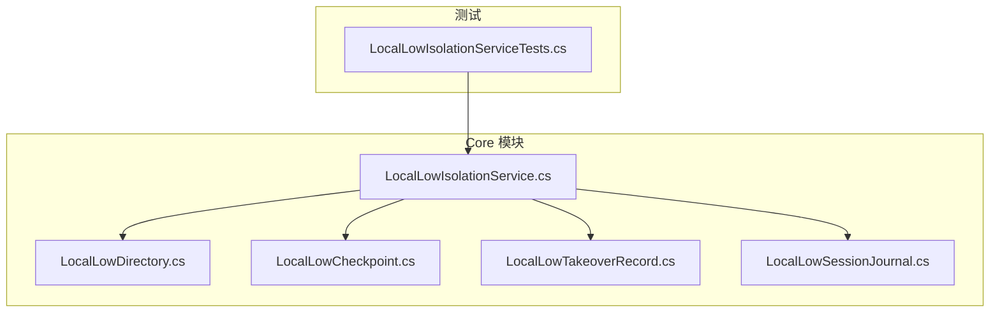
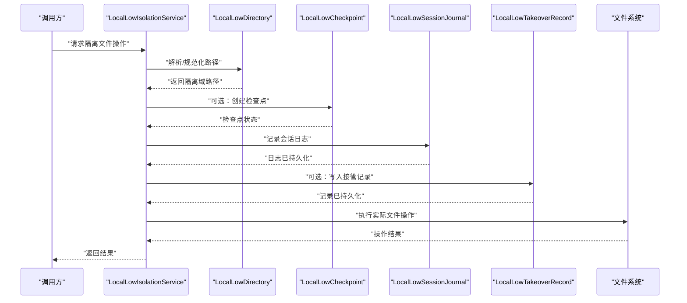
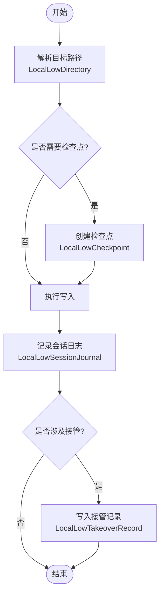
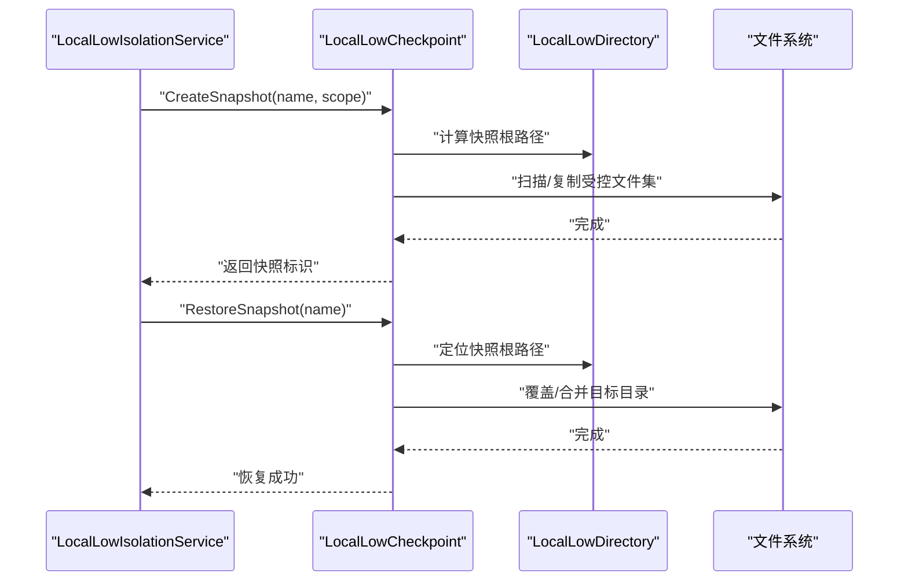
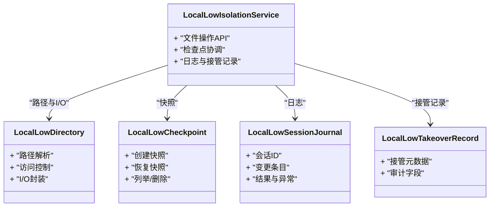

# 本地存储隔离

<cite>
**本文引用的文件**   
- [LocalLowIsolationService.cs](file://src/Crystalfly.Core/LocalLow/LocalLowIsolationService.cs)
- [LocalLowDirectory.cs](file://src/Crystalfly.Core/LocalLow/LocalLowDirectory.cs)
- [LocalLowCheckpoint.cs](file://src/Crystalfly.Core/LocalLow/LocalLowCheckpoint.cs)
- [LocalLowTakeoverRecord.cs](file://src/Crystalfly.Core/Models/LocalLowTakeoverRecord.cs)
- [LocalLowSessionJournal.cs](file://src/Crystalfly.Core/Models/LocalLowSessionJournal.cs)
- [LocalLowIsolationServiceTests.cs](file://tests/Crystalfly.Core.Tests/LocalLow/LocalLowIsolationServiceTests.cs)
</cite>

## 目录
1. [简介](#简介)
2. [项目结构](#项目结构)
3. [核心组件](#核心组件)
4. [架构总览](#架构总览)
5. [详细组件分析](#详细组件分析)
6. [依赖关系分析](#依赖关系分析)
7. [性能考虑](#性能考虑)
8. [故障排查指南](#故障排查指南)
9. [结论](#结论)
10. [附录：使用示例与最佳实践](#附录使用示例与最佳实践)

## 简介
本技术文档聚焦于“本地存储隔离子系统”，围绕 LocalLowIsolationService 的隔离机制设计展开，涵盖文件重定向、权限控制、访问拦截等实现要点；详细说明 LocalLowDirectory 的路径管理与文件系统操作；解释 LocalLowCheckpoint 的检查点（快照）与恢复能力；描述 LocalLowTakeoverRecord 接管记录与 LocalLowSessionJournal 会话日志的数据结构与用途，包括变更追踪、审计日志与故障诊断。最后给出配置选项与安全考量，并提供可操作的代码示例路径，帮助读者以安全的方式使用隔离服务进行文件操作和数据管理。

## 项目结构
隔离子系统位于 Crystalfly.Core 模块中，核心文件分布如下：
- 隔离服务与目录抽象
  - src/Crystalfly.Core/LocalLow/LocalLowIsolationService.cs
  - src/Crystalfly.Core/LocalLow/LocalLowDirectory.cs
  - src/Crystalfly.Core/LocalLow/LocalLowCheckpoint.cs
- 数据模型
  - src/Crystalfly.Core/Models/LocalLowTakeoverRecord.cs
  - src/Crystalfly.Core/Models/LocalLowSessionJournal.cs
- 测试
  - tests/Crystalfly.Core.Tests/LocalLow/LocalLowIsolationServiceTests.cs

图表来源
- [LocalLowIsolationService.cs](file://src/Crystalfly.Core/LocalLow/LocalLowIsolationService.cs)
- [LocalLowDirectory.cs](file://src/Crystalfly.Core/LocalLow/LocalLowDirectory.cs)
- [LocalLowCheckpoint.cs](file://src/Crystalfly.Core/LocalLow/LocalLowCheckpoint.cs)
- [LocalLowTakeoverRecord.cs](file://src/Crystalfly.Core/Models/LocalLowTakeoverRecord.cs)
- [LocalLowSessionJournal.cs](file://src/Crystalfly.Core/Models/LocalLowSessionJournal.cs)
- [LocalLowIsolationServiceTests.cs](file://tests/Crystalfly.Core.Tests/LocalLow/LocalLowIsolationServiceTests.cs)

章节来源
- [LocalLowIsolationService.cs](file://src/Crystalfly.Core/LocalLow/LocalLowIsolationService.cs)
- [LocalLowDirectory.cs](file://src/Crystalfly.Core/LocalLow/LocalLowDirectory.cs)
- [LocalLowCheckpoint.cs](file://src/Crystalfly.Core/LocalLow/LocalLowCheckpoint.cs)
- [LocalLowTakeoverRecord.cs](file://src/Crystalfly.Core/Models/LocalLowTakeoverRecord.cs)
- [LocalLowSessionJournal.cs](file://src/Crystalfly.Core/Models/LocalLowSessionJournal.cs)
- [LocalLowIsolationServiceTests.cs](file://tests/Crystalfly.Core.Tests/LocalLow/LocalLowIsolationServiceTests.cs)

## 核心组件
- LocalLowIsolationService：提供隔离上下文下的文件读写、目录枚举、检查点创建/恢复、接管记录与会话日志写入等高级 API，内部通过 LocalLowDirectory 完成路径解析与重定向，并通过检查点与日志保障一致性与可观测性。
- LocalLowDirectory：封装低权限用户目录（如 Windows 的 LocalLow 风格路径）的定位、拼接、校验与基础文件系统操作，确保所有路径在隔离域内。
- LocalLowCheckpoint：负责创建与恢复检查点（快照），支持命名快照、增量或全量策略（由具体实现决定），用于快速回滚与一致性恢复。
- LocalLowTakeoverRecord：记录接管事件（例如进程切换、实例迁移、权限提升等）的关键元数据，便于审计与排障。
- LocalLowSessionJournal：按会话维度记录变更日志，包含时间戳、操作类型、目标路径、摘要等信息，支撑变更追踪与审计。

章节来源
- [LocalLowIsolationService.cs](file://src/Crystalfly.Core/LocalLow/LocalLowIsolationService.cs)
- [LocalLowDirectory.cs](file://src/Crystalfly.Core/LocalLow/LocalLowDirectory.cs)
- [LocalLowCheckpoint.cs](file://src/Crystalfly.Core/LocalLow/LocalLowCheckpoint.cs)
- [LocalLowTakeoverRecord.cs](file://src/Crystalfly.Core/Models/LocalLowTakeoverRecord.cs)
- [LocalLowSessionJournal.cs](file://src/Crystalfly.Core/Models/LocalLowSessionJournal.cs)

## 架构总览
下图展示了隔离服务的整体交互：上层调用通过 LocalLowIsolationService 进入，服务将路径重定向到 LocalLowDirectory 管理的隔离域，必要时创建或恢复检查点，并持久化接管记录与会话日志，最终执行底层文件系统操作。

图表来源
- [LocalLowIsolationService.cs](file://src/Crystalfly.Core/LocalLow/LocalLowIsolationService.cs)
- [LocalLowDirectory.cs](file://src/Crystalfly.Core/LocalLow/LocalLowDirectory.cs)
- [LocalLowCheckpoint.cs](file://src/Crystalfly.Core/LocalLow/LocalLowCheckpoint.cs)
- [LocalLowTakeoverRecord.cs](file://src/Crystalfly.Core/Models/LocalLowTakeoverRecord.cs)
- [LocalLowSessionJournal.cs](file://src/Crystalfly.Core/Models/LocalLowSessionJournal.cs)

## 详细组件分析

### LocalLowIsolationService：隔离服务
职责与边界
- 对外暴露安全的文件操作 API，统一入口，屏蔽底层路径细节与安全检查。
- 协调 LocalLowDirectory 进行路径重定向，确保所有 I/O 发生在隔离域。
- 在关键操作前后触发检查点与日志记录，保证可回溯与可恢复。
- 维护会话上下文，关联会话日志与接管记录。

关键流程（示例：带检查点的写操作）

图表来源
- [LocalLowIsolationService.cs](file://src/Crystalfly.Core/LocalLow/LocalLowIsolationService.cs)
- [LocalLowDirectory.cs](file://src/Crystalfly.Core/LocalLow/LocalLowDirectory.cs)
- [LocalLowCheckpoint.cs](file://src/Crystalfly.Core/LocalLow/LocalLowCheckpoint.cs)
- [LocalLowTakeoverRecord.cs](file://src/Crystalfly.Core/Models/LocalLowTakeoverRecord.cs)
- [LocalLowSessionJournal.cs](file://src/Crystalfly.Core/Models/LocalLowSessionJournal.cs)

章节来源
- [LocalLowIsolationService.cs](file://src/Crystalfly.Core/LocalLow/LocalLowIsolationService.cs)

### LocalLowDirectory：路径管理与文件系统操作
职责与边界
- 定位“本地低目录”根路径，提供路径拼接、规范化与存在性检查。
- 对传入路径进行白名单/黑名单校验，防止越权访问。
- 封装常用文件系统操作（读/写/删/枚举），统一错误处理与日志输出。

典型行为
- 路径归一化：去除冗余分隔符、相对路径转绝对路径、限制层级深度。
- 访问控制：拒绝访问隔离域之外的路径，拒绝危险扩展名或符号链接（若启用）。
- 原子性辅助：为需要原子性的操作提供临时文件与重命名策略。

章节来源
- [LocalLowDirectory.cs](file://src/Crystalfly.Core/LocalLow/LocalLowDirectory.cs)

### LocalLowCheckpoint：检查点（快照）与恢复
职责与边界
- 创建命名检查点，支持全量或增量策略（由实现决定）。
- 列出、删除、恢复到指定检查点。
- 与隔离目录协同，确保检查点元数据与数据一致性。

关键流程（创建与恢复）

图表来源
- [LocalLowCheckpoint.cs](file://src/Crystalfly.Core/LocalLow/LocalLowCheckpoint.cs)
- [LocalLowDirectory.cs](file://src/Crystalfly.Core/LocalLow/LocalLowDirectory.cs)

章节来源
- [LocalLowCheckpoint.cs](file://src/Crystalfly.Core/LocalLow/LocalLowCheckpoint.cs)

### LocalLowTakeoverRecord：接管记录
数据结构要点
- 唯一标识：接管事件 ID。
- 时间戳：发生时间与持续时间。
- 主体信息：发起者、目标实例/进程标识。
- 原因与上下文：接管原因、前置条件、相关会话 ID。
- 状态与结果：成功/失败、错误码、重试次数。
- 审计字段：签名或校验和（可选）、来源可信度。

用途
- 审计与合规：记录谁在何时接管了资源。
- 故障诊断：结合会话日志快速定位问题。
- 幂等与去抖：基于唯一标识避免重复接管。

章节来源
- [LocalLowTakeoverRecord.cs](file://src/Crystalfly.Core/Models/LocalLowTakeoverRecord.cs)

### LocalLowSessionJournal：会话日志
数据结构要点
- 会话标识：会话 ID、版本、环境信息。
- 条目序列：单调递增序号，便于排序与回放。
- 操作类型：创建/更新/删除/移动/属性变更等。
- 目标对象：相对路径、哈希摘要、大小、时间戳。
- 结果与异常：成功/失败、错误消息、堆栈摘要（脱敏）。
- 审计字段：操作者、来源进程、签名（可选）。

用途
- 变更追踪：精确还原某次会话的文件变更。
- 审计日志：满足合规要求与问题复盘。
- 故障诊断：结合检查点快速回滚到已知良好状态。

章节来源
- [LocalLowSessionJournal.cs](file://src/Crystalfly.Core/Models/LocalLowSessionJournal.cs)

## 依赖关系分析
- LocalLowIsolationService 依赖：
  - LocalLowDirectory：路径解析与 I/O 封装
  - LocalLowCheckpoint：快照创建/恢复
  - LocalLowSessionJournal：会话日志持久化
  - LocalLowTakeoverRecord：接管记录持久化
- 测试依赖：
  - LocalLowIsolationServiceTests 验证隔离服务的关键路径与异常分支

图表来源
- [LocalLowIsolationService.cs](file://src/Crystalfly.Core/LocalLow/LocalLowIsolationService.cs)
- [LocalLowDirectory.cs](file://src/Crystalfly.Core/LocalLow/LocalLowDirectory.cs)
- [LocalLowCheckpoint.cs](file://src/Crystalfly.Core/LocalLow/LocalLowCheckpoint.cs)
- [LocalLowTakeoverRecord.cs](file://src/Crystalfly.Core/Models/LocalLowTakeoverRecord.cs)
- [LocalLowSessionJournal.cs](file://src/Crystalfly.Core/Models/LocalLowSessionJournal.cs)

章节来源
- [LocalLowIsolationService.cs](file://src/Crystalfly.Core/LocalLow/LocalLowIsolationService.cs)
- [LocalLowDirectory.cs](file://src/Crystalfly.Core/LocalLow/LocalLowDirectory.cs)
- [LocalLowCheckpoint.cs](file://src/Crystalfly.Core/LocalLow/LocalLowCheckpoint.cs)
- [LocalLowTakeoverRecord.cs](file://src/Crystalfly.Core/Models/LocalLowTakeoverRecord.cs)
- [LocalLowSessionJournal.cs](file://src/Crystalfly.Core/Models/LocalLowSessionJournal.cs)

## 性能考虑
- 批量操作与事务化：尽量合并小粒度 I/O，减少磁盘抖动；必要时采用临时目录+原子替换。
- 检查点策略：大目录优先增量快照；合理设置保留策略与清理周期，避免空间膨胀。
- 日志落盘：异步写入与批提交，降低主路径延迟；定期归档与压缩。
- 路径解析缓存：热点路径可缓存规范化结果，但需关注失效策略。
- 并发控制：同一会话内的写操作串行化，跨会话通过锁或队列避免竞争。

[本节为通用指导，不直接分析具体文件]

## 故障排查指南
常见问题与定位思路
- 路径越界：确认 LocalLowDirectory 的白名单/黑名单规则与路径规范化逻辑。
- 权限不足：检查运行账户对隔离目录的读写权限，必要时调整 ACL。
- 检查点不一致：核对快照元数据与数据完整性，尝试恢复到上一个稳定快照。
- 日志缺失：确认会话日志持久化路径与写入权限，检查异步队列是否堆积。
- 接管冲突：查看接管记录中的唯一标识与状态，避免重复接管。

建议的诊断步骤
- 从会话日志入手，定位最近一次失败的操作与目标路径。
- 对比检查点差异，确认受影响文件集合。
- 审查接管记录，判断是否存在外部干预导致的异常。
- 复现问题后，开启更详细的调试日志（注意脱敏）。

章节来源
- [LocalLowIsolationServiceTests.cs](file://tests/Crystalfly.Core.Tests/LocalLow/LocalLowIsolationServiceTests.cs)

## 结论
本地存储隔离子系统通过 LocalLowIsolationService 统一入口，结合 LocalLowDirectory 的路径重定向与访问控制、LocalLowCheckpoint 的快照与恢复、以及 LocalLowSessionJournal 与 LocalLowTakeoverRecord 的审计与诊断能力，构建了高可靠、可追溯、易恢复的隔离文件操作体系。配合合理的配置与安全策略，可在复杂环境中保障数据完整性与安全性。

[本节为总结，不直接分析具体文件]

## 附录：使用示例与最佳实践
以下示例仅展示调用方式与注意事项，不包含具体代码内容。请根据实际 API 签名调整参数。

- 基本文件写入（自动重定向与日志）
  - 步骤：构造会话上下文 -> 调用隔离服务写入 -> 捕获异常 -> 记录错误日志
  - 参考路径：[LocalLowIsolationService.cs](file://src/Crystalfly.Core/LocalLow/LocalLowIsolationService.cs)
  - 参考测试：[LocalLowIsolationServiceTests.cs](file://tests/Crystalfly.Core.Tests/LocalLow/LocalLowIsolationServiceTests.cs)

- 创建与恢复检查点
  - 步骤：在关键变更前创建命名快照 -> 执行变更 -> 失败时恢复到上一快照
  - 参考路径：[LocalLowCheckpoint.cs](file://src/Crystalfly.Core/LocalLow/LocalLowCheckpoint.cs)

- 记录接管事件
  - 步骤：在进程切换或权限提升前写入接管记录 -> 成功后标记完成 -> 失败时重试或告警
  - 参考路径：[LocalLowTakeoverRecord.cs](file://src/Crystalfly.Core/Models/LocalLowTakeoverRecord.cs)

- 读取会话日志进行审计
  - 步骤：按会话 ID 查询日志 -> 过滤操作类型与时间范围 -> 导出报告
  - 参考路径：[LocalLowSessionJournal.cs](file://src/Crystalfly.Core/Models/LocalLowSessionJournal.cs)

最佳实践
- 始终通过隔离服务进行文件操作，避免绕过路径重定向。
- 为大目录操作启用检查点，并在变更后尽快清理旧快照。
- 对敏感信息脱敏后再写入日志。
- 为关键路径添加幂等键，避免重复执行导致的状态漂移。

[本节为使用指引，不直接分析具体文件]