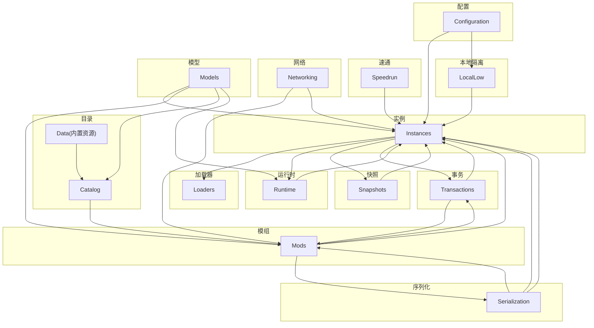
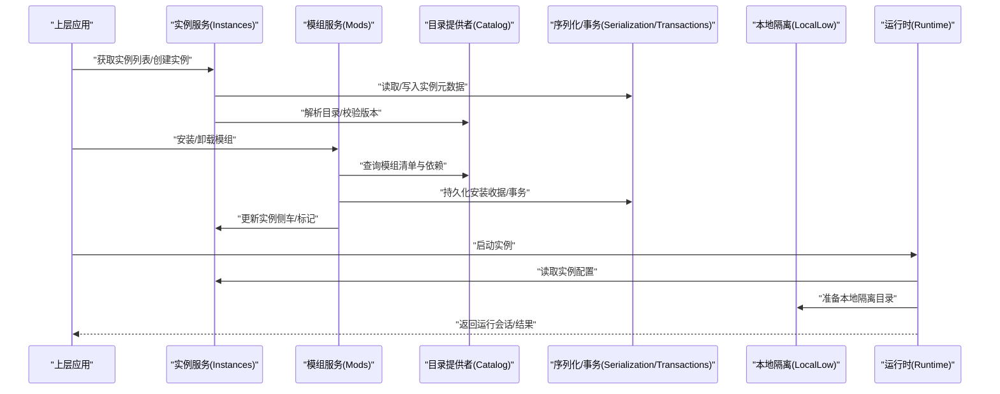
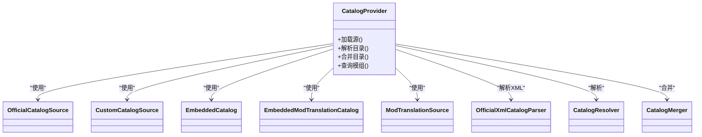
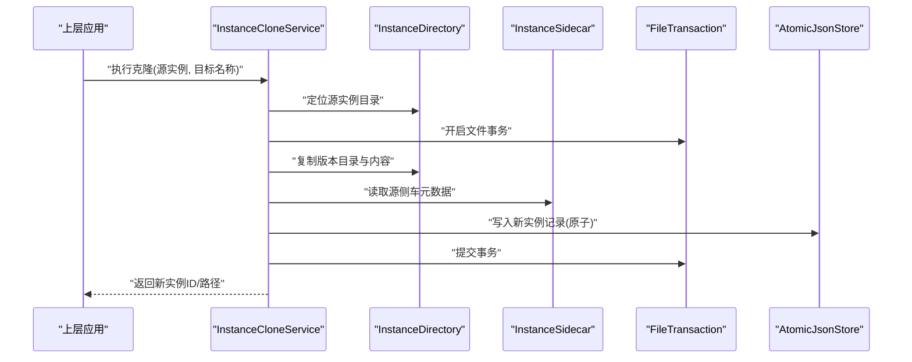
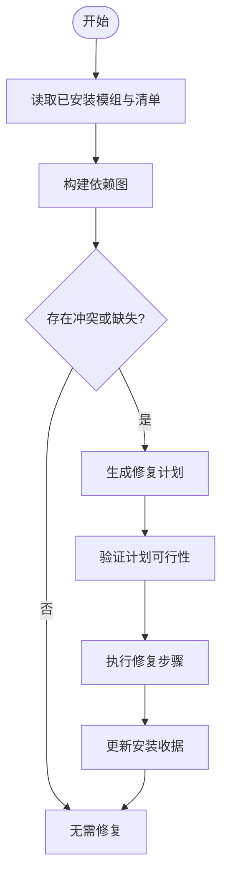
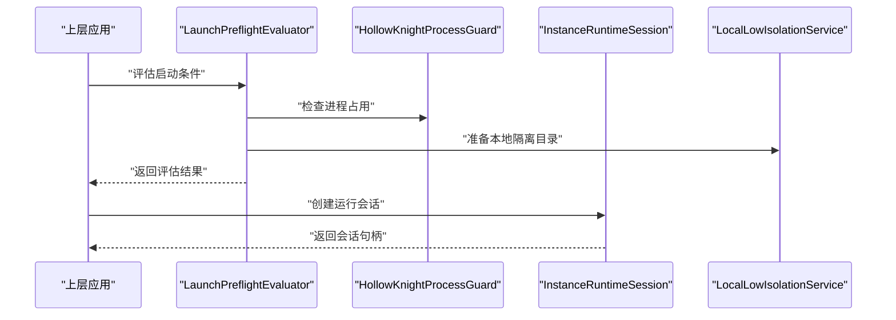
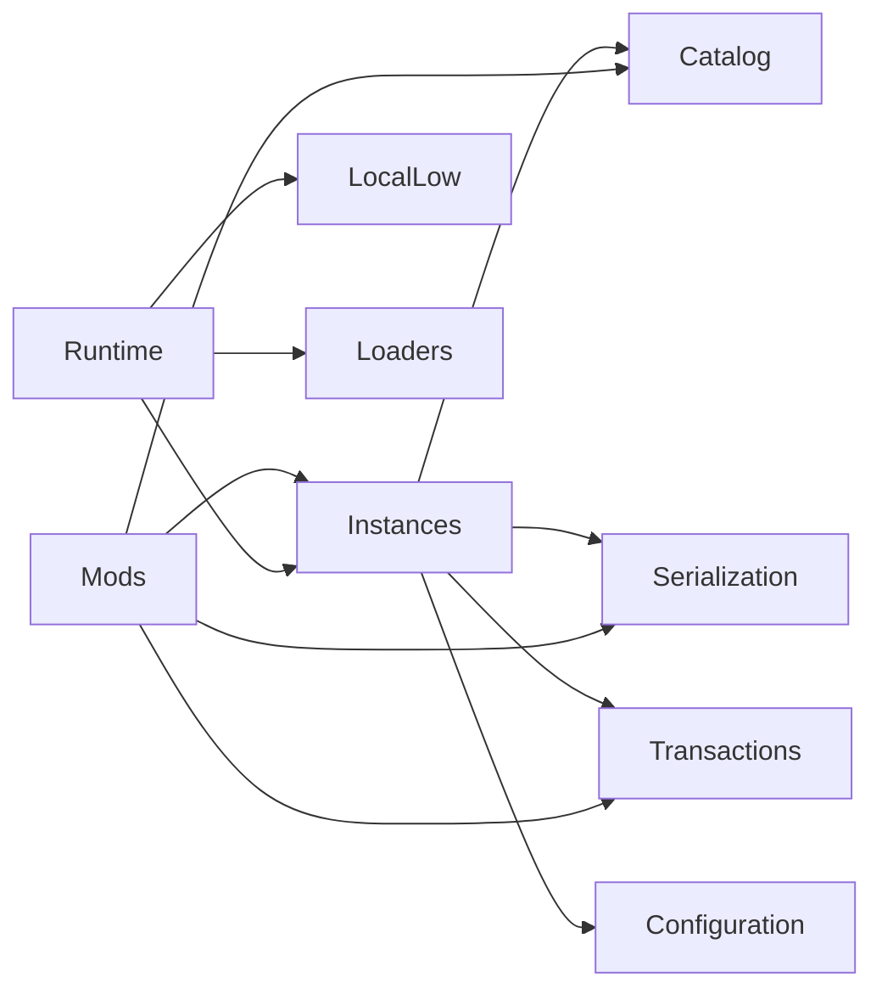

# 核心模块 (Crystalfly.Core)

<cite>
**本文引用的文件**   
- [Crystalfly.Core.csproj](file://src/Crystalfly.Core/Crystalfly.Core.csproj)
- [CrystalflyPaths.cs](file://src/Crystalfly.Core/Configuration/CrystalflyPaths.cs)
- [CrystalflySettings.cs](file://src/Crystalfly.Core/Configuration/CrystalflySettings.cs)
- [CrystalflySettingsStore.cs](file://src/Crystalfly.Core/Configuration/CrystalflySettingsStore.cs)
- [InstanceRecord.cs](file://src/Crystalfly.Core/Models/InstanceRecord.cs)
- [ModManifest.cs](file://src/Crystalfly.Core/Models/ModManifest.cs)
- [GameCatalog.cs](file://src/Crystalfly.Core/Models/GameCatalog.cs)
- [LoaderManifest.cs](file://src/Crystalfly.Core/Models/LoaderManifest.cs)
- [InstalledPackageReceipt.cs](file://src/Crystalfly.Core/Models/InstalledPackageReceipt.cs)
- [InstalledModReceipt.cs](file://src/Crystalfly.Core/Models/InstalledModReceipt.cs)
- [LocalLowSessionJournal.cs](file://src/Crystalfly.Core/Models/LocalLowSessionJournal.cs)
- [LocalLowTakeoverRecord.cs](file://src/Crystalfly.Core/Models/LocalLowTakeoverRecord.cs)
- [TransactionJournal.cs](file://src/Crystalfly.Core/Models/TransactionJournal.cs)
- [BuildFingerprint.cs](file://src/Crystalfly.Core/Models/BuildFingerprint.cs)
- [GameBuild.cs](file://src/Crystalfly.Core/Models/GameBuild.cs)
- [NamedSnapshot.cs](file://src/Crystalffly.Core/Models/NamedSnapshot.cs)
- [SpeedrunAsset.cs](file://src/Crystalfly.Core/Models/SpeedrunAsset.cs)
- [SpeedrunFileRule.cs](file://src/Crystalfly.Core/Models/SpeedrunFileRule.cs)
- [SpeedrunTemplate.cs](file://src/Crystalfly.Core/Models/SpeedrunTemplate.cs)
- [SpeedrunVerificationReport.cs](file://src/Crystalfly.Core/Models/SpeedrunVerificationReport.cs)
- [ModTranslationCatalog.cs](file://src/Crystalfly.Core/Models/ModTranslationCatalog.cs)
- [CatalogProvider.cs](file://src/Crystalfly.Core/Catalog/CatalogProvider.cs)
- [CatalogResolver.cs](file://src/Crystalfly.Core/Catalog/CatalogResolver.cs)
- [CatalogMerger.cs](file://src/Crystalfly.Core/Catalog/CatalogMerger.cs)
- [OfficialCatalogSource.cs](file://src/Crystalfly.Core/Catalog/OfficialCatalogSource.cs)
- [CustomCatalogSource.cs](file://src/Crystalfly.Core/Catalog/CustomCatalogSource.cs)
- [EmbeddedCatalog.cs](file://src/Crystalfly.Core/Catalog/EmbeddedCatalog.cs)
- [EmbeddedModTranslationCatalog.cs](file://src/Crystalfly.Core/Catalog/EmbeddedModTranslationCatalog.cs)
- [ModTranslationSource.cs](file://src/Crystalfly.Core/Catalog/ModTranslationSource.cs)
- [OfficialXmlCatalogParser.cs](file://src/Crystalfly.Core/Catalog/OfficialXmlCatalogParser.cs)
- [InstanceDirectory.cs](file://src/Crystalfly.Core/Instances/InstanceDirectory.cs)
- [InstanceSidecar.cs](file://src/Crystalfly.Core/Instances/InstanceSidecar.cs)
- [VersionDirectoryScanner.cs](file://src/Crystalfly.Core/Instances/VersionDirectoryScanner.cs)
- [BuildFingerprintService.cs](file://src/Crystalfly.Core/Instances/BuildFingerprintService.cs)
- [InstanceCloneService.cs](file://src/Crystalfly.Core/Instances/InstanceCloneService.cs)
- [InstanceDeletionService.cs](file://src/Crystalfly.Core/Instances/InstanceDeletionService.cs)
- [InstanceImportService.cs](file://src/Crystalfly.Core/Instances/InstanceImportService.cs)
- [ModManager.cs](file://src/Crystalfly.Core/Mods/ModManager.cs)
- [ModInstallService.cs](file://src/Crystalfly.Core/Mods/ModInstallService.cs)
- [ModDependencyResolver.cs](file://src/Crystalfly.Core/Mods/ModDependencyResolver.cs)
- [ModDependencyRepairPlanner.cs](file://src/Crystalffly.Core/Mods/ModDependencyRepairPlanner.cs)
- [ModInstallPlan.cs](file://src/Crystalfly.Core/Mods/ModInstallPlan.cs)
- [ModRemovalImpactPlan.cs](file://src/Crystalfly.Core/Mods/ModRemovalImpactPlan.cs)
- [InstalledModDependencyGraph.cs](file://src/Crystalfly.Core/Mods/InstalledModDependencyGraph.cs)
- [ModDependencyRepairPlan.cs](file://src/Crystalfly.Core/Mods/ModDependencyRepairPlan.cs)
- [LoaderManager.cs](file://src/Crystalfly.Core/Loaders/LoaderManager.cs)
- [LoaderInspection.cs](file://src/Crystalfly.Core/Loaders/LoaderInspection.cs)
- [LoaderStateDetector.cs](file://src/Crystalfly.Core/Loaders/LoaderStateDetector.cs)
- [LocalLoaderPackageManifest.cs](file://src/Crystalfly.Core/Loaders/LocalLoaderPackageManifest.cs)
- [LocalLowIsolationService.cs](file://src/Crystalffly.Core/LocalLow/LocalLowIsolationService.cs)
- [LocalLowDirectory.cs](file://src/Crystalfly.Core/LocalLow/LocalLowDirectory.cs)
- [LocalLowCheckpoint.cs](file://src/Crystalfly.Core/LocalLow/LocalLowCheckpoint.cs)
- [HollowKnightProcessGuard.cs](file://src/Crystalfly.Core/Runtime/HollowKnightProcessGuard.cs)
- [InstanceRuntimeSession.cs](file://src/Crystalfly.Core/Runtime/InstanceRuntimeSession.cs)
- [LaunchPreflightEvaluator.cs](file://src/Crystalfly.Core/Runtime/LaunchPreflightEvaluator.cs)
- [AtomicJsonStore.cs](file://src/Crystalfly.Core/Serialization/AtomicJsonStore.cs)
- [CrystalflyJson.cs](file://src/Crystalfly.Core/Serialization/CrystalflyJson.cs)
- [NamedSnapshotService.cs](file://src/Crystalfly.Core/Snapshots/NamedSnapshotService.cs)
- [SpeedrunEnvironmentProvisioner.cs](file://src/Crystalfly.Core/Speedrun/SpeedrunEnvironmentProvisioner.cs)
- [SpeedrunEnvironmentVerifier.cs](file://src/Crystalfly.Core/Speedrun/SpeedrunEnvironmentVerifier.cs)
- [OfficialSpeedrunTemplatePolicy.cs](file://src/Crystalfly.Core/Speedrun/OfficialSpeedrunTemplatePolicy.cs)
- [SpeedrunVerificationRequest.cs](file://src/Crystalfly.Core/Speedrun/SpeedrunVerificationRequest.cs)
- [FileTransaction.cs](file://src/Crystalfly.Core/Transactions/FileTransaction.cs)
- [GitHubDownloadRouteHandler.cs](file://src/Crystalfly.Core/Networking/GitHubDownloadRouteHandler.cs)
- [GitHubRouteLatencyService.cs](file://src/Crystalfly.Core/Networking/GitHubRouteLatencyService.cs)
</cite>

## 目录
1. [简介](#简介)
2. [项目结构](#项目结构)
3. [核心组件](#核心组件)
4. [架构总览](#架构总览)
5. [详细组件分析](#详细组件分析)
6. [依赖关系分析](#依赖关系分析)
7. [性能考虑](#性能考虑)
8. [故障排查指南](#故障排查指南)
9. [结论](#结论)
10. [附录](#附录)

## 简介
本设计文档聚焦 Crystalfly.Core 核心模块，作为业务逻辑层，承担游戏实例管理、模组生态、目录系统、运行时管理等关键职责。该模块通过服务层抽象与依赖注入组织能力边界，提供稳定可靠的 API 供上层应用（UI、下载队列、Steam 集成等）调用。文档将深入解析 Instances、Mods、Catalog、Runtime、LocalLow 等子系统，说明数据模型、接口契约、类图与时序图，并给出使用示例路径以便快速上手。

## 项目结构
Crystalfly.Core 采用按领域划分的目录结构，核心子域包括：
- Catalog：模组目录聚合、解析与合并
- Configuration：路径与设置持久化
- Data：内置官方目录资源
- Instances：游戏实例生命周期与元数据
- Loaders：加载器发现与状态检测
- LocalLow：本地存储隔离与会话记录
- Logs：日志基础设施（占位）
- Models：跨子域共享的数据实体
- Mods：模组安装、卸载、依赖修复与计划生成
- Networking：网络辅助（如 GitHub 路由与延迟评估）
- Packages：包处理（占位）
- Runtime：进程守护、启动预检与运行会话
- Serialization：JSON 序列化与原子写入
- Snapshots：命名快照
- Speedrun：速通环境准备与验证
- Transactions：文件事务保障

图表来源
- [Crystalfly.Core.csproj](file://src/Crystalfly.Core/Crystalfly.Core.csproj)

章节来源
- [Crystalfly.Core.csproj](file://src/Crystalfly.Core/Crystalfly.Core.csproj)

## 核心组件
本节概述各子系统的职责与对外暴露的服务能力，强调服务层抽象与依赖注入的组织方式。

- 目录系统（Catalog）
  - 职责：聚合官方与自定义目录源，解析 XML/JSON 目录，合并去重，提供查询与翻译支持。
  - 关键服务：目录提供者、解析器、合并器、多源适配器。
- 实例管理（Instances）
  - 职责：实例目录结构、侧车元数据、版本扫描、指纹构建、克隆/导入/删除。
  - 关键服务：目录导航、侧车读写、版本扫描、指纹计算、实例操作服务。
- 模组生态（Mods）
  - 职责：模组清单解析、依赖图构建、安装/卸载计划、依赖修复规划、影响面评估。
  - 关键服务：模组管理器、安装服务、依赖解析与修复规划。
- 运行时（Runtime）
  - 职责：进程守护、启动前检查、运行会话封装。
  - 关键服务：进程守卫、预检评估器、运行会话。
- 本地隔离（LocalLow）
  - 职责：游戏本地存储隔离、会话日志、接管记录、检查点。
  - 关键服务：隔离服务、目录定位、检查点。
- 加载器（Loaders）
  - 职责：加载器包清单、状态检测、自检信息。
  - 关键服务：加载器管理器、检测器、清单解析。
- 序列化与事务（Serialization & Transactions）
  - 职责：JSON 序列化、原子写入、文件事务回滚。
  - 关键服务：原子 JSON 存储、事务封装。
- 快照（Snapshots）
  - 职责：命名快照的创建与管理。
- 速通（Speedrun）
  - 职责：速通模板策略、环境准备与验证。
- 网络（Networking）
  - 职责：GitHub 路由处理器与延迟评估。

章节来源
- [CatalogProvider.cs](file://src/Crystalfly.Core/Catalog/CatalogProvider.cs)
- [CatalogResolver.cs](file://src/Crystalfly.Core/Catalog/CatalogResolver.cs)
- [CatalogMerger.cs](file://src/Crystalfly.Core/Catalog/CatalogMerger.cs)
- [InstanceDirectory.cs](file://src/Crystalfly.Core/Instances/InstanceDirectory.cs)
- [InstanceSidecar.cs](file://src/Crystalfly.Core/Instances/InstanceSidecar.cs)
- [VersionDirectoryScanner.cs](file://src/Crystalfly.Core/Instances/VersionDirectoryScanner.cs)
- [BuildFingerprintService.cs](file://src/Crystalfly.Core/Instances/BuildFingerprintService.cs)
- [InstanceCloneService.cs](file://src/Crystalfly.Core/Instances/InstanceCloneService.cs)
- [InstanceDeletionService.cs](file://src/Crystalfly.Core/Instances/InstanceDeletionService.cs)
- [InstanceImportService.cs](file://src/Crystalfly.Core/Instances/InstanceImportService.cs)
- [ModManager.cs](file://src/Crystalfly.Core/Mods/ModManager.cs)
- [ModInstallService.cs](file://src/Crystalfly.Core/Mods/ModInstallService.cs)
- [ModDependencyResolver.cs](file://src/Crystalfly.Core/Mods/ModDependencyResolver.cs)
- [ModDependencyRepairPlanner.cs](file://src/Crystalfly.Core/Mods/ModDependencyRepairPlanner.cs)
- [ModInstallPlan.cs](file://src/Crystalfly.Core/Mods/ModInstallPlan.cs)
- [ModRemovalImpactPlan.cs](file://src/Crystalfly.Core/Mods/ModRemovalImpactPlan.cs)
- [InstalledModDependencyGraph.cs](file://src/Crystalfly.Core/Mods/InstalledModDependencyGraph.cs)
- [ModDependencyRepairPlan.cs](file://src/Crystalfly.Core/Mods/ModDependencyRepairPlan.cs)
- [LoaderManager.cs](file://src/Crystalfly.Core/Loaders/LoaderManager.cs)
- [LoaderInspection.cs](file://src/Crystalfly.Core/Loaders/LoaderInspection.cs)
- [LoaderStateDetector.cs](file://src/Crystalfly.Core/Loaders/LoaderStateDetector.cs)
- [LocalLoaderPackageManifest.cs](file://src/Crystalfly.Core/Loaders/LocalLoaderPackageManifest.cs)
- [LocalLowIsolationService.cs](file://src/Crystalfly.Core/LocalLow/LocalLowIsolationService.cs)
- [LocalLowDirectory.cs](file://src/Crystalfly.Core/LocalLow/LocalLowDirectory.cs)
- [LocalLowCheckpoint.cs](file://src/Crystalfly.Core/LocalLow/LocalLowCheckpoint.cs)
- [HollowKnightProcessGuard.cs](file://src/Crystalfly.Core/Runtime/HollowKnightProcessGuard.cs)
- [InstanceRuntimeSession.cs](file://src/Crystalfly.Core/Runtime/InstanceRuntimeSession.cs)
- [LaunchPreflightEvaluator.cs](file://src/Crystalfly.Core/Runtime/LaunchPreflightEvaluator.cs)
- [AtomicJsonStore.cs](file://src/Crystalfly.Core/Serialization/AtomicJsonStore.cs)
- [CrystalflyJson.cs](file://src/Crystalfly.Core/Serialization/CrystalflyJson.cs)
- [NamedSnapshotService.cs](file://src/Crystalfly.Core/Snapshots/NamedSnapshotService.cs)
- [SpeedrunEnvironmentProvisioner.cs](file://src/Crystalfly.Core/Speedrun/SpeedrunEnvironmentProvisioner.cs)
- [SpeedrunEnvironmentVerifier.cs](file://src/Crystalfly.Core/Speedrun/SpeedrunEnvironmentVerifier.cs)
- [OfficialSpeedrunTemplatePolicy.cs](file://src/Crystalfly.Core/Speedrun/OfficialSpeedrunTemplatePolicy.cs)
- [SpeedrunVerificationRequest.cs](file://src/Crystalfly.Core/Speedrun/SpeedrunVerificationRequest.cs)
- [FileTransaction.cs](file://src/Crystalfly.Core/Transactions/FileTransaction.cs)
- [GitHubDownloadRouteHandler.cs](file://src/Crystalfly.Core/Networking/GitHubDownloadRouteHandler.cs)
- [GitHubRouteLatencyService.cs](file://src/Crystalfly.Core/Networking/GitHubRouteLatencyService.cs)

## 架构总览
Crystalfly.Core 以“服务层 + 数据模型”为核心，上层应用通过服务接口访问能力，避免直接耦合文件系统或外部协议。典型交互如下：

图表来源
- [InstanceDirectory.cs](file://src/Crystalfly.Core/Instances/InstanceDirectory.cs)
- [ModManager.cs](file://src/Crystalfly.Core/Mods/ModManager.cs)
- [CatalogProvider.cs](file://src/Crystalfly.Core/Catalog/CatalogProvider.cs)
- [AtomicJsonStore.cs](file://src/Crystalfly.Core/Serialization/AtomicJsonStore.cs)
- [LocalLowIsolationService.cs](file://src/Crystalfly.Core/LocalLow/LocalLowIsolationService.cs)
- [InstanceRuntimeSession.cs](file://src/Crystalfly.Core/Runtime/InstanceRuntimeSession.cs)

## 详细组件分析

### 目录系统（Catalog）
- 职责与边界
  - 聚合多个目录源（官方、自定义、嵌入式），统一解析与合并，提供查询接口。
  - 支持模组翻译目录与官方 XML 目录解析。
- 关键类与模式
  - 目录提供者：组合多个源，负责加载与缓存。
  - 解析器/合并器：对 XML/JSON 进行解析与去重合并。
  - 源适配：官方源、自定义源、嵌入式源、翻译源。
- 数据流
  - 初始化时加载各源 -> 解析为内部模型 -> 合并为统一目录视图 -> 查询命中。
- 复杂度与优化
  - 合并阶段需去重与冲突解决，建议增量更新与缓存命中。
- 错误处理
  - 源不可用、格式异常、重复条目冲突等应抛出明确异常并记录日志。

图表来源
- [CatalogProvider.cs](file://src/Crystalfly.Core/Catalog/CatalogProvider.cs)
- [OfficialCatalogSource.cs](file://src/Crystalfly.Core/Catalog/OfficialCatalogSource.cs)
- [CustomCatalogSource.cs](file://src/Crystalfly.Core/Catalog/CustomCatalogSource.cs)
- [EmbeddedCatalog.cs](file://src/Crystalfly.Core/Catalog/EmbeddedCatalog.cs)
- [EmbeddedModTranslationCatalog.cs](file://src/Crystalfly.Core/Catalog/EmbeddedModTranslationCatalog.cs)
- [ModTranslationSource.cs](file://src/Crystalfly.Core/Catalog/ModTranslationSource.cs)
- [OfficialXmlCatalogParser.cs](file://src/Crystalfly.Core/Catalog/OfficialXmlCatalogParser.cs)
- [CatalogResolver.cs](file://src/Crystalfly.Core/Catalog/CatalogResolver.cs)
- [CatalogMerger.cs](file://src/Crystalfly.Core/Catalog/CatalogMerger.cs)

章节来源
- [CatalogProvider.cs](file://src/Crystalfly.Core/Catalog/CatalogProvider.cs)
- [CatalogResolver.cs](file://src/Crystalfly.Core/Catalog/CatalogResolver.cs)
- [CatalogMerger.cs](file://src/Crystalfly.Core/Catalog/CatalogMerger.cs)
- [OfficialCatalogSource.cs](file://src/Crystalfly.Core/Catalog/OfficialCatalogSource.cs)
- [CustomCatalogSource.cs](file://src/Crystalfly.Core/Catalog/CustomCatalogSource.cs)
- [EmbeddedCatalog.cs](file://src/Crystalfly.Core/Catalog/EmbeddedCatalog.cs)
- [EmbeddedModTranslationCatalog.cs](file://src/Crystalffly.Core/Catalog/EmbeddedModTranslationCatalog.cs)
- [ModTranslationSource.cs](file://src/Crystalfly.Core/Catalog/ModTranslationSource.cs)
- [OfficialXmlCatalogParser.cs](file://src/Crystalfly.Core/Catalog/OfficialXmlCatalogParser.cs)

### 实例管理（Instances）
- 职责与边界
  - 维护实例目录结构、侧车元数据、版本扫描、指纹构建；提供克隆、导入、删除等操作。
- 关键类与模式
  - 目录导航：定位实例根目录、版本目录、侧车文件。
  - 侧车服务：读写实例附加元数据。
  - 版本扫描：枚举已安装版本并识别有效构建。
  - 指纹服务：基于构建产物计算唯一标识。
  - 操作服务：克隆、导入、删除，结合事务保证一致性。
- 数据模型
  - InstanceRecord：实例记录（名称、路径、版本、时间戳等）。
  - BuildFingerprint：构建指纹（哈希、特征字段）。
  - GameBuild：游戏构建信息（版本号、渠道等）。
- 流程时序（以“克隆实例”为例）

图表来源
- [InstanceCloneService.cs](file://src/Crystalfly.Core/Instances/InstanceCloneService.cs)
- [InstanceDirectory.cs](file://src/Crystalfly.Core/Instances/InstanceDirectory.cs)
- [InstanceSidecar.cs](file://src/Crystalfly.Core/Instances/InstanceSidecar.cs)
- [FileTransaction.cs](file://src/Crystalfly.Core/Transactions/FileTransaction.cs)
- [AtomicJsonStore.cs](file://src/Crystalfly.Core/Serialization/AtomicJsonStore.cs)

章节来源
- [InstanceDirectory.cs](file://src/Crystalfly.Core/Instances/InstanceDirectory.cs)
- [InstanceSidecar.cs](file://src/Crystalfly.Core/Instances/InstanceSidecar.cs)
- [VersionDirectoryScanner.cs](file://src/Crystalfly.Core/Instances/VersionDirectoryScanner.cs)
- [BuildFingerprintService.cs](file://src/Crystalfly.Core/Instances/BuildFingerprintService.cs)
- [InstanceCloneService.cs](file://src/Crystalfly.Core/Instances/InstanceCloneService.cs)
- [InstanceDeletionService.cs](file://src/Crystalfly.Core/Instances/InstanceDeletionService.cs)
- [InstanceImportService.cs](file://src/Crystalfly.Core/Instances/InstanceImportService.cs)
- [InstanceRecord.cs](file://src/Crystalfly.Core/Models/InstanceRecord.cs)
- [BuildFingerprint.cs](file://src/Crystalfly.Core/Models/BuildFingerprint.cs)
- [GameBuild.cs](file://src/Crystalfly.Core/Models/GameBuild.cs)

### 模组生态（Mods）
- 职责与边界
  - 解析模组清单、构建依赖图、生成安装/卸载计划、依赖修复规划、影响面评估。
- 关键类与模式
  - 模组管理器：对外统一入口，协调安装、卸载、查询。
  - 安装服务：执行安装计划，落盘并持久化收据。
  - 依赖解析器：解析依赖约束，构建有向无环图。
  - 修复规划器：针对缺失/冲突依赖生成修复步骤。
  - 计划对象：安装计划、移除影响计划、修复计划。
- 数据模型
  - ModManifest：模组清单（版本、依赖、文件规则等）。
  - InstalledModReceipt / InstalledPackageReceipt：安装收据。
  - LoaderManifest：加载器清单。
- 依赖修复流程图

图表来源
- [ModDependencyResolver.cs](file://src/Crystalfly.Core/Mods/ModDependencyResolver.cs)
- [InstalledModDependencyGraph.cs](file://src/Crystalfly.Core/Mods/InstalledModDependencyGraph.cs)
- [ModDependencyRepairPlanner.cs](file://src/Crystalfly.Core/Mods/ModDependencyRepairPlanner.cs)
- [ModDependencyRepairPlan.cs](file://src/Crystalfly.Core/Mods/ModDependencyRepairPlan.cs)
- [ModInstallService.cs](file://src/Crystalfly.Core/Mods/ModInstallService.cs)
- [ModInstallPlan.cs](file://src/Crystalfly.Core/Mods/ModInstallPlan.cs)
- [ModRemovalImpactPlan.cs](file://src/Crystalfly.Core/Mods/ModRemovalImpactPlan.cs)
- [InstalledModReceipt.cs](file://src/Crystalfly.Core/Models/InstalledModReceipt.cs)
- [InstalledPackageReceipt.cs](file://src/Crystalfly.Core/Models/InstalledPackageReceipt.cs)
- [ModManifest.cs](file://src/Crystalfly.Core/Models/ModManifest.cs)
- [LoaderManifest.cs](file://src/Crystalfly.Core/Models/LoaderManifest.cs)

章节来源
- [ModManager.cs](file://src/Crystalfly.Core/Mods/ModManager.cs)
- [ModInstallService.cs](file://src/Crystalfly.Core/Mods/ModInstallService.cs)
- [ModDependencyResolver.cs](file://src/Crystalfly.Core/Mods/ModDependencyResolver.cs)
- [ModDependencyRepairPlanner.cs](file://src/Crystalfly.Core/Mods/ModDependencyRepairPlanner.cs)
- [ModInstallPlan.cs](file://src/Crystalfly.Core/Mods/ModInstallPlan.cs)
- [ModRemovalImpactPlan.cs](file://src/Crystalfly.Core/Mods/ModRemovalImpactPlan.cs)
- [InstalledModDependencyGraph.cs](file://src/Crystalfly.Core/Mods/InstalledModDependencyGraph.cs)
- [ModDependencyRepairPlan.cs](file://src/Crystalfly.Core/Mods/ModDependencyRepairPlan.cs)
- [ModManifest.cs](file://src/Crystalffly.Core/Models/ModManifest.cs)
- [InstalledModReceipt.cs](file://src/Crystalfly.Core/Models/InstalledModReceipt.cs)
- [InstalledPackageReceipt.cs](file://src/Crystalfly.Core/Models/InstalledPackageReceipt.cs)
- [LoaderManifest.cs](file://src/Crystalfly.Core/Models/LoaderManifest.cs)

### 运行时（Runtime）
- 职责与边界
  - 启动前检查（磁盘空间、依赖完整性、进程占用）、进程守护、运行会话封装。
- 关键类与模式
  - 进程守卫：防止重复启动、监控退出码。
  - 预检评估器：综合实例、模组、加载器状态进行启动可行性判断。
  - 运行会话：封装一次运行的上下文与生命周期。
- 序列图（启动实例）

图表来源
- [LaunchPreflightEvaluator.cs](file://src/Crystalfly.Core/Runtime/LaunchPreflightEvaluator.cs)
- [HollowKnightProcessGuard.cs](file://src/Crystalfly.Core/Runtime/HollowKnightProcessGuard.cs)
- [InstanceRuntimeSession.cs](file://src/Crystalfly.Core/Runtime/InstanceRuntimeSession.cs)
- [LocalLowIsolationService.cs](file://src/Crystalfly.Core/LocalLow/LocalLowIsolationService.cs)

章节来源
- [HollowKnightProcessGuard.cs](file://src/Crystalfly.Core/Runtime/HollowKnightProcessGuard.cs)
- [InstanceRuntimeSession.cs](file://src/Crystalfly.Core/Runtime/InstanceRuntimeSession.cs)
- [LaunchPreflightEvaluator.cs](file://src/Crystalfly.Core/Runtime/LaunchPreflightEvaluator.cs)

### 本地隔离（LocalLow）
- 职责与边界
  - 为每个实例隔离游戏本地存储，记录会话日志与接管状态，提供检查点机制。
- 关键类与模式
  - 隔离服务：根据实例 ID 映射到隔离目录。
  - 目录定位：确定隔离根路径与子目录。
  - 检查点：保存/恢复关键状态。
- 数据模型
  - LocalLowSessionJournal：会话日志。
  - LocalLowTakeoverRecord：接管记录。

章节来源
- [LocalLowIsolationService.cs](file://src/Crystalfly.Core/LocalLow/LocalLowIsolationService.cs)
- [LocalLowDirectory.cs](file://src/Crystalfly.Core/LocalLow/LocalLowDirectory.cs)
- [LocalLowCheckpoint.cs](file://src/Crystalfly.Core/LocalLow/LocalLowCheckpoint.cs)
- [LocalLowSessionJournal.cs](file://src/Crystalfly.Core/Models/LocalLowSessionJournal.cs)
- [LocalLowTakeoverRecord.cs](file://src/Crystalfly.Core/Models/LocalLowTakeoverRecord.cs)

### 加载器（Loaders）
- 职责与边界
  - 发现本地加载器包、解析清单、检测运行状态、收集自检信息。
- 关键类与模式
  - 加载器管理器：注册与查询加载器。
  - 状态检测器：探测加载器是否可用/健康。
  - 清单解析：读取本地加载器包清单。

章节来源
- [LoaderManager.cs](file://src/Crystalfly.Core/Loaders/LoaderManager.cs)
- [LoaderStateDetector.cs](file://src/Crystalfly.Core/Loaders/LoaderStateDetector.cs)
- [LoaderInspection.cs](file://src/Crystalfly.Core/Loaders/LoaderInspection.cs)
- [LocalLoaderPackageManifest.cs](file://src/Crystalfly.Core/Loaders/LocalLoaderPackageManifest.cs)

### 序列化与事务（Serialization & Transactions）
- 职责与边界
  - 提供 JSON 序列化与原子写入，确保元数据与收据的一致性；文件事务用于批量操作的回滚。
- 关键类与模式
  - 原子 JSON 存储：写时临时文件 + 原子替换。
  - 事务封装：开启/提交/回滚，配合文件操作。

章节来源
- [AtomicJsonStore.cs](file://src/Crystalfly.Core/Serialization/AtomicJsonStore.cs)
- [CrystalflyJson.cs](file://src/Crystalfly.Core/Serialization/CrystalflyJson.cs)
- [FileTransaction.cs](file://src/Crystalfly.Core/Transactions/FileTransaction.cs)

### 快照（Snapshots）
- 职责与边界
  - 为实例创建命名快照，便于回溯与对比。
- 关键类与模式
  - 命名快照服务：创建、列出、删除快照。

章节来源
- [NamedSnapshotService.cs](file://src/Crystalfly.Core/Snapshots/NamedSnapshotService.cs)
- [NamedSnapshot.cs](file://src/Crystalfly.Core/Models/NamedSnapshot.cs)

### 速通（Speedrun）
- 职责与边界
  - 依据官方模板策略准备与验证速通环境，生成验证请求与报告。
- 关键类与模式
  - 环境准备器：拉取/校验必要资产。
  - 环境验证器：核对文件与规则。
  - 模板策略：定义官方模板约束。

章节来源
- [SpeedrunEnvironmentProvisioner.cs](file://src/Crystalfly.Core/Speedrun/SpeedrunEnvironmentProvisioner.cs)
- [SpeedrunEnvironmentVerifier.cs](file://src/Crystalfly.Core/Speedrun/SpeedrunEnvironmentVerifier.cs)
- [OfficialSpeedrunTemplatePolicy.cs](file://src/Crystalfly.Core/Speedrun/OfficialSpeedrunTemplatePolicy.cs)
- [SpeedrunVerificationRequest.cs](file://src/Crystalfly.Core/Speedrun/SpeedrunVerificationRequest.cs)
- [SpeedrunAsset.cs](file://src/Crystalfly.Core/Models/SpeedrunAsset.cs)
- [SpeedrunFileRule.cs](file://src/Crystalfly.Core/Models/SpeedrunFileRule.cs)
- [SpeedrunTemplate.cs](file://src/Crystalfly.Core/Models/SpeedrunTemplate.cs)
- [SpeedrunVerificationReport.cs](file://src/Crystalfly.Core/Models/SpeedrunVerificationReport.cs)

### 网络（Networking）
- 职责与边界
  - 提供 GitHub 路由处理器与延迟评估，辅助下载与资源获取。
- 关键类与模式
  - 路由处理器：封装下载路径与重试策略。
  - 延迟评估：选择低延迟节点。

章节来源
- [GitHubDownloadRouteHandler.cs](file://src/Crystalfly.Core/Networking/GitHubDownloadRouteHandler.cs)
- [GitHubRouteLatencyService.cs](file://src/Crystalfly.Core/Networking/GitHubRouteLatencyService.cs)

## 依赖关系分析
- 组件耦合
  - Instances 强依赖 Configuration（路径）、Serialization（元数据）、Transactions（一致性）、Catalog（版本/清单校验）。
  - Mods 强依赖 Catalog（清单与依赖）、Serialization（收据）、Transactions（安装一致性）、Instances（侧车更新）。
  - Runtime 依赖 Instances（配置）、LocalLow（隔离）、Loaders（加载器可用性）。
- 外部依赖
  - 文件系统、JSON 序列化库、网络客户端（GitHub）。
- 循环依赖
  - 通过服务层抽象与事件/回调解耦，避免直接循环引用。

图表来源
- [Crystalfly.Core.csproj](file://src/Crystalfly.Core/Crystalfly.Core.csproj)

章节来源
- [Crystalfly.Core.csproj](file://src/Crystalfly.Core/Crystalfly.Core.csproj)

## 性能考虑
- 目录合并与缓存
  - 对官方/自定义目录进行增量合并与内存缓存，减少重复解析开销。
- 依赖图构建
  - 使用拓扑排序与缓存命中，避免重复计算；对大型模组集采用分块解析。
- 原子写入
  - 使用临时文件+原子替换，降低并发写入竞争与损坏风险。
- 事务批处理
  - 将多次文件操作纳入同一事务，失败时整体回滚，减少中间态。
- I/O 与线程
  - 大文件复制与校验使用异步 I/O；避免在 UI 线程阻塞。

[本节为通用指导，不直接分析具体文件]

## 故障排查指南
- 常见错误与定位
  - 目录源不可用：检查官方/自定义源可达性与格式。
  - 依赖冲突：查看依赖图与修复计划，确认版本兼容。
  - 启动失败：检查预检结果、进程占用、本地隔离目录权限。
  - 元数据损坏：使用原子存储与事务日志定位不一致点。
- 诊断要点
  - 启用详细日志，记录关键步骤输入输出。
  - 使用检查点与接管记录恢复会话状态。
  - 对安装/卸载操作保留收据与事务日志以供审计。

章节来源
- [LocalLowSessionJournal.cs](file://src/Crystalfly.Core/Models/LocalLowSessionJournal.cs)
- [LocalLowTakeoverRecord.cs](file://src/Crystalfly.Core/Models/LocalLowTakeoverRecord.cs)
- [TransactionJournal.cs](file://src/Crystalfly.Core/Models/TransactionJournal.cs)
- [AtomicJsonStore.cs](file://src/Crystalfly.Core/Serialization/AtomicJsonStore.cs)
- [FileTransaction.cs](file://src/Crystalfly.Core/Transactions/FileTransaction.cs)

## 结论
Crystalfly.Core 通过清晰的服务层划分与稳定的数据模型，实现了实例、模组、目录、运行时与本地隔离等核心能力的解耦与可测试性。借助依赖注入与服务抽象，上层应用可灵活组合能力，同时保持对底层实现的可替换性。建议在后续迭代中持续完善错误分类、指标埋点与性能基准，以提升稳定性与可观测性。

[本节为总结，不直接分析具体文件]

## 附录

### 数据模型关系概览
- 核心实体
  - InstanceRecord：实例主记录。
  - ModManifest：模组清单。
  - GameCatalog：游戏目录视图。
  - LoaderManifest：加载器清单。
  - InstalledModReceipt / InstalledPackageReceipt：安装收据。
  - LocalLowSessionJournal / LocalLowTakeoverRecord：本地隔离记录。
  - TransactionJournal：事务日志。
  - BuildFingerprint / GameBuild：构建与指纹。
  - NamedSnapshot：命名快照。
  - Speedrun*：速通相关模型。
  - ModTranslationCatalog：模组翻译目录。

```mermaid
erDiagram
INSTANCE_RECORD {
string id PK
string name
string path
timestamp created_at
timestamp updated_at
}
MOD_MANIFEST {
string id PK
string version
json metadata
}
GAME_CATALOG {
string id PK
string title
string version
}
LOADER_MANIFEST {
string id PK
string version
json metadata
}
INSTALLED_MOD_RECEIPT {
string id PK
string mod_id FK
string instance_id FK
timestamp installed_at
}
INSTALLED_PACKAGE_RECEIPT {
string id PK
string package_id FK
string instance_id FK
timestamp installed_at
}
LOCAL_LOW_SESSION_JOURNAL {
string id PK
string instance_id FK
timestamp started_at
timestamp ended_at
}
LOCAL_LOW_TAKEOVER_RECORD {
string id PK
string instance_id FK
string state
}
TRANSACTION_JOURNAL {
string id PK
string entity_type
string entity_id
json payload
timestamp created_at
}
BUILD_FINGERPRINT {
string id PK
string build_id
string hash
}
GAME_BUILD {
string id PK
string version
string channel
}
NAMED_SNAPSHOT {
string id PK
string instance_id FK
string name
timestamp created_at
}
SPEEDRUN_ASSET {
string id PK
string url
string checksum
}
SPEEDRUN_FILE_RULE {
string id PK
string pattern
string action
}
SPEEDRUN_TEMPLATE {
string id PK
string name
json rules
}
SPEEDRUN_VERIFICATION_REPORT {
string id PK
string template_id FK
json result
}
MOD_TRANSLATION_CATALOG {
string id PK
string locale
json entries
}
INSTANCE_RECORD ||--o{ INSTALLED_MOD_RECEIPT : "包含"
INSTANCE_RECORD ||--o{ INSTALLED_PACKAGE_RECEIPT : "包含"
INSTANCE_RECORD ||--o{ LOCAL_LOW_SESSION_JOURNAL : "产生"
INSTANCE_RECORD ||--o{ LOCAL_LOW_TAKEOVER_RECORD : "拥有"
INSTANCE_RECORD ||--o{ NAMED_SNAPSHOT : "创建"
MOD_MANIFEST ||--o{ INSTALLED_MOD_RECEIPT : "被安装"
GAME_CATALOG ||--o{ BUILD_FINGERPRINT : "关联"
GAME_BUILD ||--o{ BUILD_FINGERPRINT : "生成"
SPEEDRUN_TEMPLATE ||--o{ SPEEDRUN_VERIFICATION_REPORT : "验证"
SPEEDRUN_TEMPLATE ||--o{ SPEEDRUN_FILE_RULE : "包含"
SPEEDRUN_TEMPLATE ||--o{ SPEEDRUN_ASSET : "需要"
```

图表来源
- [InstanceRecord.cs](file://src/Crystalfly.Core/Models/InstanceRecord.cs)
- [ModManifest.cs](file://src/Crystalfly.Core/Models/ModManifest.cs)
- [GameCatalog.cs](file://src/Crystalfly.Core/Models/GameCatalog.cs)
- [LoaderManifest.cs](file://src/Crystalfly.Core/Models/LoaderManifest.cs)
- [InstalledModReceipt.cs](file://src/Crystalfly.Core/Models/InstalledModReceipt.cs)
- [InstalledPackageReceipt.cs](file://src/Crystalfly.Core/Models/InstalledPackageReceipt.cs)
- [LocalLowSessionJournal.cs](file://src/Crystalfly.Core/Models/LocalLowSessionJournal.cs)
- [LocalLowTakeoverRecord.cs](file://src/Crystalfly.Core/Models/LocalLowTakeoverRecord.cs)
- [TransactionJournal.cs](file://src/Crystalfly.Core/Models/TransactionJournal.cs)
- [BuildFingerprint.cs](file://src/Crystalfly.Core/Models/BuildFingerprint.cs)
- [GameBuild.cs](file://src/Crystalfly.Core/Models/GameBuild.cs)
- [NamedSnapshot.cs](file://src/Crystalfly.Core/Models/NamedSnapshot.cs)
- [SpeedrunAsset.cs](file://src/Crystalfly.Core/Models/SpeedrunAsset.cs)
- [SpeedrunFileRule.cs](file://src/Crystalfly.Core/Models/SpeedrunFileRule.cs)
- [SpeedrunTemplate.cs](file://src/Crystalfly.Core/Models/SpeedrunTemplate.cs)
- [SpeedrunVerificationReport.cs](file://src/Crystalfly.Core/Models/SpeedrunVerificationReport.cs)
- [ModTranslationCatalog.cs](file://src/Crystalfly.Core/Models/ModTranslationCatalog.cs)

### 使用示例（路径指引）
- 获取目录与查询模组
  - 参考：[CatalogProvider.cs](file://src/Crystalfly.Core/Catalog/CatalogProvider.cs)、[CatalogResolver.cs](file://src/Crystalfly.Core/Catalog/CatalogResolver.cs)
- 创建与克隆实例
  - 参考：[InstanceCloneService.cs](file://src/Crystalfly.Core/Instances/InstanceCloneService.cs)、[InstanceDirectory.cs](file://src/Crystalfly.Core/Instances/InstanceDirectory.cs)
- 安装模组与依赖修复
  - 参考：[ModInstallService.cs](file://src/Crystalfly.Core/Mods/ModInstallService.cs)、[ModDependencyRepairPlanner.cs](file://src/Crystalfly.Core/Mods/ModDependencyRepairPlanner.cs)
- 启动实例与运行会话
  - 参考：[LaunchPreflightEvaluator.cs](file://src/Crystalfly.Core/Runtime/LaunchPreflightEvaluator.cs)、[InstanceRuntimeSession.cs](file://src/Crystalfly.Core/Runtime/InstanceRuntimeSession.cs)
- 本地隔离与会话日志
  - 参考：[LocalLowIsolationService.cs](file://src/Crystalfly.Core/LocalLow/LocalLowIsolationService.cs)、[LocalLowSessionJournal.cs](file://src/Crystalfly.Core/Models/LocalLowSessionJournal.cs)
- 原子写入与事务
  - 参考：[AtomicJsonStore.cs](file://src/Crystalfly.Core/Serialization/AtomicJsonStore.cs)、[FileTransaction.cs](file://src/Crystalfly.Core/Transactions/FileTransaction.cs)

章节来源
- [CatalogProvider.cs](file://src/Crystalfly.Core/Catalog/CatalogProvider.cs)
- [CatalogResolver.cs](file://src/Crystalfly.Core/Catalog/CatalogResolver.cs)
- [InstanceCloneService.cs](file://src/Crystalfly.Core/Instances/InstanceCloneService.cs)
- [InstanceDirectory.cs](file://src/Crystalfly.Core/Instances/InstanceDirectory.cs)
- [ModInstallService.cs](file://src/Crystalfly.Core/Mods/ModInstallService.cs)
- [ModDependencyRepairPlanner.cs](file://src/Crystalfly.Core/Mods/ModDependencyRepairPlanner.cs)
- [LaunchPreflightEvaluator.cs](file://src/Crystalfly.Core/Runtime/LaunchPreflightEvaluator.cs)
- [InstanceRuntimeSession.cs](file://src/Crystalfly.Core/Runtime/InstanceRuntimeSession.cs)
- [LocalLowIsolationService.cs](file://src/Crystalfly.Core/LocalLow/LocalLowIsolationService.cs)
- [LocalLowSessionJournal.cs](file://src/Crystalfly.Core/Models/LocalLowSessionJournal.cs)
- [AtomicJsonStore.cs](file://src/Crystalfly.Core/Serialization/AtomicJsonStore.cs)
- [FileTransaction.cs](file://src/Crystalfly.Core/Transactions/FileTransaction.cs)