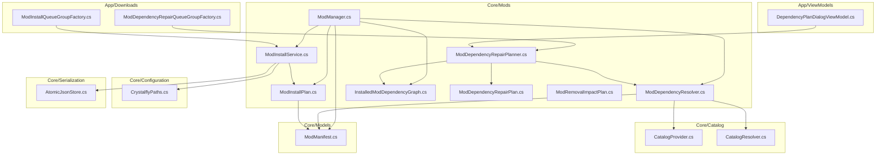
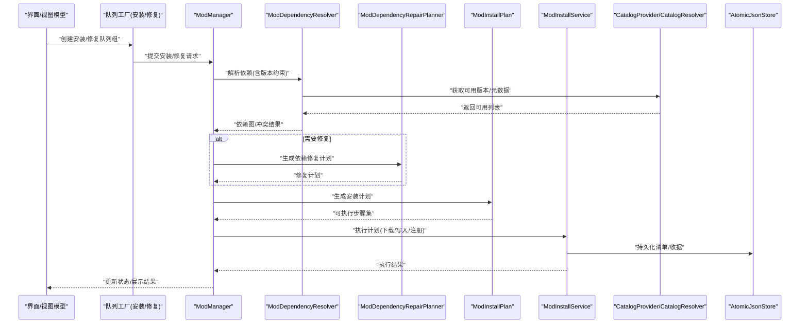
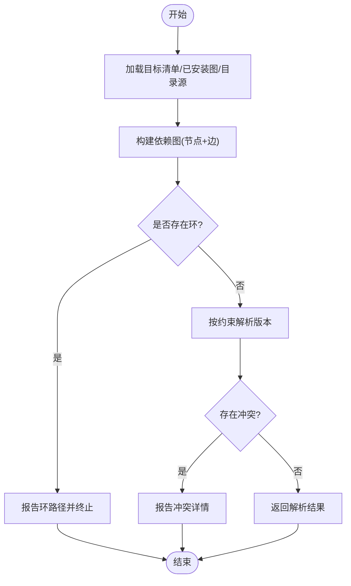
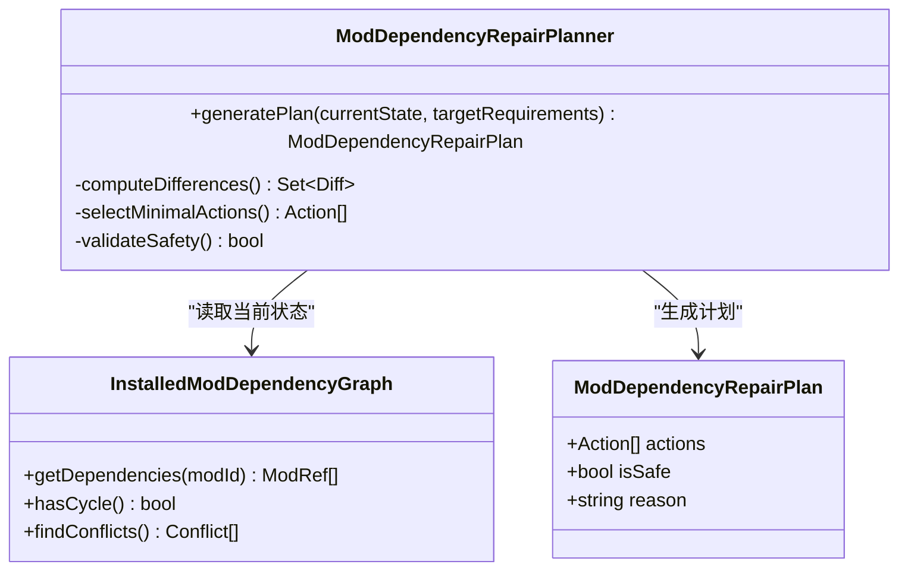
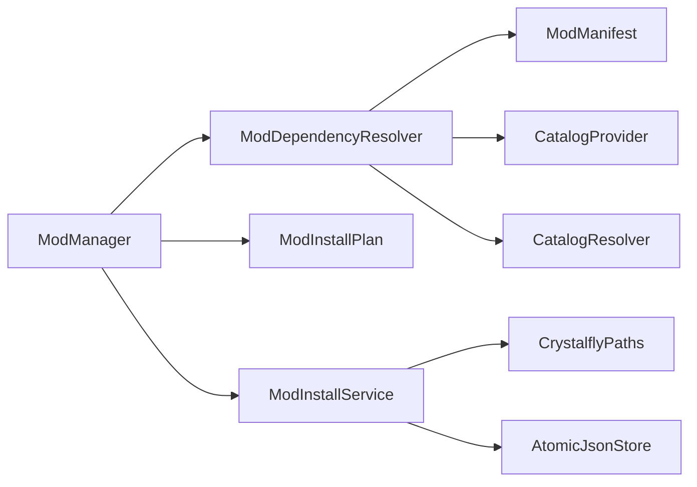

# 模组生态系统

<cite>
**本文引用的文件**   
- [ModManager.cs](file://src/Crystalfly.Core/Mods/ModManager.cs)
- [ModDependencyResolver.cs](file://src/Crystalfly.Core/Mods/ModDependencyResolver.cs)
- [ModInstallPlan.cs](file://src/Crystalfly.Core/Mods/ModInstallPlan.cs)
- [ModDependencyRepairPlanner.cs](file://src/Crystalfly.Core/Mods/ModDependencyRepairPlanner.cs)
- [InstalledModDependencyGraph.cs](file://src/Crystalfly.Core/Mods/InstalledModDependencyGraph.cs)
- [ModManifest.cs](file://src/Crystalfly.Core/Models/ModManifest.cs)
- [ModInstallService.cs](file://src/Crystalfly.Core/Mods/ModInstallService.cs)
- [ModDependencyRepairPlan.cs](file://src/Crystalfly.Core/Mods/ModDependencyRepairPlan.cs)
- [ModRemovalImpactPlan.cs](file://src/Crystalfly.Core/Mods/ModRemovalImpactPlan.cs)
- [CatalogProvider.cs](file://src/Crystalfly.Core/Catalog/CatalogProvider.cs)
- [CatalogResolver.cs](file://src/Crystalfly.Core/Catalog/CatalogResolver.cs)
- [CrystalflyPaths.cs](file://src/Crystalfly.Core/Configuration/CrystalflyPaths.cs)
- [AtomicJsonStore.cs](file://src/Crystalfly.Core/Serialization/AtomicJsonStore.cs)
- [ModInstallQueueGroupFactory.cs](file://src/Crystalfly.App/Downloads/ModInstallQueueGroupFactory.cs)
- [ModDependencyRepairQueueGroupFactory.cs](file://src/Crystalfly.App/Downloads/ModDependencyRepairQueueGroupFactory.cs)
- [DependencyPlanDialogViewModel.cs](file://src/Crystalfly.App/ViewModels/Dialogs/DependencyPlanDialogViewModel.cs)
- [InstalledModDependencyGraphTests.cs](file://tests/Crystalfly.Core.Tests/Mods/InstalledModDependencyGraphTests.cs)
- [ModDependencyResolverTests.cs](file://tests/Crystalfly.Core.Tests/Mods/ModDependencyResolverTests.cs)
- [ModDependencyRepairPlannerTests.cs](file://tests/Crystalfly.Core.Tests/Mods/ModDependencyRepairPlannerTests.cs)
- [ModInstallServiceTests.cs](file://tests/Crystalfly.Core.Tests/Mods/ModInstallServiceTests.cs)
- [ModManagerTests.cs](file://tests/Crystalfly.Core.Tests/Mods/ModManagerTests.cs)
</cite>

## 目录
1. [简介](#简介)
2. [项目结构](#项目结构)
3. [核心组件](#核心组件)
4. [架构总览](#架构总览)
5. [详细组件分析](#详细组件分析)
6. [依赖关系分析](#依赖关系分析)
7. [性能考虑](#性能考虑)
8. [故障排查指南](#故障排查指南)
9. [结论](#结论)
10. [附录](#附录)

## 简介
本技术文档聚焦于模组生态系统的子系统，围绕模组管理的核心架构与关键算法进行深入解析。重点包括：
- ModManager 作为主要协调器的职责边界与协作模式
- 依赖解析引擎（ModDependencyResolver）的图构建、循环依赖检测与版本兼容性检查
- 安装计划生成（ModInstallPlan）与依赖修复规划器（ModDependencyRepairPlanner）的工作流程
- 已安装模组的依赖关系图（InstalledModDependencyGraph）的数据结构与查询方法
- ModManifest 数据模型的设计规范（元数据、依赖声明、版本约束等）
- 常见操作示例路径（安装、卸载、依赖修复），以“代码片段路径”形式给出，避免直接粘贴源码

## 项目结构
模组生态相关代码主要分布在 Core 层的 Mods 与 Models 目录，以及 App 层用于队列编排与 UI 交互的 Downloads 和 ViewModels 目录。测试用例位于 tests/Crystalfly.Core.Tests/Mods。

图表来源
- [ModManager.cs](file://src/Crystalfly.Core/Mods/ModManager.cs)
- [ModDependencyResolver.cs](file://src/Crystalfly.Core/Mods/ModDependencyResolver.cs)
- [ModInstallPlan.cs](file://src/Crystalfly.Core/Mods/ModInstallPlan.cs)
- [ModDependencyRepairPlanner.cs](file://src/Crystalfly.Core/Mods/ModDependencyRepairPlanner.cs)
- [InstalledModDependencyGraph.cs](file://src/Crystalfly.Core/Mods/InstalledModDependencyGraph.cs)
- [ModManifest.cs](file://src/Crystalfly.Core/Models/ModManifest.cs)
- [ModInstallService.cs](file://src/Crystalfly.Core/Mods/ModInstallService.cs)
- [CatalogProvider.cs](file://src/Crystalfly.Core/Catalog/CatalogProvider.cs)
- [CatalogResolver.cs](file://src/Crystalfly.Core/Catalog/CatalogResolver.cs)
- [CrystalflyPaths.cs](file://src/Crystalfly.Core/Configuration/CrystalflyPaths.cs)
- [AtomicJsonStore.cs](file://src/Crystalfly.Core/Serialization/AtomicJsonStore.cs)
- [ModInstallQueueGroupFactory.cs](file://src/Crystalfly.App/Downloads/ModInstallQueueGroupFactory.cs)
- [ModDependencyRepairQueueGroupFactory.cs](file://src/Crystalfly.App/Downloads/ModDependencyRepairQueueGroupFactory.cs)
- [DependencyPlanDialogViewModel.cs](file://src/Crystalfly.App/ViewModels/Dialogs/DependencyPlanDialogViewModel.cs)

章节来源
- [ModManager.cs](file://src/Crystalfly.Core/Mods/ModManager.cs)
- [ModDependencyResolver.cs](file://src/Crystalfly.Core/Mods/ModDependencyResolver.cs)
- [ModInstallPlan.cs](file://src/Crystalfly.Core/Mods/ModInstallPlan.cs)
- [ModDependencyRepairPlanner.cs](file://src/Crystalfly.Core/Mods/ModDependencyRepairPlanner.cs)
- [InstalledModDependencyGraph.cs](file://src/Crystalfly.Core/Mods/InstalledModDependencyGraph.cs)
- [ModManifest.cs](file://src/Crystalfly.Core/Models/ModManifest.cs)
- [ModInstallService.cs](file://src/Crystalfly.Core/Mods/ModInstallService.cs)
- [CatalogProvider.cs](file://src/Crystalfly.Core/Catalog/CatalogProvider.cs)
- [CatalogResolver.cs](file://src/Crystalfly.Core/Catalog/CatalogResolver.cs)
- [CrystalflyPaths.cs](file://src/Crystalfly.Core/Configuration/CrystalflyPaths.cs)
- [AtomicJsonStore.cs](file://src/Crystalfly.Core/Serialization/AtomicJsonStore.cs)
- [ModInstallQueueGroupFactory.cs](file://src/Crystalfly.App/Downloads/ModInstallQueueGroupFactory.cs)
- [ModDependencyRepairQueueGroupFactory.cs](file://src/Crystalfly.App/Downloads/ModDependencyRepairQueueGroupFactory.cs)
- [DependencyPlanDialogViewModel.cs](file://src/Crystalfly.App/ViewModels/Dialogs/DependencyPlanDialogViewModel.cs)

## 核心组件
- ModManager：模组生命周期与操作的统一入口，负责协调依赖解析、安装计划生成、安装执行、卸载影响评估与依赖修复规划。
- ModDependencyResolver：依赖解析引擎，负责从清单与目录中构建依赖图、检测循环依赖、进行版本兼容性与冲突判定。
- ModInstallPlan：描述一次安装操作的原子化步骤集合，包含下载、解压、写入、注册等阶段。
- ModDependencyRepairPlanner：基于当前已安装状态与目标需求，生成最小化的依赖修复计划。
- InstalledModDependencyGraph：对已安装模组的依赖关系建模，提供查询接口（如前驱/后继、连通性、环检测）。
- ModManifest：模组清单数据模型，定义模组标识、版本、作者、描述、依赖声明、版本约束等字段。
- ModInstallService：封装实际的文件系统操作、事务与持久化，驱动安装计划的执行。
- CatalogProvider/CatalogResolver：提供模组目录源与解析能力，为依赖解析提供外部可用版本信息。
- CrystalflyPaths/AtomicJsonStore：路径常量与原子化 JSON 存储，保障配置与清单读写的一致性。

章节来源
- [ModManager.cs](file://src/Crystalfly.Core/Mods/ModManager.cs)
- [ModDependencyResolver.cs](file://src/Crystalfly.Core/Mods/ModDependencyResolver.cs)
- [ModInstallPlan.cs](file://src/Crystalfly.Core/Mods/ModInstallPlan.cs)
- [ModDependencyRepairPlanner.cs](file://src/Crystalfly.Core/Mods/ModDependencyRepairPlanner.cs)
- [InstalledModDependencyGraph.cs](file://src/Crystalfly.Core/Mods/InstalledModDependencyGraph.cs)
- [ModManifest.cs](file://src/Crystalfly.Core/Models/ModManifest.cs)
- [ModInstallService.cs](file://src/Crystalfly.Core/Mods/ModInstallService.cs)
- [CatalogProvider.cs](file://src/Crystalfly.Core/Catalog/CatalogProvider.cs)
- [CatalogResolver.cs](file://src/Crystalfly.Core/Catalog/CatalogResolver.cs)
- [CrystalflyPaths.cs](file://src/Crystalfly.Core/Configuration/CrystalflyPaths.cs)
- [AtomicJsonStore.cs](file://src/Crystalfly.Core/Serialization/AtomicJsonStore.cs)

## 架构总览
下图展示了模组生态子系统的整体架构与关键交互。ModManager 作为协调器，组合依赖解析、计划生成与服务执行；UI 通过工厂类将任务加入队列；Catalog 提供外部可用版本信息；持久化由 AtomicJsonStore 完成。

图表来源
- [ModManager.cs](file://src/Crystalfly.Core/Mods/ModManager.cs)
- [ModDependencyResolver.cs](file://src/Crystalfly.Core/Mods/ModDependencyResolver.cs)
- [ModDependencyRepairPlanner.cs](file://src/Crystalfly.Core/Mods/ModDependencyRepairPlanner.cs)
- [ModInstallPlan.cs](file://src/Crystalfly.Core/Mods/ModInstallPlan.cs)
- [ModInstallService.cs](file://src/Crystalfly.Core/Mods/ModInstallService.cs)
- [CatalogProvider.cs](file://src/Crystalfly.Core/Catalog/CatalogProvider.cs)
- [CatalogResolver.cs](file://src/Crystalfly.Core/Catalog/CatalogResolver.cs)
- [AtomicJsonStore.cs](file://src/Crystalfly.Core/Serialization/AtomicJsonStore.cs)
- [ModInstallQueueGroupFactory.cs](file://src/Crystalfly.App/Downloads/ModInstallQueueGroupFactory.cs)
- [ModDependencyRepairQueueGroupFactory.cs](file://src/Crystalfly.App/Downloads/ModDependencyRepairQueueGroupFactory.cs)

## 详细组件分析

### ModManager 协调器
- 职责边界
  - 对外暴露统一的模组管理 API（安装、卸载、修复、查询）
  - 协调依赖解析、计划生成与执行服务
  - 处理错误与重试策略，向上层返回结构化结果
- 设计模式
  - 门面模式：聚合复杂子系统（解析、计划、服务）
  - 命令模式：将安装/修复操作抽象为可执行的计划对象
- 关键协作
  - 依赖解析：委托 ModDependencyResolver
  - 计划生成：使用 ModInstallPlan 与 ModDependencyRepairPlanner
  - 执行与持久化：委托 ModInstallService 与 AtomicJsonStore

章节来源
- [ModManager.cs](file://src/Crystalfly.Core/Mods/ModManager.cs)

### 依赖解析引擎（ModDependencyResolver）
- 依赖图构建
  - 输入：目标模组清单、已安装模组图、目录清单与外部目录源
  - 输出：有向依赖图（节点=模组实例，边=依赖关系）
- 循环依赖检测
  - 采用深度优先搜索或拓扑排序检测环
  - 若发现环，返回具体环路径以便上层提示
- 版本兼容性检查
  - 依据 ModManifest 的版本约束（范围、精确匹配、比较符）
  - 结合 Catalog 提供的可用版本集合，选择满足约束的最佳版本
  - 冲突判定：同一依赖存在多个不可合并的版本时标记冲突
- 复杂度与优化
  - 图构建 O(V+E)，环检测 O(V+E)
  - 缓存目录解析结果与版本筛选中间态，减少重复计算

图表来源
- [ModDependencyResolver.cs](file://src/Crystalfly.Core/Mods/ModDependencyResolver.cs)
- [ModManifest.cs](file://src/Crystalfly.Core/Models/ModManifest.cs)
- [CatalogProvider.cs](file://src/Crystalfly.Core/Catalog/CatalogProvider.cs)
- [CatalogResolver.cs](file://src/Crystalfly.Core/Catalog/CatalogResolver.cs)

章节来源
- [ModDependencyResolver.cs](file://src/Crystalfly.Core/Mods/ModDependencyResolver.cs)
- [ModManifest.cs](file://src/Crystalfly.Core/Models/ModManifest.cs)
- [CatalogProvider.cs](file://src/Crystalfly.Core/Catalog/CatalogProvider.cs)
- [CatalogResolver.cs](file://src/Crystalfly.Core/Catalog/CatalogResolver.cs)

### 安装计划生成（ModInstallPlan）
- 计划组成
  - 步骤类型：下载、校验、解压、写入、注册、回滚点创建
  - 顺序约束：基于依赖拓扑序，确保先安装被依赖项
  - 幂等性：支持重复执行不产生副作用
- 生成流程
  - 输入：解析后的依赖图与目标版本映射
  - 输出：有序步骤序列，附带前置条件与后置清理动作
- 失败恢复
  - 每个步骤记录事务上下文，失败时可回滚到最近一致状态

章节来源
- [ModInstallPlan.cs](file://src/Crystalfly.Core/Mods/ModInstallPlan.cs)
- [ModInstallService.cs](file://src/Crystalfly.Core/Mods/ModInstallService.cs)

### 依赖修复规划器（ModDependencyRepairPlanner）
- 目标
  - 在最小变更原则下，使当前已安装状态满足目标依赖约束
- 输入
  - 当前已安装图、目标需求（新增/升级/降级）、冲突与缺失信息
- 输出
  - ModDependencyRepairPlan：一组修复动作（安装、升级、降级、移除）及顺序
- 算法要点
  - 差异计算：对比当前与目标图的差异集
  - 最小覆盖：选择最少动作达成一致性
  - 安全约束：避免破坏其他稳定依赖

图表来源
- [ModDependencyRepairPlanner.cs](file://src/Crystalfly.Core/Mods/ModDependencyRepairPlanner.cs)
- [ModDependencyRepairPlan.cs](file://src/Crystalfly.Core/Mods/ModDependencyRepairPlan.cs)
- [InstalledModDependencyGraph.cs](file://src/Crystalfly.Core/Mods/InstalledModDependencyGraph.cs)

章节来源
- [ModDependencyRepairPlanner.cs](file://src/Crystalfly.Core/Mods/ModDependencyRepairPlanner.cs)
- [ModDependencyRepairPlan.cs](file://src/Crystalfly.Core/Mods/ModDependencyRepairPlan.cs)
- [InstalledModDependencyGraph.cs](file://src/Crystalfly.Core/Mods/InstalledModDependencyGraph.cs)

### 已安装模组依赖图（InstalledModDependencyGraph）
- 数据结构
  - 节点：已安装模组实例（ID、版本、路径）
  - 边：依赖关系（方向：A 依赖 B）
  - 索引：按 ID 快速查找、按版本过滤
- 查询方法
  - 获取前驱/后继、连通分量、环检测、冲突定位
  - 增量更新：新增/卸载后局部重算
- 复杂度
  - 查询 O(V+E)，环检测 O(V+E)，增量更新视变更规模而定

章节来源
- [InstalledModDependencyGraph.cs](file://src/Crystalfly.Core/Mods/InstalledModDependencyGraph.cs)

### 模组清单数据模型（ModManifest）
- 字段规范（概念性说明）
  - 标识与版本：唯一 ID、语义化版本、发布渠道
  - 元数据：名称、描述、作者、许可证、图标、语言包
  - 依赖声明：依赖列表、版本约束（范围/比较符/精确匹配）
  - 平台与运行时：目标游戏版本、加载器要求、权限
  - 扩展点：插件入口、资源路径、配置文件模板
- 用途
  - 依赖解析、版本选择、安装校验、卸载影响评估

章节来源
- [ModManifest.cs](file://src/Crystalfly.Core/Models/ModManifest.cs)

### 安装服务（ModInstallService）
- 职责
  - 执行安装计划：下载、校验、解压、写入、注册
  - 事务与回滚：保证文件系统一致性
  - 持久化：更新清单、收据、日志
- 集成点
  - 路径管理：CrystalflyPaths
  - 存储：AtomicJsonStore
  - 目录扫描：配合 Catalog 源获取可用包

章节来源
- [ModInstallService.cs](file://src/Crystalfly.Core/Mods/ModInstallService.cs)
- [CrystalflyPaths.cs](file://src/Crystalfly.Core/Configuration/CrystalflyPaths.cs)
- [AtomicJsonStore.cs](file://src/Crystalfly.Core/Serialization/AtomicJsonStore.cs)

### 卸载影响评估（ModRemovalImpactPlan）
- 目标
  - 评估卸载某模组对其他模组的影响（是否破坏依赖）
- 输出
  - 受影响模组列表、潜在风险等级、建议操作（保留/升级/替换）

章节来源
- [ModRemovalImpactPlan.cs](file://src/Crystalfly.Core/Mods/ModRemovalImpactPlan.cs)

### UI 与队列集成
- 安装队列工厂：根据用户需求创建安装任务组，交由后台队列执行
- 修复队列工厂：针对依赖问题批量生成修复任务
- 依赖计划对话框：展示修复计划与用户确认

章节来源
- [ModInstallQueueGroupFactory.cs](file://src/Crystalfly.App/Downloads/ModInstallQueueGroupFactory.cs)
- [ModDependencyRepairQueueGroupFactory.cs](file://src/Crystalfly.App/Downloads/ModDependencyRepairQueueGroupFactory.cs)
- [DependencyPlanDialogViewModel.cs](file://src/Crystalfly.App/ViewModels/Dialogs/DependencyPlanDialogViewModel.cs)

## 依赖关系分析
- 耦合与内聚
  - ModManager 高内聚地聚合解析、计划与服务，降低调用方复杂度
  - 依赖解析与目录源解耦，便于扩展自定义目录提供者
- 外部依赖
  - CatalogProvider/CatalogResolver 提供外部可用版本与元数据
  - AtomicJsonStore 提供可靠持久化
- 潜在循环依赖
  - 模块间通过接口与 DTO 通信，避免直接循环引用
  - 建议在新增功能时审查导入关系，防止引入环

图表来源
- [ModManager.cs](file://src/Crystalfly.Core/Mods/ModManager.cs)
- [ModDependencyResolver.cs](file://src/Crystalfly.Core/Mods/ModDependencyResolver.cs)
- [ModInstallPlan.cs](file://src/Crystalfly.Core/Mods/ModInstallPlan.cs)
- [ModInstallService.cs](file://src/Crystalfly.Core/Mods/ModInstallService.cs)
- [ModManifest.cs](file://src/Crystalfly.Core/Models/ModManifest.cs)
- [CatalogProvider.cs](file://src/Crystalfly.Core/Catalog/CatalogProvider.cs)
- [CatalogResolver.cs](file://src/Crystalfly.Core/Catalog/CatalogResolver.cs)
- [CrystalflyPaths.cs](file://src/Crystalfly.Core/Configuration/CrystalflyPaths.cs)
- [AtomicJsonStore.cs](file://src/Crystalfly.Core/Serialization/AtomicJsonStore.cs)

章节来源
- [ModManager.cs](file://src/Crystalfly.Core/Mods/ModManager.cs)
- [ModDependencyResolver.cs](file://src/Crystalfly.Core/Mods/ModDependencyResolver.cs)
- [ModInstallPlan.cs](file://src/Crystalfly.Core/Mods/ModInstallPlan.cs)
- [ModInstallService.cs](file://src/Crystalfly.Core/Mods/ModInstallService.cs)
- [ModManifest.cs](file://src/Crystalfly.Core/Models/ModManifest.cs)
- [CatalogProvider.cs](file://src/Crystalfly.Core/Catalog/CatalogProvider.cs)
- [CatalogResolver.cs](file://src/Crystalfly.Core/Catalog/CatalogResolver.cs)
- [CrystalflyPaths.cs](file://src/Crystalfly.Core/Configuration/CrystalflyPaths.cs)
- [AtomicJsonStore.cs](file://src/Crystalfly.Core/Serialization/AtomicJsonStore.cs)

## 性能考虑
- 依赖解析
  - 缓存目录解析结果与版本筛选中间态，避免重复 IO 与计算
  - 对大规模图进行分块解析与并行遍历（注意线程安全）
- 安装执行
  - 批量写入与校验，减少磁盘随机 I/O
  - 使用事务与快照点，缩短回滚时间
- 内存占用
  - 按需加载大清单与资源，避免一次性载入全部目录
- 并发控制
  - 队列工厂限制并发度，避免争用文件系统与网络资源

[本节为通用指导，无需特定文件来源]

## 故障排查指南
- 常见问题
  - 循环依赖：查看依赖解析报告的环路径，调整依赖声明或版本约束
  - 版本冲突：检查 ModManifest 的版本约束与 Catalog 可用版本，必要时放宽或收紧约束
  - 安装失败：查看安装服务的日志与事务回滚点，定位失败步骤
  - 依赖修复无效：核对修复计划的安全性与最小覆盖原则，必要时手动干预
- 调试建议
  - 启用详细日志，记录解析与执行的关键决策点
  - 使用单元测试复现问题场景，逐步缩小范围

章节来源
- [ModDependencyResolverTests.cs](file://tests/Crystalfly.Core.Tests/Mods/ModDependencyResolverTests.cs)
- [InstalledModDependencyGraphTests.cs](file://tests/Crystalfly.Core.Tests/Mods/InstalledModDependencyGraphTests.cs)
- [ModDependencyRepairPlannerTests.cs](file://tests/Crystalfly.Core.Tests/Mods/ModDependencyRepairPlannerTests.cs)
- [ModInstallServiceTests.cs](file://tests/Crystalfly.Core.Tests/Mods/ModInstallServiceTests.cs)
- [ModManagerTests.cs](file://tests/Crystalfly.Core.Tests/Mods/ModManagerTests.cs)

## 结论
模组生态子系统通过清晰的职责划分与模块化设计，实现了稳定的模组管理与依赖治理。ModManager 作为协调器整合了解析、计划与执行链路；依赖解析引擎提供了可靠的图构建与冲突检测；安装计划与修复规划器确保了操作的可预测性与安全性；已安装依赖图与清单模型为上层应用提供了丰富的查询与展示能力。配合队列工厂与 UI 交互，整体方案具备良好的可扩展性与用户体验。

[本节为总结性内容，无需特定文件来源]

## 附录

### 常见操作示例（以“代码片段路径”形式）
- 安装模组
  - 入口：[ModManager.cs](file://src/Crystalfly.Core/Mods/ModManager.cs)
  - 依赖解析：[ModDependencyResolver.cs](file://src/Crystalfly.Core/Mods/ModDependencyResolver.cs)
  - 计划生成：[ModInstallPlan.cs](file://src/Crystalfly.Core/Mods/ModInstallPlan.cs)
  - 执行服务：[ModInstallService.cs](file://src/Crystalfly.Core/Mods/ModInstallService.cs)
  - 队列工厂：[ModInstallQueueGroupFactory.cs](file://src/Crystalfly.App/Downloads/ModInstallQueueGroupFactory.cs)
  - 参考测试：[ModInstallServiceTests.cs](file://tests/Crystalfly.Core.Tests/Mods/ModInstallServiceTests.cs)

- 卸载模组
  - 入口：[ModManager.cs](file://src/Crystalfly.Core/Mods/ModManager.cs)
  - 影响评估：[ModRemovalImpactPlan.cs](file://src/Crystalfly.Core/Mods/ModRemovalImpactPlan.cs)
  - 依赖图查询：[InstalledModDependencyGraph.cs](file://src/Crystalfly.Core/Mods/InstalledModDependencyGraph.cs)
  - 参考测试：[ModManagerTests.cs](file://tests/Crystalfly.Core.Tests/Mods/ModManagerTests.cs)

- 依赖修复
  - 入口：[ModManager.cs](file://src/Crystalfly.Core/Mods/ModManager.cs)
  - 修复规划：[ModDependencyRepairPlanner.cs](file://src/Crystalfly.Core/Mods/ModDependencyRepairPlanner.cs)
  - 修复计划：[ModDependencyRepairPlan.cs](file://src/Crystalfly.Core/Mods/ModDependencyRepairPlan.cs)
  - 依赖图：[InstalledModDependencyGraph.cs](file://src/Crystalfly.Core/Mods/InstalledModDependencyGraph.cs)
  - 参考测试：[ModDependencyRepairPlannerTests.cs](file://tests/Crystalfly.Core.Tests/Mods/ModDependencyRepairPlannerTests.cs)

- 清单模型参考
  - 模型定义：[ModManifest.cs](file://src/Crystalfly.Core/Models/ModManifest.cs)

[本节为导航性内容，无需特定文件来源]