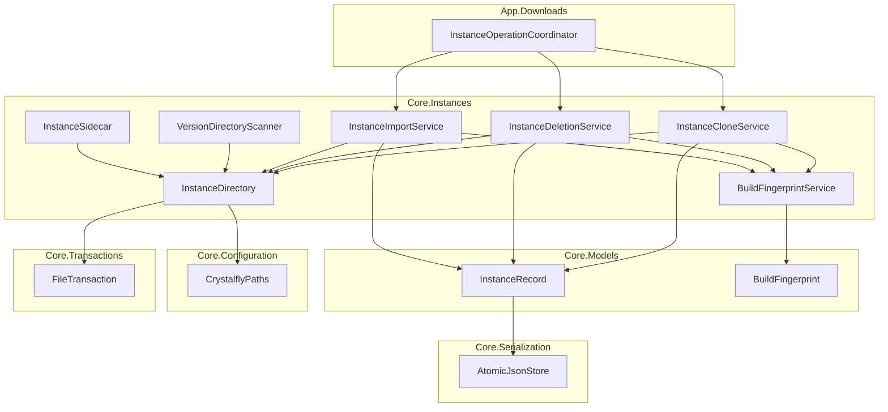
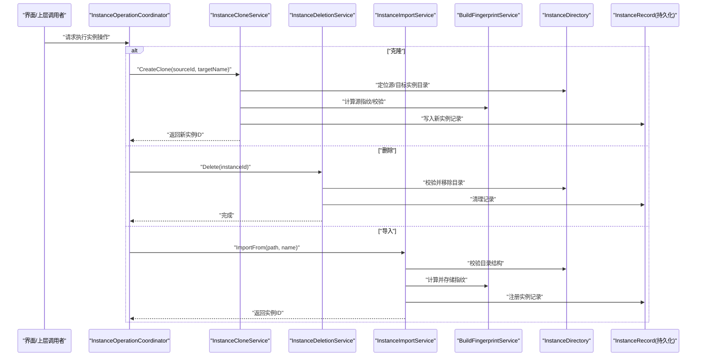
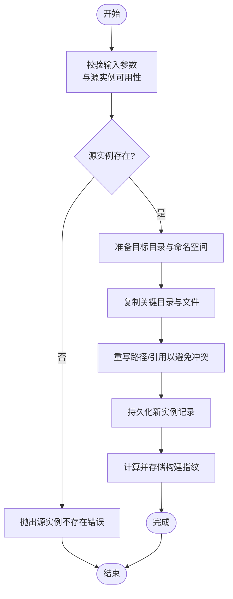
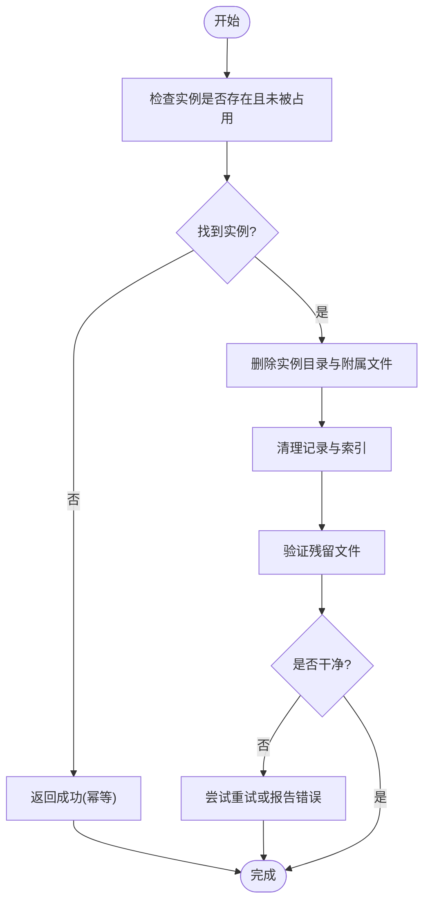
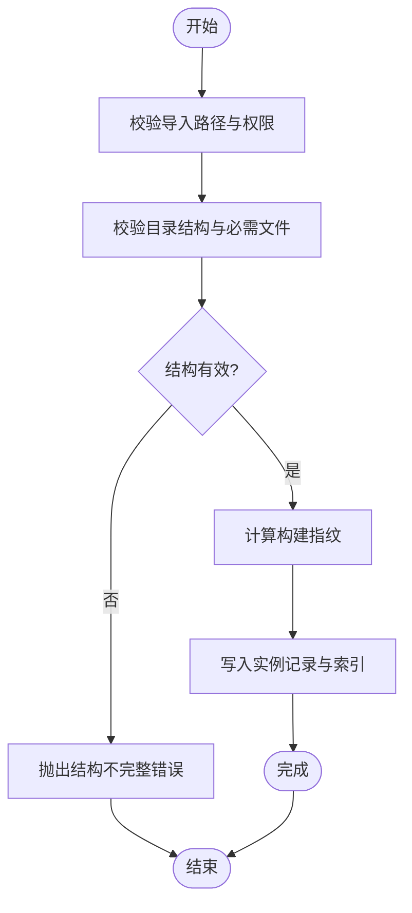
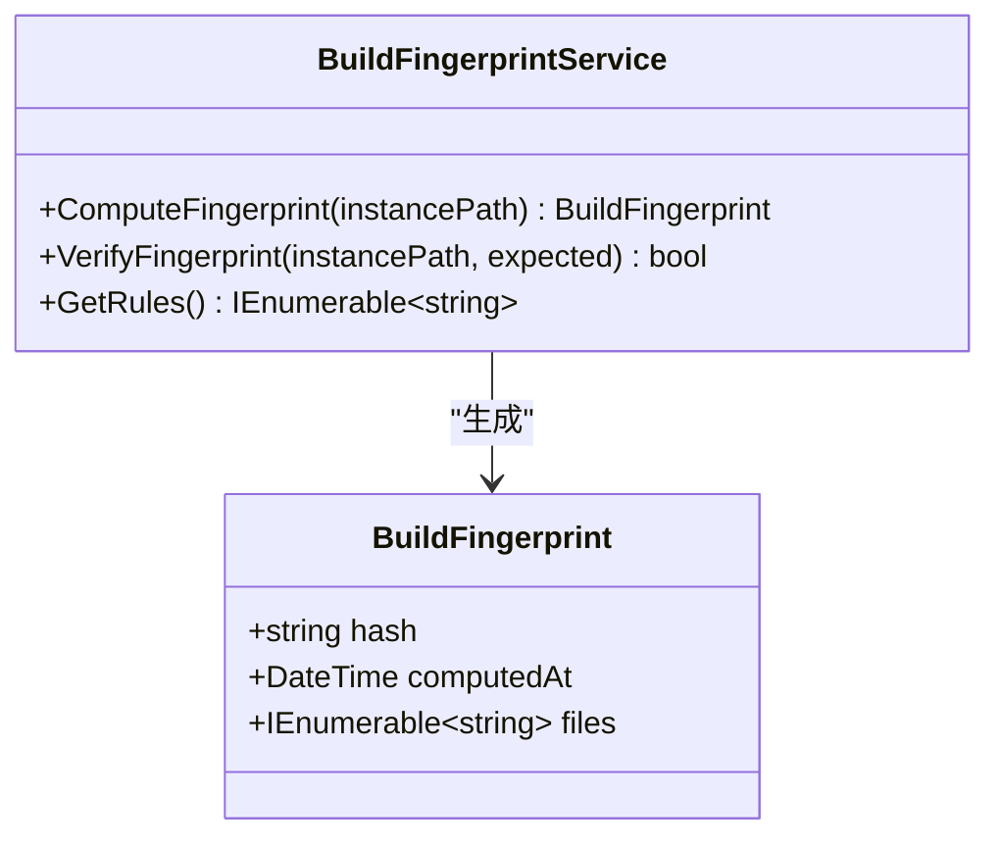
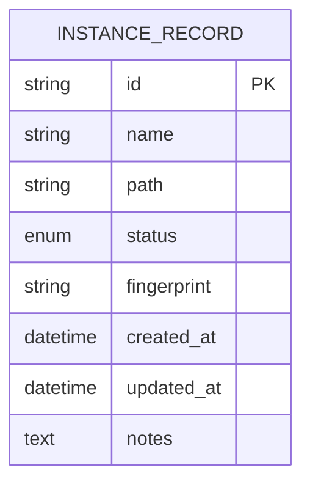
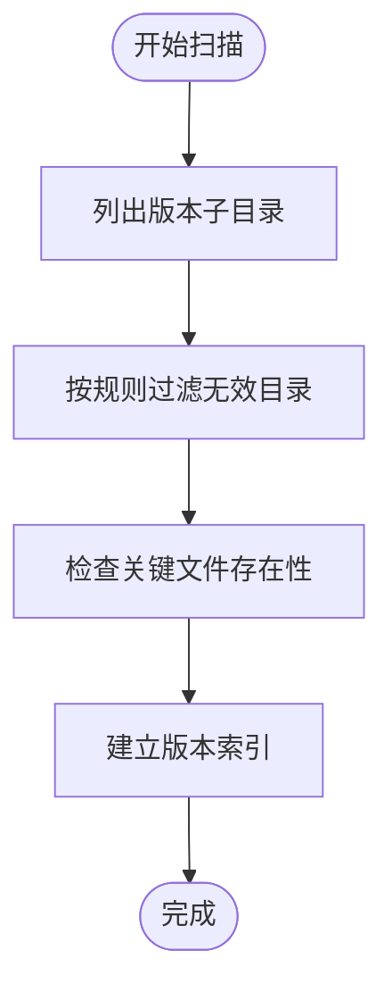
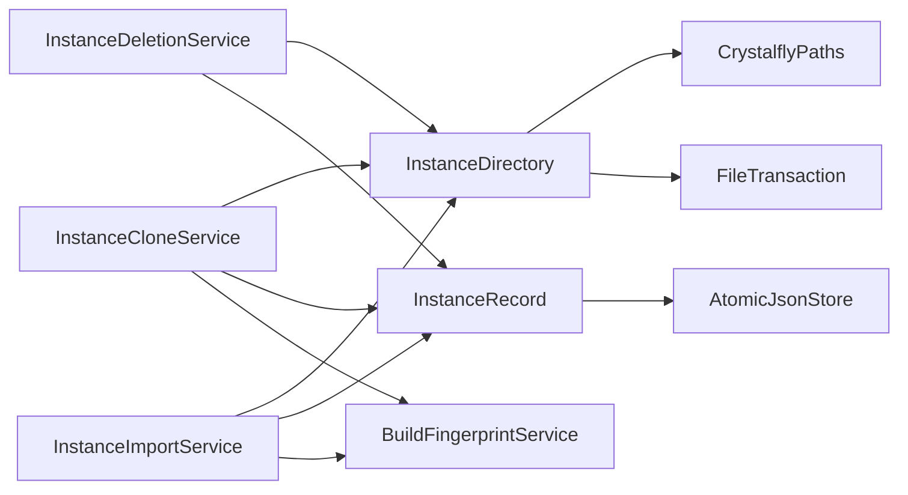

# 游戏实例管理

<cite>
**本文引用的文件**   
- [InstanceCloneService.cs](file://src/Crystalfly.Core/Instances/InstanceCloneService.cs)
- [InstanceDeletionService.cs](file://src/Crystalfly.Core/Instances/InstanceDeletionService.cs)
- [InstanceImportService.cs](file://src/Crystalfly.Core/Instances/InstanceImportService.cs)
- [BuildFingerprintService.cs](file://src/Crystalfly.Core/Instances/BuildFingerprintService.cs)
- [InstanceDirectory.cs](file://src/Crystalfly.Core/Instances/InstanceDirectory.cs)
- [VersionDirectoryScanner.cs](file://src/Crystalfly.Core/Instances/VersionDirectoryScanner.cs)
- [InstanceSidecar.cs](file://src/Crystalfly.Core/Instances/InstanceSidecar.cs)
- [InstanceRecord.cs](file://src/Crystalfly.Core/Models/InstanceRecord.cs)
- [BuildFingerprint.cs](file://src/Crystalfly.Core/Models/BuildFingerprint.cs)
- [CrystalflyPaths.cs](file://src/Crystalfly.Core/Configuration/CrystalflyPaths.cs)
- [AtomicJsonStore.cs](file://src/Crystalfly.Core/Serialization/AtomicJsonStore.cs)
- [FileTransaction.cs](file://src/Crystalfly.Core/Transactions/FileTransaction.cs)
- [InstanceOperationCoordinator.cs](file://src/Crystalfly.App/Downloads/InstanceOperationCoordinator.cs)
- [InstanceCloneServiceTests.cs](file://tests/Crystalfly.Core.Tests/Instances/InstanceCloneServiceTests.cs)
- [InstanceDeletionServiceTests.cs](file://tests/Crystalfly.Core.Tests/Instances/InstanceDeletionServiceTests.cs)
- [InstanceImportServiceTests.cs](file://tests/Crystalfly.Core.Tests/Instances/InstanceImportServiceTests.cs)
- [BuildFingerprintServiceTests.cs](file://tests/Crystalfly.Core.Tests/Instances/BuildFingerprintServiceTests.cs)
- [InstanceDirectoryTests.cs](file://tests/Crystalfly.Core.Tests/Instances/InstanceDirectoryTests.cs)
</cite>

## 目录
1. [简介](#简介)
2. [项目结构](#项目结构)
3. [核心组件](#核心组件)
4. [架构总览](#架构总览)
5. [详细组件分析](#详细组件分析)
6. [依赖关系分析](#依赖关系分析)
7. [性能考虑](#性能考虑)
8. [故障排查指南](#故障排查指南)
9. [结论](#结论)
10. [附录](#附录)

## 简介
本技术文档聚焦于“游戏实例管理子系统”，围绕实例生命周期（创建、克隆、导入、删除）展开，深入解析以下关键服务与模型：
- InstanceCloneService：实例克隆服务
- InstanceDeletionService：实例删除服务
- InstanceImportService：实例导入服务
- BuildFingerprintService：构建指纹服务，保障实例完整性与一致性
- InstanceRecord：实例记录数据模型，承载元数据、路径、状态等
- InstanceDirectory、VersionDirectoryScanner、InstanceSidecar：实例目录与版本扫描、侧车信息辅助
- CrystalflyPaths、AtomicJsonStore、FileTransaction：路径、持久化与事务支持

文档同时提供架构图、类图、时序图与流程图，帮助读者从系统到代码层面全面理解。

## 项目结构
实例管理相关代码主要位于 Core 层的 Instances 与 Models 目录，以及 App 层用于协调操作的入口。测试用例覆盖各服务的行为验证。

图表来源
- [InstanceCloneService.cs](file://src/Crystalfly.Core/Instances/InstanceCloneService.cs)
- [InstanceDeletionService.cs](file://src/Crystalfly.Core/Instances/InstanceDeletionService.cs)
- [InstanceImportService.cs](file://src/Crystalfly.Core/Instances/InstanceImportService.cs)
- [BuildFingerprintService.cs](file://src/Crystalfly.Core/Instances/BuildFingerprintService.cs)
- [InstanceDirectory.cs](file://src/Crystalfly.Core/Instances/InstanceDirectory.cs)
- [VersionDirectoryScanner.cs](file://src/Crystalfly.Core/Instances/VersionDirectoryScanner.cs)
- [InstanceSidecar.cs](file://src/Crystalfly.Core/Instances/InstanceSidecar.cs)
- [InstanceRecord.cs](file://src/Crystalfly.Core/Models/InstanceRecord.cs)
- [BuildFingerprint.cs](file://src/Crystalfly.Core/Models/BuildFingerprint.cs)
- [CrystalflyPaths.cs](file://src/Crystalfly.Core/Configuration/CrystalflyPaths.cs)
- [AtomicJsonStore.cs](file://src/Crystalfly.Core/Serialization/AtomicJsonStore.cs)
- [FileTransaction.cs](file://src/Crystalfly.Core/Transactions/FileTransaction.cs)
- [InstanceOperationCoordinator.cs](file://src/Crystalfly.App/Downloads/InstanceOperationCoordinator.cs)

章节来源
- [InstanceCloneService.cs](file://src/Crystalfly.Core/Instances/InstanceCloneService.cs)
- [InstanceDeletionService.cs](file://src/Crystalfly.Core/Instances/InstanceDeletionService.cs)
- [InstanceImportService.cs](file://src/Crystalfly.Core/Instances/InstanceImportService.cs)
- [BuildFingerprintService.cs](file://src/Crystalfly.Core/Instances/BuildFingerprintService.cs)
- [InstanceDirectory.cs](file://src/Crystalfly.Core/Instances/InstanceDirectory.cs)
- [VersionDirectoryScanner.cs](file://src/Crystalfly.Core/Instances/VersionDirectoryScanner.cs)
- [InstanceSidecar.cs](file://src/Crystalfly.Core/Instances/InstanceSidecar.cs)
- [InstanceRecord.cs](file://src/Crystalfly.Core/Models/InstanceRecord.cs)
- [BuildFingerprint.cs](file://src/Crystalfly.Core/Models/BuildFingerprint.cs)
- [CrystalflyPaths.cs](file://src/Crystalfly.Core/Configuration/CrystalflyPaths.cs)
- [AtomicJsonStore.cs](file://src/Crystalfly.Core/Serialization/AtomicJsonStore.cs)
- [FileTransaction.cs](file://src/Crystalfly.Core/Transactions/FileTransaction.cs)
- [InstanceOperationCoordinator.cs](file://src/Crystalfly.App/Downloads/InstanceOperationCoordinator.cs)

## 核心组件
本节概述实例管理的核心职责与交互方式：
- 实例克隆：基于源实例生成新实例，复制必要目录与元数据，更新引用并重建指纹
- 实例删除：安全移除实例目录与关联记录，必要时清理残留与索引
- 实例导入：将外部已有实例目录纳入管理，校验完整性并注册为受管实例
- 构建指纹：对实例关键文件集合计算摘要，确保运行期一致性与可追溯性
- 实例记录：持久化实例的元数据、路径、状态、指纹等信息
- 目录与扫描：统一实例根目录规范，扫描版本子目录以发现可用构建
- 事务与原子写入：保证元数据与文件系统变更的一致性

章节来源
- [InstanceCloneService.cs](file://src/Crystalfly.Core/Instances/InstanceCloneService.cs)
- [InstanceDeletionService.cs](file://src/Crystalfly.Core/Instances/InstanceDeletionService.cs)
- [InstanceImportService.cs](file://src/Crystalfly.Core/Instances/InstanceImportService.cs)
- [BuildFingerprintService.cs](file://src/Crystalfly.Core/Instances/BuildFingerprintService.cs)
- [InstanceRecord.cs](file://src/Crystalfly.Core/Models/InstanceRecord.cs)
- [InstanceDirectory.cs](file://src/Crystalfly.Core/Instances/InstanceDirectory.cs)
- [VersionDirectoryScanner.cs](file://src/Crystalfly.Core/Instances/VersionDirectoryScanner.cs)
- [AtomicJsonStore.cs](file://src/Crystalfly.Core/Serialization/AtomicJsonStore.cs)
- [FileTransaction.cs](file://src/Crystalfly.Core/Transactions/FileTransaction.cs)

## 架构总览
下图展示了实例操作在应用层与核心层之间的协作关系，以及关键服务间的依赖。

图表来源
- [InstanceOperationCoordinator.cs](file://src/Crystalfly.App/Downloads/InstanceOperationCoordinator.cs)
- [InstanceCloneService.cs](file://src/Crystalfly.Core/Instances/InstanceCloneService.cs)
- [InstanceDeletionService.cs](file://src/Crystalfly.Core/Instances/InstanceDeletionService.cs)
- [InstanceImportService.cs](file://src/Crystalfly.Core/Instances/InstanceImportService.cs)
- [BuildFingerprintService.cs](file://src/Crystalfly.Core/Instances/BuildFingerprintService.cs)
- [InstanceDirectory.cs](file://src/Crystalfly.Core/Instances/InstanceDirectory.cs)
- [InstanceRecord.cs](file://src/Crystalfly.Core/Models/InstanceRecord.cs)

## 详细组件分析

### 实例克隆服务（InstanceCloneService）
- 职责
  - 基于现有实例创建副本，复制关键目录与配置文件
  - 更新目标实例的元数据与引用，避免共享状态冲突
  - 触发指纹重建，确保副本一致性
- 关键流程
  - 参数校验与权限检查
  - 源实例存在性与可读性验证
  - 目标目录准备与隔离策略
  - 文件复制与路径重写（如配置中的绝对路径）
  - 记录写入与索引更新
  - 指纹计算与校验
- 异常处理
  - 源不存在/不可读、目标已存在、权限不足、IO失败等
- 使用示例（概念步骤）
  - 调用克隆接口，传入源实例标识与目标名称
  - 等待异步任务完成，获取新实例标识
  - 可选：对新实例进行启动前预检或快照

图表来源
- [InstanceCloneService.cs](file://src/Crystalfly.Core/Instances/InstanceCloneService.cs)
- [InstanceDirectory.cs](file://src/Crystalfly.Core/Instances/InstanceDirectory.cs)
- [BuildFingerprintService.cs](file://src/Crystalfly.Core/Instances/BuildFingerprintService.cs)
- [InstanceRecord.cs](file://src/Crystalfly.Core/Models/InstanceRecord.cs)

章节来源
- [InstanceCloneService.cs](file://src/Crystalfly.Core/Instances/InstanceCloneService.cs)
- [InstanceCloneServiceTests.cs](file://tests/Crystalfly.Core.Tests/Instances/InstanceCloneServiceTests.cs)

### 实例删除服务（InstanceDeletionService）
- 职责
  - 安全删除实例目录与关联记录
  - 清理可能存在的锁文件、临时文件或缓存
  - 确保幂等性：重复删除不报错
- 关键流程
  - 实例存在性检查与锁定检测
  - 递归删除目录内容
  - 清理持久化记录与索引
  - 回滚与补偿：若中间失败，尽量恢复一致性
- 异常处理
  - 权限不足、文件被占用、部分删除失败等
- 使用示例（概念步骤）
  - 调用删除接口，传入实例标识
  - 确认删除结果，必要时重试或人工介入

图表来源
- [InstanceDeletionService.cs](file://src/Crystalfly.Core/Instances/InstanceDeletionService.cs)
- [InstanceDirectory.cs](file://src/Crystalfly.Core/Instances/InstanceDirectory.cs)
- [InstanceRecord.cs](file://src/Crystalfly.Core/Models/InstanceRecord.cs)

章节来源
- [InstanceDeletionService.cs](file://src/Crystalfly.Core/Instances/InstanceDeletionService.cs)
- [InstanceDeletionServiceTests.cs](file://tests/Crystalfly.Core.Tests/Instances/InstanceDeletionServiceTests.cs)

### 实例导入服务（InstanceImportService）
- 职责
  - 将外部已有实例目录纳入系统管理
  - 校验目录结构与必需文件
  - 计算并存储构建指纹，注册实例记录
- 关键流程
  - 输入路径合法性与可读性检查
  - 目录结构校验（版本目录、关键文件）
  - 指纹计算与完整性评估
  - 持久化记录与索引更新
- 异常处理
  - 路径无效、结构不完整、指纹不一致等
- 使用示例（概念步骤）
  - 指定外部实例路径与显示名称
  - 执行导入，返回新实例标识
  - 可选择立即进行预检或快照

图表来源
- [InstanceImportService.cs](file://src/Crystalfly.Core/Instances/InstanceImportService.cs)
- [InstanceDirectory.cs](file://src/Crystalfly.Core/Instances/InstanceDirectory.cs)
- [BuildFingerprintService.cs](file://src/Crystalfly.Core/Instances/BuildFingerprintService.cs)
- [InstanceRecord.cs](file://src/Crystalfly.Core/Models/InstanceRecord.cs)

章节来源
- [InstanceImportService.cs](file://src/Crystalfly.Core/Instances/InstanceImportService.cs)
- [InstanceImportServiceTests.cs](file://tests/Crystalfly.Core.Tests/Instances/InstanceImportServiceTests.cs)

### 构建指纹服务（BuildFingerprintService）
- 职责
  - 对实例的关键文件集合计算摘要，形成唯一指纹
  - 用于一致性校验、变更检测与审计
- 关键流程
  - 确定参与计算的规则（文件白名单/黑名单、忽略模式）
  - 遍历文件并计算哈希
  - 聚合为最终指纹对象并持久化
- 复杂度与优化
  - 时间复杂度与文件数量线性相关；可通过增量计算与缓存优化
  - 大文件可采用分块哈希或并行计算
- 使用场景
  - 克隆后对比源与副本指纹
  - 导入时验证完整性
  - 运行时预检与差异报告

图表来源
- [BuildFingerprintService.cs](file://src/Crystalfly.Core/Instances/BuildFingerprintService.cs)
- [BuildFingerprint.cs](file://src/Crystalfly.Core/Models/BuildFingerprint.cs)

章节来源
- [BuildFingerprintService.cs](file://src/Crystalfly.Core/Instances/BuildFingerprintService.cs)
- [BuildFingerprintServiceTests.cs](file://tests/Crystalfly.Core.Tests/Instances/BuildFingerprintServiceTests.cs)
- [BuildFingerprint.cs](file://src/Crystalfly.Core/Models/BuildFingerprint.cs)

### 实例记录数据模型（InstanceRecord）
- 字段说明（概念）
  - 标识符：唯一实例ID
  - 名称：用户可见的实例名
  - 路径：实例根目录路径
  - 状态：运行中、停止、损坏、待修复等
  - 指纹：最近一次计算的构建指纹
  - 时间戳：创建、修改、最后运行时间
  - 标签/备注：扩展元数据
- 设计要点
  - 与持久化存储解耦，便于迁移与扩展
  - 与目录结构分离，允许路径重映射
  - 支持并发访问时的原子写入

图表来源
- [InstanceRecord.cs](file://src/Crystalfly.Core/Models/InstanceRecord.cs)

章节来源
- [InstanceRecord.cs](file://src/Crystalfly.Core/Models/InstanceRecord.cs)

### 实例目录与版本扫描（InstanceDirectory、VersionDirectoryScanner）
- 职责
  - 定义实例根目录与版本子目录规范
  - 扫描版本目录，发现可用构建与关键文件
- 关键点
  - 目录命名约定与约束
  - 扫描策略（深度、过滤规则）
  - 与指纹计算规则的协同

图表来源
- [InstanceDirectory.cs](file://src/Crystalfly.Core/Instances/InstanceDirectory.cs)
- [VersionDirectoryScanner.cs](file://src/Crystalfly.Core/Instances/VersionDirectoryScanner.cs)

章节来源
- [InstanceDirectory.cs](file://src/Crystalfly.Core/Instances/InstanceDirectory.cs)
- [VersionDirectoryScanner.cs](file://src/Crystalfly.Core/Instances/VersionDirectoryScanner.cs)
- [InstanceDirectoryTests.cs](file://tests/Crystalfly.Core.Tests/Instances/InstanceDirectoryTests.cs)

### 实例侧车信息（InstanceSidecar）
- 职责
  - 管理与实例相关的附加信息（如会话、日志、配置快照）
  - 与主实例目录解耦，便于独立维护
- 使用建议
  - 通过侧车服务读写，避免直接操作文件
  - 注意并发与原子写入

章节来源
- [InstanceSidecar.cs](file://src/Crystalfly.Core/Instances/InstanceSidecar.cs)

### 路径与持久化（CrystalflyPaths、AtomicJsonStore、FileTransaction）
- CrystalflyPaths
  - 提供统一的配置与数据路径常量
  - 集中管理实例根目录、配置目录、日志目录等
- AtomicJsonStore
  - 提供 JSON 数据的原子写入与读取
  - 防止并发写导致的损坏
- FileTransaction
  - 封装文件级事务，支持回滚与补偿
  - 在多文件操作中保证一致性

章节来源
- [CrystalflyPaths.cs](file://src/Crystalfly.Core/Configuration/CrystalflyPaths.cs)
- [AtomicJsonStore.cs](file://src/Crystalfly.Core/Serialization/AtomicJsonStore.cs)
- [FileTransaction.cs](file://src/Crystalfly.Core/Transactions/FileTransaction.cs)

## 依赖关系分析
- 服务间耦合
  - 克隆、删除、导入均依赖目录与记录服务
  - 指纹服务作为通用能力被多服务复用
- 外部依赖
  - 文件系统操作、JSON 序列化、事务机制
- 潜在循环依赖
  - 当前分层清晰，未见明显循环依赖

图表来源
- [InstanceCloneService.cs](file://src/Crystalfly.Core/Instances/InstanceCloneService.cs)
- [InstanceDeletionService.cs](file://src/Crystalfly.Core/Instances/InstanceDeletionService.cs)
- [InstanceImportService.cs](file://src/Crystalfly.Core/Instances/InstanceImportService.cs)
- [BuildFingerprintService.cs](file://src/Crystalfly.Core/Instances/BuildFingerprintService.cs)
- [InstanceDirectory.cs](file://src/Crystalfly.Core/Instances/InstanceDirectory.cs)
- [InstanceRecord.cs](file://src/Crystalfly.Core/Models/InstanceRecord.cs)
- [CrystalflyPaths.cs](file://src/Crystalfly.Core/Configuration/CrystalflyPaths.cs)
- [AtomicJsonStore.cs](file://src/Crystalfly.Core/Serialization/AtomicJsonStore.cs)
- [FileTransaction.cs](file://src/Crystalfly.Core/Transactions/FileTransaction.cs)

章节来源
- [InstanceCloneService.cs](file://src/Crystalfly.Core/Instances/InstanceCloneService.cs)
- [InstanceDeletionService.cs](file://src/Crystalfly.Core/Instances/InstanceDeletionService.cs)
- [InstanceImportService.cs](file://src/Crystalfly.Core/Instances/InstanceImportService.cs)
- [BuildFingerprintService.cs](file://src/Crystalfly.Core/Instances/BuildFingerprintService.cs)
- [InstanceDirectory.cs](file://src/Crystalfly.Core/Instances/InstanceDirectory.cs)
- [InstanceRecord.cs](file://src/Crystalfly.Core/Models/InstanceRecord.cs)
- [CrystalflyPaths.cs](file://src/Crystalfly.Core/Configuration/CrystalflyPaths.cs)
- [AtomicJsonStore.cs](file://src/Crystalfly.Core/Serialization/AtomicJsonStore.cs)
- [FileTransaction.cs](file://src/Crystalfly.Core/Transactions/FileTransaction.cs)

## 性能考虑
- 指纹计算
  - 大目录扫描与哈希计算耗时较高，建议启用并行与增量策略
  - 缓存指纹结果，减少重复计算
- 文件复制
  - 使用批量 IO 与缓冲策略，避免频繁小文件开销
  - 跳过不必要文件（日志、缓存）以提升速度
- 持久化
  - 原子写入避免竞争条件，但需注意磁盘同步成本
  - 合并多次写入，降低 I/O 次数
- 资源释放
  - 及时关闭句柄，避免文件占用导致删除失败

[本节为通用指导，无需特定文件来源]

## 故障排查指南
- 常见问题
  - 权限不足：检查实例目录与配置目录的读写权限
  - 文件被占用：确保无进程持有文件句柄后再删除或移动
  - 指纹不一致：重新计算指纹，核对关键文件是否被篡改
  - 导入失败：检查目录结构是否符合规范，补齐必需文件
- 诊断手段
  - 查看实例侧车日志与运行会话记录
  - 使用版本扫描器输出目录清单与缺失项
  - 比对源与副本的指纹差异，定位变更文件
- 恢复策略
  - 使用事务回滚恢复未完成的写入
  - 从备份或快照恢复实例目录与记录

章节来源
- [InstanceSidecar.cs](file://src/Crystalfly.Core/Instances/InstanceSidecar.cs)
- [VersionDirectoryScanner.cs](file://src/Crystalfly.Core/Instances/VersionDirectoryScanner.cs)
- [AtomicJsonStore.cs](file://src/Crystalfly.Core/Serialization/AtomicJsonStore.cs)
- [FileTransaction.cs](file://src/Crystalfly.Core/Transactions/FileTransaction.cs)

## 结论
本子系统通过清晰的服务划分与稳健的数据模型，实现了实例的完整生命周期管理。构建指纹服务为一致性提供了强保障，目录与扫描模块确保了规范的落地，事务与原子写入提升了可靠性。建议在大规模部署中结合缓存与并行策略优化性能，并通过完善的日志与诊断工具提升可观测性。

[本节为总结，无需特定文件来源]

## 附录
- 最佳实践
  - 始终通过服务 API 操作实例，避免直接文件系统操作
  - 在批量操作中使用事务包裹，确保一致性
  - 定期校验指纹，及时发现异常变更
  - 为重要实例建立快照，便于快速恢复
- 参考实现位置
  - 服务实现：Instances 目录下的各 Service 文件
  - 数据模型：Models 目录下的 InstanceRecord 与 BuildFingerprint
  - 路径与持久化：Configuration 与 Serialization、Transactions 目录
  - 应用协调：App 层 InstanceOperationCoordinator

[本节为补充信息，无需特定文件来源]