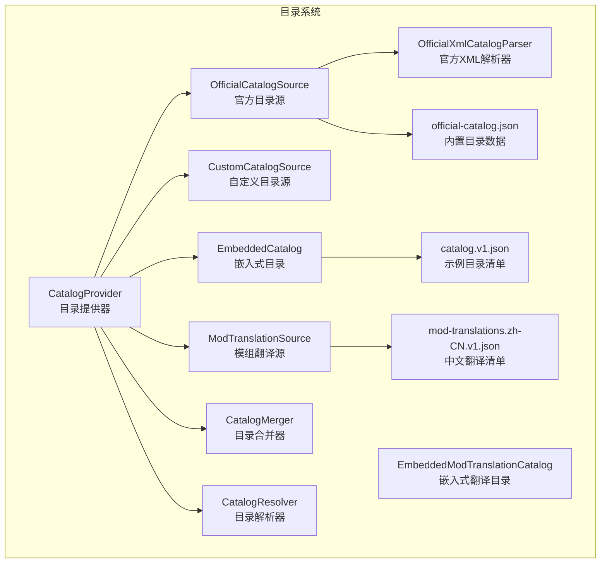
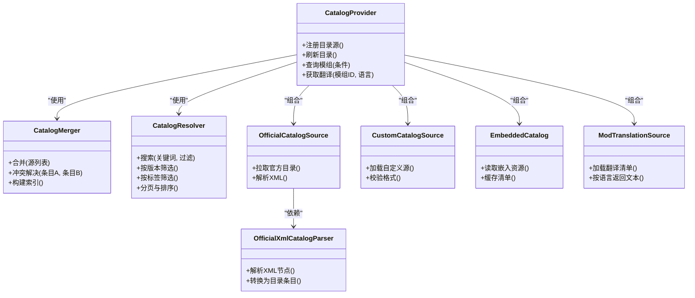
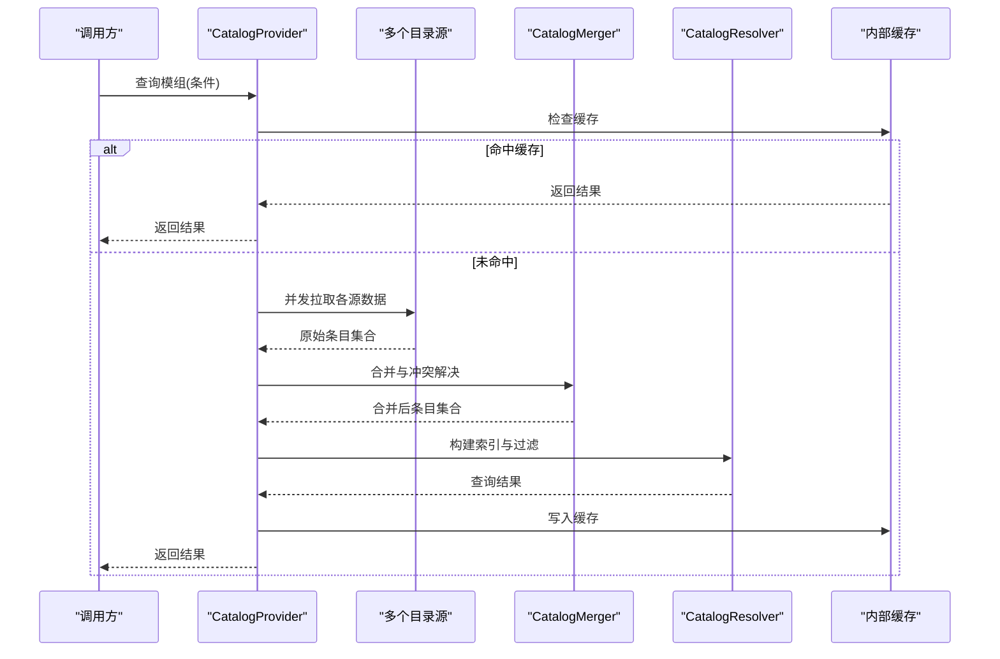
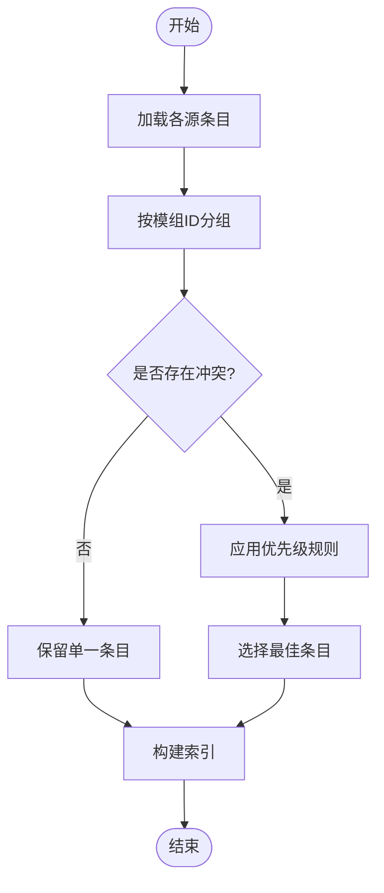
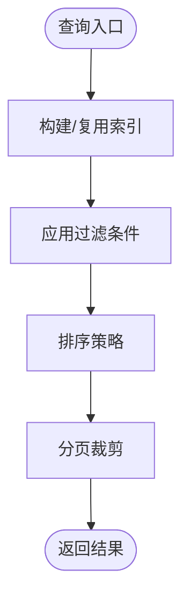
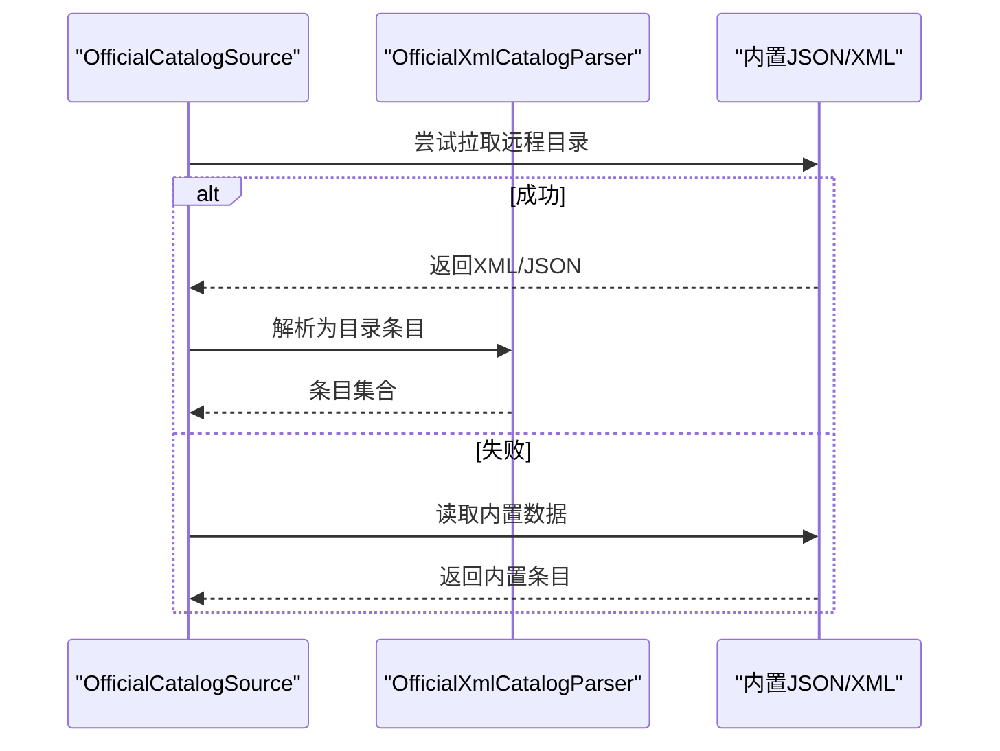
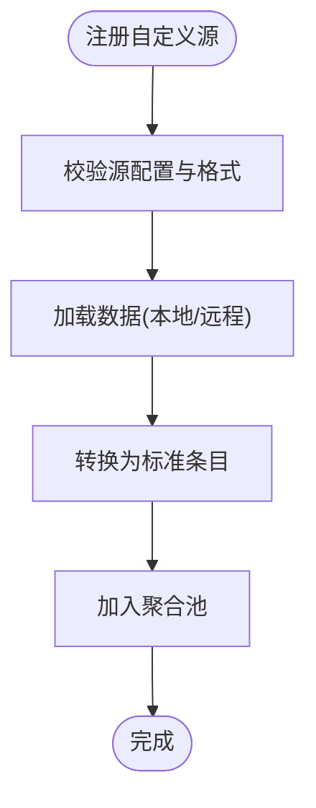
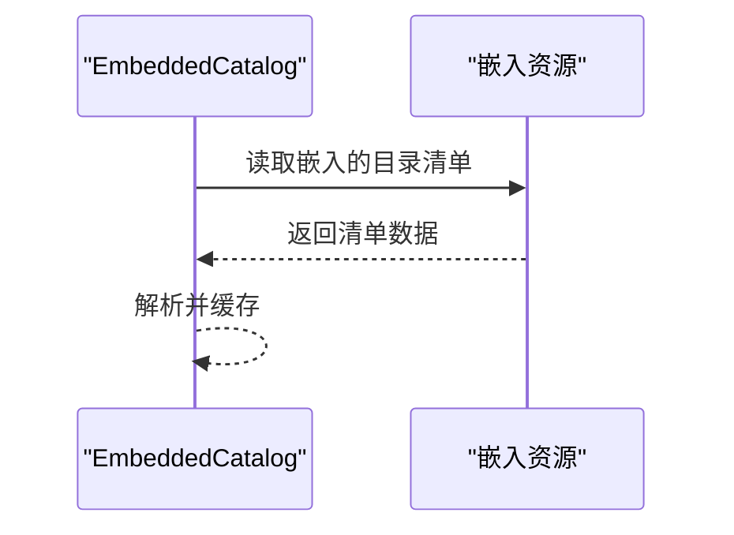
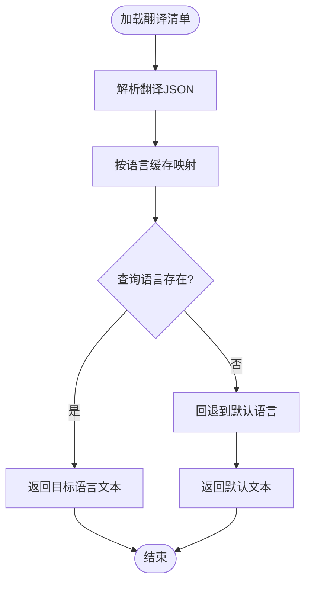
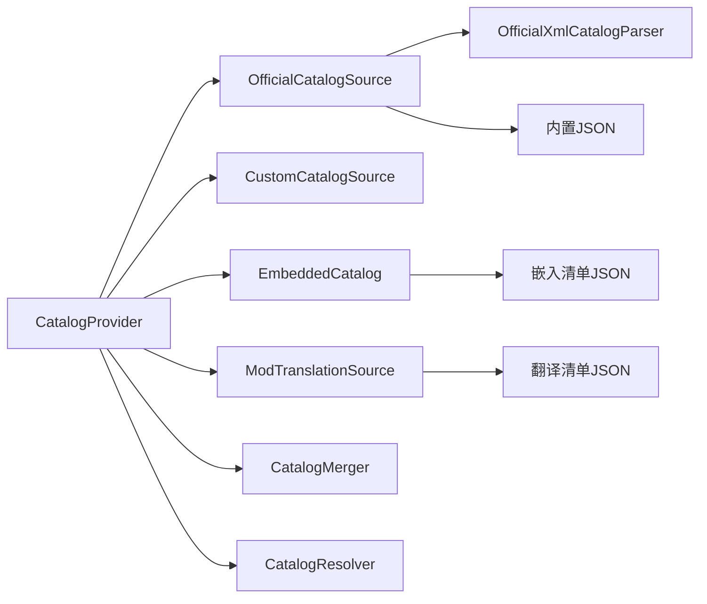

# 目录系统

<cite>
**本文引用的文件**   
- [src/Crystalfly.Core/Catalog/CatalogProvider.cs](file://src/Crystalfly.Core/Catalog/CatalogProvider.cs)
- [src/Crystalfly.Core/Catalog/CatalogMerger.cs](file://src/Crystalfly.Core/Catalog/CatalogMerger.cs)
- [src/Crystalfly.Core/Catalog/CatalogResolver.cs](file://src/Crystalfly.Core/Catalog/CatalogResolver.cs)
- [src/Crystalfly.Core/Catalog/OfficialCatalogSource.cs](file://src/Crystalfly.Core/Catalog/OfficialCatalogSource.cs)
- [src/Crystalfly.Core/Catalog/CustomCatalogSource.cs](file://src/Crystalfly.Core/Catalog/CustomCatalogSource.cs)
- [src/Crystalfly.Core/Catalog/EmbeddedCatalog.cs](file://src/Crystalfly.Core/Catalog/EmbeddedCatalog.cs)
- [src/Crystalfly.Core/Catalog/EmbeddedModTranslationCatalog.cs](file://src/Crystalfly.Core/Catalog/EmbeddedModTranslationCatalog.cs)
- [src/Crystalfly.Core/Catalog/ModTranslationSource.cs](file://src/Crystalfly.Core/Catalog/ModTranslationSource.cs)
- [src/Crystalfly.Core/Catalog/OfficialXmlCatalogParser.cs](file://src/Crystalfly.Core/Catalog/OfficialXmlCatalogParser.cs)
- [src/Crystalfly.Core/Data/official-catalog.json](file://src/Crystalfly.Core/Data/official-catalog.json)
- [catalog/catalog.v1.json](file://catalog/catalog.v1.json)
- [catalog/mod-translations.zh-CN.v1.json](file://catalog/mod-translations.zh-CN.v1.json)
- [tests/Crystalfly.Core.Tests/Catalog/CatalogProviderTests.cs](file://tests/Crystalfly.Core.Tests/Catalog/CatalogProviderTests.cs)
- [tests/Crystalfly.Core.Tests/Catalog/CatalogMergerTests.cs](file://tests/Crystalfly.Core.Tests/Catalog/CatalogMergerTests.cs)
- [tests/Crystalfly.Core.Tests/Catalog/CatalogResolverTests.cs](file://tests/Crystalfly.Core.Tests/Catalog/CatalogResolverTests.cs)
- [tests/Crystalfly.Core.Tests/Catalog/OfficialCatalogSourceTests.cs](file://tests/Crystalfly.Core.Tests/Catalog/OfficialCatalogSourceTests.cs)
- [tests/Crystalfly.Core.Tests/Catalog/CustomCatalogSourceTests.cs](file://tests/Crystalfly.Core.Tests/Catalog/CustomCatalogSourceTests.cs)
- [tests/Crystalfly.Core.Tests/Catalog/EmbeddedCatalogTests.cs](file://tests/Crystalfly.Core.Tests/Catalog/EmbeddedCatalogTests.cs)
- [tests/Crystalfly.Core.Tests/Catalog/ModTranslationSourceTests.cs](file://tests/Crystalfly.Core.Tests/Catalog/ModTranslationSourceTests.cs)
</cite>

## 目录
1. [简介](#简介)
2. [项目结构](#项目结构)
3. [核心组件](#核心组件)
4. [架构总览](#架构总览)
5. [详细组件分析](#详细组件分析)
6. [依赖关系分析](#依赖关系分析)
7. [性能考虑](#性能考虑)
8. [故障排查指南](#故障排查指南)
9. [结论](#结论)
10. [附录](#附录)

## 简介
本技术文档聚焦于“目录系统”子系统，围绕模组目录的聚合、合并、解析与查询展开。该子系统通过多源目录提供器（CatalogProvider）统一接入官方、自定义与嵌入式目录，由目录合并器（CatalogMerger）进行冲突消解与优先级处理，再由目录解析器（CatalogResolver）提供高效查询与过滤能力。同时，模组翻译目录（ModTranslationSource）为多语言支持提供基础数据支撑。

## 项目结构
目录系统位于 Crystalfly.Core 模块的 Catalog 命名空间下，包含目录提供器、合并器、解析器以及多种目录源实现；测试用例位于 Crystalffly.Core.Tests/Catalog 下，覆盖主要行为与边界条件。

图表来源
- [src/Crystalfly.Core/Catalog/CatalogProvider.cs](file://src/Crystalfly.Core/Catalog/CatalogProvider.cs)
- [src/Crystalfly.Core/Catalog/CatalogMerger.cs](file://src/Crystalfly.Core/Catalog/CatalogMerger.cs)
- [src/Crystalfly.Core/Catalog/CatalogResolver.cs](file://src/Crystalfly.Core/Catalog/CatalogResolver.cs)
- [src/Crystalfly.Core/Catalog/OfficialCatalogSource.cs](file://src/Crystalfly.Core/Catalog/OfficialCatalogSource.cs)
- [src/Crystalfly.Core/Catalog/CustomCatalogSource.cs](file://src/Crystalfly.Core/Catalog/CustomCatalogSource.cs)
- [src/Crystalfly.Core/Catalog/EmbeddedCatalog.cs](file://src/Crystalfly.Core/Catalog/EmbeddedCatalog.cs)
- [src/Crystalfly.Core/Catalog/EmbeddedModTranslationCatalog.cs](file://src/Crystalfly.Core/Catalog/EmbeddedModTranslationCatalog.cs)
- [src/Crystalfly.Core/Catalog/ModTranslationSource.cs](file://src/Crystalfly.Core/Catalog/ModTranslationSource.cs)
- [src/Crystalfly.Core/Catalog/OfficialXmlCatalogParser.cs](file://src/Crystalfly.Core/Catalog/OfficialXmlCatalogParser.cs)
- [src/Crystalfly.Core/Data/official-catalog.json](file://src/Crystalfly.Core/Data/official-catalog.json)
- [catalog/catalog.v1.json](file://catalog/catalog.v1.json)
- [catalog/mod-translations.zh-CN.v1.json](file://catalog/mod-translations.zh-CN.v1.json)

章节来源
- [src/Crystalfly.Core/Catalog/CatalogProvider.cs](file://src/Crystalfly.Core/Catalog/CatalogProvider.cs)
- [src/Crystalfly.Core/Catalog/CatalogMerger.cs](file://src/Crystalfly.Core/Catalog/CatalogMerger.cs)
- [src/Crystalffly.Core/Catalog/CatalogResolver.cs](file://src/Crystalfly.Core/Catalog/CatalogResolver.cs)
- [src/Crystalfly.Core/Catalog/OfficialCatalogSource.cs](file://src/Crystalfly.Core/Catalog/OfficialCatalogSource.cs)
- [src/Crystalfly.Core/Catalog/CustomCatalogSource.cs](file://src/Crystalfly.Core/Catalog/CustomCatalogSource.cs)
- [src/Crystalfly.Core/Catalog/EmbeddedCatalog.cs](file://src/Crystalfly.Core/Catalog/EmbeddedCatalog.cs)
- [src/Crystalfly.Core/Catalog/ModTranslationSource.cs](file://src/Crystalfly.Core/Catalog/ModTranslationSource.cs)
- [src/Crystalfly.Core/Catalog/OfficialXmlCatalogParser.cs](file://src/Crystalfly.Core/Catalog/OfficialXmlCatalogParser.cs)
- [src/Crystalfly.Core/Data/official-catalog.json](file://src/Crystalfly.Core/Data/official-catalog.json)
- [catalog/catalog.v1.json](file://catalog/catalog.v1.json)
- [catalog/mod-translations.zh-CN.v1.json](file://catalog/mod-translations.zh-CN.v1.json)

## 核心组件
- 目录提供器（CatalogProvider）：负责注册并协调多个目录源，统一对外暴露目录查询入口，并可缓存结果以提升性能。
- 目录合并器（CatalogMerger）：将来自不同源的模组条目按规则合并，解决同名或同版本冲突，维护优先级策略。
- 目录解析器（CatalogResolver）：基于合并后的目录视图提供查询接口，支持关键词、标签、版本等过滤与排序优化。
- 目录源实现：
  - 官方目录源（OfficialCatalogSource）：从官方渠道获取目录，可结合内置 XML 解析器与内置 JSON 数据。
  - 自定义目录源（CustomCatalogSource）：允许用户扩展外部目录源（如本地文件或远程服务）。
  - 嵌入式目录（EmbeddedCatalog）：将目录清单嵌入程序集资源中，便于离线或快速启动场景。
- 模组翻译目录（ModTranslationSource）：提供模组名称、描述等多语言文本映射，支持按语言代码检索。

章节来源
- [src/Crystalfly.Core/Catalog/CatalogProvider.cs](file://src/Crystalfly.Core/Catalog/CatalogProvider.cs)
- [src/Crystalfly.Core/Catalog/CatalogMerger.cs](file://src/Crystalfly.Core/Catalog/CatalogMerger.cs)
- [src/Crystalfly.Core/Catalog/CatalogResolver.cs](file://src/Crystalfly.Core/Catalog/CatalogResolver.cs)
- [src/Crystalfly.Core/Catalog/OfficialCatalogSource.cs](file://src/Crystalfly.Core/Catalog/OfficialCatalogSource.cs)
- [src/Crystalfly.Core/Catalog/CustomCatalogSource.cs](file://src/Crystalfly.Core/Catalog/CustomCatalogSource.cs)
- [src/Crystalfly.Core/Catalog/EmbeddedCatalog.cs](file://src/Crystalfly.Core/Catalog/EmbeddedCatalog.cs)
- [src/Crystalfly.Core/Catalog/ModTranslationSource.cs](file://src/Crystalfly.Core/Catalog/ModTranslationSource.cs)

## 架构总览
目录系统采用“多源聚合 + 合并 + 解析”的分层设计。CatalogProvider 作为门面，组合多个目录源；CatalogMerger 对多源数据进行去重与冲突消解；CatalogResolver 在合并后的数据集上执行高效查询。

图表来源
- [src/Crystalfly.Core/Catalog/CatalogProvider.cs](file://src/Crystalfly.Core/Catalog/CatalogProvider.cs)
- [src/Crystalfly.Core/Catalog/CatalogMerger.cs](file://src/Crystalfly.Core/Catalog/CatalogMerger.cs)
- [src/Crystalfly.Core/Catalog/CatalogResolver.cs](file://src/Crystalfly.Core/Catalog/CatalogResolver.cs)
- [src/Crystalfly.Core/Catalog/OfficialCatalogSource.cs](file://src/Crystalfly.Core/Catalog/OfficialCatalogSource.cs)
- [src/Crystalfly.Core/Catalog/CustomCatalogSource.cs](file://src/Crystalfly.Core/Catalog/CustomCatalogSource.cs)
- [src/Crystalfly.Core/Catalog/EmbeddedCatalog.cs](file://src/Crystalfly.Core/Catalog/EmbeddedCatalog.cs)
- [src/Crystalfly.Core/Catalog/ModTranslationSource.cs](file://src/Crystalfly.Core/Catalog/ModTranslationSource.cs)
- [src/Crystalfly.Core/Catalog/OfficialXmlCatalogParser.cs](file://src/Crystalffly.Core/Catalog/OfficialXmlCatalogParser.cs)

## 详细组件分析

### 目录提供器（CatalogProvider）
职责与流程
- 注册与发现：集中管理多个目录源实例，支持动态添加与移除。
- 多源聚合：并行或串行拉取各源数据，交由合并器统一处理。
- 缓存策略：对高频查询结果进行缓存，减少重复计算与网络开销。
- 对外接口：提供统一的查询入口，屏蔽底层多源差异。

关键设计点
- 缓存键设计：通常以查询条件哈希或规范化字符串作为键，避免缓存污染。
- 失效策略：当任一源更新时触发局部或全局失效，保证一致性。
- 错误隔离：单个源失败不影响其他源可用性，降级返回可用数据。

图表来源
- [src/Crystalfly.Core/Catalog/CatalogProvider.cs](file://src/Crystalfly.Core/Catalog/CatalogProvider.cs)
- [src/Crystalfly.Core/Catalog/CatalogMerger.cs](file://src/Crystalfly.Core/Catalog/CatalogMerger.cs)
- [src/Crystalfly.Core/Catalog/CatalogResolver.cs](file://src/Crystalfly.Core/Catalog/CatalogResolver.cs)

章节来源
- [src/Crystalfly.Core/Catalog/CatalogProvider.cs](file://src/Crystalfly.Core/Catalog/CatalogProvider.cs)
- [tests/Crystalfly.Core.Tests/Catalog/CatalogProviderTests.cs](file://tests/Crystalfly.Core.Tests/Catalog/CatalogProviderTests.cs)

### 目录合并器（CatalogMerger）
职责与流程
- 合并策略：将来自不同源的模组条目按唯一标识（如模组ID+版本）进行归并。
- 冲突解决：当同一模组存在多个来源时，依据优先级规则选择最优条目。
- 索引构建：为后续解析器提供快速查找的数据结构。

优先级与冲突规则（概念性说明）
- 优先级顺序：官方 > 自定义 > 嵌入式（可按配置调整）。
- 版本比较：优先选择更高稳定版本或满足约束的版本范围。
- 元数据覆盖：高优先级源可覆盖低优先级源的可选字段（如描述、标签）。

图表来源
- [src/Crystalfly.Core/Catalog/CatalogMerger.cs](file://src/Crystalfly.Core/Catalog/CatalogMerger.cs)

章节来源
- [src/Crystalfly.Core/Catalog/CatalogMerger.cs](file://src/Crystalfly.Core/Catalog/CatalogMerger.cs)
- [tests/Crystalfly.Core.Tests/Catalog/CatalogMergerTests.cs](file://tests/Crystalfly.Core.Tests/Catalog/CatalogMergerTests.cs)

### 目录解析器（CatalogResolver）
职责与流程
- 查询优化：基于合并后的目录建立倒排索引（关键词、标签、作者等），加速匹配。
- 过滤机制：支持按关键词、版本区间、标签、状态等条件过滤。
- 排序与分页：提供按热度、更新时间、评分等排序选项，并支持分页返回。

图表来源
- [src/Crystalfly.Core/Catalog/CatalogResolver.cs](file://src/Crystalfly.Core/Catalog/CatalogResolver.cs)

章节来源
- [src/Crystalfly.Core/Catalog/CatalogResolver.cs](file://src/Crystalfly.Core/Catalog/CatalogResolver.cs)
- [tests/Crystalfly.Core.Tests/Catalog/CatalogResolverTests.cs](file://tests/Crystalfly.Core.Tests/Catalog/CatalogResolverTests.cs)

### 官方目录源（OfficialCatalogSource）
特点与使用场景
- 数据来源：可从官方仓库或 CDN 拉取目录，也可回退到内置 JSON/XML 数据。
- 解析能力：借助 OfficialXmlCatalogParser 将 XML 节点转换为目录条目模型。
- 健壮性：在网络不可用时自动降级至内置数据，保障基本可用性。

图表来源
- [src/Crystalfly.Core/Catalog/OfficialCatalogSource.cs](file://src/Crystalfly.Core/Catalog/OfficialCatalogSource.cs)
- [src/Crystalfly.Core/Catalog/OfficialXmlCatalogParser.cs](file://src/Crystalfly.Core/Catalog/OfficialXmlCatalogParser.cs)
- [src/Crystalfly.Core/Data/official-catalog.json](file://src/Crystalfly.Core/Data/official-catalog.json)

章节来源
- [src/Crystalfly.Core/Catalog/OfficialCatalogSource.cs](file://src/Crystalfly.Core/Catalog/OfficialCatalogSource.cs)
- [src/Crystalfly.Core/Catalog/OfficialXmlCatalogParser.cs](file://src/Crystalfly.Core/Catalog/OfficialXmlCatalogParser.cs)
- [src/Crystalfly.Core/Data/official-catalog.json](file://src/Crystalfly.Core/Data/official-catalog.json)
- [tests/Crystalfly.Core.Tests/Catalog/OfficialCatalogSourceTests.cs](file://tests/Crystalfly.Core.Tests/Catalog/OfficialCatalogSourceTests.cs)

### 自定义目录源（CustomCatalogSource）
特点与使用场景
- 扩展点：允许开发者或用户定义新的目录源（本地文件、私有服务器、第三方市场）。
- 校验与容错：对输入格式进行校验，异常时记录日志并跳过无效条目。
- 集成方式：通过 CatalogProvider 注册后即可参与多源聚合。

图表来源
- [src/Crystalfly.Core/Catalog/CustomCatalogSource.cs](file://src/Crystalfly.Core/Catalog/CustomCatalogSource.cs)

章节来源
- [src/Crystalfly.Core/Catalog/CustomCatalogSource.cs](file://src/Crystalfly.Core/Catalog/CustomCatalogSource.cs)
- [tests/Crystalfly.Core.Tests/Catalog/CustomCatalogSourceTests.cs](file://tests/Crystalfly.Core.Tests/Catalog/CustomCatalogSourceTests.cs)

### 嵌入式目录（EmbeddedCatalog）
特点与使用场景
- 离线友好：目录清单嵌入程序集资源，无需网络即可使用。
- 快速启动：适合冷启动或弱网环境，降低首次查询延迟。
- 版本锁定：适用于需要稳定基线的发布包或演示环境。

图表来源
- [src/Crystalfly.Core/Catalog/EmbeddedCatalog.cs](file://src/Crystalfly.Core/Catalog/EmbeddedCatalog.cs)
- [catalog/catalog.v1.json](file://catalog/catalog.v1.json)

章节来源
- [src/Crystalfly.Core/Catalog/EmbeddedCatalog.cs](file://src/Crystalfly.Core/Catalog/EmbeddedCatalog.cs)
- [catalog/catalog.v1.json](file://catalog/catalog.v1.json)
- [tests/Crystalfly.Core.Tests/Catalog/EmbeddedCatalogTests.cs](file://tests/Crystalfly.Core.Tests/Catalog/EmbeddedCatalogTests.cs)

### 模组翻译目录（ModTranslationSource）
多语言支持机制
- 数据模型：以模组ID为键，按语言代码映射到本地化文本（名称、描述等）。
- 加载策略：支持从嵌入资源或外部清单加载，按需缓存。
- 查询路径：根据当前语言或指定语言返回对应文本，缺失时回退到默认语言。

图表来源
- [src/Crystalfly.Core/Catalog/ModTranslationSource.cs](file://src/Crystalfly.Core/Catalog/ModTranslationSource.cs)
- [catalog/mod-translations.zh-CN.v1.json](file://catalog/mod-translations.zh-CN.v1.json)

章节来源
- [src/Crystalfly.Core/Catalog/ModTranslationSource.cs](file://src/Crystalffly.Core/Catalog/ModTranslationSource.cs)
- [catalog/mod-translations.zh-CN.v1.json](file://catalog/mod-translations.zh-CN.v1.json)
- [tests/Crystalfly.Core.Tests/Catalog/ModTranslationSourceTests.cs](file://tests/Crystalfly.Core.Tests/Catalog/ModTranslationSourceTests.cs)

## 依赖关系分析
目录系统内部组件耦合清晰：CatalogProvider 组合多个目录源，并通过 CatalogMerger 与 CatalogResolver 完成数据整合与查询。官方目录源依赖 XML 解析器与内置数据；嵌入式目录依赖嵌入资源；翻译源依赖翻译清单。

图表来源
- [src/Crystalfly.Core/Catalog/CatalogProvider.cs](file://src/Crystalfly.Core/Catalog/CatalogProvider.cs)
- [src/Crystalfly.Core/Catalog/OfficialCatalogSource.cs](file://src/Crystalfly.Core/Catalog/OfficialCatalogSource.cs)
- [src/Crystalfly.Core/Catalog/CustomCatalogSource.cs](file://src/Crystalfly.Core/Catalog/CustomCatalogSource.cs)
- [src/Crystalfly.Core/Catalog/EmbeddedCatalog.cs](file://src/Crystalfly.Core/Catalog/EmbeddedCatalog.cs)
- [src/Crystalfly.Core/Catalog/ModTranslationSource.cs](file://src/Crystalfly.Core/Catalog/ModTranslationSource.cs)
- [src/Crystalfly.Core/Catalog/OfficialXmlCatalogParser.cs](file://src/Crystalfly.Core/Catalog/OfficialXmlCatalogParser.cs)
- [src/Crystalfly.Core/Data/official-catalog.json](file://src/Crystalfly.Core/Data/official-catalog.json)
- [catalog/catalog.v1.json](file://catalog/catalog.v1.json)
- [catalog/mod-translations.zh-CN.v1.json](file://catalog/mod-translations.zh-CN.v1.json)

章节来源
- [src/Crystalfly.Core/Catalog/CatalogProvider.cs](file://src/Crystalfly.Core/Catalog/CatalogProvider.cs)
- [src/Crystalfly.Core/Catalog/OfficialCatalogSource.cs](file://src/Crystalfly.Core/Catalog/OfficialCatalogSource.cs)
- [src/Crystalfly.Core/Catalog/CustomCatalogSource.cs](file://src/Crystalfly.Core/Catalog/CustomCatalogSource.cs)
- [src/Crystalfly.Core/Catalog/EmbeddedCatalog.cs](file://src/Crystalfly.Core/Catalog/EmbeddedCatalog.cs)
- [src/Crystalfly.Core/Catalog/ModTranslationSource.cs](file://src/Crystalfly.Core/Catalog/ModTranslationSource.cs)
- [src/Crystalfly.Core/Catalog/OfficialXmlCatalogParser.cs](file://src/Crystalfly.Core/Catalog/OfficialXmlCatalogParser.cs)
- [src/Crystalfly.Core/Data/official-catalog.json](file://src/Crystalfly.Core/Data/official-catalog.json)
- [catalog/catalog.v1.json](file://catalog/catalog.v1.json)
- [catalog/mod-translations.zh-CN.v1.json](file://catalog/mod-translations.zh-CN.v1.json)

## 性能考虑
- 缓存命中：在 CatalogProvider 层缓存查询结果，避免重复合并与解析。
- 索引预构建：在 CatalogResolver 层提前构建倒排索引，提升过滤与搜索效率。
- 并发拉取：多源数据拉取可并发执行，缩短整体响应时间。
- 增量更新：仅对变更源进行增量合并，减少全量处理开销。
- 内存占用：控制条目对象大小与索引规模，必要时启用分页与懒加载。

[本节为通用指导，不直接分析具体文件]

## 故障排查指南
常见问题与建议
- 源不可用：检查网络连通性与超时设置；确认内置数据是否有效。
- 解析失败：核对 XML/JSON 结构与 schema 一致性；查看解析器日志。
- 冲突未解决：验证优先级规则与版本比较逻辑；确认合并器索引是否正确构建。
- 翻译缺失：确认语言代码与清单匹配；检查回退逻辑是否生效。

章节来源
- [tests/Crystalfly.Core.Tests/Catalog/OfficialCatalogSourceTests.cs](file://tests/Crystalfly.Core.Tests/Catalog/OfficialCatalogSourceTests.cs)
- [tests/Crystalfly.Core.Tests/Catalog/CustomCatalogSourceTests.cs](file://tests/Crystalfly.Core.Tests/Catalog/CustomCatalogSourceTests.cs)
- [tests/Crystalfly.Core.Tests/Catalog/EmbeddedCatalogTests.cs](file://tests/Crystalfly.Core.Tests/Catalog/EmbeddedCatalogTests.cs)
- [tests/Crystalfly.Core.Tests/Catalog/ModTranslationSourceTests.cs](file://tests/Crystalfly.Core.Tests/Catalog/ModTranslationSourceTests.cs)

## 结论
目录系统通过多源聚合、严格合并与高效解析，提供了稳定且可扩展的模组目录能力。官方、自定义与嵌入式目录源满足不同场景需求，翻译源完善多语言体验。建议在生产环境中启用缓存与索引预构建，并结合业务需求定制优先级与过滤策略。

[本节为总结性内容，不直接分析具体文件]

## 附录

### 扩展自定义目录源（步骤指引）
- 实现自定义目录源类，继承或适配现有接口（参考 CustomCatalogSource）。
- 在 CatalogProvider 中注册新源，确保其参与多源聚合。
- 编写单元测试覆盖加载、校验与转换流程（参考 CustomCatalogSourceTests）。

章节来源
- [src/Crystalfly.Core/Catalog/CustomCatalogSource.cs](file://src/Crystalfly.Core/Catalog/CustomCatalogSource.cs)
- [tests/Crystalfly.Core.Tests/Catalog/CustomCatalogSourceTests.cs](file://tests/Crystalfly.Core.Tests/Catalog/CustomCatalogSourceTests.cs)

### 查询模组信息（步骤指引）
- 通过 CatalogProvider 发起查询请求，传入关键词、版本、标签等条件。
- 若需多语言文本，使用 ModTranslationSource 按语言代码获取翻译。
- 关注缓存命中情况与解析器索引状态，必要时触发刷新。

章节来源
- [src/Crystalfly.Core/Catalog/CatalogProvider.cs](file://src/Crystalfly.Core/Catalog/CatalogProvider.cs)
- [src/Crystalfly.Core/Catalog/CatalogResolver.cs](file://src/Crystalfly.Core/Catalog/CatalogResolver.cs)
- [src/Crystalfly.Core/Catalog/ModTranslationSource.cs](file://src/Crystalfly.Core/Catalog/ModTranslationSource.cs)