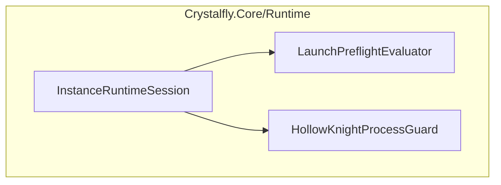
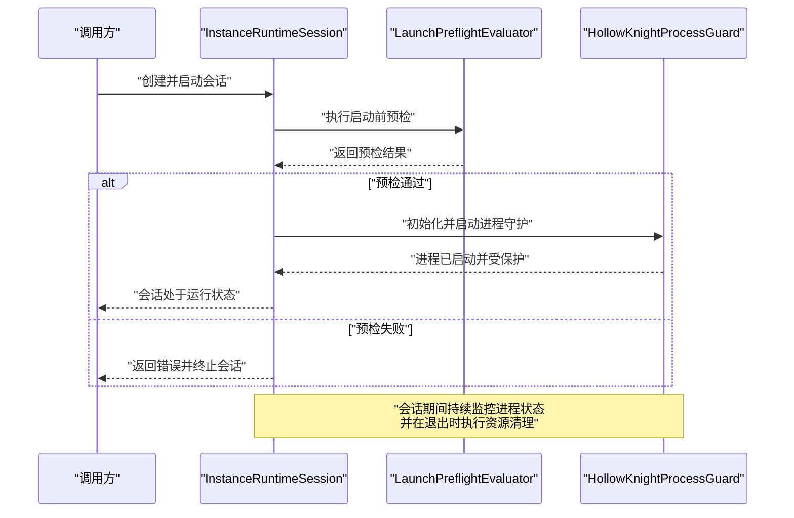
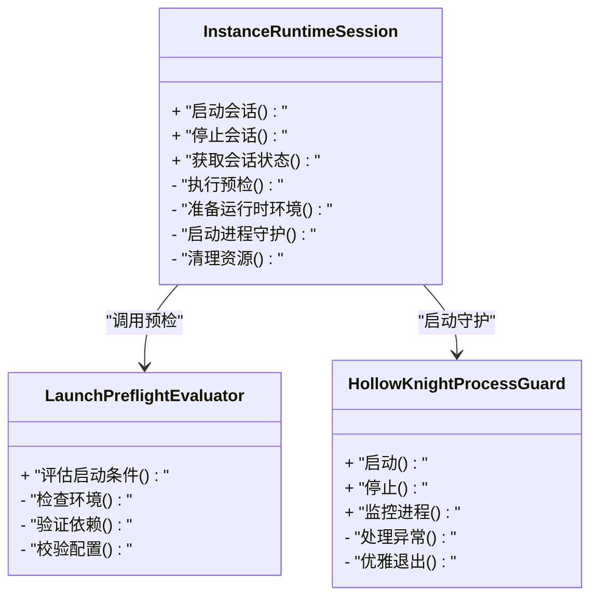
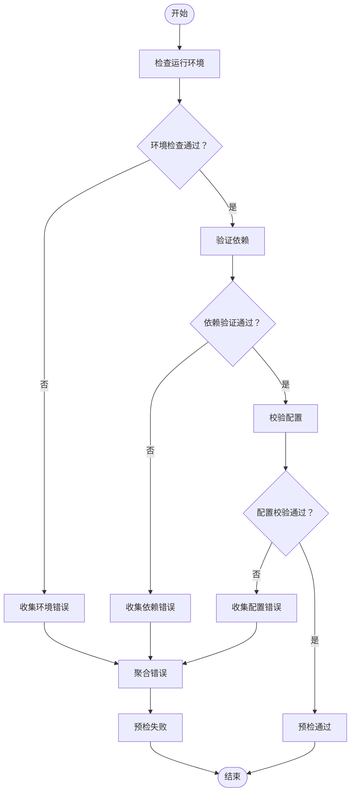
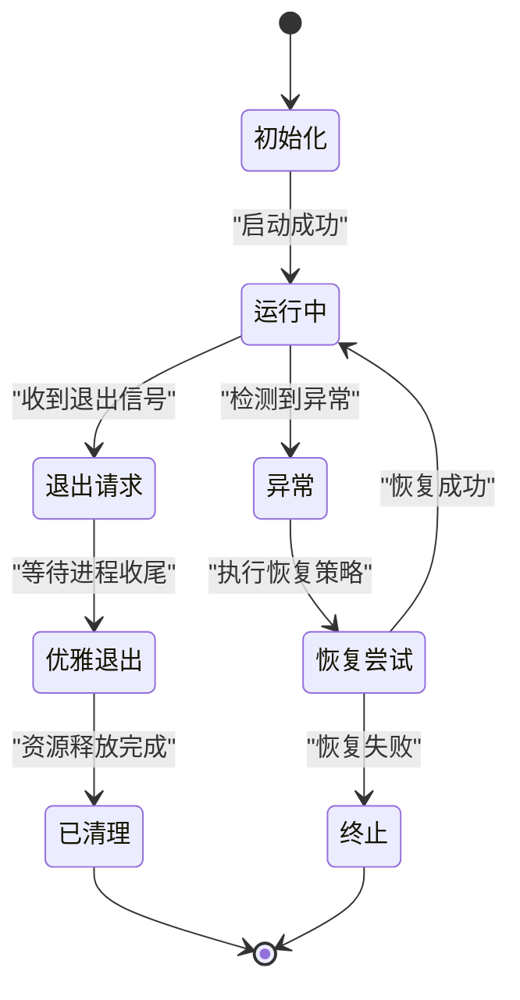
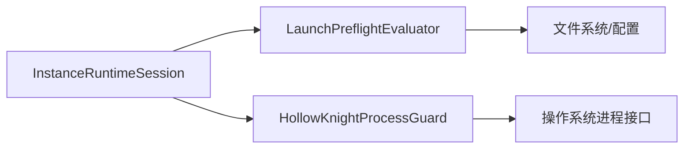

# 运行时管理

<cite>
**本文引用的文件**   
- [InstanceRuntimeSession.cs](file://src/Crystalfly.Core/Runtime/InstanceRuntimeSession.cs)
- [LaunchPreflightEvaluator.cs](file://src/Crystalfly.Core/Runtime/LaunchPreflightEvaluator.cs)
- [HollowKnightProcessGuard.cs](file://src/Crystalfly.Core/Runtime/HollowKnightProcessGuard.cs)
</cite>

## 目录
1. [简介](#简介)
2. [项目结构](#项目结构)
3. [核心组件](#核心组件)
4. [架构总览](#架构总览)
5. [详细组件分析](#详细组件分析)
6. [依赖关系分析](#依赖关系分析)
7. [性能考虑](#性能考虑)
8. [故障排查指南](#故障排查指南)
9. [结论](#结论)
10. [附录：使用示例与最佳实践](#附录使用示例与最佳实践)

## 简介
本技术文档聚焦于运行时管理子系统，围绕以下目标展开：
- 实例运行时会话（InstanceRuntimeSession）的生命周期管理，包括启动前检查、进程监控、资源清理等机制。
- 启动预检评估器（LaunchPreflightEvaluator）的验证流程，涵盖环境检查、依赖验证、配置校验等步骤。
- 进程守护器（HollowKnightProcessGuard）的进程保护机制，包括进程隔离、异常处理、优雅退出等功能。
- 运行时环境的准备与配置过程，包括环境变量设置、配置文件加载、动态库绑定等操作。
- 提供具体代码示例路径，展示如何正确启动和管理游戏实例，以及如何处理运行时异常和错误恢复。

## 项目结构
运行时管理相关代码位于 Crystalfly.Core 模块的 Runtime 子目录中，包含三个关键类：
- InstanceRuntimeSession：负责实例会话生命周期编排。
- LaunchPreflightEvaluator：负责启动前的环境与依赖预检。
- HollowKnightProcessGuard：负责游戏进程的守护与异常处理。

图表来源
- [InstanceRuntimeSession.cs](file://src/Crystalfly.Core/Runtime/InstanceRuntimeSession.cs)
- [LaunchPreflightEvaluator.cs](file://src/Crystalfly.Core/Runtime/LaunchPreflightEvaluator.cs)
- [HollowKnightProcessGuard.cs](file://src/Crystalfly.Core/Runtime/HollowKnightProcessGuard.cs)

章节来源
- [InstanceRuntimeSession.cs](file://src/Crystalfly.Core/Runtime/InstanceRuntimeSession.cs)
- [LaunchPreflightEvaluator.cs](file://src/Crystalfly.Core/Runtime/LaunchPreflightEvaluator.cs)
- [HollowKnightProcessGuard.cs](file://src/Crystalfly.Core/Runtime/HollowKnightProcessGuard.cs)

## 核心组件
本节概述三大核心组件的职责与交互方式：
- InstanceRuntimeSession：作为“会话控制器”，协调预检、环境准备、进程启动、监控与清理。
- LaunchPreflightEvaluator：在会话启动前执行一系列验证，确保系统与环境满足运行条件。
- HollowKnightProcessGuard：在游戏进程生命周期内提供守护能力，捕获异常并支持优雅退出。

章节来源
- [InstanceRuntimeSession.cs](file://src/Crystalfly.Core/Runtime/InstanceRuntimeSession.cs)
- [LaunchPreflightEvaluator.cs](file://src/Crystalfly.Core/Runtime/LaunchPreflightEvaluator.cs)
- [HollowKnightProcessGuard.cs](file://src/Crystalfly.Core/Runtime/HollowKnightProcessGuard.cs)

## 架构总览
下图展示了运行时管理的整体架构与数据流：从会话发起，到预检评估，再到进程守护与资源回收。

图表来源
- [InstanceRuntimeSession.cs](file://src/Crystalfly.Core/Runtime/InstanceRuntimeSession.cs)
- [LaunchPreflightEvaluator.cs](file://src/Crystalfly.Core/Runtime/LaunchPreflightEvaluator.cs)
- [HollowKnightProcessGuard.cs](file://src/Crystalfly.Core/Runtime/HollowKnightProcessGuard.cs)

## 详细组件分析

### 实例运行时会话（InstanceRuntimeSession）
职责与关键点：
- 生命周期编排：负责从会话创建、预检、环境准备、进程启动、监控到关闭的全流程控制。
- 启动前检查：委托给 LaunchPreflightEvaluator 完成环境、依赖与配置的验证。
- 进程监控：与 HollowKnightProcessGuard 协作，跟踪进程状态、处理异常与退出信号。
- 资源清理：在会话结束时释放句柄、清理临时文件、停止守护器等。

建议关注点：
- 异常传播与会话状态一致性。
- 并发安全：避免重复启动或重复关闭。
- 可观测性：记录关键事件与错误信息以便排障。

章节来源
- [InstanceRuntimeSession.cs](file://src/Crystalfly.Core/Runtime/InstanceRuntimeSession.cs)

#### 类图（代码级关系）

图表来源
- [InstanceRuntimeSession.cs](file://src/Crystalfly.Core/Runtime/InstanceRuntimeSession.cs)
- [LaunchPreflightEvaluator.cs](file://src/Crystalfly.Core/Runtime/LaunchPreflightEvaluator.cs)
- [HollowKnightProcessGuard.cs](file://src/Crystalfly.Core/Runtime/HollowKnightProcessGuard.cs)

### 启动预检评估器（LaunchPreflightEvaluator）
职责与关键点：
- 环境检查：操作系统版本、必要工具链、运行时依赖是否存在。
- 依赖验证：游戏构建、加载器、Mod 依赖是否满足要求。
- 配置校验：实例配置项、路径、权限是否正确。
- 错误聚合：将多个检查失败的原因汇总，便于上层统一提示与修复。

流程图（基于实现逻辑）：

图表来源
- [LaunchPreflightEvaluator.cs](file://src/Crystalfly.Core/Runtime/LaunchPreflightEvaluator.cs)

章节来源
- [LaunchPreflightEvaluator.cs](file://src/Crystalfly.Core/Runtime/LaunchPreflightEvaluator.cs)

### 进程守护器（HollowKnightProcessGuard）
职责与关键点：
- 进程隔离：为游戏进程创建独立上下文，避免污染宿主环境。
- 异常处理：捕获进程崩溃、未处理异常，记录日志并触发恢复策略。
- 优雅退出：响应退出信号，等待进程正常收尾，避免强制杀进程导致的数据损坏。
- 健康检查：周期性检测进程存活状态，必要时重启或告警。

守护流程（概念示意）：

图表来源
- [HollowKnightProcessGuard.cs](file://src/Crystalfly.Core/Runtime/HollowKnightProcessGuard.cs)

章节来源
- [HollowKnightProcessGuard.cs](file://src/Crystalfly.Core/Runtime/HollowKnightProcessGuard.cs)

## 依赖关系分析
- InstanceRuntimeSession 依赖 LaunchPreflightEvaluator 进行启动前验证。
- InstanceRuntimeSession 依赖 HollowKnightProcessGuard 进行进程守护。
- LaunchPreflightEvaluator 可能依赖配置与文件系统访问以读取实例信息与依赖清单。
- HollowKnightProcessGuard 依赖进程管理与异常捕获机制。

图表来源
- [InstanceRuntimeSession.cs](file://src/Crystalfly.Core/Runtime/InstanceRuntimeSession.cs)
- [LaunchPreflightEvaluator.cs](file://src/Crystalfly.Core/Runtime/LaunchPreflightEvaluator.cs)
- [HollowKnightProcessGuard.cs](file://src/Crystalfly.Core/Runtime/HollowKnightProcessGuard.cs)

章节来源
- [InstanceRuntimeSession.cs](file://src/Crystalfly.Core/Runtime/InstanceRuntimeSession.cs)
- [LaunchPreflightEvaluator.cs](file://src/Crystalfly.Core/Runtime/LaunchPreflightEvaluator.cs)
- [HollowKnightProcessGuard.cs](file://src/Crystalfly.Core/Runtime/HollowKnightProcessGuard.cs)

## 性能考虑
- 预检阶段应尽可能并行化环境检查与依赖验证，减少总体耗时。
- 进程守护的健康检查间隔需平衡及时性与开销，避免频繁轮询。
- 资源清理应在会话结束时尽快释放，防止句柄泄漏与内存占用。
- 日志输出应分级控制，避免在高负载下产生过多 I/O。

[本节为通用指导，不直接分析具体文件]

## 故障排查指南
常见问题与定位要点：
- 预检失败：查看 LaunchPreflightEvaluator 的错误聚合结果，确认环境、依赖或配置问题。
- 进程启动失败：检查 HollowKnightProcessGuard 的异常捕获与退出码，结合系统日志定位。
- 会话无法关闭：确认 InstanceRuntimeSession 的资源清理逻辑是否被正确调用。
- 进程异常退出：观察守护器的恢复策略与健康检查日志，判断是否需要重启或人工干预。

章节来源
- [LaunchPreflightEvaluator.cs](file://src/Crystalfly.Core/Runtime/LaunchPreflightEvaluator.cs)
- [HollowKnightProcessGuard.cs](file://src/Crystalfly.Core/Runtime/HollowKnightProcessGuard.cs)
- [InstanceRuntimeSession.cs](file://src/Crystalfly.Core/Runtime/InstanceRuntimeSession.cs)

## 结论
运行时管理子系统通过 InstanceRuntimeSession 统一编排启动流程，借助 LaunchPreflightEvaluator 保障启动前置条件，利用 HollowKnightProcessGuard 提升进程稳定性与可恢复性。三者协同实现了高可靠的游戏实例运行体验。

[本节为总结性内容，不直接分析具体文件]

## 附录：使用示例与最佳实践
以下为典型用法的路径指引（不包含具体代码内容）：
- 启动实例会话：参考 [InstanceRuntimeSession.cs](file://src/Crystalfly.Core/Runtime/InstanceRuntimeSession.cs) 中的会话启动入口方法。
- 执行启动预检：参考 [LaunchPreflightEvaluator.cs](file://src/Crystalfly.Core/Runtime/LaunchPreflightEvaluator.cs) 中的评估入口方法。
- 守护进程生命周期：参考 [HollowKnightProcessGuard.cs](file://src/Crystalfly.Core/Runtime/HollowKnightProcessGuard.cs) 中的启动与停止方法。
- 异常处理与恢复：参考各组件的错误捕获与恢复策略实现位置。

章节来源
- [InstanceRuntimeSession.cs](file://src/Crystalfly.Core/Runtime/InstanceRuntimeSession.cs)
- [LaunchPreflightEvaluator.cs](file://src/Crystalfly.Core/Runtime/LaunchPreflightEvaluator.cs)
- [HollowKnightProcessGuard.cs](file://src/Crystalfly.Core/Runtime/HollowKnightProcessGuard.cs)