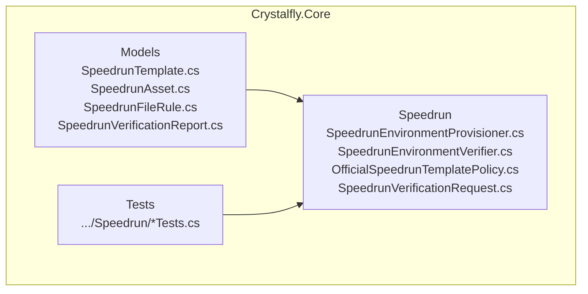
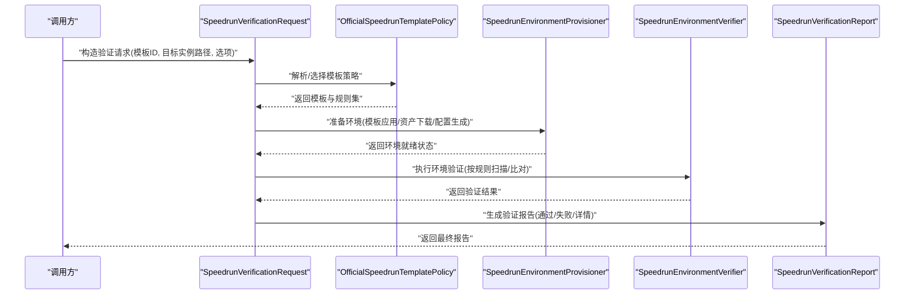
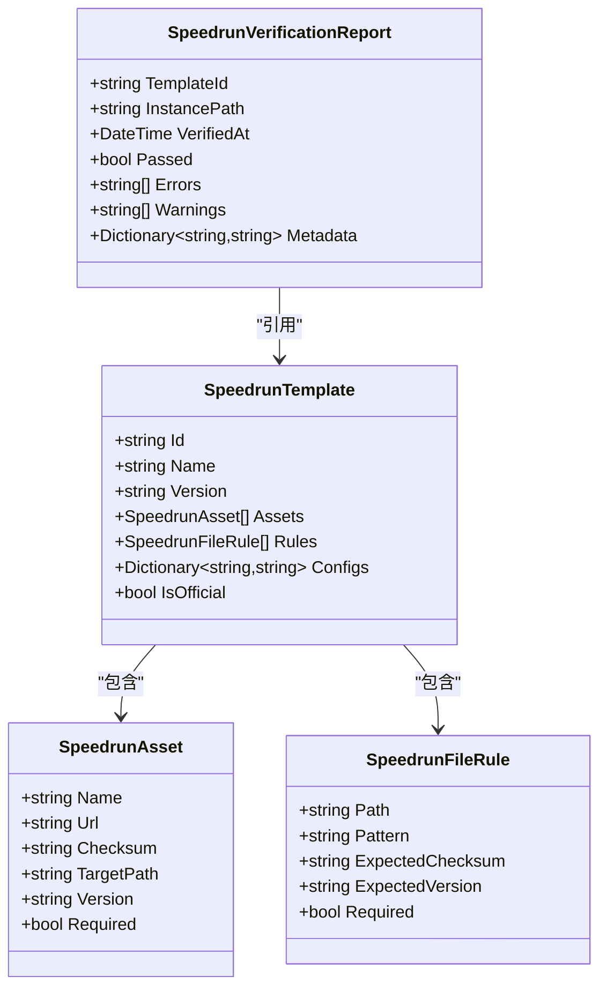
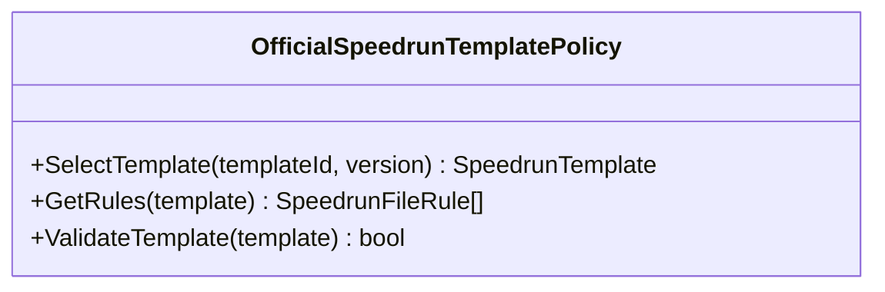
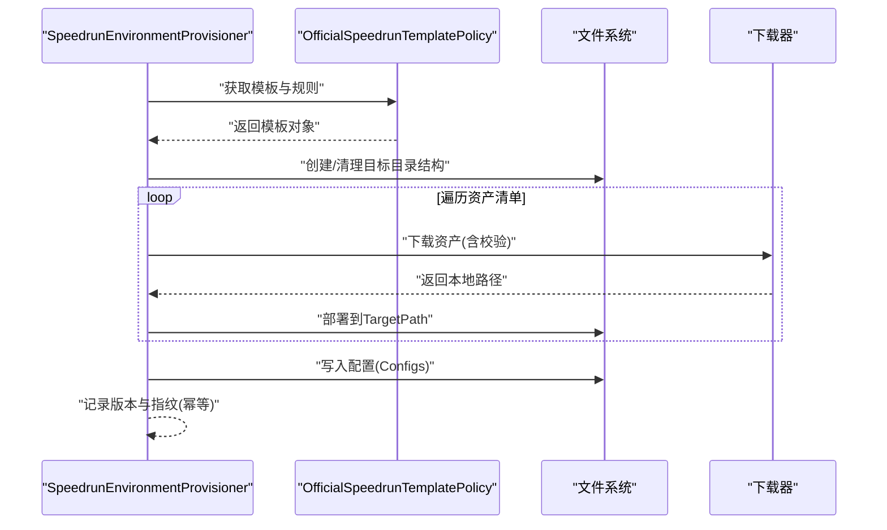
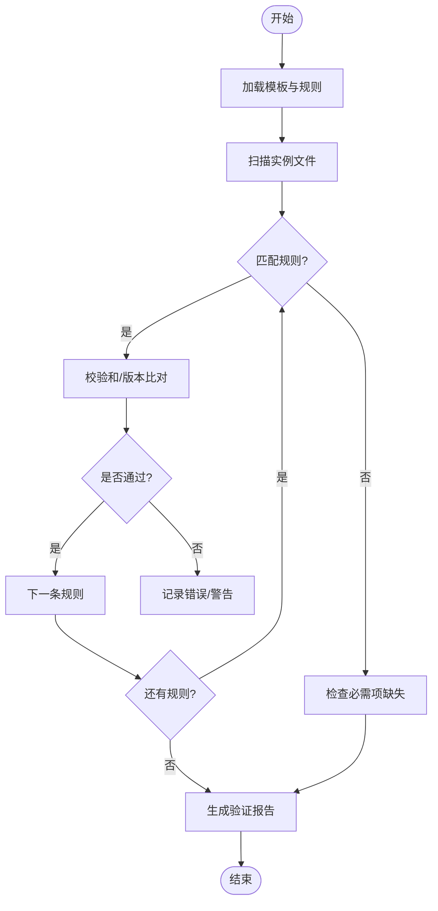
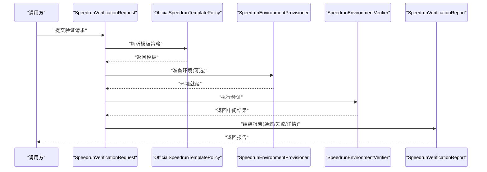
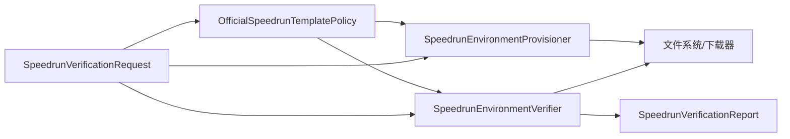

# 速通支持系统

<cite>
**本文引用的文件**   
- [SpeedrunEnvironmentProvisioner.cs](file://src/Crystalfly.Core/Speedrun/SpeedrunEnvironmentProvisioner.cs)
- [SpeedrunEnvironmentVerifier.cs](file://src/Crystalfly.Core/Speedrun/SpeedrunEnvironmentVerifier.cs)
- [OfficialSpeedrunTemplatePolicy.cs](file://src/Crystalfly.Core/Speedrun/OfficialSpeedrunTemplatePolicy.cs)
- [SpeedrunVerificationRequest.cs](file://src/Crystalfly.Core/Speedrun/SpeedrunVerificationRequest.cs)
- [SpeedrunTemplate.cs](file://src/Crystalfly.Core/Models/SpeedrunTemplate.cs)
- [SpeedrunAsset.cs](file://src/Crystalfly.Core/Models/SpeedrunAsset.cs)
- [SpeedrunFileRule.cs](file://src/Crystalfly.Core/Models/SpeedrunFileRule.cs)
- [SpeedrunVerificationReport.cs](file://src/Crystalfly.Core/Models/SpeedrunVerificationReport.cs)
- [SpeedrunEnvironmentProvisionerTests.cs](file://tests/Crystalfly.Core.Tests/Speedrun/SpeedrunEnvironmentProvisionerTests.cs)
- [SpeedrunEnvironmentVerifierTests.cs](file://tests/Crystalfly.Core.Tests/Speedrun/SpeedrunEnvironmentVerifierTests.cs)
- [OfficialSpeedrunTemplatePolicyTests.cs](file://tests/Crystalfly.Core.Tests/Speedrun/OfficialSpeedrunTemplatePolicyTests.cs)
</cite>

## 目录
1. [简介](#简介)
2. [项目结构](#项目结构)
3. [核心组件](#核心组件)
4. [架构总览](#架构总览)
5. [详细组件分析](#详细组件分析)
6. [依赖关系分析](#依赖关系分析)
7. [性能考虑](#性能考虑)
8. [故障排查指南](#故障排查指南)
9. [结论](#结论)
10. [附录](#附录)

## 简介
本技术文档聚焦于“速通支持系统”，围绕以下关键能力进行系统化说明：
- 速通环境供应器（SpeedrunEnvironmentProvisioner）的环境准备流程，包括模板应用、资产下载与配置生成。
- 速通环境验证器（SpeedrunEnvironmentVerifier）的验证规则与检查机制。
- 官方速通模板策略（OfficialSpeedrunTemplatePolicy）的规则定义与策略模式实现。
- 数据模型设计：速通模板（SpeedrunTemplate）、速通资产（SpeedrunAsset）、文件规则（SpeedrunFileRule）与验证报告（SpeedrunVerificationReport）。
- 速通验证请求（SpeedrunVerificationRequest）的处理流程与报告生成机制。
- 使用示例与扩展指南：如何配置和使用速通验证功能，以及如何扩展自定义的速通模板策略。

## 项目结构
速通相关代码位于 Crystalfly.Core 模块中，采用分层组织方式：
- Models：数据模型定义（模板、资产、规则、报告等）。
- Speedrun：核心业务逻辑（环境供应、环境验证、模板策略、验证请求处理）。
- Tests：对应单元测试，覆盖主要行为与边界条件。

图表来源
- [SpeedrunTemplate.cs](file://src/Crystalfly.Core/Models/SpeedrunTemplate.cs)
- [SpeedrunAsset.cs](file://src/Crystalfly.Core/Models/SpeedrunAsset.cs)
- [SpeedrunFileRule.cs](file://src/Crystalfly.Core/Models/SpeedrunFileRule.cs)
- [SpeedrunVerificationReport.cs](file://src/Crystalfly.Core/Models/SpeedrunVerificationReport.cs)
- [SpeedrunEnvironmentProvisioner.cs](file://src/Crystalfly.Core/Speedrun/SpeedrunEnvironmentProvisioner.cs)
- [SpeedrunEnvironmentVerifier.cs](file://src/Crystalfly.Core/Speedrun/SpeedrunEnvironmentVerifier.cs)
- [OfficialSpeedrunTemplatePolicy.cs](file://src/Crystalfly.Core/Speedrun/OfficialSpeedrunTemplatePolicy.cs)
- [SpeedrunVerificationRequest.cs](file://src/Crystalfly.Core/Speedrun/SpeedrunVerificationRequest.cs)

章节来源
- [SpeedrunEnvironmentProvisioner.cs](file://src/Crystalfly.Core/Speedrun/SpeedrunEnvironmentProvisioner.cs)
- [SpeedrunEnvironmentVerifier.cs](file://src/Crystalfly.Core/Speedrun/SpeedrunEnvironmentVerifier.cs)
- [OfficialSpeedrunTemplatePolicy.cs](file://src/Crystalfly.Core/Speedrun/OfficialSpeedrunTemplatePolicy.cs)
- [SpeedrunVerificationRequest.cs](file://src/Crystalfly.Core/Speedrun/SpeedrunVerificationRequest.cs)
- [SpeedrunTemplate.cs](file://src/Crystalfly.Core/Models/SpeedrunTemplate.cs)
- [SpeedrunAsset.cs](file://src/Crystalfly.Core/Models/SpeedrunAsset.cs)
- [SpeedrunFileRule.cs](file://src/Crystalfly.Core/Models/SpeedrunFileRule.cs)
- [SpeedrunVerificationReport.cs](file://src/Crystalfly.Core/Models/SpeedrunVerificationReport.cs)

## 核心组件
- 速通环境供应器（SpeedrunEnvironmentProvisioner）
  - 职责：根据模板与策略准备目标实例环境，执行模板应用、资产下载与配置生成等操作。
  - 关键点：幂等性、可重试、错误聚合、进度反馈（由测试用例体现）。
- 速通环境验证器（SpeedrunEnvironmentVerifier）
  - 职责：基于模板与规则对已准备环境进行一致性校验，输出结构化验证报告。
  - 关键点：规则匹配、路径解析、版本比对、缺失/多余项检测。
- 官方速通模板策略（OfficialSpeedrunTemplatePolicy）
  - 职责：提供官方模板的策略实现，定义默认规则集与模板选择逻辑。
  - 关键点：策略模式可扩展，便于引入第三方或社区模板策略。
- 速通验证请求（SpeedrunVerificationRequest）
  - 职责：封装一次验证任务的输入参数与上下文，驱动验证流程并产出报告。
  - 关键点：参数校验、任务编排、结果汇总。

章节来源
- [SpeedrunEnvironmentProvisioner.cs](file://src/Crystalfly.Core/Speedrun/SpeedrunEnvironmentProvisioner.cs)
- [SpeedrunEnvironmentVerifier.cs](file://src/Crystalfly.Core/Speedrun/SpeedrunEnvironmentVerifier.cs)
- [OfficialSpeedrunTemplatePolicy.cs](file://src/Crystalfly.Core/Speedrun/OfficialSpeedrunTemplatePolicy.cs)
- [SpeedrunVerificationRequest.cs](file://src/Crystalfly.Core/Speedrun/SpeedrunVerificationRequest.cs)

## 架构总览
下图展示了速通支持系统的核心交互：请求入口、策略选择、环境准备与环境验证的协作关系。

图表来源
- [SpeedrunVerificationRequest.cs](file://src/Crystalfly.Core/Speedrun/SpeedrunVerificationRequest.cs)
- [OfficialSpeedrunTemplatePolicy.cs](file://src/Crystalfly.Core/Speedrun/OfficialSpeedrunTemplatePolicy.cs)
- [SpeedrunEnvironmentProvisioner.cs](file://src/Crystalfly.Core/Speedrun/SpeedrunEnvironmentProvisioner.cs)
- [SpeedrunEnvironmentVerifier.cs](file://src/Crystalfly.Core/Speedrun/SpeedrunEnvironmentVerifier.cs)
- [SpeedrunVerificationReport.cs](file://src/Crystalfly.Core/Models/SpeedrunVerificationReport.cs)

## 详细组件分析

### 数据模型设计
本节梳理模板、资产、文件规则与验证报告的数据结构与字段规范。

图表来源
- [SpeedrunTemplate.cs](file://src/Crystalfly.Core/Models/SpeedrunTemplate.cs)
- [SpeedrunAsset.cs](file://src/Crystalfly.Core/Models/SpeedrunAsset.cs)
- [SpeedrunFileRule.cs](file://src/Crystalfly.Core/Models/SpeedrunFileRule.cs)
- [SpeedrunVerificationReport.cs](file://src/Crystalfly.Core/Models/SpeedrunVerificationReport.cs)

章节来源
- [SpeedrunTemplate.cs](file://src/Crystalfly.Core/Models/SpeedrunTemplate.cs)
- [SpeedrunAsset.cs](file://src/Crystalfly.Core/Models/SpeedrunAsset.cs)
- [SpeedrunFileRule.cs](file://src/Crystalfly.Core/Models/SpeedrunFileRule.cs)
- [SpeedrunVerificationReport.cs](file://src/Crystalfly.Core/Models/SpeedrunVerificationReport.cs)

#### 字段规范与版本管理要点
- 模板（SpeedrunTemplate）
  - 标识与元信息：Id、Name、Version、IsOfficial。
  - 资产清单：Assets，用于描述需要下载的组件及目标位置。
  - 文件规则：Rules，用于后续验证阶段的路径与内容匹配。
  - 配置映射：Configs，用于生成运行时配置键值对。
- 资产（SpeedrunAsset）
  - 来源与完整性：Url、Checksum。
  - 安装位置：TargetPath。
  - 版本控制：Version，用于增量更新与回滚判断。
  - 必需性：Required，决定验证失败的严格程度。
- 文件规则（SpeedrunFileRule）
  - 匹配维度：Path、Pattern、ExpectedChecksum、ExpectedVersion。
  - 必需性：Required，影响整体验证通过判定。
- 验证报告（SpeedrunVerificationReport）
  - 上下文：TemplateId、InstancePath、VerifiedAt。
  - 结果：Passed、Errors、Warnings、Metadata。

章节来源
- [SpeedrunTemplate.cs](file://src/Crystalfly.Core/Models/SpeedrunTemplate.cs)
- [SpeedrunAsset.cs](file://src/Crystalfly.Core/Models/SpeedrunAsset.cs)
- [SpeedrunFileRule.cs](file://src/Crystalfly.Core/Models/SpeedrunFileRule.cs)
- [SpeedrunVerificationReport.cs](file://src/Crystalfly.Core/Models/SpeedrunVerificationReport.cs)

### 官方速通模板策略（OfficialSpeedrunTemplatePolicy）
- 角色定位：作为策略模式的实现，负责从模板源解析并返回官方模板及其规则集。
- 典型行为：
  - 模板发现与过滤（按 Id/Version/IsOfficial）。
  - 规则合并与优先级处理。
  - 异常与不可用模板的降级策略。
- 扩展点：
  - 新增非官方策略时，遵循相同接口契约，替换策略选择逻辑即可。

图表来源
- [OfficialSpeedrunTemplatePolicy.cs](file://src/Crystalfly.Core/Speedrun/OfficialSpeedrunTemplatePolicy.cs)

章节来源
- [OfficialSpeedrunTemplatePolicy.cs](file://src/Crystalfly.Core/Speedrun/OfficialSpeedrunTemplatePolicy.cs)

### 速通环境供应器（SpeedrunEnvironmentProvisioner）
- 职责范围：
  - 模板应用：将模板中的配置与规则应用到目标实例目录。
  - 资产下载：依据资产清单下载必要资源，并进行完整性校验。
  - 配置生成：根据模板配置生成运行时所需配置文件。
- 关键流程（顺序图）：

图表来源
- [SpeedrunEnvironmentProvisioner.cs](file://src/Crystalfly.Core/Speedrun/SpeedrunEnvironmentProvisioner.cs)
- [OfficialSpeedrunTemplatePolicy.cs](file://src/Crystalfly.Core/Speedrun/OfficialSpeedrunTemplatePolicy.cs)
- [SpeedrunTemplate.cs](file://src/Crystalfly.Core/Models/SpeedrunTemplate.cs)
- [SpeedrunAsset.cs](file://src/Crystalfly.Core/Models/SpeedrunAsset.cs)

章节来源
- [SpeedrunEnvironmentProvisioner.cs](file://src/Crystalfly.Core/Speedrun/SpeedrunEnvironmentProvisioner.cs)
- [SpeedrunEnvironmentProvisionerTests.cs](file://tests/Crystalfly.Core.Tests/Speedrun/SpeedrunEnvironmentProvisionerTests.cs)

### 速通环境验证器（SpeedrunEnvironmentVerifier）
- 职责范围：
  - 基于模板规则对实例文件进行扫描与比对。
  - 计算校验和、比较版本、检测缺失或多余文件。
  - 生成结构化验证报告。
- 验证流程（流程图）：

图表来源
- [SpeedrunEnvironmentVerifier.cs](file://src/Crystalfly.Core/Speedrun/SpeedrunEnvironmentVerifier.cs)
- [SpeedrunFileRule.cs](file://src/Crystalfly.Core/Models/SpeedrunFileRule.cs)
- [SpeedrunVerificationReport.cs](file://src/Crystalfly.Core/Models/SpeedrunVerificationReport.cs)

章节来源
- [SpeedrunEnvironmentVerifier.cs](file://src/Crystalfly.Core/Speedrun/SpeedrunEnvironmentVerifier.cs)
- [SpeedrunEnvironmentVerifierTests.cs](file://tests/Crystalfly.Core.Tests/Speedrun/SpeedrunEnvironmentVerifierTests.cs)

### 速通验证请求（SpeedrunVerificationRequest）
- 职责范围：
  - 封装一次验证任务的输入参数（模板 ID、目标实例路径、选项等）。
  - 协调策略选择、环境准备与环境验证。
  - 汇总错误与警告，生成最终报告。
- 处理流程（序列图）：

图表来源
- [SpeedrunVerificationRequest.cs](file://src/Crystalfly.Core/Speedrun/SpeedrunVerificationRequest.cs)
- [OfficialSpeedrunTemplatePolicy.cs](file://src/Crystalfly.Core/Speedrun/OfficialSpeedrunTemplatePolicy.cs)
- [SpeedrunEnvironmentProvisioner.cs](file://src/Crystalfly.Core/Speedrun/SpeedrunEnvironmentProvisioner.cs)
- [SpeedrunEnvironmentVerifier.cs](file://src/Crystalfly.Core/Speedrun/SpeedrunEnvironmentVerifier.cs)
- [SpeedrunVerificationReport.cs](file://src/Crystalfly.Core/Models/SpeedrunVerificationReport.cs)

章节来源
- [SpeedrunVerificationRequest.cs](file://src/Crystalfly.Core/Speedrun/SpeedrunVerificationRequest.cs)

## 依赖关系分析
- 内部依赖
  - 策略层（OfficialSpeedrunTemplatePolicy）为上层提供模板与规则。
  - 供应器（SpeedrunEnvironmentProvisioner）依赖策略与文件系统/下载器。
  - 验证器（SpeedrunEnvironmentVerifier）依赖模板规则与文件系统。
  - 请求（SpeedrunVerificationRequest）编排策略、供应器与验证器，产出报告。
- 外部依赖
  - 文件系统访问、网络下载、校验算法（由具体实现注入）。
- 耦合与内聚
  - 各组件职责清晰，通过接口与数据模型解耦；策略模式提升扩展性。

图表来源
- [OfficialSpeedrunTemplatePolicy.cs](file://src/Crystalfly.Core/Speedrun/OfficialSpeedrunTemplatePolicy.cs)
- [SpeedrunEnvironmentProvisioner.cs](file://src/Crystalfly.Core/Speedrun/SpeedrunEnvironmentProvisioner.cs)
- [SpeedrunEnvironmentVerifier.cs](file://src/Crystalfly.Core/Speedrun/SpeedrunEnvironmentVerifier.cs)
- [SpeedrunVerificationRequest.cs](file://src/Crystalfly.Core/Speedrun/SpeedrunVerificationRequest.cs)
- [SpeedrunVerificationReport.cs](file://src/Crystalfly.Core/Models/SpeedrunVerificationReport.cs)

章节来源
- [OfficialSpeedrunTemplatePolicy.cs](file://src/Crystalfly.Core/Speedrun/OfficialSpeedrunTemplatePolicy.cs)
- [SpeedrunEnvironmentProvisioner.cs](file://src/Crystalfly.Core/Speedrun/SpeedrunEnvironmentProvisioner.cs)
- [SpeedrunEnvironmentVerifier.cs](file://src/Crystalfly.Core/Speedrun/SpeedrunEnvironmentVerifier.cs)
- [SpeedrunVerificationRequest.cs](file://src/Crystalfly.Core/Speedrun/SpeedrunVerificationRequest.cs)
- [SpeedrunVerificationReport.cs](file://src/Crystalfly.Core/Models/SpeedrunVerificationReport.cs)

## 性能考虑
- 批量下载与并发控制：在资产清单较大时，建议限制并发度以避免带宽拥塞。
- 增量更新：利用资产的 Version 与 Checksum 进行差异更新，减少重复下载。
- 缓存策略：对模板与规则进行内存缓存，避免重复解析。
- I/O 优化：批量写入与原子操作，降低磁盘抖动与部分写入风险。
- 验证并行化：对独立规则进行并行扫描，注意线程安全与资源竞争。

[本节为通用指导，不直接分析具体文件]

## 故障排查指南
- 常见错误类型
  - 模板解析失败：检查模板 Id/Version 是否存在且可用。
  - 资产下载失败：核对 Url 可达性与网络代理设置。
  - 校验失败：确认 Checksum 与目标文件一致。
  - 规则匹配失败：检查 Path/Pattern 是否与实例目录结构一致。
- 定位方法
  - 查看验证报告的 Errors/Warnings 列表，结合 Metadata 定位问题。
  - 启用调试日志，关注关键步骤（模板选择、下载、部署、验证）。
- 恢复建议
  - 清理目标实例目录后重试。
  - 回滚到上一稳定版本（依据 Version 字段）。
  - 调整策略或规则以适配实际环境。

章节来源
- [SpeedrunEnvironmentProvisionerTests.cs](file://tests/Crystalfly.Core.Tests/Speedrun/SpeedrunEnvironmentProvisionerTests.cs)
- [SpeedrunEnvironmentVerifierTests.cs](file://tests/Crystalfly.Core.Tests/Speedrun/SpeedrunEnvironmentVerifierTests.cs)
- [OfficialSpeedrunTemplatePolicyTests.cs](file://tests/Crystalfly.Core.Tests/Speedrun/OfficialSpeedrunTemplatePolicyTests.cs)

## 结论
速通支持系统通过策略模式与清晰的组件分工，实现了模板驱动的速通环境准备与验证闭环。数据模型统一了模板、资产与规则的语义，使系统具备良好的可扩展性与可维护性。借助验证报告的结构化输出，用户能够快速定位问题并采取修复措施。

[本节为总结性内容，不直接分析具体文件]

## 附录

### 使用示例：配置与运行速通验证
- 步骤概览
  - 构造验证请求：指定模板 Id、目标实例路径与可选参数。
  - 选择策略：由官方策略解析模板与规则。
  - 准备环境：按需执行模板应用、资产下载与配置生成。
  - 执行验证：基于规则扫描与比对，生成报告。
  - 处理报告：根据 Passed/Errors/Warnings 采取相应动作。
- 参考路径
  - [SpeedrunVerificationRequest.cs](file://src/Crystalfly.Core/Speedrun/SpeedrunVerificationRequest.cs)
  - [OfficialSpeedrunTemplatePolicy.cs](file://src/Crystalfly.Core/Speedrun/OfficialSpeedrunTemplatePolicy.cs)
  - [SpeedrunEnvironmentProvisioner.cs](file://src/Crystalfly.Core/Speedrun/SpeedrunEnvironmentProvisioner.cs)
  - [SpeedrunEnvironmentVerifier.cs](file://src/Crystalfly.Core/Speedrun/SpeedrunEnvironmentVerifier.cs)
  - [SpeedrunVerificationReport.cs](file://src/Crystalfly.Core/Models/SpeedrunVerificationReport.cs)

章节来源
- [SpeedrunVerificationRequest.cs](file://src/Crystalfly.Core/Speedrun/SpeedrunVerificationRequest.cs)
- [OfficialSpeedrunTemplatePolicy.cs](file://src/Crystalfly.Core/Speedrun/OfficialSpeedrunTemplatePolicy.cs)
- [SpeedrunEnvironmentProvisioner.cs](file://src/Crystalfly.Core/Speedrun/SpeedrunEnvironmentProvisioner.cs)
- [SpeedrunEnvironmentVerifier.cs](file://src/Crystalfly.Core/Speedrun/SpeedrunEnvironmentVerifier.cs)
- [SpeedrunVerificationReport.cs](file://src/Crystalfly.Core/Models/SpeedrunVerificationReport.cs)

### 扩展指南：自定义速通模板策略
- 目标
  - 在不修改现有核心逻辑的前提下，引入新的模板策略（如社区模板、私有模板）。
- 步骤
  - 实现策略接口：提供 SelectTemplate、GetRules、ValidateTemplate 等方法。
  - 注册策略：在策略选择器中增加新策略分支或工厂。
  - 编写测试：覆盖正常、异常与边界场景。
- 参考路径
  - [OfficialSpeedrunTemplatePolicy.cs](file://src/Crystalfly.Core/Speedrun/OfficialSpeedrunTemplatePolicy.cs)
  - [OfficialSpeedrunTemplatePolicyTests.cs](file://tests/Crystalfly.Core.Tests/Speedrun/OfficialSpeedrunTemplatePolicyTests.cs)

章节来源
- [OfficialSpeedrunTemplatePolicy.cs](file://src/Crystalfly.Core/Speedrun/OfficialSpeedrunTemplatePolicy.cs)
- [OfficialSpeedrunTemplatePolicyTests.cs](file://tests/Crystalfly.Core.Tests/Speedrun/OfficialSpeedrunTemplatePolicyTests.cs)