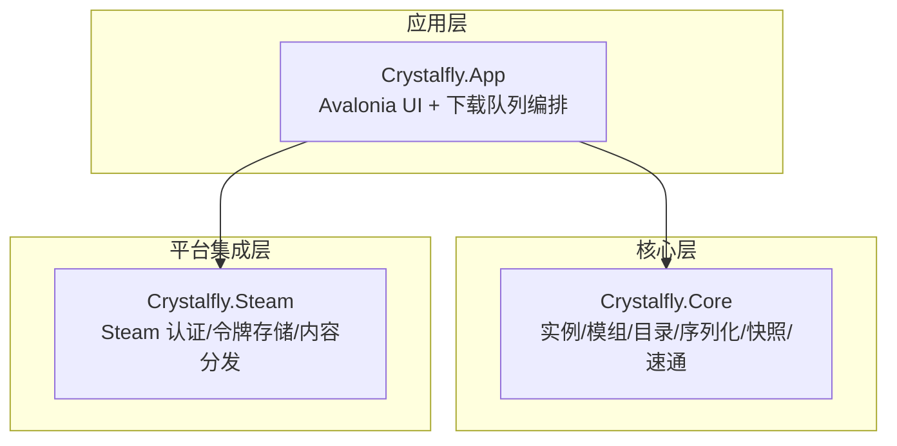
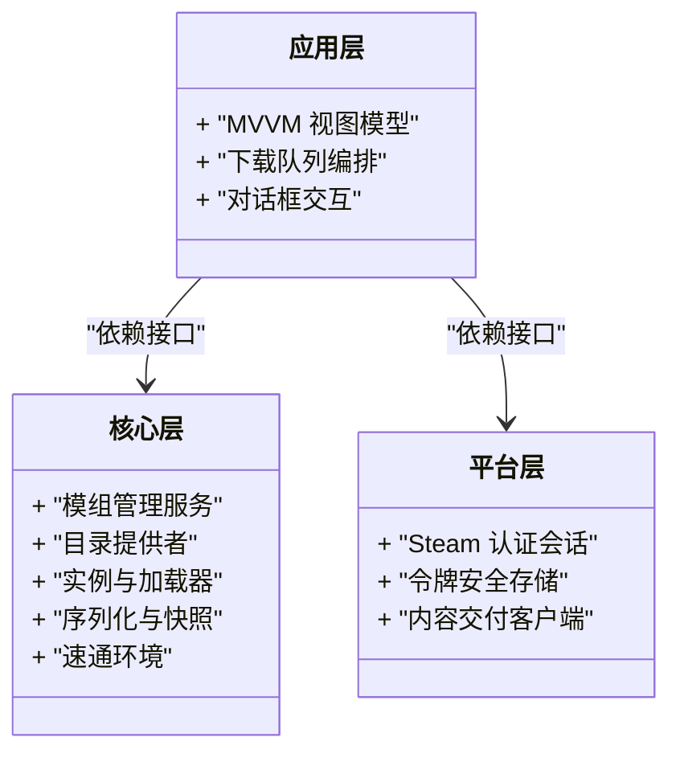
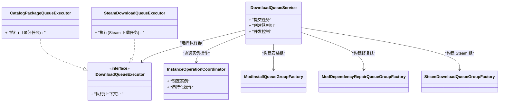
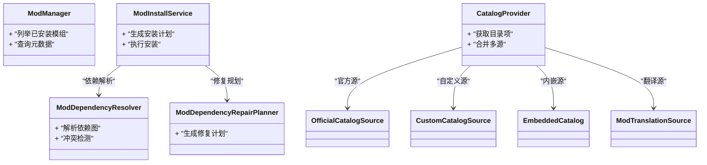
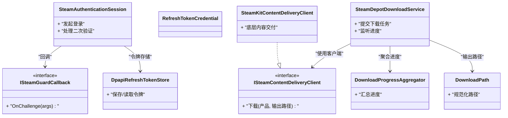
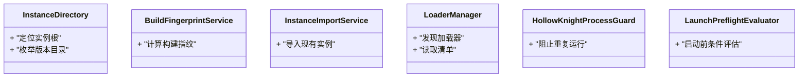
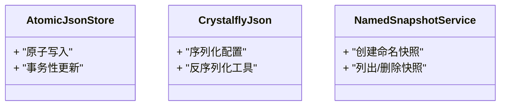
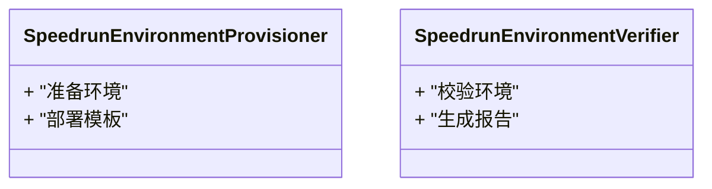
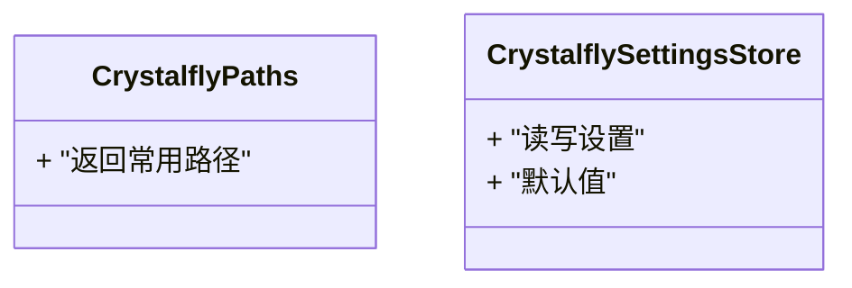
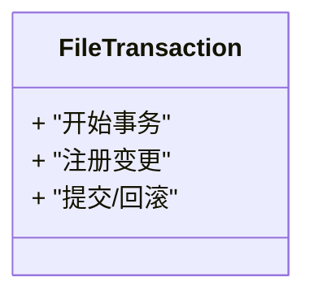

# 模块设计

<cite>
**本文引用的文件**   
- [Crystalfly.App.csproj](file://src/Crystalfly.App/Crystalfly.App.csproj)
- [Program.cs](file://src/Crystalfly.App/Program.cs)
- [App.axaml.cs](file://src/Crystalfly.App/App.axaml.cs)
- [MainWindow.axaml.cs](file://src/Crystalfly.App/Views/MainWindow.axaml.cs)
- [MainViewModel.cs](file://src/Crystalfly.App/ViewModels/MainViewModel.cs)
- [DownloadQueueService.cs](file://src/Crystalfly.App/Downloads/DownloadQueueService.cs)
- [CatalogPackageQueueExecutor.cs](file://src/Crystalfly.App/Downloads/CatalogPackageQueueExecutor.cs)
- [SteamDownloadQueueExecutor.cs](file://src/Crystalfly.App/Downloads/SteamDownloadQueueExecutor.cs)
- [IDownloadQueueExecutor.cs](file://src/Crystalfly.App/Downloads/IDownloadQueueExecutor.cs)
- [InstanceOperationCoordinator.cs](file://src/Crystalfly.App/Downloads/InstanceOperationCoordinator.cs)
- [ModInstallQueueGroupFactory.cs](file://src/Crystalfly.App/Downloads/ModInstallQueueGroupFactory.cs)
- [ModDependencyRepairQueueGroupFactory.cs](file://src/Crystalfly.App/Downloads/ModDependencyRepairQueueGroupFactory.cs)
- [SteamDownloadQueueGroupFactory.cs](file://src/Crystalfly.App/Downloads/SteamDownloadQueueGroupFactory.cs)
- [Crystalfly.Core.csproj](file://src/Crystalfly.Core/Crystalfly.Core.csproj)
- [ModManager.cs](file://src/Crystalfly.Core/Mods/ModManager.cs)
- [ModInstallService.cs](file://src/Crystalfly.Core/Mods/ModInstallService.cs)
- [ModDependencyResolver.cs](file://src/Crystalfly.Core/Mods/ModDependencyResolver.cs)
- [ModDependencyRepairPlanner.cs](file://src/Crystalfly.Core/Mods/ModDependencyRepairPlanner.cs)
- [CatalogProvider.cs](file://src/Crystalfly.Core/Catalog/CatalogProvider.cs)
- [OfficialCatalogSource.cs](file://src/Crystalfly.Core/Catalog/OfficialCatalogSource.cs)
- [CustomCatalogSource.cs](file://src/Crystalfly.Core/Catalog/CustomCatalogSource.cs)
- [EmbeddedCatalog.cs](file://src/Crystalfly.Core/Catalog/EmbeddedCatalog.cs)
- [ModTranslationSource.cs](file://src/Crystalfly.Core/Catalog/ModTranslationSource.cs)
- [CrystalflySettingsStore.cs](file://src/Crystalfly.Core/Configuration/CrystalflySettingsStore.cs)
- [CrystalflyPaths.cs](file://src/Crystalfly.Core/Configuration/CrystalflyPaths.cs)
- [InstanceDirectory.cs](file://src/Crystalfly.Core/Instances/InstanceDirectory.cs)
- [BuildFingerprintService.cs](file://src/Crystalfly.Core/Instances/BuildFingerprintService.cs)
- [InstanceImportService.cs](file://src/Crystalfly.Core/Instances/InstanceImportService.cs)
- [LoaderManager.cs](file://src/Crystalfly.Core/Loaders/LoaderManager.cs)
- [HollowKnightProcessGuard.cs](file://src/Crystalfly.Core/Runtime/HollowKnightProcessGuard.cs)
- [LaunchPreflightEvaluator.cs](file://src/Crystalfly.Core/Runtime/LaunchPreflightEvaluator.cs)
- [AtomicJsonStore.cs](file://src/Crystalfly.Core/Serialization/AtomicJsonStore.cs)
- [CrystalflyJson.cs](file://src/Crystalfly.Core/Serialization/CrystalflyJson.cs)
- [NamedSnapshotService.cs](file://src/Crystalfly.Core/Snapshots/NamedSnapshotService.cs)
- [SpeedrunEnvironmentProvisioner.cs](file://src/Crystalfly.Core/Speedrun/SpeedrunEnvironmentProvisioner.cs)
- [SpeedrunEnvironmentVerifier.cs](file://src/Crystalfly.Core/Speedrun/SpeedrunEnvironmentVerifier.cs)
- [FileTransaction.cs](file://src/Crystalfly.Core/Transactions/FileTransaction.cs)
- [Crystalfly.Steam.csproj](file://src/Crystalfly.Steam/Crystalfly.Steam.csproj)
- [SteamAuthenticationSession.cs](file://src/Crystalfly.Steam/Authentication/SteamAuthenticationSession.cs)
- [ISteamGuardCallback.cs](file://src/Crystalfly.Steam/Authentication/ISteamGuardCallback.cs)
- [DpapiRefreshTokenStore.cs](file://src/Crystalfly.Steam/Security/DpapiRefreshTokenStore.cs)
- [RefreshTokenCredential.cs](file://src/Crystalfy.Steam/Security/RefreshTokenCredential.cs)
- [SteamDepotDownloadService.cs](file://src/Crystalfly.Steam/Downloads/SteamDepotDownloadService.cs)
- [SteamKitContentDeliveryClient.cs](file://src/Crystalfly.Steam/Downloads/SteamKitContentDeliveryClient.cs)
- [ISteamContentDeliveryClient.cs](file://src/Crystalfly.Steam/Downloads/ISteamContentDeliveryClient.cs)
- [DownloadProgressAggregator.cs](file://src/Crystalfly.Steam/Downloads/DownloadProgressAggregator.cs)
- [DownloadPath.cs](file://src/Crystalfly.Steam/Downloads/DownloadPath.cs)
</cite>

## 目录
1. [简介](#简介)
2. [项目结构](#项目结构)
3. [核心组件](#核心组件)
4. [架构总览](#架构总览)
5. [详细组件分析](#详细组件分析)
6. [依赖关系分析](#依赖关系分析)
7. [性能考虑](#性能考虑)
8. [故障排查指南](#故障排查指南)
9. [结论](#结论)
10. [附录](#附录)

## 简介
本模块设计文档面向 Crystalfly 项目的三个核心工程：
- Crystalfly.Core（核心业务逻辑）：封装游戏实例、模组、目录、序列化、快照、速通等通用能力。
- Crystalfly.App（用户界面层）：基于 Avalonia 的桌面应用，负责 UI、视图模型与下载队列编排。
- Crystalfly.Steam（Steam 集成层）：封装 Steam 认证、令牌安全存储与内容分发下载。

文档将说明各模块职责、内部结构与关键类/接口、模块间依赖与调用层次、模块化优势、边界与集成点，以及模块间通信协议和数据交换格式。

## 项目结构
整体采用三层模块化架构：UI 层仅依赖 Core 与 Steam 暴露的接口；Core 作为纯业务库不依赖 UI 或平台特定实现；Steam 提供平台集成能力供 App 使用。

图表来源
- [Crystalfly.App.csproj](file://src/Crystalfly.App/Crystalfly.App.csproj)
- [Crystalfly.Core.csproj](file://src/Crystalfly.Core/Crystalfly.Core.csproj)
- [Crystalfly.Steam.csproj](file://src/Crystalfly.Steam/Crystalfly.Steam.csproj)

章节来源
- [Crystalfly.App.csproj](file://src/Crystalfly.App/Crystalfly.App.csproj)
- [Crystalfly.Core.csproj](file://src/Crystalfly.Core/Crystalfly.Core.csproj)
- [Crystalfly.Steam.csproj](file://src/Crystalfly.Steam/Crystalfly.Steam.csproj)

## 核心组件
- 应用入口与启动
  - Program.cs：应用进程入口，初始化宿主与 DI 容器（由项目配置决定）。
  - App.axaml.cs：应用生命周期与主题、资源加载。
  - MainWindow.axaml.cs：主窗口承载，绑定 MainViewModel。
- 视图模型与 UI 交互
  - MainViewModel.cs：聚合下载队列、市场操作、本地化等状态。
  - Dialogs/*：各类对话框的 ViewModel 与 View 成对存在，遵循 MVVM。
- 下载队列与执行器
  - DownloadQueueService.cs：队列调度、分组、并发控制。
  - IDownloadQueueExecutor.cs：统一执行器接口。
  - CatalogPackageQueueExecutor.cs：从目录包触发安装/修复任务。
  - SteamDownloadQueueExecutor.cs：通过 Steam 通道执行下载。
  - InstanceOperationCoordinator.cs：协调实例级操作的顺序与互斥。
  - ModInstallQueueGroupFactory.cs / ModDependencyRepairQueueGroupFactory.cs / SteamDownloadQueueGroupFactory.cs：按场景构建队列组。
- 核心业务
  - Mods/*：模组清单、依赖解析、安装计划、依赖修复规划。
  - Catalog/*：目录源抽象、官方/自定义/内嵌目录、翻译源。
  - Instances/*：实例目录、导入、指纹计算、版本扫描。
  - Loaders/*：加载器发现与状态检测。
  - Runtime/*：运行时守卫与启动预检。
  - Serialization/*：原子 JSON 存储与序列化配置。
  - Snapshots/*：命名快照服务。
  - Speedrun/*：速通环境准备与校验。
  - Configuration/*：路径与设置持久化。
- Steam 集成
  - Authentication/*：会话与二次验证回调。
  - Security/*：DPAPI 刷新令牌存储。
  - Downloads/*：内容交付客户端、进度聚合、下载路径管理。

章节来源
- [Program.cs](file://src/Crystalfly.App/Program.cs)
- [App.axaml.cs](file://src/Crystalfly.App/App.axaml.cs)
- [MainWindow.axaml.cs](file://src/Crystalfly.App/Views/MainWindow.axaml.cs)
- [MainViewModel.cs](file://src/Crystalfly.App/ViewModels/MainViewModel.cs)
- [DownloadQueueService.cs](file://src/Crystalfly.App/Downloads/DownloadQueueService.cs)
- [IDownloadQueueExecutor.cs](file://src/Crystalfly.App/Downloads/IDownloadQueueExecutor.cs)
- [CatalogPackageQueueExecutor.cs](file://src/Crystalfly.App/Downloads/CatalogPackageQueueExecutor.cs)
- [SteamDownloadQueueExecutor.cs](file://src/Crystalfly.App/Downloads/SteamDownloadQueueExecutor.cs)
- [InstanceOperationCoordinator.cs](file://src/Crystalfly.App/Downloads/InstanceOperationCoordinator.cs)
- [ModInstallQueueGroupFactory.cs](file://src/Crystalfly.App/Downloads/ModInstallQueueGroupFactory.cs)
- [ModDependencyRepairQueueGroupFactory.cs](file://src/Crystalfly.App/Downloads/ModDependencyRepairQueueGroupFactory.cs)
- [SteamDownloadQueueGroupFactory.cs](file://src/Crystalfly.App/Downloads/SteamDownloadQueueGroupFactory.cs)
- [ModManager.cs](file://src/Crystalfly.Core/Mods/ModManager.cs)
- [ModInstallService.cs](file://src/Crystalfly.Core/Mods/ModInstallService.cs)
- [ModDependencyResolver.cs](file://src/Crystalfly.Core/Mods/ModDependencyResolver.cs)
- [ModDependencyRepairPlanner.cs](file://src/Crystalfly.Core/Mods/ModDependencyRepairPlanner.cs)
- [CatalogProvider.cs](file://src/Crystalfly.Core/Catalog/CatalogProvider.cs)
- [OfficialCatalogSource.cs](file://src/Crystalfly.Core/Catalog/OfficialCatalogSource.cs)
- [CustomCatalogSource.cs](file://src/Crystalfly.Core/Catalog/CustomCatalogSource.cs)
- [EmbeddedCatalog.cs](file://src/Crystalfly.Core/Catalog/EmbeddedCatalog.cs)
- [ModTranslationSource.cs](file://src/Crystalfly.Core/Catalog/ModTranslationSource.cs)
- [CrystalflySettingsStore.cs](file://src/Crystalfly.Core/Configuration/CrystalflySettingsStore.cs)
- [CrystalflyPaths.cs](file://src/Crystalfly.Core/Configuration/CrystalflyPaths.cs)
- [InstanceDirectory.cs](file://src/Crystalfly.Core/Instances/InstanceDirectory.cs)
- [BuildFingerprintService.cs](file://src/Crystalfly.Core/Instances/BuildFingerprintService.cs)
- [InstanceImportService.cs](file://src/Crystalfly.Core/Instances/InstanceImportService.cs)
- [LoaderManager.cs](file://src/Crystalfly.Core/Loaders/LoaderManager.cs)
- [HollowKnightProcessGuard.cs](file://src/Crystalfly.Core/Runtime/HollowKnightProcessGuard.cs)
- [LaunchPreflightEvaluator.cs](file://src/Crystalfly.Core/Runtime/LaunchPreflightEvaluator.cs)
- [AtomicJsonStore.cs](file://src/Crystalfly.Core/Serialization/AtomicJsonStore.cs)
- [CrystalflyJson.cs](file://src/Crystalfly.Core/Serialization/CrystalflyJson.cs)
- [NamedSnapshotService.cs](file://src/Crystalfly.Core/Snapshots/NamedSnapshotService.cs)
- [SpeedrunEnvironmentProvisioner.cs](file://src/Crystalfly.Core/Speedrun/SpeedrunEnvironmentProvisioner.cs)
- [SpeedrunEnvironmentVerifier.cs](file://src/Crystalfly.Core/Speedrun/SpeedrunEnvironmentVerifier.cs)
- [FileTransaction.cs](file://src/Crystalfly.Core/Transactions/FileTransaction.cs)
- [SteamAuthenticationSession.cs](file://src/Crystalfly.Steam/Authentication/SteamAuthenticationSession.cs)
- [ISteamGuardCallback.cs](file://src/Crystalfly.Steam/Authentication/ISteamGuardCallback.cs)
- [DpapiRefreshTokenStore.cs](file://src/Crystalfly.Steam/Security/DpapiRefreshTokenStore.cs)
- [RefreshTokenCredential.cs](file://src/Crystalfy.Steam/Security/RefreshTokenCredential.cs)
- [SteamDepotDownloadService.cs](file://src/Crystalfly.Steam/Downloads/SteamDepotDownloadService.cs)
- [SteamKitContentDeliveryClient.cs](file://src/Crystalfly.Steam/Downloads/SteamKitContentDeliveryClient.cs)
- [ISteamContentDeliveryClient.cs](file://src/Crystalfly.Steam/Downloads/ISteamContentDeliveryClient.cs)
- [DownloadProgressAggregator.cs](file://src/Crystalfly.Steam/Downloads/DownloadProgressAggregator.cs)
- [DownloadPath.cs](file://src/Crystalfly.Steam/Downloads/DownloadPath.cs)

## 架构总览
分层与职责：
- UI 层（App）：接收用户输入，驱动下载队列，展示状态与结果。
- 核心层（Core）：提供领域服务（模组、实例、目录、快照、速通），对外以接口形式暴露。
- 平台层（Steam）：封装 Steam 认证、令牌安全存储与内容分发。

图表来源
- [Crystalfly.App.csproj](file://src/Crystalfly.App/Crystalfly.App.csproj)
- [Crystalfly.Core.csproj](file://src/Crystalfly.Core/Crystalfly.Core.csproj)
- [Crystalfly.Steam.csproj](file://src/Crystalfly.Steam/Crystalfly.Steam.csproj)

## 详细组件分析

### 下载队列与执行器（App 层）
职责：
- 将“安装模组”“修复依赖”“从 Steam 拉取内容”等任务统一入队。
- 根据任务类型选择具体执行器（目录包、Steam 通道）。
- 协调实例级操作的互斥与顺序。

图表来源
- [DownloadQueueService.cs](file://src/Crystalfly.App/Downloads/DownloadQueueService.cs)
- [IDownloadQueueExecutor.cs](file://src/Crystalfly.App/Downloads/IDownloadQueueExecutor.cs)
- [CatalogPackageQueueExecutor.cs](file://src/Crystalfly.App/Downloads/CatalogPackageQueueExecutor.cs)
- [SteamDownloadQueueExecutor.cs](file://src/Crystalfly.App/Downloads/SteamDownloadQueueExecutor.cs)
- [InstanceOperationCoordinator.cs](file://src/Crystalfly.App/Downloads/InstanceOperationCoordinator.cs)
- [ModInstallQueueGroupFactory.cs](file://src/Crystalfly.App/Downloads/ModInstallQueueGroupFactory.cs)
- [ModDependencyRepairQueueGroupFactory.cs](file://src/Crystalfly.App/Downloads/ModDependencyRepairQueueGroupFactory.cs)
- [SteamDownloadQueueGroupFactory.cs](file://src/Crystalfly.App/Downloads/SteamDownloadQueueGroupFactory.cs)

章节来源
- [DownloadQueueService.cs](file://src/Crystalfly.App/Downloads/DownloadQueueService.cs)
- [IDownloadQueueExecutor.cs](file://src/Crystalfly.App/Downloads/IDownloadQueueExecutor.cs)
- [CatalogPackageQueueExecutor.cs](file://src/Crystalfly.App/Downloads/CatalogPackageQueueExecutor.cs)
- [SteamDownloadQueueExecutor.cs](file://src/Crystalfly.App/Downloads/SteamDownloadQueueExecutor.cs)
- [InstanceOperationCoordinator.cs](file://src/Crystalfly.App/Downloads/InstanceOperationCoordinator.cs)
- [ModInstallQueueGroupFactory.cs](file://src/Crystalfly.App/Downloads/ModInstallQueueGroupFactory.cs)
- [ModDependencyRepairQueueGroupFactory.cs](file://src/Crystalfly.App/Downloads/ModDependencyRepairQueueGroupFactory.cs)
- [SteamDownloadQueueGroupFactory.cs](file://src/Crystalfly.App/Downloads/SteamDownloadQueueGroupFactory.cs)

### 模组与目录（Core 层）
职责：
- 模组清单、依赖解析、安装计划与依赖修复规划。
- 目录源抽象与多源合并（官方、自定义、内嵌），并提供翻译源。

图表来源
- [ModManager.cs](file://src/Crystalfly.Core/Mods/ModManager.cs)
- [ModInstallService.cs](file://src/Crystalfly.Core/Mods/ModInstallService.cs)
- [ModDependencyResolver.cs](file://src/Crystalfly.Core/Mods/ModDependencyResolver.cs)
- [ModDependencyRepairPlanner.cs](file://src/Crystalfly.Core/Mods/ModDependencyRepairPlanner.cs)
- [CatalogProvider.cs](file://src/Crystalfly.Core/Catalog/CatalogProvider.cs)
- [OfficialCatalogSource.cs](file://src/Crystalfly.Core/Catalog/OfficialCatalogSource.cs)
- [CustomCatalogSource.cs](file://src/Crystalfly.Core/Catalog/CustomCatalogSource.cs)
- [EmbeddedCatalog.cs](file://src/Crystalfly.Core/Catalog/EmbeddedCatalog.cs)
- [ModTranslationSource.cs](file://src/Crystalfly.Core/Catalog/ModTranslationSource.cs)

章节来源
- [ModManager.cs](file://src/Crystalfly.Core/Mods/ModManager.cs)
- [ModInstallService.cs](file://src/Crystalfly.Core/Mods/ModInstallService.cs)
- [ModDependencyResolver.cs](file://src/Crystalfly.Core/Mods/ModDependencyResolver.cs)
- [ModDependencyRepairPlanner.cs](file://src/Crystalfly.Core/Mods/ModDependencyRepairPlanner.cs)
- [CatalogProvider.cs](file://src/Crystalfly.Core/Catalog/CatalogProvider.cs)
- [OfficialCatalogSource.cs](file://src/Crystalfly.Core/Catalog/OfficialCatalogSource.cs)
- [CustomCatalogSource.cs](file://src/Crystalfly.Core/Catalog/CustomCatalogSource.cs)
- [EmbeddedCatalog.cs](file://src/Crystalfly.Core/Catalog/EmbeddedCatalog.cs)
- [ModTranslationSource.cs](file://src/Crystalfly.Core/Catalog/ModTranslationSource.cs)

### Steam 认证与内容分发（Steam 层）
职责：
- 维护 Steam 登录会话与二次验证回调。
- 安全存储刷新令牌。
- 通过内容交付客户端进行 Depot 下载与进度聚合。

图表来源
- [SteamAuthenticationSession.cs](file://src/Crystalfly.Steam/Authentication/SteamAuthenticationSession.cs)
- [ISteamGuardCallback.cs](file://src/Crystalfly.Steam/Authentication/ISteamGuardCallback.cs)
- [DpapiRefreshTokenStore.cs](file://src/Crystalfly.Steam/Security/DpapiRefreshTokenStore.cs)
- [RefreshTokenCredential.cs](file://src/Crystalfy.Steam/Security/RefreshTokenCredential.cs)
- [SteamDepotDownloadService.cs](file://src/Crystalfly.Steam/Downloads/SteamDepotDownloadService.cs)
- [SteamKitContentDeliveryClient.cs](file://src/Crystalfly.Steam/Downloads/SteamKitContentDeliveryClient.cs)
- [ISteamContentDeliveryClient.cs](file://src/Crystalfly.Steam/Downloads/ISteamContentDeliveryClient.cs)
- [DownloadProgressAggregator.cs](file://src/Crystalfly.Steam/Downloads/DownloadProgressAggregator.cs)
- [DownloadPath.cs](file://src/Crystalfly.Steam/Downloads/DownloadPath.cs)

章节来源
- [SteamAuthenticationSession.cs](file://src/Crystalfly.Steam/Authentication/SteamAuthenticationSession.cs)
- [ISteamGuardCallback.cs](file://src/Crystalfly.Steam/Authentication/ISteamGuardCallback.cs)
- [DpapiRefreshTokenStore.cs](file://src/Crystalfly.Steam/Security/DpapiRefreshTokenStore.cs)
- [RefreshTokenCredential.cs](file://src/Crystalfy.Steam/Security/RefreshTokenCredential.cs)
- [SteamDepotDownloadService.cs](file://src/Crystalfly.Steam/Downloads/SteamDepotDownloadService.cs)
- [SteamKitContentDeliveryClient.cs](file://src/Crystalfly.Steam/Downloads/SteamKitContentDeliveryClient.cs)
- [ISteamContentDeliveryClient.cs](file://src/Crystalfly.Steam/Downloads/ISteamContentDeliveryClient.cs)
- [DownloadProgressAggregator.cs](file://src/Crystalfly.Steam/Downloads/DownloadProgressAggregator.cs)
- [DownloadPath.cs](file://src/Crystalfly.Steam/Downloads/DownloadPath.cs)

### 实例与运行时（Core 层）
职责：
- 实例目录管理与导入。
- 构建指纹计算用于一致性校验。
- 加载器发现与状态检测。
- 运行时守卫与启动前检查。

图表来源
- [InstanceDirectory.cs](file://src/Crystalfly.Core/Instances/InstanceDirectory.cs)
- [BuildFingerprintService.cs](file://src/Crystalfly.Core/Instances/BuildFingerprintService.cs)
- [InstanceImportService.cs](file://src/Crystalfly.Core/Instances/InstanceImportService.cs)
- [LoaderManager.cs](file://src/Crystalfly.Core/Loaders/LoaderManager.cs)
- [HollowKnightProcessGuard.cs](file://src/Crystalfly.Core/Runtime/HollowKnightProcessGuard.cs)
- [LaunchPreflightEvaluator.cs](file://src/Crystalfly.Core/Runtime/LaunchPreflightEvaluator.cs)

章节来源
- [InstanceDirectory.cs](file://src/Crystalfly.Core/Instances/InstanceDirectory.cs)
- [BuildFingerprintService.cs](file://src/Crystalfly.Core/Instances/BuildFingerprintService.cs)
- [InstanceImportService.cs](file://src/Crystalfly.Core/Instances/InstanceImportService.cs)
- [LoaderManager.cs](file://src/Crystalfly.Core/Loaders/LoaderManager.cs)
- [HollowKnightProcessGuard.cs](file://src/Crystalfly.Core/Runtime/HollowKnightProcessGuard.cs)
- [LaunchPreflightEvaluator.cs](file://src/Crystalfly.Core/Runtime/LaunchPreflightEvaluator.cs)

### 序列化与快照（Core 层）
职责：
- 原子写入 JSON 配置与清单，避免损坏。
- 命名快照的创建与恢复。

图表来源
- [AtomicJsonStore.cs](file://src/Crystalfly.Core/Serialization/AtomicJsonStore.cs)
- [CrystalflyJson.cs](file://src/Crystalfly.Core/Serialization/CrystalflyJson.cs)
- [NamedSnapshotService.cs](file://src/Crystalfly.Core/Snapshots/NamedSnapshotService.cs)

章节来源
- [AtomicJsonStore.cs](file://src/Crystalfly.Core/Serialization/AtomicJsonStore.cs)
- [CrystalflyJson.cs](file://src/Crystalfly.Core/Serialization/CrystalflyJson.cs)
- [NamedSnapshotService.cs](file://src/Crystalfly.Core/Snapshots/NamedSnapshotService.cs)

### 速通环境（Core 层）
职责：
- 准备速通所需的环境与文件。
- 校验环境完整性与一致性。

图表来源
- [SpeedrunEnvironmentProvisioner.cs](file://src/Crystalfly.Core/Speedrun/SpeedrunEnvironmentProvisioner.cs)
- [SpeedrunEnvironmentVerifier.cs](file://src/Crystalfly.Core/Speedrun/SpeedrunEnvironmentVerifier.cs)

章节来源
- [SpeedrunEnvironmentProvisioner.cs](file://src/Crystalfly.Core/Speedrun/SpeedrunEnvironmentProvisioner.cs)
- [SpeedrunEnvironmentVerifier.cs](file://src/Crystalfly.Core/Speedrun/SpeedrunEnvironmentVerifier.cs)

### 配置与路径（Core 层）
职责：
- 应用路径解析与默认值。
- 设置项的持久化与迁移。

图表来源
- [CrystalflyPaths.cs](file://src/Crystalfly.Core/Configuration/CrystalflyPaths.cs)
- [CrystalflySettingsStore.cs](file://src/Crystalfly.Core/Configuration/CrystalflySettingsStore.cs)

章节来源
- [CrystalflyPaths.cs](file://src/Crystalfly.Core/Configuration/CrystalflyPaths.cs)
- [CrystalflySettingsStore.cs](file://src/Crystalfly.Core/Configuration/CrystalflySettingsStore.cs)

### 事务与回滚（Core 层）
职责：
- 文件级事务，保证批量修改的原子性与可回滚。

图表来源
- [FileTransaction.cs](file://src/Crystalfly.Core/Transactions/FileTransaction.cs)

章节来源
- [FileTransaction.cs](file://src/Crystalfly.Core/Transactions/FileTransaction.cs)

## 依赖关系分析
- 编译期依赖
  - App 依赖 Core 与 Steam 的接口与公共类型。
  - Core 为纯业务库，不依赖 UI 或平台特定实现。
  - Steam 独立于 UI，仅提供平台能力。
- 运行期依赖
  - UI 通过 DI 注入下载队列与服务，按需选择执行器。
  - Steam 下载服务在需要时访问内容交付客户端。

图表来源
- [Crystalfly.App.csproj](file://src/Crystalfly.App/Crystalfly.App.csproj)
- [Crystalfly.Core.csproj](file://src/Crystalfly.Core/Crystalfly.Core.csproj)
- [Crystalfly.Steam.csproj](file://src/Crystalfly.Steam/Crystalfly.Steam.csproj)

章节来源
- [Crystalfly.App.csproj](file://src/Crystalfly.App/Crystalfly.App.csproj)
- [Crystalfly.Core.csproj](file://src/Crystalfly.Core/Crystalfly.Core.csproj)
- [Crystalfly.Steam.csproj](file://src/Crystalfly.Steam/Crystalfly.Steam.csproj)

## 性能考虑
- 下载并发与节流：队列服务应限制并发度，避免磁盘与网络争用。
- 增量与断点续传：结合 Steam 内容交付能力减少重复下载。
- 原子写入与批处理：使用原子 JSON 存储与文件事务降低锁竞争与损坏风险。
- 缓存与去重：目录项与翻译源可引入内存缓存，避免频繁 IO。
- 实例互斥：通过实例操作协调器避免并行写冲突。

[本节为通用指导，无需源码引用]

## 故障排查指南
- 认证失败
  - 检查二次验证回调是否被正确订阅与处理。
  - 确认刷新令牌存储可用且权限正常。
- 下载失败
  - 核对输出路径合法性与磁盘空间。
  - 查看进度聚合器是否收到事件，确认客户端连接状态。
- 模组安装异常
  - 审查依赖解析与修复计划是否存在冲突。
  - 检查事务提交/回滚日志，定位未生效的变更。
- 实例问题
  - 验证构建指纹与预期一致。
  - 检查加载器清单与状态检测结果。

章节来源
- [ISteamGuardCallback.cs](file://src/Crystalfly.Steam/Authentication/ISteamGuardCallback.cs)
- [DpapiRefreshTokenStore.cs](file://src/Crystalfly.Steam/Security/DpapiRefreshTokenStore.cs)
- [DownloadProgressAggregator.cs](file://src/Crystalfly.Steam/Downloads/DownloadProgressAggregator.cs)
- [DownloadPath.cs](file://src/Crystalfly.Steam/Downloads/DownloadPath.cs)
- [ModDependencyResolver.cs](file://src/Crystalfly.Core/Mods/ModDependencyResolver.cs)
- [ModDependencyRepairPlanner.cs](file://src/Crystalfly.Core/Mods/ModDependencyRepairPlanner.cs)
- [FileTransaction.cs](file://src/Crystalfly.Core/Transactions/FileTransaction.cs)
- [BuildFingerprintService.cs](file://src/Crystalfly.Core/Instances/BuildFingerprintService.cs)
- [LoaderManager.cs](file://src/Crystalfly.Core/Loaders/LoaderManager.cs)

## 结论
通过将 UI、核心业务与平台集成解耦，Crystalfly 实现了高内聚、低耦合的模块化架构。Core 专注领域能力，Steam 屏蔽平台差异，App 聚焦交互与编排。该设计提升了可维护性、可测试性与可扩展性，并为后续新增目录源、下载通道与平台适配提供了清晰的扩展点。

[本节为总结，无需源码引用]

## 附录

### 模块边界与集成点
- App ↔ Core
  - 通过模组服务、目录提供者、实例与快照服务进行交互。
  - 集成点：模组安装/修复、目录查询、快照创建/恢复。
- App ↔ Steam
  - 通过下载服务与内容交付客户端进行内容拉取。
  - 集成点：认证会话、令牌存储、下载任务与进度。
- Core ↔ Steam
  - 当前无直接依赖；如需在 Core 中直接使用 Steam 能力，建议通过接口抽象并在 App 层装配实现。

章节来源
- [ModInstallService.cs](file://src/Crystalfly.Core/Mods/ModInstallService.cs)
- [CatalogProvider.cs](file://src/Crystalfly.Core/Catalog/CatalogProvider.cs)
- [NamedSnapshotService.cs](file://src/Crystalfly.Core/Snapshots/NamedSnapshotService.cs)
- [SteamDepotDownloadService.cs](file://src/Crystalfly.Steam/Downloads/SteamDepotDownloadService.cs)
- [ISteamContentDeliveryClient.cs](file://src/Crystalfly.Steam/Downloads/ISteamContentDeliveryClient.cs)

### 模块间通信协议与数据交换格式
- 下载任务
  - 输入：目标产品标识、输出路径、优先级与重试策略。
  - 输出：进度事件（百分比、速度、错误码）、完成通知。
- 目录查询
  - 输入：过滤条件（名称、标签、版本）。
  - 输出：目录项集合（含元数据与翻译信息）。
- 模组安装/修复
  - 输入：目标模组列表、依赖策略。
  - 输出：安装/修复计划、执行结果与事务日志。
- 快照
  - 输入：快照名称、范围（全量/增量）。
  - 输出：快照列表、创建/删除结果。

章节来源
- [SteamDepotDownloadService.cs](file://src/Crystalfly.Steam/Downloads/SteamDepotDownloadService.cs)
- [DownloadProgressAggregator.cs](file://src/Crystalfly.Steam/Downloads/DownloadProgressAggregator.cs)
- [CatalogProvider.cs](file://src/Crystalfly.Core/Catalog/CatalogProvider.cs)
- [ModInstallService.cs](file://src/Crystalfly.Core/Mods/ModInstallService.cs)
- [ModDependencyRepairPlanner.cs](file://src/Crystalfly.Core/Mods/ModDependencyRepairPlanner.cs)
- [NamedSnapshotService.cs](file://src/Crystalfly.Core/Snapshots/NamedSnapshotService.cs)