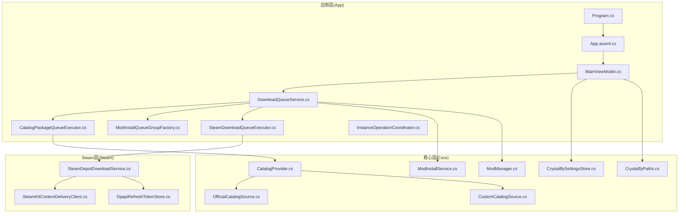
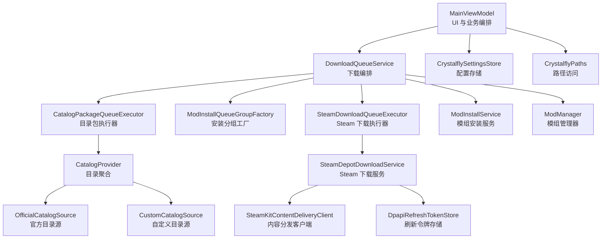
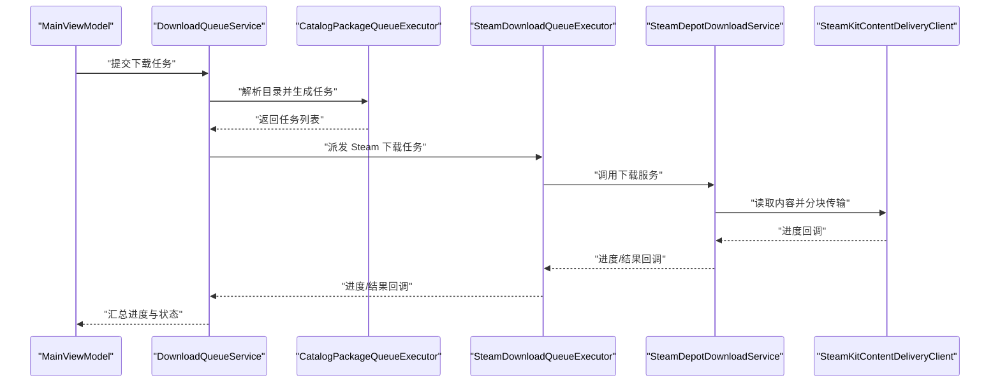
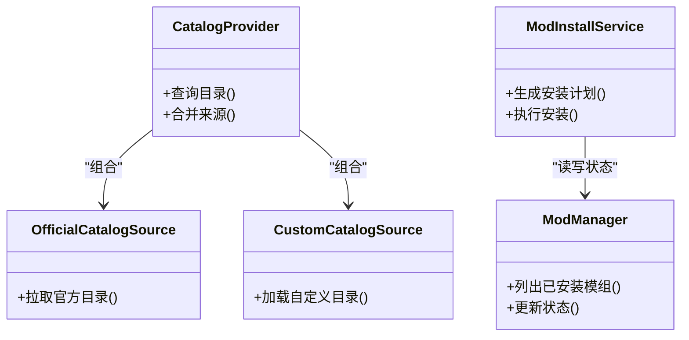
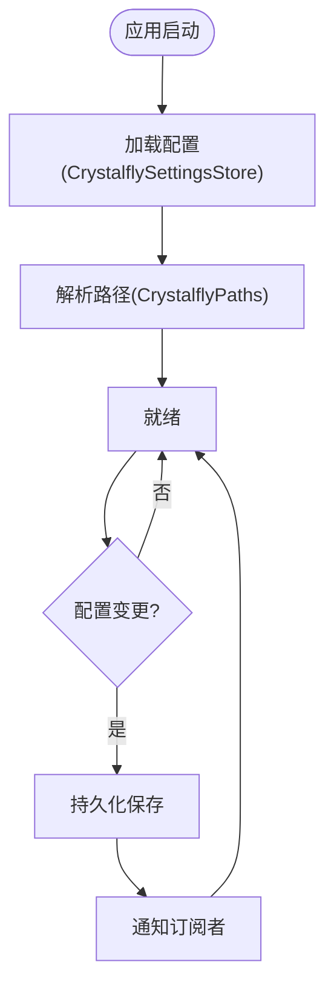
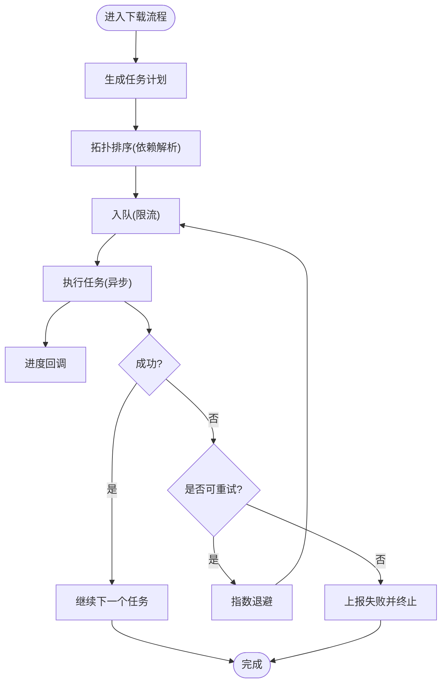
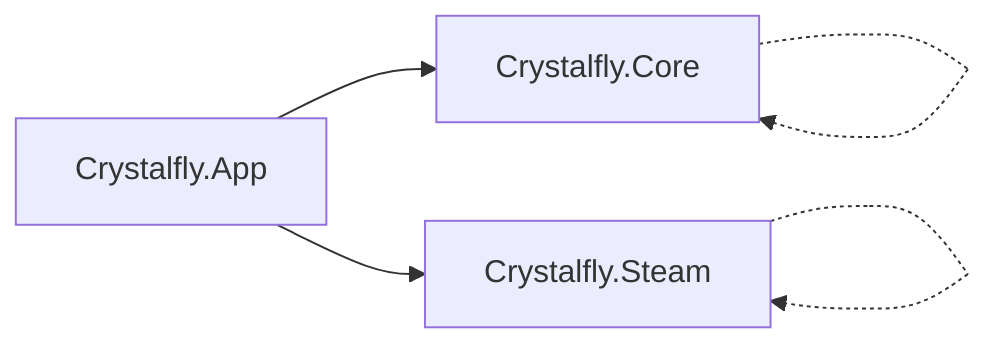

# 模块间通信

<cite>
**本文引用的文件**   
- [Program.cs](file://src/Crystalfly.App/Program.cs)
- [App.axaml.cs](file://src/Crystalfly.App/App.axaml.cs)
- [MainViewModel.cs](file://src/Crystalfly.App/ViewModels/MainViewModel.cs)
- [DownloadQueueService.cs](file://src/Crystalfly.App/Downloads/DownloadQueueService.cs)
- [CatalogPackageQueueExecutor.cs](file://src/Crystalfly.App/Downloads/CatalogPackageQueueExecutor.cs)
- [ModInstallQueueGroupFactory.cs](file://src/Crystalfly.App/Downloads/ModInstallQueueGroupFactory.cs)
- [SteamDownloadQueueExecutor.cs](file://src/Crystalfly.App/Downloads/SteamDownloadQueueExecutor.cs)
- [InstanceOperationCoordinator.cs](file://src/Crystalfly.App/Downloads/InstanceOperationCoordinator.cs)
- [CrystalflySettingsStore.cs](file://src/Crystalfly.Core/Configuration/CrystalflySettingsStore.cs)
- [CrystalflyPaths.cs](file://src/Crystalfly.Core/Configuration/CrystalflyPaths.cs)
- [ModInstallService.cs](file://src/Crystalfly.Core/Mods/ModInstallService.cs)
- [ModManager.cs](file://src/Crystalfly.Core/Mods/ModManager.cs)
- [CatalogProvider.cs](file://src/Crystalfly.Core/Catalog/CatalogProvider.cs)
- [OfficialCatalogSource.cs](file://src/Crystalfly.Core/Catalog/OfficialCatalogSource.cs)
- [CustomCatalogSource.cs](file://src/Crystalfly.Core/Catalog/CustomCatalogSource.cs)
- [SteamDepotDownloadService.cs](file://src/Crystalfly.Steam/Downloads/SteamDepotDownloadService.cs)
- [SteamKitContentDeliveryClient.cs](file://src/Crystalfly.Steam/Downloads/SteamKitContentDeliveryClient.cs)
- [DpapiRefreshTokenStore.cs](file://src/Crystalfly.Steam/Security/DpapiRefreshTokenStore.cs)
</cite>

## 目录
1. [简介](#简介)
2. [项目结构](#项目结构)
3. [核心组件](#核心组件)
4. [架构总览](#架构总览)
5. [详细组件分析](#详细组件分析)
6. [依赖关系分析](#依赖关系分析)
7. [性能考虑](#性能考虑)
8. [故障排查指南](#故障排查指南)
9. [结论](#结论)
10. [附录](#附录)

## 简介
本设计文档聚焦 Crystalfly 项目的模块间通信机制，围绕三个核心项目（应用层 App、领域与基础设施 Core、Steam 集成 Steam）之间的依赖关系与数据流向展开。重点说明：
- 依赖注入容器的配置与服务注册方式
- 跨模块的事件驱动通信模式（事件发布订阅、回调）
- 配置管理的统一访问接口与设置同步
- 异常处理与日志的跨模块传递
- 异步操作与任务协调的实现模式
- 模块间调用的最佳实践示例与注意事项
- 性能与线程安全考量

## 项目结构
从工程维度看，系统分为三层：
- 应用层（Crystalfly.App）：负责 UI、用户交互、下载队列编排、实例操作协调等
- 核心层（Crystalfly.Core）：提供领域服务（模组安装、目录管理、快照、事务、序列化、运行时、网络路由等）
- Steam 层（Crystalfly.Steam）：封装 Steam 认证、令牌持久化、内容分发客户端与下载服务

图表来源
- [Program.cs:1-200](file://src/Crystalfly.App/Program.cs#L1-L200)
- [App.axaml.cs:1-200](file://src/Crystalfly.App/App.axaml.cs#L1-L200)
- [MainViewModel.cs:1-200](file://src/Crystalfly.App/ViewModels/MainViewModel.cs#L1-L200)
- [DownloadQueueService.cs:1-200](file://src/Crystalfly.App/Downloads/DownloadQueueService.cs#L1-L200)
- [CatalogPackageQueueExecutor.cs:1-200](file://src/Crystalfly.App/Downloads/CatalogPackageQueueExecutor.cs#L1-L200)
- [ModInstallQueueGroupFactory.cs:1-200](file://src/Crystalfly.App/Downloads/ModInstallQueueGroupFactory.cs#L1-L200)
- [SteamDownloadQueueExecutor.cs:1-200](file://src/Crystalfly.App/Downloads/SteamDownloadQueueExecutor.cs#L1-L200)
- [InstanceOperationCoordinator.cs:1-200](file://src/Crystalfly.App/Downloads/InstanceOperationCoordinator.cs#L1-L200)
- [CrystalflySettingsStore.cs:1-200](file://src/Crystalfly.Core/Configuration/CrystalflySettingsStore.cs#L1-L200)
- [CrystalflyPaths.cs:1-200](file://src/Crystalfly.Core/Configuration/CrystalflyPaths.cs#L1-L200)
- [ModInstallService.cs:1-200](file://src/Crystalfly.Core/Mods/ModInstallService.cs#L1-L200)
- [ModManager.cs:1-200](file://src/Crystalfly.Core/Mods/ModManager.cs#L1-L200)
- [CatalogProvider.cs:1-200](file://src/Crystalfly.Core/Catalog/CatalogProvider.cs#L1-L200)
- [OfficialCatalogSource.cs:1-200](file://src/Crystalfly.Core/Catalog/OfficialCatalogSource.cs#L1-L200)
- [CustomCatalogSource.cs:1-200](file://src/Crystalfly.Core/Catalog/CustomCatalogSource.cs#L1-L200)
- [SteamDepotDownloadService.cs:1-200](file://src/Crystalfly.Steam/Downloads/SteamDepotDownloadService.cs#L1-L200)
- [SteamKitContentDeliveryClient.cs:1-200](file://src/Crystalfly.Steam/Downloads/SteamKitContentDeliveryClient.cs#L1-L200)
- [DpapiRefreshTokenStore.cs:1-200](file://src/Crystalfly.Steam/Security/DpapiRefreshTokenStore.cs#L1-L200)

章节来源
- [Program.cs:1-200](file://src/Crystalfly.App/Program.cs#L1-L200)
- [App.axaml.cs:1-200](file://src/Crystalfly.App/App.axaml.cs#L1-L200)

## 核心组件
- 应用启动与容器装配
  - Program.cs 负责创建并配置依赖注入容器，注册各模块服务，构建根服务提供者，随后启动 UI。
  - App.axaml.cs 在应用生命周期中获取并使用容器中的服务（如 ViewModel、服务单例）。
- 下载队列与执行器
  - DownloadQueueService 作为下载编排中心，聚合进度、调度组工厂与具体执行器。
  - CatalogPackageQueueExecutor 基于目录清单进行包级下载编排。
  - ModInstallQueueGroupFactory 按模组安装场景生成下载分组。
  - SteamDownloadQueueExecutor 对接 Steam 下载能力。
- 核心服务
  - ModInstallService/ModManager 提供模组安装、依赖解析与状态管理。
  - CatalogProvider 聚合官方与自定义目录源，为上层提供统一的目录查询。
  - CrystalflySettingsStore/CrystalflyPaths 提供配置与路径的统一访问。
- Steam 集成
  - SteamDepotDownloadService 封装 Depot 下载流程，内部使用 SteamKitContentDeliveryClient 与 DpapiRefreshTokenStore。

章节来源
- [Program.cs:1-200](file://src/Crystalfly.App/Program.cs#L1-L200)
- [App.axaml.cs:1-200](file://src/Crystalfly.App/App.axaml.cs#L1-L200)
- [DownloadQueueService.cs:1-200](file://src/Crystalfly.App/Downloads/DownloadQueueService.cs#L1-L200)
- [CatalogPackageQueueExecutor.cs:1-200](file://src/Crystalfly.App/Downloads/CatalogPackageQueueExecutor.cs#L1-L200)
- [ModInstallQueueGroupFactory.cs:1-200](file://src/Crystalfly.App/Downloads/ModInstallQueueGroupFactory.cs#L1-L200)
- [SteamDownloadQueueExecutor.cs:1-200](file://src/Crystalfly.App/Downloads/SteamDownloadQueueExecutor.cs#L1-L200)
- [ModInstallService.cs:1-200](file://src/Crystalfly.Core/Mods/ModInstallService.cs#L1-L200)
- [ModManager.cs:1-200](file://src/Crystalfly.Core/Mods/ModManager.cs#L1-L200)
- [CatalogProvider.cs:1-200](file://src/Crystalfly.Core/Catalog/CatalogProvider.cs#L1-L200)
- [OfficialCatalogSource.cs:1-200](file://src/Crystalfly.Core/Catalog/OfficialCatalogSource.cs#L1-L200)
- [CustomCatalogSource.cs:1-200](file://src/Crystalfly.Core/Catalog/CustomCatalogSource.cs#L1-L200)
- [CrystalflySettingsStore.cs:1-200](file://src/Crystalfly.Core/Configuration/CrystalflySettingsStore.cs#L1-L200)
- [CrystalflyPaths.cs:1-200](file://src/Crystalfly.Core/Configuration/CrystalflyPaths.cs#L1-L200)
- [SteamDepotDownloadService.cs:1-200](file://src/Crystalfly.Steam/Downloads/SteamDepotDownloadService.cs#L1-L200)
- [SteamKitContentDeliveryClient.cs:1-200](file://src/Crystalfly.Steam/Downloads/SteamKitContentDeliveryClient.cs#L1-L200)
- [DpapiRefreshTokenStore.cs:1-200](file://src/Crystalfly.Steam/Security/DpapiRefreshTokenStore.cs#L1-L200)

## 架构总览
下图展示了三个核心项目间的依赖与调用方向，以及关键数据流（配置、目录、下载任务、进度与结果）。

图表来源
- [MainViewModel.cs:1-200](file://src/Crystalfly.App/ViewModels/MainViewModel.cs#L1-L200)
- [DownloadQueueService.cs:1-200](file://src/Crystalfly.App/Downloads/DownloadQueueService.cs#L1-L200)
- [CatalogPackageQueueExecutor.cs:1-200](file://src/Crystalfly.App/Downloads/CatalogPackageQueueExecutor.cs#L1-L200)
- [ModInstallQueueGroupFactory.cs:1-200](file://src/Crystalfly.App/Downloads/ModInstallQueueGroupFactory.cs#L1-L200)
- [SteamDownloadQueueExecutor.cs:1-200](file://src/Crystalfly.App/Downloads/SteamDownloadQueueExecutor.cs#L1-L200)
- [CatalogProvider.cs:1-200](file://src/Crystalfly.Core/Catalog/CatalogProvider.cs#L1-L200)
- [OfficialCatalogSource.cs:1-200](file://src/Crystalfly.Core/Catalog/OfficialCatalogSource.cs#L1-L200)
- [CustomCatalogSource.cs:1-200](file://src/Crystalfly.Core/Catalog/CustomCatalogSource.cs#L1-L200)
- [SteamDepotDownloadService.cs:1-200](file://src/Crystalfly.Steam/Downloads/SteamDepotDownloadService.cs#L1-L200)
- [SteamKitContentDeliveryClient.cs:1-200](file://src/Crystalfly.Steam/Downloads/SteamKitContentDeliveryClient.cs#L1-L200)
- [DpapiRefreshTokenStore.cs:1-200](file://src/Crystalfly.Steam/Security/DpapiRefreshTokenStore.cs#L1-L200)
- [CrystalflySettingsStore.cs:1-200](file://src/Crystalfly.Core/Configuration/CrystalflySettingsStore.cs#L1-L200)
- [CrystalflyPaths.cs:1-200](file://src/Crystalfly.Core/Configuration/CrystalflyPaths.cs#L1-L200)
- [ModInstallService.cs:1-200](file://src/Crystalfly.Core/Mods/ModInstallService.cs#L1-L200)
- [ModManager.cs:1-200](file://src/Crystalfly.Core/Mods/ModManager.cs#L1-L200)

## 详细组件分析

### 依赖注入容器与服务注册
- 容器初始化
  - Program.cs 中创建服务容器，注册 UI、Core、Steam 相关服务，构建根 ServiceProvider。
  - App.axaml.cs 在应用启动阶段从容器中解析所需服务（如 MainViewModel），完成视图绑定。
- 服务生命周期
  - 典型的服务以单例或作用域形式注册，确保跨模块共享同一实例（如配置、路径、下载服务）。
- 扩展点
  - 通过工厂类（如 ModInstallQueueGroupFactory）按需创建特定场景的执行器，降低耦合度。

章节来源
- [Program.cs:1-200](file://src/Crystalfly.App/Program.cs#L1-L200)
- [App.axaml.cs:1-200](file://src/Crystalfly.App/App.axaml.cs#L1-L200)
- [ModInstallQueueGroupFactory.cs:1-200](file://src/Crystalfly.App/Downloads/ModInstallQueueGroupFactory.cs#L1-L200)

### 下载队列与执行器协作
- 角色分工
  - DownloadQueueService：维护下载任务集合、进度聚合、并发控制与错误重试策略。
  - CatalogPackageQueueExecutor：根据目录清单生成下载任务，协调多包并行。
  - ModInstallQueueGroupFactory：按模组安装计划生成下载分组，支持依赖顺序。
  - SteamDownloadQueueExecutor：将任务委派给 Steam 下载服务，处理凭证与断点续传。
- 数据流
  - 输入：目录项/安装计划 → 输出：下载进度事件 → 最终：安装/校验结果。
- 回调与事件
  - 通过事件或回调通知 UI 更新进度与状态；失败时向上抛出结构化异常以便统一处理。

图表来源
- [DownloadQueueService.cs:1-200](file://src/Crystalfly.App/Downloads/DownloadQueueService.cs#L1-L200)
- [CatalogPackageQueueExecutor.cs:1-200](file://src/Crystalfly.App/Downloads/CatalogPackageQueueExecutor.cs#L1-L200)
- [SteamDownloadQueueExecutor.cs:1-200](file://src/Crystalfly.App/Downloads/SteamDownloadQueueExecutor.cs#L1-L200)
- [SteamDepotDownloadService.cs:1-200](file://src/Crystalfly.Steam/Downloads/SteamDepotDownloadService.cs#L1-L200)
- [SteamKitContentDeliveryClient.cs:1-200](file://src/Crystalfly.Steam/Downloads/SteamKitContentDeliveryClient.cs#L1-L200)

章节来源
- [DownloadQueueService.cs:1-200](file://src/Crystalfly.App/Downloads/DownloadQueueService.cs#L1-L200)
- [CatalogPackageQueueExecutor.cs:1-200](file://src/Crystalfly.App/Downloads/CatalogPackageQueueExecutor.cs#L1-L200)
- [ModInstallQueueGroupFactory.cs:1-200](file://src/Crystalfly.App/Downloads/ModInstallQueueGroupFactory.cs#L1-L200)
- [SteamDownloadQueueExecutor.cs:1-200](file://src/Crystalfly.App/Downloads/SteamDownloadQueueExecutor.cs#L1-L200)

### 目录与模组服务
- 目录聚合
  - CatalogProvider 组合 OfficialCatalogSource 与 CustomCatalogSource，对外暴露统一查询接口。
- 模组安装
  - ModInstallService 负责安装计划生成与执行；ModManager 维护已安装模组元数据与状态。
- 数据一致性
  - 通过事务与快照机制保证安装过程的可回滚与可观测性。

图表来源
- [CatalogProvider.cs:1-200](file://src/Crystalfly.Core/Catalog/CatalogProvider.cs#L1-L200)
- [OfficialCatalogSource.cs:1-200](file://src/Crystalfly.Core/Catalog/OfficialCatalogSource.cs#L1-L200)
- [CustomCatalogSource.cs:1-200](file://src/Crystalfly.Core/Catalog/CustomCatalogSource.cs#L1-L200)
- [ModInstallService.cs:1-200](file://src/Crystalfly.Core/Mods/ModInstallService.cs#L1-L200)
- [ModManager.cs:1-200](file://src/Crystalfly.Core/Mods/ModManager.cs#L1-L200)

章节来源
- [CatalogProvider.cs:1-200](file://src/Crystalfly.Core/Catalog/CatalogProvider.cs#L1-L200)
- [OfficialCatalogSource.cs:1-200](file://src/Crystalfly.Core/Catalog/OfficialCatalogSource.cs#L1-L200)
- [CustomCatalogSource.cs:1-200](file://src/Crystalfly.Core/Catalog/CustomCatalogSource.cs#L1-L200)
- [ModInstallService.cs:1-200](file://src/Crystalfly.Core/Mods/ModInstallService.cs#L1-L200)
- [ModManager.cs:1-200](file://src/Crystalfly.Core/Mods/ModManager.cs#L1-L200)

### 配置管理与设置同步
- 统一访问接口
  - CrystalflySettingsStore 提供配置的读取与写入；CrystalflyPaths 提供路径常量与动态路径解析。
- 设置同步
  - 应用启动时从存储加载配置到内存；运行期变更触发持久化与广播（供其他模块监听）。
- 线程安全
  - 对配置读写加锁或使用不可变对象+原子替换，避免竞态条件。

图表来源
- [CrystalflySettingsStore.cs:1-200](file://src/Crystalfly.Core/Configuration/CrystalflySettingsStore.cs#L1-L200)
- [CrystalflyPaths.cs:1-200](file://src/Crystalfly.Core/Configuration/CrystalflyPaths.cs#L1-L200)

章节来源
- [CrystalflySettingsStore.cs:1-200](file://src/Crystalfly.Core/Configuration/CrystalflySettingsStore.cs#L1-L200)
- [CrystalflyPaths.cs:1-200](file://src/Crystalfly.Core/Configuration/CrystalflyPaths.cs#L1-L200)

### 异常处理与日志记录
- 异常传播
  - 底层服务抛出结构化异常（含上下文信息），上层捕获后转换为用户可读的错误码与提示。
- 日志贯穿
  - 关键路径（下载、安装、配置变更）记录结构化日志，便于追踪问题链路。
- 重试与降级
  - 对网络请求与 I/O 操作实现指数退避重试；失败时降级到本地缓存或离线模式。

章节来源
- [DownloadQueueService.cs:1-200](file://src/Crystalfly.App/Downloads/DownloadQueueService.cs#L1-L200)
- [SteamDepotDownloadService.cs:1-200](file://src/Crystalfly.Steam/Downloads/SteamDepotDownloadService.cs#L1-L200)
- [CrystalflySettingsStore.cs:1-200](file://src/Crystalfly.Core/Configuration/CrystalflySettingsStore.cs#L1-L200)

### 异步操作与任务协调
- 并发控制
  - 使用信号量/限流器限制并发下载数，避免资源争用。
- 任务编排
  - 基于任务图/依赖关系（如模组依赖）进行拓扑排序，确保正确执行顺序。
- 取消与超时
  - 所有长耗时操作支持 CancellationToken，配合超时策略提升健壮性。

图表来源
- [DownloadQueueService.cs:1-200](file://src/Crystalfly.App/Downloads/DownloadQueueService.cs#L1-L200)
- [ModInstallService.cs:1-200](file://src/Crystalfly.Core/Mods/ModInstallService.cs#L1-L200)

章节来源
- [DownloadQueueService.cs:1-200](file://src/Crystalfly.App/Downloads/DownloadQueueService.cs#L1-L200)
- [ModInstallService.cs:1-200](file://src/Crystalfly.Core/Mods/ModInstallService.cs#L1-L200)

### 事件驱动通信与回调机制
- 事件模型
  - 采用“发布者-订阅者”模式：下载进度、安装状态、配置变更等作为事件源。
- 回调契约
  - 定义清晰的回调接口，包含必要上下文（任务 ID、进度百分比、错误码）。
- 线程切换
  - 后台线程产生事件，UI 线程消费事件，避免跨线程访问 UI 控件。

章节来源
- [DownloadQueueService.cs:1-200](file://src/Crystalfly.App/Downloads/DownloadQueueService.cs#L1-L200)
- [MainViewModel.cs:1-200](file://src/Crystalfly.App/ViewModels/MainViewModel.cs#L1-L200)

### 最佳实践示例（模块间调用）
- 从 UI 发起模组安装
  - MainViewModel 调用 ModInstallService 生成安装计划，再通过 DownloadQueueService 编排下载与安装。
- 使用目录服务查询可用模组
  - CatalogProvider 聚合官方与自定义目录，返回统一结果集供 UI 展示。
- 通过 Steam 下载大型资产
  - SteamDownloadQueueExecutor 委托 SteamDepotDownloadService，内部使用 SteamKitContentDeliveryClient 与令牌存储。

章节来源
- [MainViewModel.cs:1-200](file://src/Crystalfly.App/ViewModels/MainViewModel.cs#L1-L200)
- [ModInstallService.cs:1-200](file://src/Crystalfly.Core/Mods/ModInstallService.cs#L1-L200)
- [CatalogProvider.cs:1-200](file://src/Crystalfly.Core/Catalog/CatalogProvider.cs#L1-L200)
- [SteamDownloadQueueExecutor.cs:1-200](file://src/Crystalfly.App/Downloads/SteamDownloadQueueExecutor.cs#L1-L200)
- [SteamDepotDownloadService.cs:1-200](file://src/Crystalfly.Steam/Downloads/SteamDepotDownloadService.cs#L1-L200)
- [SteamKitContentDeliveryClient.cs:1-200](file://src/Crystalfly.Steam/Downloads/SteamKitContentDeliveryClient.cs#L1-L200)
- [DpapiRefreshTokenStore.cs:1-200](file://src/Crystalfly.Steam/Security/DpapiRefreshTokenStore.cs#L1-L200)

## 依赖关系分析
- 项目间依赖
  - App 依赖 Core 与 Steam；Core 不依赖 App/Steam；Steam 仅依赖自身与安全/网络库。
- 模块内依赖
  - 下载子系统强依赖目录与模组服务；Steam 下载服务依赖内容分发客户端与令牌存储。
- 潜在循环
  - 当前分层清晰，未见循环依赖；建议保持单向依赖原则。

图表来源
- [Program.cs:1-200](file://src/Crystalfly.App/Program.cs#L1-L200)
- [App.axaml.cs:1-200](file://src/Crystalfly.App/App.axaml.cs#L1-L200)

章节来源
- [Program.cs:1-200](file://src/Crystalfly.App/Program.cs#L1-L200)
- [App.axaml.cs:1-200](file://src/Crystalfly.App/App.axaml.cs#L1-L200)

## 性能考虑
- 并发与吞吐
  - 合理设置最大并发下载数，结合磁盘 I/O 与网络带宽进行自适应调整。
- 缓存与去重
  - 对目录查询结果与已下载文件进行缓存与去重，减少重复工作。
- 内存占用
  - 大文件分块处理，及时释放临时资源；避免一次性加载大量元数据。
- 背压与节流
  - 当 UI 或下游服务过载时，主动降速或暂停任务，保障整体稳定性。

[本节为通用指导，无需源码引用]

## 故障排查指南
- 常见问题定位
  - 下载失败：检查网络连通性、令牌有效性、磁盘空间与权限。
  - 安装失败：查看依赖解析结果与事务回滚日志。
  - 配置不同步：确认持久化路径与进程间同步机制。
- 诊断手段
  - 启用结构化日志，收集任务 ID、错误码与堆栈。
  - 使用 InstanceOperationCoordinator 提供的协调接口观察任务状态机。

章节来源
- [InstanceOperationCoordinator.cs:1-200](file://src/Crystalfly.App/Downloads/InstanceOperationCoordinator.cs#L1-L200)
- [DownloadQueueService.cs:1-200](file://src/Crystalfly.App/Downloads/DownloadQueueService.cs#L1-L200)
- [CrystalflySettingsStore.cs:1-200](file://src/Crystalfly.Core/Configuration/CrystalflySettingsStore.cs#L1-L200)

## 结论
Crystalfly 通过清晰的三层架构与依赖注入容器，实现了模块间松耦合的通信。下载队列与执行器协同工作，目录与模组服务提供稳定的领域能力，Steam 集成封装了复杂的外部依赖。事件驱动与回调机制保证了良好的可扩展性与响应性。遵循本文的最佳实践与性能建议，可在保证稳定性的同时获得良好的用户体验。

[本节为总结，无需源码引用]

## 附录
- 术语
  - 目录：模组元数据集合，用于发现与选择模组。
  - 任务：一次具体的下载或安装动作，具备唯一标识与状态。
  - 令牌：用于访问受保护资源的短期凭据。
- 参考
  - 依赖注入容器配置入口：Program.cs
  - 应用生命周期与 UI 绑定：App.axaml.cs
  - 下载编排与执行：DownloadQueueService、CatalogPackageQueueExecutor、SteamDownloadQueueExecutor
  - 目录与模组服务：CatalogProvider、ModInstallService、ModManager
  - Steam 集成：SteamDepotDownloadService、SteamKitContentDeliveryClient、DpapiRefreshTokenStore