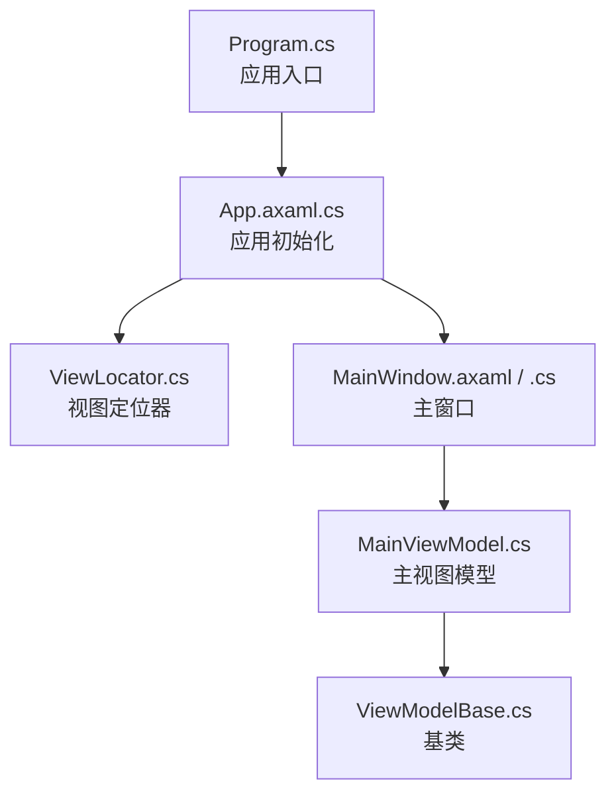
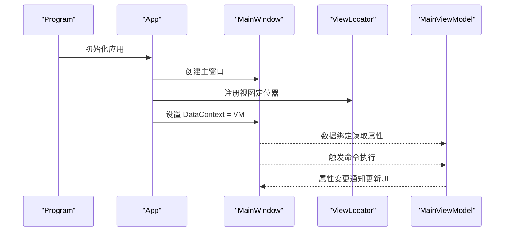
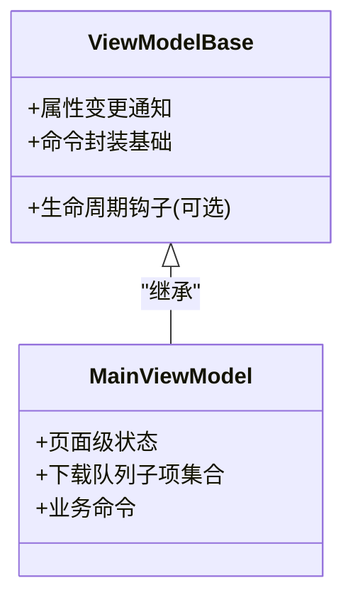
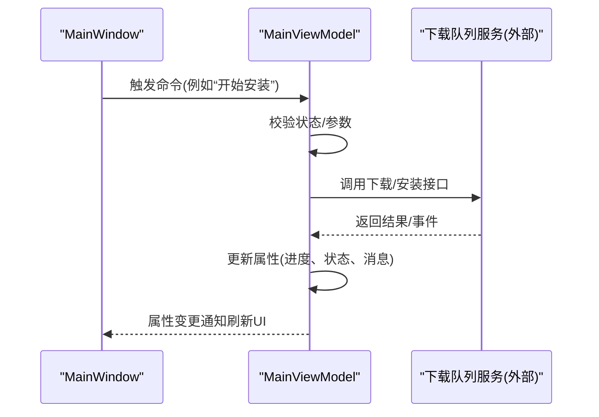
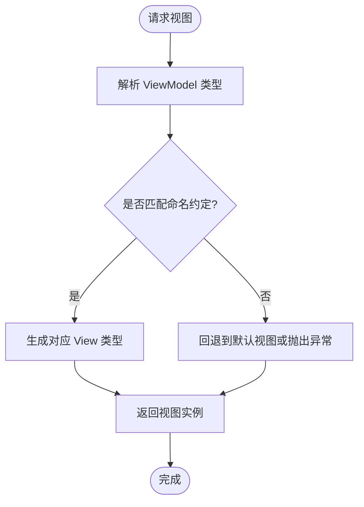
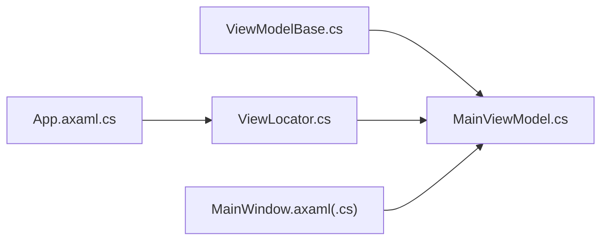

# MVVM 模式实现

<cite>
**本文引用的文件**   
- [ViewModelBase.cs](file://src/Crystalfly.App/ViewModels/ViewModelBase.cs)
- [MainViewModel.cs](file://src/Crystalfly.App/ViewModels/MainViewModel.cs)
- [MainViewModel.DownloadQueue.cs](file://src/Crystalfly.App/ViewModels/MainViewModel.DownloadQueue.cs)
- [ViewLocator.cs](file://src/Crystalfly.App/ViewLocator.cs)
- [MainWindow.axaml](file://src/Crystalfly.App/Views/MainWindow.axaml)
- [MainWindow.axaml.cs](file://src/Crystalfly.App/Views/MainWindow.axaml.cs)
- [App.axaml.cs](file://src/Crystalfly.App/App.axaml.cs)
- [Program.cs](file://src/Crystalfly.App/Program.cs)
</cite>

## 目录
1. [简介](#简介)
2. [项目结构](#项目结构)
3. [核心组件](#核心组件)
4. [架构总览](#架构总览)
5. [详细组件分析](#详细组件分析)
6. [依赖关系分析](#依赖关系分析)
7. [性能考虑](#性能考虑)
8. [故障排查指南](#故障排查指南)
9. [结论](#结论)
10. [附录](#附录)

## 简介
本文件聚焦于 Crystalfly 项目在 Avalonia UI 中的 MVVM（Model-View-ViewModel）实现，系统性阐述以下主题：
- ViewModelBase 基类的设计与职责
- 数据绑定机制与属性变更通知
- 命令模式的实现与使用
- MainViewModel 的职责划分与状态管理
- ViewLocator 的视图定位机制
- XAML 与 C# 代码分离原则
- 双向数据绑定、命令处理、状态管理的实践示例路径
- 如何扩展和自定义 ViewModel 以支持新业务需求

## 项目结构
MVVM 相关代码主要位于 App 层：
- ViewModels：包含 ViewModelBase、MainViewModel 及其子模块、对话框 ViewModel 等
- Views：XAML 界面与对应的后置代码
- ViewLocator：负责根据类型或命名约定将 ViewModel 映射到对应 View
- App 启动流程：Program -> App -> MainWindow，并在 App 中注册 ViewLocator

图表来源
- [Program.cs](file://src/Crystalfly.App/Program.cs)
- [App.axaml.cs](file://src/Crystalfly.App/App.axaml.cs)
- [ViewLocator.cs](file://src/Crystalfly.App/ViewLocator.cs)
- [MainWindow.axaml](file://src/Crystalfly.App/Views/MainWindow.axaml)
- [MainWindow.axaml.cs](file://src/Crystalfly.App/Views/MainWindow.axaml.cs)
- [MainViewModel.cs](file://src/Crystalfly.App/ViewModels/MainViewModel.cs)
- [ViewModelBase.cs](file://src/Crystalfly.App/ViewModels/ViewModelBase.cs)

章节来源
- [Program.cs](file://src/Crystalfly.App/Program.cs)
- [App.axaml.cs](file://src/Crystalfly.App/App.axaml.cs)
- [ViewLocator.cs](file://src/Crystalfly.App/ViewLocator.cs)
- [MainWindow.axaml](file://src/Crystalfly.App/Views/MainWindow.axaml)
- [MainWindow.axaml.cs](file://src/Crystalfly.App/Views/MainWindow.axaml.cs)
- [MainViewModel.cs](file://src/Crystalfly.App/ViewModels/MainViewModel.cs)
- [ViewModelBase.cs](file://src/Crystalfly.App/ViewModels/ViewModelBase.cs)

## 核心组件
本节概述 MVVM 在 Avalonia 中的关键构件与职责边界。

- ViewModelBase
  - 提供属性变更通知能力，供派生 ViewModel 通过属性暴露状态
  - 为命令封装提供基础支持（如可执行性判断、异步执行包装等）
  - 建议所有业务 ViewModel 继承该基类以获得一致的响应式行为

- MainViewModel
  - 作为主窗口的视图模型，聚合页面级状态与交互逻辑
  - 组织下载队列相关的子项 ViewModel（见 MainViewModel.DownloadQueue.cs）
  - 协调 UI 状态（如加载、错误、成功提示）与底层服务调用

- ViewLocator
  - 在运行时根据 ViewModel 类型解析出对应 View 类型
  - 通常基于命名约定（例如 XxxViewModel -> XxxView）或显式映射表

- 数据绑定与命令
  - 通过 Avalonia 的数据绑定系统，将 View 控件属性与 ViewModel 属性关联
  - 命令用于封装用户操作（点击、输入校验、异步任务），并控制按钮可用性等

章节来源
- [ViewModelBase.cs](file://src/Crystalfly.App/ViewModels/ViewModelBase.cs)
- [MainViewModel.cs](file://src/Crystalfly.App/ViewModels/MainViewModel.cs)
- [MainViewModel.DownloadQueue.cs](file://src/Crystalfly.App/ViewModels/MainViewModel.DownloadQueue.cs)
- [ViewLocator.cs](file://src/Crystalfly.App/ViewLocator.cs)

## 架构总览
下图展示 MVVM 在 Crystalfly 中的整体协作关系：程序启动后创建主窗口，设置 DataContext 为 MainViewModel；ViewLocator 负责将 ViewModel 实例映射到具体 View；UI 通过数据绑定与命令与 ViewModel 交互。

图表来源
- [Program.cs](file://src/Crystalfly.App/Program.cs)
- [App.axaml.cs](file://src/Crystalfly.App/App.axaml.cs)
- [ViewLocator.cs](file://src/Crystalfly.App/ViewLocator.cs)
- [MainWindow.axaml.cs](file://src/Crystalfly.App/Views/MainWindow.axaml.cs)
- [MainViewModel.cs](file://src/Crystalfly.App/ViewModels/MainViewModel.cs)

## 详细组件分析

### ViewModelBase 基类设计
- 目标
  - 统一属性变更通知的实现方式，减少样板代码
  - 提供命令封装的基础设施（可执行性、异步执行、异常处理）
- 典型能力
  - 属性变更通知：通过受保护的辅助方法触发 PropertyChanged
  - 命令封装：提供可重用的命令基类或工厂方法，支持 IsEnabled 控制
  - 生命周期钩子：可选的初始化/销毁钩子，便于资源管理
- 扩展点
  - 派生类只需关注业务属性与命令，无需重复实现通知逻辑
  - 可在基类中注入日志、诊断、取消令牌等横切关注点

章节来源
- [ViewModelBase.cs](file://src/Crystalfly.App/ViewModels/ViewModelBase.cs)

#### 类图（概念映射）

图表来源
- [ViewModelBase.cs](file://src/Crystalfly.App/ViewModels/ViewModelBase.cs)
- [MainViewModel.cs](file://src/Crystalfly.App/ViewModels/MainViewModel.cs)

### MainViewModel 主视图模型
- 职责
  - 维护主窗口所需的全部 UI 状态（列表、选中项、提示信息等）
  - 编排下载队列相关逻辑（分组、进度聚合、状态同步）
  - 对外暴露命令，驱动用户交互（安装、修复、重试等）
- 组织结构
  - 主文件定义核心状态与命令
  - 分文件组织下载队列相关逻辑（MainViewModel.DownloadQueue.cs），提升可读性与可维护性
- 与 View 的交互
  - 通过数据绑定暴露集合与属性
  - 通过命令处理用户操作，并更新 UI 状态

章节来源
- [MainViewModel.cs](file://src/Crystalfly.App/ViewModels/MainViewModel.cs)
- [MainViewModel.DownloadQueue.cs](file://src/Crystalfly.App/ViewModels/MainViewModel.DownloadQueue.cs)

#### 序列图（命令执行流程）

图表来源
- [MainViewModel.cs](file://src/Crystalfly.App/ViewModels/MainViewModel.cs)
- [MainWindow.axaml.cs](file://src/Crystalfly.App/Views/MainWindow.axaml.cs)

### ViewLocator 视图定位机制
- 作用
  - 在运行时将 ViewModel 类型解析为对应的 View 类型
  - 简化 XAML 中 DataContext 的设置，避免硬编码
- 常见策略
  - 命名约定：XxxViewModel -> XxxView
  - 显式映射：字典注册特定类型的映射关系
- 集成位置
  - 通常在应用启动时注册到 Avalonia 的视图定位系统

章节来源
- [ViewLocator.cs](file://src/Crystalfly.App/ViewLocator.cs)
- [App.axaml.cs](file://src/Crystalfly.App/App.axaml.cs)

#### 流程图（视图定位）

图表来源
- [ViewLocator.cs](file://src/Crystalfly.App/ViewLocator.cs)

### XAML 与 C# 代码分离原则
- 原则
  - XAML 仅描述布局与数据绑定声明，不包含业务逻辑
  - C# 代码-behind 仅做最小化桥接（如事件转发、调试断点），业务逻辑放在 ViewModel
- 实践要点
  - 使用 DataContext 指向 ViewModel
  - 通过 x:Name 仅在必要时访问控件，优先使用数据绑定
  - 将复杂交互封装为命令，避免在代码-behind 编写条件分支

章节来源
- [MainWindow.axaml](file://src/Crystalfly.App/Views/MainWindow.axaml)
- [MainWindow.axaml.cs](file://src/Crystalfly.App/Views/MainWindow.axaml.cs)

### 双向数据绑定、命令处理、状态管理示例路径
- 双向数据绑定
  - 在 XAML 中将控件属性与 ViewModel 属性绑定，确保属性变更通知生效
  - 参考路径：[MainWindow.axaml](file://src/Crystalfly.App/Views/MainWindow.axaml)、[ViewModelBase.cs](file://src/Crystalfly.App/ViewModels/ViewModelBase.cs)
- 命令处理
  - 在 ViewModel 中定义命令属性，并在 XAML 中绑定到按钮等控件的命令
  - 参考路径：[MainViewModel.cs](file://src/Crystalfly.App/ViewModels/MainViewModel.cs)
- 状态管理
  - 使用属性表示 UI 状态（加载中、错误信息、成功提示），并通过通知更新界面
  - 参考路径：[MainViewModel.cs](file://src/Crystalfly.App/ViewModels/MainViewModel.cs)、[ViewModelBase.cs](file://src/Crystalfly.App/ViewModels/ViewModelBase.cs)

章节来源
- [MainWindow.axaml](file://src/Crystalfly.App/Views/MainWindow.axaml)
- [MainWindow.axaml.cs](file://src/Crystalfly.App/Views/MainWindow.axaml.cs)
- [MainViewModel.cs](file://src/Crystalfly.App/ViewModels/MainViewModel.cs)
- [ViewModelBase.cs](file://src/Crystalfly.App/ViewModels/ViewModelBase.cs)

### 扩展与自定义 ViewModel
- 新建业务 ViewModel
  - 继承 ViewModelBase，获得属性变更通知与命令基础能力
  - 定义业务属性与命令，保持单一职责
- 注册视图映射
  - 若采用命名约定，遵循 XxxViewModel -> XxxView 规则
  - 若需特殊映射，在 ViewLocator 中添加显式映射
- 组合与复用
  - 将通用功能抽取为可复用的子 ViewModel，在主 ViewModel 中组合
  - 通过构造函数注入服务或依赖，提高可测试性

章节来源
- [ViewModelBase.cs](file://src/Crystalfly.App/ViewModels/ViewModelBase.cs)
- [ViewLocator.cs](file://src/Crystalfly.App/ViewLocator.cs)
- [MainViewModel.cs](file://src/Crystalfly.App/ViewModels/MainViewModel.cs)

## 依赖关系分析
MVVM 层的内部依赖如下：
- MainViewModel 依赖 ViewModelBase
- ViewLocator 被 App 初始化阶段使用，用于解析 View
- MainWindow 通过 DataContext 与 MainViewModel 解耦

图表来源
- [ViewModelBase.cs](file://src/Crystalfly.App/ViewModels/ViewModelBase.cs)
- [MainViewModel.cs](file://src/Crystalfly.App/ViewModels/MainViewModel.cs)
- [ViewLocator.cs](file://src/Crystalfly.App/ViewLocator.cs)
- [App.axaml.cs](file://src/Crystalfly.App/App.axaml.cs)
- [MainWindow.axaml.cs](file://src/Crystalfly.App/Views/MainWindow.axaml.cs)

章节来源
- [ViewModelBase.cs](file://src/Crystalfly.App/ViewModels/ViewModelBase.cs)
- [MainViewModel.cs](file://src/Crystalfly.App/ViewModels/MainViewModel.cs)
- [ViewLocator.cs](file://src/Crystalfly.App/ViewLocator.cs)
- [App.axaml.cs](file://src/Crystalfly.App/App.axaml.cs)
- [MainWindow.axaml.cs](file://src/Crystalfly.App/Views/MainWindow.axaml.cs)

## 性能考虑
- 属性变更通知
  - 批量更新场景下，尽量减少不必要的通知合并，避免频繁 UI 重绘
- 大数据集渲染
  - 使用虚拟化列表控件，结合分页/懒加载，降低内存占用与绘制开销
- 命令与异步
  - 长耗时操作应异步执行，避免阻塞 UI 线程；及时释放资源与取消令牌
- 视图定位
  - 缓存已解析的视图类型映射，避免重复反射带来的性能损耗

## 故障排查指南
- 视图未显示或报类型解析失败
  - 检查 ViewLocator 是否正确注册，以及 ViewModel 与 View 的命名约定是否一致
  - 参考路径：[ViewLocator.cs](file://src/Crystalfly.App/ViewLocator.cs)、[App.axaml.cs](file://src/Crystalfly.App/App.axaml.cs)
- 数据绑定不生效
  - 确认属性实现了变更通知（继承 ViewModelBase 或使用相应机制）
  - 检查 XAML 绑定路径与属性名是否匹配
  - 参考路径：[MainWindow.axaml](file://src/Crystalfly.App/Views/MainWindow.axaml)、[ViewModelBase.cs](file://src/Crystalfly.App/ViewModels/ViewModelBase.cs)
- 命令未触发或按钮不可用
  - 检查命令的 IsEnabled 条件与当前状态
  - 确认 XAML 中 Command 绑定正确
  - 参考路径：[MainViewModel.cs](file://src/Crystalfly.App/ViewModels/MainViewModel.cs)

章节来源
- [ViewLocator.cs](file://src/Crystalfly.App/ViewLocator.cs)
- [App.axaml.cs](file://src/Crystalfly.App/App.axaml.cs)
- [MainWindow.axaml](file://src/Crystalfly.App/Views/MainWindow.axaml)
- [ViewModelBase.cs](file://src/Crystalfly.App/ViewModels/ViewModelBase.cs)
- [MainViewModel.cs](file://src/Crystalfly.App/ViewModels/MainViewModel.cs)

## 结论
Crystalfly 在 Avalonia UI 中采用清晰的 MVVM 分层：ViewModelBase 提供统一的属性与命令基础设施，MainViewModel 承担页面级状态与交互编排，ViewLocator 简化视图解析，XAML 与 C# 严格分离。通过数据绑定与命令模式，UI 与业务逻辑解耦，易于扩展与维护。新增业务可通过继承 ViewModelBase、遵循命名约定与组合子 ViewModel 的方式快速落地。

## 附录
- 术语
  - 数据绑定：将 UI 控件属性与 ViewModel 属性建立关联，自动同步变化
  - 命令：封装用户操作的逻辑对象，支持可执行性判断与异步执行
  - 视图定位：根据 ViewModel 类型解析对应 View 的机制
- 最佳实践
  - 保持 ViewModel 无 UI 细节，专注状态与交互
  - 使用命令替代事件处理，提升可测试性
  - 合理拆分大 ViewModel，按功能域组织子 ViewModel