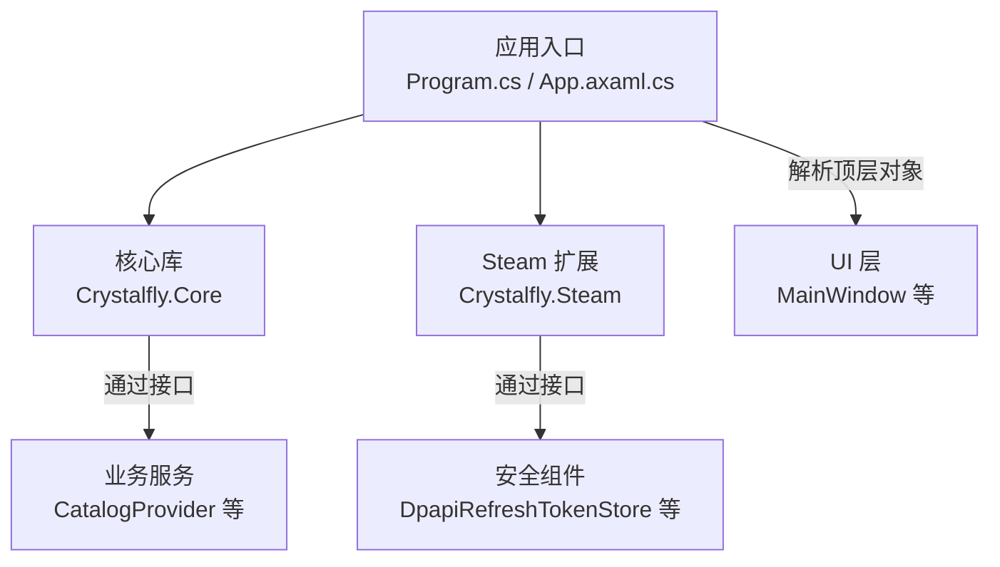
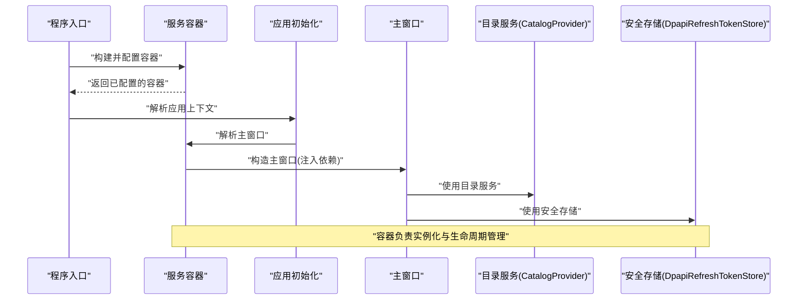
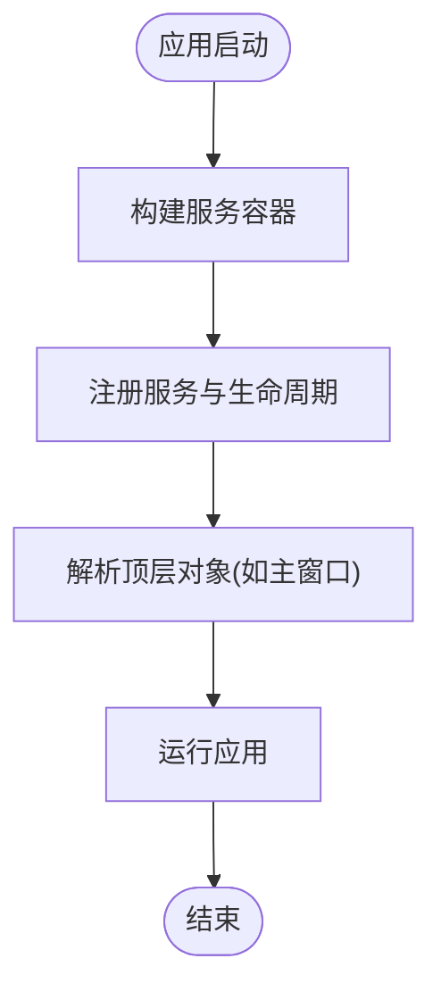
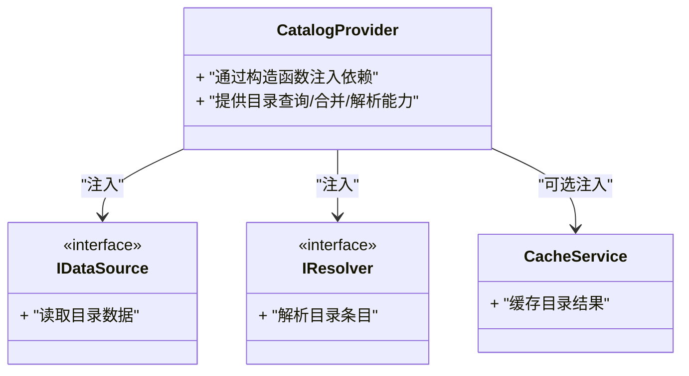
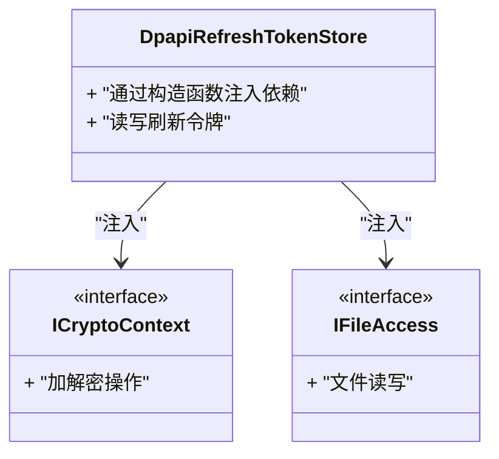
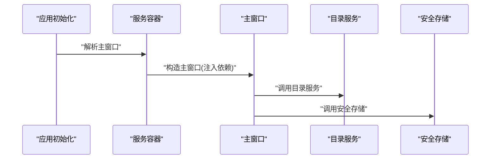
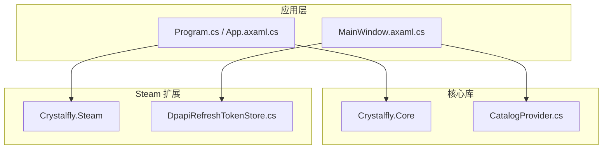

# 依赖注入模式

<cite>
**本文引用的文件**   
- [Program.cs](file://src/Crystalfly.App/Program.cs)
- [App.axaml.cs](file://src/Crystalfly.App/App.axaml.cs)
- [MainWindow.axaml.cs](file://src/Crystalfly.App/Views/MainWindow.axaml.cs)
- [CatalogProvider.cs](file://src/Crystalfly.Core/Catalog/CatalogProvider.cs)
- [DpapiRefreshTokenStore.cs](file://src/Crystalfly.Steam/Security/DpapiRefreshTokenStore.cs)
- [Crystalfly.Core.csproj](file://src/Crystalfly.Core/Crystalfly.Core.csproj)
- [Crystalfly.Steam.csproj](file://src/Crystalfly.Steam/Crystalfly.Steam.csproj)
- [Crystalfly.App.csproj](file://src/Crystalfly.App/Crystalfly.App.csproj)
</cite>

## 目录
1. [简介](#简介)
2. [项目结构](#项目结构)
3. [核心组件](#核心组件)
4. [架构总览](#架构总览)
5. [详细组件分析](#详细组件分析)
6. [依赖关系分析](#依赖关系分析)
7. [性能考虑](#性能考虑)
8. [故障排查指南](#故障排查指南)
9. [结论](#结论)
10. [附录](#附录)

## 简介
本文件聚焦 Crystalfly 项目中依赖注入（DI）模式的实践，围绕 Microsoft.Extensions.DependencyInjection 的使用进行系统化说明。内容涵盖：
- 服务注册与解析的总体流程
- 生命周期管理（Singleton、Scoped、Transient）
- 接口抽象设计与构造函数注入模式
- CatalogProvider 等服务如何通过 DI 获取依赖
- DpapiRefreshTokenStore 等安全组件的服务配置
- 如何添加新服务到容器以及测试策略
- 循环依赖的识别与避免方法

## 项目结构
从应用启动入口到核心模块，DI 贯穿整个系统：
- 应用层负责构建根容器、注册服务、解析顶层对象（如主窗口）
- 核心库提供业务服务（如目录提供者、实例管理等），通过接口暴露能力
- Steam 扩展提供安全与下载相关能力，并通过 DI 集成

图表来源
- [Program.cs](file://src/Crystalfly.App/Program.cs)
- [App.axaml.cs](file://src/Crystalfly.App/App.axaml.cs)
- [Crystalfly.Core.csproj](file://src/Crystalfly.Core/Crystalfly.Core.csproj)
- [Crystalfly.Steam.csproj](file://src/Crystalfly.Steam/Crystalfly.Steam.csproj)
- [Crystalfly.App.csproj](file://src/Crystalfly.App/Crystalfly.App.csproj)

章节来源
- [Program.cs](file://src/Crystalfly.App/Program.cs)
- [App.axaml.cs](file://src/Crystalfly.App/App.axaml.cs)
- [Crystalfly.Core.csproj](file://src/Crystalfly.Core/Crystalfly.Core.csproj)
- [Crystalfly.Steam.csproj](file://src/Crystalfly.Steam/Crystalfly.Steam.csproj)
- [Crystalfly.App.csproj](file://src/Crystalfly.App/Crystalfly.App.csproj)

## 核心组件
- 服务容器与启动
  - 在应用启动阶段创建并配置服务容器，集中注册所有服务及其生命周期
  - 解析顶层对象（例如主窗口或应用控制器），由容器自动完成其依赖注入
- 关键服务示例
  - CatalogProvider：负责目录聚合与解析，通常通过构造函数注入所需的数据源与解析器
  - DpapiRefreshTokenStore：用于刷新令牌的安全存储，通过构造函数注入底层存储与加密能力
- 设计原则
  - 面向接口编程：对外暴露稳定接口，内部实现可替换
  - 构造函数注入：明确表达依赖，便于测试与验证
  - 生命周期清晰：按资源占用与共享范围选择 Singleton/Scoped/Transient

章节来源
- [Program.cs](file://src/Crystalfly.App/Program.cs)
- [App.axaml.cs](file://src/Crystalfly.App/App.axaml.cs)
- [CatalogProvider.cs](file://src/Crystalfly.Core/Catalog/CatalogProvider.cs)
- [DpapiRefreshTokenStore.cs](file://src/Crystalfly.Steam/Security/DpapiRefreshTokenStore.cs)

## 架构总览
下图展示了从应用启动到服务解析的关键路径，体现 DI 在系统中的位置与作用。

图表来源
- [Program.cs](file://src/Crystalfly.App/Program.cs)
- [App.axaml.cs](file://src/Crystalfly.App/App.axaml.cs)
- [MainWindow.axaml.cs](file://src/Crystalfly.App/Views/MainWindow.axaml.cs)
- [CatalogProvider.cs](file://src/Crystalfly.Core/Catalog/CatalogProvider.cs)
- [DpapiRefreshTokenStore.cs](file://src/Crystalfly.Steam/Security/DpapiRefreshTokenStore.cs)

## 详细组件分析

### 服务容器与启动流程
- 职责
  - 创建服务容器
  - 注册各模块服务（Core、Steam、UI 等）
  - 解析顶层对象（如主窗口）
- 关键点
  - 将服务注册集中在启动阶段，保持清晰的边界
  - 通过构造函数注入确保依赖显式化
  - 根据资源特性选择合适的生命周期

图表来源
- [Program.cs](file://src/Crystalfly.App/Program.cs)
- [App.axaml.cs](file://src/Crystalfly.App/App.axaml.cs)

章节来源
- [Program.cs](file://src/Crystalfly.App/Program.cs)
- [App.axaml.cs](file://src/Crystalfly.App/App.axaml.cs)

### CatalogProvider 服务分析
- 角色
  - 提供游戏目录的统一访问与解析能力
- 依赖注入方式
  - 通过构造函数注入数据源、解析器、缓存等依赖
- 生命周期建议
  - 若包含状态或连接，建议使用 Scoped；无状态且全局共享可使用 Singleton

图表来源
- [CatalogProvider.cs](file://src/Crystalfly.Core/Catalog/CatalogProvider.cs)

章节来源
- [CatalogProvider.cs](file://src/Crystalfly.Core/Catalog/CatalogProvider.cs)

### DpapiRefreshTokenStore 安全组件分析
- 角色
  - 基于 DPAPI 的刷新令牌持久化存储
- 依赖注入方式
  - 通过构造函数注入加密上下文、文件系统访问等依赖
- 生命周期建议
  - 通常为 Singleton，因为存储是全局共享的资源

图表来源
- [DpapiRefreshTokenStore.cs](file://src/Crystalfly.Steam/Security/DpapiRefreshTokenStore.cs)

章节来源
- [DpapiRefreshTokenStore.cs](file://src/Crystalfly.Steam/Security/DpapiRefreshTokenStore.cs)

### 主窗口与服务集成
- 角色
  - UI 层的入口，通过 DI 获取业务服务与安全组件
- 依赖注入方式
  - 在构造函数中声明所需服务，由容器自动注入
- 最佳实践
  - 仅持有必要的服务引用，避免“上帝对象”
  - 将复杂逻辑下沉至服务层，保持 UI 简洁

图表来源
- [MainWindow.axaml.cs](file://src/Crystalfly.App/Views/MainWindow.axaml.cs)
- [CatalogProvider.cs](file://src/Crystalfly.Core/Catalog/CatalogProvider.cs)
- [DpapiRefreshTokenStore.cs](file://src/Crystalfly.Steam/Security/DpapiRefreshTokenStore.cs)

章节来源
- [MainWindow.axaml.cs](file://src/Crystalfly.App/Views/MainWindow.axaml.cs)

## 依赖关系分析
- 模块耦合
  - 应用层依赖 Core 与 Steam 提供的服务
  - Core 与 Steam 通过接口解耦，降低直接依赖
- 外部依赖
  - Microsoft.Extensions.DependencyInjection 作为统一容器
  - 平台相关能力（如 DPAPI）通过抽象封装，便于替换与测试
- 潜在风险
  - 循环依赖：需通过接口拆分或引入工厂模式化解
  - 过度单例：可能导致隐式全局状态，影响可测试性

图表来源
- [Program.cs](file://src/Crystalfly.App/Program.cs)
- [App.axaml.cs](file://src/Crystalfly.App/App.axaml.cs)
- [MainWindow.axaml.cs](file://src/Crystalfly.App/Views/MainWindow.axaml.cs)
- [CatalogProvider.cs](file://src/Crystalfly.Core/Catalog/CatalogProvider.cs)
- [DpapiRefreshTokenStore.cs](file://src/Crystalfly.Steam/Security/DpapiRefreshTokenStore.cs)

章节来源
- [Program.cs](file://src/Crystalfly.App/Program.cs)
- [App.axaml.cs](file://src/Crystalfly.App/App.axaml.cs)
- [MainWindow.axaml.cs](file://src/Crystalfly.App/Views/MainWindow.axaml.cs)
- [CatalogProvider.cs](file://src/Crystalfly.Core/Catalog/CatalogProvider.cs)
- [DpapiRefreshTokenStore.cs](file://src/Crystalfly.Steam/Security/DpapiRefreshTokenStore.cs)

## 性能考虑
- 生命周期选择
  - Singleton：适合无状态、高复用、昂贵初始化的服务
  - Scoped：适合请求级或会话级资源（如数据库连接、HTTP 客户端）
  - Transient：轻量、无状态、短生命周期的服务
- 延迟加载
  - 对重型依赖使用 Lazy<T> 或工厂模式，按需实例化
- 并发与线程安全
  - 单例服务需保证线程安全；Scoped 服务注意作用域边界
- 资源释放
  - 实现 IDisposable 并在合适的作用域内释放资源

[本节为通用指导，不直接分析具体文件]

## 故障排查指南
- 常见问题
  - 未注册服务：运行时解析失败，检查服务注册是否遗漏
  - 循环依赖：容器无法解析环状依赖，重构为接口或引入工厂
  - 生命周期不当：导致内存泄漏或状态污染，调整生命周期
- 定位方法
  - 在启动阶段输出已注册服务清单
  - 使用日志记录服务解析过程
  - 针对可疑服务编写单元测试，隔离问题

[本节为通用指导，不直接分析具体文件]

## 结论
Crystalfly 通过 Microsoft.Extensions.DependencyInjection 实现了清晰的服务分层与依赖管理。以接口抽象和构造函数注入为核心，结合合理的生命周期策略，系统在可维护性与可测试性方面具备良好基础。后续可在服务发现、模块化注册与测试夹具方面持续优化。

[本节为总结性内容，不直接分析具体文件]

## 附录

### 服务生命周期对比
- Singleton：进程内唯一实例，适合全局共享资源
- Scoped：每个作用域一个实例，适合会话或请求级资源
- Transient：每次解析新建实例，适合轻量无状态服务

[本节为概念性内容，不直接分析具体文件]

### 添加新服务的步骤
- 定义接口与实现
- 在启动阶段注册服务与生命周期
- 在需要处通过构造函数注入使用
- 编写单元测试，使用测试容器或手动构造依赖

[本节为概念性内容，不直接分析具体文件]

### 循环依赖的避免方法
- 抽取公共接口，打破环状依赖
- 使用工厂模式或事件总线解耦
- 引入中间层服务协调交互

[本节为概念性内容，不直接分析具体文件]

### 测试依赖注入的代码
- 使用测试专用容器或手动构造依赖
- 用 Mock 替代外部依赖（如文件系统、网络）
- 验证服务行为与副作用

[本节为概念性内容，不直接分析具体文件]