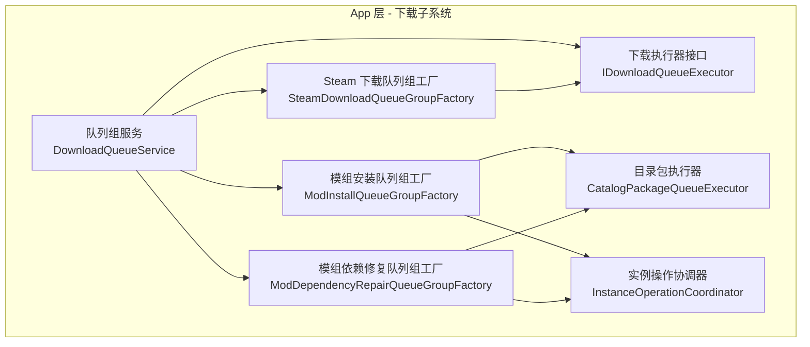
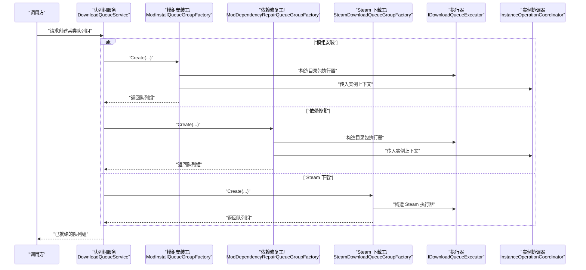
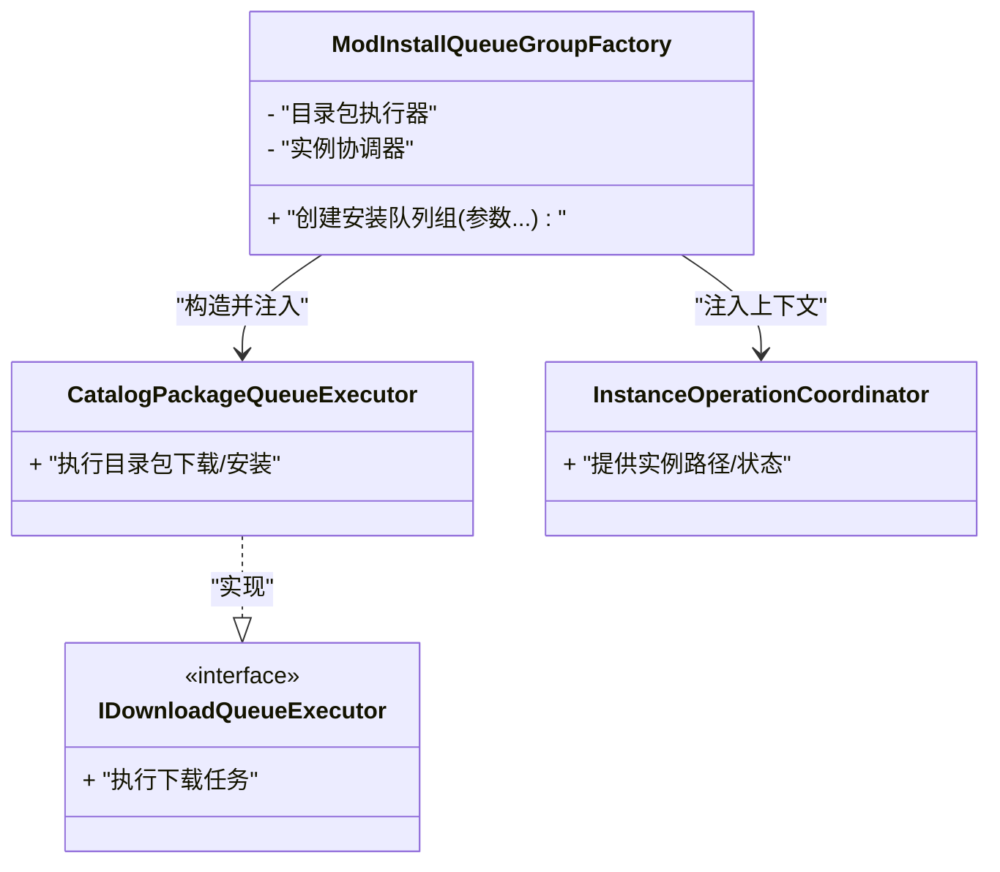
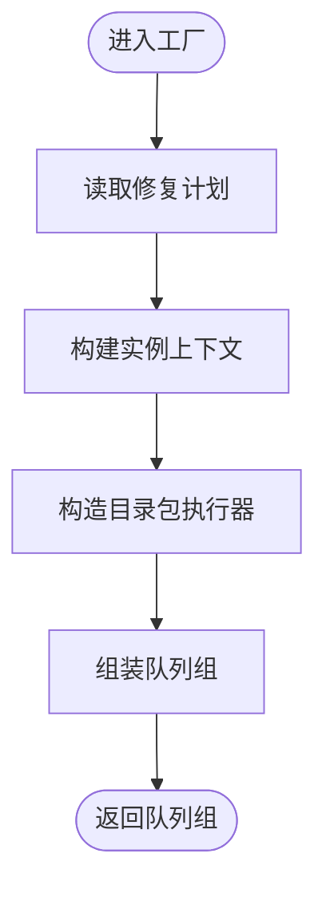
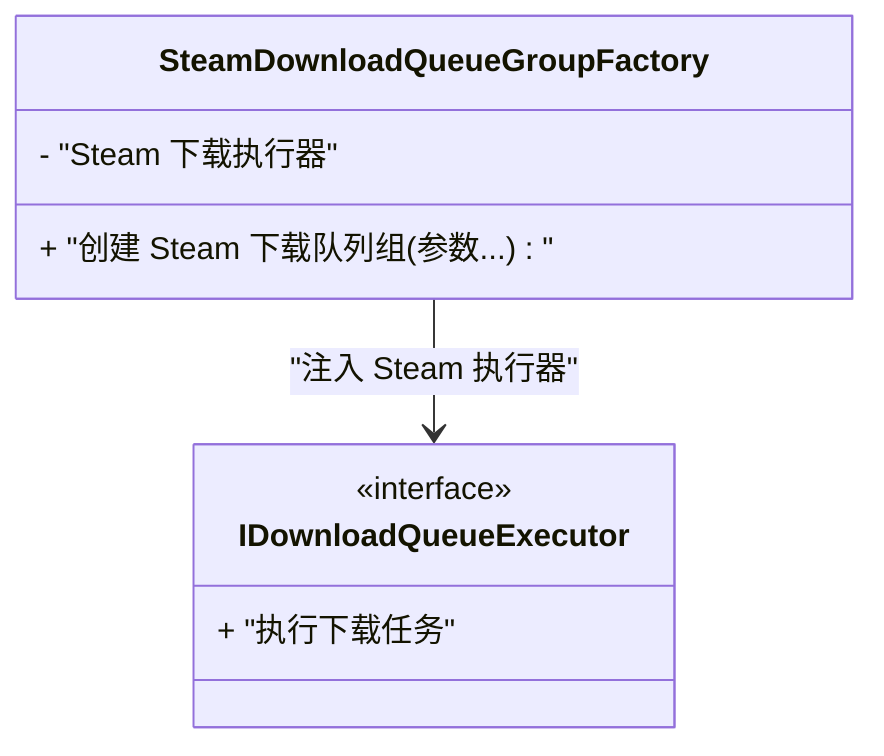
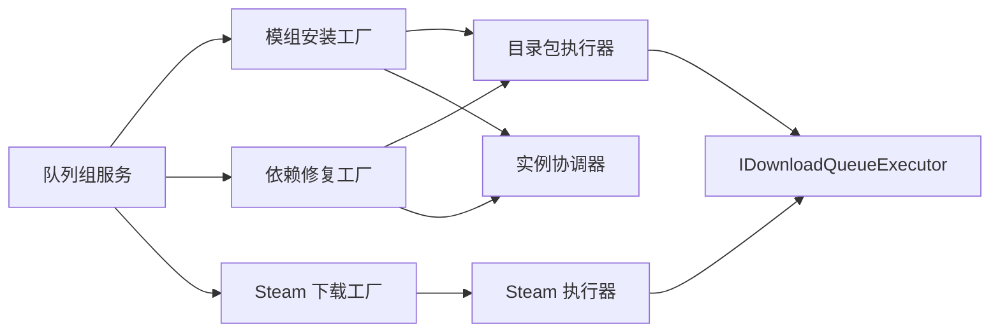

# 工厂模式应用

<cite>
**本文引用的文件**   
- [ModInstallQueueGroupFactory.cs](file://src/Crystalfly.App/Downloads/ModInstallQueueGroupFactory.cs)
- [ModDependencyRepairQueueGroupFactory.cs](file://src/Crystalfly.App/Downloads/ModDependencyRepairQueueGroupFactory.cs)
- [SteamDownloadQueueGroupFactory.cs](file://src/Crystalfly.App/Downloads/SteamDownloadQueueGroupFactory.cs)
- [CatalogPackageQueueExecutor.cs](file://src/Crystalfly.App/Downloads/CatalogPackageQueueExecutor.cs)
- [IDownloadQueueExecutor.cs](file://src/Crystalfly.App/Downloads/IDownloadQueueExecutor.cs)
- [DownloadQueueService.cs](file://src/Crystalfly.App/Downloads/DownloadQueueService.cs)
- [InstanceOperationCoordinator.cs](file://src/Crystalfly.App/Downloads/InstanceOperationCoordinator.cs)
- [ModInstallQueueGroupFactoryTests.cs](file://tests/Crystalfly.App.Tests/Downloads/ModInstallQueueGroupFactoryTests.cs)
- [ModDependencyRepairQueueGroupFactoryTests.cs](file://tests/Crystalfly.App.Tests/Downloads/ModDependencyRepairQueueGroupFactoryTests.cs)
- [SteamDownloadQueueExecutorTests.cs](file://tests/Crystalfly.App.Tests/Downloads/SteamDownloadQueueExecutorTests.cs)
</cite>

## 目录
1. [简介](#简介)
2. [项目结构](#项目结构)
3. [核心组件](#核心组件)
4. [架构总览](#架构总览)
5. [详细组件分析](#详细组件分析)
6. [依赖关系分析](#依赖关系分析)
7. [性能考量](#性能考量)
8. [故障排查指南](#故障排查指南)
9. [结论](#结论)
10. [附录](#附录)

## 简介
本文件聚焦 Crystalfly 项目中“工厂模式”在队列组创建中的应用，重点解析以下三类工厂：
- ModInstallQueueGroupFactory：用于创建模组安装相关的下载队列组。
- ModDependencyRepairQueueGroupFactory：用于创建模组依赖修复相关的下载队列组。
- SteamDownloadQueueGroupFactory：用于创建通过 Steam 内容分发通道执行的下载队列组。

文档将说明工厂模式如何简化复杂对象的创建过程、如何根据配置或运行时条件选择合适的执行器实例，并提供扩展新队列组类型的实践建议。同时，结合依赖注入与测试模拟，给出可操作的集成与验证方法。

## 项目结构
与工厂模式相关的关键代码位于 App 层的 Downloads 目录中，包含若干“队列组工厂”和“下载执行器”，以及协调服务与接口定义。测试位于 Tests 层对应目录下，覆盖各工厂的构造与行为验证。

图示来源
- [DownloadQueueService.cs](file://src/Crystalfly.App/Downloads/DownloadQueueService.cs)
- [IDownloadQueueExecutor.cs](file://src/Crystalfly.App/Downloads/IDownloadQueueExecutor.cs)
- [CatalogPackageQueueExecutor.cs](file://src/Crystalfly.App/Downloads/CatalogPackageQueueExecutor.cs)
- [InstanceOperationCoordinator.cs](file://src/Crystalfly.App/Downloads/InstanceOperationCoordinator.cs)
- [ModInstallQueueGroupFactory.cs](file://src/Crystalfly.App/Downloads/ModInstallQueueGroupFactory.cs)
- [ModDependencyRepairQueueGroupFactory.cs](file://src/Crystalfly.App/Downloads/ModDependencyRepairQueueGroupFactory.cs)
- [SteamDownloadQueueGroupFactory.cs](file://src/Crystalfly.App/Downloads/SteamDownloadQueueGroupFactory.cs)

章节来源
- [ModInstallQueueGroupFactory.cs](file://src/Crystalfly.App/Downloads/ModInstallQueueGroupFactory.cs)
- [ModDependencyRepairQueueGroupFactory.cs](file://src/Crystalfly.App/Downloads/ModDependencyRepairQueueGroupFactory.cs)
- [SteamDownloadQueueGroupFactory.cs](file://src/Crystalfly.App/Downloads/SteamDownloadQueueGroupFactory.cs)
- [CatalogPackageQueueExecutor.cs](file://src/Crystalfly.App/Downloads/CatalogPackageQueueExecutor.cs)
- [IDownloadQueueExecutor.cs](file://src/Crystalfly.App/Downloads/IDownloadQueueExecutor.cs)
- [DownloadQueueService.cs](file://src/Crystalfly.App/Downloads/DownloadQueueService.cs)
- [InstanceOperationCoordinator.cs](file://src/Crystalfly.App/Downloads/InstanceOperationCoordinator.cs)

## 核心组件
- 下载执行器接口（IDownloadQueueExecutor）：定义统一的下载任务执行契约，供不同来源（如目录包、Steam）实现。
- 目录包执行器（CatalogPackageQueueExecutor）：基于目录包清单进行下载的通用执行器。
- 实例操作协调器（InstanceOperationCoordinator）：封装与游戏实例相关的操作（如路径、状态），供安装与修复流程使用。
- 队列组服务（DownloadQueueService）：对外暴露创建与管理队列组的入口，内部委托具体工厂完成对象构建。
- 三类工厂：
  - ModInstallQueueGroupFactory：组装模组安装所需的执行器与上下文，返回对应的队列组。
  - ModDependencyRepairQueueGroupFactory：组装依赖修复所需的执行器与上下文，返回对应的队列组。
  - SteamDownloadQueueGroupFactory：组装基于 Steam 通道的下载队列组。

章节来源
- [IDownloadQueueExecutor.cs](file://src/Crystalfly.App/Downloads/IDownloadQueueExecutor.cs)
- [CatalogPackageQueueExecutor.cs](file://src/Crystalfly.App/Downloads/CatalogPackageQueueExecutor.cs)
- [InstanceOperationCoordinator.cs](file://src/Crystalfly.App/Downloads/InstanceOperationCoordinator.cs)
- [DownloadQueueService.cs](file://src/Crystalfly.App/Downloads/DownloadQueueService.cs)
- [ModInstallQueueGroupFactory.cs](file://src/Crystalfly.App/Downloads/ModInstallQueueGroupFactory.cs)
- [ModDependencyRepairQueueGroupFactory.cs](file://src/Crystalfly.App/Downloads/ModDependencyRepairQueueGroupFactory.cs)
- [SteamDownloadQueueGroupFactory.cs](file://src/Crystalfly.App/Downloads/SteamDownloadQueueGroupFactory.cs)

## 架构总览
下图展示了“请求方 → 队列组服务 → 具体工厂 → 执行器/协调器”的调用链，体现工厂模式对复杂对象创建的解耦作用。

图示来源
- [DownloadQueueService.cs](file://src/Crystalfly.App/Downloads/DownloadQueueService.cs)
- [ModInstallQueueGroupFactory.cs](file://src/Crystalfly.App/Downloads/ModInstallQueueGroupFactory.cs)
- [ModDependencyRepairQueueGroupFactory.cs](file://src/Crystalfly.App/Downloads/ModDependencyRepairQueueGroupFactory.cs)
- [SteamDownloadQueueGroupFactory.cs](file://src/Crystalfly.App/Downloads/SteamDownloadQueueGroupFactory.cs)
- [CatalogPackageQueueExecutor.cs](file://src/Crystalfly.App/Downloads/CatalogPackageQueueExecutor.cs)
- [IDownloadQueueExecutor.cs](file://src/Crystalfly.App/Downloads/IDownloadQueueExecutor.cs)
- [InstanceOperationCoordinator.cs](file://src/Crystalfly.App/Downloads/InstanceOperationCoordinator.cs)

## 详细组件分析

### 模组安装队列组工厂（ModInstallQueueGroupFactory）
职责
- 根据安装计划与目标实例信息，装配目录包执行器与实例协调器，生成可用于安装模组的队列组。
- 将“安装策略”、“依赖处理”等参数透传给执行器或协调器，确保后续执行阶段具备完整上下文。

关键交互
- 接收：安装计划、实例标识、可选策略参数。
- 产出：面向安装的队列组实例。
- 依赖：目录包执行器、实例协调器。

图示来源
- [ModInstallQueueGroupFactory.cs](file://src/Crystalfly.App/Downloads/ModInstallQueueGroupFactory.cs)
- [CatalogPackageQueueExecutor.cs](file://src/Crystalfly.App/Downloads/CatalogPackageQueueExecutor.cs)
- [InstanceOperationCoordinator.cs](file://src/Crystalfly.App/Downloads/InstanceOperationCoordinator.cs)
- [IDownloadQueueExecutor.cs](file://src/Crystalfly.App/Downloads/IDownloadQueueExecutor.cs)

章节来源
- [ModInstallQueueGroupFactory.cs](file://src/Crystalfly.App/Downloads/ModInstallQueueGroupFactory.cs)
- [CatalogPackageQueueExecutor.cs](file://src/Crystalfly.App/Downloads/CatalogPackageQueueExecutor.cs)
- [InstanceOperationCoordinator.cs](file://src/Crystalfly.App/Downloads/InstanceOperationCoordinator.cs)
- [IDownloadQueueExecutor.cs](file://src/Crystalfly.App/Downloads/IDownloadQueueExecutor.cs)

### 模组依赖修复队列组工厂（ModDependencyRepairQueueGroupFactory）
职责
- 依据依赖修复计划与目标实例，装配执行器与协调器，生成用于修复依赖关系的队列组。
- 与安装工厂类似，但关注点在于“修复顺序”、“冲突解决”等修复策略。

关键交互
- 接收：修复计划、实例标识、修复策略。
- 产出：面向修复的队列组实例。
- 依赖：目录包执行器、实例协调器。

图示来源
- [ModDependencyRepairQueueGroupFactory.cs](file://src/Crystalfly.App/Downloads/ModDependencyRepairQueueGroupFactory.cs)
- [CatalogPackageQueueExecutor.cs](file://src/Crystalfly.App/Downloads/CatalogPackageQueueExecutor.cs)
- [InstanceOperationCoordinator.cs](file://src/Crystalfly.App/Downloads/InstanceOperationCoordinator.cs)

章节来源
- [ModDependencyRepairQueueGroupFactory.cs](file://src/Crystalfly.App/Downloads/ModDependencyRepairQueueGroupFactory.cs)
- [CatalogPackageQueueExecutor.cs](file://src/Crystalfly.App/Downloads/CatalogPackageQueueExecutor.cs)
- [InstanceOperationCoordinator.cs](file://src/Crystalfly.App/Downloads/InstanceOperationCoordinator.cs)

### Steam 下载队列组工厂（SteamDownloadQueueGroupFactory）
职责
- 针对 Steam 内容分发场景，装配 Steam 专用执行器与必要上下文，生成用于从 Steam 拉取内容的队列组。
- 与目录包执行器不同，该工厂通常不直接依赖实例协调器，而是围绕 Steam 会话、产品/Depot 信息等上下文进行装配。

关键交互
- 接收：Steam 产品/Depot 信息、认证与会话上下文。
- 产出：面向 Steam 下载的队列组实例。
- 依赖：Steam 下载执行器（实现统一接口）。

图示来源
- [SteamDownloadQueueGroupFactory.cs](file://src/Crystalfly.App/Downloads/SteamDownloadQueueGroupFactory.cs)
- [IDownloadQueueExecutor.cs](file://src/Crystalfly.App/Downloads/IDownloadQueueExecutor.cs)

章节来源
- [SteamDownloadQueueGroupFactory.cs](file://src/Crystalfly.App/Downloads/SteamDownloadQueueGroupFactory.cs)
- [IDownloadQueueExecutor.cs](file://src/Crystalfly.App/Downloads/IDownloadQueueExecutor.cs)

### 工厂方法与选择逻辑
- 工厂方法：每个工厂提供明确的 Create 方法，集中负责参数校验、上下文构建与对象装配。
- 选择逻辑：由上层服务（如 DownloadQueueService）根据业务类型（安装/修复/Steam）路由到对应工厂，避免调用方感知具体实现细节。
- 可扩展性：新增队列组类型时，仅需新增一个工厂并在服务层注册路由即可，符合开闭原则。

章节来源
- [DownloadQueueService.cs](file://src/Crystalfly.App/Downloads/DownloadQueueService.cs)
- [ModInstallQueueGroupFactory.cs](file://src/Crystalfly.App/Downloads/ModInstallQueueGroupFactory.cs)
- [ModDependencyRepairQueueGroupFactory.cs](file://src/Crystalfly.App/Downloads/ModDependencyRepairQueueGroupFactory.cs)
- [SteamDownloadQueueGroupFactory.cs](file://src/Crystalfly.App/Downloads/SteamDownloadQueueGroupFactory.cs)

### 工厂模式与依赖注入的结合
- 构造函数注入：工厂自身可通过 DI 容器获取执行器与协调器等依赖，降低耦合度。
- 服务定位：队列组服务作为“聚合根”，持有多个工厂实例，按类型分派创建请求。
- 替换策略：在测试或特定运行环境中，可用轻量实现替换真实执行器，便于隔离外部依赖。

章节来源
- [ModInstallQueueGroupFactory.cs](file://src/Crystalfly.App/Downloads/ModInstallQueueGroupFactory.cs)
- [ModDependencyRepairQueueGroupFactory.cs](file://src/Crystalfly.App/Downloads/ModDependencyRepairQueueGroupFactory.cs)
- [SteamDownloadQueueGroupFactory.cs](file://src/Crystalfly.App/Downloads/SteamDownloadQueueGroupFactory.cs)
- [DownloadQueueService.cs](file://src/Crystalfly.App/Downloads/DownloadQueueService.cs)

### 测试中的工厂模拟
- 单元测试要点：
  - 验证工厂是否正确组装依赖（执行器、协调器）。
  - 验证在不同输入条件下，是否返回预期类型的队列组。
  - 通过注入模拟执行器，断言其被正确调用且参数符合预期。
- 参考测试用例：
  - 模组安装工厂测试
  - 模组依赖修复工厂测试
  - Steam 下载执行器测试（间接验证 Steam 工厂的装配结果）

章节来源
- [ModInstallQueueGroupFactoryTests.cs](file://tests/Crystalfly.App.Tests/Downloads/ModInstallQueueGroupFactoryTests.cs)
- [ModDependencyRepairQueueGroupFactoryTests.cs](file://tests/Crystalfly.App.Tests/Downloads/ModDependencyRepairQueueGroupFactoryTests.cs)
- [SteamDownloadQueueExecutorTests.cs](file://tests/Crystalfly.App.Tests/Downloads/SteamDownloadQueueExecutorTests.cs)

## 依赖关系分析
- 松耦合：工厂仅关心“如何组装”，不关心“如何执行”。执行器通过接口抽象，便于替换与测试。
- 内聚性：每个工厂专注单一业务域（安装/修复/Steam），职责清晰。
- 外部依赖：
  - 目录包执行器：面向本地/目录包资源。
  - Steam 执行器：面向 Steam 内容分发网络。
  - 实例协调器：面向游戏实例生命周期与路径管理。

图示来源
- [DownloadQueueService.cs](file://src/Crystalfly.App/Downloads/DownloadQueueService.cs)
- [ModInstallQueueGroupFactory.cs](file://src/Crystalfly.App/Downloads/ModInstallQueueGroupFactory.cs)
- [ModDependencyRepairQueueGroupFactory.cs](file://src/Crystalfly.App/Downloads/ModDependencyRepairQueueGroupFactory.cs)
- [SteamDownloadQueueGroupFactory.cs](file://src/Crystalfly.App/Downloads/SteamDownloadQueueGroupFactory.cs)
- [CatalogPackageQueueExecutor.cs](file://src/Crystalfly.App/Downloads/CatalogPackageQueueExecutor.cs)
- [IDownloadQueueExecutor.cs](file://src/Crystalfly.App/Downloads/IDownloadQueueExecutor.cs)
- [InstanceOperationCoordinator.cs](file://src/Crystalfly.App/Downloads/InstanceOperationCoordinator.cs)

章节来源
- [DownloadQueueService.cs](file://src/Crystalfly.App/Downloads/DownloadQueueService.cs)
- [ModInstallQueueGroupFactory.cs](file://src/Crystalfly.App/Downloads/ModInstallQueueGroupFactory.cs)
- [ModDependencyRepairQueueGroupFactory.cs](file://src/Crystalfly.App/Downloads/ModDependencyRepairQueueGroupFactory.cs)
- [SteamDownloadQueueGroupFactory.cs](file://src/Crystalfly.App/Downloads/SteamDownloadQueueGroupFactory.cs)
- [CatalogPackageQueueExecutor.cs](file://src/Crystalfly.App/Downloads/CatalogPackageQueueExecutor.cs)
- [IDownloadQueueExecutor.cs](file://src/Crystalfly.App/Downloads/IDownloadQueueExecutor.cs)
- [InstanceOperationCoordinator.cs](file://src/Crystalfly.App/Downloads/InstanceOperationCoordinator.cs)

## 性能考量
- 对象复用：队列组与服务层应尽量避免重复创建相同配置的队列组，必要时引入缓存或单例策略。
- 执行器并发：目录包与 Steam 执行器的并发度需根据磁盘与网络能力调优，避免争用导致吞吐下降。
- 上下文开销：实例协调器若涉及文件系统扫描或进程探测，应在工厂层按需延迟初始化，减少冷启动成本。

[本节为通用指导，无需源码引用]

## 故障排查指南
- 常见问题
  - 工厂未找到：确认服务层是否正确注册并路由至对应工厂。
  - 执行器未注入：检查工厂构造函数参数与 DI 容器配置。
  - 实例上下文错误：核对实例路径、权限与版本一致性。
- 诊断步骤
  - 在工厂入口处记录入参与输出类型，快速定位分支选择问题。
  - 在执行器接口上增加日志钩子，观察实际调用序列与异常堆栈。
  - 使用测试用例复现问题，逐步缩小范围。

章节来源
- [ModInstallQueueGroupFactory.cs](file://src/Crystalfly.App/Downloads/ModInstallQueueGroupFactory.cs)
- [ModDependencyRepairQueueGroupFactory.cs](file://src/Crystalfly.App/Downloads/ModDependencyRepairQueueGroupFactory.cs)
- [SteamDownloadQueueGroupFactory.cs](file://src/Crystalfly.App/Downloads/SteamDownloadQueueGroupFactory.cs)
- [DownloadQueueService.cs](file://src/Crystalfly.App/Downloads/DownloadQueueService.cs)

## 结论
通过工厂模式，Crystalfly 将“队列组创建”这一复杂过程从调用方剥离，交由专门的工厂负责装配与决策。配合依赖注入与接口抽象，系统具备良好的可扩展性与可测试性。新增队列组类型只需新增工厂并在服务层注册路由，即可无缝融入现有体系。

[本节为总结性内容，无需源码引用]

## 附录
- 扩展新队列组类型的步骤建议
  - 定义新的执行器（实现统一接口）。
  - 新建工厂类，封装创建逻辑与上下文装配。
  - 在服务层添加路由分支，支持按类型选择工厂。
  - 编写单元测试，覆盖正常与异常路径。
  - 在集成测试中验证端到端流程。

[本节为概念性指导，无需源码引用]