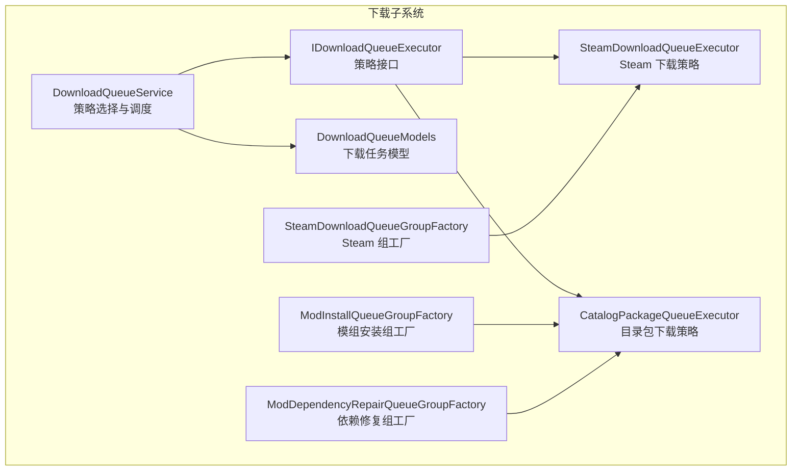
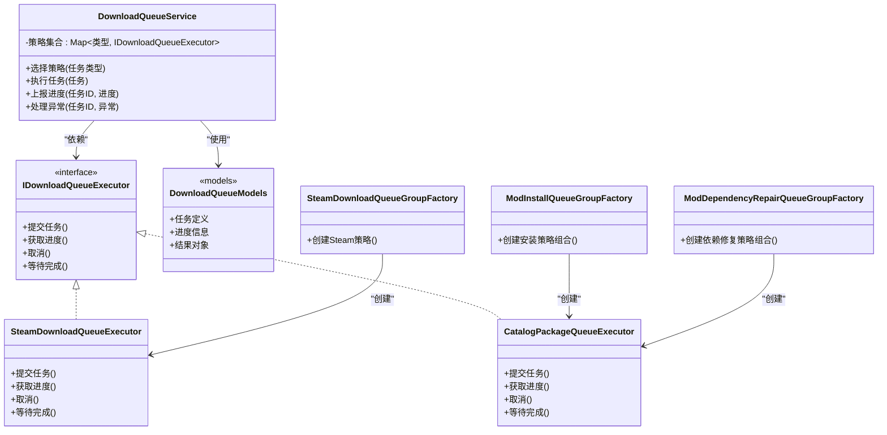
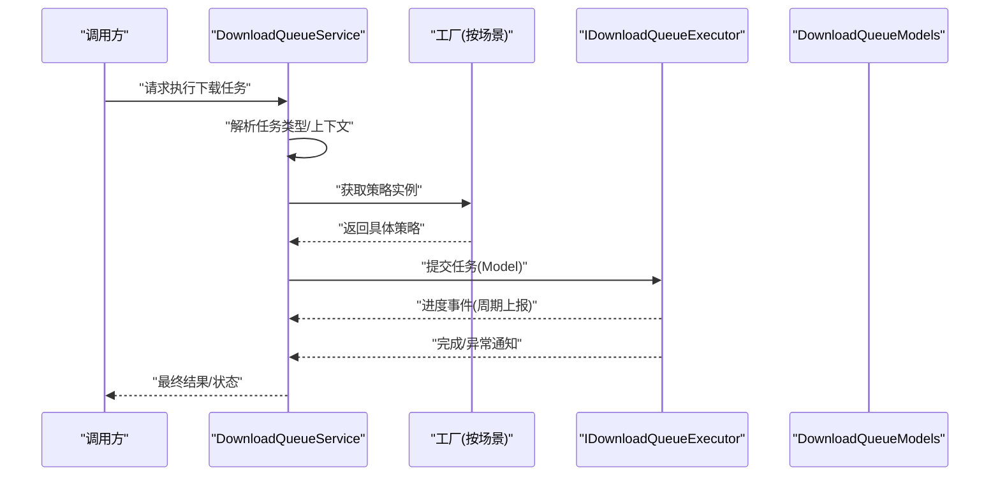
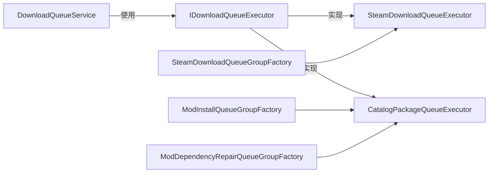

# 策略模式实现

<cite>
**本文引用的文件**   
- [IDownloadQueueExecutor.cs](file://src/Crystalfly.App/Downloads/IDownloadQueueExecutor.cs)
- [SteamDownloadQueueExecutor.cs](file://src/Crystalfly.App/Downloads/SteamDownloadQueueExecutor.cs)
- [CatalogPackageQueueExecutor.cs](file://src/Crystalfly.App/Downloads/CatalogPackageQueueExecutor.cs)
- [DownloadQueueService.cs](file://src/Crystalfly.App/Downloads/DownloadQueueService.cs)
- [DownloadQueueModels.cs](file://src/Crystalfly.App/Downloads/DownloadQueueModels.cs)
- [SteamDownloadQueueGroupFactory.cs](file://src/Crystalfly.App/Downloads/SteamDownloadQueueGroupFactory.cs)
- [ModInstallQueueGroupFactory.cs](file://src/Crystalfly.App/Downloads/ModInstallQueueGroupFactory.cs)
- [ModDependencyRepairQueueGroupFactory.cs](file://src/Crystalfly.App/Downloads/ModDependencyRepairQueueGroupFactory.cs)
</cite>

## 目录
1. [简介](#简介)
2. [项目结构](#项目结构)
3. [核心组件](#核心组件)
4. [架构总览](#架构总览)
5. [详细组件分析](#详细组件分析)
6. [依赖关系分析](#依赖关系分析)
7. [性能考虑](#性能考虑)
8. [故障排查指南](#故障排查指南)
9. [结论](#结论)
10. [附录](#附录)

## 简介
本文件聚焦 Crystalfly 项目中下载队列执行器的“策略模式”实现，围绕 IDownloadQueueExecutor 接口与具体策略类（如 SteamDownloadQueueExecutor、CatalogPackageQueueExecutor）展开，解释如何通过策略模式支持不同下载源与执行逻辑，并在 DownloadQueueService 中动态选择与切换策略。同时说明策略模式与工厂模式的结合使用方式，以及新增下载策略的扩展方法。

## 项目结构
下载相关代码位于 App 层的 Downloads 目录，核心包括：
- 策略接口定义：IDownloadQueueExecutor
- 具体策略实现：SteamDownloadQueueExecutor、CatalogPackageQueueExecutor
- 服务编排：DownloadQueueService（负责策略选择与调度）
- 模型与数据：DownloadQueueModels
- 工厂与分组：SteamDownloadQueueGroupFactory、ModInstallQueueGroupFactory、ModDependencyRepairQueueGroupFactory（用于按场景创建并注入合适的策略实例）

图示来源
- [IDownloadQueueExecutor.cs](file://src/Crystalfly.App/Downloads/IDownloadQueueExecutor.cs)
- [SteamDownloadQueueExecutor.cs](file://src/Crystalfly.App/Downloads/SteamDownloadQueueExecutor.cs)
- [CatalogPackageQueueExecutor.cs](file://src/Crystalfly.App/Downloads/CatalogPackageQueueExecutor.cs)
- [DownloadQueueService.cs](file://src/Crystalfly.App/Downloads/DownloadQueueService.cs)
- [DownloadQueueModels.cs](file://src/Crystalfly.App/Downloads/DownloadQueueModels.cs)
- [SteamDownloadQueueGroupFactory.cs](file://src/Crystalffly.App/Downloads/SteamDownloadQueueGroupFactory.cs)
- [ModInstallQueueGroupFactory.cs](file://src/Crystalfly.App/Downloads/ModInstallQueueGroupFactory.cs)
- [ModDependencyRepairQueueGroupFactory.cs](file://src/Crystalfly.App/Downloads/ModDependencyRepairQueueGroupFactory.cs)

章节来源
- [IDownloadQueueExecutor.cs](file://src/Crystalfly.App/Downloads/IDownloadQueueExecutor.cs)
- [SteamDownloadQueueExecutor.cs](file://src/Crystalfly.App/Downloads/SteamDownloadQueueExecutor.cs)
- [CatalogPackageQueueExecutor.cs](file://src/Crystalfly.App/Downloads/CatalogPackageQueueExecutor.cs)
- [DownloadQueueService.cs](file://src/Crystalfly.App/Downloads/DownloadQueueService.cs)
- [DownloadQueueModels.cs](file://src/Crystalfly.App/Downloads/DownloadQueueModels.cs)
- [SteamDownloadQueueGroupFactory.cs](file://src/Crystalfly.App/Downloads/SteamDownloadQueueGroupFactory.cs)
- [ModInstallQueueGroupFactory.cs](file://src/Crystalfly.App/Downloads/ModInstallQueueGroupFactory.cs)
- [ModDependencyRepairQueueGroupFactory.cs](file://src/Crystalfly.App/Downloads/ModDependencyRepairQueueGroupFactory.cs)

## 核心组件
- 策略接口 IDownloadQueueExecutor
  - 职责：定义统一的下载执行契约，屏蔽不同下载源的差异，供上层服务以统一方式调用。
  - 典型能力：提交下载任务、获取进度、取消/中止、错误处理等（具体方法名以实际接口为准）。
- 具体策略
  - SteamDownloadQueueExecutor：面向 Steam 内容分发网络的下载策略，封装 Steam 客户端交互、Depot 下载、认证与会话管理等细节。
  - CatalogPackageQueueExecutor：面向目录包（Catalog Package）的下载策略，基于本地或远端目录清单进行文件拉取与校验。
- 服务层 DownloadQueueService
  - 职责：根据任务类型或上下文信息选择具体策略实例，协调任务生命周期（入队、执行、完成、失败），并聚合进度与状态。
- 模型 DownloadQueueModels
  - 职责：定义下载任务、进度、结果等数据结构，作为策略与服务之间的数据契约。
- 工厂与分组
  - SteamDownloadQueueGroupFactory：为 Steam 相关下载任务提供策略实例与分组管理。
  - ModInstallQueueGroupFactory / ModDependencyRepairQueueGroupFactory：为模组安装与依赖修复场景提供策略组合与分组。

章节来源
- [IDownloadQueueExecutor.cs](file://src/Crystalfly.App/Downloads/IDownloadQueueExecutor.cs)
- [SteamDownloadQueueExecutor.cs](file://src/Crystalfly.App/Downloads/SteamDownloadQueueExecutor.cs)
- [CatalogPackageQueueExecutor.cs](file://src/Crystalfly.App/Downloads/CatalogPackageQueueExecutor.cs)
- [DownloadQueueService.cs](file://src/Crystalfly.App/Downloads/DownloadQueueService.cs)
- [DownloadQueueModels.cs](file://src/Crystalfly.App/Downloads/DownloadQueueModels.cs)
- [SteamDownloadQueueGroupFactory.cs](file://src/Crystalfly.App/Downloads/SteamDownloadQueueGroupFactory.cs)
- [ModInstallQueueGroupFactory.cs](file://src/Crystalfly.App/Downloads/ModInstallQueueGroupFactory.cs)
- [ModDependencyRepairQueueGroupFactory.cs](file://src/Crystalfly.App/Downloads/ModDependencyRepairQueueGroupFactory.cs)

## 架构总览
下图展示策略模式在 Crystalfly 下载子系统中的整体协作关系：服务层通过接口调用策略，工厂负责构造和注入具体策略，模型贯穿流程传递数据。

图示来源
- [IDownloadQueueExecutor.cs](file://src/Crystalfly.App/Downloads/IDownloadQueueExecutor.cs)
- [SteamDownloadQueueExecutor.cs](file://src/Crystalfly.App/Downloads/SteamDownloadQueueExecutor.cs)
- [CatalogPackageQueueExecutor.cs](file://src/Crystalfly.App/Downloads/CatalogPackageQueueExecutor.cs)
- [DownloadQueueService.cs](file://src/Crystalfly.App/Downloads/DownloadQueueService.cs)
- [DownloadQueueModels.cs](file://src/Crystalfly.App/Downloads/DownloadQueueModels.cs)
- [SteamDownloadQueueGroupFactory.cs](file://src/Crystalfly.App/Downloads/SteamDownloadQueueGroupFactory.cs)
- [ModInstallQueueGroupFactory.cs](file://src/Crystalfly.App/Downloads/ModInstallQueueGroupFactory.cs)
- [ModDependencyRepairQueueGroupFactory.cs](file://src/Crystalfly.App/Downloads/ModDependencyRepairQueueGroupFactory.cs)

## 详细组件分析

### 策略接口设计：IDownloadQueueExecutor
- 设计目标
  - 抽象不同下载源的差异，向上暴露统一的任务提交、进度查询、取消与等待完成等能力。
  - 使 DownloadQueueService 无需关心具体下载协议或后端实现。
- 关键要点
  - 方法签名应包含任务标识、上下文参数、回调或事件机制以便进度上报。
  - 错误处理需明确异常类型与恢复策略（重试、降级、回滚）。
  - 线程安全：并发提交与取消需要保证内部状态一致性。
- 扩展性
  - 新增策略只需实现该接口，并在工厂或服务注册表中声明即可。

章节来源
- [IDownloadQueueExecutor.cs](file://src/Crystalfly.App/Downloads/IDownloadQueueExecutor.cs)

### 具体策略：SteamDownloadQueueExecutor
- 适用场景
  - 从 Steam 内容分发网络拉取游戏资产或 DLC 内容。
- 主要职责
  - 与 Steam 客户端交互，管理会话与认证。
  - 解析 Depot 列表与文件映射，分片下载与校验。
  - 上报下载进度与错误信息。
- 与其他组件的关系
  - 由 SteamDownloadQueueGroupFactory 创建并注入到服务层。
  - 使用 DownloadQueueModels 中的任务与进度模型。

章节来源
- [SteamDownloadQueueExecutor.cs](file://src/Crystalfly.App/Downloads/SteamDownloadQueueExecutor.cs)
- [SteamDownloadQueueGroupFactory.cs](file://src/Crystalfly.App/Downloads/SteamDownloadQueueGroupFactory.cs)
- [DownloadQueueModels.cs](file://src/Crystalfly.App/Downloads/DownloadQueueModels.cs)

### 具体策略：CatalogPackageQueueExecutor
- 适用场景
  - 基于目录包清单（Catalog Package）进行批量文件下载与校验。
- 主要职责
  - 解析目录清单，计算增量差异，按需拉取文件。
  - 处理断点续传、重试与完整性校验。
  - 与模组安装/依赖修复流程集成。
- 与其他组件的关系
  - 由 ModInstallQueueGroupFactory 与 ModDependencyRepairQueueGroupFactory 创建并组合使用。
  - 同样遵循 IDownloadQueueExecutor 的统一契约。

章节来源
- [CatalogPackageQueueExecutor.cs](file://src/Crystalfly.App/Downloads/CatalogPackageQueueExecutor.cs)
- [ModInstallQueueGroupFactory.cs](file://src/Crystalfly.App/Downloads/ModInstallQueueGroupFactory.cs)
- [ModDependencyRepairQueueGroupFactory.cs](file://src/Crystalfly.App/Downloads/ModDependencyRepairQueueGroupFactory.cs)
- [DownloadQueueModels.cs](file://src/Crystalfly.App/Downloads/DownloadQueueModels.cs)

### 服务层：DownloadQueueService 的策略调用
- 策略选择流程
  - 根据任务类型或上下文信息（例如来源、目标平台、资源类型）选择对应策略实例。
  - 将任务包装为统一模型，交由策略执行。
- 进度与异常处理
  - 订阅策略的进度事件，聚合并上报给 UI 或上层服务。
  - 捕获策略抛出的异常，记录日志并触发重试或降级逻辑。
- 生命周期管理
  - 任务的入队、执行、完成、失败与清理均由服务层协调。

图示来源
- [DownloadQueueService.cs](file://src/Crystalfly.App/Downloads/DownloadQueueService.cs)
- [IDownloadQueueExecutor.cs](file://src/Crystalfly.App/Downloads/IDownloadQueueExecutor.cs)
- [DownloadQueueModels.cs](file://src/Crystalfly.App/Downloads/DownloadQueueModels.cs)
- [SteamDownloadQueueGroupFactory.cs](file://src/Crystalfly.App/Downloads/SteamDownloadQueueGroupFactory.cs)
- [ModInstallQueueGroupFactory.cs](file://src/Crystalfly.App/Downloads/ModInstallQueueGroupFactory.cs)
- [ModDependencyRepairQueueGroupFactory.cs](file://src/Crystalfly.App/Downloads/ModDependencyRepairQueueGroupFactory.cs)

章节来源
- [DownloadQueueService.cs](file://src/Crystalfly.App/Downloads/DownloadQueueService.cs)
- [DownloadQueueModels.cs](file://src/Crystalfly.App/Downloads/DownloadQueueModels.cs)

### 工厂与分组：策略的创建与组合
- SteamDownloadQueueGroupFactory
  - 负责创建 SteamDownloadQueueExecutor 实例，并可配置连接参数、并发度等。
- ModInstallQueueGroupFactory
  - 为模组安装流程创建 CatalogPackageQueueExecutor，并组合必要的校验与回滚步骤。
- ModDependencyRepairQueueGroupFactory
  - 为依赖修复流程创建 CatalogPackageQueueExecutor，侧重差异计算与增量更新。

章节来源
- [SteamDownloadQueueGroupFactory.cs](file://src/Crystalfly.App/Downloads/SteamDownloadQueueGroupFactory.cs)
- [ModInstallQueueGroupFactory.cs](file://src/Crystalfly.App/Downloads/ModInstallQueueGroupFactory.cs)
- [ModDependencyRepairQueueGroupFactory.cs](file://src/Crystalfly.App/Downloads/ModDependencyRepairQueueGroupFactory.cs)

### 添加新下载策略的步骤
- 实现策略接口
  - 新建类实现 IDownloadQueueExecutor，定义任务提交、进度上报、取消与等待完成等方法。
- 注册与选择
  - 在工厂或服务的策略注册表中登记新策略，确保能根据任务类型正确选择。
- 集成测试
  - 编写单元测试覆盖正常路径、异常路径与边界条件，验证进度上报与错误处理。
- 文档与示例
  - 补充使用示例与最佳实践，便于后续维护与扩展。

章节来源
- [IDownloadQueueExecutor.cs](file://src/Crystalfly.App/Downloads/IDownloadQueueExecutor.cs)
- [DownloadQueueService.cs](file://src/Crystalfly.App/Downloads/DownloadQueueService.cs)

## 依赖关系分析
- 松耦合
  - DownloadQueueService 仅依赖 IDownloadQueueExecutor 接口，不感知具体实现，符合开闭原则。
- 内聚性
  - 每个策略类专注于单一下载源或场景，职责清晰，易于测试与维护。
- 外部依赖
  - SteamDownloadQueueExecutor 依赖 Steam 客户端库；CatalogPackageQueueExecutor 依赖目录包解析与文件系统操作。
- 潜在循环依赖
  - 当前结构未见循环引用风险，策略与服务之间通过接口解耦。

图示来源
- [DownloadQueueService.cs](file://src/Crystalfly.App/Downloads/DownloadQueueService.cs)
- [IDownloadQueueExecutor.cs](file://src/Crystalfly.App/Downloads/IDownloadQueueExecutor.cs)
- [SteamDownloadQueueExecutor.cs](file://src/Crystalfly.App/Downloads/SteamDownloadQueueExecutor.cs)
- [CatalogPackageQueueExecutor.cs](file://src/Crystalfly.App/Downloads/CatalogPackageQueueExecutor.cs)
- [SteamDownloadQueueGroupFactory.cs](file://src/Crystalfly.App/Downloads/SteamDownloadQueueGroupFactory.cs)
- [ModInstallQueueGroupFactory.cs](file://src/Crystalfly.App/Downloads/ModInstallQueueGroupFactory.cs)
- [ModDependencyRepairQueueGroupFactory.cs](file://src/Crystalfly.App/Downloads/ModDependencyRepairQueueGroupFactory.cs)

章节来源
- [DownloadQueueService.cs](file://src/Crystalfly.App/Downloads/DownloadQueueService.cs)
- [IDownloadQueueExecutor.cs](file://src/Crystalfly.App/Downloads/IDownloadQueueExecutor.cs)
- [SteamDownloadQueueExecutor.cs](file://src/Crystalfly.App/Downloads/SteamDownloadQueueExecutor.cs)
- [CatalogPackageQueueExecutor.cs](file://src/Crystalfly.App/Downloads/CatalogPackageQueueExecutor.cs)
- [SteamDownloadQueueGroupFactory.cs](file://src/Crystalfly.App/Downloads/SteamDownloadQueueGroupFactory.cs)
- [ModInstallQueueGroupFactory.cs](file://src/Crystalfly.App/Downloads/ModInstallQueueGroupFactory.cs)
- [ModDependencyRepairQueueGroupFactory.cs](file://src/Crystalfly.App/Downloads/ModDependencyRepairQueueGroupFactory.cs)

## 性能考虑
- 并发控制
  - 合理设置下载并发度，避免对磁盘和网络造成过大压力。
- 增量与断点续传
  - 优先采用增量更新与断点续传，减少重复下载与提升用户体验。
- 进度上报频率
  - 控制进度事件上报频率，避免频繁 UI 刷新导致卡顿。
- 资源释放
  - 及时释放网络连接与文件句柄，防止资源泄漏。

[本节为通用指导，不涉及具体文件分析]

## 故障排查指南
- 常见问题定位
  - 检查策略是否正确注册与选择。
  - 核对任务模型字段是否完整，确保策略能正确解析上下文。
  - 查看进度上报与异常处理链路是否畅通。
- 日志与诊断
  - 在服务层与策略层增加关键日志，记录任务生命周期与错误堆栈。
- 回归测试
  - 针对新增策略编写端到端测试，覆盖网络异常、权限不足、磁盘空间不足等场景。

章节来源
- [DownloadQueueService.cs](file://src/Crystalfly.App/Downloads/DownloadQueueService.cs)
- [DownloadQueueModels.cs](file://src/Crystalfly.App/Downloads/DownloadQueueModels.cs)

## 结论
通过策略模式，Crystalfly 在下载子系统实现了高度可扩展与可维护的架构。IDownloadQueueExecutor 统一了不同下载源的执行契约，DownloadQueueService 负责策略选择与调度，工厂模式则简化了策略的创建与组合。未来新增下载源时，仅需实现接口并注册，即可无缝接入现有流程。

[本节为总结性内容，不涉及具体文件分析]

## 附录
- 术语
  - 策略模式：定义一系列算法，把它们一个个封装起来，并且使它们可以互相替换。
  - 工厂模式：定义一个创建对象的接口，让子类决定实例化哪一个类。
- 参考文件
  - 策略接口与实现、服务层与工厂均在 Downloads 目录下，便于集中查阅与维护。

[本节为概念性内容，不涉及具体文件分析]