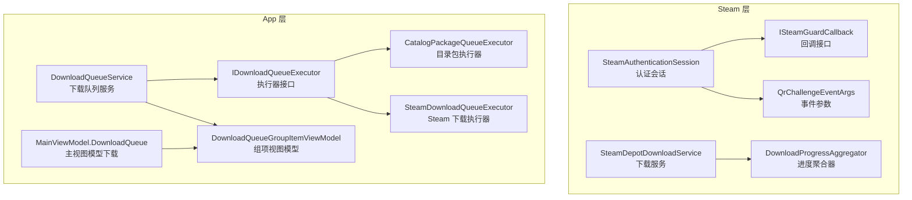
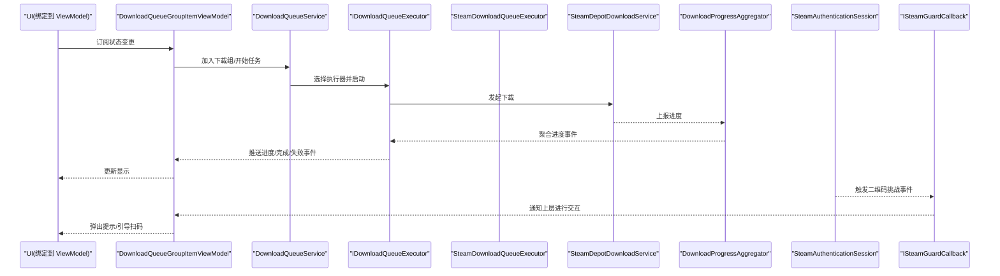
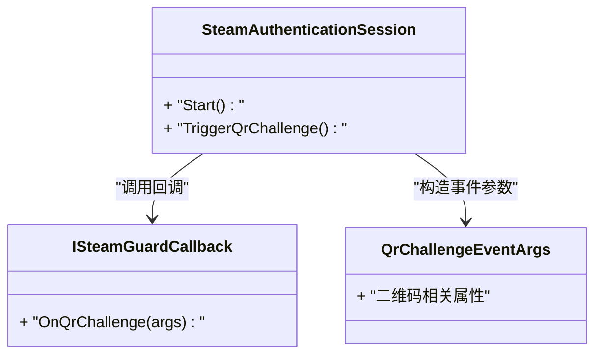
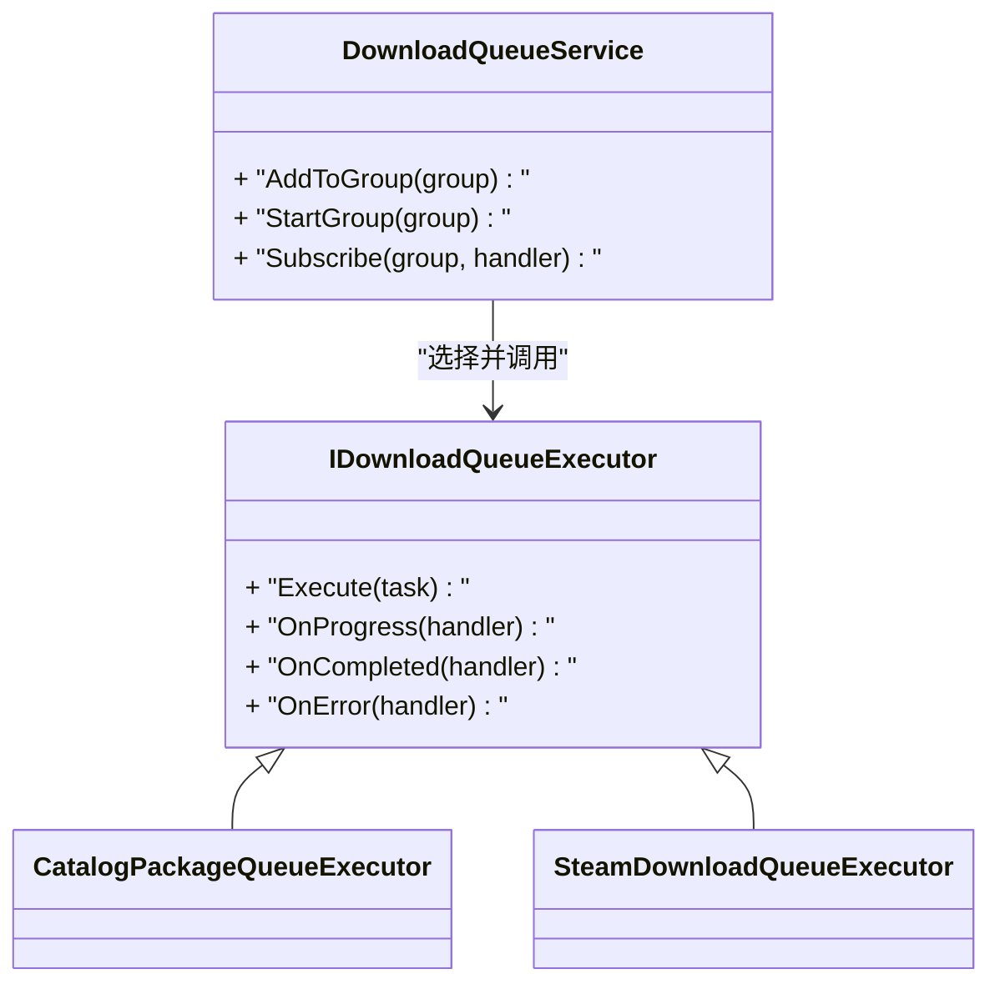
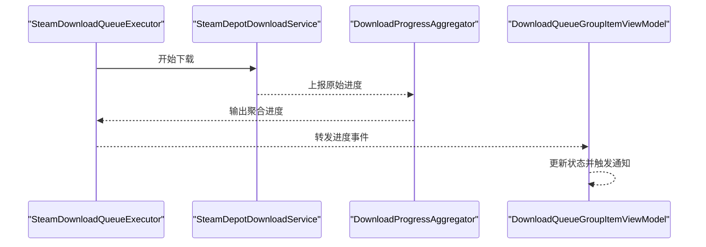
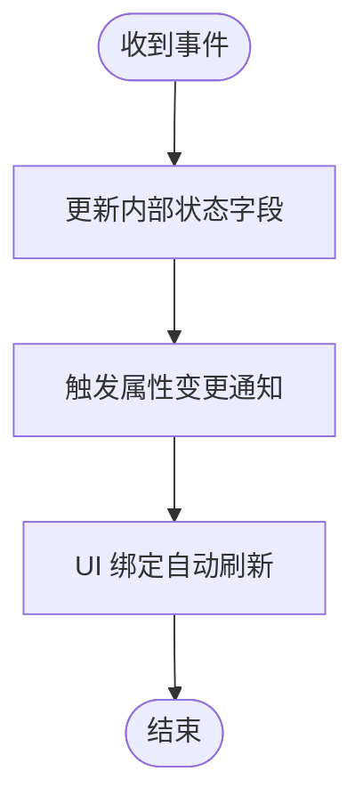
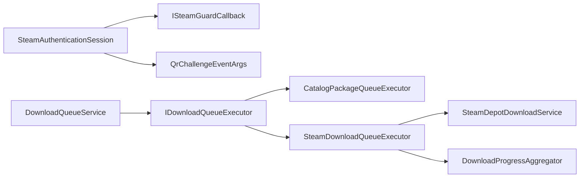

# 观察者模式应用

<cite>
**本文引用的文件**   
- [ISteamGuardCallback.cs](file://src/Crystalfly.Steam/Authentication/ISteamGuardCallback.cs)
- [QrChallengeEventArgs.cs](file://src/Crystalfly.Steam/Authentication/QrChallengeEventArgs.cs)
- [SteamAuthenticationSession.cs](file://src/Crystalfly.Steam/Authentication/SteamAuthenticationSession.cs)
- [DownloadQueueGroupItemViewModel.cs](file://src/Crystalfly.App/ViewModels/DownloadQueueGroupItemViewModel.cs)
- [MainViewModel.DownloadQueue.cs](file://src/Crystalfly.App/ViewModels/MainViewModel.DownloadQueue.cs)
- [DownloadQueueService.cs](file://src/Crystalfly.App/Downloads/DownloadQueueService.cs)
- [CatalogPackageQueueExecutor.cs](file://src/Crystalfly.App/Downloads/CatalogPackageQueueExecutor.cs)
- [SteamDownloadQueueExecutor.cs](file://src/Crystalfly.App/Downloads/SteamDownloadQueueExecutor.cs)
- [IDownloadQueueExecutor.cs](file://src/Crystalfly.App/Downloads/IDownloadQueueExecutor.cs)
- [DownloadProgressAggregator.cs](file://src/Crystalfly.Steam/Downloads/DownloadProgressAggregator.cs)
- [SteamDepotDownloadService.cs](file://src/Crystalfly.Steam/Downloads/SteamDepotDownloadService.cs)
</cite>

## 目录
1. [简介](#简介)
2. [项目结构](#项目结构)
3. [核心组件](#核心组件)
4. [架构总览](#架构总览)
5. [详细组件分析](#详细组件分析)
6. [依赖关系分析](#依赖关系分析)
7. [性能考虑](#性能考虑)
8. [故障排查指南](#故障排查指南)
9. [结论](#结论)
10. [附录](#附录)

## 简介
本文件聚焦 Crystalfly 项目中观察者模式的落地实践，围绕事件驱动架构展开，重点解释以下方面：
- ISteamGuardCallback 回调接口的设计与职责边界
- QrChallengeEventArgs 事件参数的定义与使用
- DownloadQueueGroupItemViewModel 中的状态更新机制
- 观察者模式如何实现松耦合的组件通信
- 异步事件的传播与处理
- 事件订阅与发布的示例路径
- 在用户界面更新、进度监控、错误处理等场景中的应用

## 项目结构
本项目采用分层组织方式：
- Steam 层（认证与下载）负责底层能力与事件源
- App 层（视图模型与队列服务）作为事件消费者与 UI 状态协调者
- Core 层提供通用能力（不在本次文档范围内）

图表来源
- [ISteamGuardCallback.cs](file://src/Crystalfly.Steam/Authentication/ISteamGuardCallback.cs)
- [QrChallengeEventArgs.cs](file://src/Crystalfly.Steam/Authentication/QrChallengeEventArgs.cs)
- [SteamAuthenticationSession.cs](file://src/Crystalfly.Steam/Authentication/SteamAuthenticationSession.cs)
- [SteamDepotDownloadService.cs](file://src/Crystalfly.Steam/Downloads/SteamDepotDownloadService.cs)
- [DownloadProgressAggregator.cs](file://src/Crystalfly.Steam/Downloads/DownloadProgressAggregator.cs)
- [DownloadQueueService.cs](file://src/Crystalfly.App/Downloads/DownloadQueueService.cs)
- [IDownloadQueueExecutor.cs](file://src/Crystalfly.App/Downloads/IDownloadQueueExecutor.cs)
- [CatalogPackageQueueExecutor.cs](file://src/Crystalfly.App/Downloads/CatalogPackageQueueExecutor.cs)
- [SteamDownloadQueueExecutor.cs](file://src/Crystalfly.App/Downloads/SteamDownloadQueueExecutor.cs)
- [DownloadQueueGroupItemViewModel.cs](file://src/Crystalfly.App/ViewModels/DownloadQueueGroupItemViewModel.cs)
- [MainViewModel.DownloadQueue.cs](file://src/Crystalfly.App/ViewModels/MainViewModel.DownloadQueue.cs)

章节来源
- [ISteamGuardCallback.cs](file://src/Crystalfly.Steam/Authentication/ISteamGuardCallback.cs)
- [QrChallengeEventArgs.cs](file://src/Crystalfly.Steam/Authentication/QrChallengeEventArgs.cs)
- [SteamAuthenticationSession.cs](file://src/Crystalfly.Steam/Authentication/SteamAuthenticationSession.cs)
- [DownloadQueueService.cs](file://src/Crystalfly.App/Downloads/DownloadQueueService.cs)
- [IDownloadQueueExecutor.cs](file://src/Crystalfly.App/Downloads/IDownloadQueueExecutor.cs)
- [CatalogPackageQueueExecutor.cs](file://src/Crystalfly.App/Downloads/CatalogPackageQueueExecutor.cs)
- [SteamDownloadQueueExecutor.cs](file://src/Crystalfly.App/Downloads/SteamDownloadQueueExecutor.cs)
- [DownloadQueueGroupItemViewModel.cs](file://src/Crystalfly.App/ViewModels/DownloadQueueGroupItemViewModel.cs)
- [MainViewModel.DownloadQueue.cs](file://src/Crystalfly.App/ViewModels/MainViewModel.DownloadQueue.cs)

## 核心组件
- ISteamGuardCallback：定义认证过程中的回调契约，供上层订阅以响应二维码挑战等交互事件。
- QrChallengeEventArgs：封装二维码挑战相关的事件数据，作为事件参数传递给订阅者。
- SteamAuthenticationSession：管理认证会话生命周期，并在需要时通过回调接口发布事件。
- DownloadQueueService：下载队列编排与服务入口，协调执行器与视图模型的状态同步。
- IDownloadQueueExecutor 及实现（CatalogPackageQueueExecutor、SteamDownloadQueueExecutor）：具体下载任务的执行策略，内部可触发进度或完成事件。
- DownloadQueueGroupItemViewModel：代表一个下载组的视图模型，持有并更新任务状态，供 UI 绑定展示。
- MainViewModel.DownloadQueue：主视图模型的下载子模块，负责订阅队列事件并维护集合状态。
- SteamDepotDownloadService 与 DownloadProgressAggregator：底层下载与进度聚合，向上游暴露进度事件。

章节来源
- [ISteamGuardCallback.cs](file://src/Crystalfly.Steam/Authentication/ISteamGuardCallback.cs)
- [QrChallengeEventArgs.cs](file://src/Crystalfly.Steam/Authentication/QrChallengeEventArgs.cs)
- [SteamAuthenticationSession.cs](file://src/Crystalfly.Steam/Authentication/SteamAuthenticationSession.cs)
- [DownloadQueueService.cs](file://src/Crystalfly.App/Downloads/DownloadQueueService.cs)
- [IDownloadQueueExecutor.cs](file://src/Crystalfly.App/Downloads/IDownloadQueueExecutor.cs)
- [CatalogPackageQueueExecutor.cs](file://src/Crystalfly.App/Downloads/CatalogPackageQueueExecutor.cs)
- [SteamDownloadQueueExecutor.cs](file://src/Crystalfly.App/Downloads/SteamDownloadQueueExecutor.cs)
- [DownloadQueueGroupItemViewModel.cs](file://src/Crystalfly.App/ViewModels/DownloadQueueGroupItemViewModel.cs)
- [MainViewModel.DownloadQueue.cs](file://src/Crystalfly.App/ViewModels/MainViewModel.DownloadQueue.cs)
- [SteamDepotDownloadService.cs](file://src/Crystalfly.Steam/Downloads/SteamDepotDownloadService.cs)
- [DownloadProgressAggregator.cs](file://src/Crystalfly.Steam/Downloads/DownloadProgressAggregator.cs)

## 架构总览
下图展示了从认证到下载的全链路事件流，体现观察者模式如何解耦各组件：

图表来源
- [DownloadQueueService.cs](file://src/Crystalfly.App/Downloads/DownloadQueueService.cs)
- [IDownloadQueueExecutor.cs](file://src/Crystalfly.App/Downloads/IDownloadQueueExecutor.cs)
- [SteamDownloadQueueExecutor.cs](file://src/Crystalfly.App/Downloads/SteamDownloadQueueExecutor.cs)
- [SteamDepotDownloadService.cs](file://src/Crystalfly.Steam/Downloads/SteamDepotDownloadService.cs)
- [DownloadProgressAggregator.cs](file://src/Crystalfly.Steam/Downloads/DownloadProgressAggregator.cs)
- [DownloadQueueGroupItemViewModel.cs](file://src/Crystalfly.App/ViewModels/DownloadQueueGroupItemViewModel.cs)
- [ISteamGuardCallback.cs](file://src/Crystalfly.Steam/Authentication/ISteamGuardCallback.cs)
- [SteamAuthenticationSession.cs](file://src/Crystalfly.Steam/Authentication/SteamAuthenticationSession.cs)

## 详细组件分析

### 认证回调与二维码挑战事件
- ISteamGuardCallback：定义认证过程中需要回调的方法签名，用于将“二维码挑战”等外部交互事件向上传播。
- QrChallengeEventArgs：承载二维码挑战所需的数据（如二维码内容、会话标识等），确保事件参数清晰且可扩展。
- SteamAuthenticationSession：在认证流程中，当需要用户扫码时，通过回调接口发布事件；上层订阅后决定 UI 行为（弹窗、跳转等）。

图表来源
- [ISteamGuardCallback.cs](file://src/Crystalfly.Steam/Authentication/ISteamGuardCallback.cs)
- [QrChallengeEventArgs.cs](file://src/Crystalfly.Steam/Authentication/QrChallengeEventArgs.cs)
- [SteamAuthenticationSession.cs](file://src/Crystalfly.Steam/Authentication/SteamAuthenticationSession.cs)

章节来源
- [ISteamGuardCallback.cs](file://src/Crystalfly.Steam/Authentication/ISteamGuardCallback.cs)
- [QrChallengeEventArgs.cs](file://src/Crystalfly.Steam/Authentication/QrChallengeEventArgs.cs)
- [SteamAuthenticationSession.cs](file://src/Crystalfly.Steam/Authentication/SteamAuthenticationSession.cs)

### 下载队列与执行器的事件链
- DownloadQueueService：作为队列服务的中心，负责调度执行器、汇总任务状态，并向视图模型推送事件。
- IDownloadQueueExecutor：统一抽象下载执行器，使不同来源（目录包、Steam 仓库）的任务可以以相同方式被订阅和消费。
- CatalogPackageQueueExecutor：针对目录包的安装/下载执行逻辑。
- SteamDownloadQueueExecutor：针对 Steam 内容的下载执行逻辑，通常与 SteamDepotDownloadService 协作。

图表来源
- [DownloadQueueService.cs](file://src/Crystalfly.App/Downloads/DownloadQueueService.cs)
- [IDownloadQueueExecutor.cs](file://src/Crystalfly.App/Downloads/IDownloadQueueExecutor.cs)
- [CatalogPackageQueueExecutor.cs](file://src/Crystalfly.App/Downloads/CatalogPackageQueueExecutor.cs)
- [SteamDownloadQueueExecutor.cs](file://src/Crystalfly.App/Downloads/SteamDownloadQueueExecutor.cs)

章节来源
- [DownloadQueueService.cs](file://src/Crystalfly.App/Downloads/DownloadQueueService.cs)
- [IDownloadQueueExecutor.cs](file://src/Crystalfly.App/Downloads/IDownloadQueueExecutor.cs)
- [CatalogPackageQueueExecutor.cs](file://src/Crystalfly.App/Downloads/CatalogPackageQueueExecutor.cs)
- [SteamDownloadQueueExecutor.cs](file://src/Crystalfly.App/Downloads/SteamDownloadQueueExecutor.cs)

### 进度聚合与底层下载服务
- SteamDepotDownloadService：封装对 Steam 仓库的下载操作，向上游暴露进度事件。
- DownloadProgressAggregator：聚合多个下载流的进度，合并为统一的进度事件，降低订阅方复杂度。

图表来源
- [SteamDownloadQueueExecutor.cs](file://src/Crystalfly.App/Downloads/SteamDownloadQueueExecutor.cs)
- [SteamDepotDownloadService.cs](file://src/Crystalfly.Steam/Downloads/SteamDepotDownloadService.cs)
- [DownloadProgressAggregator.cs](file://src/Crystalfly.Steam/Downloads/DownloadProgressAggregator.cs)
- [DownloadQueueGroupItemViewModel.cs](file://src/Crystalfly.App/ViewModels/DownloadQueueGroupItemViewModel.cs)

章节来源
- [SteamDepotDownloadService.cs](file://src/Crystalfly.Steam/Downloads/SteamDepotDownloadService.cs)
- [DownloadProgressAggregator.cs](file://src/Crystalfly.Steam/Downloads/DownloadProgressAggregator.cs)
- [SteamDownloadQueueExecutor.cs](file://src/Crystalfly.App/Downloads/SteamDownloadQueueExecutor.cs)
- [DownloadQueueGroupItemViewModel.cs](file://src/Crystalfly.App/ViewModels/DownloadQueueGroupItemViewModel.cs)

### 视图模型状态更新机制
- DownloadQueueGroupItemViewModel：维护单个下载组的状态（进行中、已完成、失败、进度百分比等），并通过事件通知 UI 刷新。
- MainViewModel.DownloadQueue：集中订阅队列事件，维护组集合与排序、过滤等 UI 相关状态。

图表来源
- [DownloadQueueGroupItemViewModel.cs](file://src/Crystalfly.App/ViewModels/DownloadQueueGroupItemViewModel.cs)
- [MainViewModel.DownloadQueue.cs](file://src/Crystalfly.App/ViewModels/MainViewModel.DownloadQueue.cs)

章节来源
- [DownloadQueueGroupItemViewModel.cs](file://src/Crystalfly.App/ViewModels/DownloadQueueGroupItemViewModel.cs)
- [MainViewModel.DownloadQueue.cs](file://src/Crystalfly.App/ViewModels/MainViewModel.DownloadQueue.cs)

### 自定义事件处理器示例（路径指引）
- 订阅二维码挑战事件：在应用初始化处订阅 ISteamGuardCallback 的回调方法，并在处理函数中打开扫码对话框或跳转到浏览器。
  - 参考路径：[SteamAuthenticationSession.cs](file://src/Crystalfly.Steam/Authentication/SteamAuthenticationSession.cs)、[ISteamGuardCallback.cs](file://src/Crystalfly.Steam/Authentication/ISteamGuardCallback.cs)
- 订阅下载进度事件：在 DownloadQueueGroupItemViewModel 中注册 OnProgress/OnCompleted/OnError 处理器，更新状态并触发 UI 刷新。
  - 参考路径：[DownloadQueueGroupItemViewModel.cs](file://src/Crystalfly.App/ViewModels/DownloadQueueGroupItemViewModel.cs)、[IDownloadQueueExecutor.cs](file://src/Crystalfly.App/Downloads/IDownloadQueueExecutor.cs)
- 聚合进度事件：在 DownloadProgressAggregator 中组合多路进度，减少订阅方的处理复杂度。
  - 参考路径：[DownloadProgressAggregator.cs](file://src/Crystalfly.Steam/Downloads/DownloadProgressAggregator.cs)

章节来源
- [SteamAuthenticationSession.cs](file://src/Crystalfly.Steam/Authentication/SteamAuthenticationSession.cs)
- [ISteamGuardCallback.cs](file://src/Crystalfly.Steam/Authentication/ISteamGuardCallback.cs)
- [DownloadQueueGroupItemViewModel.cs](file://src/Crystalfly.App/ViewModels/DownloadQueueGroupItemViewModel.cs)
- [IDownloadQueueExecutor.cs](file://src/Crystalfly.App/Downloads/IDownloadQueueExecutor.cs)
- [DownloadProgressAggregator.cs](file://src/Crystalfly.Steam/Downloads/DownloadProgressAggregator.cs)

## 依赖关系分析
- 松耦合设计：
  - 认证模块通过 ISteamGuardCallback 与上层解耦，上层只需关注事件语义而不关心实现细节。
  - 下载队列通过 IDownloadQueueExecutor 抽象，屏蔽不同执行器的差异，便于扩展新的下载源。
- 直接依赖：
  - SteamAuthenticationSession 依赖 ISteamGuardCallback 与 QrChallengeEventArgs。
  - DownloadQueueService 依赖 IDownloadQueueExecutor 及其实现。
  - SteamDownloadQueueExecutor 依赖 SteamDepotDownloadService 与 DownloadProgressAggregator。
- 潜在循环依赖检查：
  - 当前分层清晰，未见明显循环依赖；若新增跨层回调需小心避免双向引用。

图表来源
- [SteamAuthenticationSession.cs](file://src/Crystalfly.Steam/Authentication/SteamAuthenticationSession.cs)
- [ISteamGuardCallback.cs](file://src/Crystalfly.Steam/Authentication/ISteamGuardCallback.cs)
- [QrChallengeEventArgs.cs](file://src/Crystalfly.Steam/Authentication/QrChallengeEventArgs.cs)
- [DownloadQueueService.cs](file://src/Crystalfly.App/Downloads/DownloadQueueService.cs)
- [IDownloadQueueExecutor.cs](file://src/Crystalfly.App/Downloads/IDownloadQueueExecutor.cs)
- [CatalogPackageQueueExecutor.cs](file://src/Crystalfly.App/Downloads/CatalogPackageQueueExecutor.cs)
- [SteamDownloadQueueExecutor.cs](file://src/Crystalfly.App/Downloads/SteamDownloadQueueExecutor.cs)
- [SteamDepotDownloadService.cs](file://src/Crystalfly.Steam/Downloads/SteamDepotDownloadService.cs)
- [DownloadProgressAggregator.cs](file://src/Crystalfly.Steam/Downloads/DownloadProgressAggregator.cs)

章节来源
- [SteamAuthenticationSession.cs](file://src/Crystalfly.Steam/Authentication/SteamAuthenticationSession.cs)
- [ISteamGuardCallback.cs](file://src/Crystalfly.Steam/Authentication/ISteamGuardCallback.cs)
- [QrChallengeEventArgs.cs](file://src/Crystalfly.Steam/Authentication/QrChallengeEventArgs.cs)
- [DownloadQueueService.cs](file://src/Crystalfly.App/Downloads/DownloadQueueService.cs)
- [IDownloadQueueExecutor.cs](file://src/Crystalfly.App/Downloads/IDownloadQueueExecutor.cs)
- [CatalogPackageQueueExecutor.cs](file://src/Crystalfly.App/Downloads/CatalogPackageQueueExecutor.cs)
- [SteamDownloadQueueExecutor.cs](file://src/Crystalfly.App/Downloads/SteamDownloadQueueExecutor.cs)
- [SteamDepotDownloadService.cs](file://src/Crystalfly.Steam/Downloads/SteamDepotDownloadService.cs)
- [DownloadProgressAggregator.cs](file://src/Crystalfly.Steam/Downloads/DownloadProgressAggregator.cs)

## 性能考虑
- 事件聚合：通过 DownloadProgressAggregator 合并多路进度，减少 UI 刷新频率与线程切换开销。
- 批量更新：在 DownloadQueueGroupItemViewModel 中尽量合并多次状态变更，避免频繁触发属性通知。
- 异步处理：所有 IO 密集型操作（网络下载、认证交互）应使用异步 API，避免阻塞 UI 线程。
- 背压控制：在高并发下载场景下，限制同时进行的任务数量，防止资源争用导致卡顿。

## 故障排查指南
- 认证失败或二维码未出现：
  - 确认 ISteamGuardCallback 已正确订阅，且 SteamAuthenticationSession 的生命周期未被提前释放。
  - 参考路径：[SteamAuthenticationSession.cs](file://src/Crystalfly.Steam/Authentication/SteamAuthenticationSession.cs)、[ISteamGuardCallback.cs](file://src/Crystalfly.Steam/Authentication/ISteamGuardCallback.cs)
- 下载进度不更新：
  - 检查 DownloadProgressAggregator 是否正确聚合进度事件，以及 SteamDownloadQueueExecutor 是否转发给视图模型。
  - 参考路径：[DownloadProgressAggregator.cs](file://src/Crystalfly.Steam/Downloads/DownloadProgressAggregator.cs)、[SteamDownloadQueueExecutor.cs](file://src/Crystalfly.App/Downloads/SteamDownloadQueueExecutor.cs)、[DownloadQueueGroupItemViewModel.cs](file://src/Crystalfly.App/ViewModels/DownloadQueueGroupItemViewModel.cs)
- 任务完成后 UI 未刷新：
  - 确认 DownloadQueueGroupItemViewModel 在状态变更后触发了属性变更通知，且 UI 绑定正确。
  - 参考路径：[DownloadQueueGroupItemViewModel.cs](file://src/Crystalfly.App/ViewModels/DownloadQueueGroupItemViewModel.cs)

章节来源
- [SteamAuthenticationSession.cs](file://src/Crystalfly.Steam/Authentication/SteamAuthenticationSession.cs)
- [ISteamGuardCallback.cs](file://src/Crystalfly.Steam/Authentication/ISteamGuardCallback.cs)
- [DownloadProgressAggregator.cs](file://src/Crystalfly.Steam/Downloads/DownloadProgressAggregator.cs)
- [SteamDownloadQueueExecutor.cs](file://src/Crystalfly.App/Downloads/SteamDownloadQueueExecutor.cs)
- [DownloadQueueGroupItemViewModel.cs](file://src/Crystalfly.App/ViewModels/DownloadQueueGroupItemViewModel.cs)

## 结论
Crystalfly 通过清晰的回调接口与事件参数设计，结合执行器抽象与进度聚合，实现了松耦合的事件驱动架构。观察者模式在认证交互、下载进度、错误处理与 UI 更新等场景中发挥了关键作用，既保证了系统的可扩展性，也提升了用户体验的流畅度。

## 附录
- 术语说明：
  - 观察者模式：一种行为型设计模式，允许对象之间建立一对多的依赖关系，以便当一个对象状态改变时，所有依赖者都会收到通知并自动更新。
  - 事件参数：用于携带事件上下文数据的对象，确保订阅者能获取必要的信息进行处理。
- 最佳实践建议：
  - 明确事件语义与边界，避免在事件参数中传递过多无关数据。
  - 在 UI 层使用轻量级处理器，避免在事件回调中进行耗时计算。
  - 对异常进行统一捕获与上报，保证系统稳定性。