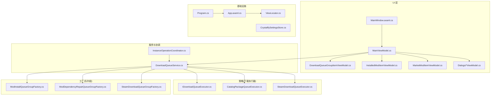
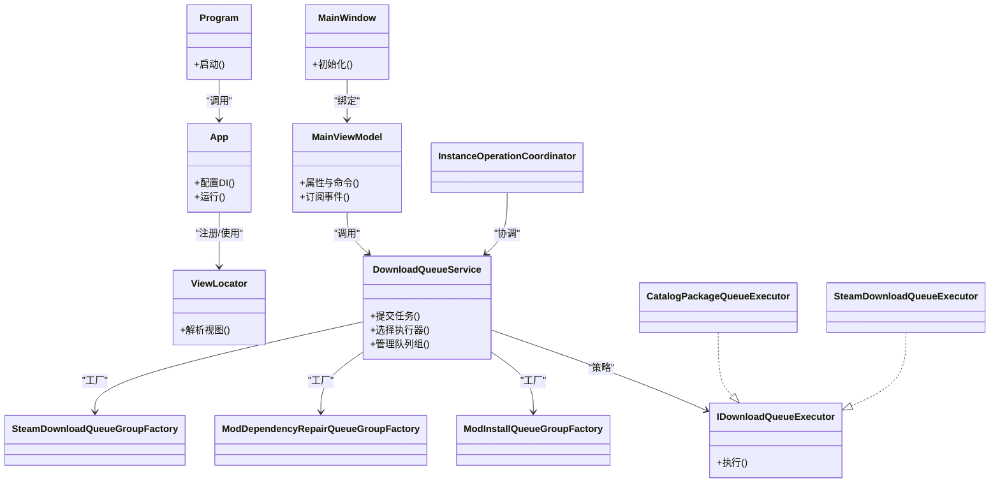
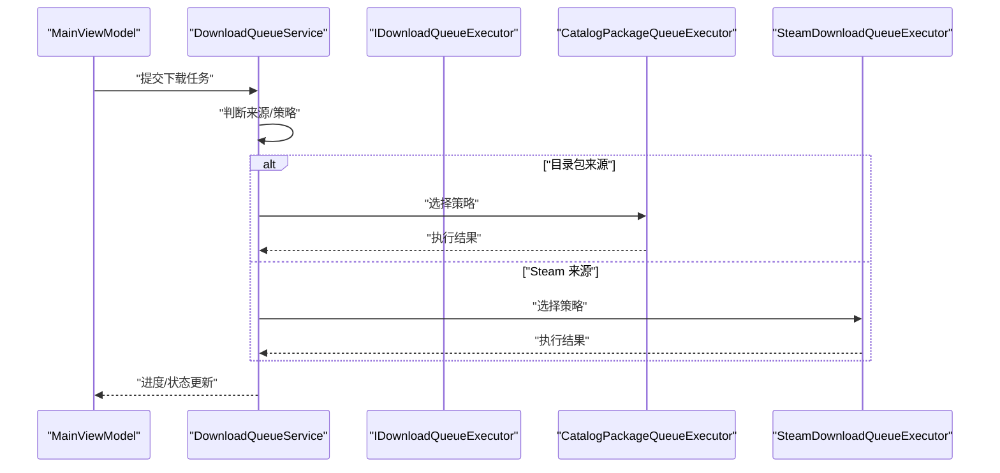
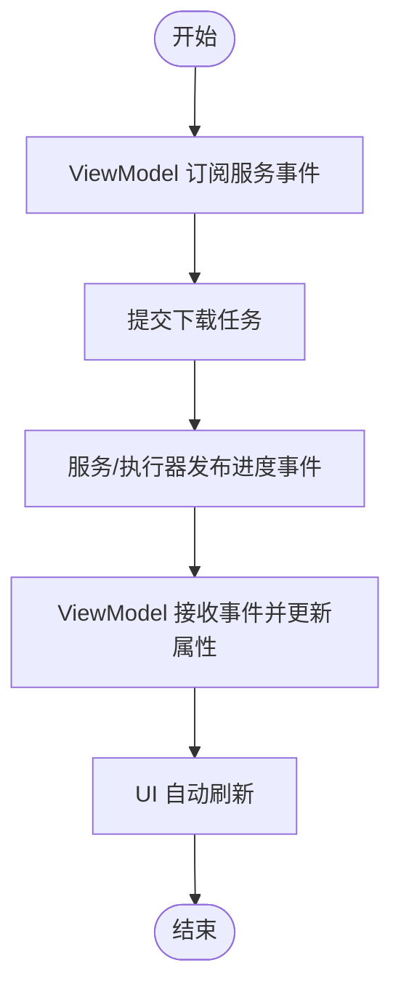
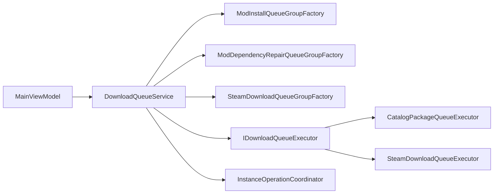

# 设计模式应用

<cite>
**本文引用的文件**   
- [Program.cs](file://src/Crystalfly.App/Program.cs)
- [App.axaml.cs](file://src/Crystalfly.App/App.axaml.cs)
- [ViewLocator.cs](file://src/Crystalfly.App/ViewLocator.cs)
- [MainWindow.axaml.cs](file://src/Crystalfly.App/Views/MainWindow.axaml.cs)
- [MainViewModel.cs](file://src/Crystalfly.App/ViewModels/MainViewModel.cs)
- [DownloadQueueGroupItemViewModel.cs](file://src/Crystalfly.App/ViewModels/DownloadQueueGroupItemViewModel.cs)
- [InstalledModItemViewModel.cs](file://src/Crystalfly.App/ViewModels/InstalledModItemViewModel.cs)
- [MarketModItemViewModel.cs](file://src/Crystalfly.App/ViewModels/MarketModItemViewModel.cs)
- [ConfirmationDialogViewModel.cs](file://src/Crystalfly.App/ViewModels/Dialogs/ConfirmationDialogViewModel.cs)
- [DependencyPlanDialogViewModel.cs](file://src/Crystalfly.App/ViewModels/Dialogs/DependencyPlanDialogViewModel.cs)
- [MarketInstallDialogViewModel.cs](file://src/Crystalfly.App/ViewModels/Dialogs/MarketInstallDialogViewModel.cs)
- [TextInputDialogViewModel.cs](file://src/Crystalfly.App/ViewModels/Dialogs/TextInputDialogViewModel.cs)
- [DownloadQueueService.cs](file://src/Crystalfly.App/Downloads/DownloadQueueService.cs)
- [IDownloadQueueExecutor.cs](file://src/Crystalfly.App/Downloads/IDownloadQueueExecutor.cs)
- [CatalogPackageQueueExecutor.cs](file://src/Crystalfly.App/Downloads/CatalogPackageQueueExecutor.cs)
- [SteamDownloadQueueExecutor.cs](file://src/Crystalfly.App/Downloads/SteamDownloadQueueExecutor.cs)
- [ModInstallQueueGroupFactory.cs](file://src/Crystalfly.App/Downloads/ModInstallQueueGroupFactory.cs)
- [ModDependencyRepairQueueGroupFactory.cs](file://src/Crystalfly.App/Downloads/ModDependencyRepairQueueGroupFactory.cs)
- [SteamDownloadQueueGroupFactory.cs](file://src/Crystalfly.App/Downloads/SteamDownloadQueueGroupFactory.cs)
- [InstanceOperationCoordinator.cs](file://src/Crystalfly.App/Downloads/InstanceOperationCoordinator.cs)
- [CrystalflySettingsStore.cs](file://src/Crystalfly.Core/Configuration/CrystalflySettingsStore.cs)
</cite>

## 目录
1. [简介](#简介)
2. [项目结构](#项目结构)
3. [核心组件](#核心组件)
4. [架构总览](#架构总览)
5. [详细组件分析](#详细组件分析)
6. [依赖关系分析](#依赖关系分析)
7. [性能考量](#性能考量)
8. [故障排查指南](#故障排查指南)
9. [结论](#结论)
10. [附录](#附录)

## 简介
本文件聚焦 Crystalfly 项目中设计模式的落地实践，围绕以下五种模式展开：
- MVVM 模式在 UI 层的实现
- 依赖注入在服务注册中的应用
- 工厂模式在队列组创建中的使用
- 策略模式在下载执行器中的体现
- 观察者模式在事件驱动更新中的应用

文档将解释每种模式的实现方式、适用场景与收益，并提供扩展与自定义建议。为避免泄露具体代码内容，所有示例均以“代码片段路径”形式引用到对应源文件。

## 项目结构
从设计模式视角看，UI 层位于 App 工程，业务与服务位于 Core 与 Steam 工程；下载相关能力横跨 App 与 Steam 工程，通过接口解耦与工厂/策略组合实现可扩展的下载管线。

图表来源
- [Program.cs:1-200](file://src/Crystalfly.App/Program.cs#L1-L200)
- [App.axaml.cs:1-200](file://src/Crystalfly.App/App.axaml.cs#L1-L200)
- [ViewLocator.cs:1-200](file://src/Crystalfly.App/ViewLocator.cs#L1-L200)
- [MainWindow.axaml.cs:1-200](file://src/Crystalfly.App/Views/MainWindow.axaml.cs#L1-L200)
- [MainViewModel.cs:1-200](file://src/Crystalfly.App/ViewModels/MainViewModel.cs#L1-L200)
- [DownloadQueueService.cs:1-200](file://src/Crystalfly.App/Downloads/DownloadQueueService.cs#L1-L200)
- [IDownloadQueueExecutor.cs:1-200](file://src/Crystalfly.App/Downloads/IDownloadQueueExecutor.cs#L1-L200)
- [CatalogPackageQueueExecutor.cs:1-200](file://src/Crystalfly.App/Downloads/CatalogPackageQueueExecutor.cs#L1-L200)
- [SteamDownloadQueueExecutor.cs:1-200](file://src/Crystalfly.App/Downloads/SteamDownloadQueueExecutor.cs#L1-L200)
- [ModInstallQueueGroupFactory.cs:1-200](file://src/Crystalfly.App/Downloads/ModInstallQueueGroupFactory.cs#L1-L200)
- [ModDependencyRepairQueueGroupFactory.cs:1-200](file://src/Crystalfly.App/Downloads/ModDependencyRepairQueueGroupFactory.cs#L1-L200)
- [SteamDownloadQueueGroupFactory.cs:1-200](file://src/Crystalfly.App/Downloads/SteamDownloadQueueGroupFactory.cs#1-L200)
- [InstanceOperationCoordinator.cs:1-200](file://src/Crystalfly.App/Downloads/InstanceOperationCoordinator.cs#L1-L200)
- [CrystalflySettingsStore.cs:1-200](file://src/Crystalfly.Core/Configuration/CrystalflySettingsStore.cs#L1-L200)

章节来源
- [Program.cs:1-200](file://src/Crystalfly.App/Program.cs#L1-L200)
- [App.axaml.cs:1-200](file://src/Crystalfly.App/App.axaml.cs#L1-L200)
- [ViewLocator.cs:1-200](file://src/Crystalfly.App/ViewLocator.cs#L1-L200)
- [MainWindow.axaml.cs:1-200](file://src/Crystalfly.App/Views/MainWindow.axaml.cs#L1-L200)
- [MainViewModel.cs:1-200](file://src/Crystalfly.App/ViewModels/MainViewModel.cs#L1-L200)
- [DownloadQueueService.cs:1-200](file://src/Crystalfly.App/Downloads/DownloadQueueService.cs#L1-L200)
- [IDownloadQueueExecutor.cs:1-200](file://src/Crystalfly.App/Downloads/IDownloadQueueExecutor.cs#L1-L200)
- [CatalogPackageQueueExecutor.cs:1-200](file://src/Crystalfly.App/Downloads/CatalogPackageQueueExecutor.cs#L1-L200)
- [SteamDownloadQueueExecutor.cs:1-200](file://src/Crystalfly.App/Downloads/SteamDownloadQueueExecutor.cs#L1-L200)
- [ModInstallQueueGroupFactory.cs:1-200](file://src/Crystalfly.App/Downloads/ModInstallQueueGroupFactory.cs#L1-L200)
- [ModDependencyRepairQueueGroupFactory.cs:1-200](file://src/Crystalfly.App/Downloads/ModDependencyRepairQueueGroupFactory.cs#L1-L200)
- [SteamDownloadQueueGroupFactory.cs:1-200](file://src/Crystalfly.App/Downloads/SteamDownloadQueueGroupFactory.cs#L1-L200)
- [InstanceOperationCoordinator.cs:1-200](file://src/Crystalfly.App/Downloads/InstanceOperationCoordinator.cs#L1-L200)
- [CrystalflySettingsStore.cs:1-200](file://src/Crystalfly.Core/Configuration/CrystalflySettingsStore.cs#L1-L200)

## 核心组件
- UI 视图模型族：主界面与对话框相关的 ViewModel，负责状态持有、命令绑定与数据展示。
- 下载队列服务：编排下载任务、选择执行策略、管理队列组生命周期。
- 下载执行器策略：不同来源（如目录包、Steam）的下载实现。
- 队列组工厂：按场景创建不同类型的下载队列组。
- 实例操作协调器：跨模块协调实例级操作与下载流程。

章节来源
- [MainViewModel.cs:1-200](file://src/Crystalfly.App/ViewModels/MainViewModel.cs#L1-L200)
- [DownloadQueueService.cs:1-200](file://src/Crystalfly.App/Downloads/DownloadQueueService.cs#L1-L200)
- [IDownloadQueueExecutor.cs:1-200](file://src/Crystalfly.App/Downloads/IDownloadQueueExecutor.cs#L1-L200)
- [CatalogPackageQueueExecutor.cs:1-200](file://src/Crystalfly.App/Downloads/CatalogPackageQueueExecutor.cs#L1-L200)
- [SteamDownloadQueueExecutor.cs:1-200](file://src/Crystalfly.App/Downloads/SteamDownloadQueueExecutor.cs#L1-L200)
- [ModInstallQueueGroupFactory.cs:1-200](file://src/Crystalfly.App/Downloads/ModInstallQueueGroupFactory.cs#L1-L200)
- [ModDependencyRepairQueueGroupFactory.cs:1-200](file://src/Crystalfly.App/Downloads/ModDependencyRepairQueueGroupFactory.cs#L1-L200)
- [SteamDownloadQueueGroupFactory.cs:1-200](file://src/Crystalfly.App/Downloads/SteamDownloadQueueGroupFactory.cs#L1-L200)
- [InstanceOperationCoordinator.cs:1-200](file://src/Crystalfly.App/Downloads/InstanceOperationCoordinator.cs#L1-L200)

## 架构总览
下图展示了 MVVM、依赖注入、工厂与策略在整体架构中的协作关系。

图表来源
- [Program.cs:1-200](file://src/Crystalfly.App/Program.cs#L1-L200)
- [App.axaml.cs:1-200](file://src/Crystalfly.App/App.axaml.cs#L1-L200)
- [ViewLocator.cs:1-200](file://src/Crystalfly.App/ViewLocator.cs#L1-L200)
- [MainWindow.axaml.cs:1-200](file://src/Crystalfly.App/Views/MainWindow.axaml.cs#L1-L200)
- [MainViewModel.cs:1-200](file://src/Crystalfly.App/ViewModels/MainViewModel.cs#L1-L200)
- [DownloadQueueService.cs:1-200](file://src/Crystalfly.App/Downloads/DownloadQueueService.cs#L1-L200)
- [IDownloadQueueExecutor.cs:1-200](file://src/Crystalfly.App/Downloads/IDownloadQueueExecutor.cs#L1-L200)
- [CatalogPackageQueueExecutor.cs:1-200](file://src/Crystalfly.App/Downloads/CatalogPackageQueueExecutor.cs#L1-L200)
- [SteamDownloadQueueExecutor.cs:1-200](file://src/Crystalfly.App/Downloads/SteamDownloadQueueExecutor.cs#L1-L200)
- [ModInstallQueueGroupFactory.cs:1-200](file://src/Crystalfly.App/Downloads/ModInstallQueueGroupFactory.cs#L1-L200)
- [ModDependencyRepairQueueGroupFactory.cs:1-200](file://src/Crystalfly.App/Downloads/ModDependencyRepairQueueGroupFactory.cs#L1-L200)
- [SteamDownloadQueueGroupFactory.cs:1-200](file://src/Crystalfly.App/Downloads/SteamDownloadQueueGroupFactory.cs#L1-L200)
- [InstanceOperationCoordinator.cs:1-200](file://src/Crystalfly.App/Downloads/InstanceOperationCoordinator.cs#L1-L200)

## 详细组件分析

### MVVM 模式在 UI 层的实现
- 角色划分
  - View：XAML 视图与后置代码，仅处理显示与用户交互。
  - ViewModel：承载状态、命令与通知，不直接访问 UI 控件。
  - Model：领域对象与持久化数据（由服务提供）。
- 关键实现点
  - 视图与 ViewModel 的绑定由 ViewLocator 统一解析。
  - 主窗口通过构造函数或属性注入获取 MainViewModel。
  - ViewModel 暴露可绑定的属性与命令，并通过事件/回调驱动 UI 刷新。
- 适用场景
  - 复杂交互界面、需要多视图共享状态、便于单元测试。
- 收益
  - 关注点分离、可测试性提升、样式与逻辑解耦。
- 扩展建议
  - 新增页面时遵循命名约定与定位规则，确保 ViewLocator 能正确解析。
  - 为复杂对话框抽取专用 ViewModel，保持单一职责。

章节来源
- [ViewLocator.cs:1-200](file://src/Crystalfly.App/ViewLocator.cs#L1-L200)
- [MainWindow.axaml.cs:1-200](file://src/Crystalfly.App/Views/MainWindow.axaml.cs#L1-L200)
- [MainViewModel.cs:1-200](file://src/Crystalfly.App/ViewModels/MainViewModel.cs#L1-L200)
- [DownloadQueueGroupItemViewModel.cs:1-200](file://src/Crystalfly.App/ViewModels/DownloadQueueGroupItemViewModel.cs#L1-L200)
- [InstalledModItemViewModel.cs:1-200](file://src/Crystalfly.App/ViewModels/InstalledModItemViewModel.cs#L1-L200)
- [MarketModItemViewModel.cs:1-200](file://src/Crystalfly.App/ViewModels/MarketModItemViewModel.cs#L1-L200)
- [ConfirmationDialogViewModel.cs:1-200](file://src/Crystalfly.App/ViewModels/Dialogs/ConfirmationDialogViewModel.cs#L1-L200)
- [DependencyPlanDialogViewModel.cs:1-200](file://src/Crystalfly.App/ViewModels/Dialogs/DependencyPlanDialogViewModel.cs#L1-L200)
- [MarketInstallDialogViewModel.cs:1-200](file://src/Crystalffly.App/ViewModels/Dialogs/MarketInstallDialogViewModel.cs#L1-L200)
- [TextInputDialogViewModel.cs:1-200](file://src/Crystalfly.App/ViewModels/Dialogs/TextInputDialogViewModel.cs#L1-L200)

### 依赖注入在服务注册中的应用
- 角色划分
  - Program/App：应用入口与 DI 容器配置。
  - 服务：下载队列服务、设置存储等。
- 关键实现点
  - 在应用启动阶段完成服务注册与生命周期管理。
  - 通过构造函数注入将服务提供给 ViewModel 与协调器。
- 适用场景
  - 松耦合装配、替换实现、集中式配置。
- 收益
  - 降低耦合、提高可测试性与可维护性。
- 扩展建议
  - 新增服务后在启动处注册，并在需要的地方通过构造注入消费。

章节来源
- [Program.cs:1-200](file://src/Crystalfly.App/Program.cs#L1-L200)
- [App.axaml.cs:1-200](file://src/Crystalfly.App/App.axaml.cs#L1-L200)
- [DownloadQueueService.cs:1-200](file://src/Crystalfly.App/Downloads/DownloadQueueService.cs#L1-L200)
- [CrystalflySettingsStore.cs:1-200](file://src/Crystalfly.Core/Configuration/CrystalflySettingsStore.cs#L1-L200)

### 工厂模式在队列组创建中的使用
- 角色划分
  - 工厂：ModInstallQueueGroupFactory、ModDependencyRepairQueueGroupFactory、SteamDownloadQueueGroupFactory。
  - 客户端：DownloadQueueService 根据场景选择并创建队列组。
- 关键实现点
  - 将“如何创建队列组”的细节封装在各自工厂中。
  - 客户端只关心“需要什么类型的队列组”，无需了解内部构造细节。
- 适用场景
  - 对象创建逻辑复杂、存在多种变体、未来可能新增类型。
- 收益
  - 开闭原则友好、降低客户端复杂度、利于测试替换。
- 扩展建议
  - 新增队列组类型时，新增工厂并在服务中选择分支中注册。

章节来源
- [ModInstallQueueGroupFactory.cs:1-200](file://src/Crystalfly.App/Downloads/ModInstallQueueGroupFactory.cs#L1-L200)
- [ModDependencyRepairQueueGroupFactory.cs:1-200](file://src/Crystalfly.App/Downloads/ModDependencyRepairQueueGroupFactory.cs#L1-L200)
- [SteamDownloadQueueGroupFactory.cs:1-200](file://src/Crystalfly.App/Downloads/SteamDownloadQueueGroupFactory.cs#L1-L200)
- [DownloadQueueService.cs:1-200](file://src/Crystalfly.App/Downloads/DownloadQueueService.cs#L1-L200)

### 策略模式在下载执行器中的体现
- 角色划分
  - 策略接口：IDownloadQueueExecutor。
  - 具体策略：CatalogPackageQueueExecutor、SteamDownloadQueueExecutor。
  - 上下文：DownloadQueueService 根据来源选择具体策略执行。
- 关键实现点
  - 通过接口抽象下载行为，具体实现屏蔽差异。
  - 运行时动态选择策略，支持热插拔。
- 适用场景
  - 同一操作有多种算法/来源实现，且需灵活切换。
- 收益
  - 消除条件分支、易于扩展新来源、便于单测替换。
- 扩展建议
  - 新增来源时实现接口并注册到策略选择逻辑中。

图表来源
- [MainViewModel.cs:1-200](file://src/Crystalfly.App/ViewModels/MainViewModel.cs#L1-L200)
- [DownloadQueueService.cs:1-200](file://src/Crystalfly.App/Downloads/DownloadQueueService.cs#L1-L200)
- [IDownloadQueueExecutor.cs:1-200](file://src/Crystalfly.App/Downloads/IDownloadQueueExecutor.cs#L1-L200)
- [CatalogPackageQueueExecutor.cs:1-200](file://src/Crystalfly.App/Downloads/CatalogPackageQueueExecutor.cs#L1-L200)
- [SteamDownloadQueueExecutor.cs:1-200](file://src/Crystalfly.App/Downloads/SteamDownloadQueueExecutor.cs#L1-L200)

章节来源
- [IDownloadQueueExecutor.cs:1-200](file://src/Crystalfly.App/Downloads/IDownloadQueueExecutor.cs#L1-L200)
- [CatalogPackageQueueExecutor.cs:1-200](file://src/Crystalfly.App/Downloads/CatalogPackageQueueExecutor.cs#L1-L200)
- [SteamDownloadQueueExecutor.cs:1-200](file://src/Crystalfly.App/Downloads/SteamDownloadQueueExecutor.cs#L1-L200)
- [DownloadQueueService.cs:1-200](file://src/Crystalfly.App/Downloads/DownloadQueueService.cs#L1-L200)

### 观察者模式在事件驱动更新中的应用
- 角色划分
  - 发布者：下载队列服务或执行器（产生进度/状态事件）。
  - 订阅者：ViewModel 或 UI 组件（监听并刷新界面）。
- 关键实现点
  - 通过事件/回调机制实现发布-订阅，避免强引用导致的循环依赖。
  - ViewModel 订阅服务事件，更新自身属性以驱动 UI 刷新。
- 适用场景
  - 异步任务进度反馈、跨层状态同步、解耦发布与消费方。
- 收益
  - 低耦合、易扩展、天然适配异步与并发。
- 扩展建议
  - 定义明确的事件契约，避免过度细粒度事件导致噪声。

[此图为概念流程图，未直接映射具体源码，故无图表来源]

章节来源
- [DownloadQueueService.cs:1-200](file://src/Crystalfly.App/Downloads/DownloadQueueService.cs#L1-L200)
- [MainViewModel.cs:1-200](file://src/Crystalfly.App/ViewModels/MainViewModel.cs#L1-L200)

## 依赖关系分析
- 组件内聚与耦合
  - DownloadQueueService 作为协调中心，聚合工厂与策略，对外暴露简洁 API。
  - ViewModel 仅依赖服务接口，不感知底层实现细节。
- 外部依赖
  - 设置存储、网络与 Steam 客户端通过服务层隔离，便于替换与测试。
- 潜在循环依赖
  - 通过事件/回调与接口解耦，避免 View 与 Service 的直接双向依赖。

图表来源
- [MainViewModel.cs:1-200](file://src/Crystalfly.App/ViewModels/MainViewModel.cs#L1-L200)
- [DownloadQueueService.cs:1-200](file://src/Crystalfly.App/Downloads/DownloadQueueService.cs#L1-L200)
- [ModInstallQueueGroupFactory.cs:1-200](file://src/Crystalfly.App/Downloads/ModInstallQueueGroupFactory.cs#L1-L200)
- [ModDependencyRepairQueueGroupFactory.cs:1-200](file://src/Crystalfly.App/Downloads/ModDependencyRepairQueueGroupFactory.cs#L1-L200)
- [SteamDownloadQueueGroupFactory.cs:1-200](file://src/Crystalfly.App/Downloads/SteamDownloadQueueGroupFactory.cs#L1-L200)
- [IDownloadQueueExecutor.cs:1-200](file://src/Crystalfly.App/Downloads/IDownloadQueueExecutor.cs#L1-L200)
- [CatalogPackageQueueExecutor.cs:1-200](file://src/Crystalfly.App/Downloads/CatalogPackageQueueExecutor.cs#L1-L200)
- [SteamDownloadQueueExecutor.cs:1-200](file://src/Crystalfly.App/Downloads/SteamDownloadQueueExecutor.cs#L1-L200)
- [InstanceOperationCoordinator.cs:1-200](file://src/Crystalfly.App/Downloads/InstanceOperationCoordinator.cs#L1-L200)

章节来源
- [DownloadQueueService.cs:1-200](file://src/Crystalfly.App/Downloads/DownloadQueueService.cs#L1-L200)
- [InstanceOperationCoordinator.cs:1-200](file://src/Crystalfly.App/Downloads/InstanceOperationCoordinator.cs#L1-L200)

## 性能考量
- 策略选择开销：策略选择逻辑应轻量，必要时可缓存选择结果。
- 事件风暴：控制事件粒度与频率，避免 UI 频繁重绘。
- 资源释放：队列组与执行器应在完成后及时释放资源，防止内存泄漏。
- 并发控制：合理限制并发下载数，避免阻塞 IO 与 CPU。

[本节为通用指导，不涉及具体源码分析]

## 故障排查指南
- 常见问题
  - 视图无法解析：检查 ViewLocator 命名约定与注册。
  - 依赖注入失败：确认服务已在启动阶段注册且生命周期正确。
  - 下载无进度：确认事件订阅是否生效、事件发布路径是否正确。
  - 策略未生效：核对策略选择分支与参数匹配。
- 定位步骤
  - 在关键节点添加日志输出，观察调用链路与返回值。
  - 使用最小复现用例验证问题范围。
  - 针对策略与工厂编写单元测试，快速验证分支覆盖。

章节来源
- [ViewLocator.cs:1-200](file://src/Crystalfly.App/ViewLocator.cs#L1-L200)
- [Program.cs:1-200](file://src/Crystalfly.App/Program.cs#L1-L200)
- [App.axaml.cs:1-200](file://src/Crystalfly.App/App.axaml.cs#L1-L200)
- [DownloadQueueService.cs:1-200](file://src/Crystalfly.App/Downloads/DownloadQueueService.cs#L1-L200)

## 结论
本项目通过 MVVM、依赖注入、工厂与策略、观察者等模式的组合，实现了高内聚、低耦合、可扩展的 UI 与下载管线。遵循上述最佳实践与扩展建议，可在不破坏既有结构的前提下平滑演进新功能。

[本节为总结性内容，不涉及具体源码分析]

## 附录
- 术语
  - 队列组：一组具有相同来源或目标的下载任务的集合。
  - 策略：对同一接口的不同实现，用于在不同来源间切换下载行为。
  - 工厂：负责创建特定对象的类，隐藏构造细节。
- 参考路径
  - 视图与绑定：[MainWindow.axaml.cs](file://src/Crystalfly.App/Views/MainWindow.axaml.cs)、[MainViewModel.cs](file://src/Crystalfly.App/ViewModels/MainViewModel.cs)
  - 服务与策略：[DownloadQueueService.cs](file://src/Crystalfly.App/Downloads/DownloadQueueService.cs)、[IDownloadQueueExecutor.cs](file://src/Crystalfly.App/Downloads/IDownloadQueueExecutor.cs)
  - 工厂与协调：[ModInstallQueueGroupFactory.cs](file://src/Crystalfly.App/Downloads/ModInstallQueueGroupFactory.cs)、[InstanceOperationCoordinator.cs](file://src/Crystalfly.App/Downloads/InstanceOperationCoordinator.cs)