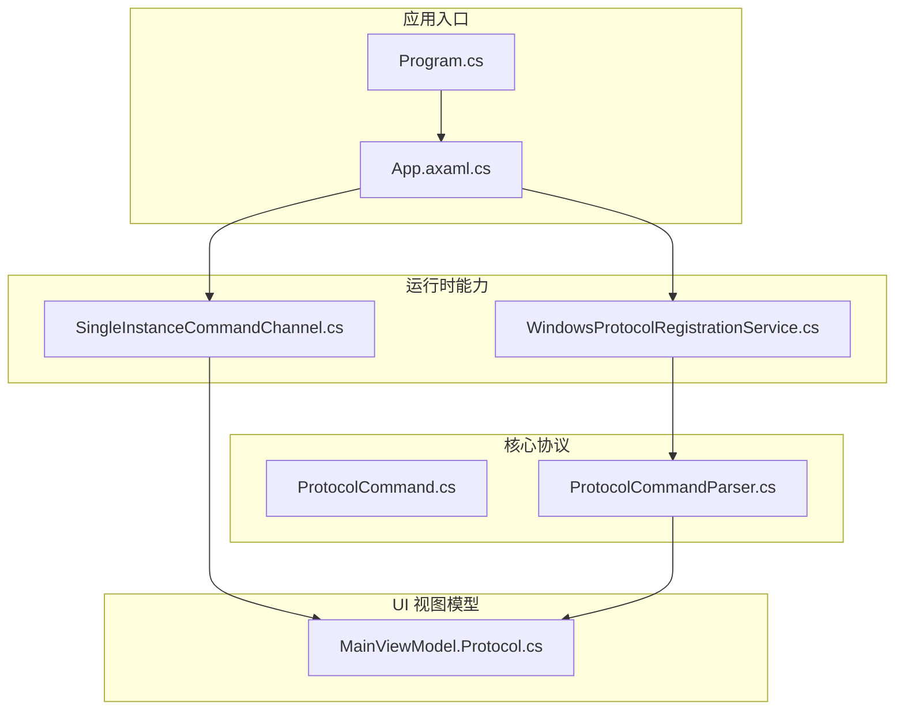
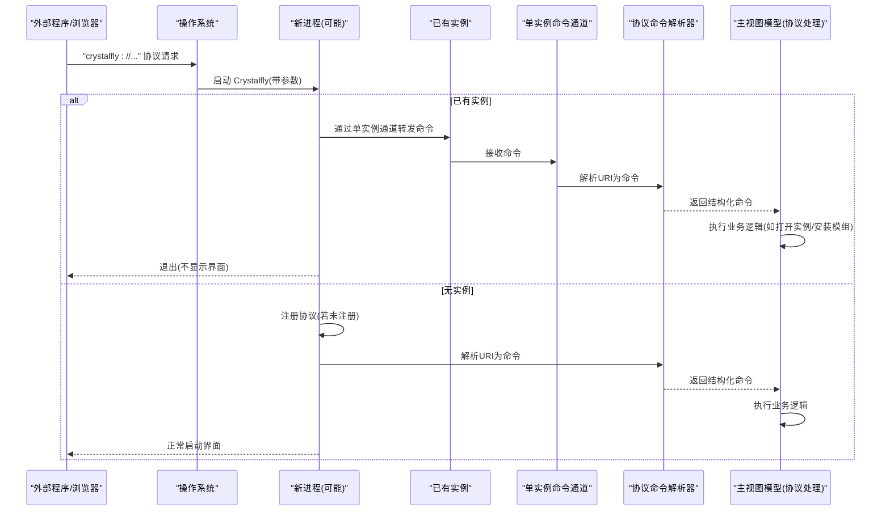
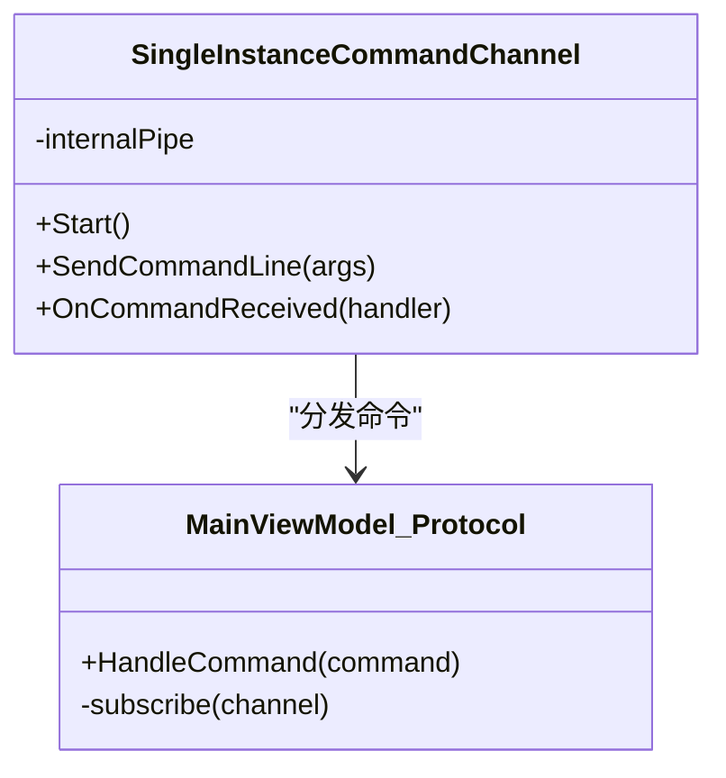
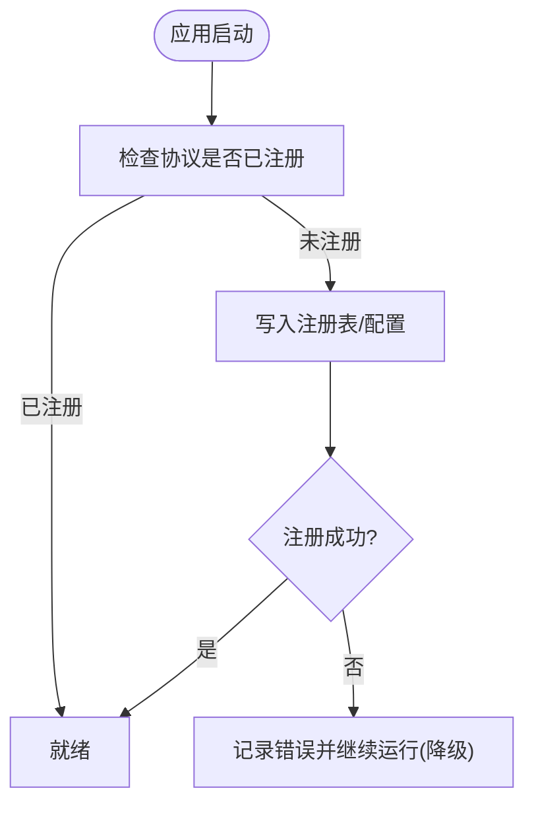
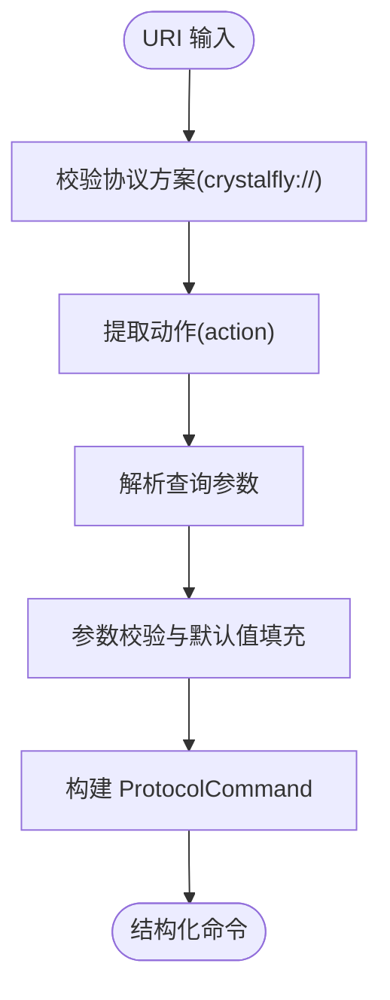
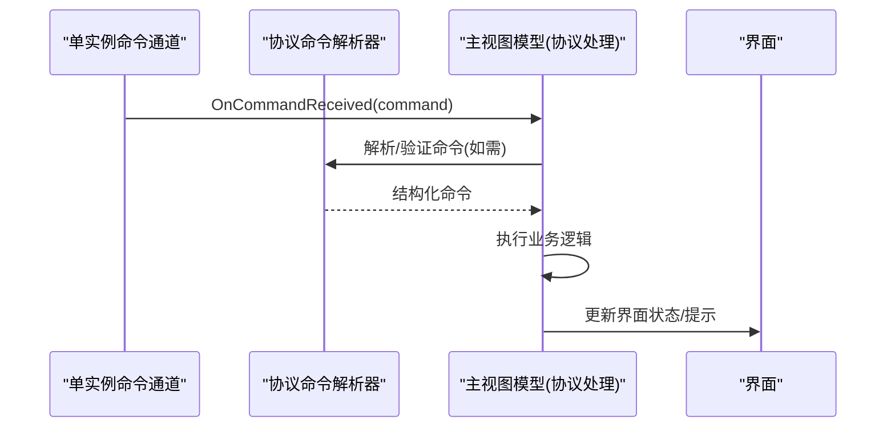
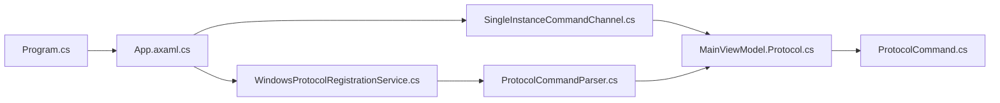

# 协议支持和单实例管理

<cite>
**本文引用的文件**   
- [Program.cs](file://src/Crystalfly.App/Program.cs)
- [App.axaml.cs](file://src/Crystalfly.App/App.axaml.cs)
- [SingleInstanceCommandChannel.cs](file://src/Crystalfly.App/Runtime/SingleInstanceCommandChannel.cs)
- [WindowsProtocolRegistrationService.cs](file://src/Crystalfly.App/Runtime/WindowsProtocolRegistrationService.cs)
- [MainViewModel.Protocol.cs](file://src/Crystalfly.App/ViewModels/MainViewModel.Protocol.cs)
- [ProtocolCommand.cs](file://src/Crystalfly.Core/Runtime/ProtocolCommand.cs)
- [ProtocolCommandParser.cs](file://src/Crystalfly.Core/Runtime/ProtocolCommandParser.cs)
</cite>

## 目录
1. [简介](#简介)
2. [项目结构](#项目结构)
3. [核心组件](#核心组件)
4. [架构总览](#架构总览)
5. [详细组件分析](#详细组件分析)
6. [依赖关系分析](#依赖关系分析)
7. [性能与可靠性考虑](#性能与可靠性考虑)
8. [故障排查指南](#故障排查指南)
9. [结论](#结论)

## 简介
本章节聚焦于 Crystalfly 的“协议支持”和“单实例管理”两大能力：
- 协议支持：通过自定义 Windows URI 协议，使外部程序或浏览器可以调用 Crystalfly 并传递操作指令（例如打开某个实例、安装模组等）。
- 单实例管理：确保同一时刻仅有一个 Crystalfly 主进程运行；当再次启动时，将参数转发给已有实例并退出当前进程。

这两项能力共同提升了用户体验：用户可通过链接一键唤起应用，且避免重复实例导致的资源竞争与状态不一致问题。

## 项目结构
与协议支持和单实例管理直接相关的代码主要分布在以下位置：
- 应用入口与初始化：Program.cs、App.axaml.cs
- 单实例通道：SingleInstanceCommandChannel.cs
- 协议注册服务：WindowsProtocolRegistrationService.cs
- 协议命令模型与解析：ProtocolCommand.cs、ProtocolCommandParser.cs
- UI 层对协议的响应：MainViewModel.Protocol.cs

图表来源
- [Program.cs](file://src/Crystalfly.App/Program.cs)
- [App.axaml.cs](file://src/Crystalfly.App/App.axaml.cs)
- [SingleInstanceCommandChannel.cs](file://src/Crystalfly.App/Runtime/SingleInstanceCommandChannel.cs)
- [WindowsProtocolRegistrationService.cs](file://src/Crystalfly.App/Runtime/WindowsProtocolRegistrationService.cs)
- [ProtocolCommand.cs](file://src/Crystalfly.Core/Runtime/ProtocolCommand.cs)
- [ProtocolCommandParser.cs](file://src/Crystalfly.Core/Runtime/ProtocolCommandParser.cs)
- [MainViewModel.Protocol.cs](file://src/Crystalfly.App/ViewModels/MainViewModel.Protocol.cs)

章节来源
- [Program.cs](file://src/Crystalfly.App/Program.cs)
- [App.axaml.cs](file://src/Crystalfly.App/App.axaml.cs)
- [SingleInstanceCommandChannel.cs](file://src/Crystalfly.App/Runtime/SingleInstanceCommandChannel.cs)
- [WindowsProtocolRegistrationService.cs](file://src/Crystalfly.App/Runtime/WindowsProtocolRegistrationService.cs)
- [ProtocolCommand.cs](file://src/Crystalfly.Core/Runtime/ProtocolCommand.cs)
- [ProtocolCommandParser.cs](file://src/Crystalfly.Core/Runtime/ProtocolCommandParser.cs)
- [MainViewModel.Protocol.cs](file://src/Crystalfly.App/ViewModels/MainViewModel.Protocol.cs)

## 核心组件
- 单实例命令通道（SingleInstanceCommandChannel）
  - 负责检测是否已有实例在运行；若存在，则将命令行参数转发至已有实例，随后退出当前进程。
  - 提供跨进程通信机制，用于接收新实例传入的命令。
- 协议注册服务（WindowsProtocolRegistrationService）
  - 负责在系统中注册自定义 URI 协议（如 crystalfly://），使操作系统能将协议请求路由到 Crystalfly。
  - 处理首次启动时的注册逻辑，确保协议可用。
- 协议命令模型与解析（ProtocolCommand、ProtocolCommandParser）
  - ProtocolCommand：定义协议命令的数据结构（如动作类型、目标实例标识、附加参数等）。
  - ProtocolCommandParser：从 URI 中解析出 ProtocolCommand 对象，供上层使用。
- UI 层协议处理（MainViewModel.Protocol）
  - 订阅来自单实例通道的命令事件，调用业务逻辑执行对应操作（如打开实例、安装模组等）。

章节来源
- [SingleInstanceCommandChannel.cs](file://src/Crystalfly.App/Runtime/SingleInstanceCommandChannel.cs)
- [WindowsProtocolRegistrationService.cs](file://src/Crystalfly.App/Runtime/WindowsProtocolRegistrationService.cs)
- [ProtocolCommand.cs](file://src/Crystalfly.Core/Runtime/ProtocolCommand.cs)
- [ProtocolCommandParser.cs](file://src/Crystalfly.Core/Runtime/ProtocolCommandParser.cs)
- [MainViewModel.Protocol.cs](file://src/Crystalfly.App/ViewModels/MainViewModel.Protocol.cs)

## 架构总览
下图展示了从外部触发到内部执行的完整流程：浏览器或外部程序通过自定义协议发起请求，操作系统将其路由到 Crystalfly；若已有实例运行，则通过单实例通道将命令转发至该实例；若无实例，则由新实例完成协议注册并处理命令。

图表来源
- [Program.cs](file://src/Crystalfly.App/Program.cs)
- [App.axaml.cs](file://src/Crystalfly.App/App.axaml.cs)
- [SingleInstanceCommandChannel.cs](file://src/Crystalfly.App/Runtime/SingleInstanceCommandChannel.cs)
- [WindowsProtocolRegistrationService.cs](file://src/Crystalfly.App/Runtime/WindowsProtocolRegistrationService.cs)
- [ProtocolCommandParser.cs](file://src/Crystalfly.Core/Runtime/ProtocolCommandParser.cs)
- [MainViewModel.Protocol.cs](file://src/Crystalfly.App/ViewModels/MainViewModel.Protocol.cs)

## 详细组件分析

### 单实例命令通道（SingleInstanceCommandChannel）
职责与行为
- 检测是否存在已有实例。
- 若存在，将当前进程的命令行参数封装为命令并通过命名管道/共享内存等方式发送给已有实例。
- 发送完成后立即退出当前进程，避免多实例并行。
- 作为消息总线，向 UI 层分发已接收的命令。

关键交互
- 应用启动时创建并监听通道。
- 收到命令后交由 MainViewModel 的协议处理逻辑执行。

图表来源
- [SingleInstanceCommandChannel.cs](file://src/Crystalfly.App/Runtime/SingleInstanceCommandChannel.cs)
- [MainViewModel.Protocol.cs](file://src/Crystalfly.App/ViewModels/MainViewModel.Protocol.cs)

章节来源
- [SingleInstanceCommandChannel.cs](file://src/Crystalfly.App/Runtime/SingleInstanceCommandChannel.cs)
- [MainViewModel.Protocol.cs](file://src/Crystalfly.App/ViewModels/MainViewModel.Protocol.cs)

### 协议注册服务（WindowsProtocolRegistrationService）
职责与行为
- 在系统注册表中写入自定义协议信息（如协议名、默认图标、处理程序路径等）。
- 仅在必要时进行注册，避免重复写入。
- 提供方法供应用启动时调用，确保协议可用。

典型流程
- 应用首次启动或检测到未注册时调用注册接口。
- 注册成功后，操作系统可将协议请求定向到 Crystalfly。

图表来源
- [WindowsProtocolRegistrationService.cs](file://src/Crystalfly.App/Runtime/WindowsProtocolRegistrationService.cs)

章节来源
- [WindowsProtocolRegistrationService.cs](file://src/Crystalfly.App/Runtime/WindowsProtocolRegistrationService.cs)

### 协议命令模型与解析（ProtocolCommand、ProtocolCommandParser）
数据结构
- ProtocolCommand：包含动作类型、目标实体标识（如实例 ID）、可选参数等字段。
- ProtocolCommandParser：从 URI 字符串中提取并校验必要参数，构造 ProtocolCommand。

解析流程
- 输入：形如 crystalfly://action?param=value 的 URI。
- 输出：结构化的 ProtocolCommand，供上层直接使用。

图表来源
- [ProtocolCommand.cs](file://src/Crystalfly.Core/Runtime/ProtocolCommand.cs)
- [ProtocolCommandParser.cs](file://src/Crystalfly.Core/Runtime/ProtocolCommandParser.cs)

章节来源
- [ProtocolCommand.cs](file://src/Crystalfly.Core/Runtime/ProtocolCommand.cs)
- [ProtocolCommandParser.cs](file://src/Crystalfly.Core/Runtime/ProtocolCommandParser.cs)

### UI 层协议处理（MainViewModel.Protocol）
职责与行为
- 订阅来自单实例通道的命令事件。
- 根据命令类型执行相应业务逻辑（如打开指定实例、安装预设、同步设置等）。
- 与 UI 状态联动，更新界面反馈。

交互时序
- 新实例通过单实例通道转发命令 → 主实例接收 → 解析 → 调用 ViewModel 处理 → 更新 UI。

图表来源
- [MainViewModel.Protocol.cs](file://src/Crystalfly.App/ViewModels/MainViewModel.Protocol.cs)
- [ProtocolCommandParser.cs](file://src/Crystalfly.Core/Runtime/ProtocolCommandParser.cs)
- [SingleInstanceCommandChannel.cs](file://src/Crystalfly.App/Runtime/SingleInstanceCommandChannel.cs)

章节来源
- [MainViewModel.Protocol.cs](file://src/Crystalfly.App/ViewModels/MainViewModel.Protocol.cs)
- [ProtocolCommandParser.cs](file://src/Crystalfly.Core/Runtime/ProtocolCommandParser.cs)
- [SingleInstanceCommandChannel.cs](file://src/Crystalfly.App/Runtime/SingleInstanceCommandChannel.cs)

## 依赖关系分析
- Program.cs 与 App.axaml.cs 负责应用生命周期与初始化，包括单实例通道与协议注册的启动顺序。
- WindowsProtocolRegistrationService 在应用早期被调用，确保后续协议请求能被正确路由。
- SingleInstanceCommandChannel 贯穿应用生命周期，负责跨进程命令分发。
- ProtocolCommand 与 ProtocolCommandParser 属于核心库，被 UI 层与服务层复用。
- MainViewModel.Protocol 作为 UI 侧的协调者，串联通道与解析器，驱动具体业务。

图表来源
- [Program.cs](file://src/Crystalfly.App/Program.cs)
- [App.axaml.cs](file://src/Crystalfly.App/App.axaml.cs)
- [WindowsProtocolRegistrationService.cs](file://src/Crystalfly.App/Runtime/WindowsProtocolRegistrationService.cs)
- [SingleInstanceCommandChannel.cs](file://src/Crystalfly.App/Runtime/SingleInstanceCommandChannel.cs)
- [ProtocolCommandParser.cs](file://src/Crystalfly.Core/Runtime/ProtocolCommandParser.cs)
- [ProtocolCommand.cs](file://src/Crystalfly.Core/Runtime/ProtocolCommand.cs)
- [MainViewModel.Protocol.cs](file://src/Crystalfly.App/ViewModels/MainViewModel.Protocol.cs)

章节来源
- [Program.cs](file://src/Crystalfly.App/Program.cs)
- [App.axaml.cs](file://src/Crystalfly.App/App.axaml.cs)
- [WindowsProtocolRegistrationService.cs](file://src/Crystalfly.App/Runtime/WindowsProtocolRegistrationService.cs)
- [SingleInstanceCommandChannel.cs](file://src/Crystalfly.App/Runtime/SingleInstanceCommandChannel.cs)
- [ProtocolCommandParser.cs](file://src/Crystalfly.Core/Runtime/ProtocolCommandParser.cs)
- [ProtocolCommand.cs](file://src/Crystalfly.Core/Runtime/ProtocolCommand.cs)
- [MainViewModel.Protocol.cs](file://src/Crystalfly.App/ViewModels/MainViewModel.Protocol.cs)

## 性能与可靠性考虑
- 单实例通道
  - 建议采用轻量级 IPC（命名管道/共享内存）以降低延迟。
  - 对发送失败进行重试与超时控制，避免阻塞主线程。
- 协议注册
  - 注册过程应幂等，避免重复写入注册表造成性能损耗。
  - 对权限不足或注册失败的异常进行捕获并降级处理，保证应用可继续运行。
- 命令解析
  - 对非法 URI 快速失败，减少无效处理开销。
  - 对参数进行白名单校验，防止注入风险。
- UI 层处理
  - 长耗时操作应在后台线程执行，避免阻塞 UI。
  - 对错误进行友好提示，并提供重试入口。

[本节为通用指导，无需特定文件引用]

## 故障排查指南
常见问题与定位要点
- 无法通过协议唤起应用
  - 检查协议是否已注册：确认 WindowsProtocolRegistrationService 的注册逻辑是否执行成功。
  - 查看注册表项是否正确指向 Crystalfly 可执行文件。
- 多次启动仍出现多个实例
  - 检查 SingleInstanceCommandChannel 的检测与转发逻辑是否生效。
  - 确认新进程是否在转发后立即退出。
- 协议参数未被识别
  - 核对 ProtocolCommandParser 的解析规则与 URI 格式是否一致。
  - 检查 MainViewModel.Protocol 的事件订阅是否已建立。
- 权限相关错误
  - 注册协议可能需要管理员权限；若失败，请记录日志并提示用户手动注册或提升权限。

章节来源
- [WindowsProtocolRegistrationService.cs](file://src/Crystalfly.App/Runtime/WindowsProtocolRegistrationService.cs)
- [SingleInstanceCommandChannel.cs](file://src/Crystalfly.App/Runtime/SingleInstanceCommandChannel.cs)
- [ProtocolCommandParser.cs](file://src/Crystalfly.Core/Runtime/ProtocolCommandParser.cs)
- [MainViewModel.Protocol.cs](file://src/Crystalfly.App/ViewModels/MainViewModel.Protocol.cs)

## 结论
通过“协议支持”与“单实例管理”，Crystalfly 实现了：
- 外部系统可安全、可靠地通过自定义协议调用应用功能。
- 多实例场景下自动合并操作，保障状态一致性与资源利用效率。
建议在后续迭代中持续完善错误处理、日志记录与可观测性，以提升整体稳定性与可维护性。