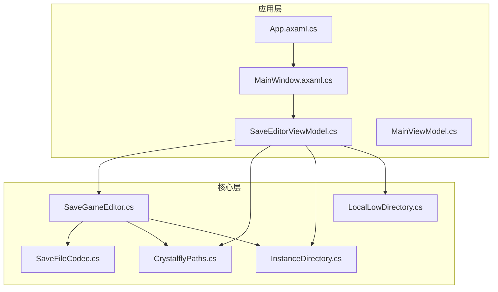
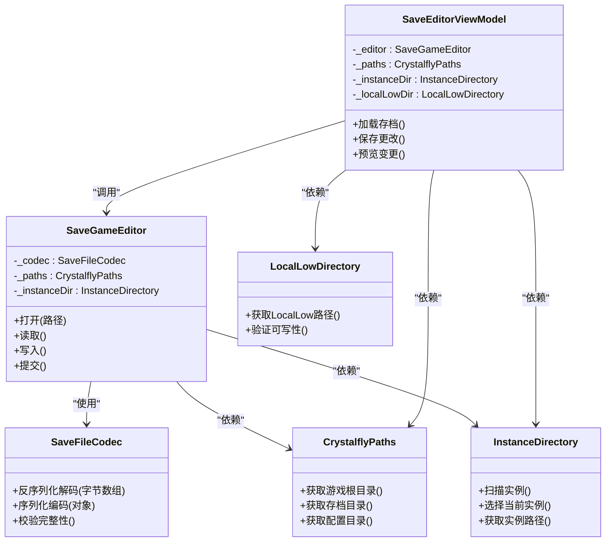
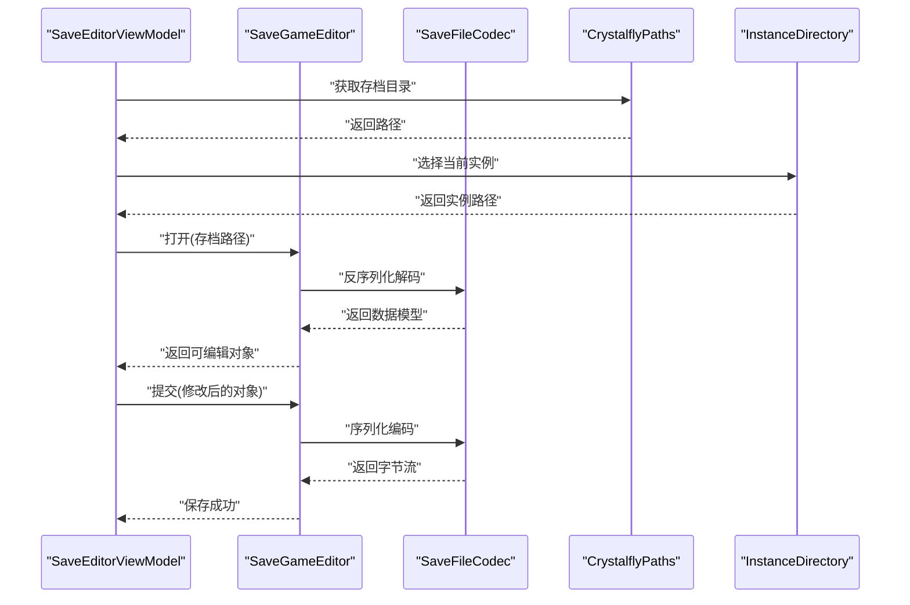
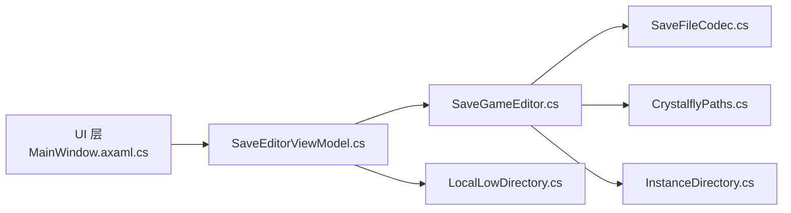

# 存档游戏编辑器

<cite>
**本文引用的文件**   
- [README.md](file://README.md)
- [Program.cs](file://src/Crystalfly.App/Program.cs)
- [App.axaml.cs](file://src/Crystalfly.App/App.axaml.cs)
- [MainWindow.axaml.cs](file://src/Crystalfly.App/Views/MainWindow.axaml.cs)
- [SaveEditorViewModel.cs](file://src/Crystalfly.App/ViewModels/SaveEditorViewModel.cs)
- [SaveGameEditor.cs](file://src/Crystalfly.Core/Saves/SaveGameEditor.cs)
- [SaveFileCodec.cs](file://src/Crystalfly.Core/Saves/SaveFileCodec.cs)
- [CrystalflyPaths.cs](file://src/Crystalfly.Core/Configuration/CrystalflyPaths.cs)
- [InstanceDirectory.cs](file://src/Crystalfly.Core/Instances/InstanceDirectory.cs)
- [LocalLowDirectory.cs](file://src/Crystalfly.Core/LocalLow/LocalLowDirectory.cs)
- [MainViewModel.cs](file://src/Crystalfly.App/ViewModels/MainViewModel.cs)
</cite>

## 目录
1. [简介](#简介)
2. [项目结构](#项目结构)
3. [核心组件](#核心组件)
4. [架构总览](#架构总览)
5. [详细组件分析](#详细组件分析)
6. [依赖关系分析](#依赖关系分析)
7. [性能考虑](#性能考虑)
8. [故障排查指南](#故障排查指南)
9. [结论](#结论)
10. [附录](#附录)

## 简介
本项目是一个面向游戏的存档编辑工具，提供对存档文件的读取、解析、修改与保存能力。其核心由应用层（WPF/Avalonia UI）与核心逻辑层（存档编解码、路径定位、实例管理）组成，并通过视图模型将界面与业务逻辑解耦。该文档聚焦于“存档游戏编辑器”的能力边界、数据流、关键类职责以及常见问题排查方法，帮助开发者与用户快速理解并高效使用。

## 项目结构
仓库采用分层组织：UI 应用位于 Crystalfly.App，核心逻辑位于 Crystalfly.Core，Steam 集成与更新器分别位于独立工程。存档编辑相关代码集中在 Core 的 Saves 目录，并在 App 中通过 SaveEditorViewModel 暴露给界面。

图表来源
- [App.axaml.cs](file://src/Crystalfly.App/App.axaml.cs)
- [MainWindow.axaml.cs](file://src/Crystalfly.App/Views/MainWindow.axaml.cs)
- [SaveEditorViewModel.cs](file://src/Crystalfly.App/ViewModels/SaveEditorViewModel.cs)
- [SaveGameEditor.cs](file://src/Crystalfly.Core/Saves/SaveGameEditor.cs)
- [SaveFileCodec.cs](file://src/Crystalfly.Core/Saves/SaveFileCodec.cs)
- [CrystalflyPaths.cs](file://src/Crystalfly.Core/Configuration/CrystalflyPaths.cs)
- [InstanceDirectory.cs](file://src/Crystalfly.Core/Instances/InstanceDirectory.cs)
- [LocalLowDirectory.cs](file://src/Crystalfly.Core/LocalLow/LocalLowDirectory.cs)

章节来源
- [Program.cs:1-50](file://src/Crystalfly.App/Program.cs#L1-L50)
- [App.axaml.cs:1-80](file://src/Crystalfly.App/App.axaml.cs#L1-L80)
- [MainWindow.axaml.cs:1-120](file://src/Crystalfly.App/Views/MainWindow.axaml.cs#L1-L120)

## 核心组件
- 存档编辑器（SaveGameEditor）：负责打开、解析、修改与持久化存档文件，协调编解码与路径服务。
- 存档编解码器（SaveFileCodec）：处理存档数据的序列化/反序列化与格式转换。
- 视图模型（SaveEditorViewModel）：为 UI 提供可绑定的属性与命令，封装存档编辑的业务流程。
- 路径与实例服务（CrystalflyPaths、InstanceDirectory、LocalLowDirectory）：定位游戏安装目录、存档位置与本地低权限数据目录。
- 主视图模型（MainViewModel）：承载应用级状态与导航，可能包含存档编辑入口或上下文。

章节来源
- [SaveGameEditor.cs:1-200](file://src/Crystalfly.Core/Saves/SaveGameEditor.cs#L1-L200)
- [SaveFileCodec.cs:1-200](file://src/Crystalfly.Core/Saves/SaveFileCodec.cs#L1-L200)
- [SaveEditorViewModel.cs:1-200](file://src/Crystalfly.App/ViewModels/SaveEditorViewModel.cs#L1-L200)
- [CrystalflyPaths.cs:1-120](file://src/Crystalfly.Core/Configuration/CrystalflyPaths.cs#L1-L120)
- [InstanceDirectory.cs:1-150](file://src/Crystalfly.Core/Instances/InstanceDirectory.cs#L1-L150)
- [LocalLowDirectory.cs:1-120](file://src/Crystalfly.Core/LocalLow/LocalLowDirectory.cs#L1-L120)
- [MainViewModel.cs:1-200](file://src/Crystalfly.App/ViewModels/MainViewModel.cs#L1-L200)

## 架构总览
整体采用 MVVM 模式：UI 层通过视图模型调用核心层的存档编辑服务；路径与实例服务为存档定位提供支撑；编解码器作为底层数据抽象被编辑器复用。

图表来源
- [SaveEditorViewModel.cs:1-200](file://src/Crystalfly.App/ViewModels/SaveEditorViewModel.cs#L1-L200)
- [SaveGameEditor.cs:1-200](file://src/Crystalfly.Core/Saves/SaveGameEditor.cs#L1-L200)
- [SaveFileCodec.cs:1-200](file://src/Crystalfly.Core/Saves/SaveFileCodec.cs#L1-L200)
- [CrystalflyPaths.cs:1-120](file://src/Crystalfly.Core/Configuration/CrystalflyPaths.cs#L1-L120)
- [InstanceDirectory.cs:1-150](file://src/Crystalfly.Core/Instances/InstanceDirectory.cs#L1-L150)
- [LocalLowDirectory.cs:1-120](file://src/Crystalfly.Core/LocalLow/LocalLowDirectory.cs#L1-L120)

## 详细组件分析

### 存档编辑器（SaveGameEditor）
- 职责：统一存档生命周期管理，包括打开、读取、修改、校验与提交。
- 关键点：
  - 与编解码器协作完成数据结构的映射。
  - 借助路径与实例服务确定目标存档位置。
  - 在提交前进行完整性校验与备份策略（如存在）。
- 复杂度：I/O 操作主导，时间复杂度取决于存档大小；内存占用与数据结构规模线性相关。

章节来源
- [SaveGameEditor.cs:1-200](file://src/Crystalfly.Core/Saves/SaveGameEditor.cs#L1-L200)

#### 序列图：打开并保存存档

图表来源
- [SaveEditorViewModel.cs:1-200](file://src/Crystalfly.App/ViewModels/SaveEditorViewModel.cs#L1-L200)
- [SaveGameEditor.cs:1-200](file://src/Crystalfly.Core/Saves/SaveGameEditor.cs#L1-L200)
- [SaveFileCodec.cs:1-200](file://src/Crystalfly.Core/Saves/SaveFileCodec.cs#L1-L200)
- [CrystalflyPaths.cs:1-120](file://src/Crystalfly.Core/Configuration/CrystalflyPaths.cs#L1-L120)
- [InstanceDirectory.cs:1-150](file://src/Crystalfly.Core/Instances/InstanceDirectory.cs#L1-L150)

### 存档编解码器（SaveFileCodec）
- 职责：实现存档格式的编解码、校验与版本兼容处理。
- 关键点：
  - 提供统一的接口以屏蔽具体格式差异。
  - 支持错误恢复与降级策略（如缺失字段时回退默认值）。
- 优化建议：
  - 对大文件采用流式读写以降低峰值内存。
  - 引入增量校验以减少重复计算。

章节来源
- [SaveFileCodec.cs:1-200](file://src/Crystalfly.Core/Saves/SaveFileCodec.cs#L1-L200)

### 视图模型（SaveEditorViewModel）
- 职责：为 UI 提供可绑定属性与命令，编排存档编辑流程，处理用户交互反馈。
- 关键点：
  - 与 SaveGameEditor 解耦，便于单元测试与替换实现。
  - 负责显示进度、错误提示与撤销/重做状态（若实现）。
- 设计模式：MVVM 中的 ViewModel，遵循单向数据绑定原则。

章节来源
- [SaveEditorViewModel.cs:1-200](file://src/Crystalfly.App/ViewModels/SaveEditorViewModel.cs#L1-L200)

### 路径与实例服务（CrystalflyPaths、InstanceDirectory、LocalLowDirectory）
- 职责：
  - CrystalflyPaths：提供应用与游戏相关的基础路径。
  - InstanceDirectory：扫描与管理多个游戏实例，定位当前实例。
  - LocalLowDirectory：访问系统 LocalLow 目录，用于会话日志或临时数据。
- 关键点：
  - 路径解析需考虑不同操作系统与安装方式差异。
  - 可写性检查与权限异常处理至关重要。

章节来源
- [CrystalflyPaths.cs:1-120](file://src/Crystalfly.Core/Configuration/CrystalflyPaths.cs#L1-L120)
- [InstanceDirectory.cs:1-150](file://src/Crystalfly.Core/Instances/InstanceDirectory.cs#L1-L150)
- [LocalLowDirectory.cs:1-120](file://src/Crystalfly.Core/LocalLow/LocalLowDirectory.cs#L1-L120)

### 主视图模型（MainViewModel）
- 职责：承载应用级状态、导航与全局设置，可能包含存档编辑入口。
- 关键点：
  - 与 SaveEditorViewModel 协作，传递上下文（如当前实例、语言包等）。
  - 管理对话框、通知与日志输出。

章节来源
- [MainViewModel.cs:1-200](file://src/Crystalfly.App/ViewModels/MainViewModel.cs#L1-L200)

## 依赖关系分析
- 松耦合：UI 仅依赖 ViewModel，ViewModel 依赖核心服务，避免直接访问文件系统。
- 内聚性：SaveGameEditor 聚合编解码与路径服务，形成高内聚的编辑单元。
- 外部依赖：文件系统 I/O、可能的加密/压缩库（由编解码器封装）。

图表来源
- [MainWindow.axaml.cs:1-120](file://src/Crystalfly.App/Views/MainWindow.axaml.cs#L1-L120)
- [SaveEditorViewModel.cs:1-200](file://src/Crystalfly.App/ViewModels/SaveEditorViewModel.cs#L1-L200)
- [SaveGameEditor.cs:1-200](file://src/Crystalfly.Core/Saves/SaveGameEditor.cs#L1-L200)
- [SaveFileCodec.cs:1-200](file://src/Crystalfly.Core/Saves/SaveFileCodec.cs#L1-L200)
- [CrystalflyPaths.cs:1-120](file://src/Crystalfly.Core/Configuration/CrystalflyPaths.cs#L1-L120)
- [InstanceDirectory.cs:1-150](file://src/Crystalfly.Core/Instances/InstanceDirectory.cs#L1-L150)
- [LocalLowDirectory.cs:1-120](file://src/Crystalfly.Core/LocalLow/LocalLowDirectory.cs#L1-L120)

## 性能考虑
- 大文件处理：优先使用流式读写，避免一次性加载到内存。
- 校验优化：对频繁校验的场景引入缓存或增量校验。
- I/O 并发：在安全前提下并行扫描实例或预取元数据，但注意文件锁竞争。
- 内存管理：及时释放临时缓冲区，避免长时间持有大对象引用。

## 故障排查指南
- 无法定位存档：
  - 检查实例选择是否正确，确认 InstanceDirectory 返回的路径有效。
  - 验证 CrystalflyPaths 提供的根目录是否与实际安装一致。
- 权限不足：
  - 确认 LocalLowDirectory 与存档目录的可写性。
  - 以管理员身份运行或在受信任目录操作。
- 存档损坏：
  - 查看 SaveFileCodec 的校验结果与错误信息。
  - 尝试从备份恢复或使用降级策略重建缺失字段。
- 界面无响应：
  - 确保耗时操作（I/O、编解码）不在 UI 线程执行。
  - 检查 SaveEditorViewModel 的命令是否异步执行并正确更新进度。

章节来源
- [SaveGameEditor.cs:1-200](file://src/Crystalfly.Core/Saves/SaveGameEditor.cs#L1-L200)
- [SaveFileCodec.cs:1-200](file://src/Crystalfly.Core/Saves/SaveFileCodec.cs#L1-L200)
- [SaveEditorViewModel.cs:1-200](file://src/Crystalfly.App/ViewModels/SaveEditorViewModel.cs#L1-L200)
- [CrystalflyPaths.cs:1-120](file://src/Crystalfly.Core/Configuration/CrystalflyPaths.cs#L1-L120)
- [InstanceDirectory.cs:1-150](file://src/Crystalfly.Core/Instances/InstanceDirectory.cs#L1-L150)
- [LocalLowDirectory.cs:1-120](file://src/Crystalfly.Core/LocalLow/LocalLowDirectory.cs#L1-L120)

## 结论
本项目的存档编辑功能通过清晰的 MVVM 分层与高内聚的核心服务实现了良好的可维护性与可扩展性。建议在后续迭代中强化流式 I/O、完善错误恢复机制，并补充更丰富的单元测试覆盖，以提升稳定性与用户体验。

## 附录
- 参考入口点：
  - 应用启动：[Program.cs](file://src/Crystalfly.App/Program.cs)
  - 应用初始化：[App.axaml.cs](file://src/Crystalfly.App/App.axaml.cs)
  - 主窗口：[MainWindow.axaml.cs](file://src/Crystalfly.App/Views/MainWindow.axaml.cs)
- 产品说明与发布记录：
  - [README.md](file://README.md)