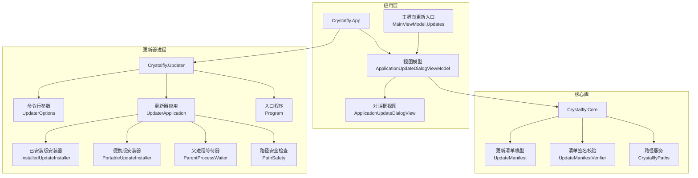
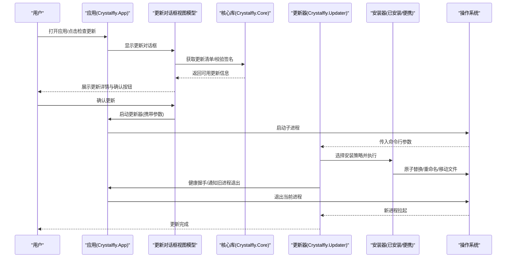
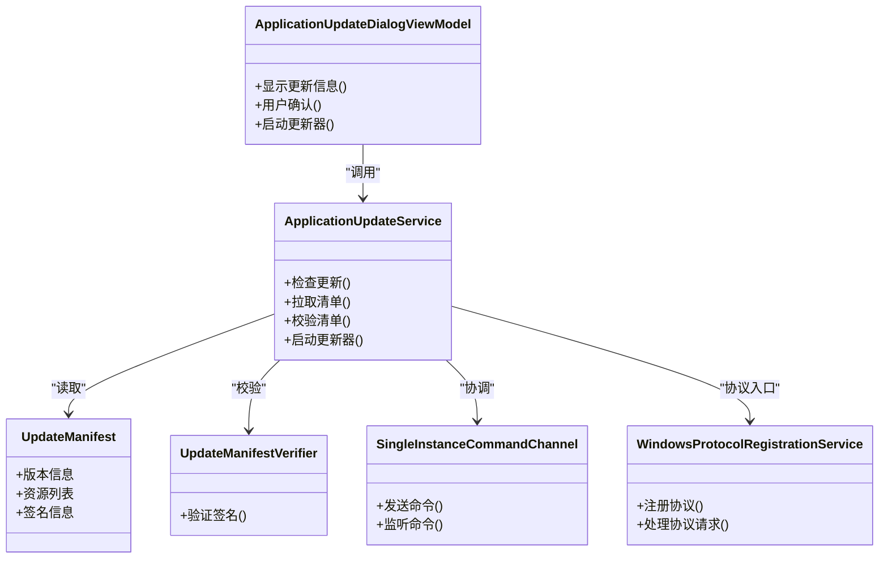
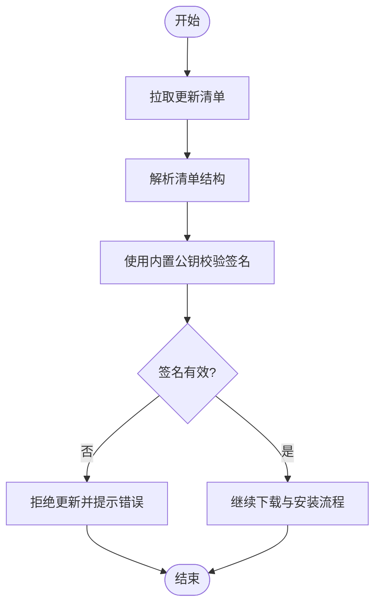
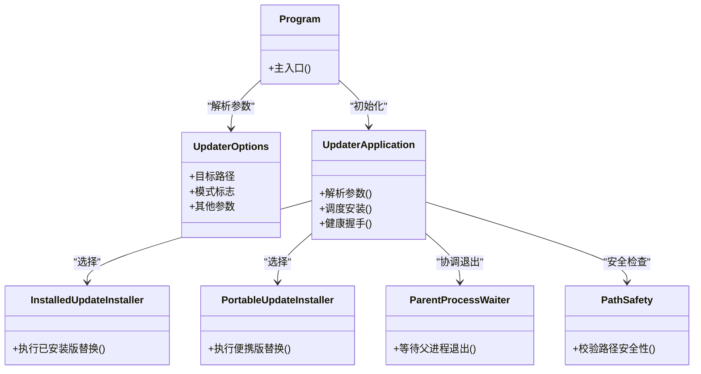
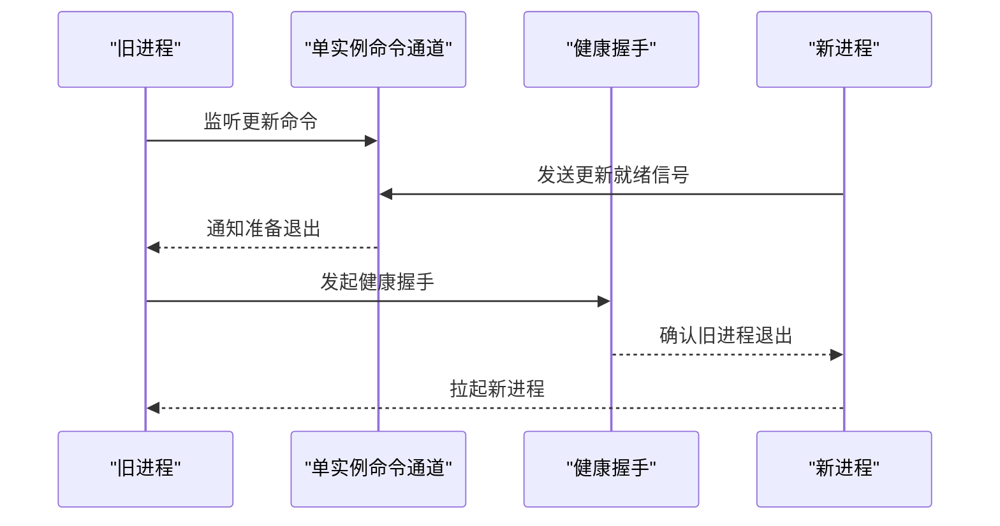
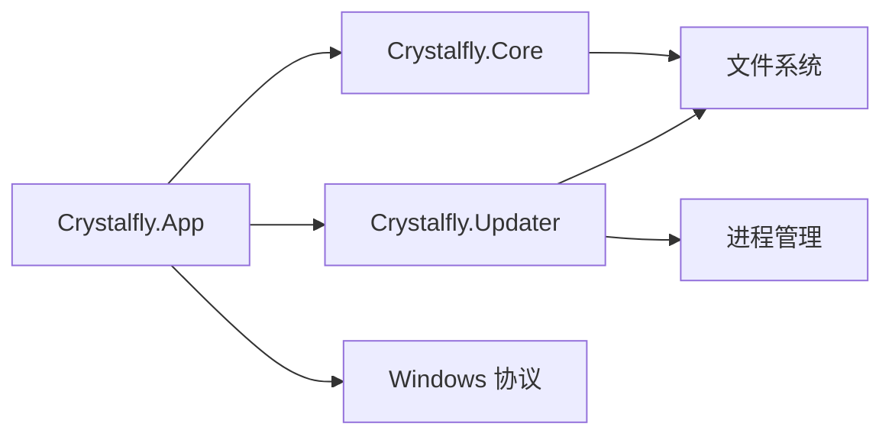

# 应用程序更新系统

<cite>
**本文引用的文件**   
- [ApplicationUpdateService.cs](file://src/Crystalfly.App/Updates/ApplicationUpdateService.cs)
- [ApplicationUpdateLauncher.cs](file://src/Crystalfly.App/Updates/ApplicationUpdateLauncher.cs)
- [EmbeddedUpdateSigningKey.cs](file://src/Crystalfly.App/Updates/EmbeddedUpdateSigningKey.cs)
- [ApplicationUpdateDialogViewModel.cs](file://src/Crystalfly.App/ViewModels/Dialogs/ApplicationUpdateDialogViewModel.cs)
- [ApplicationUpdateDialogView.axaml](file://src/Crystalfly.App/Views/Dialogs/ApplicationUpdateDialogView.axaml)
- [ApplicationUpdateDialogView.axaml.cs](file://src/Crystalfly.App/Views/Dialogs/ApplicationUpdateDialogView.axaml.cs)
- [MainViewModel.Updates.cs](file://src/Crystalfly.App/ViewModels/MainViewModel.Updates.cs)
- [UpdateManifest.cs](file://src/Crystalfly.Core/Updates/UpdateManifest.cs)
- [UpdateManifestVerifier.cs](file://src/Crystalfly.Core/Updates/UpdateManifestVerifier.cs)
- [UpdaterOptions.cs](file://src/Crystalfly.Updater/UpdaterOptions.cs)
- [UpdaterApplication.cs](file://src/Crystalfly.Updater/UpdaterApplication.cs)
- [InstalledUpdateInstaller.cs](file://src/Crystalfly.Updater/InstalledUpdateInstaller.cs)
- [PortableUpdateInstaller.cs](file://src/Crystalfly.Updater/PortableUpdateInstaller.cs)
- [ParentProcessWaiter.cs](file://src/Crystalfly.Updater/ParentProcessWaiter.cs)
- [PathSafety.cs](file://src/Crystalfly.Updater/PathSafety.cs)
- [Program.cs](file://src/Crystalfly.Updater/Program.cs)
- [ApplicationUpdateHealthHandshake.cs](file://src/Crystalffly.App/Runtime/ApplicationUpdateHealthHandshake.cs)
- [SingleInstanceCommandChannel.cs](file://src/Crystalfly.App/Runtime/SingleInstanceCommandChannel.cs)
- [WindowsProtocolRegistrationService.cs](file://src/Crystalfly.App/Runtime/WindowsProtocolRegistrationService.cs)
- [CrystalflyPaths.cs](file://src/Crystalfly.Core/Configuration/CrystalflyPaths.cs)
- [App.axaml.cs](file://src/Crystalfly.App/App.axaml.cs)
- [MainWindow.axaml.cs](file://src/Crystalfly.App/Views/MainWindow.axaml.cs)
</cite>

## 目录
1. [简介](#简介)
2. [项目结构](#项目结构)
3. [核心组件](#核心组件)
4. [架构总览](#架构总览)
5. [详细组件分析](#详细组件分析)
6. [依赖关系分析](#依赖关系分析)
7. [性能考虑](#性能考虑)
8. [故障排查指南](#故障排查指南)
9. [结论](#结论)
10. [附录](#附录)

## 简介
本文件系统化梳理 Crystalfly 的“应用程序更新系统”，覆盖从版本发现、清单校验、下载与安装，到进程间协调与回滚保障的全链路。文档面向不同技术背景的读者，提供分层说明、可视化图示与排障建议，帮助快速理解并正确使用该子系统。

## 项目结构
更新系统横跨三个工程：
- Crystalfly.App：应用层，负责检查更新、展示对话框、触发更新流程以及与 UI 交互。
- Crystalfly.Core：核心库，定义更新清单模型与签名校验逻辑。
- Crystalfly.Updater：独立更新器进程，负责安全地替换当前运行程序（支持已安装版与便携版）。

图表来源
- [ApplicationUpdateService.cs](file://src/Crystalfly.App/Updates/ApplicationUpdateService.cs)
- [ApplicationUpdateDialogViewModel.cs](file://src/Crystalfly.App/ViewModels/Dialogs/ApplicationUpdateDialogViewModel.cs)
- [ApplicationUpdateDialogView.axaml.cs](file://src/Crystalfly.App/Views/Dialogs/ApplicationUpdateDialogView.axaml.cs)
- [MainViewModel.Updates.cs](file://src/Crystalfly.App/ViewModels/MainViewModel.Updates.cs)
- [UpdateManifest.cs](file://src/Crystalfly.Core/Updates/UpdateManifest.cs)
- [UpdateManifestVerifier.cs](file://src/Crystalfly.Core/Updates/UpdateManifestVerifier.cs)
- [CrystalflyPaths.cs](file://src/Crystalfly.Core/Configuration/CrystalflyPaths.cs)
- [UpdaterOptions.cs](file://src/Crystalfly.Updater/UpdaterOptions.cs)
- [UpdaterApplication.cs](file://src/Crystalfly.Updater/UpdaterApplication.cs)
- [InstalledUpdateInstaller.cs](file://src/Crystalfly.Updater/InstalledUpdateInstaller.cs)
- [PortableUpdateInstaller.cs](file://src/Crystalfly.Updater/PortableUpdateInstaller.cs)
- [ParentProcessWaiter.cs](file://src/Crystalfly.Updater/ParentProcessWaiter.cs)
- [PathSafety.cs](file://src/Crystalfly.Updater/PathSafety.cs)
- [Program.cs](file://src/Crystalfly.Updater/Program.cs)

章节来源
- [ApplicationUpdateService.cs](file://src/Crystalfly.App/Updates/ApplicationUpdateService.cs)
- [ApplicationUpdateDialogViewModel.cs](file://src/Crystalfly.App/ViewModels/Dialogs/ApplicationUpdateDialogViewModel.cs)
- [ApplicationUpdateDialogView.axaml.cs](file://src/Crystalfly.App/Views/Dialogs/ApplicationUpdateDialogView.axaml.cs)
- [MainViewModel.Updates.cs](file://src/Crystalfly.App/ViewModels/MainViewModel.Updates.cs)
- [UpdateManifest.cs](file://src/Crystalfly.Core/Updates/UpdateManifest.cs)
- [UpdateManifestVerifier.cs](file://src/Crystalfly.Core/Updates/UpdateManifestVerifier.cs)
- [CrystalflyPaths.cs](file://src/Crystalfly.Core/Configuration/CrystalflyPaths.cs)
- [UpdaterOptions.cs](file://src/Crystalfly.Updater/UpdaterOptions.cs)
- [UpdaterApplication.cs](file://src/Crystalfly.Updater/UpdaterApplication.cs)
- [InstalledUpdateInstaller.cs](file://src/Crystalfly.Updater/InstalledUpdateInstaller.cs)
- [PortableUpdateInstaller.cs](file://src/Crystalfly.Updater/PortableUpdateInstaller.cs)
- [ParentProcessWaiter.cs](file://src/Crystalfly.Updater/ParentProcessWaiter.cs)
- [PathSafety.cs](file://src/Crystalfly.Updater/PathSafety.cs)
- [Program.cs](file://src/Crystalfly.Updater/Program.cs)

## 核心组件
- 应用端更新服务：负责查询可用更新、拉取并校验更新清单、提示用户并启动更新器。
- 更新清单与校验：以结构化清单描述目标版本与资源，使用内置公钥进行签名验证。
- 更新器进程：独立可执行体，接收参数后执行原子替换、重启或回滚。
- 安装策略：根据部署形态选择“已安装版”或“便携版”安装器。
- 进程协调：通过单实例命令通道与健康握手，确保旧进程退出与新进程拉起的安全时序。
- UI 交互：在对话框中展示更新信息、进度与结果，并提供取消与重试能力。

章节来源
- [ApplicationUpdateService.cs](file://src/Crystalfly.App/Updates/ApplicationUpdateService.cs)
- [UpdateManifest.cs](file://src/Crystalfly.Core/Updates/UpdateManifest.cs)
- [UpdateManifestVerifier.cs](file://src/Crystalfly.Core/Updates/UpdateManifestVerifier.cs)
- [UpdaterApplication.cs](file://src/Crystalfly.Updater/UpdaterApplication.cs)
- [InstalledUpdateInstaller.cs](file://src/Crystalfly.Updater/InstalledUpdateInstaller.cs)
- [PortableUpdateInstaller.cs](file://src/Crystalfly.Updater/PortableUpdateInstaller.cs)
- [SingleInstanceCommandChannel.cs](file://src/Crystalfly.App/Runtime/SingleInstanceCommandChannel.cs)
- [ApplicationUpdateHealthHandshake.cs](file://src/Crystalfly.App/Runtime/ApplicationUpdateHealthHandshake.cs)
- [ApplicationUpdateDialogViewModel.cs](file://src/Crystalfly.App/ViewModels/Dialogs/ApplicationUpdateDialogViewModel.cs)

## 架构总览
下图展示了从“检查更新”到“完成替换并重启”的关键调用链与数据流。

图表来源
- [ApplicationUpdateService.cs](file://src/Crystalfly.App/Updates/ApplicationUpdateService.cs)
- [ApplicationUpdateDialogViewModel.cs](file://src/Crystalfly.App/ViewModels/Dialogs/ApplicationUpdateDialogViewModel.cs)
- [UpdateManifest.cs](file://src/Crystalfly.Core/Updates/UpdateManifest.cs)
- [UpdateManifestVerifier.cs](file://src/Crystalfly.Core/Updates/UpdateManifestVerifier.cs)
- [UpdaterOptions.cs](file://src/Crystalfly.Updater/UpdaterOptions.cs)
- [UpdaterApplication.cs](file://src/Crystalfly.Updater/UpdaterApplication.cs)
- [InstalledUpdateInstaller.cs](file://src/Crystalfly.Updater/InstalledUpdateInstaller.cs)
- [PortableUpdateInstaller.cs](file://src/Crystalfly.Updater/PortableUpdateInstaller.cs)
- [ApplicationUpdateHealthHandshake.cs](file://src/Crystalfly.App/Runtime/ApplicationUpdateHealthHandshake.cs)
- [SingleInstanceCommandChannel.cs](file://src/Crystalfly.App/Runtime/SingleInstanceCommandChannel.cs)

## 详细组件分析

### 应用端更新服务与 UI
- 职责
  - 检查是否有新版本可用。
  - 拉取并解析更新清单，执行签名校验。
  - 在对话框中展示更新信息，收集用户确认。
  - 启动更新器进程并传递必要参数。
- 关键交互
  - 与核心库的清单模型和校验器协作。
  - 与单实例命令通道配合，避免重复更新任务。
  - 与 Windows 协议注册服务协同，支持外部触发更新。
- 错误处理
  - 网络异常、清单校验失败、权限不足等场景均会反馈至 UI，并提供重试或取消选项。

图表来源
- [ApplicationUpdateService.cs](file://src/Crystalfly.App/Updates/ApplicationUpdateService.cs)
- [ApplicationUpdateDialogViewModel.cs](file://src/Crystalfly.App/ViewModels/Dialogs/ApplicationUpdateDialogViewModel.cs)
- [UpdateManifest.cs](file://src/Crystalfly.Core/Updates/UpdateManifest.cs)
- [UpdateManifestVerifier.cs](file://src/Crystalfly.Core/Updates/UpdateManifestVerifier.cs)
- [SingleInstanceCommandChannel.cs](file://src/Crystalfly.App/Runtime/SingleInstanceCommandChannel.cs)
- [WindowsProtocolRegistrationService.cs](file://src/Crystalfly.App/Runtime/WindowsProtocolRegistrationService.cs)

章节来源
- [ApplicationUpdateService.cs](file://src/Crystalfly.App/Updates/ApplicationUpdateService.cs)
- [ApplicationUpdateDialogViewModel.cs](file://src/Crystalfly.App/ViewModels/Dialogs/ApplicationUpdateDialogViewModel.cs)
- [ApplicationUpdateDialogView.axaml.cs](file://src/Crystalfly.App/Views/Dialogs/ApplicationUpdateDialogView.axaml.cs)
- [MainViewModel.Updates.cs](file://src/Crystalfly.App/ViewModels/MainViewModel.Updates.cs)
- [SingleInstanceCommandChannel.cs](file://src/Crystalfly.App/Runtime/SingleInstanceCommandChannel.cs)
- [WindowsProtocolRegistrationService.cs](file://src/Crystalfly.App/Runtime/WindowsProtocolRegistrationService.cs)

### 更新清单与签名校验
- 清单模型
  - 包含目标版本、变更说明、资源清单与签名元数据。
- 校验流程
  - 使用内置公钥对清单签名进行验证，确保来源可信且未被篡改。
  - 校验失败将阻断后续下载与安装。
- 配置与路径
  - 通过路径服务定位清单存储位置与缓存目录。

图表来源
- [UpdateManifest.cs](file://src/Crystalfly.Core/Updates/UpdateManifest.cs)
- [UpdateManifestVerifier.cs](file://src/Crystalfly.Core/Updates/UpdateManifestVerifier.cs)
- [CrystalflyPaths.cs](file://src/Crystalfly.Core/Configuration/CrystalflyPaths.cs)

章节来源
- [UpdateManifest.cs](file://src/Crystalfly.Core/Updates/UpdateManifest.cs)
- [UpdateManifestVerifier.cs](file://src/Crystalfly.Core/Updates/UpdateManifestVerifier.cs)
- [CrystalflyPaths.cs](file://src/Crystalfly.Core/Configuration/CrystalflyPaths.cs)

### 更新器进程与安装策略
- 入口与参数
  - 更新器作为独立进程启动，通过命令行参数决定行为模式与目标路径。
- 安装器选择
  - 根据部署类型选择“已安装版安装器”或“便携版安装器”。
- 原子替换与回滚
  - 采用临时目录与原子重命名策略，确保替换过程的可恢复性。
- 路径安全
  - 严格校验目标路径，防止越权写入。

图表来源
- [Program.cs](file://src/Crystalfly.Updater/Program.cs)
- [UpdaterOptions.cs](file://src/Crystalfly.Updater/UpdaterOptions.cs)
- [UpdaterApplication.cs](file://src/Crystalfly.Updater/UpdaterApplication.cs)
- [InstalledUpdateInstaller.cs](file://src/Crystalfly.Updater/InstalledUpdateInstaller.cs)
- [PortableUpdateInstaller.cs](file://src/Crystalfly.Updater/PortableUpdateInstaller.cs)
- [ParentProcessWaiter.cs](file://src/Crystalfly.Updater/ParentProcessWaiter.cs)
- [PathSafety.cs](file://src/Crystalfly.Updater/PathSafety.cs)

章节来源
- [Program.cs](file://src/Crystalfly.Updater/Program.cs)
- [UpdaterOptions.cs](file://src/Crystalfly.Updater/UpdaterOptions.cs)
- [UpdaterApplication.cs](file://src/Crystalfly.Updater/UpdaterApplication.cs)
- [InstalledUpdateInstaller.cs](file://src/Crystalfly.Updater/InstalledUpdateInstaller.cs)
- [PortableUpdateInstaller.cs](file://src/Crystalfly.Updater/PortableUpdateInstaller.cs)
- [ParentProcessWaiter.cs](file://src/Crystalfly.Updater/ParentProcessWaiter.cs)
- [PathSafety.cs](file://src/Crystalfly.Updater/PathSafety.cs)

### 进程协调与健康握手
- 单实例命令通道
  - 用于在同一主机上协调多个实例之间的更新指令，避免并发冲突。
- 健康握手
  - 新旧进程之间通过轻量握手确认状态，确保旧进程安全退出后再拉起新进程。
- 协议注册
  - 通过 Windows 协议注册，支持外部触发更新（如浏览器链接或脚本）。

图表来源
- [SingleInstanceCommandChannel.cs](file://src/Crystalfly.App/Runtime/SingleInstanceCommandChannel.cs)
- [ApplicationUpdateHealthHandshake.cs](file://src/Crystalfly.App/Runtime/ApplicationUpdateHealthHandshake.cs)
- [WindowsProtocolRegistrationService.cs](file://src/Crystalfly.App/Runtime/WindowsProtocolRegistrationService.cs)

章节来源
- [SingleInstanceCommandChannel.cs](file://src/Crystalfly.App/Runtime/SingleInstanceCommandChannel.cs)
- [ApplicationUpdateHealthHandshake.cs](file://src/Crystalfly.App/Runtime/ApplicationUpdateHealthHandshake.cs)
- [WindowsProtocolRegistrationService.cs](file://src/Crystalfly.App/Runtime/WindowsProtocolRegistrationService.cs)

### 应用生命周期集成
- 应用启动
  - 应用启动时可能自动检查更新或加载上次更新状态。
- 主窗口集成
  - 主窗口在合适时机触发更新检查或展示更新结果。

章节来源
- [App.axaml.cs](file://src/Crystalfly.App/App.axaml.cs)
- [MainWindow.axaml.cs](file://src/Crystalfly.App/Views/MainWindow.axaml.cs)

## 依赖关系分析
- 模块耦合
  - 应用层依赖核心库的清单与校验能力；更新器进程与应用层通过命令行参数与健康握手解耦。
- 外部依赖
  - 文件系统操作、进程管理、Windows 协议注册。
- 潜在循环依赖
  - 通过接口与事件机制避免直接循环引用，保持清晰边界。

图表来源
- [ApplicationUpdateService.cs](file://src/Crystalfly.App/Updates/ApplicationUpdateService.cs)
- [UpdateManifest.cs](file://src/Crystalfly.Core/Updates/UpdateManifest.cs)
- [UpdaterApplication.cs](file://src/Crystalfly.Updater/UpdaterApplication.cs)
- [WindowsProtocolRegistrationService.cs](file://src/Crystalfly.App/Runtime/WindowsProtocolRegistrationService.cs)

章节来源
- [ApplicationUpdateService.cs](file://src/Crystalfly.App/Updates/ApplicationUpdateService.cs)
- [UpdateManifest.cs](file://src/Crystalfly.Core/Updates/UpdateManifest.cs)
- [UpdaterApplication.cs](file://src/Crystalfly.Updater/UpdaterApplication.cs)
- [WindowsProtocolRegistrationService.cs](file://src/Crystalfly.App/Runtime/WindowsProtocolRegistrationService.cs)

## 性能考虑
- 清单拉取与校验
  - 建议在首次启动或间隔周期内拉取清单，并对清单进行本地缓存以减少网络开销。
- 下载与替换
  - 使用增量或并行下载策略提升大体积更新的效率；替换阶段尽量使用原子操作减少锁竞争。
- 进程协调
  - 健康握手应设置超时与重试，避免长时间阻塞导致用户体验下降。

[本节为通用指导，不直接分析具体文件]

## 故障排查指南
- 常见问题
  - 清单校验失败：检查内置公钥是否完整、清单是否被篡改。
  - 权限不足：确保更新器具有目标目录的写入权限。
  - 进程未退出：观察健康握手日志，确认旧进程是否正常响应退出信号。
  - 协议未生效：检查 Windows 协议注册是否成功。
- 定位手段
  - 查看更新对话框的错误提示与重试按钮。
  - 检查更新器进程的命令行参数是否正确。
  - 使用单实例命令通道日志确认命令是否送达。

章节来源
- [ApplicationUpdateDialogViewModel.cs](file://src/Crystalfly.App/ViewModels/Dialogs/ApplicationUpdateDialogViewModel.cs)
- [UpdaterOptions.cs](file://src/Crystalfly.Updater/UpdaterOptions.cs)
- [SingleInstanceCommandChannel.cs](file://src/Crystalfly.App/Runtime/SingleInstanceCommandChannel.cs)
- [WindowsProtocolRegistrationService.cs](file://src/Crystalfly.App/Runtime/WindowsProtocolRegistrationService.cs)

## 结论
Crystalfly 的应用程序更新系统以“清单驱动、签名校验、原子替换、健康握手”为核心原则，兼顾安全性与可用性。通过清晰的模块划分与进程隔离，系统在复杂环境下仍能保持稳定更新体验。建议在生产环境中完善日志与遥测，持续优化性能与容错能力。

[本节为总结性内容，不直接分析具体文件]

## 附录
- 术语
  - 更新清单：描述目标版本与资源的结构化文件。
  - 健康握手：新旧进程间的轻量状态同步机制。
  - 原子替换：通过临时目录与重命名实现不可中断的文件替换。
- 参考路径
  - 应用入口与主窗口集成：见应用层相关文件的注释与调用点。
  - 更新器入口与参数：见更新器工程的 Program 与 UpdaterOptions。

[本节为概念性补充，不直接分析具体文件]