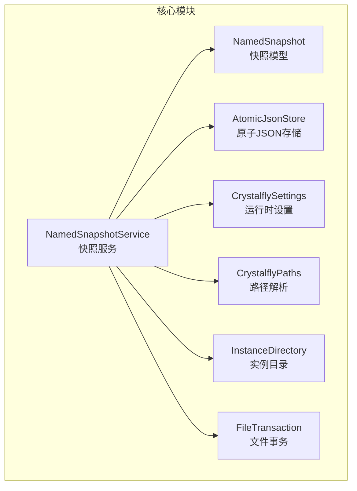
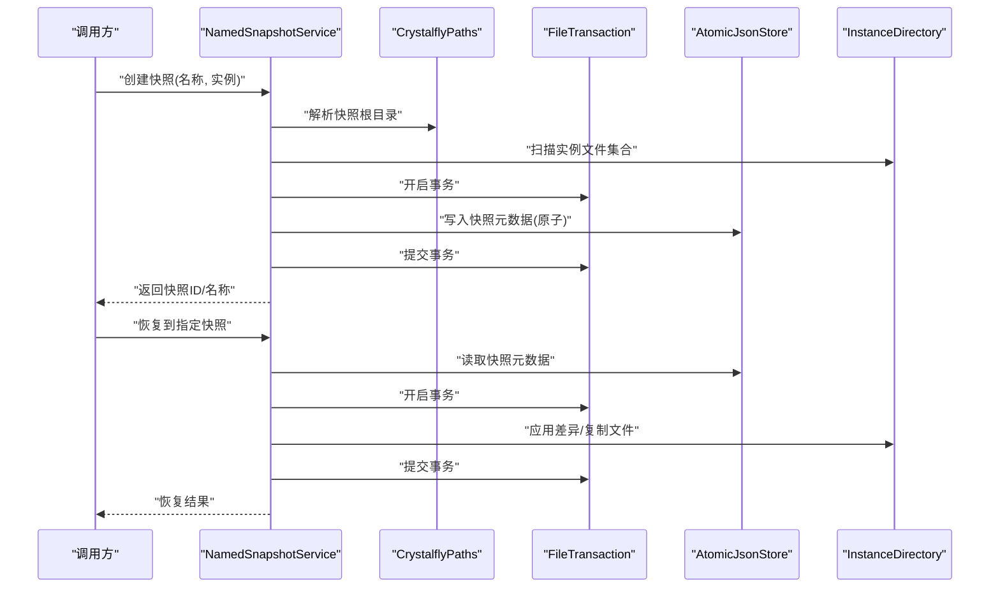
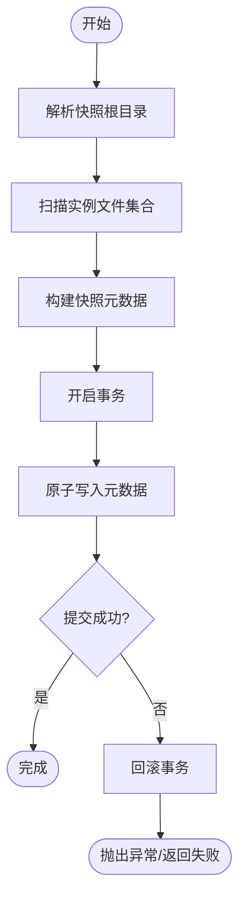
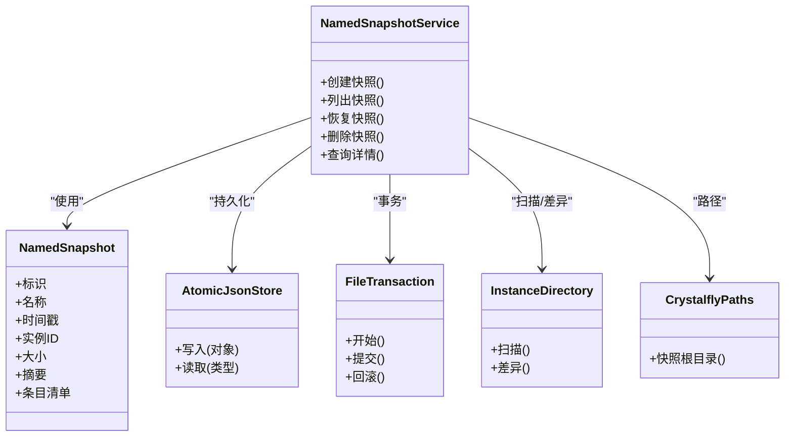

# 快照系统

<cite>
**本文引用的文件**   
- [NamedSnapshotService.cs](file://src/Crystalfly.Core/Snapshots/NamedSnapshotService.cs)
- [NamedSnapshot.cs](file://src/Crystalfly.Core/Models/NamedSnapshot.cs)
- [AtomicJsonStore.cs](file://src/Crystalfly.Core/Serialization/AtomicJsonStore.cs)
- [CrystalflySettings.cs](file://src/Crystalfly.Core/Configuration/CrystalflySettings.cs)
- [CrystalflyPaths.cs](file://src/Crystalfly.Core/Configuration/CrystalflyPaths.cs)
- [InstanceDirectory.cs](file://src/Crystalfly.Core/Instances/InstanceDirectory.cs)
- [FileTransaction.cs](file://src/Crystalfly.Core/Transactions/FileTransaction.cs)
- [NamedSnapshotServiceTests.cs](file://tests/Crystalfly.Core.Tests/Snapshots/NamedSnapshotServiceTests.cs)
</cite>

## 目录
1. [简介](#简介)
2. [项目结构](#项目结构)
3. [核心组件](#核心组件)
4. [架构总览](#架构总览)
5. [详细组件分析](#详细组件分析)
6. [依赖关系分析](#依赖关系分析)
7. [性能与优化](#性能与优化)
8. [故障排查指南](#故障排查指南)
9. [结论](#结论)
10. [附录：使用示例与最佳实践](#附录使用示例与最佳实践)

## 简介
本章节面向“命名快照”子系统，聚焦 NamedSnapshotService 服务与 NamedSnapshot 模型的设计与实现。文档将系统性阐述快照的创建、存储、恢复与删除机制，解释元数据格式、增量备份策略、存储空间管理、压缩与去重优化思路、版本管理与清理策略，以及大文件场景下的性能优化与错误恢复机制。同时提供可操作的 API 使用指引（以路径引用代替代码片段），帮助读者快速上手并安全运维。

## 项目结构
快照相关代码位于 Crystalfly.Core 模块中，采用分层组织：
- 模型层：定义快照元数据与持久化契约
- 服务层：封装快照生命周期操作（创建、列出、恢复、删除）
- 序列化层：提供原子写入与 JSON 编解码能力
- 配置与路径：集中管理快照根目录、保留策略等
- 事务层：保障文件级操作的原子性与一致性
- 测试层：覆盖关键用例与边界条件

图表来源
- [NamedSnapshotService.cs:1-200](file://src/Crystalfly.Core/Snapshots/NamedSnapshotService.cs#L1-L200)
- [NamedSnapshot.cs:1-200](file://src/Crystalfly.Core/Models/NamedSnapshot.cs#L1-L200)
- [AtomicJsonStore.cs:1-200](file://src/Crystalfly.Core/Serialization/AtomicJsonStore.cs#L1-L200)
- [CrystalflySettings.cs:1-200](file://src/Crystalfly.Core/Configuration/CrystalflySettings.cs#L1-L200)
- [CrystalflyPaths.cs:1-200](file://src/Crystalfly.Core/Configuration/CrystalflyPaths.cs#L1-L200)
- [InstanceDirectory.cs:1-200](file://src/Crystalfly.Core/Instances/InstanceDirectory.cs#L1-L200)
- [FileTransaction.cs:1-200](file://src/Crystalfly.Core/Transactions/FileTransaction.cs#L1-L200)

章节来源
- [NamedSnapshotService.cs:1-200](file://src/Crystalfly.Core/Snapshots/NamedSnapshotService.cs#L1-L200)
- [NamedSnapshot.cs:1-200](file://src/Crystalfly.Core/Models/NamedSnapshot.cs#L1-L200)
- [AtomicJsonStore.cs:1-200](file://src/Crystalfly.Core/Serialization/AtomicJsonStore.cs#L1-L200)
- [CrystalflySettings.cs:1-200](file://src/Crystalfly.Core/Configuration/CrystalflySettings.cs#L1-L200)
- [CrystalflyPaths.cs:1-200](file://src/Crystalfly.Core/Configuration/CrystalflyPaths.cs#L1-L200)
- [InstanceDirectory.cs:1-200](file://src/Crystalfly.Core/Instances/InstanceDirectory.cs#L1-L200)
- [FileTransaction.cs:1-200](file://src/Crystalfly.Core/Transactions/FileTransaction.cs#L1-L200)

## 核心组件
- NamedSnapshot 模型
  - 职责：描述一次快照的元数据与内容清单，包含标识、名称、时间戳、关联实例、大小、摘要、条目列表等字段；用于序列化为 JSON 并持久化到磁盘。
  - 复杂度：序列化/反序列化 O(n)，n 为条目数量；索引查找按名称或时间排序通常为 O(log n)。
- NamedSnapshotService 服务
  - 职责：对外暴露快照生命周期 API（创建、列出、恢复、删除、查询详情），协调路径、事务、序列化与实例目录扫描。
  - 设计要点：
    - 原子性：通过事务与原子写入保证元数据与数据的一致性。
    - 幂等性：同名快照在相同条件下具备幂等语义（由上层策略控制）。
    - 可扩展性：支持后续接入增量与去重后端。

章节来源
- [NamedSnapshot.cs:1-200](file://src/Crystalfly.Core/Models/NamedSnapshot.cs#L1-L200)
- [NamedSnapshotService.cs:1-200](file://src/Crystalfly.Core/Snapshots/NamedSnapshotService.cs#L1-L200)

## 架构总览
下图展示了快照服务的核心交互：调用方通过服务接口发起操作，服务组合路径解析、事务、序列化与实例目录能力完成具体工作。

图表来源
- [NamedSnapshotService.cs:1-200](file://src/Crystalfly.Core/Snapshots/NamedSnapshotService.cs#L1-L200)
- [CrystalflyPaths.cs:1-200](file://src/Crystalfly.Core/Configuration/CrystalflyPaths.cs#L1-L200)
- [AtomicJsonStore.cs:1-200](file://src/Crystalfly.Core/Serialization/AtomicJsonStore.cs#L1-L200)
- [InstanceDirectory.cs:1-200](file://src/Crystalfly.Core/Instances/InstanceDirectory.cs#L1-L200)
- [FileTransaction.cs:1-200](file://src/Crystalfly.Core/Transactions/FileTransaction.cs#L1-L200)

## 详细组件分析

### 模型：NamedSnapshot
- 关键字段
  - 标识与名称：唯一键与可读名
  - 时间戳：创建时间
  - 关联实例：所属实例标识
  - 大小与摘要：统计与校验信息
  - 条目清单：被纳入快照的文件/目录项
- 数据结构复杂度
  - 新增条目：O(1)
  - 遍历与序列化：O(n)
  - 按名称/时间检索：O(log n)（若维护索引）
- 设计权衡
  - 元数据轻量，避免过大导致序列化开销
  - 条目清单仅记录必要路径与校验值，便于增量计算

章节来源
- [NamedSnapshot.cs:1-200](file://src/Crystalfly.Core/Models/NamedSnapshot.cs#L1-L200)

### 服务：NamedSnapshotService
- 主要职责
  - 创建快照：扫描实例、生成元数据、原子写入
  - 列出快照：按时间/名称排序返回
  - 恢复快照：基于元数据执行差异回滚或复制
  - 删除快照：移除元数据与对应数据
  - 查询详情：根据名称或时间获取快照信息
- 关键流程
  - 创建流程：解析路径 → 扫描实例 → 构建元数据 → 事务包裹写入 → 提交
  - 恢复流程：加载元数据 → 计算差异 → 事务包裹写回 → 提交
  - 删除流程：定位快照 → 移除元数据与数据 → 清理空目录
- 并发与一致性
  - 使用事务确保元数据与数据变更的原子性
  - 对同一实例的并发快照建议在上层加锁或队列

图表来源
- [NamedSnapshotService.cs:1-200](file://src/Crystalfly.Core/Snapshots/NamedSnapshotService.cs#L1-L200)
- [FileTransaction.cs:1-200](file://src/Crystalfly.Core/Transactions/FileTransaction.cs#L1-L200)
- [AtomicJsonStore.cs:1-200](file://src/Crystalfly.Core/Serialization/AtomicJsonStore.cs#L1-L200)

章节来源
- [NamedSnapshotService.cs:1-200](file://src/Crystalfly.Core/Snapshots/NamedSnapshotService.cs#L1-L200)
- [FileTransaction.cs:1-200](file://src/Crystalfly.Core/Transactions/FileTransaction.cs#L1-L200)
- [AtomicJsonStore.cs:1-200](file://src/Crystalfly.Core/Serialization/AtomicJsonStore.cs#L1-L200)

### 序列化：AtomicJsonStore
- 功能要点
  - 原子写入：先写临时文件再原子替换，避免部分写入导致的损坏
  - 结构化 JSON：强类型序列化，兼容版本演进
- 适用场景
  - 快照元数据持久化
  - 其他需要高可靠性的配置/清单存储

章节来源
- [AtomicJsonStore.cs:1-200](file://src/Crystalfly.Core/Serialization/AtomicJsonStore.cs#L1-L200)

### 配置与路径：CrystalflySettings / CrystalflyPaths
- 职责
  - 提供快照根目录、保留策略、最大数量/大小阈值等配置
  - 统一路径解析，屏蔽平台差异
- 影响范围
  - 决定快照落盘位置与清理策略生效范围

章节来源
- [CrystalflySettings.cs:1-200](file://src/Crystalfly.Core/Configuration/CrystalflySettings.cs#L1-L200)
- [CrystalflyPaths.cs:1-200](file://src/Crystalfly.Core/Configuration/CrystalflyPaths.cs#L1-L200)

### 实例目录：InstanceDirectory
- 职责
  - 提供实例文件集合扫描、差异计算辅助方法
- 与快照的关系
  - 作为快照源数据的发现入口，配合服务完成增量策略

章节来源
- [InstanceDirectory.cs:1-200](file://src/Crystalfly.Core/Instances/InstanceDirectory.cs#L1-L200)

### 事务：FileTransaction
- 职责
  - 封装文件级事务，支持批量写入与回滚
- 与快照的关系
  - 确保元数据与数据变更的原子性，提升恢复可靠性

章节来源
- [FileTransaction.cs:1-200](file://src/Crystalfly.Core/Transactions/FileTransaction.cs#L1-L200)

## 依赖关系分析
- 内聚与耦合
  - NamedSnapshotService 聚合了路径、事务、序列化与实例目录能力，内聚于“快照生命周期”这一单一职责
  - 与 AtomicJsonStore 和 FileTransaction 的耦合度适中，便于替换底层实现
- 外部依赖
  - 文件系统 I/O、JSON 序列化库、平台路径 API
- 潜在循环依赖
  - 当前结构无循环依赖迹象

图表来源
- [NamedSnapshotService.cs:1-200](file://src/Crystalfly.Core/Snapshots/NamedSnapshotService.cs#L1-L200)
- [NamedSnapshot.cs:1-200](file://src/Crystalfly.Core/Models/NamedSnapshot.cs#L1-L200)
- [AtomicJsonStore.cs:1-200](file://src/Crystalfly.Core/Serialization/AtomicJsonStore.cs#L1-L200)
- [FileTransaction.cs:1-200](file://src/Crystalfly.Core/Transactions/FileTransaction.cs#L1-L200)
- [InstanceDirectory.cs:1-200](file://src/Crystalfly.Core/Instances/InstanceDirectory.cs#L1-L200)
- [CrystalflyPaths.cs:1-200](file://src/Crystalfly.Core/Configuration/CrystalflyPaths.cs#L1-L200)

章节来源
- [NamedSnapshotService.cs:1-200](file://src/Crystalfly.Core/Snapshots/NamedSnapshotService.cs#L1-L200)
- [NamedSnapshot.cs:1-200](file://src/Crystalfly.Core/Models/NamedSnapshot.cs#L1-L200)
- [AtomicJsonStore.cs:1-200](file://src/Crystalfly.Core/Serialization/AtomicJsonStore.cs#L1-L200)
- [FileTransaction.cs:1-200](file://src/Crystalfly.Core/Transactions/FileTransaction.cs#L1-L200)
- [InstanceDirectory.cs:1-200](file://src/Crystalfly.Core/Instances/InstanceDirectory.cs#L1-L200)
- [CrystalflyPaths.cs:1-200](file://src/Crystalfly.Core/Configuration/CrystalflyPaths.cs#L1-L200)

## 性能与优化
- 增量备份策略
  - 基于上次快照的条目清单进行差异计算，仅传输/复制变更文件
  - 利用文件时间戳与大小/摘要变化判定是否变更
- 压缩与去重
  - 压缩：对静态资源与日志类文件启用压缩，减少空间占用
  - 去重：对重复块进行指纹识别，合并存储相同块，降低冗余
- 大文件优化
  - 分块读写与流式处理，避免一次性载入内存
  - 并行拷贝与校验，结合 IO 线程池提升吞吐
- 存储管理
  - 限制快照数量与总大小，自动清理最旧快照
  - 定期碎片整理与索引重建
- 缓存与索引
  - 维护文件名到块的映射索引，加速差异计算与恢复
  - 热路径缓存最近访问的快照元数据

[本节为通用性能指导，不直接分析具体文件]

## 故障排查指南
- 常见问题
  - 元数据损坏：检查原子写入是否成功，确认临时文件未被中断
  - 恢复不一致：确认事务提交状态与回滚路径
  - 权限问题：确认运行用户对快照根目录有读写权限
  - 磁盘空间不足：触发清理策略前的容量检查
- 诊断步骤
  - 查看快照元数据完整性（字段齐全、时间戳合理）
  - 核对条目清单与实际文件一致性
  - 检查事务日志与异常堆栈
- 恢复手段
  - 从最近可用快照恢复
  - 清理损坏快照后重试
  - 调整保留策略与阈值

章节来源
- [NamedSnapshotServiceTests.cs:1-200](file://tests/Crystalfly.Core.Tests/Snapshots/NamedSnapshotServiceTests.cs#L1-L200)

## 结论
命名快照子系统围绕 NamedSnapshotService 与 NamedSnapshot 展开，通过事务与原子写入保障一致性，借助实例目录扫描与差异计算实现高效增量备份。配合压缩与去重优化，可在保证一致性的前提下显著降低存储成本。合理的版本管理与清理策略确保长期运行的稳定性与可控性。

[本节为总结性内容，不直接分析具体文件]

## 附录：使用示例与最佳实践
- 创建实例快照
  - 调用服务创建接口，传入快照名称与目标实例标识
  - 参考路径：[创建快照 API:1-200](file://src/Crystalfly.Core/Snapshots/NamedSnapshotService.cs#L1-L200)
- 恢复到指定快照
  - 通过名称或时间选择目标快照，调用恢复接口
  - 参考路径：[恢复快照 API:1-200](file://src/Crystalfly.Core/Snapshots/NamedSnapshotService.cs#L1-L200)
- 管理快照生命周期
  - 列出快照、查询详情、删除快照
  - 参考路径：[列出/查询/删除 API:1-200](file://src/Crystalfly.Core/Snapshots/NamedSnapshotService.cs#L1-L200)
- 配置与路径
  - 设置快照根目录、保留策略、最大数量/大小
  - 参考路径：[配置项:1-200](file://src/Crystalfly.Core/Configuration/CrystalflySettings.cs#L1-L200)、[路径解析:1-200](file://src/Crystalfly.Core/Configuration/CrystalflyPaths.cs#L1-L200)
- 事务与原子写入
  - 确保元数据与数据变更的原子性
  - 参考路径：[事务封装:1-200](file://src/Crystalfly.Core/Transactions/FileTransaction.cs#L1-L200)、[原子JSON存储:1-200](file://src/Crystalfly.Core/Serialization/AtomicJsonStore.cs#L1-L200)
- 单元测试参考
  - 了解典型用例与边界条件
  - 参考路径：[测试用例:1-200](file://tests/Crystalfly.Core.Tests/Snapshots/NamedSnapshotServiceTests.cs#L1-L200)

章节来源
- [NamedSnapshotService.cs:1-200](file://src/Crystalfly.Core/Snapshots/NamedSnapshotService.cs#L1-L200)
- [CrystalflySettings.cs:1-200](file://src/Crystalfly.Core/Configuration/CrystalflySettings.cs#L1-L200)
- [CrystalflyPaths.cs:1-200](file://src/Crystalfly.Core/Configuration/CrystalflyPaths.cs#L1-L200)
- [FileTransaction.cs:1-200](file://src/Crystalfly.Core/Transactions/FileTransaction.cs#L1-L200)
- [AtomicJsonStore.cs:1-200](file://src/Crystalfly.Core/Serialization/AtomicJsonStore.cs#L1-L200)
- [NamedSnapshotServiceTests.cs:1-200](file://tests/Crystalfly.Core.Tests/Snapshots/NamedSnapshotServiceTests.cs#L1-L200)