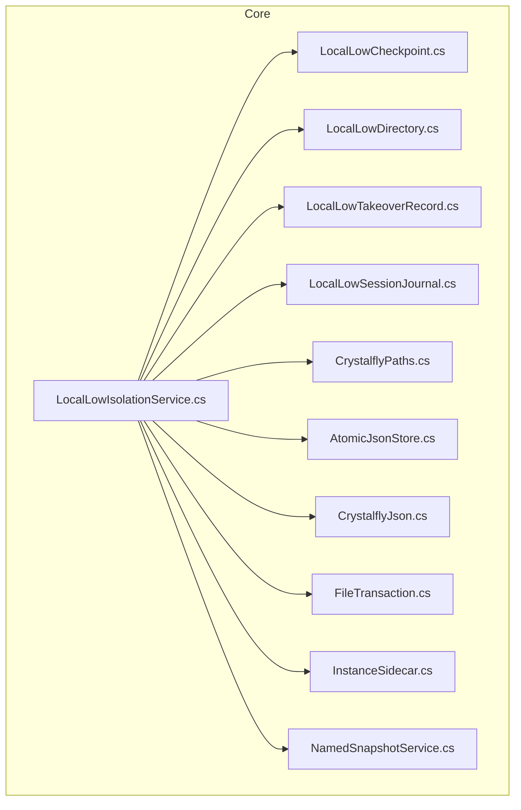
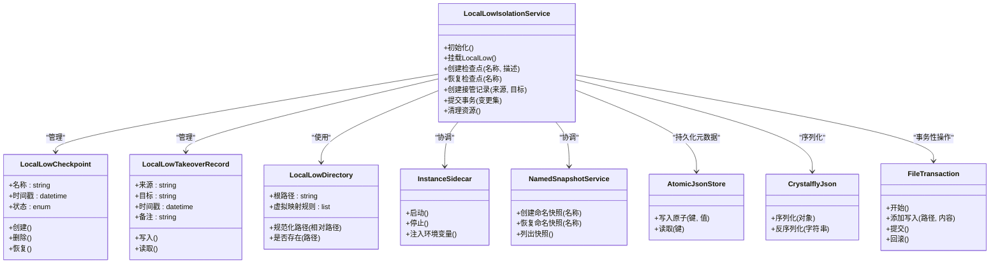
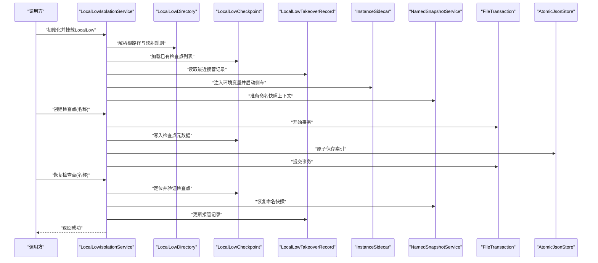
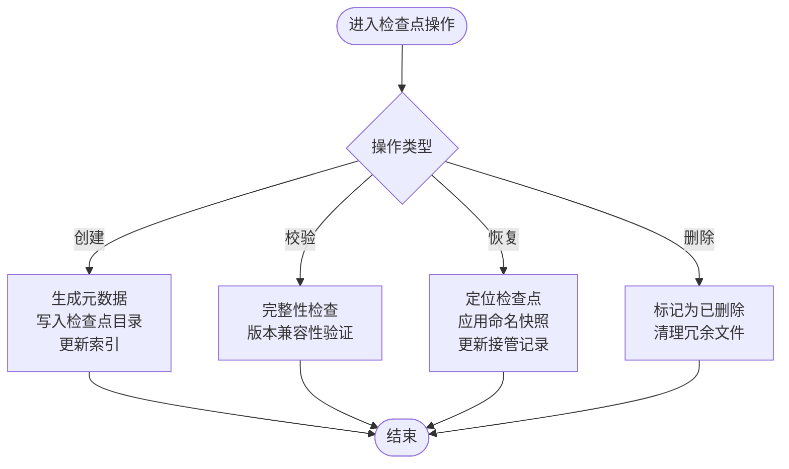
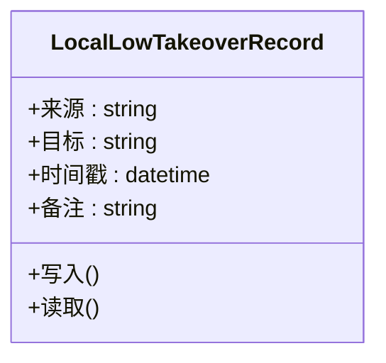
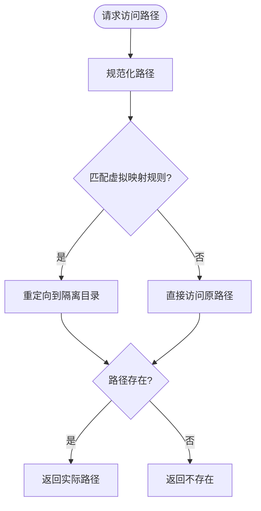
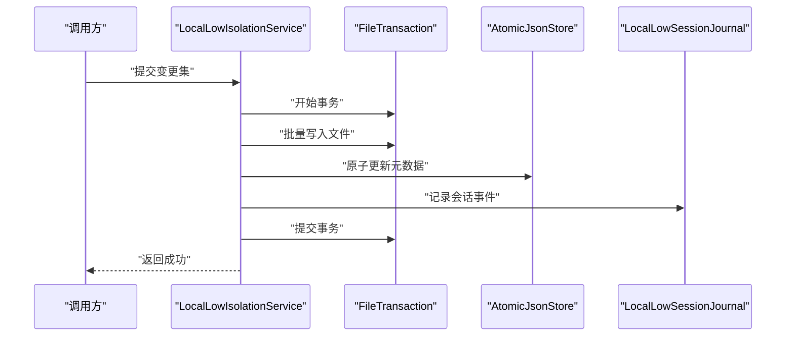
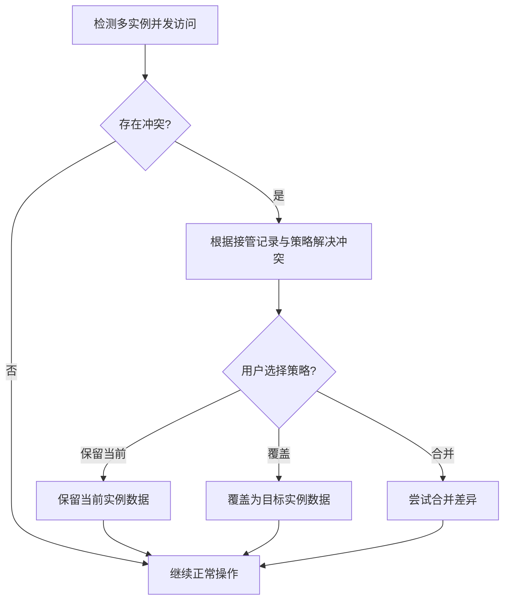
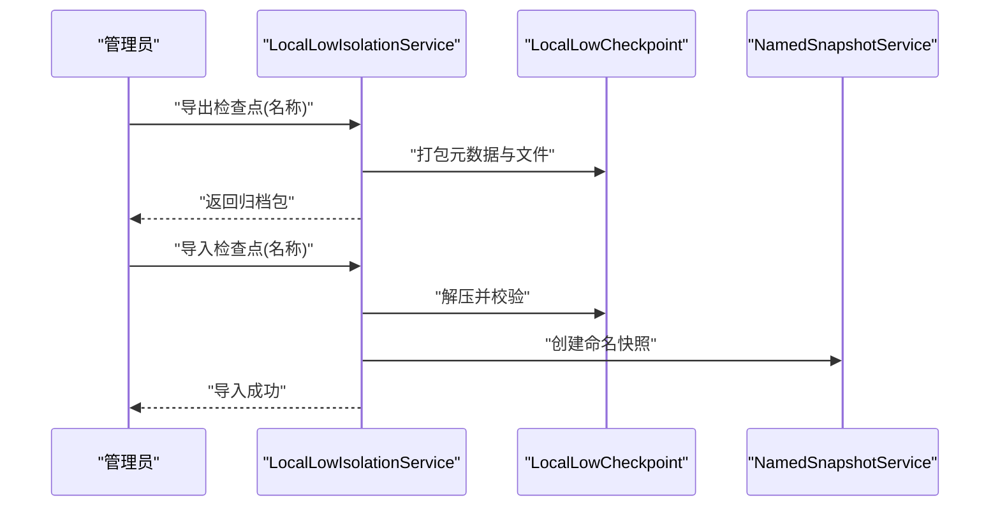
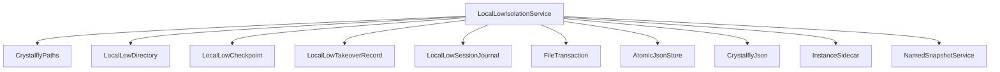

# 本地存储隔离

<cite>
**本文引用的文件**   
- [LocalLowIsolationService.cs](file://src/Crystalfly.Core/LocalLow/LocalLowIsolationService.cs)
- [LocalLowCheckpoint.cs](file://src/Crystalfly.Core/LocalLow/LocalLowCheckpoint.cs)
- [LocalLowDirectory.cs](file://src/Crystalfly.Core/LocalLow/LocalLowDirectory.cs)
- [LocalLowTakeoverRecord.cs](file://src/Crystalfly.Core/Models/LocalLowTakeoverRecord.cs)
- [LocalLowSessionJournal.cs](file://src/Crystalfly.Core/Models/LocalLowSessionJournal.cs)
- [CrystalflyPaths.cs](file://src/Crystalfly.Core/Configuration/CrystalflyPaths.cs)
- [AtomicJsonStore.cs](file://src/Crystalfly.Core/Serialization/AtomicJsonStore.cs)
- [CrystalflyJson.cs](file://src/Crystalfly.Core/Serialization/CrystalflyJson.cs)
- [FileTransaction.cs](file://src/Crystalfly.Core/Transactions/FileTransaction.cs)
- [InstanceSidecar.cs](file://src/Crystalfly.Core/Instances/InstanceSidecar.cs)
- [NamedSnapshotService.cs](file://src/Crystalfly.Core/Snapshots/NamedSnapshotService.cs)
- [LocalLowIsolationServiceTests.cs](file://tests/Crystalfly.Core.Tests/LocalLow/LocalLowIsolationServiceTests.cs)
</cite>

## 目录
1. [简介](#简介)
2. [项目结构](#项目结构)
3. [核心组件](#核心组件)
4. [架构总览](#架构总览)
5. [详细组件分析](#详细组件分析)
6. [依赖关系分析](#依赖关系分析)
7. [性能考虑](#性能考虑)
8. [故障排查指南](#故障排查指南)
9. [结论](#结论)
10. [附录](#附录)

## 简介
本章节聚焦于“本地存储隔离”模块，围绕 LocalLow 目录的隔离机制展开。该模块通过服务化封装与数据模型定义，实现游戏存档文件的虚拟化映射、目录重定向、检查点与接管记录管理，并提供多实例间的数据共享与冲突解决策略。文档将系统阐述以下要点：
- LocalLowIsolationService 隔离服务的职责与控制流
- LocalLowCheckpoint 检查点的创建、校验与恢复流程
- LocalLowTakeoverRecord 接管记录的格式与生命周期
- LocalLowDirectory 目录结构与路径约定
- 文件虚拟化映射与目录重定向的实现思路
- 数据同步策略与一致性保障
- 多实例共享与冲突处理
- 数据迁移与备份恢复实践
- 文件系统权限与跨平台兼容性注意事项

## 项目结构
本地存储隔离相关代码位于 Crystalfly.Core 模块中，采用分层组织：
- LocalLow 子目录：包含隔离服务、检查点与目录抽象
- Models 目录：包含接管记录与会话日志等数据模型
- Configuration 目录：提供路径解析能力
- Serialization 目录：提供原子 JSON 读写工具
- Transactions 目录：提供事务性文件操作
- Instances 与 Snapshots：与侧车进程和命名快照协作，支撑隔离与恢复

图表来源
- [LocalLowIsolationService.cs](file://src/Crystalfly.Core/LocalLow/LocalLowIsolationService.cs)
- [LocalLowCheckpoint.cs](file://src/Crystalfly.Core/LocalLow/LocalLowCheckpoint.cs)
- [LocalLowDirectory.cs](file://src/Crystalfly.Core/LocalLow/LocalLowDirectory.cs)
- [LocalLowTakeoverRecord.cs](file://src/Crystalfly.Core/Models/LocalLowTakeoverRecord.cs)
- [LocalLowSessionJournal.cs](file://src/Crystalfly.Core/Models/LocalLowSessionJournal.cs)
- [CrystalflyPaths.cs](file://src/Crystalfly.Core/Configuration/CrystalflyPaths.cs)
- [AtomicJsonStore.cs](file://src/Crystalfly.Core/Serialization/AtomicJsonStore.cs)
- [CrystalflyJson.cs](file://src/Crystalfly.Core/Serialization/CrystalflyJson.cs)
- [FileTransaction.cs](file://src/Crystalfly.Core/Transactions/FileTransaction.cs)
- [InstanceSidecar.cs](file://src/Crystalfly.Core/Instances/InstanceSidecar.cs)
- [NamedSnapshotService.cs](file://src/Crystalfly.Core/Snapshots/NamedSnapshotService.cs)

章节来源
- [LocalLowIsolationService.cs](file://src/Crystalfly.Core/LocalLow/LocalLowIsolationService.cs)
- [LocalLowCheckpoint.cs](file://src/Crystalfly.Core/LocalLow/LocalLowCheckpoint.cs)
- [LocalLowDirectory.cs](file://src/Crystalfly.Core/LocalLow/LocalLowDirectory.cs)
- [LocalLowTakeoverRecord.cs](file://src/Crystalfly.Core/Models/LocalLowTakeoverRecord.cs)
- [LocalLowSessionJournal.cs](file://src/Crystalfly.Core/Models/LocalLowSessionJournal.cs)
- [CrystalflyPaths.cs](file://src/Crystalfly.Core/Configuration/CrystalflyPaths.cs)
- [AtomicJsonStore.cs](file://src/Crystalfly.Core/Serialization/AtomicJsonStore.cs)
- [CrystalflyJson.cs](file://src/Crystalfly.Core/Serialization/CrystalflyJson.cs)
- [FileTransaction.cs](file://src/Crystalfly.Core/Transactions/FileTransaction.cs)
- [InstanceSidecar.cs](file://src/Crystalfly.Core/Instances/InstanceSidecar.cs)
- [NamedSnapshotService.cs](file://src/Crystalfly.Core/Snapshots/NamedSnapshotService.cs)

## 核心组件
本节对关键组件进行概览式说明，后续章节将深入其内部实现与交互。

- LocalLowIsolationService（隔离服务）
  - 负责 LocalLow 目录的挂载、重定向、检查点与接管记录的管理
  - 协调 InstanceSidecar 与 NamedSnapshotService，完成会话级隔离与恢复
  - 使用 AtomicJsonStore 与 CrystalflyJson 保证元数据的原子写入与序列化一致性
  - 借助 FileTransaction 提供事务性的文件变更能力

- LocalLowCheckpoint（检查点）
  - 定义检查点的元数据与状态机
  - 支持创建、列出、删除与恢复等操作
  - 与隔离服务配合，在启动或切换时应用检查点

- LocalLowTakeoverRecord（接管记录）
  - 描述某次接管操作的上下文信息，如时间戳、来源、目标等
  - 用于审计与冲突解决，避免多实例并发导致的覆盖问题

- LocalLowDirectory（目录抽象）
  - 封装 LocalLow 根目录与虚拟映射规则
  - 提供路径规范化、存在性判断与访问控制辅助方法

- 辅助基础设施
  - CrystalflyPaths：统一路径解析，适配不同平台
  - AtomicJsonStore / CrystalflyJson：原子写入与 JSON 序列化
  - FileTransaction：事务性文件操作，确保一致性
  - InstanceSidecar / NamedSnapshotService：侧车进程与命名快照，增强隔离与可恢复性

章节来源
- [LocalLowIsolationService.cs](file://src/Crystalfly.Core/LocalLow/LocalLowIsolationService.cs)
- [LocalLowCheckpoint.cs](file://src/Crystalfly.Core/LocalLow/LocalLowCheckpoint.cs)
- [LocalLowTakeoverRecord.cs](file://src/Crystalfly.Core/Models/LocalLowTakeoverRecord.cs)
- [LocalLowDirectory.cs](file://src/Crystalfly.Core/LocalLow/LocalLowDirectory.cs)
- [CrystalflyPaths.cs](file://src/Crystalfly.Core/Configuration/CrystalflyPaths.cs)
- [AtomicJsonStore.cs](file://src/Crystalfly.Core/Serialization/AtomicJsonStore.cs)
- [CrystalflyJson.cs](file://src/Crystalfly.Core/Serialization/CrystalflyJson.cs)
- [FileTransaction.cs](file://src/Crystalfly.Core/Transactions/FileTransaction.cs)
- [InstanceSidecar.cs](file://src/Crystalfly.Core/Instances/InstanceSidecar.cs)
- [NamedSnapshotService.cs](file://src/Crystalfly.Core/Snapshots/NamedSnapshotService.cs)

## 架构总览
下图展示了隔离服务与周边组件的交互关系，包括检查点、接管记录、目录抽象、侧车进程与快照服务。

图表来源
- [LocalLowIsolationService.cs](file://src/Crystalfly.Core/LocalLow/LocalLowIsolationService.cs)
- [LocalLowCheckpoint.cs](file://src/Crystalfly.Core/LocalLow/LocalLowCheckpoint.cs)
- [LocalLowTakeoverRecord.cs](file://src/Crystalfly.Core/Models/LocalLowTakeoverRecord.cs)
- [LocalLowDirectory.cs](file://src/Crystalfly.Core/LocalLow/LocalLowDirectory.cs)
- [InstanceSidecar.cs](file://src/Crystalfly.Core/Instances/InstanceSidecar.cs)
- [NamedSnapshotService.cs](file://src/Crystalfly.Core/Snapshots/NamedSnapshotService.cs)
- [AtomicJsonStore.cs](file://src/Crystalfly.Core/Serialization/AtomicJsonStore.cs)
- [CrystalflyJson.cs](file://src/Crystalfly.Core/Serialization/CrystalflyJson.cs)
- [FileTransaction.cs](file://src/Crystalfly.Core/Transactions/FileTransaction.cs)

## 详细组件分析

### LocalLowIsolationService 隔离服务
- 职责边界
  - 提供 LocalLow 目录的挂载与卸载入口
  - 维护检查点与接管记录的生命周期
  - 协调侧车进程与命名快照，实现会话级隔离
  - 基于事务与原子写入保证元数据与文件变更的一致性

- 关键流程
  - 启动阶段：解析路径、加载现有检查点与接管记录、准备虚拟映射
  - 运行阶段：拦截文件访问、重定向到隔离目录、记录会话日志
  - 关闭阶段：提交事务、更新接管记录、释放资源

- 错误处理
  - 捕获并记录文件系统异常
  - 在失败时执行回滚与清理，避免半一致状态
  - 提供诊断信息与恢复建议

图表来源
- [LocalLowIsolationService.cs](file://src/Crystalfly.Core/LocalLow/LocalLowIsolationService.cs)
- [LocalLowDirectory.cs](file://src/Crystalfly.Core/LocalLow/LocalLowDirectory.cs)
- [LocalLowCheckpoint.cs](file://src/Crystalfly.Core/LocalLow/LocalLowCheckpoint.cs)
- [LocalLowTakeoverRecord.cs](file://src/Crystalfly.Core/Models/LocalLowTakeoverRecord.cs)
- [InstanceSidecar.cs](file://src/Crystalfly.Core/Instances/InstanceSidecar.cs)
- [NamedSnapshotService.cs](file://src/Crystalfly.Core/Snapshots/NamedSnapshotService.cs)
- [FileTransaction.cs](file://src/Crystalfly.Core/Transactions/FileTransaction.cs)
- [AtomicJsonStore.cs](file://src/Crystalfly.Core/Serialization/AtomicJsonStore.cs)

章节来源
- [LocalLowIsolationService.cs](file://src/Crystalfly.Core/LocalLow/LocalLowIsolationService.cs)
- [LocalLowCheckpoint.cs](file://src/Crystalfly.Core/LocalLow/LocalLowCheckpoint.cs)
- [LocalLowTakeoverRecord.cs](file://src/Crystalfly.Core/Models/LocalLowTakeoverRecord.cs)
- [LocalLowDirectory.cs](file://src/Crystalfly.Core/LocalLow/LocalLowDirectory.cs)
- [InstanceSidecar.cs](file://src/Crystalfly.Core/Instances/InstanceSidecar.cs)
- [NamedSnapshotService.cs](file://src/Crystalfly.Core/Snapshots/NamedSnapshotService.cs)
- [FileTransaction.cs](file://src/Crystalfly.Core/Transactions/FileTransaction.cs)
- [AtomicJsonStore.cs](file://src/Crystalfly.Core/Serialization/AtomicJsonStore.cs)

### LocalLowCheckpoint 检查点
- 数据结构
  - 名称：唯一标识
  - 时间戳：创建时间
  - 状态：有效/损坏/已删除
  - 元数据：附加描述与版本信息

- 操作流程
  - 创建：生成元数据、写入检查点目录、更新索引
  - 校验：完整性检查、版本兼容性与签名验证（如有）
  - 恢复：定位检查点、应用命名快照、更新接管记录
  - 删除：标记为已删除、清理冗余文件

图表来源
- [LocalLowCheckpoint.cs](file://src/Crystalfly.Core/LocalLow/LocalLowCheckpoint.cs)
- [NamedSnapshotService.cs](file://src/Crystalfly.Core/Snapshots/NamedSnapshotService.cs)
- [LocalLowTakeoverRecord.cs](file://src/Crystalfly.Core/Models/LocalLowTakeoverRecord.cs)

章节来源
- [LocalLowCheckpoint.cs](file://src/Crystalfly.Core/LocalLow/LocalLowCheckpoint.cs)
- [NamedSnapshotService.cs](file://src/Crystalfly.Core/Snapshots/NamedSnapshotService.cs)
- [LocalLowTakeoverRecord.cs](file://src/Crystalfly.Core/Models/LocalLowTakeoverRecord.cs)

### LocalLowTakeoverRecord 接管记录
- 字段说明
  - 来源：触发接管的实例或服务
  - 目标：被接管的目标实例或服务
  - 时间戳：接管发生的时间
  - 备注：人工或自动化的补充说明

- 用途
  - 审计追踪：记录每次接管的原因与上下文
  - 冲突解决：在多实例并发场景下，依据时间戳与来源优先级决定最终数据归属
  - 恢复指引：结合检查点与接管记录，指导用户选择正确的恢复路径

图表来源
- [LocalLowTakeoverRecord.cs](file://src/Crystalfly.Core/Models/LocalLowTakeoverRecord.cs)

章节来源
- [LocalLowTakeoverRecord.cs](file://src/Crystalfly.Core/Models/LocalLowTakeoverRecord.cs)

### LocalLowDirectory 目录结构
- 根目录
  - 通常位于用户配置目录下，由 CrystalflyPaths 解析得到
  - 包含虚拟映射规则、检查点目录、接管记录与会话日志

- 虚拟映射规则
  - 定义游戏期望的 LocalLow 路径与实际隔离目录之间的映射关系
  - 支持按实例维度隔离，避免多实例互相影响

- 常用方法
  - 规范化路径：将相对路径转换为绝对路径
  - 存在性判断：快速判断文件或目录是否存在
  - 访问控制：限制非授权访问与越权操作

图表来源
- [LocalLowDirectory.cs](file://src/Crystalfly.Core/LocalLow/LocalLowDirectory.cs)
- [CrystalflyPaths.cs](file://src/Crystalfly.Core/Configuration/CrystalflyPaths.cs)

章节来源
- [LocalLowDirectory.cs](file://src/Crystalfly.Core/LocalLow/LocalLowDirectory.cs)
- [CrystalflyPaths.cs](file://src/Crystalfly.Core/Configuration/CrystalflyPaths.cs)

### 数据同步策略与一致性保障
- 事务性写入
  - 使用 FileTransaction 包裹一系列文件操作，确保要么全部成功，要么全部回滚
  - 在检查点创建与恢复过程中尤为关键

- 原子元数据持久化
  - 通过 AtomicJsonStore 与 CrystalflyJson 实现元数据的原子写入与序列化
  - 避免部分写入导致的状态不一致

- 会话日志
  - LocalLowSessionJournal 记录会话期间的关键事件，便于审计与排障

图表来源
- [FileTransaction.cs](file://src/Crystalfly.Core/Transactions/FileTransaction.cs)
- [AtomicJsonStore.cs](file://src/Crystalfly.Core/Serialization/AtomicJsonStore.cs)
- [CrystalflyJson.cs](file://src/Crystalfly.Core/Serialization/CrystalflyJson.cs)
- [LocalLowSessionJournal.cs](file://src/Crystalfly.Core/Models/LocalLowSessionJournal.cs)
- [LocalLowIsolationService.cs](file://src/Crystalfly.Core/LocalLow/LocalLowIsolationService.cs)

章节来源
- [FileTransaction.cs](file://src/Crystalfly.Core/Transactions/FileTransaction.cs)
- [AtomicJsonStore.cs](file://src/Crystalfly.Core/Serialization/AtomicJsonStore.cs)
- [CrystalflyJson.cs](file://src/Crystalfly.Core/Serialization/CrystalflyJson.cs)
- [LocalLowSessionJournal.cs](file://src/Crystalfly.Core/Models/LocalLowSessionJournal.cs)
- [LocalLowIsolationService.cs](file://src/Crystalfly.Core/LocalLow/LocalLowIsolationService.cs)

### 多实例间的数据共享与冲突解决
- 共享策略
  - 通过虚拟映射规则限定每个实例的可见范围
  - 使用命名快照在不同实例间共享只读数据

- 冲突解决
  - 以接管记录为依据，比较时间戳与来源优先级
  - 在检测到冲突时，提示用户选择保留策略（保留当前、覆盖或合并）

图表来源
- [LocalLowTakeoverRecord.cs](file://src/Crystalfly.Core/Models/LocalLowTakeoverRecord.cs)
- [NamedSnapshotService.cs](file://src/Crystalfly.Core/Snapshots/NamedSnapshotService.cs)
- [LocalLowIsolationService.cs](file://src/Crystalfly.Core/LocalLow/LocalLowIsolationService.cs)

章节来源
- [LocalLowTakeoverRecord.cs](file://src/Crystalfly.Core/Models/LocalLowTakeoverRecord.cs)
- [NamedSnapshotService.cs](file://src/Crystalfly.Core/Snapshots/NamedSnapshotService.cs)
- [LocalLowIsolationService.cs](file://src/Crystalfly.Core/LocalLow/LocalLowIsolationService.cs)

### 数据迁移与备份恢复指南
- 数据迁移
  - 使用检查点作为迁移单元，导出与导入检查点元数据与对应文件
  - 在迁移前进行完整性校验，确保源数据可用

- 备份恢复
  - 定期创建命名快照，作为长期备份
  - 恢复时优先选择最近的稳定检查点，并结合接管记录确认数据来源

图表来源
- [LocalLowCheckpoint.cs](file://src/Crystalfly.Core/LocalLow/LocalLowCheckpoint.cs)
- [NamedSnapshotService.cs](file://src/Crystalfly.Core/Snapshots/NamedSnapshotService.cs)
- [LocalLowIsolationService.cs](file://src/Crystalfly.Core/LocalLow/LocalLowIsolationService.cs)

章节来源
- [LocalLowCheckpoint.cs](file://src/Crystalfly.Core/LocalLow/LocalLowCheckpoint.cs)
- [NamedSnapshotService.cs](file://src/Crystalfly.Core/Snapshots/NamedSnapshotService.cs)
- [LocalLowIsolationService.cs](file://src/Crystalfly.Core/LocalLow/LocalLowIsolationService.cs)

### 文件系统权限与跨平台兼容性
- 权限管理
  - 确保隔离目录具备最小必要权限
  - 在 Windows 上使用 ACL 限制访问，在 Unix-like 系统上使用 POSIX 权限

- 跨平台兼容
  - 使用 CrystalflyPaths 统一路径分隔符与大小写敏感策略
  - 针对符号链接、硬链接与特殊文件类型进行差异化处理

章节来源
- [CrystalflyPaths.cs](file://src/Crystalfly.Core/Configuration/CrystalflyPaths.cs)
- [LocalLowDirectory.cs](file://src/Crystalfly.Core/LocalLow/LocalLowDirectory.cs)

## 依赖关系分析
隔离服务依赖多个子系统，形成清晰的层次与职责划分。

图表来源
- [LocalLowIsolationService.cs](file://src/Crystalfly.Core/LocalLow/LocalLowIsolationService.cs)
- [CrystalflyPaths.cs](file://src/Crystalfly.Core/Configuration/CrystalflyPaths.cs)
- [LocalLowDirectory.cs](file://src/Crystalfly.Core/LocalLow/LocalLowDirectory.cs)
- [LocalLowCheckpoint.cs](file://src/Crystalfly.Core/LocalLow/LocalLowCheckpoint.cs)
- [LocalLowTakeoverRecord.cs](file://src/Crystalfly.Core/Models/LocalLowTakeoverRecord.cs)
- [LocalLowSessionJournal.cs](file://src/Crystalfly.Core/Models/LocalLowSessionJournal.cs)
- [FileTransaction.cs](file://src/Crystalfly.Core/Transactions/FileTransaction.cs)
- [AtomicJsonStore.cs](file://src/Crystalfly.Core/Serialization/AtomicJsonStore.cs)
- [CrystalflyJson.cs](file://src/Crystalfly.Core/Serialization/CrystalflyJson.cs)
- [InstanceSidecar.cs](file://src/Crystalfly.Core/Instances/InstanceSidecar.cs)
- [NamedSnapshotService.cs](file://src/Crystalfly.Core/Snapshots/NamedSnapshotService.cs)

章节来源
- [LocalLowIsolationService.cs](file://src/Crystalfly.Core/LocalLow/LocalLowIsolationService.cs)
- [CrystalflyPaths.cs](file://src/Crystalfly.Core/Configuration/CrystalflyPaths.cs)
- [LocalLowDirectory.cs](file://src/Crystalfly.Core/LocalLow/LocalLowDirectory.cs)
- [LocalLowCheckpoint.cs](file://src/Crystalfly.Core/LocalLow/LocalLowCheckpoint.cs)
- [LocalLowTakeoverRecord.cs](file://src/Crystalfly.Core/Models/LocalLowTakeoverRecord.cs)
- [LocalLowSessionJournal.cs](file://src/Crystalfly.Core/Models/LocalLowSessionJournal.cs)
- [FileTransaction.cs](file://src/Crystalfly.Core/Transactions/FileTransaction.cs)
- [AtomicJsonStore.cs](file://src/Crystalfly.Core/Serialization/AtomicJsonStore.cs)
- [CrystalflyJson.cs](file://src/Crystalfly.Core/Serialization/CrystalflyJson.cs)
- [InstanceSidecar.cs](file://src/Crystalfly.Core/Instances/InstanceSidecar.cs)
- [NamedSnapshotService.cs](file://src/Crystalfly.Core/Snapshots/NamedSnapshotService.cs)

## 性能考虑
- 减少不必要的文件扫描：利用索引与缓存提升查找效率
- 批量操作优化：合并小文件写入，降低系统调用开销
- 异步处理：对耗时操作（如快照创建）采用异步任务，避免阻塞主线程
- 内存占用控制：及时释放临时缓冲区与大对象引用

[本节为通用性能建议，不直接分析具体文件]

## 故障排查指南
- 常见问题
  - 检查点损坏：校验元数据完整性，必要时从命名快照恢复
  - 接管记录缺失：重建接管记录或从会话日志推断
  - 权限不足：检查目录权限与用户上下文
  - 路径解析错误：确认平台路径分隔符与大小写敏感设置

- 诊断步骤
  - 查看会话日志，定位异常时间点
  - 核对接管记录与检查点时间线
  - 使用隔离服务提供的诊断接口输出环境信息

章节来源
- [LocalLowSessionJournal.cs](file://src/Crystalfly.Core/Models/LocalLowSessionJournal.cs)
- [LocalLowTakeoverRecord.cs](file://src/Crystalfly.Core/Models/LocalLowTakeoverRecord.cs)
- [LocalLowIsolationService.cs](file://src/Crystalfly.Core/LocalLow/LocalLowIsolationService.cs)

## 结论
本地存储隔离模块通过服务化封装与数据模型设计，实现了稳定的 LocalLow 目录隔离机制。借助检查点、接管记录与事务性操作，系统在多实例环境下提供了可靠的数据共享与冲突解决能力。配合命名快照与侧车进程，进一步增强了隔离性与可恢复性。建议在部署时关注权限与跨平台兼容性，并建立完善的监控与排障流程。

[本节为总结性内容，不直接分析具体文件]

## 附录
- 示例参考（仅路径，不含代码内容）
  - 实现文件隔离：参见 [LocalLowIsolationService.cs](file://src/Crystalfly.Core/LocalLow/LocalLowIsolationService.cs)
  - 创建检查点：参见 [LocalLowCheckpoint.cs](file://src/Crystalfly.Core/LocalLow/LocalLowCheckpoint.cs)
  - 恢复用户数据：参见 [LocalLowIsolationService.cs](file://src/Crystalfly.Core/LocalLow/LocalLowIsolationService.cs) 与 [NamedSnapshotService.cs](file://src/Crystalfly.Core/Snapshots/NamedSnapshotService.cs)
  - 测试用例：参见 [LocalLowIsolationServiceTests.cs](file://tests/Crystalfly.Core.Tests/LocalLow/LocalLowIsolationServiceTests.cs)

[本节为附录信息，不直接分析具体文件]