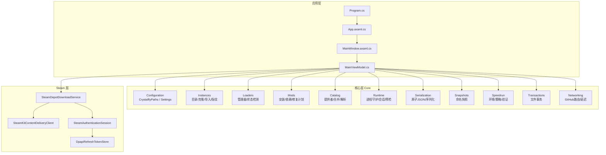
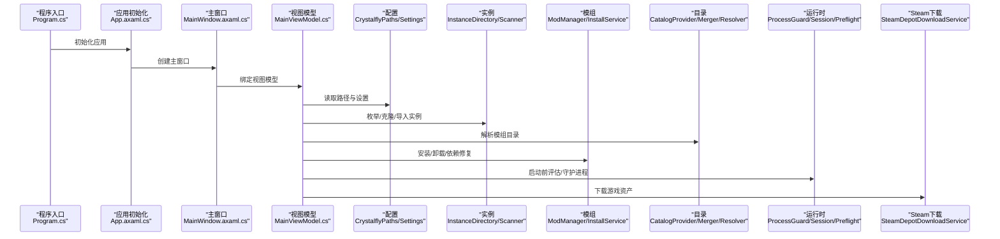
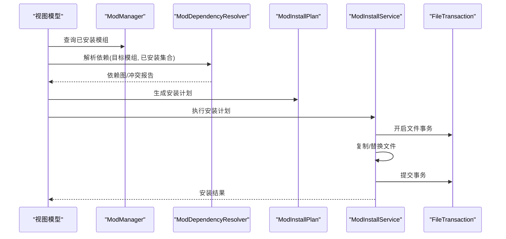
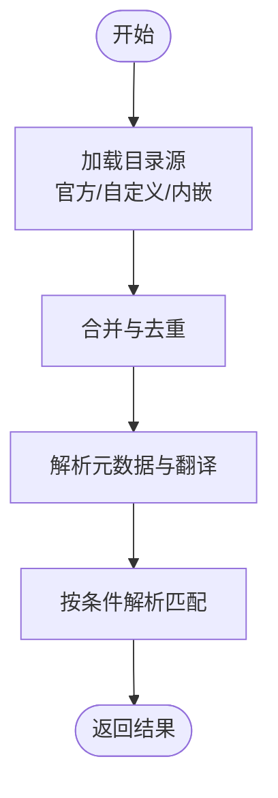
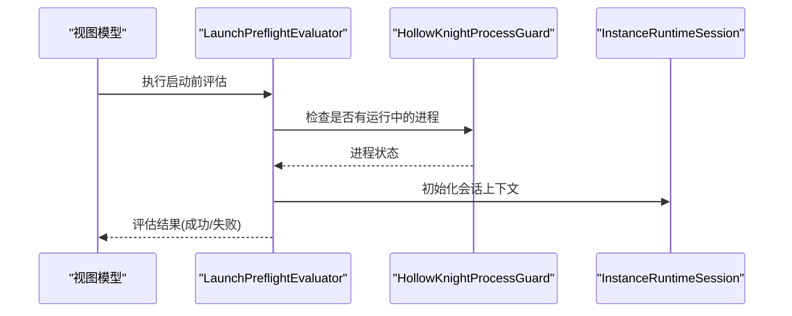
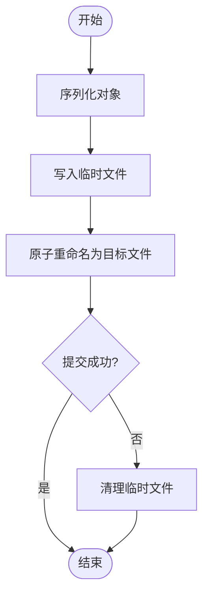
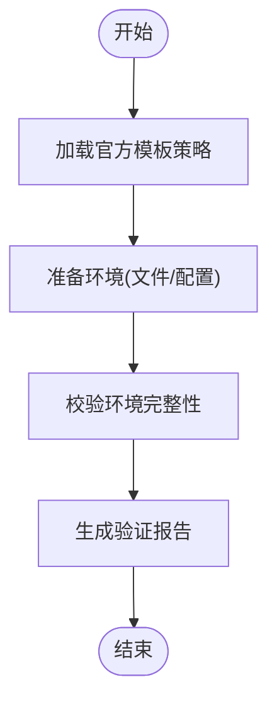
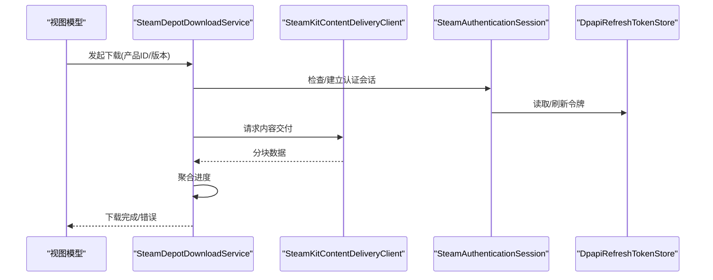
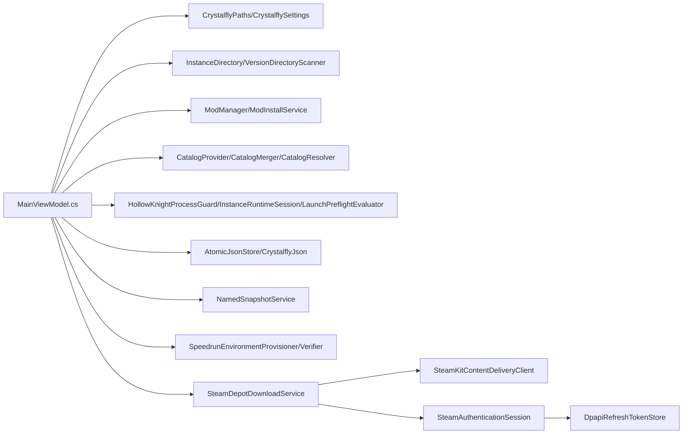

# 核心模块

<cite>
**本文引用的文件**   
- [Program.cs](file://src/Crystalfly.App/Program.cs)
- [App.axaml.cs](file://src/Crystalfly.App/App.axaml.cs)
- [MainWindow.axaml.cs](file://src/Crystalfly.App/Views/MainWindow.axaml.cs)
- [MainViewModel.cs](file://src/Crystalfly.App/ViewModels/MainViewModel.cs)
- [CrystalflyPaths.cs](file://src/Crystalfly.Core/Configuration/CrystalflyPaths.cs)
- [CrystalflySettings.cs](file://src/Crystalfly.Core/Configuration/CrystalflySettings.cs)
- [CrystalflySettingsStore.cs](file://src/Crystalfly.Core/Configuration/CrystalflySettingsStore.cs)
- [InstanceDirectory.cs](file://src/Crystalfly.Core/Instances/InstanceDirectory.cs)
- [VersionDirectoryScanner.cs](file://src/Crystalfly.Core/Instances/VersionDirectoryScanner.cs)
- [BuildFingerprintService.cs](file://src/Crystalfly.Core/Instances/BuildFingerprintService.cs)
- [InstanceCloneService.cs](file://src/Crystalfly.Core/Instances/InstanceCloneService.cs)
- [InstanceDeletionService.cs](file://src/Crystalfly.Core/Instances/InstanceDeletionService.cs)
- [InstanceImportService.cs](file://src/Crystalfly.Core/Instances/InstanceImportService.cs)
- [InstanceSidecar.cs](file://src/Crystalfly.Core/Instances/InstanceSidecar.cs)
- [LoaderManager.cs](file://src/Crystalfly.Core/Loaders/LoaderManager.cs)
- [LoaderStateDetector.cs](file://src/Crystalfly.Core/Loaders/LoaderStateDetector.cs)
- [LocalLoaderPackageManifest.cs](file://src/Crystalfly.Core/Loaders/LocalLoaderPackageManifest.cs)
- [ModManager.cs](file://src/Crystalfly.Core/Mods/ModManager.cs)
- [ModInstallService.cs](file://src/Crystalfly.Core/Mods/ModInstallService.cs)
- [ModDependencyResolver.cs](file://src/Crystalfly.Core/Mods/ModDependencyResolver.cs)
- [InstalledModDependencyGraph.cs](file://src/Crystalfly.Core/Mods/InstalledModDependencyGraph.cs)
- [ModDependencyRepairPlanner.cs](file://src/Crystalfly.Core/Mods/ModDependencyRepairPlanner.cs)
- [ModInstallPlan.cs](file://src/Crystalfly.Core/Mods/ModInstallPlan.cs)
- [ModRemovalImpactPlan.cs](file://src/Crystalfly.Core/Mods/ModRemovalImpactPlan.cs)
- [CatalogProvider.cs](file://src/Crystalfly.Core/Catalog/CatalogProvider.cs)
- [CatalogMerger.cs](file://src/Crystalfly.Core/Catalog/CatalogMerger.cs)
- [CatalogResolver.cs](file://src/Crystalfly.Core/Catalog/CatalogResolver.cs)
- [OfficialCatalogSource.cs](file://src/Crystalfly.Core/Catalog/OfficialCatalogSource.cs)
- [CustomCatalogSource.cs](file://src/Crystalfly.Core/Catalog/CustomCatalogSource.cs)
- [EmbeddedCatalog.cs](file://src/Crystalfly.Core/Catalog/EmbeddedCatalog.cs)
- [OfficialXmlCatalogParser.cs](file://src/Crystalfly.Core/Catalog/OfficialXmlCatalogParser.cs)
- [ModTranslationSource.cs](file://src/Crystalfly.Core/Catalog/ModTranslationSource.cs)
- [EmbeddedModTranslationCatalog.cs](file://src/Crystalfly.Core/Catalog/EmbeddedModTranslationCatalog.cs)
- [HollowKnightProcessGuard.cs](file://src/Crystalffly.Core/Runtime/HollowKnightProcessGuard.cs)
- [InstanceRuntimeSession.cs](file://src/Crystalfly.Core/Runtime/InstanceRuntimeSession.cs)
- [LaunchPreflightEvaluator.cs](file://src/Crystalfly.Core/Runtime/LaunchPreflightEvaluator.cs)
- [AtomicJsonStore.cs](file://src/Crystalfly.Core/Serialization/AtomicJsonStore.cs)
- [CrystalflyJson.cs](file://src/Crystalfly.Core/Serialization/CrystalflyJson.cs)
- [NamedSnapshotService.cs](file://src/Crystalfly.Core/Snapshots/NamedSnapshotService.cs)
- [SpeedrunEnvironmentProvisioner.cs](file://src/Crystalfly.Core/Speedrun/SpeedrunEnvironmentProvisioner.cs)
- [SpeedrunEnvironmentVerifier.cs](file://src/Crystalfly.Core/Speedrun/SpeedrunEnvironmentVerifier.cs)
- [OfficialSpeedrunTemplatePolicy.cs](file://src/Crystalfly.Core/Speedrun/OfficialSpeedrunTemplatePolicy.cs)
- [SpeedrunVerificationRequest.cs](file://src/Crystalfly.Core/Speedrun/SpeedrunVerificationRequest.cs)
- [FileTransaction.cs](file://src/Crystalfly.Core/Transactions/FileTransaction.cs)
- [SteamDepotDownloadService.cs](file://src/Crystalfly.Steam/Downloads/SteamDepotDownloadService.cs)
- [SteamKitContentDeliveryClient.cs](file://src/Crystalfly.Steam/Downloads/SteamKitContentDeliveryClient.cs)
- [ISteamContentDeliveryClient.cs](file://src/Crystalfly.Steam/Downloads/ISteamContentDeliveryClient.cs)
- [DownloadPath.cs](file://src/Crystalfly.Steam/Downloads/DownloadPath.cs)
- [DownloadProgressAggregator.cs](file://src/Crystalfly.Steam/Downloads/DownloadProgressAggregator.cs)
- [SteamProduct.cs](file://src/Crystalfly.Steam/Downloads/SteamProduct.cs)
- [DpapiRefreshTokenStore.cs](file://src/Crystalfly.Steam/Security/DpapiRefreshTokenStore.cs)
- [RefreshTokenCredential.cs](file://src/Crystalfly.Steam/Security/RefreshTokenCredential.cs)
- [AuthenticationSession.cs](file://src/Crystalfly.Steam/Authentication/SteamAuthenticationSession.cs)
- [QrChallengeEventArgs.cs](file://src/Crystalfly.Steam/Authentication/QrChallengeEventArgs.cs)
- [ISteamGuardCallback.cs](file://src/Crystalfly.Steam/Authentication/ISteamGuardCallback.cs)
</cite>

## 目录
1. [简介](#简介)
2. [项目结构](#项目结构)
3. [核心组件](#核心组件)
4. [架构总览](#架构总览)
5. [详细组件分析](#详细组件分析)
6. [依赖关系分析](#依赖关系分析)
7. [性能考量](#性能考量)
8. [故障排查指南](#故障排查指南)
9. [结论](#结论)
10. [附录](#附录)

## 简介
本文件聚焦 Crystalfly 核心模块，围绕以下关键子系统展开：游戏实例管理、模组生态系统、目录与配置系统、运行时管理与启动前检查、快照与速通环境、事务与序列化、以及 Steam 集成下载与安全。文档以“从入门到深入”的方式组织，既提供高层概览，也给出面向代码级的调用关系与数据流说明，帮助读者快速理解并高效扩展。

## 项目结构
核心代码位于 src/Crystalfly.Core，应用入口与 UI 位于 src/Crystalfly.App，Steam 能力封装在 src/Crystalfly.Steam。核心模块按职责划分为多个命名空间：
- Configuration：路径与设置
- Instances：实例生命周期与目录扫描
- Loaders：加载器发现与状态检测
- Mods：模组安装、依赖解析与修复计划
- Catalog：模组目录聚合、合并与解析
- Runtime：进程守护、会话与启动前置评估
- Serialization：原子 JSON 存储与序列化
- Snapshots：命名快照服务
- Speedrun：速通环境准备与校验
- Transactions：文件级事务
- Networking：网络路由与延迟（GitHub）
- Steam：内容交付、安全令牌与会话

图表来源
- [Program.cs](file://src/Crystalfly.App/Program.cs)
- [App.axaml.cs](file://src/Crystalfly.App/App.axaml.cs)
- [MainWindow.axaml.cs](file://src/Crystalfly.App/Views/MainWindow.axaml.cs)
- [MainViewModel.cs](file://src/Crystalfly.App/ViewModels/MainViewModel.cs)
- [CrystalflyPaths.cs](file://src/Crystalfly.Core/Configuration/CrystalflyPaths.cs)
- [CrystalflySettings.cs](file://src/Crystalfly.Core/Configuration/CrystalflySettings.cs)
- [CrystalflySettingsStore.cs](file://src/Crystalfly.Core/Configuration/CrystalflySettingsStore.cs)
- [InstanceDirectory.cs](file://src/Crystalfly.Core/Instances/InstanceDirectory.cs)
- [VersionDirectoryScanner.cs](file://src/Crystalfly.Core/Instances/VersionDirectoryScanner.cs)
- [BuildFingerprintService.cs](file://src/Crystalfly.Core/Instances/BuildFingerprintService.cs)
- [InstanceCloneService.cs](file://src/Crystalfly.Core/Instances/InstanceCloneService.cs)
- [InstanceDeletionService.cs](file://src/Crystalfly.Core/Instances/InstanceDeletionService.cs)
- [InstanceImportService.cs](file://src/Crystalfly.Core/Instances/InstanceImportService.cs)
- [InstanceSidecar.cs](file://src/Crystalfly.Core/Instances/InstanceSidecar.cs)
- [LoaderManager.cs](file://src/Crystalfly.Core/Loaders/LoaderManager.cs)
- [LoaderStateDetector.cs](file://src/Crystalfly.Core/Loaders/LoaderStateDetector.cs)
- [LocalLoaderPackageManifest.cs](file://src/Crystalfly.Core/Loaders/LocalLoaderPackageManifest.cs)
- [ModManager.cs](file://src/Crystalfly.Core/Mods/ModManager.cs)
- [ModInstallService.cs](file://src/Crystalfly.Core/Mods/ModInstallService.cs)
- [ModDependencyResolver.cs](file://src/Crystalfly.Core/Mods/ModDependencyResolver.cs)
- [InstalledModDependencyGraph.cs](file://src/Crystalfly.Core/Mods/InstalledModDependencyGraph.cs)
- [ModDependencyRepairPlanner.cs](file://src/Crystalfly.Core/Mods/ModDependencyRepairPlanner.cs)
- [ModInstallPlan.cs](file://src/Crystalfly.Core/Mods/ModInstallPlan.cs)
- [ModRemovalImpactPlan.cs](file://src/Crystalfly.Core/Mods/ModRemovalImpactPlan.cs)
- [CatalogProvider.cs](file://src/Crystalfly.Core/Catalog/CatalogProvider.cs)
- [CatalogMerger.cs](file://src/Crystalfly.Core/Catalog/CatalogMerger.cs)
- [CatalogResolver.cs](file://src/Crystalfly.Core/Catalog/CatalogResolver.cs)
- [OfficialCatalogSource.cs](file://src/Crystalfly.Core/Catalog/OfficialCatalogSource.cs)
- [CustomCatalogSource.cs](file://src/Crystalfly.Core/Catalog/CustomCatalogSource.cs)
- [EmbeddedCatalog.cs](file://src/Crystalfly.Core/Catalog/EmbeddedCatalog.cs)
- [OfficialXmlCatalogParser.cs](file://src/Crystalfly.Core/Catalog/OfficialXmlCatalogParser.cs)
- [ModTranslationSource.cs](file://src/Crystalfly.Core/Catalog/ModTranslationSource.cs)
- [EmbeddedModTranslationCatalog.cs](file://src/Crystalfly.Core/Catalog/EmbeddedModTranslationCatalog.cs)
- [HollowKnightProcessGuard.cs](file://src/Crystalfly.Core/Runtime/HollowKnightProcessGuard.cs)
- [InstanceRuntimeSession.cs](file://src/Crystalfly.Core/Runtime/InstanceRuntimeSession.cs)
- [LaunchPreflightEvaluator.cs](file://src/Crystalfly.Core/Runtime/LaunchPreflightEvaluator.cs)
- [AtomicJsonStore.cs](file://src/Crystalfly.Core/Serialization/AtomicJsonStore.cs)
- [CrystalflyJson.cs](file://src/Crystalfly.Core/Serialization/CrystalflyJson.cs)
- [NamedSnapshotService.cs](file://src/Crystalfly.Core/Snapshots/NamedSnapshotService.cs)
- [SpeedrunEnvironmentProvisioner.cs](file://src/Crystalfly.Core/Speedrun/SpeedrunEnvironmentProvisioner.cs)
- [SpeedrunEnvironmentVerifier.cs](file://src/Crystalfly.Core/Speedrun/SpeedrunEnvironmentVerifier.cs)
- [OfficialSpeedrunTemplatePolicy.cs](file://src/Crystalfly.Core/Speedrun/OfficialSpeedrunTemplatePolicy.cs)
- [SpeedrunVerificationRequest.cs](file://src/Crystalfly.Core/Speedrun/SpeedrunVerificationRequest.cs)
- [FileTransaction.cs](file://src/Crystalfly.Core/Transactions/FileTransaction.cs)
- [SteamDepotDownloadService.cs](file://src/Crystalfly.Steam/Downloads/SteamDepotDownloadService.cs)
- [SteamKitContentDeliveryClient.cs](file://src/Crystalfly.Steam/Downloads/SteamKitContentDeliveryClient.cs)
- [ISteamContentDeliveryClient.cs](file://src/Crystalfly.Steam/Downloads/ISteamContentDeliveryClient.cs)
- [DownloadPath.cs](file://src/Crystalfly.Steam/Downloads/DownloadPath.cs)
- [DownloadProgressAggregator.cs](file://src/Crystalfly.Steam/Downloads/DownloadProgressAggregator.cs)
- [SteamProduct.cs](file://src/Crystalfly.Steam/Downloads/SteamProduct.cs)
- [DpapiRefreshTokenStore.cs](file://src/Crystalfly.Steam/Security/DpapiRefreshTokenStore.cs)
- [RefreshTokenCredential.cs](file://src/Crystalfly.Steam/Security/RefreshTokenCredential.cs)
- [SteamAuthenticationSession.cs](file://src/Crystalfly.Steam/Authentication/SteamAuthenticationSession.cs)
- [QrChallengeEventArgs.cs](file://src/Crystalfly.Steam/Authentication/QrChallengeEventArgs.cs)
- [ISteamGuardCallback.cs](file://src/Crystalfly.Steam/Authentication/ISteamGuardCallback.cs)

章节来源
- [Program.cs](file://src/Crystalfly.App/Program.cs)
- [App.axaml.cs](file://src/Crystalfly.App/App.axaml.cs)
- [MainWindow.axaml.cs](file://src/Crystalfly.App/Views/MainWindow.axaml.cs)
- [MainViewModel.cs](file://src/Crystalfly.App/ViewModels/MainViewModel.cs)

## 核心组件
本节概述核心业务逻辑的关键点与交互边界，为后续深入分析奠定基础。

- 配置与路径
  - 负责解析与应用根路径、用户数据目录、实例目录等；提供可持久化的设置项与读写接口。
  - 典型使用：应用启动时初始化路径与设置，供各子系统读取。
  - 章节来源
    - [CrystalflyPaths.cs](file://src/Crystalfly.Core/Configuration/CrystalflyPaths.cs)
    - [CrystalflySettings.cs](file://src/Crystalfly.Core/Configuration/CrystalflySettings.cs)
    - [CrystalflySettingsStore.cs](file://src/Crystalfly.Core/Configuration/CrystalflySettingsStore.cs)

- 实例管理
  - 提供实例目录定位、版本目录扫描、构建指纹计算、克隆/删除/导入等能力。
  - 典型使用：列出可用实例、创建新实例、清理无效实例。
  - 章节来源
    - [InstanceDirectory.cs](file://src/Crystalfly.Core/Instances/InstanceDirectory.cs)
    - [VersionDirectoryScanner.cs](file://src/Crystalfly.Core/Instances/VersionDirectoryScanner.cs)
    - [BuildFingerprintService.cs](file://src/Crystalfly.Core/Instances/BuildFingerprintService.cs)
    - [InstanceCloneService.cs](file://src/Crystalfly.Core/Instances/InstanceCloneService.cs)
    - [InstanceDeletionService.cs](file://src/Crystalfly.Core/Instances/InstanceDeletionService.cs)
    - [InstanceImportService.cs](file://src/Crystalfly.Core/Instances/InstanceImportService.cs)
    - [InstanceSidecar.cs](file://src/Crystalfly.Core/Instances/InstanceSidecar.cs)

- 加载器管理
  - 发现本地加载器包清单、检测运行态加载器状态。
  - 典型使用：判断当前实例是否具备可用的加载器，或需要安装/更新。
  - 章节来源
    - [LoaderManager.cs](file://src/Crystalfly.Core/Loaders/LoaderManager.cs)
    - [LoaderStateDetector.cs](file://src/Crystalfly.Core/Loaders/LoaderStateDetector.cs)
    - [LocalLoaderPackageManifest.cs](file://src/Crystalfly.Core/Loaders/LocalLoaderPackageManifest.cs)

- 模组生态
  - 提供已安装模组的查询、安装计划生成、依赖图构建、依赖修复规划与移除影响评估。
  - 典型使用：安装模组前进行依赖解析与冲突检测，生成安装计划后执行。
  - 章节来源
    - [ModManager.cs](file://src/Crystalfly.Core/Mods/ModManager.cs)
    - [ModInstallService.cs](file://src/Crystalfly.Core/Mods/ModInstallService.cs)
    - [ModDependencyResolver.cs](file://src/Crystalfly.Core/Mods/ModDependencyResolver.cs)
    - [InstalledModDependencyGraph.cs](file://src/Crystalfly.Core/Mods/InstalledModDependencyGraph.cs)
    - [ModDependencyRepairPlanner.cs](file://src/Crystalfly.Core/Mods/ModDependencyRepairPlanner.cs)
    - [ModInstallPlan.cs](file://src/Crystalffly.Core/Mods/ModInstallPlan.cs)
    - [ModRemovalImpactPlan.cs](file://src/Crystalfly.Core/Mods/ModRemovalImpactPlan.cs)

- 目录与元数据
  - 聚合官方与自定义目录源，合并去重，提供统一解析与翻译支持。
  - 典型使用：搜索模组、获取版本信息与依赖声明。
  - 章节来源
    - [CatalogProvider.cs](file://src/Crystalfly.Core/Catalog/CatalogProvider.cs)
    - [CatalogMerger.cs](file://src/Crystalfly.Core/Catalog/CatalogMerger.cs)
    - [CatalogResolver.cs](file://src/Crystalfly.Core/Catalog/CatalogResolver.cs)
    - [OfficialCatalogSource.cs](file://src/Crystalfly.Core/Catalog/OfficialCatalogSource.cs)
    - [CustomCatalogSource.cs](file://src/Crystalfly.Core/Catalog/CustomCatalogSource.cs)
    - [EmbeddedCatalog.cs](file://src/Crystalfly.Core/Catalog/EmbeddedCatalog.cs)
    - [OfficialXmlCatalogParser.cs](file://src/Crystalfly.Core/Catalog/OfficialXmlCatalogParser.cs)
    - [ModTranslationSource.cs](file://src/Crystalfly.Core/Catalog/ModTranslationSource.cs)
    - [EmbeddedModTranslationCatalog.cs](file://src/Crystalfly.Core/Catalog/EmbeddedModTranslationCatalog.cs)

- 运行时与启动
  - 守护目标进程、维护会话上下文、执行启动前置条件评估。
  - 典型使用：启动前校验环境、阻止重复启动、记录运行日志。
  - 章节来源
    - [HollowKnightProcessGuard.cs](file://src/Crystalfly.Core/Runtime/HollowKnightProcessGuard.cs)
    - [InstanceRuntimeSession.cs](file://src/Crystalfly.Core/Runtime/InstanceRuntimeSession.cs)
    - [LaunchPreflightEvaluator.cs](file://src/Crystalfly.Core/Runtime/LaunchPreflightEvaluator.cs)

- 序列化与快照
  - 提供原子写入的 JSON 存储与通用序列化能力；命名快照用于保存/恢复实例状态。
  - 章节来源
    - [AtomicJsonStore.cs](file://src/Crystalfly.Core/Serialization/AtomicJsonStore.cs)
    - [CrystalflyJson.cs](file://src/Crystalfly.Core/Serialization/CrystalflyJson.cs)
    - [NamedSnapshotService.cs](file://src/Crystalfly.Core/Snapshots/NamedSnapshotService.cs)

- 速通环境
  - 依据官方模板策略准备与校验速通环境，支持验证请求。
  - 章节来源
    - [SpeedrunEnvironmentProvisioner.cs](file://src/Crystalfly.Core/Speedrun/SpeedrunEnvironmentProvisioner.cs)
    - [SpeedrunEnvironmentVerifier.cs](file://src/Crystalfly.Core/Speedrun/SpeedrunEnvironmentVerifier.cs)
    - [OfficialSpeedrunTemplatePolicy.cs](file://src/Crystalfly.Core/Speedrun/OfficialSpeedrunTemplatePolicy.cs)
    - [SpeedrunVerificationRequest.cs](file://src/Crystalfly.Core/Speedrun/SpeedrunVerificationRequest.cs)

- 事务与网络
  - 文件级事务保证一致性；GitHub 路由与延迟服务辅助资源获取。
  - 章节来源
    - [FileTransaction.cs](file://src/Crystalfly.Core/Transactions/FileTransaction.cs)
    - [GitHubRouteLatencyService.cs](file://src/Crystalfly.Core/Networking/GitHubRouteLatencyService.cs)
    - [GitHubDownloadRouteHandler.cs](file://src/Crystalfly.Core/Networking/GitHubDownloadRouteHandler.cs)

- Steam 集成
  - 通过 Steam 内容交付客户端下载游戏资产，管理刷新令牌与会话。
  - 章节来源
    - [SteamDepotDownloadService.cs](file://src/Crystalfly.Steam/Downloads/SteamDepotDownloadService.cs)
    - [SteamKitContentDeliveryClient.cs](file://src/Crystalfly.Steam/Downloads/SteamKitContentDeliveryClient.cs)
    - [ISteamContentDeliveryClient.cs](file://src/Crystalfly.Steam/Downloads/ISteamContentDeliveryClient.cs)
    - [DownloadPath.cs](file://src/Crystalfly.Steam/Downloads/DownloadPath.cs)
    - [DownloadProgressAggregator.cs](file://src/Crystalfly.Steam/Downloads/DownloadProgressAggregator.cs)
    - [SteamProduct.cs](file://src/Crystalfly.Steam/Downloads/SteamProduct.cs)
    - [DpapiRefreshTokenStore.cs](file://src/Crystalfly.Steam/Security/DpapiRefreshTokenStore.cs)
    - [RefreshTokenCredential.cs](file://src/Crystalfly.Steam/Security/RefreshTokenCredential.cs)
    - [SteamAuthenticationSession.cs](file://src/Crystalfly.Steam/Authentication/SteamAuthenticationSession.cs)
    - [QrChallengeEventArgs.cs](file://src/Crystalfly.Steam/Authentication/QrChallengeEventArgs.cs)
    - [ISteamGuardCallback.cs](file://src/Crystalfly.Steam/Authentication/ISteamGuardCallback.cs)

## 架构总览
下图展示从应用入口到核心子系统的调用关系，以及 Steam 集成的位置。

图表来源
- [Program.cs](file://src/Crystalfly.App/Program.cs)
- [App.axaml.cs](file://src/Crystalfly.App/App.axaml.cs)
- [MainWindow.axaml.cs](file://src/Crystalfly.App/Views/MainWindow.axaml.cs)
- [MainViewModel.cs](file://src/Crystalfly.App/ViewModels/MainViewModel.cs)
- [CrystalflyPaths.cs](file://src/Crystalfly.Core/Configuration/CrystalflyPaths.cs)
- [CrystalflySettings.cs](file://src/Crystalfly.Core/Configuration/CrystalflySettings.cs)
- [CrystalflySettingsStore.cs](file://src/Crystalfly.Core/Configuration/CrystalflySettingsStore.cs)
- [InstanceDirectory.cs](file://src/Crystalfly.Core/Instances/InstanceDirectory.cs)
- [VersionDirectoryScanner.cs](file://src/Crystalfly.Core/Instances/VersionDirectoryScanner.cs)
- [ModManager.cs](file://src/Crystalfly.Core/Mods/ModManager.cs)
- [ModInstallService.cs](file://src/Crystalfly.Core/Mods/ModInstallService.cs)
- [CatalogProvider.cs](file://src/Crystalfly.Core/Catalog/CatalogProvider.cs)
- [CatalogMerger.cs](file://src/Crystalfly.Core/Catalog/CatalogMerger.cs)
- [CatalogResolver.cs](file://src/Crystalfly.Core/Catalog/CatalogResolver.cs)
- [HollowKnightProcessGuard.cs](file://src/Crystalfly.Core/Runtime/HollowKnightProcessGuard.cs)
- [InstanceRuntimeSession.cs](file://src/Crystalfly.Core/Runtime/InstanceRuntimeSession.cs)
- [LaunchPreflightEvaluator.cs](file://src/Crystalfly.Core/Runtime/LaunchPreflightEvaluator.cs)
- [SteamDepotDownloadService.cs](file://src/Crystalfly.Steam/Downloads/SteamDepotDownloadService.cs)

## 详细组件分析

### 配置与路径子系统
- 职责
  - 解析应用根目录、用户数据目录、实例根目录、缓存目录等。
  - 提供设置项定义与持久化读写。
- 关键类与方法
  - 路径解析：[CrystalflyPaths.cs](file://src/Crystalfly.Core/Configuration/CrystalflyPaths.cs)
  - 设置项定义：[CrystalflySettings.cs](file://src/Crystalfly.Core/Configuration/CrystalflySettings.cs)
  - 设置持久化：[CrystalflySettingsStore.cs](file://src/Crystalfly.Core/Configuration/CrystalflySettingsStore.cs)
- 典型流程
  - 应用启动时读取路径与设置，注入到各服务中。
  - 用户修改设置后，通过 Store 持久化。
- 错误处理
  - 路径不存在时自动创建或提示。
  - 设置文件损坏时回退默认值。

章节来源
- [CrystalflyPaths.cs](file://src/Crystalfly.Core/Configuration/CrystalflyPaths.cs)
- [CrystalflySettings.cs](file://src/Crystalfly.Core/Configuration/CrystalflySettings.cs)
- [CrystalflySettingsStore.cs](file://src/Crystalfly.Core/Configuration/CrystalflySettingsStore.cs)

### 实例管理子系统
- 职责
  - 定位实例目录、扫描版本目录、计算构建指纹、克隆/删除/导入实例。
- 关键类与方法
  - 实例目录：[InstanceDirectory.cs](file://src/Crystalfly.Core/Instances/InstanceDirectory.cs)
  - 版本扫描：[VersionDirectoryScanner.cs](file://src/Crystalfly.Core/Instances/VersionDirectoryScanner.cs)
  - 构建指纹：[BuildFingerprintService.cs](file://src/Crystalfly.Core/Instances/BuildFingerprintService.cs)
  - 克隆/删除/导入：[InstanceCloneService.cs](file://src/Crystalfly.Core/Instances/InstanceCloneService.cs)、[InstanceDeletionService.cs](file://src/Crystalfly.Core/Instances/InstanceDeletionService.cs)、[InstanceImportService.cs](file://src/Crystalfly.Core/Instances/InstanceImportService.cs)
  - Sidecar 信息：[InstanceSidecar.cs](file://src/Crystalfly.Core/Instances/InstanceSidecar.cs)
- 数据流
  - 扫描 -> 指纹计算 -> 实例列表 -> 操作（克隆/删除/导入）。
- 错误处理
  - 权限不足、磁盘空间不足、文件被占用时的异常捕获与提示。

章节来源
- [InstanceDirectory.cs](file://src/Crystalfly.Core/Instances/InstanceDirectory.cs)
- [VersionDirectoryScanner.cs](file://src/Crystalfly.Core/Instances/VersionDirectoryScanner.cs)
- [BuildFingerprintService.cs](file://src/Crystalfly.Core/Instances/BuildFingerprintService.cs)
- [InstanceCloneService.cs](file://src/Crystalfly.Core/Instances/InstanceCloneService.cs)
- [InstanceDeletionService.cs](file://src/Crystalfly.Core/Instances/InstanceDeletionService.cs)
- [InstanceImportService.cs](file://src/Crystalfly.Core/Instances/InstanceImportService.cs)
- [InstanceSidecar.cs](file://src/Crystalfly.Core/Instances/InstanceSidecar.cs)

### 加载器管理子系统
- 职责
  - 发现本地加载器包清单、检测运行态加载器状态。
- 关键类与方法
  - 加载器管理：[LoaderManager.cs](file://src/Crystalfly.Core/Loaders/LoaderManager.cs)
  - 状态检测：[LoaderStateDetector.cs](file://src/Crystalfly.Core/Loaders/LoaderStateDetector.cs)
  - 本地清单：[LocalLoaderPackageManifest.cs](file://src/Crystalfly.Core/Loaders/LocalLoaderPackageManifest.cs)
- 典型流程
  - 扫描加载器目录 -> 解析清单 -> 检测运行状态 -> 返回可用性。
- 错误处理
  - 清单格式错误、缺失关键文件时的降级策略。

章节来源
- [LoaderManager.cs](file://src/Crystalfly.Core/Loaders/LoaderManager.cs)
- [LoaderStateDetector.cs](file://src/Crystalfly.Core/Loaders/LoaderStateDetector.cs)
- [LocalLoaderPackageManifest.cs](file://src/Crystalfly.Core/Loaders/LocalLoaderPackageManifest.cs)

### 模组生态子系统
- 职责
  - 查询已安装模组、生成安装计划、解析依赖、修复依赖、评估移除影响。
- 关键类与方法
  - 模组管理：[ModManager.cs](file://src/Crystalfly.Core/Mods/ModManager.cs)
  - 安装服务：[ModInstallService.cs](file://src/Crystalfly.Core/Mods/ModInstallService.cs)
  - 依赖解析：[ModDependencyResolver.cs](file://src/Crystalfly.Core/Mods/ModDependencyResolver.cs)
  - 依赖图：[InstalledModDependencyGraph.cs](file://src/Crystalfly.Core/Mods/InstalledModDependencyGraph.cs)
  - 修复计划：[ModDependencyRepairPlanner.cs](file://src/Crystalfly.Core/Mods/ModDependencyRepairPlanner.cs)
  - 安装计划：[ModInstallPlan.cs](file://src/Crystalfly.Core/Mods/ModInstallPlan.cs)
  - 移除影响：[ModRemovalImpactPlan.cs](file://src/Crystalfly.Core/Mods/ModRemovalImpactPlan.cs)
- 序列图：模组安装流程

图表来源
- [ModManager.cs](file://src/Crystalfly.Core/Mods/ModManager.cs)
- [ModDependencyResolver.cs](file://src/Crystalfly.Core/Mods/ModDependencyResolver.cs)
- [ModInstallPlan.cs](file://src/Crystalfly.Core/Mods/ModInstallPlan.cs)
- [ModInstallService.cs](file://src/Crystalfly.Core/Mods/ModInstallService.cs)
- [FileTransaction.cs](file://src/Crystalfly.Core/Transactions/FileTransaction.cs)

章节来源
- [ModManager.cs](file://src/Crystalfly.Core/Mods/ModManager.cs)
- [ModInstallService.cs](file://src/Crystalfly.Core/Mods/ModInstallService.cs)
- [ModDependencyResolver.cs](file://src/Crystalfly.Core/Mods/ModDependencyResolver.cs)
- [InstalledModDependencyGraph.cs](file://src/Crystalfly.Core/Mods/InstalledModDependencyGraph.cs)
- [ModDependencyRepairPlanner.cs](file://src/Crystalfly.Core/Mods/ModDependencyRepairPlanner.cs)
- [ModInstallPlan.cs](file://src/Crystalfly.Core/Mods/ModInstallPlan.cs)
- [ModRemovalImpactPlan.cs](file://src/Crystalfly.Core/Mods/ModRemovalImpactPlan.cs)

### 目录与元数据子系统
- 职责
  - 聚合官方与自定义目录源，合并去重，提供统一解析与翻译。
- 关键类与方法
  - 目录提供者：[CatalogProvider.cs](file://src/Crystalfly.Core/Catalog/CatalogProvider.cs)
  - 合并器：[CatalogMerger.cs](file://src/Crystalfly.Core/Catalog/CatalogMerger.cs)
  - 解析器：[CatalogResolver.cs](file://src/Crystalfly.Core/Catalog/CatalogResolver.cs)
  - 官方源：[OfficialCatalogSource.cs](file://src/Crystalfly.Core/Catalog/OfficialCatalogSource.cs)
  - 自定义源：[CustomCatalogSource.cs](file://src/Crystalfly.Core/Catalog/CustomCatalogSource.cs)
  - 内嵌目录：[EmbeddedCatalog.cs](file://src/Crystalfly.Core/Catalog/EmbeddedCatalog.cs)
  - XML 解析：[OfficialXmlCatalogParser.cs](file://src/Crystalfly.Core/Catalog/OfficialXmlCatalogParser.cs)
  - 翻译源：[ModTranslationSource.cs](file://src/Crystalfly.Core/Catalog/ModTranslationSource.cs)、[EmbeddedModTranslationCatalog.cs](file://src/Crystalfly.Core/Catalog/EmbeddedModTranslationCatalog.cs)
- 流程图：目录解析

图表来源
- [CatalogProvider.cs](file://src/Crystalfly.Core/Catalog/CatalogProvider.cs)
- [CatalogMerger.cs](file://src/Crystalfly.Core/Catalog/CatalogMerger.cs)
- [CatalogResolver.cs](file://src/Crystalfly.Core/Catalog/CatalogResolver.cs)
- [OfficialCatalogSource.cs](file://src/Crystalfly.Core/Catalog/OfficialCatalogSource.cs)
- [CustomCatalogSource.cs](file://src/Crystalfly.Core/Catalog/CustomCatalogSource.cs)
- [EmbeddedCatalog.cs](file://src/Crystalfly.Core/Catalog/EmbeddedCatalog.cs)
- [OfficialXmlCatalogParser.cs](file://src/Crystalfly.Core/Catalog/OfficialXmlCatalogParser.cs)
- [ModTranslationSource.cs](file://src/Crystalfly.Core/Catalog/ModTranslationSource.cs)
- [EmbeddedModTranslationCatalog.cs](file://src/Crystalfly.Core/Catalog/EmbeddedModTranslationCatalog.cs)

章节来源
- [CatalogProvider.cs](file://src/Crystalfly.Core/Catalog/CatalogProvider.cs)
- [CatalogMerger.cs](file://src/Crystalfly.Core/Catalog/CatalogMerger.cs)
- [CatalogResolver.cs](file://src/Crystalfly.Core/Catalog/CatalogResolver.cs)
- [OfficialCatalogSource.cs](file://src/Crystalfly.Core/Catalog/OfficialCatalogSource.cs)
- [CustomCatalogSource.cs](file://src/Crystalfly.Core/Catalog/CustomCatalogSource.cs)
- [EmbeddedCatalog.cs](file://src/Crystalfly.Core/Catalog/EmbeddedCatalog.cs)
- [OfficialXmlCatalogParser.cs](file://src/Crystalfly.Core/Catalog/OfficialXmlCatalogParser.cs)
- [ModTranslationSource.cs](file://src/Crystalfly.Core/Catalog/ModTranslationSource.cs)
- [EmbeddedModTranslationCatalog.cs](file://src/Crystalfly.Core/Catalog/EmbeddedModTranslationCatalog.cs)

### 运行时与启动子系统
- 职责
  - 守护目标进程、维护会话上下文、执行启动前置条件评估。
- 关键类与方法
  - 进程守护：[HollowKnightProcessGuard.cs](file://src/Crystalfly.Core/Runtime/HollowKnightProcessGuard.cs)
  - 会话管理：[InstanceRuntimeSession.cs](file://src/Crystalfly.Core/Runtime/InstanceRuntimeSession.cs)
  - 启动预检：[LaunchPreflightEvaluator.cs](file://src/Crystalfly.Core/Runtime/LaunchPreflightEvaluator.cs)
- 序列图：启动前评估

图表来源
- [LaunchPreflightEvaluator.cs](file://src/Crystalfly.Core/Runtime/LaunchPreflightEvaluator.cs)
- [HollowKnightProcessGuard.cs](file://src/Crystalfly.Core/Runtime/HollowKnightProcessGuard.cs)
- [InstanceRuntimeSession.cs](file://src/Crystalfly.Core/Runtime/InstanceRuntimeSession.cs)

章节来源
- [HollowKnightProcessGuard.cs](file://src/Crystalfly.Core/Runtime/HollowKnightProcessGuard.cs)
- [InstanceRuntimeSession.cs](file://src/Crystalfly.Core/Runtime/InstanceRuntimeSession.cs)
- [LaunchPreflightEvaluator.cs](file://src/Crystalfly.Core/Runtime/LaunchPreflightEvaluator.cs)

### 序列化与快照子系统
- 职责
  - 提供原子写入的 JSON 存储与通用序列化能力；命名快照用于保存/恢复实例状态。
- 关键类与方法
  - 原子存储：[AtomicJsonStore.cs](file://src/Crystalfly.Core/Serialization/AtomicJsonStore.cs)
  - 序列化：[CrystalflyJson.cs](file://src/Crystalfly.Core/Serialization/CrystalflyJson.cs)
  - 命名快照：[NamedSnapshotService.cs](file://src/Crystalfly.Core/Snapshots/NamedSnapshotService.cs)
- 流程图：原子写入

图表来源
- [AtomicJsonStore.cs](file://src/Crystalfly.Core/Serialization/AtomicJsonStore.cs)
- [CrystalflyJson.cs](file://src/Crystalfly.Core/Serialization/CrystalflyJson.cs)
- [NamedSnapshotService.cs](file://src/Crystalfly.Core/Snapshots/NamedSnapshotService.cs)

章节来源
- [AtomicJsonStore.cs](file://src/Crystalfly.Core/Serialization/AtomicJsonStore.cs)
- [CrystalflyJson.cs](file://src/Crystalfly.Core/Serialization/CrystalflyJson.cs)
- [NamedSnapshotService.cs](file://src/Crystalfly.Core/Snapshots/NamedSnapshotService.cs)

### 速通环境子系统
- 职责
  - 依据官方模板策略准备与校验速通环境，支持验证请求。
- 关键类与方法
  - 环境准备：[SpeedrunEnvironmentProvisioner.cs](file://src/Crystalfly.Core/Speedrun/SpeedrunEnvironmentProvisioner.cs)
  - 环境校验：[SpeedrunEnvironmentVerifier.cs](file://src/Crystalfly.Core/Speedrun/SpeedrunEnvironmentVerifier.cs)
  - 模板策略：[OfficialSpeedrunTemplatePolicy.cs](file://src/Crystalfly.Core/Speedrun/OfficialSpeedrunTemplatePolicy.cs)
  - 验证请求：[SpeedrunVerificationRequest.cs](file://src/Crystalfly.Core/Speedrun/SpeedrunVerificationRequest.cs)
- 流程图：速通环境准备

图表来源
- [SpeedrunEnvironmentProvisioner.cs](file://src/Crystalfly.Core/Speedrun/SpeedrunEnvironmentProvisioner.cs)
- [SpeedrunEnvironmentVerifier.cs](file://src/Crystalfly.Core/Speedrun/SpeedrunEnvironmentVerifier.cs)
- [OfficialSpeedrunTemplatePolicy.cs](file://src/Crystalfly.Core/Speedrun/OfficialSpeedrunTemplatePolicy.cs)
- [SpeedrunVerificationRequest.cs](file://src/Crystalfly.Core/Speedrun/SpeedrunVerificationRequest.cs)

章节来源
- [SpeedrunEnvironmentProvisioner.cs](file://src/Crystalfly.Core/Speedrun/SpeedrunEnvironmentProvisioner.cs)
- [SpeedrunEnvironmentVerifier.cs](file://src/Crystalfly.Core/Speedrun/SpeedrunEnvironmentVerifier.cs)
- [OfficialSpeedrunTemplatePolicy.cs](file://src/Crystalfly.Core/Speedrun/OfficialSpeedrunTemplatePolicy.cs)
- [SpeedrunVerificationRequest.cs](file://src/Crystalfly.Core/Speedrun/SpeedrunVerificationRequest.cs)

### Steam 集成子系统
- 职责
  - 通过 Steam 内容交付客户端下载游戏资产，管理刷新令牌与会话。
- 关键类与方法
  - 下载服务：[SteamDepotDownloadService.cs](file://src/Crystalfly.Steam/Downloads/SteamDepotDownloadService.cs)
  - 内容交付客户端：[SteamKitContentDeliveryClient.cs](file://src/Crystalfly.Steam/Downloads/SteamKitContentDeliveryClient.cs)
  - 客户端接口：[ISteamContentDeliveryClient.cs](file://src/Crystalfly.Steam/Downloads/ISteamContentDeliveryClient.cs)
  - 下载路径：[DownloadPath.cs](file://src/Crystalfly.Steam/Downloads/DownloadPath.cs)
  - 进度聚合：[DownloadProgressAggregator.cs](file://src/Crystalfly.Steam/Downloads/DownloadProgressAggregator.cs)
  - 产品信息：[SteamProduct.cs](file://src/Crystalfly.Steam/Downloads/SteamProduct.cs)
  - 刷新令牌存储：[DpapiRefreshTokenStore.cs](file://src/Crystalfly.Steam/Security/DpapiRefreshTokenStore.cs)
  - 凭证：[RefreshTokenCredential.cs](file://src/Crystalfly.Steam/Security/RefreshTokenCredential.cs)
  - 认证会话：[SteamAuthenticationSession.cs](file://src/Crystalfly.Steam/Authentication/SteamAuthenticationSession.cs)
  - 二维码挑战事件：[QrChallengeEventArgs.cs](file://src/Crystalfly.Steam/Authentication/QrChallengeEventArgs.cs)
  - 守卫回调接口：[ISteamGuardCallback.cs](file://src/Crystalfly.Steam/Authentication/ISteamGuardCallback.cs)
- 序列图：Steam 下载流程

图表来源
- [SteamDepotDownloadService.cs](file://src/Crystalfly.Steam/Downloads/SteamDepotDownloadService.cs)
- [SteamKitContentDeliveryClient.cs](file://src/Crystalfly.Steam/Downloads/SteamKitContentDeliveryClient.cs)
- [ISteamContentDeliveryClient.cs](file://src/Crystalfly.Steam/Downloads/ISteamContentDeliveryClient.cs)
- [DownloadPath.cs](file://src/Crystalfly.Steam/Downloads/DownloadPath.cs)
- [DownloadProgressAggregator.cs](file://src/Crystalfly.Steam/Downloads/DownloadProgressAggregator.cs)
- [SteamProduct.cs](file://src/Crystalfly.Steam/Downloads/SteamProduct.cs)
- [DpapiRefreshTokenStore.cs](file://src/Crystalfly.Steam/Security/DpapiRefreshTokenStore.cs)
- [RefreshTokenCredential.cs](file://src/Crystalfly.Steam/Security/RefreshTokenCredential.cs)
- [SteamAuthenticationSession.cs](file://src/Crystalfly.Steam/Authentication/SteamAuthenticationSession.cs)
- [QrChallengeEventArgs.cs](file://src/Crystalfly.Steam/Authentication/QrChallengeEventArgs.cs)
- [ISteamGuardCallback.cs](file://src/Crystalfly.Steam/Authentication/ISteamGuardCallback.cs)

章节来源
- [SteamDepotDownloadService.cs](file://src/Crystalfly.Steam/Downloads/SteamDepotDownloadService.cs)
- [SteamKitContentDeliveryClient.cs](file://src/Crystalfly.Steam/Downloads/SteamKitContentDeliveryClient.cs)
- [ISteamContentDeliveryClient.cs](file://src/Crystalfly.Steam/Downloads/ISteamContentDeliveryClient.cs)
- [DownloadPath.cs](file://src/Crystalfly.Steam/Downloads/DownloadPath.cs)
- [DownloadProgressAggregator.cs](file://src/Crystalfly.Steam/Downloads/DownloadProgressAggregator.cs)
- [SteamProduct.cs](file://src/Crystalfly.Steam/Downloads/SteamProduct.cs)
- [DpapiRefreshTokenStore.cs](file://src/Crystalfly.Steam/Security/DpapiRefreshTokenStore.cs)
- [RefreshTokenCredential.cs](file://src/Crystalfly.Steam/Security/RefreshTokenCredential.cs)
- [SteamAuthenticationSession.cs](file://src/Crystalfly.Steam/Authentication/SteamAuthenticationSession.cs)
- [QrChallengeEventArgs.cs](file://src/Crystalfly.Steam/Authentication/QrChallengeEventArgs.cs)
- [ISteamGuardCallback.cs](file://src/Crystalfly.Steam/Authentication/ISteamGuardCallback.cs)

## 依赖关系分析
核心模块之间的耦合度较低，主要通过清晰的接口与服务组合实现。以下为关键依赖可视化：

图表来源
- [MainViewModel.cs](file://src/Crystalfly.App/ViewModels/MainViewModel.cs)
- [CrystalflyPaths.cs](file://src/Crystalfly.Core/Configuration/CrystalflyPaths.cs)
- [CrystalflySettings.cs](file://src/Crystalfly.Core/Configuration/CrystalflySettings.cs)
- [InstanceDirectory.cs](file://src/Crystalfly.Core/Instances/InstanceDirectory.cs)
- [VersionDirectoryScanner.cs](file://src/Crystalfly.Core/Instances/VersionDirectoryScanner.cs)
- [ModManager.cs](file://src/Crystalfly.Core/Mods/ModManager.cs)
- [ModInstallService.cs](file://src/Crystalfly.Core/Mods/ModInstallService.cs)
- [CatalogProvider.cs](file://src/Crystalfly.Core/Catalog/CatalogProvider.cs)
- [CatalogMerger.cs](file://src/Crystalfly.Core/Catalog/CatalogMerger.cs)
- [CatalogResolver.cs](file://src/Crystalfly.Core/Catalog/CatalogResolver.cs)
- [HollowKnightProcessGuard.cs](file://src/Crystalfly.Core/Runtime/HollowKnightProcessGuard.cs)
- [InstanceRuntimeSession.cs](file://src/Crystalfly.Core/Runtime/InstanceRuntimeSession.cs)
- [LaunchPreflightEvaluator.cs](file://src/Crystalfly.Core/Runtime/LaunchPreflightEvaluator.cs)
- [AtomicJsonStore.cs](file://src/Crystalfly.Core/Serialization/AtomicJsonStore.cs)
- [CrystalflyJson.cs](file://src/Crystalfly.Core/Serialization/CrystalflyJson.cs)
- [NamedSnapshotService.cs](file://src/Crystalfly.Core/Snapshots/NamedSnapshotService.cs)
- [SpeedrunEnvironmentProvisioner.cs](file://src/Crystalfly.Core/Speedrun/SpeedrunEnvironmentProvisioner.cs)
- [SpeedrunEnvironmentVerifier.cs](file://src/Crystalfly.Core/Speedrun/SpeedrunEnvironmentVerifier.cs)
- [SteamDepotDownloadService.cs](file://src/Crystalfly.Steam/Downloads/SteamDepotDownloadService.cs)
- [SteamKitContentDeliveryClient.cs](file://src/Crystalfly.Steam/Downloads/SteamKitContentDeliveryClient.cs)
- [SteamAuthenticationSession.cs](file://src/Crystalfly.Steam/Authentication/SteamAuthenticationSession.cs)
- [DpapiRefreshTokenStore.cs](file://src/Crystalfly.Steam/Security/DpapiRefreshTokenStore.cs)

章节来源
- [MainViewModel.cs](file://src/Crystalfly.App/ViewModels/MainViewModel.cs)
- [CrystalflyPaths.cs](file://src/Crystalfly.Core/Configuration/CrystalflyPaths.cs)
- [CrystalflySettings.cs](file://src/Crystalfly.Core/Configuration/CrystalflySettings.cs)
- [InstanceDirectory.cs](file://src/Crystalfly.Core/Instances/InstanceDirectory.cs)
- [VersionDirectoryScanner.cs](file://src/Crystalfly.Core/Instances/VersionDirectoryScanner.cs)
- [ModManager.cs](file://src/Crystalfly.Core/Mods/ModManager.cs)
- [ModInstallService.cs](file://src/Crystalfly.Core/Mods/ModInstallService.cs)
- [CatalogProvider.cs](file://src/Crystalfly.Core/Catalog/CatalogProvider.cs)
- [CatalogMerger.cs](file://src/Crystalfly.Core/Catalog/CatalogMerger.cs)
- [CatalogResolver.cs](file://src/Crystalfly.Core/Catalog/CatalogResolver.cs)
- [HollowKnightProcessGuard.cs](file://src/Crystalfly.Core/Runtime/HollowKnightProcessGuard.cs)
- [InstanceRuntimeSession.cs](file://src/Crystalfly.Core/Runtime/InstanceRuntimeSession.cs)
- [LaunchPreflightEvaluator.cs](file://src/Crystalfly.Core/Runtime/LaunchPreflightEvaluator.cs)
- [AtomicJsonStore.cs](file://src/Crystalfly.Core/Serialization/AtomicJsonStore.cs)
- [CrystalflyJson.cs](file://src/Crystalfly.Core/Serialization/CrystalflyJson.cs)
- [NamedSnapshotService.cs](file://src/Crystalfly.Core/Snapshots/NamedSnapshotService.cs)
- [SpeedrunEnvironmentProvisioner.cs](file://src/Crystalfly.Core/Speedrun/SpeedrunEnvironmentProvisioner.cs)
- [SpeedrunEnvironmentVerifier.cs](file://src/Crystalfly.Core/Speedrun/SpeedrunEnvironmentVerifier.cs)
- [SteamDepotDownloadService.cs](file://src/Crystalfly.Steam/Downloads/SteamDepotDownloadService.cs)
- [SteamKitContentDeliveryClient.cs](file://src/Crystalfly.Steam/Downloads/SteamKitContentDeliveryClient.cs)
- [SteamAuthenticationSession.cs](file://src/Crystalfly.Steam/Authentication/SteamAuthenticationSession.cs)
- [DpapiRefreshTokenStore.cs](file://src/Crystalfly.Steam/Security/DpapiRefreshTokenStore.cs)

## 性能考量
- 目录扫描与合并
  - 对大量模组目录进行扫描与合并时，建议并行读取与增量更新，避免全量重建。
- 依赖解析
  - 依赖图构建可能产生较大中间结构，应缓存已解析结果并按需失效。
- 文件事务
  - 原子写入虽安全但存在额外 I/O，批量操作时可合并事务以减少开销。
- 下载与进度聚合
  - 大文件下载应分块并发与断点续传，进度聚合应避免频繁 UI 更新。

## 故障排查指南
- 启动失败
  - 检查进程守护是否检测到已有运行实例；查看启动预检评估结果。
  - 参考：[HollowKnightProcessGuard.cs](file://src/Crystalfly.Core/Runtime/HollowKnightProcessGuard.cs)、[LaunchPreflightEvaluator.cs](file://src/Crystalfly.Core/Runtime/LaunchPreflightEvaluator.cs)
- 模组安装失败
  - 确认依赖解析无冲突；查看安装计划与事务提交状态。
  - 参考：[ModDependencyResolver.cs](file://src/Crystalfly.Core/Mods/ModDependencyResolver.cs)、[ModInstallPlan.cs](file://src/Crystalfly.Core/Mods/ModInstallPlan.cs)、[FileTransaction.cs](file://src/Crystalfly.Core/Transactions/FileTransaction.cs)
- 目录解析异常
  - 检查官方与自定义目录源是否可达；核对 XML 解析与合并逻辑。
  - 参考：[OfficialCatalogSource.cs](file://src/Crystalfly.Core/Catalog/OfficialCatalogSource.cs)、[CustomCatalogSource.cs](file://src/Crystalfly.Core/Catalog/CustomCatalogSource.cs)、[OfficialXmlCatalogParser.cs](file://src/Crystalfly.Core/Catalog/OfficialXmlCatalogParser.cs)、[CatalogMerger.cs](file://src/Crystalfly.Core/Catalog/CatalogMerger.cs)
- 设置持久化问题
  - 检查设置文件是否存在且可读；必要时回退默认值。
  - 参考：[CrystalflySettingsStore.cs](file://src/Crystalfly.Core/Configuration/CrystalflySettingsStore.cs)
- Steam 下载失败
  - 确认认证会话与刷新令牌有效；检查内容交付客户端连接与进度聚合。
  - 参考：[SteamAuthenticationSession.cs](file://src/Crystalfly.Steam/Authentication/SteamAuthenticationSession.cs)、[DpapiRefreshTokenStore.cs](file://src/Crystalfly.Steam/Security/DpapiRefreshTokenStore.cs)、[SteamKitContentDeliveryClient.cs](file://src/Crystalfly.Steam/Downloads/SteamKitContentDeliveryClient.cs)、[DownloadProgressAggregator.cs](file://src/Crystalfly.Steam/Downloads/DownloadProgressAggregator.cs)

章节来源
- [HollowKnightProcessGuard.cs](file://src/Crystalfly.Core/Runtime/HollowKnightProcessGuard.cs)
- [LaunchPreflightEvaluator.cs](file://src/Crystalfly.Core/Runtime/LaunchPreflightEvaluator.cs)
- [ModDependencyResolver.cs](file://src/Crystalfly.Core/Mods/ModDependencyResolver.cs)
- [ModInstallPlan.cs](file://src/Crystalfly.Core/Mods/ModInstallPlan.cs)
- [FileTransaction.cs](file://src/Crystalfly.Core/Transactions/FileTransaction.cs)
- [OfficialCatalogSource.cs](file://src/Crystalfly.Core/Catalog/OfficialCatalogSource.cs)
- [CustomCatalogSource.cs](file://src/Crystalfly.Core/Catalog/CustomCatalogSource.cs)
- [OfficialXmlCatalogParser.cs](file://src/Crystalfly.Core/Catalog/OfficialXmlCatalogParser.cs)
- [CatalogMerger.cs](file://src/Crystalfly.Core/Catalog/CatalogMerger.cs)
- [CrystalflySettingsStore.cs](file://src/Crystalfly.Core/Configuration/CrystalflySettingsStore.cs)
- [SteamAuthenticationSession.cs](file://src/Crystalfly.Steam/Authentication/SteamAuthenticationSession.cs)
- [DpapiRefreshTokenStore.cs](file://src/Crystalfly.Steam/Security/DpapiRefreshTokenStore.cs)
- [SteamKitContentDeliveryClient.cs](file://src/Crystalfly.Steam/Downloads/SteamKitContentDeliveryClient.cs)
- [DownloadProgressAggregator.cs](file://src/Crystalfly.Steam/Downloads/DownloadProgressAggregator.cs)

## 结论
Crystalfly 核心模块以清晰的分层与模块化设计，将实例管理、模组生态、目录与元数据、运行时管理、序列化与快照、速通环境与 Steam 集成有机整合。通过事务与原子写入保障一致性，通过依赖解析与修复计划提升稳定性，通过目录聚合与翻译增强可扩展性。建议在扩展新功能时遵循现有接口契约，保持低耦合与高内聚，并在关键路径上加入完善的错误处理与日志记录。

## 附录
- 术语
  - 实例：一个独立的游戏运行环境，包含版本、模组与配置。
  - 加载器：用于注入或增强游戏行为的第三方组件。
  - 目录：模组元数据的聚合源，支持官方与自定义。
  - 事务：一组文件操作的原子单元，确保一致性与可回滚。
  - 速通环境：满足速通规则要求的特定游戏与模组配置。
- 最佳实践
  - 在长耗时操作中采用异步与进度反馈。
  - 对外部依赖（文件系统、网络）进行健壮的错误处理与重试策略。
  - 使用缓存减少重复计算与 I/O 开销。
  - 通过单元测试覆盖关键路径与边界条件。