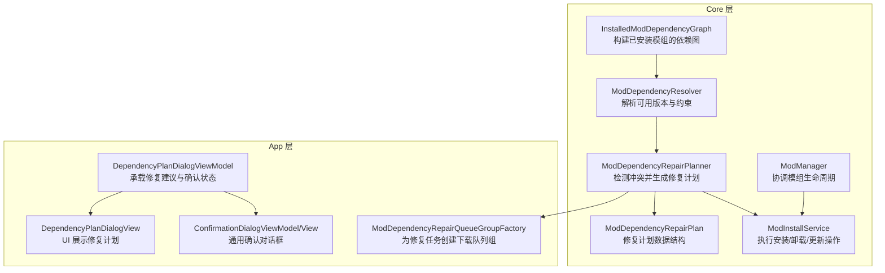
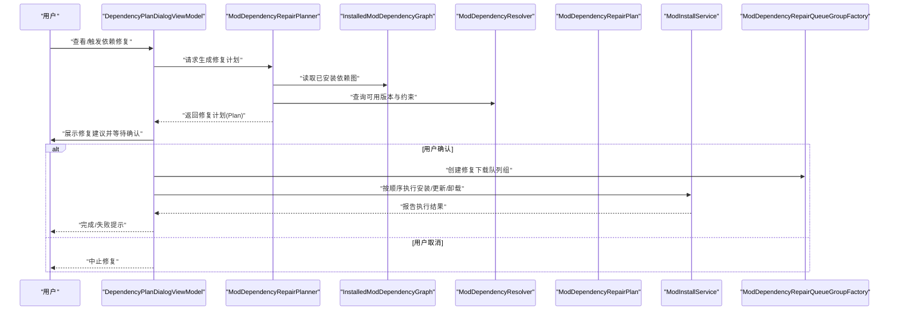
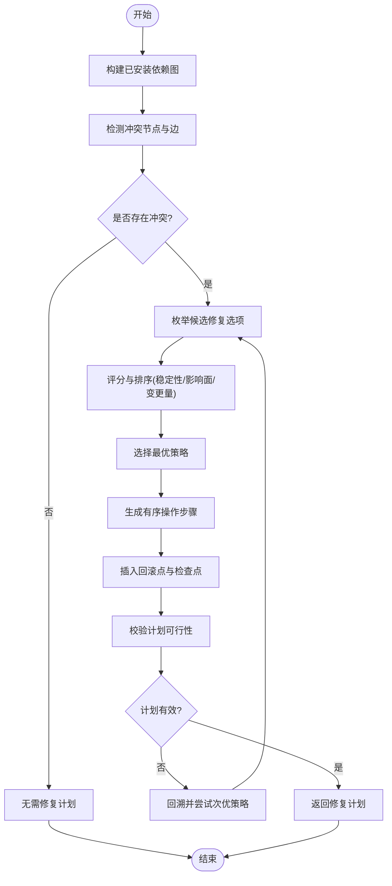
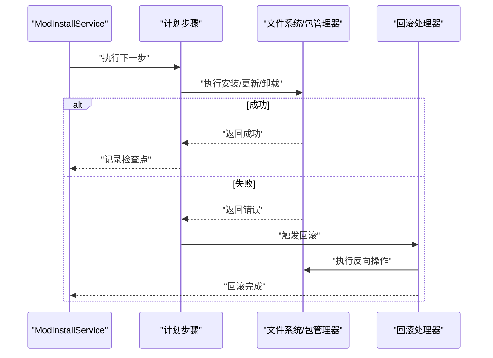
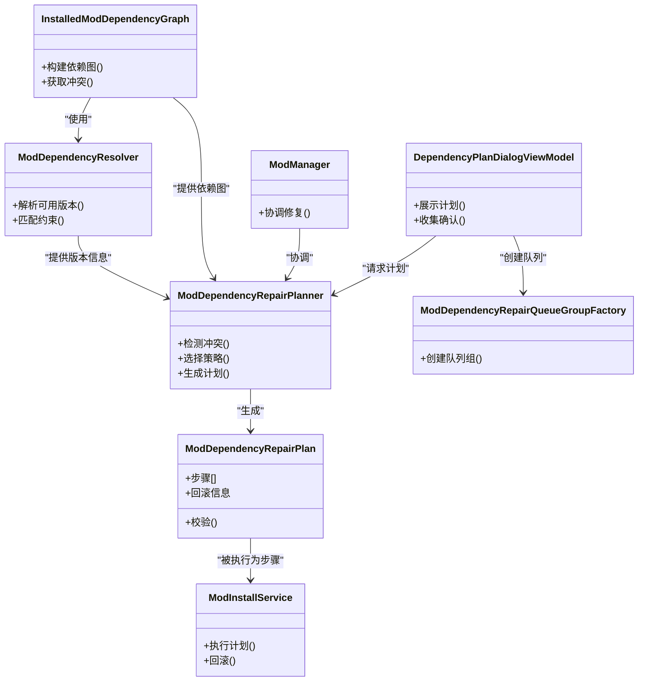

# 依赖修复机制

<cite>
**本文引用的文件**   
- [ModDependencyRepairPlanner.cs](file://src/Crystalfly.Core/Mods/ModDependencyRepairPlanner.cs)
- [ModDependencyRepairPlan.cs](file://src/Crystalfly.Core/Mods/ModDependencyRepairPlan.cs)
- [InstalledModDependencyGraph.cs](file://src/Crystalfly.Core/Mods/InstalledModDependencyGraph.cs)
- [ModDependencyResolver.cs](file://src/Crystalfly.Core/Mods/ModDependencyResolver.cs)
- [ModInstallService.cs](file://src/Crystalfly.Core/Mods/ModInstallService.cs)
- [ModManager.cs](file://src/Crystalfly.Core/Mods/ModManager.cs)
- [DependencyPlanDialogViewModel.cs](file://src/Crystalfly.App/ViewModels/Dialogs/DependencyPlanDialogViewModel.cs)
- [DependencyPlanDialogView.axaml](file://src/Crystalfly.App/Views/Dialogs/DependencyPlanDialogView.axaml)
- [DependencyPlanDialogView.axaml.cs](file://src/Crystalfly.App/Views/Dialogs/DependencyPlanDialogView.axaml.cs)
- [ConfirmationDialogViewModel.cs](file://src/Crystalfly.App/ViewModels/Dialogs/ConfirmationDialogViewModel.cs)
- [ConfirmationDialogView.axaml](file://src/Crystalfly.App/Views/Dialogs/ConfirmationDialogView.axaml)
- [ConfirmationDialogView.axaml.cs](file://src/Crystalfly.App/Views/Dialogs/ConfirmationDialogView.axaml.cs)
- [ModDependencyRepairQueueGroupFactory.cs](file://src/Crystalfly.App/Downloads/ModDependencyRepairQueueGroupFactory.cs)
- [ModDependencyRepairQueueGroupFactoryTests.cs](file://tests/Crystalfly.App.Tests/Downloads/ModDependencyRepairQueueGroupFactoryTests.cs)
- [ModDependencyRepairPlannerTests.cs](file://tests/Crystalfly.Core.Tests/Mods/ModDependencyRepairPlannerTests.cs)
</cite>

## 目录
1. [简介](#简介)
2. [项目结构](#项目结构)
3. [核心组件](#核心组件)
4. [架构总览](#架构总览)
5. [详细组件分析](#详细组件分析)
6. [依赖关系分析](#依赖关系分析)
7. [性能考虑](#性能考虑)
8. [故障排查指南](#故障排查指南)
9. [结论](#结论)
10. [附录](#附录)

## 简介
本文件围绕“依赖修复机制”展开，重点解析 ModDependencyRepairPlanner 的修复规划算法与执行流程。内容涵盖：
- 问题检测：如何识别已安装模组间的依赖冲突、缺失或版本不兼容
- 修复策略选择：自动升级、降级、替换等策略的适用条件与优先级
- 修复计划生成：将策略转化为可执行的步骤序列（含顺序、回滚点）
- 执行流程与回滚：在 UI 确认下安全执行，失败时尽可能回滚
- 用户交互与安全：通过对话框展示建议并等待用户确认
- 常见问题的自动修复案例与手动修复指南

## 项目结构
依赖修复相关代码分布在 Core 层与 App 层：
- Core 层负责依赖图构建、冲突检测、修复策略计算与计划生成
- App 层负责与用户交互（展示修复建议、确认）、队列编排与下载执行

图表来源
- [InstalledModDependencyGraph.cs](file://src/Crystalfly.Core/Mods/InstalledModDependencyGraph.cs)
- [ModDependencyResolver.cs](file://src/Crystalfly.Core/Mods/ModDependencyResolver.cs)
- [ModDependencyRepairPlanner.cs](file://src/Crystalfly.Core/Mods/ModDependencyRepairPlanner.cs)
- [ModDependencyRepairPlan.cs](file://src/Crystalfly.Core/Mods/ModDependencyRepairPlan.cs)
- [ModInstallService.cs](file://src/Crystalfly.Core/Mods/ModInstallService.cs)
- [ModManager.cs](file://src/Crystalfly.Core/Mods/ModManager.cs)
- [DependencyPlanDialogViewModel.cs](file://src/Crystalfly.App/ViewModels/Dialogs/DependencyPlanDialogViewModel.cs)
- [DependencyPlanDialogView.axaml](file://src/Crystalfly.App/Views/Dialogs/DependencyPlanDialogView.axaml)
- [DependencyPlanDialogView.axaml.cs](file://src/Crystalfly.App/Views/Dialogs/DependencyPlanDialogView.axaml.cs)
- [ConfirmationDialogViewModel.cs](file://src/Crystalfly.App/ViewModels/Dialogs/ConfirmationDialogViewModel.cs)
- [ConfirmationDialogView.axaml](file://src/Crystalfly.App/Views/Dialogs/ConfirmationDialogView.axaml)
- [ConfirmationDialogView.axaml.cs](file://src/Crystalfly.App/Views/Dialogs/ConfirmationDialogView.axaml.cs)
- [ModDependencyRepairQueueGroupFactory.cs](file://src/Crystalfly.App/Downloads/ModDependencyRepairQueueGroupFactory.cs)

章节来源
- [ModDependencyRepairPlanner.cs](file://src/Crystalfly.Core/Mods/ModDependencyRepairPlanner.cs)
- [ModDependencyRepairPlan.cs](file://src/Crystalfly.Core/Mods/ModDependencyRepairPlan.cs)
- [InstalledModDependencyGraph.cs](file://src/Crystalfly.Core/Mods/InstalledModDependencyGraph.cs)
- [ModDependencyResolver.cs](file://src/Crystalfly.Core/Mods/ModDependencyResolver.cs)
- [ModInstallService.cs](file://src/Crystalfly.Core/Mods/ModInstallService.cs)
- [ModManager.cs](file://src/Crystalfly.Core/Mods/ModManager.cs)
- [DependencyPlanDialogViewModel.cs](file://src/Crystalfly.App/ViewModels/Dialogs/DependencyPlanDialogViewModel.cs)
- [DependencyPlanDialogView.axaml](file://src/Crystalfly.App/Views/Dialogs/DependencyPlanDialogView.axaml)
- [DependencyPlanDialogView.axaml.cs](file://src/Crystalfly.App/Views/Dialogs/DependencyPlanDialogView.axaml.cs)
- [ConfirmationDialogViewModel.cs](file://src/Crystalfly.App/ViewModels/Dialogs/ConfirmationDialogViewModel.cs)
- [ConfirmationDialogView.axaml](file://src/Crystalfly.App/Views/Dialogs/ConfirmationDialogView.axaml)
- [ConfirmationDialogView.axaml.cs](file://src/Crystalfly.App/Views/Dialogs/ConfirmationDialogView.axaml.cs)
- [ModDependencyRepairQueueGroupFactory.cs](file://src/Crystalfly.App/Downloads/ModDependencyRepairQueueGroupFactory.cs)

## 核心组件
- InstalledModDependencyGraph：基于当前实例中已安装的模组，构建有向依赖图，用于定位冲突节点与传播路径
- ModDependencyResolver：根据仓库目录与元数据，解析每个模组的可用版本集合及版本约束
- ModDependencyRepairPlanner：核心规划器，检测冲突、评估候选方案、生成最小变更的修复计划
- ModDependencyRepairPlan：描述修复计划的不可变数据结构，包含待安装/更新/卸载的条目及其顺序与回滚信息
- ModInstallService：提供原子化的安装、卸载、更新能力，支持事务与回滚
- ModManager：高层编排，协调依赖修复与常规安装流程
- DependencyPlanDialogViewModel/View：将修复计划呈现给用户，收集确认意图
- ConfirmationDialogViewModel/View：通用确认对话框，用于关键操作的二次确认
- ModDependencyRepairQueueGroupFactory：为修复任务创建下载队列组，组织并行下载与进度聚合

章节来源
- [InstalledModDependencyGraph.cs](file://src/Crystalfly.Core/Mods/InstalledModDependencyGraph.cs)
- [ModDependencyResolver.cs](file://src/Crystalfly.Core/Mods/ModDependencyResolver.cs)
- [ModDependencyRepairPlanner.cs](file://src/Crystalfly.Core/Mods/ModDependencyRepairPlanner.cs)
- [ModDependencyRepairPlan.cs](file://src/Crystalfly.Core/Mods/ModDependencyRepairPlan.cs)
- [ModInstallService.cs](file://src/Crystalfly.Core/Mods/ModInstallService.cs)
- [ModManager.cs](file://src/Crystalfly.Core/Mods/ModManager.cs)
- [DependencyPlanDialogViewModel.cs](file://src/Crystalfly.App/ViewModels/Dialogs/DependencyPlanDialogViewModel.cs)
- [DependencyPlanDialogView.axaml](file://src/Crystalfly.App/Views/Dialogs/DependencyPlanDialogView.axaml)
- [DependencyPlanDialogView.axaml.cs](file://src/Crystalfly.App/Views/Dialogs/DependencyPlanDialogView.axaml.cs)
- [ConfirmationDialogViewModel.cs](file://src/Crystalfly.App/ViewModels/Dialogs/ConfirmationDialogViewModel.cs)
- [ConfirmationDialogView.axaml](file://src/Crystalfly.App/Views/Dialogs/ConfirmationDialogView.axaml)
- [ConfirmationDialogView.axaml.cs](file://src/Crystalfly.App/Views/Dialogs/ConfirmationDialogView.axaml.cs)
- [ModDependencyRepairQueueGroupFactory.cs](file://src/Crystalfly.App/Downloads/ModDependencyRepairQueueGroupFactory.cs)

## 架构总览
依赖修复的整体流程从“检测冲突”到“生成计划”，再到“用户确认与执行”。下图展示了核心调用链与数据流向。

图表来源
- [DependencyPlanDialogViewModel.cs](file://src/Crystalfly.App/ViewModels/Dialogs/DependencyPlanDialogViewModel.cs)
- [ModDependencyRepairPlanner.cs](file://src/Crystalfly.Core/Mods/ModDependencyRepairPlanner.cs)
- [InstalledModDependencyGraph.cs](file://src/Crystalfly.Core/Mods/InstalledModDependencyGraph.cs)
- [ModDependencyResolver.cs](file://src/Crystalfly.Core/Mods/ModDependencyResolver.cs)
- [ModDependencyRepairPlan.cs](file://src/Crystalfly.Core/Mods/ModDependencyRepairPlan.cs)
- [ModInstallService.cs](file://src/Crystalfly.Core/Mods/ModInstallService.cs)
- [ModDependencyRepairQueueGroupFactory.cs](file://src/Crystalfly.App/Downloads/ModDependencyRepairQueueGroupFactory.cs)

## 详细组件分析

### ModDependencyRepairPlanner：修复规划算法
该组件是依赖修复的核心，承担以下职责：
- 问题检测：遍历依赖图，识别冲突类型（版本不兼容、循环依赖、缺失依赖等）
- 策略选择：对每个冲突，评估多种修复策略（升级、降级、替换），结合稳定性与影响范围择优
- 计划生成：将策略转换为有序步骤，标注前置/后置依赖，插入回滚点，保证可逆性

图表来源
- [ModDependencyRepairPlanner.cs](file://src/Crystalfly.Core/Mods/ModDependencyRepairPlanner.cs)
- [InstalledModDependencyGraph.cs](file://src/Crystalfly.Core/Mods/InstalledModDependencyGraph.cs)
- [ModDependencyResolver.cs](file://src/Crystalfly.Core/Mods/ModDependencyResolver.cs)
- [ModDependencyRepairPlan.cs](file://src/Crystalfly.Core/Mods/ModDependencyRepairPlan.cs)

章节来源
- [ModDependencyRepairPlanner.cs](file://src/Crystalfly.Core/Mods/ModDependencyRepairPlanner.cs)
- [InstalledModDependencyGraph.cs](file://src/Crystalfly.Core/Mods/InstalledModDependencyGraph.cs)
- [ModDependencyResolver.cs](file://src/Crystalfly.Core/Mods/ModDependencyResolver.cs)
- [ModDependencyRepairPlan.cs](file://src/Crystalfly.Core/Mods/ModDependencyRepairPlan.cs)

### ModDependencyRepairPlan：修复计划数据结构
修复计划以不可变对象表达，包含：
- 步骤列表：安装、更新、卸载等操作项
- 依赖顺序：确保先满足前置依赖再执行后续操作
- 回滚信息：每个步骤对应的反向操作与检查点
- 摘要信息：受影响模组集合、风险等级、预计变更量

章节来源
- [ModDependencyRepairPlan.cs](file://src/Crystalfly.Core/Mods/ModDependencyRepairPlan.cs)

### 依赖冲突识别方法
- 版本不兼容：当某模组声明的依赖版本不在目标模组的可用版本范围内
- 循环依赖：依赖图中存在环，导致无法确定加载顺序
- 缺失依赖：被依赖模组未安装或不可用
- 多提供者冲突：同一依赖存在多个候选模组，需选择其一

识别过程由依赖图与解析器协作完成，冲突会被标记并附带上下文信息，便于规划器进行策略评估。

章节来源
- [InstalledModDependencyGraph.cs](file://src/Crystalfly.Core/Mods/InstalledModDependencyGraph.cs)
- [ModDependencyResolver.cs](file://src/Crystalfly.Core/Mods/ModDependencyResolver.cs)

### 自动修复策略
- 版本升级：将依赖升级到满足约束的最新稳定版本
- 版本降级：将依赖降级到与现有环境兼容的版本
- 替换：使用功能等价的其他模组替代当前实现
- 补充安装：为缺失依赖安装对应模组
- 解除冲突：移除引发冲突的模组或调整其依赖

策略选择会综合考虑：
- 稳定性（优先选择稳定版）
- 影响面（尽量减小对其他模组的影响）
- 变更量（优先最小化变更）
- 安全性（避免引入已知风险）

章节来源
- [ModDependencyRepairPlanner.cs](file://src/Crystalfly.Core/Mods/ModDependencyRepairPlanner.cs)
- [ModDependencyResolver.cs](file://src/Crystalfly.Core/Mods/ModDependencyResolver.cs)

### 修复计划执行流程与回滚机制
- 执行入口：由上层服务（如 ModInstallService）按步骤顺序执行
- 原子性：每步操作具备事务语义，失败时触发回滚
- 回滚顺序：按逆向顺序执行反向操作，直至恢复到上一个检查点
- 检查点：在执行前保存必要状态，以便快速恢复
- 进度反馈：通过队列组聚合下载与安装进度，实时反馈给 UI

图表来源
- [ModInstallService.cs](file://src/Crystalfly.Core/Mods/ModInstallService.cs)
- [ModDependencyRepairPlan.cs](file://src/Crystalfly.Core/Mods/ModDependencyRepairPlan.cs)

章节来源
- [ModInstallService.cs](file://src/Crystalfly.Core/Mods/ModInstallService.cs)
- [ModDependencyRepairPlan.cs](file://src/Crystalfly.Core/Mods/ModDependencyRepairPlan.cs)

### 用户确认机制与安全保护
- 修复建议展示：通过 DependencyPlanDialogViewModel 与 View 渲染修复计划详情
- 二次确认：使用 ConfirmationDialog 对用户进行风险提示与最终确认
- 权限与隔离：在可能的情况下限制写入范围，避免误改系统文件
- 日志与审计：记录修复决策与执行轨迹，便于事后追溯

章节来源
- [DependencyPlanDialogViewModel.cs](file://src/Crystalfly.App/ViewModels/Dialogs/DependencyPlanDialogViewModel.cs)
- [DependencyPlanDialogView.axaml](file://src/Crystalfly.App/Views/Dialogs/DependencyPlanDialogView.axaml)
- [DependencyPlanDialogView.axaml.cs](file://src/Crystalfly.App/Views/Dialogs/DependencyPlanDialogView.axaml.cs)
- [ConfirmationDialogViewModel.cs](file://src/Crystalfly.App/ViewModels/Dialogs/ConfirmationDialogViewModel.cs)
- [ConfirmationDialogView.axaml](file://src/Crystalfly.App/Views/Dialogs/ConfirmationDialogView.axaml)
- [ConfirmationDialogView.axaml.cs](file://src/Crystalfly.App/Views/Dialogs/ConfirmationDialogView.axaml.cs)

### 触发修复、查看建议与执行修复的代码示例路径
- 触发修复：参考应用层入口与视图模型中对修复流程的调用
  - [DependencyPlanDialogViewModel.cs](file://src/Crystalfly.App/ViewModels/Dialogs/DependencyPlanDialogViewModel.cs)
  - [DependencyPlanDialogView.axaml.cs](file://src/Crystalfly.App/Views/Dialogs/DependencyPlanDialogView.axaml.cs)
- 查看修复建议：查看 ViewModel 与 View 的数据绑定与展示逻辑
  - [DependencyPlanDialogViewModel.cs](file://src/Crystalfly.App/ViewModels/Dialogs/DependencyPlanDialogViewModel.cs)
  - [DependencyPlanDialogView.axaml](file://src/Crystalfly.App/Views/Dialogs/DependencyPlanDialogView.axaml)
- 执行修复操作：参考队列工厂与服务层的执行编排
  - [ModDependencyRepairQueueGroupFactory.cs](file://src/Crystalfly.App/Downloads/ModDependencyRepairQueueGroupFactory.cs)
  - [ModInstallService.cs](file://src/Crystalfly.Core/Mods/ModInstallService.cs)

章节来源
- [DependencyPlanDialogViewModel.cs](file://src/Crystalfly.App/ViewModels/Dialogs/DependencyPlanDialogViewModel.cs)
- [DependencyPlanDialogView.axaml](file://src/Crystalfly.App/Views/Dialogs/DependencyPlanDialogView.axaml)
- [DependencyPlanDialogView.axaml.cs](file://src/Crystalfly.App/Views/Dialogs/DependencyPlanDialogView.axaml.cs)
- [ModDependencyRepairQueueGroupFactory.cs](file://src/Crystalfly.App/Downloads/ModDependencyRepairQueueGroupFactory.cs)
- [ModInstallService.cs](file://src/Crystalfly.Core/Mods/ModInstallService.cs)

### 常见依赖问题的自动修复案例
- 版本不兼容：自动将依赖升级到满足约束的最新稳定版本
- 循环依赖：通过移除或替换某个环节打破环路，重新排序执行
- 缺失依赖：自动安装缺失模组，并验证其依赖是否满足
- 多提供者冲突：依据评分策略选择最合适的替代模组

章节来源
- [ModDependencyRepairPlanner.cs](file://src/Crystalfly.Core/Mods/ModDependencyRepairPlanner.cs)
- [ModDependencyResolver.cs](file://src/Crystalfly.Core/Mods/ModDependencyResolver.cs)

### 手动修复指南
- 若自动修复失败或不符合预期，可：
  - 查看修复计划中的受影响模组与变更详情
  - 手动调整依赖版本或禁用冲突模组
  - 重新运行修复流程，观察新的计划与建议
- 建议在测试环境中先行验证，再应用到生产实例

章节来源
- [DependencyPlanDialogViewModel.cs](file://src/Crystalfly.App/ViewModels/Dialogs/DependencyPlanDialogViewModel.cs)
- [DependencyPlanDialogView.axaml](file://src/Crystalfly.App/Views/Dialogs/DependencyPlanDialogView.axaml)

## 依赖关系分析
核心组件之间的依赖关系如下：

图表来源
- [InstalledModDependencyGraph.cs](file://src/Crystalfly.Core/Mods/InstalledModDependencyGraph.cs)
- [ModDependencyResolver.cs](file://src/Crystalfly.Core/Mods/ModDependencyResolver.cs)
- [ModDependencyRepairPlanner.cs](file://src/Crystalfly.Core/Mods/ModDependencyRepairPlanner.cs)
- [ModDependencyRepairPlan.cs](file://src/Crystalfly.Core/Mods/ModDependencyRepairPlan.cs)
- [ModInstallService.cs](file://src/Crystalfly.Core/Mods/ModInstallService.cs)
- [ModManager.cs](file://src/Crystalfly.Core/Mods/ModManager.cs)
- [DependencyPlanDialogViewModel.cs](file://src/Crystalfly.App/ViewModels/Dialogs/DependencyPlanDialogViewModel.cs)
- [ModDependencyRepairQueueGroupFactory.cs](file://src/Crystalfly.App/Downloads/ModDependencyRepairQueueGroupFactory.cs)

章节来源
- [InstalledModDependencyGraph.cs](file://src/Crystalfly.Core/Mods/InstalledModDependencyGraph.cs)
- [ModDependencyResolver.cs](file://src/Crystalfly.Core/Mods/ModDependencyResolver.cs)
- [ModDependencyRepairPlanner.cs](file://src/Crystalfly.Core/Mods/ModDependencyRepairPlanner.cs)
- [ModDependencyRepairPlan.cs](file://src/Crystalfly.Core/Mods/ModDependencyRepairPlan.cs)
- [ModInstallService.cs](file://src/Crystalfly.Core/Mods/ModInstallService.cs)
- [ModManager.cs](file://src/Crystalfly.Core/Mods/ModManager.cs)
- [DependencyPlanDialogViewModel.cs](file://src/Crystalfly.App/ViewModels/Dialogs/DependencyPlanDialogViewModel.cs)
- [ModDependencyRepairQueueGroupFactory.cs](file://src/Crystalfly.App/Downloads/ModDependencyRepairQueueGroupFactory.cs)

## 性能考虑
- 依赖图构建与冲突检测应尽量缓存中间结果，减少重复计算
- 版本解析可采用惰性加载与增量更新，降低网络与磁盘 IO
- 修复计划生成时，优先选择影响面小的策略，减少后续执行时间
- 下载与安装阶段采用队列组并行处理，提升整体吞吐
- 回滚操作应最小化文件写入次数，必要时合并写操作

[本节为通用指导，不涉及具体文件分析]

## 故障排查指南
- 常见问题
  - 修复计划为空：检查依赖图是否正确构建，确认冲突检测逻辑是否生效
  - 执行失败：查看回滚日志，确认回滚点是否设置正确
  - 用户未确认：确认对话框是否显示并等待用户输入
- 调试建议
  - 启用更详细的日志输出，记录每一步的执行与回滚情况
  - 在测试环境中复现问题，逐步缩小范围
  - 检查网络与仓库可用性，确保版本解析正常

章节来源
- [ModDependencyRepairPlannerTests.cs](file://tests/Crystalfly.Core.Tests/Mods/ModDependencyRepairPlannerTests.cs)
- [ModDependencyRepairQueueGroupFactoryTests.cs](file://tests/Crystalfly.App.Tests/Downloads/ModDependencyRepairQueueGroupFactoryTests.cs)

## 结论
依赖修复机制通过“检测—评估—计划—确认—执行—回滚”的闭环流程，在保证安全性的前提下，自动化解决模组依赖冲突。核心在于：
- 精确的冲突识别与策略评估
- 可逆且可审计的计划执行
- 友好的用户交互与风险提示
- 完善的测试覆盖与故障排查工具

[本节为总结性内容，不涉及具体文件分析]

## 附录
- 术语说明
  - 依赖图：表示模组间依赖关系的有向图
  - 冲突：依赖无法满足或相互矛盾的状态
  - 修复计划：一组有序的操作步骤，包含回滚信息
  - 回滚：在执行失败时将系统恢复到上一检查点的操作

[本节为概念性说明，不涉及具体文件分析]