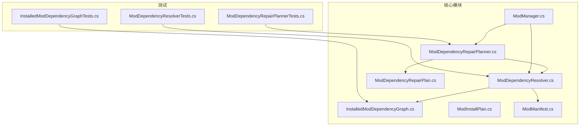
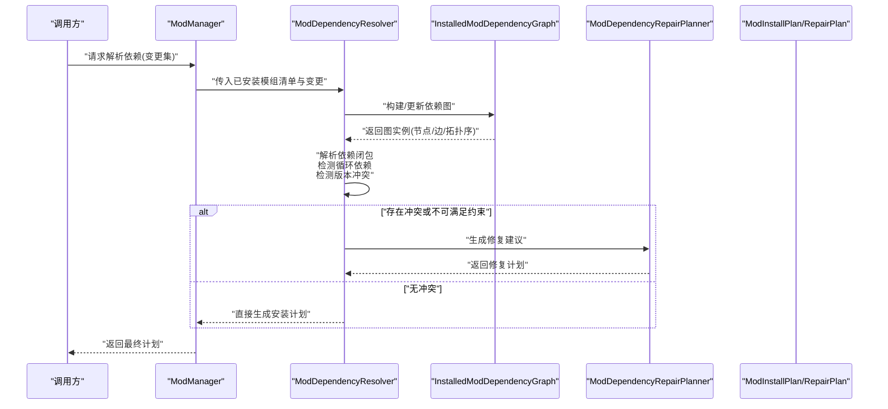
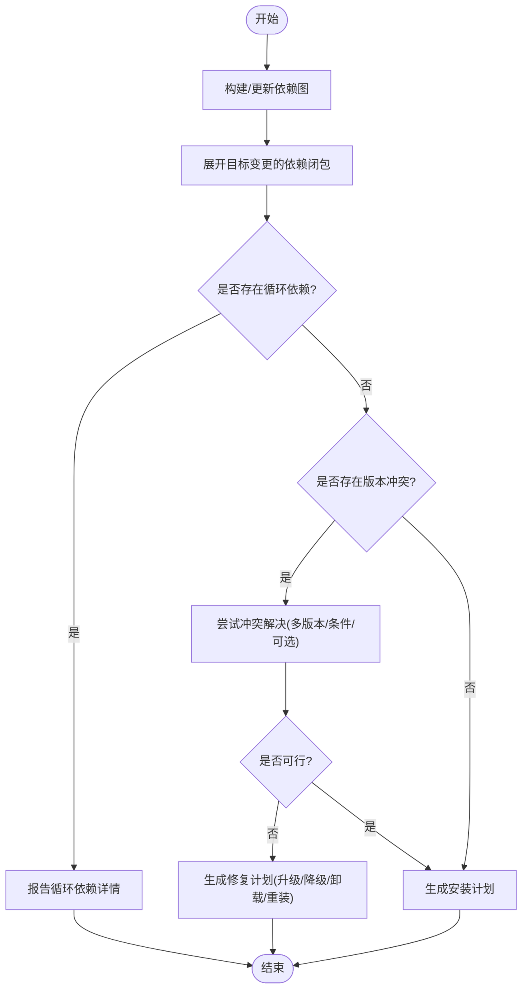
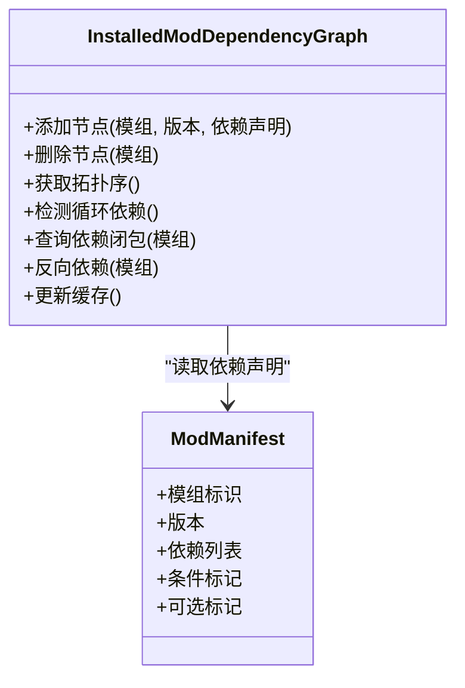
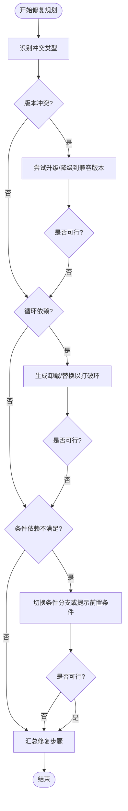
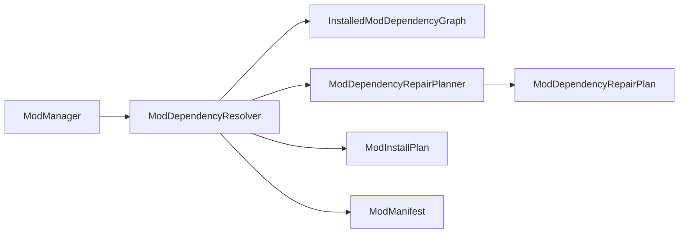

# 依赖解析系统

<cite>
**本文引用的文件**   
- [ModDependencyResolver.cs](file://src/Crystalfly.Core/Mods/ModDependencyResolver.cs)
- [InstalledModDependencyGraph.cs](file://src/Crystalfly.Core/Mods/InstalledModDependencyGraph.cs)
- [ModDependencyRepairPlanner.cs](file://src/Crystalfly.Core/Mods/ModDependencyRepairPlanner.cs)
- [ModDependencyRepairPlan.cs](file://src/Crystalfly.Core/Mods/ModDependencyRepairPlan.cs)
- [ModInstallPlan.cs](file://src/Crystalfly.Core/Mods/ModInstallPlan.cs)
- [ModManager.cs](file://src/Crystalfly.Core/Mods/ModManager.cs)
- [ModManifest.cs](file://src/Crystalfly.Core/Models/ModManifest.cs)
- [InstalledModDependencyGraphTests.cs](file://tests/Crystalfly.Core.Tests/Mods/InstalledModDependencyGraphTests.cs)
- [ModDependencyResolverTests.cs](file://tests/Crystalfly.Core.Tests/Mods/ModDependencyResolverTests.cs)
- [ModDependencyRepairPlannerTests.cs](file://tests/Crystalfly.Core.Tests/Mods/ModDependencyRepairPlannerTests.cs)
</cite>

## 目录
1. [简介](#简介)
2. [项目结构](#项目结构)
3. [核心组件](#核心组件)
4. [架构总览](#架构总览)
5. [详细组件分析](#详细组件分析)
6. [依赖关系分析](#依赖关系分析)
7. [性能考虑](#性能考虑)
8. [故障排查指南](#故障排查指南)
9. [结论](#结论)
10. [附录](#附录)

## 简介
本文件面向依赖解析子系统，聚焦以下目标：
- 深入解释 ModDependencyResolver 的依赖解析算法实现，包括依赖图构建、循环依赖检测与冲突解决策略。
- 详细说明 InstalledModDependencyGraph 的数据结构与遍历算法。
- 记录依赖解析的核心方法：解析模组依赖、检测版本冲突、生成兼容方案等。
- 提供复杂依赖场景的处理示例（多版本共存、条件依赖、可选依赖）。
- 解释依赖优先级规则与冲突自动修复机制。
- 给出依赖问题的诊断方法与调试技巧。

## 项目结构
依赖解析相关代码位于 Crystalfly.Core/Mods 目录，配合 Models 中的 ModManifest 定义模组元数据，测试用例位于 Crystalfly.Core.Tests/Mods。

图表来源
- [ModDependencyResolver.cs](file://src/Crystalfly.Core/Mods/ModDependencyResolver.cs)
- [InstalledModDependencyGraph.cs](file://src/Crystalfly.Core/Mods/InstalledModDependencyGraph.cs)
- [ModDependencyRepairPlanner.cs](file://src/Crystalfly.Core/Mods/ModDependencyRepairPlanner.cs)
- [ModDependencyRepairPlan.cs](file://src/Crystalfly.Core/Mods/ModDependencyRepairPlan.cs)
- [ModInstallPlan.cs](file://src/Crystalfly.Core/Mods/ModInstallPlan.cs)
- [ModManager.cs](file://src/Crystalfly.Core/Mods/ModManager.cs)
- [ModManifest.cs](file://src/Crystalfly.Core/Models/ModManifest.cs)
- [InstalledModDependencyGraphTests.cs](file://tests/Crystalfly.Core.Tests/Mods/InstalledModDependencyGraphTests.cs)
- [ModDependencyResolverTests.cs](file://tests/Crystalfly.Core.Tests/Mods/ModDependencyResolverTests.cs)
- [ModDependencyRepairPlannerTests.cs](file://tests/Crystalfly.Core.Tests/Mods/ModDependencyRepairPlannerTests.cs)

章节来源
- [ModDependencyResolver.cs](file://src/Crystalfly.Core/Mods/ModDependencyResolver.cs)
- [InstalledModDependencyGraph.cs](file://src/Crystalfly.Core/Mods/InstalledModDependencyGraph.cs)
- [ModDependencyRepairPlanner.cs](file://src/Crystalfly.Core/Mods/ModDependencyRepairPlanner.cs)
- [ModDependencyRepairPlan.cs](file://src/Crystalfly.Core/Mods/ModDependencyRepairPlan.cs)
- [ModInstallPlan.cs](file://src/Crystalfly.Core/Mods/ModInstallPlan.cs)
- [ModManager.cs](file://src/Crystalfly.Core/Mods/ModManager.cs)
- [ModManifest.cs](file://src/Crystalfly.Core/Models/ModManifest.cs)
- [InstalledModDependencyGraphTests.cs](file://tests/Crystalfly.Core.Tests/Mods/InstalledModDependencyGraphTests.cs)
- [ModDependencyResolverTests.cs](file://tests/Crystalfly.Core.Tests/Mods/ModDependencyResolverTests.cs)
- [ModDependencyRepairPlannerTests.cs](file://tests/Crystalfly.Core.Tests/Mods/ModDependencyRepairPlannerTests.cs)

## 核心组件
- ModDependencyResolver：负责从已安装模组集合中构建依赖图、解析依赖、检测循环依赖与版本冲突，并输出可执行的安装/卸载计划或修复计划。
- InstalledModDependencyGraph：以数据结构形式维护“已安装模组”的依赖关系，支持拓扑排序、连通性查询、环检测等遍历操作。
- ModDependencyRepairPlanner / ModDependencyRepairPlan：在检测到不满足约束时，生成最小化修复动作序列（如升级、降级、卸载、重新安装），并封装为修复计划。
- ModInstallPlan：描述一次安装操作的变更集（新增、替换、回滚点等），供上层执行器使用。
- ModManager：协调模组生命周期与依赖解析流程，作为外部调用入口。
- ModManifest：模组清单模型，包含依赖声明、版本范围、条件与可选标记等元信息。

章节来源
- [ModDependencyResolver.cs](file://src/Crystalfly.Core/Mods/ModDependencyResolver.cs)
- [InstalledModDependencyGraph.cs](file://src/Crystalfly.Core/Mods/InstalledModDependencyGraph.cs)
- [ModDependencyRepairPlanner.cs](file://src/Crystalfly.Core/Mods/ModDependencyRepairPlanner.cs)
- [ModDependencyRepairPlan.cs](file://src/Crystalfly.Core/Mods/ModDependencyRepairPlan.cs)
- [ModInstallPlan.cs](file://src/Crystalfly.Core/Mods/ModInstallPlan.cs)
- [ModManager.cs](file://src/Crystalfly.Core/Mods/ModManager.cs)
- [ModManifest.cs](file://src/Crystalfly.Core/Models/ModManifest.cs)

## 架构总览
依赖解析的整体流程如下：
- 输入：当前已安装模组集合（含其清单）与目标变更（安装/卸载/升级）。
- 构建：基于已安装模组清单构建 InstalledModDependencyGraph。
- 解析：对目标变更进行依赖闭包计算，识别缺失依赖、版本冲突与循环依赖。
- 决策：根据优先级与兼容性策略选择最优解（多版本共存、条件分支、可选依赖）。
- 输出：生成 ModInstallPlan 或 ModDependencyRepairPlan，供执行层应用。

图表来源
- [ModDependencyResolver.cs](file://src/Crystalfly.Core/Mods/ModDependencyResolver.cs)
- [InstalledModDependencyGraph.cs](file://src/Crystalfly.Core/Mods/InstalledModDependencyGraph.cs)
- [ModDependencyRepairPlanner.cs](file://src/Crystalfly.Core/Mods/ModDependencyRepairPlanner.cs)
- [ModDependencyRepairPlan.cs](file://src/Crystalfly.Core/Mods/ModDependencyRepairPlan.cs)
- [ModInstallPlan.cs](file://src/Crystalfly.Core/Mods/ModInstallPlan.cs)
- [ModManager.cs](file://src/Crystalfly.Core/Mods/ModManager.cs)

## 详细组件分析

### ModDependencyResolver：依赖解析算法
职责与能力
- 依赖图构建：将已安装模组及其清单转换为图节点与有向边，表示“谁依赖谁”。
- 依赖闭包计算：针对目标变更，递归展开所需依赖，形成完整变更集。
- 循环依赖检测：在构建/更新过程中检测强连通分量或回溯栈，定位环。
- 版本冲突检测：比较同一依赖项在不同路径上的版本范围交集是否为空。
- 冲突解决策略：
  - 多版本共存：若依赖项允许不同版本并行存在，则按版本隔离策略选择合适版本。
  - 条件依赖：依据运行环境或平台条件选择分支。
  - 可选依赖：当必需依赖不可用时，忽略可选依赖并继续解析。
- 输出：生成 ModInstallPlan 或委托给 ModDependencyRepairPlanner 生成修复计划。

关键流程（伪流程图）

图表来源
- [ModDependencyResolver.cs](file://src/Crystalfly.Core/Mods/ModDependencyResolver.cs)
- [InstalledModDependencyGraph.cs](file://src/Crystalfly.Core/Mods/InstalledModDependencyGraph.cs)
- [ModDependencyRepairPlanner.cs](file://src/Crystalfly.Core/Mods/ModDependencyRepairPlanner.cs)
- [ModDependencyRepairPlan.cs](file://src/Crystalfly.Core/Mods/ModDependencyRepairPlan.cs)
- [ModInstallPlan.cs](file://src/Crystalfly.Core/Mods/ModInstallPlan.cs)

章节来源
- [ModDependencyResolver.cs](file://src/Crystalfly.Core/Mods/ModDependencyResolver.cs)
- [InstalledModDependencyGraph.cs](file://src/Crystalfly.Core/Mods/InstalledModDependencyGraph.cs)
- [ModDependencyRepairPlanner.cs](file://src/Crystalfly.Core/Mods/ModDependencyRepairPlanner.cs)
- [ModDependencyRepairPlan.cs](file://src/Crystalfly.Core/Mods/ModDependencyRepairPlan.cs)
- [ModInstallPlan.cs](file://src/Crystalfly.Core/Mods/ModInstallPlan.cs)

### InstalledModDependencyGraph：数据结构与遍历算法
数据结构要点
- 节点：每个已安装模组为一个节点，携带标识、版本、依赖声明等元信息。
- 边：有向边表示“源模组依赖目标模组”，并附带版本约束与条件标记。
- 索引：提供按模组标识的快速查找、按依赖反向索引（被谁依赖）等辅助结构。
- 状态：维护拓扑序缓存、环检测结果缓存，避免重复计算。

遍历算法要点
- 拓扑排序：用于确定安装/卸载顺序，保证依赖先于消费者。
- 深度优先搜索（DFS）：用于依赖闭包展开与环检测。
- 连通性查询：判断某模组是否可达，或两个模组之间是否存在依赖路径。
- 增量更新：在新增/移除模组后，局部重算受影响子图的拓扑序与环状态。

图表来源
- [InstalledModDependencyGraph.cs](file://src/Crystalfly.Core/Mods/InstalledModDependencyGraph.cs)
- [ModManifest.cs](file://src/Crystalfly.Core/Models/ModManifest.cs)

章节来源
- [InstalledModDependencyGraph.cs](file://src/Crystalfly.Core/Mods/InstalledModDependencyGraph.cs)
- [ModManifest.cs](file://src/Crystalfly.Core/Models/ModManifest.cs)

### ModDependencyRepairPlanner：冲突修复策略
职责
- 在检测到不可满足约束时，评估多种修复动作（升级、降级、卸载、重新安装）的组合。
- 基于代价函数（变更量、稳定性、用户偏好）选择最小修复方案。
- 输出 ModDependencyRepairPlan，包含待执行步骤与回滚策略。

典型修复场景
- 版本冲突：通过选择满足所有版本范围的候选版本，或在无法共存时触发卸载/升级。
- 循环依赖：提示用户调整依赖声明或引入抽象层；必要时生成临时卸载计划打破环。
- 条件依赖不满足：切换到兼容分支或提示用户补充前置条件。

图表来源
- [ModDependencyRepairPlanner.cs](file://src/Crystalfly.Core/Mods/ModDependencyRepairPlanner.cs)
- [ModDependencyRepairPlan.cs](file://src/Crystalfly.Core/Mods/ModDependencyRepairPlan.cs)

章节来源
- [ModDependencyRepairPlanner.cs](file://src/Crystalfly.Core/Mods/ModDependencyRepairPlanner.cs)
- [ModDependencyRepairPlan.cs](file://src/Crystalfly.Core/Mods/ModDependencyRepairPlan.cs)

### ModInstallPlan：安装计划模型
职责
- 描述一次安装/卸载/升级的原子变更集，包含新增、替换、回滚点等。
- 与执行器协作，确保变更的可逆性与一致性。

章节来源
- [ModInstallPlan.cs](file://src/Crystalfly.Core/Mods/ModInstallPlan.cs)

### ModManager：编排与入口
职责
- 对外暴露依赖解析与计划生成的统一接口。
- 协调 ModDependencyResolver 与 ModDependencyRepairPlanner，处理异常与日志。

章节来源
- [ModManager.cs](file://src/Crystalfly.Core/Mods/ModManager.cs)

### ModManifest：模组清单模型
职责
- 定义模组的标识、版本、依赖声明、条件与可选标记。
- 为依赖解析提供结构化输入。

章节来源
- [ModManifest.cs](file://src/Crystalfly.Core/Models/ModManifest.cs)

## 依赖关系分析
- 耦合关系
  - ModDependencyResolver 强依赖 InstalledModDependencyGraph 提供的图结构与遍历能力。
  - ModDependencyRepairPlanner 在冲突场景下被 Resolver 调用，二者通过计划对象交互。
  - ModManager 作为门面，聚合上述组件并提供高层 API。
- 外部依赖
  - ModManifest 作为数据契约，贯穿解析与计划生成过程。
- 潜在循环依赖
  - 组件间通过接口/对象组合而非直接循环引用，降低耦合风险。

图表来源
- [ModDependencyResolver.cs](file://src/Crystalfly.Core/Mods/ModDependencyResolver.cs)
- [InstalledModDependencyGraph.cs](file://src/Crystalfly.Core/Mods/InstalledModDependencyGraph.cs)
- [ModDependencyRepairPlanner.cs](file://src/Crystalfly.Core/Mods/ModDependencyRepairPlanner.cs)
- [ModDependencyRepairPlan.cs](file://src/Crystalfly.Core/Mods/ModDependencyRepairPlan.cs)
- [ModInstallPlan.cs](file://src/Crystalfly.Core/Mods/ModInstallPlan.cs)
- [ModManager.cs](file://src/Crystalfly.Core/Mods/ModManager.cs)
- [ModManifest.cs](file://src/Crystalfly.Core/Models/ModManifest.cs)

章节来源
- [ModDependencyResolver.cs](file://src/Crystalfly.Core/Mods/ModDependencyResolver.cs)
- [InstalledModDependencyGraph.cs](file://src/Crystalfly.Core/Mods/InstalledModDependencyGraph.cs)
- [ModDependencyRepairPlanner.cs](file://src/Crystalfly.Core/Mods/ModDependencyRepairPlanner.cs)
- [ModDependencyRepairPlan.cs](file://src/Crystalfly.Core/Mods/ModDependencyRepairPlan.cs)
- [ModInstallPlan.cs](file://src/Crystalfly.Core/Mods/ModInstallPlan.cs)
- [ModManager.cs](file://src/Crystalfly.Core/Mods/ModManager.cs)
- [ModManifest.cs](file://src/Crystalfly.Core/Models/ModManifest.cs)

## 性能考虑
- 图构建复杂度：O(V+E)，V 为模组数量，E 为依赖边数。
- 拓扑排序与环检测：线性时间 O(V+E)，适合增量更新。
- 冲突检测：对同一依赖的多版本范围求交，需高效区间运算与缓存。
- 缓存策略：对拓扑序、环检测结果、依赖闭包结果进行缓存，减少重复计算。
- 批量操作：合并多次变更后再统一解析，降低开销。

[本节为通用性能指导，无需特定文件来源]

## 故障排查指南
常见问题与定位方法
- 循环依赖
  - 现象：解析失败，提示存在环。
  - 定位：查看 InstalledModDependencyGraph 的环检测结果与受影响节点。
  - 修复：调整依赖声明或引入抽象层；必要时生成临时卸载计划打破环。
- 版本冲突
  - 现象：同一依赖在不同路径上要求互斥版本。
  - 定位：检查 ModManifest 的版本范围与解析器的冲突报告。
  - 修复：升级/降级至兼容版本，或多版本共存策略启用。
- 条件依赖不满足
  - 现象：条件分支不可选，导致依赖缺失。
  - 定位：确认运行环境与条件匹配情况。
  - 修复：补充前置条件或切换到兼容分支。
- 可选依赖缺失
  - 现象：可选依赖未安装，功能降级。
  - 定位：检查可选标记与解析结果。
  - 修复：按需安装可选依赖或接受降级行为。

调试技巧
- 启用详细日志：记录图构建、闭包展开、冲突检测的关键步骤。
- 导出依赖图：可视化展示节点与边，便于人工审查。
- 单元测试覆盖：参考测试用例构造复杂场景，验证边界条件。

章节来源
- [InstalledModDependencyGraphTests.cs](file://tests/Crystalfly.Core.Tests/Mods/InstalledModDependencyGraphTests.cs)
- [ModDependencyResolverTests.cs](file://tests/Crystalfly.Core.Tests/Mods/ModDependencyResolverTests.cs)
- [ModDependencyRepairPlannerTests.cs](file://tests/Crystalfly.Core.Tests/Mods/ModDependencyRepairPlannerTests.cs)

## 结论
依赖解析系统以 InstalledModDependencyGraph 为核心数据结构，结合 ModDependencyResolver 的解析算法与 ModDependencyRepairPlanner 的修复策略，实现了稳健的依赖管理。通过多版本共存、条件依赖与可选依赖的支持，以及优先级与冲突自动修复机制，系统在复杂场景下仍能生成可行的安装/修复计划。配合完善的测试与调试手段，可有效保障模组生态的稳定与可演进性。

[本节为总结性内容，无需特定文件来源]

## 附录

### 复杂依赖场景处理示例（概念性）
- 多版本共存
  - 场景：模组 A 依赖 X v1.x，模组 B 依赖 X v2.x。
  - 处理：若 X 支持多版本并行，则分别加载对应版本；否则提示冲突并尝试升级/降级。
- 条件依赖
  - 场景：模组 C 仅在 Windows 平台需要依赖 Y。
  - 处理：解析时评估平台条件，仅当条件满足时才纳入依赖闭包。
- 可选依赖
  - 场景：模组 D 可选依赖 Z，用于增强功能。
  - 处理：Z 缺失时继续解析，但功能降级；若 Z 可用则启用增强特性。

[本节为概念性说明，无需特定文件来源]