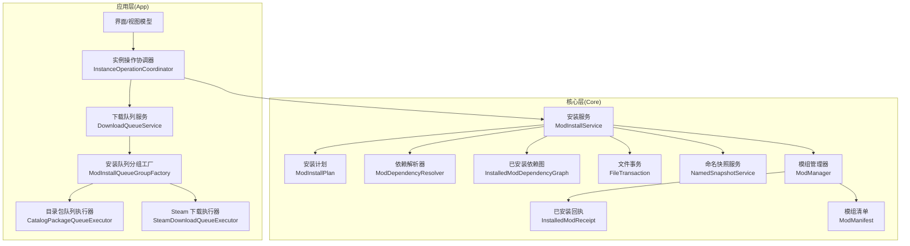
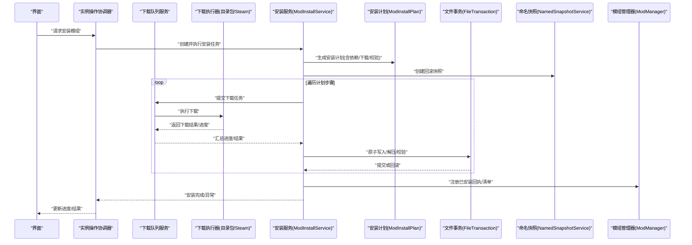
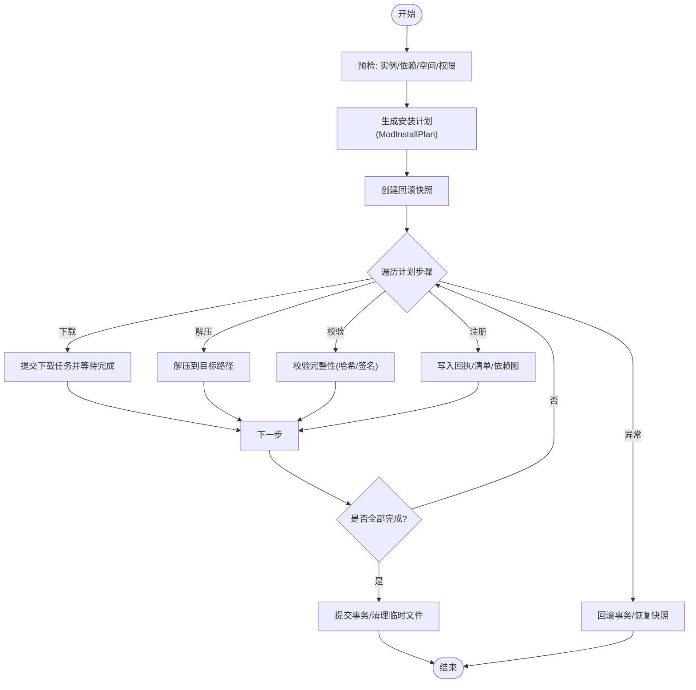
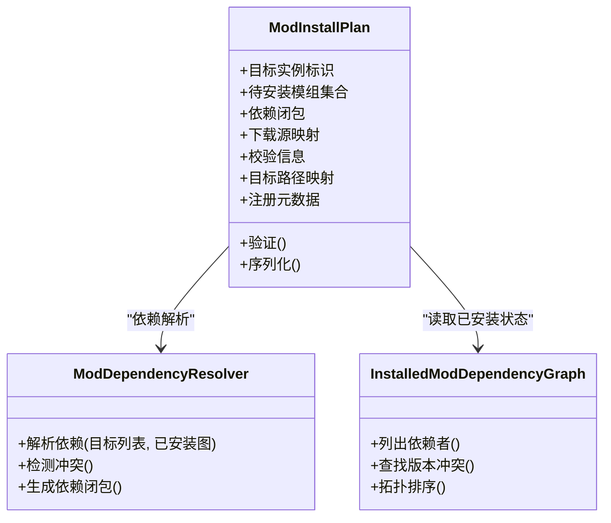
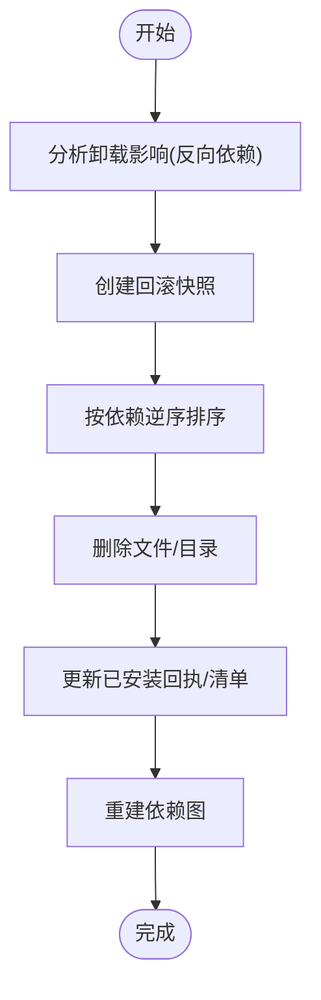
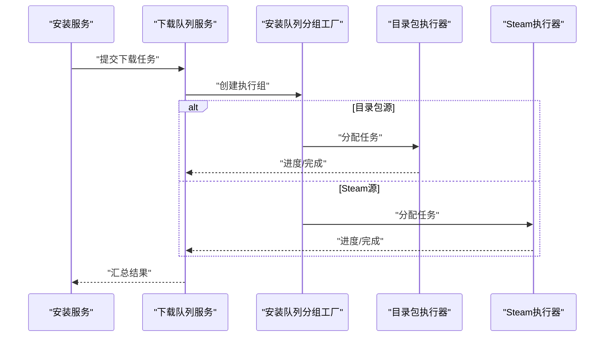
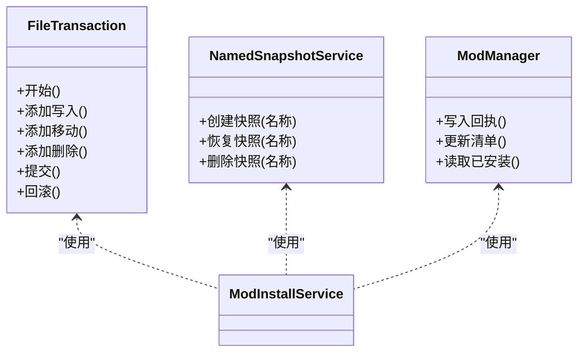
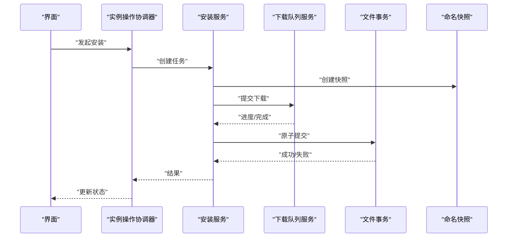
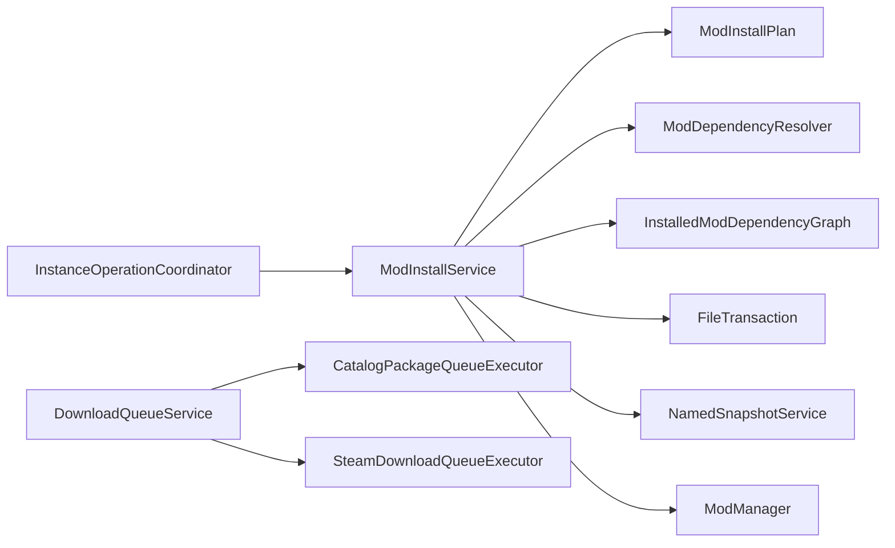

# 安装计划系统

<cite>
**本文引用的文件**   
- [ModInstallService.cs](file://src/Crystalfly.Core/Mods/ModInstallService.cs)
- [ModInstallPlan.cs](file://src/Crystalfly.Core/Mods/ModInstallPlan.cs)
- [ModRemovalImpactPlan.cs](file://src/Crystalfly.Core/Mods/ModRemovalImpactPlan.cs)
- [ModDependencyResolver.cs](file://src/Crystalfly.Core/Mods/ModDependencyResolver.cs)
- [InstalledModDependencyGraph.cs](file://src/Crystalfly.Core/Mods/InstalledModDependencyGraph.cs)
- [FileTransaction.cs](file://src/Crystalfly.Core/Transactions/FileTransaction.cs)
- [DownloadQueueService.cs](file://src/Crystalfly.App/Downloads/DownloadQueueService.cs)
- [CatalogPackageQueueExecutor.cs](file://src/Crystalfly.App/Downloads/CatalogPackageQueueExecutor.cs)
- [SteamDownloadQueueExecutor.cs](file://src/Crystalfly.App/Downloads/SteamDownloadQueueExecutor.cs)
- [ModInstallQueueGroupFactory.cs](file://src/Crystalfly.App/Downloads/ModInstallQueueGroupFactory.cs)
- [InstanceOperationCoordinator.cs](file://src/Crystalfly.App/Downloads/InstanceOperationCoordinator.cs)
- [ModManager.cs](file://src/Crystalfly.Core/Mods/ModManager.cs)
- [ModManifest.cs](file://src/Crystalfly.Core/Models/ModManifest.cs)
- [InstalledModReceipt.cs](file://src/Crystalfly.Core/Models/InstalledModReceipt.cs)
- [NamedSnapshotService.cs](file://src/Crystalfly.Core/Snapshots/NamedSnapshotService.cs)
</cite>

## 目录
1. [简介](#简介)
2. [项目结构](#项目结构)
3. [核心组件](#核心组件)
4. [架构总览](#架构总览)
5. [详细组件分析](#详细组件分析)
6. [依赖关系分析](#依赖关系分析)
7. [性能考虑](#性能考虑)
8. [故障排查指南](#故障排查指南)
9. [结论](#结论)
10. [附录](#附录)

## 简介
本文件系统性地阐述“安装计划系统”的设计与实现，重点覆盖：
- ModInstallService 的安装服务架构
- ModInstallPlan 安装计划的生成机制
- 安装执行流程（预检、下载、解压、验证、注册）
- 事务性安装与数据一致性保证
- ModRemovalImpactPlan 卸载影响分析（依赖检查、回滚点创建、清理策略）
- 批量安装与并行处理优化策略
- 如何创建安装任务、监控进度、处理异常

## 项目结构
安装计划系统横跨 Core 与 App 两层：
- Core 层负责计划生成、依赖解析、事务与持久化、快照等基础设施
- App 层负责队列编排、下载执行、UI 交互与实例操作协调

图表来源
- [InstanceOperationCoordinator.cs](file://src/Crystalfly.App/Downloads/InstanceOperationCoordinator.cs)
- [DownloadQueueService.cs](file://src/Crystalfly.App/Downloads/DownloadQueueService.cs)
- [ModInstallQueueGroupFactory.cs](file://src/Crystalfly.App/Downloads/ModInstallQueueGroupFactory.cs)
- [CatalogPackageQueueExecutor.cs](file://src/Crystalfly.App/Downloads/CatalogPackageQueueExecutor.cs)
- [SteamDownloadQueueExecutor.cs](file://src/Crystalfly.App/Downloads/SteamDownloadQueueExecutor.cs)
- [ModInstallService.cs](file://src/Crystalfly.Core/Mods/ModInstallService.cs)
- [ModInstallPlan.cs](file://src/Crystalfly.Core/Mods/ModInstallPlan.cs)
- [ModDependencyResolver.cs](file://src/Crystalfly.Core/Mods/ModDependencyResolver.cs)
- [InstalledModDependencyGraph.cs](file://src/Crystalfly.Core/Mods/InstalledModDependencyGraph.cs)
- [FileTransaction.cs](file://src/Crystalfly.Core/Transactions/FileTransaction.cs)
- [NamedSnapshotService.cs](file://src/Crystalfly.Core/Snapshots/NamedSnapshotService.cs)
- [ModManager.cs](file://src/Crystalfly.Core/Mods/ModManager.cs)
- [InstalledModReceipt.cs](file://src/Crystalfly.Core/Models/InstalledModReceipt.cs)
- [ModManifest.cs](file://src/Crystalfly.Core/Models/ModManifest.cs)

章节来源
- [ModInstallService.cs](file://src/Crystalfly.Core/Mods/ModInstallService.cs)
- [ModInstallPlan.cs](file://src/Crystalfly.Core/Mods/ModInstallPlan.cs)
- [ModRemovalImpactPlan.cs](file://src/Crystalfly.Core/Mods/ModRemovalImpactPlan.cs)
- [ModDependencyResolver.cs](file://src/Crystalfly.Core/Mods/ModDependencyResolver.cs)
- [InstalledModDependencyGraph.cs](file://src/Crystalfly.Core/Mods/InstalledModDependencyGraph.cs)
- [FileTransaction.cs](file://src/Crystalfly.Core/Transactions/FileTransaction.cs)
- [DownloadQueueService.cs](file://src/Crystalfly.App/Downloads/DownloadQueueService.cs)
- [CatalogPackageQueueExecutor.cs](file://src/Crystalfly.App/Downloads/CatalogPackageQueueExecutor.cs)
- [SteamDownloadQueueExecutor.cs](file://src/Crystalfly.App/Downloads/SteamDownloadQueueExecutor.cs)
- [ModInstallQueueGroupFactory.cs](file://src/Crystalfly.App/Downloads/ModInstallQueueGroupFactory.cs)
- [InstanceOperationCoordinator.cs](file://src/Crystalfly.App/Downloads/InstanceOperationCoordinator.cs)
- [ModManager.cs](file://src/Crystalfly.Core/Mods/ModManager.cs)
- [ModManifest.cs](file://src/Crystalfly.Core/Models/ModManifest.cs)
- [InstalledModReceipt.cs](file://src/Crystalfly.Core/Models/InstalledModReceipt.cs)
- [NamedSnapshotService.cs](file://src/Crystalfly.Core/Snapshots/NamedSnapshotService.cs)

## 核心组件
- 安装服务 ModInstallService：封装安装生命周期，驱动计划生成与执行，协调下载、校验、写入、注册与回滚。
- 安装计划 ModInstallPlan：描述一次安装所需的全部步骤与资源，包括依赖项、下载源、校验信息、目标路径、注册元数据等。
- 依赖解析器 ModDependencyResolver：基于已安装依赖图计算新增/升级/冲突的依赖集。
- 已安装依赖图 InstalledModDependencyGraph：维护当前实例中已安装模组的依赖关系。
- 文件事务 FileTransaction：提供原子写入与回滚能力，保障安装过程的数据一致性。
- 命名快照 NamedSnapshotService：在关键阶段创建可命名的快照，用于快速回滚或对比。
- 模组管理器 ModManager：读写已安装回执与清单，完成注册与查询。
- 下载队列 DownloadQueueService 及执行器：统一调度下载任务，支持目录包与 Steam 两种来源。
- 实例操作协调器 InstanceOperationCoordinator：将安装任务与实例状态、队列编排结合，提供端到端入口。

章节来源
- [ModInstallService.cs](file://src/Crystalfly.Core/Mods/ModInstallService.cs)
- [ModInstallPlan.cs](file://src/Crystalfly.Core/Mods/ModInstallPlan.cs)
- [ModDependencyResolver.cs](file://src/Crystalfly.Core/Mods/ModDependencyResolver.cs)
- [InstalledModDependencyGraph.cs](file://src/Crystalfly.Core/Mods/InstalledModDependencyGraph.cs)
- [FileTransaction.cs](file://src/Crystalfly.Core/Transactions/FileTransaction.cs)
- [NamedSnapshotService.cs](file://src/Crystalfly.Core/Snapshots/NamedSnapshotService.cs)
- [ModManager.cs](file://src/Crystalfly.Core/Mods/ModManager.cs)
- [DownloadQueueService.cs](file://src/Crystalfly.App/Downloads/DownloadQueueService.cs)
- [CatalogPackageQueueExecutor.cs](file://src/Crystalfly.App/Downloads/CatalogPackageQueueExecutor.cs)
- [SteamDownloadQueueExecutor.cs](file://src/Crystalfly.App/Downloads/SteamDownloadQueueExecutor.cs)
- [InstanceOperationCoordinator.cs](file://src/Crystalfly.App/Downloads/InstanceOperationCoordinator.cs)

## 架构总览
安装计划系统采用“计划先行、事务执行、可观测可回滚”的架构风格：
- 计划先行：先构建 ModInstallPlan，再按步骤执行，避免边做边算带来的不一致。
- 事务执行：通过 FileTransaction 对文件变更进行原子提交与回滚。
- 可观测可回滚：通过事件/进度聚合上报进度；在关键节点使用命名快照，失败时快速恢复。

图表来源
- [InstanceOperationCoordinator.cs](file://src/Crystalfly.App/Downloads/InstanceOperationCoordinator.cs)
- [DownloadQueueService.cs](file://src/Crystalfly.App/Downloads/DownloadQueueService.cs)
- [CatalogPackageQueueExecutor.cs](file://src/Crystalfly.App/Downloads/CatalogPackageQueueExecutor.cs)
- [SteamDownloadQueueExecutor.cs](file://src/Crystalfly.App/Downloads/SteamDownloadQueueExecutor.cs)
- [ModInstallService.cs](file://src/Crystalfly.Core/Mods/ModInstallService.cs)
- [ModInstallPlan.cs](file://src/Crystalfly.Core/Mods/ModInstallPlan.cs)
- [FileTransaction.cs](file://src/Crystalfly.Core/Transactions/FileTransaction.cs)
- [NamedSnapshotService.cs](file://src/Crystalfly.Core/Snapshots/NamedSnapshotService.cs)
- [ModManager.cs](file://src/Crystalfly.Core/Mods/ModManager.cs)

## 详细组件分析

### 安装服务 ModInstallService
职责与边界
- 接收安装请求，调用依赖解析生成 ModInstallPlan
- 协调下载、校验、解压、注册等步骤
- 管理事务与快照，确保失败可回滚
- 暴露进度与异常事件供上层订阅

关键流程要点
- 预检：校验目标实例、磁盘空间、依赖冲突、版本兼容性
- 下载：通过队列服务分发到具体执行器（目录包或 Steam）
- 解压与校验：按计划中的条目逐一处理，记录校验和
- 注册：更新已安装回执与清单，建立依赖关系
- 回滚：任一环节失败，触发事务回滚与快照恢复

图表来源
- [ModInstallService.cs](file://src/Crystalfly.Core/Mods/ModInstallService.cs)
- [ModInstallPlan.cs](file://src/Crystalfly.Core/Mods/ModInstallPlan.cs)
- [FileTransaction.cs](file://src/Crystalfly.Core/Transactions/FileTransaction.cs)
- [NamedSnapshotService.cs](file://src/Crystalfly.Core/Snapshots/NamedSnapshotService.cs)
- [ModManager.cs](file://src/Crystalfly.Core/Mods/ModManager.cs)

章节来源
- [ModInstallService.cs](file://src/Crystalfly.Core/Mods/ModInstallService.cs)
- [ModInstallPlan.cs](file://src/Crystalfly.Core/Mods/ModInstallPlan.cs)
- [FileTransaction.cs](file://src/Crystalfly.Core/Transactions/FileTransaction.cs)
- [NamedSnapshotService.cs](file://src/Crystalfly.Core/Snapshots/NamedSnapshotService.cs)
- [ModManager.cs](file://src/Crystalfly.Core/Mods/ModManager.cs)

### 安装计划 ModInstallPlan
数据结构与语义
- 包含待安装的模组集合、依赖闭包、下载源、校验信息、目标路径映射、注册元数据
- 支持增量/全量安装场景，具备幂等性（重复执行不产生副作用）

生成机制
- 输入：用户选择的目标模组列表、目标实例、可选约束（版本范围）
- 依赖解析：基于 InstalledModDependencyGraph 与 ModDependencyResolver 计算新增/升级/冲突
- 输出：不可变计划对象，供安装服务顺序执行

图表来源
- [ModInstallPlan.cs](file://src/Crystalfly.Core/Mods/ModInstallPlan.cs)
- [ModDependencyResolver.cs](file://src/Crystalfly.Core/Mods/ModDependencyResolver.cs)
- [InstalledModDependencyGraph.cs](file://src/Crystalfly.Core/Mods/InstalledModDependencyGraph.cs)

章节来源
- [ModInstallPlan.cs](file://src/Crystalfly.Core/Mods/ModInstallPlan.cs)
- [ModDependencyResolver.cs](file://src/Crystalfly.Core/Mods/ModDependencyResolver.cs)
- [InstalledModDependencyGraph.cs](file://src/Crystalfly.Core/Mods/InstalledModDependencyGraph.cs)

### 卸载影响分析 ModRemovalImpactPlan
功能要点
- 依赖检查：识别被移除模组的影响面（反向依赖者）
- 回滚点创建：在删除前创建命名快照，便于一键恢复
- 清理策略：按依赖逆序删除文件、清理回执与清单、重建依赖图

图表来源
- [ModRemovalImpactPlan.cs](file://src/Crystalfly.Core/Mods/ModRemovalImpactPlan.cs)
- [InstalledModDependencyGraph.cs](file://src/Crystalfly.Core/Mods/InstalledModDependencyGraph.cs)
- [NamedSnapshotService.cs](file://src/Crystalfly.Core/Snapshots/NamedSnapshotService.cs)
- [ModManager.cs](file://src/Crystalfly.Core/Mods/ModManager.cs)

章节来源
- [ModRemovalImpactPlan.cs](file://src/Crystalfly.Core/Mods/ModRemovalImpactPlan.cs)
- [InstalledModDependencyGraph.cs](file://src/Crystalfly.Core/Mods/InstalledModDependencyGraph.cs)
- [NamedSnapshotService.cs](file://src/Crystalfly.Core/Snapshots/NamedSnapshotService.cs)
- [ModManager.cs](file://src/Crystalfly.Core/Mods/ModManager.cs)

### 下载与队列编排
- DownloadQueueService：统一接入下载任务，聚合进度，支持取消与重试
- CatalogPackageQueueExecutor：从目录包源拉取资源
- SteamDownloadQueueExecutor：通过 Steam 内容交付通道获取资源
- ModInstallQueueGroupFactory：根据任务类型创建合适的执行组，提升吞吐

图表来源
- [DownloadQueueService.cs](file://src/Crystalfly.App/Downloads/DownloadQueueService.cs)
- [ModInstallQueueGroupFactory.cs](file://src/Crystalfly.App/Downloads/ModInstallQueueGroupFactory.cs)
- [CatalogPackageQueueExecutor.cs](file://src/Crystalfly.App/Downloads/CatalogPackageQueueExecutor.cs)
- [SteamDownloadQueueExecutor.cs](file://src/Crystalfly.App/Downloads/SteamDownloadQueueExecutor.cs)

章节来源
- [DownloadQueueService.cs](file://src/Crystalfly.App/Downloads/DownloadQueueService.cs)
- [ModInstallQueueGroupFactory.cs](file://src/Crystalfly.App/Downloads/ModInstallQueueGroupFactory.cs)
- [CatalogPackageQueueExecutor.cs](file://src/Crystalfly.App/Downloads/CatalogPackageQueueExecutor.cs)
- [SteamDownloadQueueExecutor.cs](file://src/Crystalfly.App/Downloads/SteamDownloadQueueExecutor.cs)

### 事务性与数据一致性
- 文件事务 FileTransaction：对文件写入、移动、删除进行批量化原子提交，失败自动回滚
- 命名快照 NamedSnapshotService：在计划开始前创建快照，失败时可恢复到一致状态
- 回执与清单：ModManager 负责写入 InstalledModReceipt 与 ModManifest，保证元数据与文件系统一致

图表来源
- [FileTransaction.cs](file://src/Crystalfly.Core/Transactions/FileTransaction.cs)
- [NamedSnapshotService.cs](file://src/Crystalfly.Core/Snapshots/NamedSnapshotService.cs)
- [ModManager.cs](file://src/Crystalfly.Core/Mods/ModManager.cs)
- [ModInstallService.cs](file://src/Crystalfly.Core/Mods/ModInstallService.cs)

章节来源
- [FileTransaction.cs](file://src/Crystalfly.Core/Transactions/FileTransaction.cs)
- [NamedSnapshotService.cs](file://src/Crystalfly.Core/Snapshots/NamedSnapshotService.cs)
- [ModManager.cs](file://src/Crystalfly.Core/Mods/ModManager.cs)
- [ModInstallService.cs](file://src/Crystalfly.Core/Mods/ModInstallService.cs)

### 端到端入口：实例操作协调器
- InstanceOperationCoordinator 将 UI 请求转化为安装任务，绑定队列与进度回调，统一处理成功/失败路径

图表来源
- [InstanceOperationCoordinator.cs](file://src/Crystalfly.App/Downloads/InstanceOperationCoordinator.cs)
- [ModInstallService.cs](file://src/Crystalfly.Core/Mods/ModInstallService.cs)
- [DownloadQueueService.cs](file://src/Crystalfly.App/Downloads/DownloadQueueService.cs)
- [FileTransaction.cs](file://src/Crystalfly.Core/Transactions/FileTransaction.cs)
- [NamedSnapshotService.cs](file://src/Crystalfly.Core/Snapshots/NamedSnapshotService.cs)

章节来源
- [InstanceOperationCoordinator.cs](file://src/Crystalfly.App/Downloads/InstanceOperationCoordinator.cs)
- [ModInstallService.cs](file://src/Crystalfly.Core/Mods/ModInstallService.cs)
- [DownloadQueueService.cs](file://src/Crystalfly.App/Downloads/DownloadQueueService.cs)
- [FileTransaction.cs](file://src/Crystalfly.Core/Transactions/FileTransaction.cs)
- [NamedSnapshotService.cs](file://src/Crystalfly.Core/Snapshots/NamedSnapshotService.cs)

## 依赖关系分析
- 低耦合：安装服务通过接口与计划对象交互，降低与具体下载实现的耦合
- 高内聚：ModInstallPlan 集中表达一次安装的所有信息，便于测试与回放
- 外部依赖：目录包与 Steam 两类执行器通过工厂解耦，易于扩展新来源

图表来源
- [ModInstallService.cs](file://src/Crystalfly.Core/Mods/ModInstallService.cs)
- [ModInstallPlan.cs](file://src/Crystalfly.Core/Mods/ModInstallPlan.cs)
- [ModDependencyResolver.cs](file://src/Crystalfly.Core/Mods/ModDependencyResolver.cs)
- [InstalledModDependencyGraph.cs](file://src/Crystalfly.Core/Mods/InstalledModDependencyGraph.cs)
- [FileTransaction.cs](file://src/Crystalfly.Core/Transactions/FileTransaction.cs)
- [NamedSnapshotService.cs](file://src/Crystalfly.Core/Snapshots/NamedSnapshotService.cs)
- [ModManager.cs](file://src/Crystalfly.Core/Mods/ModManager.cs)
- [InstanceOperationCoordinator.cs](file://src/Crystalfly.App/Downloads/InstanceOperationCoordinator.cs)
- [DownloadQueueService.cs](file://src/Crystalfly.App/Downloads/DownloadQueueService.cs)
- [CatalogPackageQueueExecutor.cs](file://src/Crystalfly.App/Downloads/CatalogPackageQueueExecutor.cs)
- [SteamDownloadQueueExecutor.cs](file://src/Crystalfly.App/Downloads/SteamDownloadQueueExecutor.cs)

章节来源
- [ModInstallService.cs](file://src/Crystalfly.Core/Mods/ModInstallService.cs)
- [ModInstallPlan.cs](file://src/Crystalfly.Core/Mods/ModInstallPlan.cs)
- [ModDependencyResolver.cs](file://src/Crystalfly.Core/Mods/ModDependencyResolver.cs)
- [InstalledModDependencyGraph.cs](file://src/Crystalfly.Core/Mods/InstalledModDependencyGraph.cs)
- [FileTransaction.cs](file://src/Crystalfly.Core/Transactions/FileTransaction.cs)
- [NamedSnapshotService.cs](file://src/Crystalfly.Core/Snapshots/NamedSnapshotService.cs)
- [ModManager.cs](file://src/Crystalfly.Core/Mods/ModManager.cs)
- [InstanceOperationCoordinator.cs](file://src/Crystalfly.App/Downloads/InstanceOperationCoordinator.cs)
- [DownloadQueueService.cs](file://src/Crystalfly.App/Downloads/DownloadQueueService.cs)
- [CatalogPackageQueueExecutor.cs](file://src/Crystalfly.App/Downloads/CatalogPackageQueueExecutor.cs)
- [SteamDownloadQueueExecutor.cs](file://src/Crystalfly.App/Downloads/SteamDownloadQueueExecutor.cs)

## 性能考虑
- 并行下载：通过 DownloadQueueService 与分组工厂并发执行多任务，提高吞吐
- 依赖闭包最小化：仅下载必要依赖，减少网络与 I/O 压力
- 增量更新：利用 ModInstallPlan 的幂等特性，跳过已完成步骤
- 事务批量化：合并文件写入/移动/删除，减少磁盘抖动
- 快照粒度：仅在关键节点创建快照，平衡恢复成本与安全性

[本节为通用指导，无需代码引用]

## 故障排查指南
常见问题与定位建议
- 下载失败：检查网络连通性与执行器日志，确认队列是否被取消或限流
- 校验失败：核对哈希/签名配置，确认源文件完整性
- 权限不足：确认目标目录写权限与磁盘空间
- 依赖冲突：查看依赖解析报告，调整版本约束或卸载冲突模组
- 回滚未生效：检查快照是否存在且未被清理，确认事务提交状态

章节来源
- [DownloadQueueService.cs](file://src/Crystalfly.App/Downloads/DownloadQueueService.cs)
- [CatalogPackageQueueExecutor.cs](file://src/Crystalfly.App/Downloads/CatalogPackageQueueExecutor.cs)
- [SteamDownloadQueueExecutor.cs](file://src/Crystalfly.App/Downloads/SteamDownloadQueueExecutor.cs)
- [FileTransaction.cs](file://src/Crystalfly.Core/Transactions/FileTransaction.cs)
- [NamedSnapshotService.cs](file://src/Crystalfly.Core/Snapshots/NamedSnapshotService.cs)

## 结论
安装计划系统以“计划先行、事务执行、可观测可回滚”为核心设计原则，通过 ModInstallService 与 ModInstallPlan 的组合，实现了稳定可靠的模组安装流程。借助依赖解析、事务与快照机制，系统在复杂依赖与异常场景下仍能保证数据一致性与用户体验。配合队列与并行策略，系统具备良好的可扩展性与性能表现。

[本节为总结性内容，无需代码引用]

## 附录

### 使用示例（路径指引）
- 创建安装任务：参考 [InstanceOperationCoordinator.cs](file://src/Crystalfly.App/Downloads/InstanceOperationCoordinator.cs)
- 生成安装计划：参考 [ModInstallService.cs](file://src/Crystalfly.Core/Mods/ModInstallService.cs)、[ModInstallPlan.cs](file://src/Crystalfly.Core/Mods/ModInstallPlan.cs)
- 监控安装进度：参考 [DownloadQueueService.cs](file://src/Crystalfly.App/Downloads/DownloadQueueService.cs)
- 处理安装异常：参考 [FileTransaction.cs](file://src/Crystalfly.Core/Transactions/FileTransaction.cs)、[NamedSnapshotService.cs](file://src/Crystalfly.Core/Snapshots/NamedSnapshotService.cs)
- 卸载影响分析：参考 [ModRemovalImpactPlan.cs](file://src/Crystalfly.Core/Mods/ModRemovalImpactPlan.cs)

章节来源
- [InstanceOperationCoordinator.cs](file://src/Crystalfly.App/Downloads/InstanceOperationCoordinator.cs)
- [ModInstallService.cs](file://src/Crystalfly.Core/Mods/ModInstallService.cs)
- [ModInstallPlan.cs](file://src/Crystalfly.Core/Mods/ModInstallPlan.cs)
- [DownloadQueueService.cs](file://src/Crystalfly.App/Downloads/DownloadQueueService.cs)
- [FileTransaction.cs](file://src/Crystalfly.Core/Transactions/FileTransaction.cs)
- [NamedSnapshotService.cs](file://src/Crystalfly.Core/Snapshots/NamedSnapshotService.cs)
- [ModRemovalImpactPlan.cs](file://src/Crystalfly.Core/Mods/ModRemovalImpactPlan.cs)