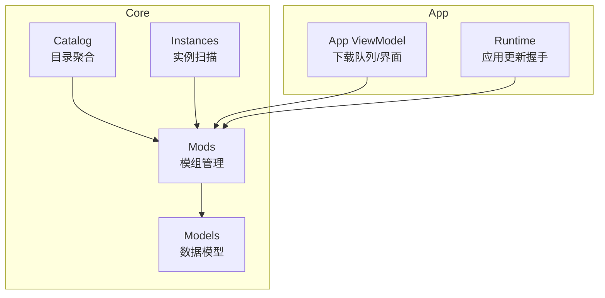
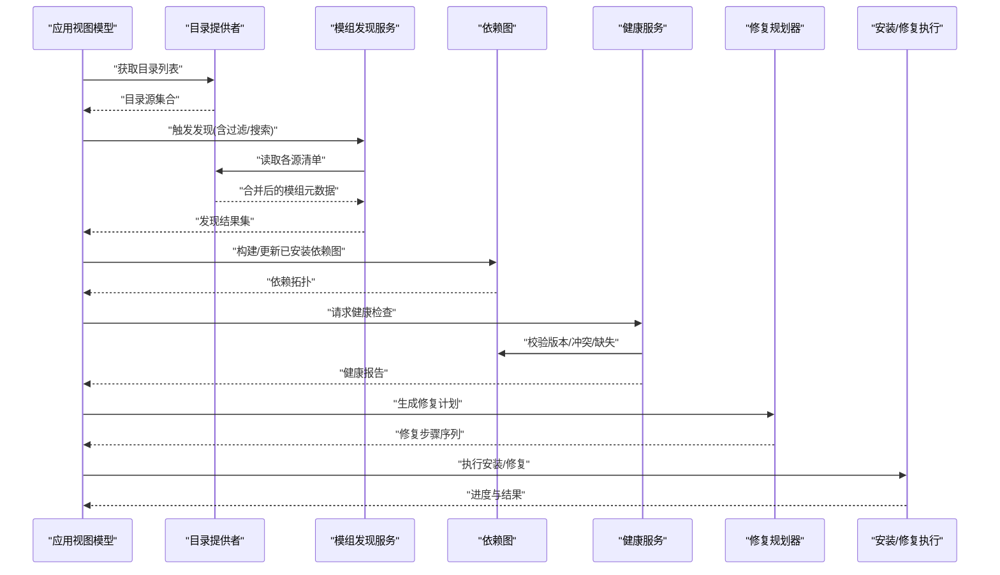
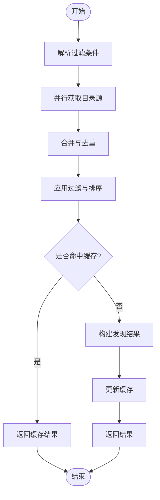
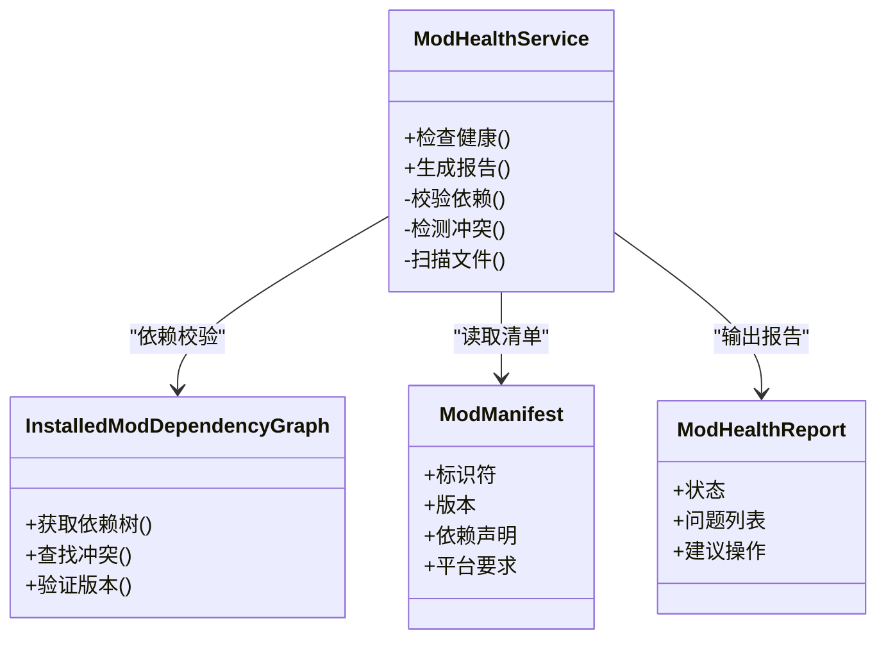
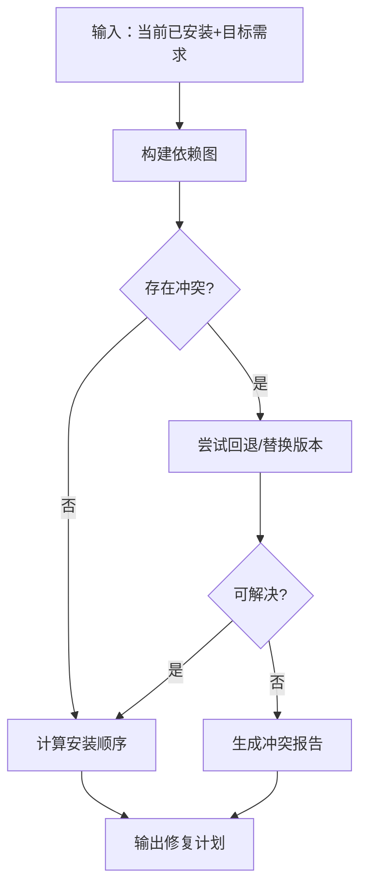
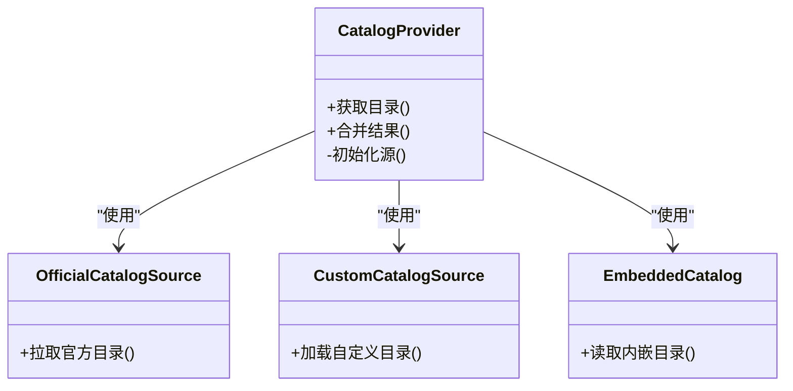
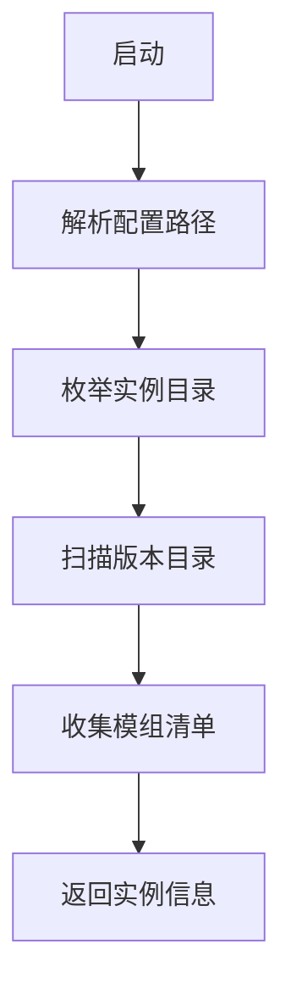
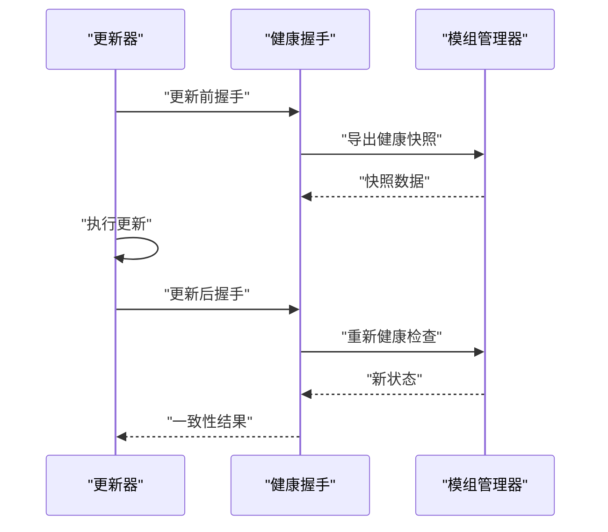
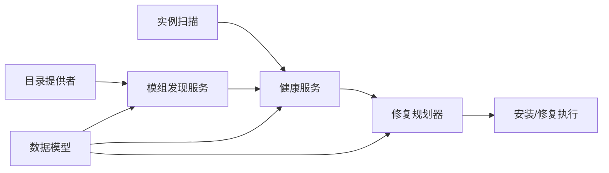

# 模组发现和健康管理

<cite>
**本文引用的文件**   
- [ModDiscoveryService.cs](file://src/Crystalfly.Core/Mods/ModDiscoveryService.cs)
- [ModHealthService.cs](file://src/Crystalfly.Core/Mods/ModHealthService.cs)
- [ModDependencyResolver.cs](file://src/Crystalfly.Core/Mods/ModDependencyResolver.cs)
- [InstalledModDependencyGraph.cs](file://src/Crystalfly.Core/Mods/InstalledModDependencyGraph.cs)
- [ModManifest.cs](file://src/Crystalfly.Core/Models/ModManifest.cs)
- [ModHealthReport.cs](file://src/Crystalfly.Core/Models/ModHealthReport.cs)
- [ModDiscoveryResult.cs](file://src/Crystalfly.Core/Models/ModDiscoveryResult.cs)
- [CatalogProvider.cs](file://src/Crystalfly.Core/Catalog/CatalogProvider.cs)
- [OfficialCatalogSource.cs](file://src/Crystalfly.Core/Catalog/OfficialCatalogSource.cs)
- [CustomCatalogSource.cs](file://src/Crystalfly.Core/Catalog/CustomCatalogSource.cs)
- [EmbeddedCatalog.cs](file://src/Crystalfly.Core/Catalog/EmbeddedCatalog.cs)
- [CrystalflyPaths.cs](file://src/Crystalfly.Core/Configuration/CrystalflyPaths.cs)
- [InstanceDirectory.cs](file://src/Crystalfly.Core/Instances/InstanceDirectory.cs)
- [VersionDirectoryScanner.cs](file://src/Crystalfly.Core/Instances/VersionDirectoryScanner.cs)
- [ModInstallPlan.cs](file://src/Crystalfly.Core/Mods/ModInstallPlan.cs)
- [ModDependencyRepairPlanner.cs](file://src/Crystalfly.Core/Mods/ModDependencyRepairPlanner.cs)
- [ModDependencyRepairPlan.cs](file://src/Crystalfly.Core/Models/ModDependencyRepairPlan.cs)
- [ModManager.cs](file://src/Crystalfly.Core/Mods/ModManager.cs)
- [MainViewModel.DownloadQueue.cs](file://src/Crystalfly.App/ViewModels/MainViewModel.DownloadQueue.cs)
- [ApplicationUpdateHealthHandshake.cs](file://src/Crystalfly.App/Runtime/ApplicationUpdateHealthHandshake.cs)
</cite>

## 目录
1. [简介](#简介)
2. [项目结构](#项目结构)
3. [核心组件](#核心组件)
4. [架构总览](#架构总览)
5. [详细组件分析](#详细组件分析)
6. [依赖关系分析](#依赖关系分析)
7. [性能考量](#性能考量)
8. [故障排查指南](#故障排查指南)
9. [结论](#结论)
10. [附录](#附录)

## 简介
本文件聚焦于 Crystalfly 的“模组发现与健康管理”能力，涵盖以下目标：
- 如何从多源（官方、自定义、内嵌）聚合模组目录，完成模组发现
- 如何扫描已安装实例，构建依赖图并评估健康状态
- 如何生成修复计划并驱动后续安装/修复流程
- 如何在应用更新过程中进行健康握手，确保运行期一致性

读者无需深入代码即可理解整体流程；同时为开发者提供关键类与数据流的结构化说明。

## 项目结构
围绕模组发现与健康管理的核心代码主要分布在 Core 层的 Mods、Catalog、Instances、Models 等子模块中，App 层负责 UI 与运行时交互。

图表来源
- [CatalogProvider.cs](file://src/Crystalfly.Core/Catalog/CatalogProvider.cs)
- [OfficialCatalogSource.cs](file://src/Crystalfly.Core/Catalog/OfficialCatalogSource.cs)
- [CustomCatalogSource.cs](file://src/Crystalfly.Core/Catalog/CustomCatalogSource.cs)
- [EmbeddedCatalog.cs](file://src/Crystalfly.Core/Catalog/EmbeddedCatalog.cs)
- [ModDiscoveryService.cs](file://src/Crystalfly.Core/Mods/ModDiscoveryService.cs)
- [ModHealthService.cs](file://src/Crystalfly.Core/Mods/ModHealthService.cs)
- [InstanceDirectory.cs](file://src/Crystalfly.Core/Instances/InstanceDirectory.cs)
- [VersionDirectoryScanner.cs](file://src/Crystalfly.Core/Instances/VersionDirectoryScanner.cs)
- [ModManager.cs](file://src/Crystalfly.Core/Mods/ModManager.cs)
- [MainViewModel.DownloadQueue.cs](file://src/Crystalfly.App/ViewModels/MainViewModel.DownloadQueue.cs)
- [ApplicationUpdateHealthHandshake.cs](file://src/Crystalfly.App/Runtime/ApplicationUpdateHealthHandshake.cs)

章节来源
- [ModDiscoveryService.cs](file://src/Crystalfly.Core/Mods/ModDiscoveryService.cs)
- [ModHealthService.cs](file://src/Crystalfly.Core/Mods/ModHealthService.cs)
- [CatalogProvider.cs](file://src/Crystalfly.Core/Catalog/CatalogProvider.cs)
- [InstanceDirectory.cs](file://src/Crystalfly.Core/Instances/InstanceDirectory.cs)

## 核心组件
- 模组发现服务：聚合多个目录源，解析模组清单，输出统一发现结果
- 健康检查服务：基于已安装依赖图与版本约束，生成健康报告
- 依赖解析器：计算依赖闭包、冲突检测、排序与可执行性判断
- 依赖图构建：维护已安装模组的依赖关系，支持增量更新
- 目录提供者：统一管理官方、自定义、内嵌目录源，提供合并与查询接口
- 路径与实例：定位用户配置、模组安装位置与游戏版本目录
- 数据模型：描述模组清单、健康报告、发现结果、修复计划等

章节来源
- [ModDiscoveryService.cs](file://src/Crystalfly.Core/Mods/ModDiscoveryService.cs)
- [ModHealthService.cs](file://src/Crystalfly.Core/Mods/ModHealthService.cs)
- [ModDependencyResolver.cs](file://src/Crystalfly.Core/Mods/ModDependencyResolver.cs)
- [InstalledModDependencyGraph.cs](file://src/Crystalfly.Core/Mods/InstalledModDependencyGraph.cs)
- [CatalogProvider.cs](file://src/Crystalfly.Core/Catalog/CatalogProvider.cs)
- [CrystalflyPaths.cs](file://src/Crystalfly.Core/Configuration/CrystalflyPaths.cs)
- [InstanceDirectory.cs](file://src/Crystalfly.Core/Instances/InstanceDirectory.cs)
- [ModManifest.cs](file://src/Crystalfly.Core/Models/ModManifest.cs)
- [ModHealthReport.cs](file://src/Crystalfly.Core/Models/ModHealthReport.cs)
- [ModDiscoveryResult.cs](file://src/Crystalfly.Core/Models/ModDiscoveryResult.cs)

## 架构总览
下图展示了模组发现与健康管理的端到端流程：从目录聚合到发现结果，再到健康检查与修复计划生成，最终由应用层驱动安装或修复。

图表来源
- [CatalogProvider.cs](file://src/Crystalfly.Core/Catalog/CatalogProvider.cs)
- [ModDiscoveryService.cs](file://src/Crystalfly.Core/Mods/ModDiscoveryService.cs)
- [InstalledModDependencyGraph.cs](file://src/Crystalfly.Core/Mods/InstalledModDependencyGraph.cs)
- [ModHealthService.cs](file://src/Crystalfly.Core/Mods/ModHealthService.cs)
- [ModDependencyRepairPlanner.cs](file://src/Crystalfly.Core/Mods/ModDependencyRepairPlanner.cs)
- [MainViewModel.DownloadQueue.cs](file://src/Crystalfly.App/ViewModels/MainViewModel.DownloadQueue.cs)

## 详细组件分析

### 模组发现服务
职责
- 接收过滤条件（名称、作者、标签、版本范围等）
- 调用目录提供者获取统一元数据
- 去重、排序、分页与缓存命中
- 返回结构化发现结果

关键输入/输出
- 输入：过滤参数、上下文（语言、渠道）
- 输出：发现结果集合（包含元数据、来源、可用版本等）

复杂度与优化
- 目录源读取为 I/O 密集，建议异步并行读取
- 对热门查询启用内存缓存，降低重复开销

图表来源
- [ModDiscoveryService.cs](file://src/Crystalfly.Core/Mods/ModDiscoveryService.cs)
- [CatalogProvider.cs](file://src/Crystalfly.Core/Catalog/CatalogProvider.cs)

章节来源
- [ModDiscoveryService.cs](file://src/Crystalfly.Core/Mods/ModDiscoveryService.cs)
- [ModDiscoveryResult.cs](file://src/Crystalfly.Core/Models/ModDiscoveryResult.cs)

### 健康检查服务
职责
- 基于已安装依赖图与目录元数据，评估当前实例的健康状态
- 识别缺失依赖、版本不兼容、冲突模组
- 输出健康报告，供 UI 展示与修复规划使用

健康指标
- 完整性：所有必需依赖均已安装且版本满足
- 兼容性：无版本冲突或加载顺序问题
- 稳定性：无已知破坏性变更或损坏文件

图表来源
- [ModHealthService.cs](file://src/Crystalfly.Core/Mods/ModHealthService.cs)
- [InstalledModDependencyGraph.cs](file://src/Crystalfly.Core/Mods/InstalledModDependencyGraph.cs)
- [ModManifest.cs](file://src/Crystalfly.Core/Models/ModManifest.cs)
- [ModHealthReport.cs](file://src/Crystalfly.Core/Models/ModHealthReport.cs)

章节来源
- [ModHealthService.cs](file://src/Crystalfly.Core/Mods/ModHealthService.cs)
- [ModHealthReport.cs](file://src/Crystalfly.Core/Models/ModHealthReport.cs)

### 依赖解析与修复规划
职责
- 解析依赖闭包，确定安装/升级/降级顺序
- 检测循环依赖与不可满足约束
- 生成最小修复计划，避免不必要的变更

修复策略
- 优先满足必需依赖，其次可选依赖
- 保持现有版本稳定，仅在必要时升级
- 冲突时选择兼容版本或提示用户决策

图表来源
- [ModDependencyResolver.cs](file://src/Crystalfly.Core/Mods/ModDependencyResolver.cs)
- [InstalledModDependencyGraph.cs](file://src/Crystalfly.Core/Mods/InstalledModDependencyGraph.cs)
- [ModDependencyRepairPlanner.cs](file://src/Crystalfly.Core/Mods/ModDependencyRepairPlanner.cs)
- [ModDependencyRepairPlan.cs](file://src/Crystalfly.Core/Models/ModDependencyRepairPlan.cs)

章节来源
- [ModDependencyResolver.cs](file://src/Crystalfly.Core/Mods/ModDependencyResolver.cs)
- [ModDependencyRepairPlanner.cs](file://src/Crystalfly.Core/Mods/ModDependencyRepairPlanner.cs)
- [ModDependencyRepairPlan.cs](file://src/Crystalfly.Core/Models/ModDependencyRepairPlan.cs)

### 目录提供者与多源聚合
职责
- 统一管理官方、自定义、内嵌目录源
- 提供统一的查询接口与合并策略
- 支持离线内嵌目录与在线扩展目录的组合

关键点
- 优先级与覆盖规则：自定义 > 官方 > 内嵌
- 增量更新：仅拉取变更部分，减少带宽
- 容错：单个源失败不影响其他源可用性

图表来源
- [CatalogProvider.cs](file://src/Crystalfly.Core/Catalog/CatalogProvider.cs)
- [OfficialCatalogSource.cs](file://src/Crystalfly.Core/Catalog/OfficialCatalogSource.cs)
- [CustomCatalogSource.cs](file://src/Crystalfly.Core/Catalog/CustomCatalogSource.cs)
- [EmbeddedCatalog.cs](file://src/Crystalfly.Core/Catalog/EmbeddedCatalog.cs)

章节来源
- [CatalogProvider.cs](file://src/Crystalfly.Core/Catalog/CatalogProvider.cs)
- [OfficialCatalogSource.cs](file://src/Crystalfly.Core/Catalog/OfficialCatalogSource.cs)
- [CustomCatalogSource.cs](file://src/Crystalfly.Core/Catalog/CustomCatalogSource.cs)
- [EmbeddedCatalog.cs](file://src/Crystalfly.Core/Catalog/EmbeddedCatalog.cs)

### 实例扫描与路径管理
职责
- 定位用户配置与模组安装目录
- 扫描游戏版本目录，识别已安装模组与版本信息
- 为发现与健康检查提供基础路径与上下文

要点
- 路径隔离：不同实例独立目录，避免污染
- 版本指纹：记录构建指纹，辅助兼容性判断

图表来源
- [CrystalflyPaths.cs](file://src/Crystalfly.Core/Configuration/CrystalflyPaths.cs)
- [InstanceDirectory.cs](file://src/Crystalfly.Core/Instances/InstanceDirectory.cs)
- [VersionDirectoryScanner.cs](file://src/Crystalfly.Core/Instances/VersionDirectoryScanner.cs)

章节来源
- [CrystalflyPaths.cs](file://src/Crystalfly.Core/Configuration/CrystalflyPaths.cs)
- [InstanceDirectory.cs](file://src/Crystalfly.Core/Instances/InstanceDirectory.cs)
- [VersionDirectoryScanner.cs](file://src/Crystalfly.Core/Instances/VersionDirectoryScanner.cs)

### 应用更新与健康握手
职责
- 在应用更新前后进行健康握手，确保运行时环境一致
- 校验关键文件与依赖状态，必要时触发修复流程

流程
- 更新前：快照当前健康状态
- 更新后：对比差异，必要时重新扫描与修复

图表来源
- [ApplicationUpdateHealthHandshake.cs](file://src/Crystalfly.App/Runtime/ApplicationUpdateHealthHandshake.cs)
- [ModManager.cs](file://src/Crystalfly.Core/Mods/ModManager.cs)

章节来源
- [ApplicationUpdateHealthHandshake.cs](file://src/Crystalfly.App/Runtime/ApplicationUpdateHealthHandshake.cs)
- [ModManager.cs](file://src/Crystalfly.Core/Mods/ModManager.cs)

## 依赖关系分析
模组发现与健康管理的依赖关系如下：

图表来源
- [CatalogProvider.cs](file://src/Crystalfly.Core/Catalog/CatalogProvider.cs)
- [ModDiscoveryService.cs](file://src/Crystalfly.Core/Mods/ModDiscoveryService.cs)
- [InstanceDirectory.cs](file://src/Crystalfly.Core/Instances/InstanceDirectory.cs)
- [ModHealthService.cs](file://src/Crystalfly.Core/Mods/ModHealthService.cs)
- [ModDependencyRepairPlanner.cs](file://src/Crystalfly.Core/Mods/ModDependencyRepairPlanner.cs)
- [ModManifest.cs](file://src/Crystalfly.Core/Models/ModManifest.cs)
- [ModHealthReport.cs](file://src/Crystalfly.Core/Models/ModHealthReport.cs)

章节来源
- [ModDiscoveryService.cs](file://src/Crystalfly.Core/Mods/ModDiscoveryService.cs)
- [ModHealthService.cs](file://src/Crystalfly.Core/Mods/ModHealthService.cs)
- [ModDependencyRepairPlanner.cs](file://src/Crystalfly.Core/Mods/ModDependencyRepairPlanner.cs)

## 性能考量
- 并发读取目录源：并行拉取官方/自定义/内嵌目录，缩短冷启动时间
- 缓存策略：对高频查询结果进行短期缓存，减少重复 I/O
- 增量扫描：仅扫描变更的版本目录与模组清单
- 依赖图优化：使用有向无环图表示依赖，避免重复计算
- 错误隔离：单个目录源失败不影响整体可用性

[本节为通用指导，不直接分析具体文件]

## 故障排查指南
常见问题与处理建议
- 目录源不可达：检查网络与自定义目录路径，启用离线模式使用内嵌目录
- 依赖冲突：查看健康报告中的冲突项，按建议回退或替换版本
- 版本不兼容：确认游戏版本与模组要求的匹配关系，必要时升级/降级模组
- 安装失败：检查磁盘权限与路径长度，清理临时文件后重试
- 更新后异常：执行健康握手，必要时恢复快照并重新扫描

章节来源
- [ModHealthService.cs](file://src/Crystalfly.Core/Mods/ModHealthService.cs)
- [ModDependencyRepairPlanner.cs](file://src/Crystalfly.Core/Mods/ModDependencyRepairPlanner.cs)
- [ApplicationUpdateHealthHandshake.cs](file://src/Crystalfly.App/Runtime/ApplicationUpdateHealthHandshake.cs)

## 结论
通过目录聚合、依赖图构建与健康检查，Crystalfly 实现了稳健的模组发现与健康管理闭环。结合修复规划与应用更新握手，系统能够在复杂环境下保持稳定的模组生态，为用户提供可靠的体验。

[本节为总结性内容，不直接分析具体文件]

## 附录
- 数据模型参考：模组清单、健康报告、发现结果、修复计划
- 路径与实例：用户配置、模组安装目录、游戏版本目录
- 应用集成：UI 下载队列、运行时握手流程

[本节为补充信息，不直接分析具体文件]