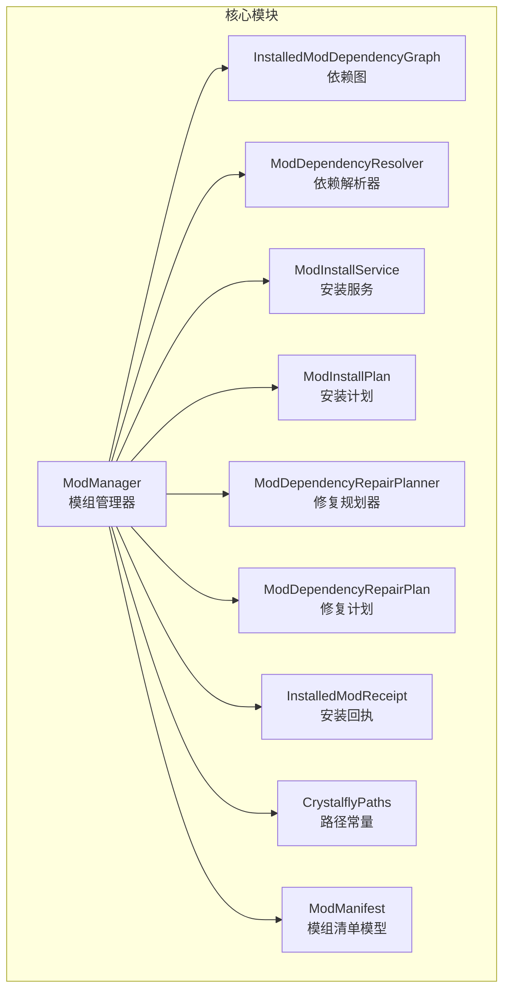
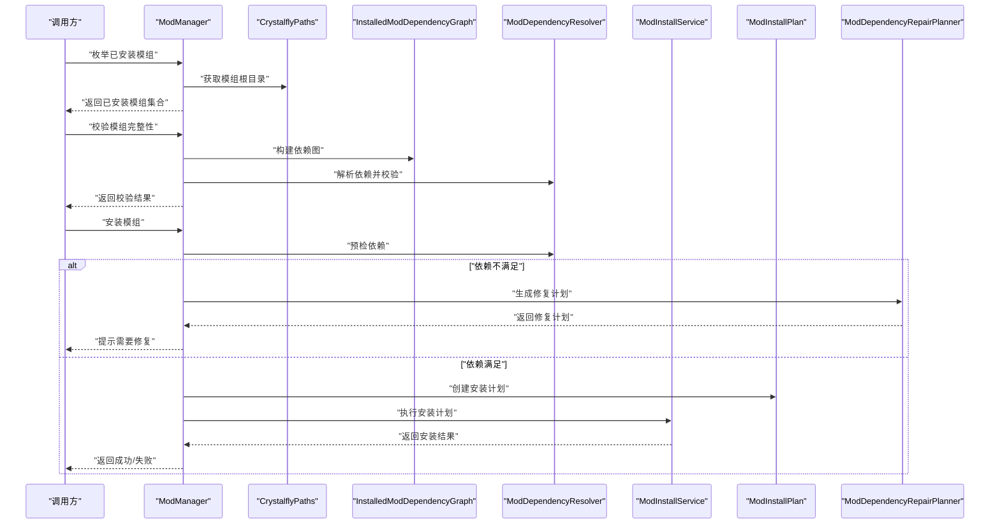
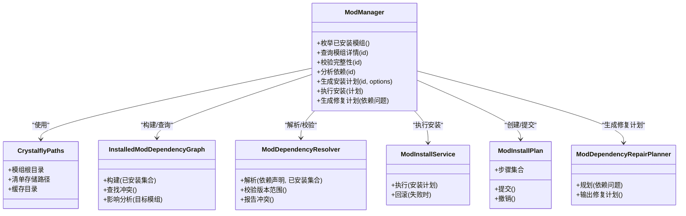
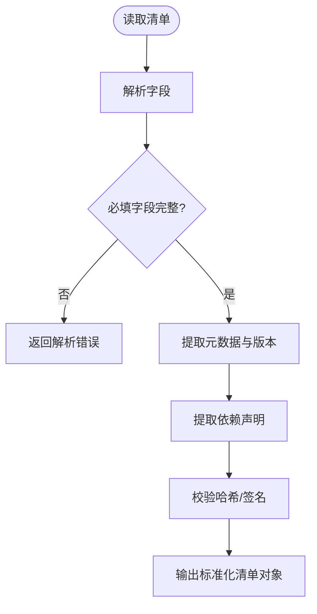
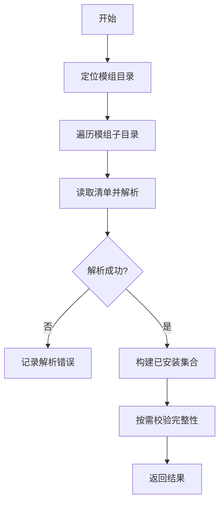
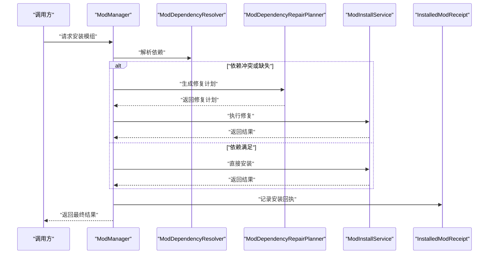
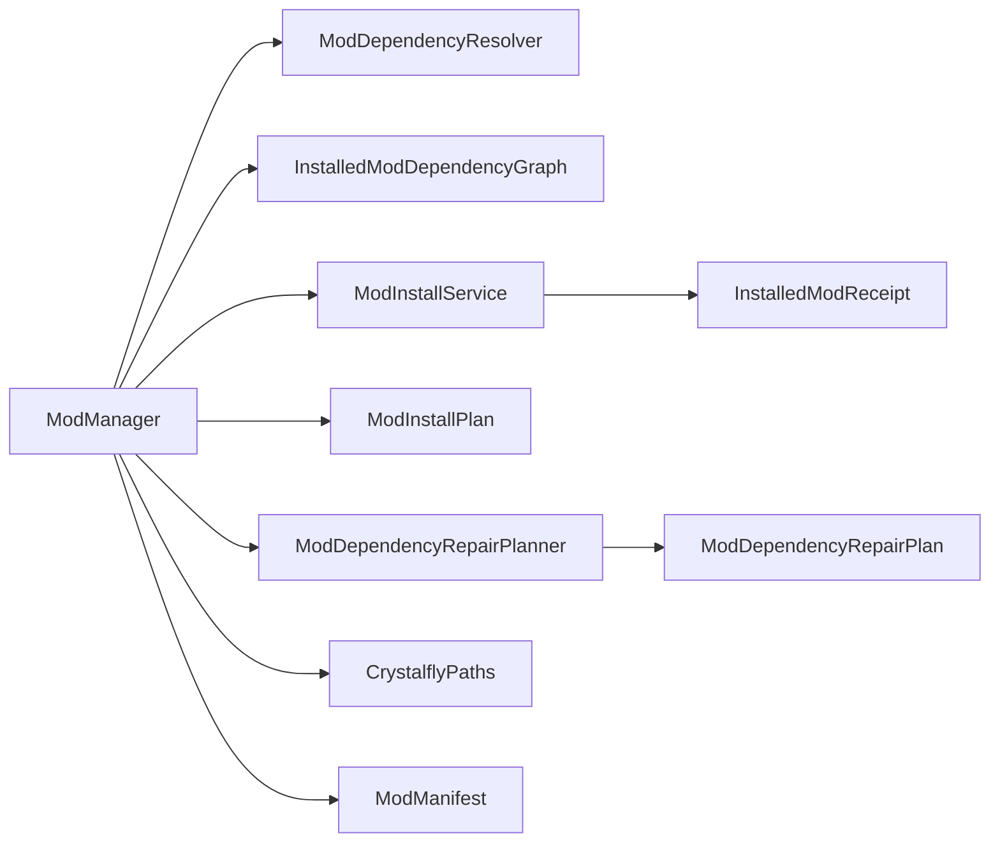

# 模组核心管理器

<cite>
**本文引用的文件**   
- [ModManager.cs](file://src/Crystalfly.Core/Mods/ModManager.cs)
- [ModManifest.cs](file://src/Crystalfly.Core/Models/ModManifest.cs)
- [InstalledModDependencyGraph.cs](file://src/Crystalfly.Core/Mods/InstalledModDependencyGraph.cs)
- [ModDependencyResolver.cs](file://src/Crystalfly.Core/Mods/ModDependencyResolver.cs)
- [ModInstallService.cs](file://src/Crystalfly.Core/Mods/ModInstallService.cs)
- [ModInstallPlan.cs](file://src/Crystalfly.Core/Mods/ModInstallPlan.cs)
- [ModDependencyRepairPlanner.cs](file://src/Crystalfly.Core/Mods/ModDependencyRepairPlanner.cs)
- [ModDependencyRepairPlan.cs](file://src/Crystalfly.Core/Mods/ModDependencyRepairPlan.cs)
- [InstalledModReceipt.cs](file://src/Crystalfly.Core/Models/InstalledModReceipt.cs)
- [CrystalflyPaths.cs](file://src/Crystalfly.Core/Configuration/CrystalflyPaths.cs)
</cite>

## 目录
1. [简介](#简介)
2. [项目结构](#项目结构)
3. [核心组件](#核心组件)
4. [架构总览](#架构总览)
5. [详细组件分析](#详细组件分析)
6. [依赖关系分析](#依赖关系分析)
7. [性能考虑](#性能考虑)
8. [故障排查指南](#故障排查指南)
9. [结论](#结论)
10. [附录](#附录)

## 简介
本文件聚焦于模组核心管理器，围绕 ModManager 类的设计与实现进行系统化说明。内容涵盖：
- 模组的发现、加载与状态管理基础操作
- ModManifest 数据模型的结构定义与字段含义（元数据、版本信息、依赖声明等）
- 模组生命周期管理方法（枚举已安装模组、检查模组状态、验证完整性等）
- 使用示例路径（获取模组列表、查询详情、处理异常状态）
- 模组文件组织、命名约定与版本控制策略
- 清单文件编写指南与最佳实践

## 项目结构
模组核心相关代码位于 Crystalfly.Core 模块的 Mods 与 Models 子目录中，其中：
- Mods 目录包含模组管理器、依赖解析、安装计划与修复计划等核心逻辑
- Models 目录包含 ModManifest、InstalledModReceipt 等关键数据模型
- Configuration 目录提供路径常量与配置访问能力

图表来源
- [ModManager.cs](file://src/Crystalfly.Core/Mods/ModManager.cs)
- [InstalledModDependencyGraph.cs](file://src/Crystalfly.Core/Mods/InstalledModDependencyGraph.cs)
- [ModDependencyResolver.cs](file://src/Crystalfly.Core/Mods/ModDependencyResolver.cs)
- [ModInstallService.cs](file://src/Crystalfly.Core/Mods/ModInstallService.cs)
- [ModInstallPlan.cs](file://src/Crystalfly.Core/Mods/ModInstallPlan.cs)
- [ModDependencyRepairPlanner.cs](file://src/Crystalfly.Core/Mods/ModDependencyRepairPlanner.cs)
- [ModDependencyRepairPlan.cs](file://src/Crystalfly.Core/Mods/ModDependencyRepairPlan.cs)
- [InstalledModReceipt.cs](file://src/Crystalfly.Core/Models/InstalledModReceipt.cs)
- [CrystalflyPaths.cs](file://src/Crystalfly.Core/Configuration/CrystalflyPaths.cs)
- [ModManifest.cs](file://src/Crystalfly.Core/Models/ModManifest.cs)

章节来源
- [ModManager.cs](file://src/Crystalfly.Core/Mods/ModManager.cs)
- [ModManifest.cs](file://src/Crystalfly.Core/Models/ModManifest.cs)
- [CrystalflyPaths.cs](file://src/Crystalfly.Core/Configuration/CrystalflyPaths.cs)

## 核心组件
- ModManager：模组管理的统一入口，负责枚举、加载、校验、状态查询、依赖分析与安装协调等
- ModManifest：描述单个模组的元数据、版本、依赖、兼容性等信息的数据模型
- InstalledModDependencyGraph：基于已安装模组构建的依赖图，用于冲突检测与影响分析
- ModDependencyResolver：解析并校验依赖关系，支持版本范围匹配与冲突解决
- ModInstallService：执行安装流程，生成并应用安装计划
- ModInstallPlan：描述一次安装操作的步骤集合（下载、解压、写入、注册等）
- ModDependencyRepairPlanner / ModDependencyRepairPlan：当检测到依赖不满足时，生成修复方案
- InstalledModReceipt：记录某次安装的结果与产物，便于审计与回滚
- CrystalflyPaths：集中管理模组目录、清单存储、缓存等路径常量

章节来源
- [ModManager.cs](file://src/Crystalfly.Core/Mods/ModManager.cs)
- [ModManifest.cs](file://src/Crystalfly.Core/Models/ModManifest.cs)
- [InstalledModDependencyGraph.cs](file://src/Crystalfly.Core/Mods/InstalledModDependencyGraph.cs)
- [ModDependencyResolver.cs](file://src/Crystalfly.Core/Mods/ModDependencyResolver.cs)
- [ModInstallService.cs](file://src/Crystalfly.Core/Mods/ModInstallService.cs)
- [ModInstallPlan.cs](file://src/Crystalfly.Core/Mods/ModInstallPlan.cs)
- [ModDependencyRepairPlanner.cs](file://src/Crystalfly.Core/Mods/ModDependencyRepairPlanner.cs)
- [ModDependencyRepairPlan.cs](file://src/Crystalfly.Core/Mods/ModDependencyRepairPlan.cs)
- [InstalledModReceipt.cs](file://src/Crystalfly.Core/Models/InstalledModReceipt.cs)
- [CrystalflyPaths.cs](file://src/Crystalfly.Core/Configuration/CrystalflyPaths.cs)

## 架构总览
ModManager 作为编排者，组合依赖解析、安装服务、依赖图与路径常量，对外暴露统一的模组管理能力。其典型调用链包括：
- 枚举已安装模组：扫描本地目录并读取清单，构建已安装集合
- 校验完整性：对比清单与磁盘文件，识别缺失或损坏
- 依赖分析：基于 ModManifest 的依赖声明，结合当前环境进行解析
- 安装协调：生成安装计划，交由 ModInstallService 执行
- 修复规划：在依赖不满足时，由修复规划器输出修复计划

图表来源
- [ModManager.cs](file://src/Crystalfly.Core/Mods/ModManager.cs)
- [CrystalflyPaths.cs](file://src/Crystalfly.Core/Configuration/CrystalflyPaths.cs)
- [InstalledModDependencyGraph.cs](file://src/Crystalfly.Core/Mods/InstalledModDependencyGraph.cs)
- [ModDependencyResolver.cs](file://src/Crystalfly.Core/Mods/ModDependencyResolver.cs)
- [ModInstallService.cs](file://src/Crystalfly.Core/Mods/ModInstallService.cs)
- [ModInstallPlan.cs](file://src/Crystalfly.Core/Mods/ModInstallPlan.cs)
- [ModDependencyRepairPlanner.cs](file://src/Crystalfly.Core/Mods/ModDependencyRepairPlanner.cs)

## 详细组件分析

### ModManager 类设计
- 职责边界
  - 对外提供模组发现、加载、状态查询、完整性校验、依赖分析与安装编排的统一接口
  - 内部协调依赖解析、安装服务、依赖图与路径常量
- 关键能力
  - 枚举已安装模组：基于路径常量定位模组目录，读取清单并去重
  - 状态管理：根据清单与磁盘一致性判断可用、损坏、缺失等状态
  - 完整性校验：比对清单哈希/大小与实际文件，标记异常
  - 依赖分析：将 ModManifest 的依赖声明转换为可解析的约束，结合已安装集合进行求解
  - 安装编排：生成安装计划，必要时触发修复计划，再交由安装服务执行
- 错误处理
  - 对 IO 异常、清单格式异常、依赖冲突等进行分类封装，向上层返回结构化结果
- 扩展点
  - 通过依赖解析器与安装服务的抽象，便于替换不同后端或策略

图表来源
- [ModManager.cs](file://src/Crystalfly.Core/Mods/ModManager.cs)
- [CrystalflyPaths.cs](file://src/Crystalfly.Core/Configuration/CrystalflyPaths.cs)
- [InstalledModDependencyGraph.cs](file://src/Crystalfly.Core/Mods/InstalledModDependencyGraph.cs)
- [ModDependencyResolver.cs](file://src/Crystalfly.Core/Mods/ModDependencyResolver.cs)
- [ModInstallService.cs](file://src/Crystalfly.Core/Mods/ModInstallService.cs)
- [ModInstallPlan.cs](file://src/Crystalfly.Core/Mods/ModInstallPlan.cs)
- [ModDependencyRepairPlanner.cs](file://src/Crystalfly.Core/Mods/ModDependencyRepairPlanner.cs)

章节来源
- [ModManager.cs](file://src/Crystalfly.Core/Mods/ModManager.cs)

### ModManifest 数据模型
- 作用
  - 描述单个模组的核心元数据、版本信息与依赖声明，是模组发现、校验与安装的基础
- 关键字段类别
  - 标识信息：模组唯一标识、名称、作者、描述等
  - 版本信息：版本号、兼容的游戏版本范围、发布渠道等
  - 依赖声明：必需依赖、可选依赖、版本约束表达式
  - 资源与入口：主程序集、资源包、插件入口点等
  - 校验信息：文件哈希、签名、完整性标记
- 使用场景
  - 枚举与检索：按标识与版本过滤
  - 完整性校验：对比清单中的校验值与磁盘实际值
  - 依赖解析：提取依赖项并交给解析器进行版本匹配与冲突检测
  - 安装计划：依据清单确定需要部署的文件与目标位置

图表来源
- [ModManifest.cs](file://src/Crystalfly.Core/Models/ModManifest.cs)

章节来源
- [ModManifest.cs](file://src/Crystalfly.Core/Models/ModManifest.cs)

### 模组生命周期管理方法
- 枚举已安装模组
  - 输入：无（或筛选条件）
  - 过程：定位模组根目录，遍历模组子目录，读取清单并构建集合
  - 输出：已安装模组列表（含标识、版本、状态）
- 查询模组详情
  - 输入：模组标识
  - 过程：从已安装集合或清单存储中查找对应条目
  - 输出：模组详情（元数据、版本、依赖、状态）
- 检查模组状态
  - 输入：模组标识
  - 过程：对比清单与实际文件，判定可用、损坏、缺失等
  - 输出：状态码与诊断信息
- 验证模组完整性
  - 输入：模组标识或全量
  - 过程：计算文件哈希并与清单对比，标记不一致项
  - 输出：完整性报告（正常/异常清单项）

图表来源
- [ModManager.cs](file://src/Crystalfly.Core/Mods/ModManager.cs)
- [CrystalflyPaths.cs](file://src/Crystalfly.Core/Configuration/CrystalflyPaths.cs)

章节来源
- [ModManager.cs](file://src/Crystalfly.Core/Mods/ModManager.cs)

### 安装与修复流程
- 安装流程
  - 预检：解析依赖，若存在冲突或不满足则进入修复分支
  - 计划：生成安装计划（下载、解压、写入、注册）
  - 执行：安装服务按步骤执行，失败时回滚
  - 结果：生成安装回执，记录产物与时间戳
- 修复流程
  - 检测：依赖解析器报告冲突或缺失
  - 规划：修复规划器输出修复计划（升级、降级、卸载、新增）
  - 执行：复用安装服务执行修复步骤

图表来源
- [ModManager.cs](file://src/Crystalfly.Core/Mods/ModManager.cs)
- [ModDependencyResolver.cs](file://src/Crystalfly.Core/Mods/ModDependencyResolver.cs)
- [ModDependencyRepairPlanner.cs](file://src/Crystalfly.Core/Mods/ModDependencyRepairPlanner.cs)
- [ModInstallService.cs](file://src/Crystalfly.Core/Mods/ModInstallService.cs)
- [InstalledModReceipt.cs](file://src/Crystalfly.Core/Models/InstalledModReceipt.cs)

章节来源
- [ModManager.cs](file://src/Crystalfly.Core/Mods/ModManager.cs)
- [ModDependencyResolver.cs](file://src/Crystalfly.Core/Mods/ModDependencyResolver.cs)
- [ModDependencyRepairPlanner.cs](file://src/Crystalfly.Core/Mods/ModDependencyRepairPlanner.cs)
- [ModInstallService.cs](file://src/Crystalfly.Core/Mods/ModInstallService.cs)
- [InstalledModReceipt.cs](file://src/Crystalfly.Core/Models/InstalledModReceipt.cs)

### 使用示例（以路径引用代替具体代码）
- 获取模组列表
  - 参考路径：[ModManager.cs](file://src/Crystalfly.Core/Mods/ModManager.cs)
- 查询模组详情
  - 参考路径：[ModManager.cs](file://src/Crystalfly.Core/Mods/ModManager.cs)
- 处理模组异常状态
  - 参考路径：[ModManager.cs](file://src/Crystalfly.Core/Mods/ModManager.cs)
- 生成并执行安装计划
  - 参考路径：[ModInstallPlan.cs](file://src/Crystalfly.Core/Mods/ModInstallPlan.cs), [ModInstallService.cs](file://src/Crystalfly.Core/Mods/ModInstallService.cs)
- 生成依赖修复计划
  - 参考路径：[ModDependencyRepairPlanner.cs](file://src/Crystalfly.Core/Mods/ModDependencyRepairPlanner.cs), [ModDependencyRepairPlan.cs](file://src/Crystalfly.Core/Mods/ModDependencyRepairPlan.cs)

章节来源
- [ModManager.cs](file://src/Crystalfly.Core/Mods/ModManager.cs)
- [ModInstallPlan.cs](file://src/Crystalfly.Core/Mods/ModInstallPlan.cs)
- [ModInstallService.cs](file://src/Crystalfly.Core/Mods/ModInstallService.cs)
- [ModDependencyRepairPlanner.cs](file://src/Crystalfly.Core/Mods/ModDependencyRepairPlanner.cs)
- [ModDependencyRepairPlan.cs](file://src/Crystalfly.Core/Mods/ModDependencyRepairPlan.cs)

## 依赖关系分析
- 组件耦合
  - ModManager 与 ModDependencyResolver、InstalledModDependencyGraph、ModInstallService 形成强协作关系
  - ModInstallPlan 作为中间产物，被安装服务消费
  - 修复规划器与安装服务解耦，便于独立测试与替换
- 外部依赖
  - 文件系统与路径常量（CrystalflyPaths）
  - 清单模型（ModManifest）与安装回执（InstalledModReceipt）
- 潜在循环依赖
  - 通过引入计划对象与解析器抽象，避免直接循环引用

图表来源
- [ModManager.cs](file://src/Crystalfly.Core/Mods/ModManager.cs)
- [ModDependencyResolver.cs](file://src/Crystalfly.Core/Mods/ModDependencyResolver.cs)
- [InstalledModDependencyGraph.cs](file://src/Crystalfly.Core/Mods/InstalledModDependencyGraph.cs)
- [ModInstallService.cs](file://src/Crystalfly.Core/Mods/ModInstallService.cs)
- [ModInstallPlan.cs](file://src/Crystalfly.Core/Mods/ModInstallPlan.cs)
- [ModDependencyRepairPlanner.cs](file://src/Crystalfly.Core/Mods/ModDependencyRepairPlanner.cs)
- [ModDependencyRepairPlan.cs](file://src/Crystalfly.Core/Mods/ModDependencyRepairPlan.cs)
- [InstalledModReceipt.cs](file://src/Crystalfly.Core/Models/InstalledModReceipt.cs)
- [CrystalflyPaths.cs](file://src/Crystalfly.Core/Configuration/CrystalflyPaths.cs)
- [ModManifest.cs](file://src/Crystalfly.Core/Models/ModManifest.cs)

章节来源
- [ModManager.cs](file://src/Crystalfly.Core/Mods/ModManager.cs)
- [ModDependencyResolver.cs](file://src/Crystalfly.Core/Mods/ModDependencyResolver.cs)
- [InstalledModDependencyGraph.cs](file://src/Crystalfly.Core/Mods/InstalledModDependencyGraph.cs)
- [ModInstallService.cs](file://src/Crystalfly.Core/Mods/ModInstallService.cs)
- [ModInstallPlan.cs](file://src/Crystalfly.Core/Mods/ModInstallPlan.cs)
- [ModDependencyRepairPlanner.cs](file://src/Crystalfly.Core/Mods/ModDependencyRepairPlanner.cs)
- [ModDependencyRepairPlan.cs](file://src/Crystalfly.Core/Mods/ModDependencyRepairPlan.cs)
- [InstalledModReceipt.cs](file://src/Crystalfly.Core/Models/InstalledModReceipt.cs)
- [CrystalflyPaths.cs](file://src/Crystalfly.Core/Configuration/CrystalflyPaths.cs)
- [ModManifest.cs](file://src/Crystalfly.Core/Models/ModManifest.cs)

## 性能考虑
- 批量枚举与缓存
  - 对已安装模组集合进行缓存，减少重复扫描与解析开销
- 增量校验
  - 仅对变更过的模组进行完整性校验，降低 IO 压力
- 并行化
  - 在安全前提下对独立模组的清单解析与校验并行执行
- 依赖解析优化
  - 对常见依赖模式建立索引，加速版本匹配与冲突检测

## 故障排查指南
- 常见问题
  - 清单解析失败：检查必填字段与格式是否符合 ModManifest 规范
  - 依赖冲突：查看依赖解析器的冲突报告，确认版本范围是否合理
  - 完整性校验失败：核对文件哈希与清单是否一致，必要时重新安装
  - 安装失败：查看安装回执与日志，定位具体失败的步骤
- 定位手段
  - 使用 ModManager 的状态查询与完整性校验接口快速定位问题
  - 借助 ModDependencyRepairPlanner 生成的修复计划指导修复

章节来源
- [ModManager.cs](file://src/Crystalfly.Core/Mods/ModManager.cs)
- [ModDependencyResolver.cs](file://src/Crystalfly.Core/Mods/ModDependencyResolver.cs)
- [ModDependencyRepairPlanner.cs](file://src/Crystalfly.Core/Mods/ModDependencyRepairPlanner.cs)
- [InstalledModReceipt.cs](file://src/Crystalfly.Core/Models/InstalledModReceipt.cs)

## 结论
ModManager 作为模组核心管理器，提供了从发现、加载、校验到安装与修复的完整生命周期管理能力。通过与 ModManifest、依赖解析器、安装服务与修复规划器的协同，系统实现了高内聚、低耦合的模组管理体系。遵循清单规范与最佳实践，可显著提升模组生态的稳定性和可维护性。

## 附录

### 模组文件组织结构与命名约定
- 目录组织
  - 每个模组一个独立子目录，以模组标识命名
  - 清单文件置于模组根目录，便于快速发现与解析
- 命名约定
  - 模组标识采用稳定字符串，避免特殊字符
  - 版本号遵循语义化版本规范，便于依赖解析
- 版本控制策略
  - 清单中包含版本与兼容性范围，确保安装时的正确匹配
  - 通过安装回执记录每次安装的产物与时间戳，便于审计与回滚

章节来源
- [CrystalflyPaths.cs](file://src/Crystalfly.Core/Configuration/CrystalflyPaths.cs)
- [ModManifest.cs](file://src/Crystalfly.Core/Models/ModManifest.cs)
- [InstalledModReceipt.cs](file://src/Crystalfly.Core/Models/InstalledModReceipt.cs)

### 清单文件编写指南与最佳实践
- 必填字段
  - 模组标识、名称、版本、依赖声明等必须完整且准确
- 版本与兼容性
  - 明确游戏版本兼容范围，避免不兼容安装
- 依赖声明
  - 区分必需与可选依赖，合理使用版本范围表达式
- 完整性与安全
  - 提供文件哈希或签名信息，增强安全性与可追溯性
- 文档与可读性
  - 为关键字段添加注释，提升可维护性与团队协作效率

章节来源
- [ModManifest.cs](file://src/Crystalfly.Core/Models/ModManifest.cs)