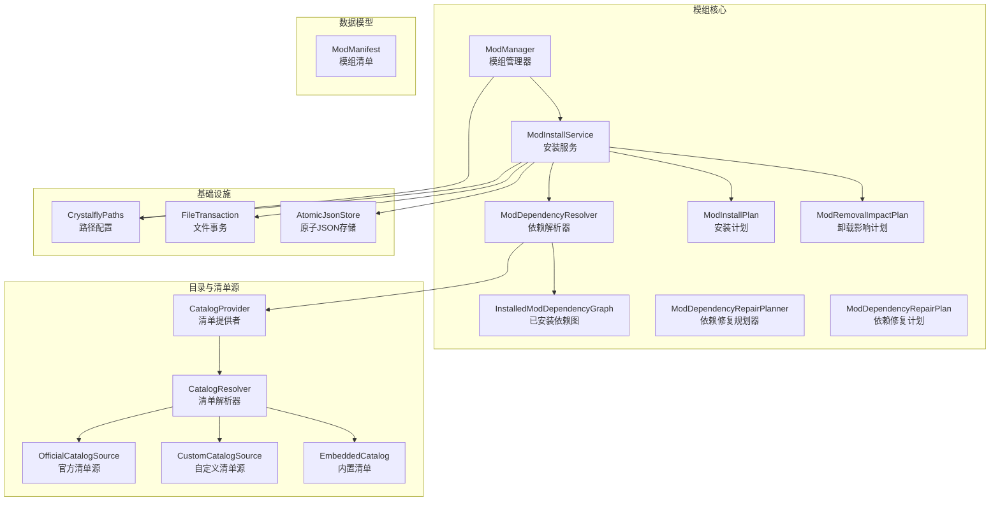
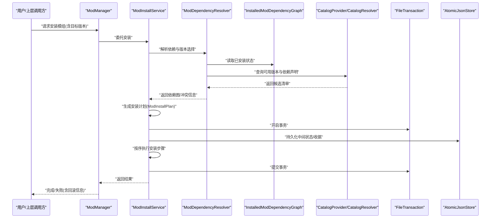
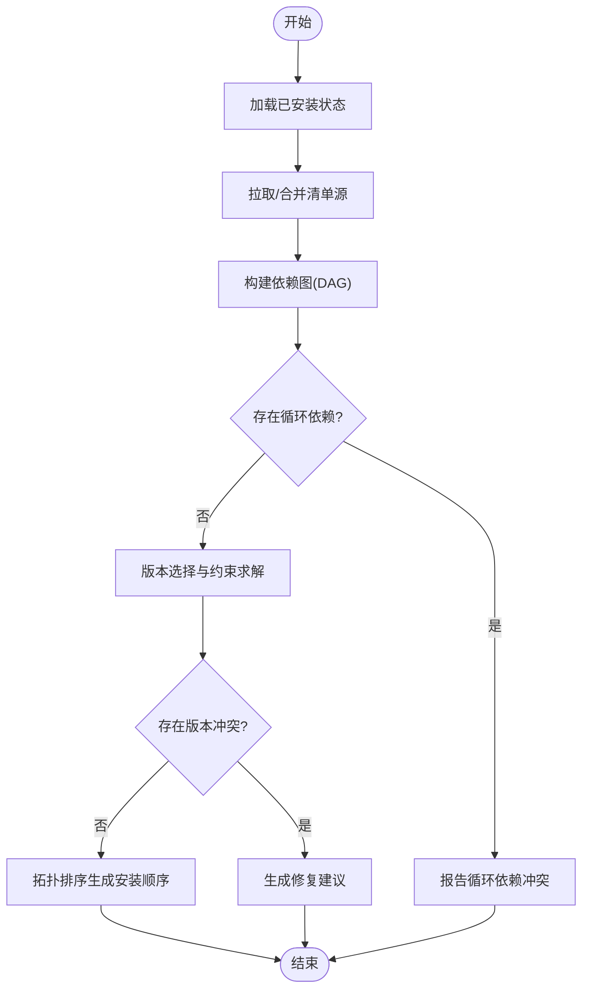
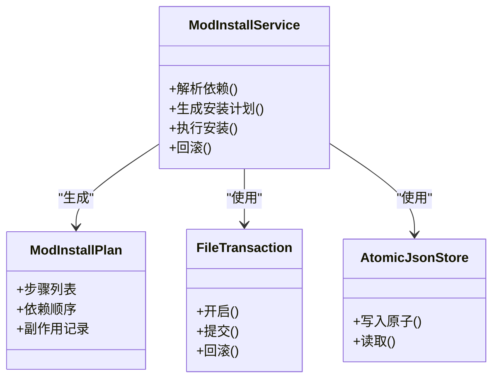
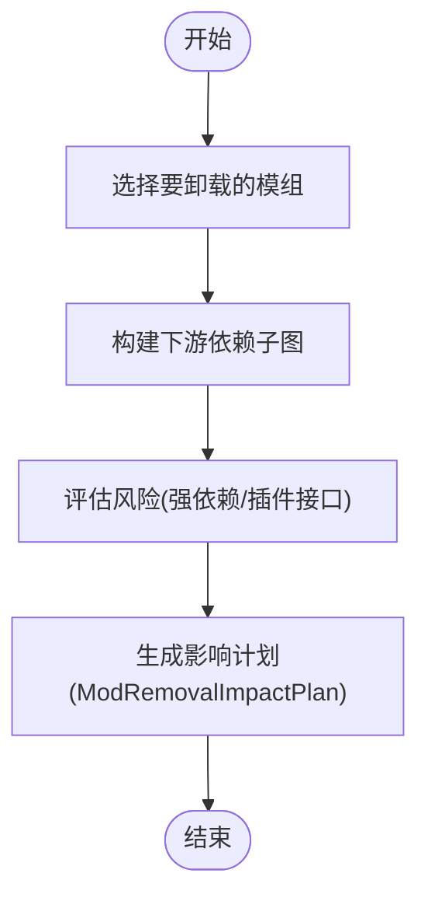
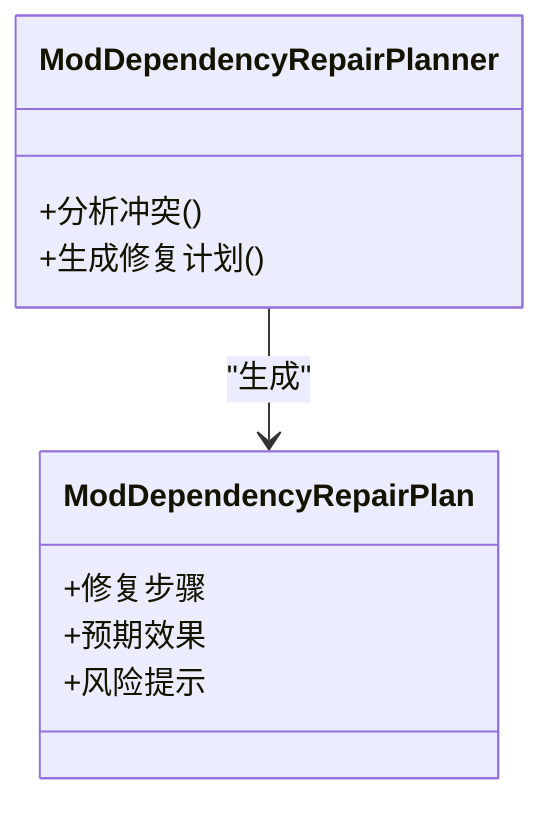
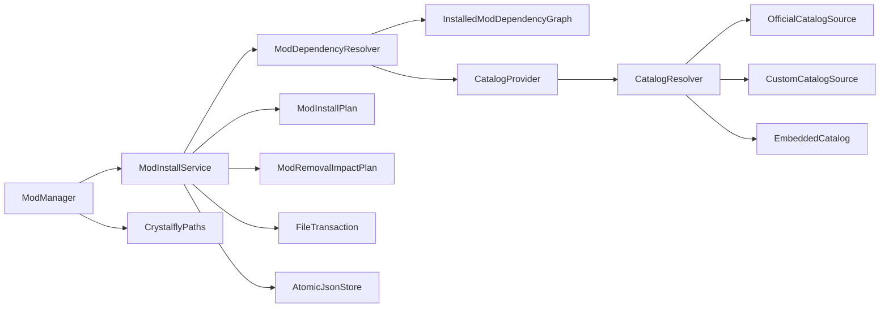

# 模组生态系统

<cite>
**本文引用的文件**
- [ModManager.cs](file://src/Crystalfly.Core/Mods/ModManager.cs)
- [ModInstallService.cs](file://src/Crystalfly.Core/Mods/ModInstallService.cs)
- [ModDependencyResolver.cs](file://src/Crystalfly.Core/Mods/ModDependencyResolver.cs)
- [InstalledModDependencyGraph.cs](file://src/Crystalfly.Core/Mods/InstalledModDependencyGraph.cs)
- [ModInstallPlan.cs](file://src/Crystalfly.Core/Mods/ModInstallPlan.cs)
- [ModRemovalImpactPlan.cs](file://src/Crystalfly.Core/Mods/ModRemovalImpactPlan.cs)
- [ModManifest.cs](file://src/Crystalfly.Core/Models/ModManifest.cs)
- [ModDependencyRepairPlanner.cs](file://src/Crystalfly.Core/Mods/ModDependencyRepairPlanner.cs)
- [ModDependencyRepairPlan.cs](file://src/Crystalfly.Core/Mods/ModDependencyRepairPlan.cs)
- [CatalogProvider.cs](file://src/Crystalfly.Core/Catalog/CatalogProvider.cs)
- [CatalogResolver.cs](file://src/Crystalfly.Core/Catalog/CatalogResolver.cs)
- [OfficialCatalogSource.cs](file://src/Crystalfly.Core/Catalog/OfficialCatalogSource.cs)
- [CustomCatalogSource.cs](file://src/Crystalfly.Core/Catalog/CustomCatalogSource.cs)
- [EmbeddedCatalog.cs](file://src/Crystalfly.Core/Catalog/EmbeddedCatalog.cs)
- [CrystalflyPaths.cs](file://src/Crystalfly.Core/Configuration/CrystalflyPaths.cs)
- [FileTransaction.cs](file://src/Crystalfly.Core/Transactions/FileTransaction.cs)
- [AtomicJsonStore.cs](file://src/Crystalfly.Core/Serialization/AtomicJsonStore.cs)
</cite>

## 目录
1. [简介](#简介)
2. [项目结构](#项目结构)
3. [核心组件](#核心组件)
4. [架构总览](#架构总览)
5. [详细组件分析](#详细组件分析)
6. [依赖关系分析](#依赖关系分析)
7. [性能考量](#性能考量)
8. [故障排查指南](#故障排查指南)
9. [结论](#结论)
10. [附录](#附录)

## 简介
本章节面向模组生态系统的整体设计与实现，聚焦于模组管理子系统。内容涵盖：
- 模组清单数据模型与版本策略
- 依赖解析、冲突检测与自动修复
- 安装计划生成与执行（含事务回滚）
- 卸载影响分析与安全删除
- 模组开发指南与兼容性检查方法
- 版本管理与回滚机制

## 项目结构
模组相关代码主要位于 Crystalfly.Core 的 Mods 与 Models 目录，配合 Catalog 提供模组元数据与来源解析，Configuration 提供路径配置，Transactions 提供原子化文件操作保障，Serialization 提供 JSON 序列化能力。

图表来源
- [ModManager.cs](file://src/Crystalfly.Core/Mods/ModManager.cs)
- [ModInstallService.cs](file://src/Crystalfly.Core/Mods/ModInstallService.cs)
- [ModDependencyResolver.cs](file://src/Crystalfly.Core/Mods/ModDependencyResolver.cs)
- [InstalledModDependencyGraph.cs](file://src/Crystalfly.Core/Mods/InstalledModDependencyGraph.cs)
- [ModInstallPlan.cs](file://src/Crystalfly.Core/Mods/ModInstallPlan.cs)
- [ModRemovalImpactPlan.cs](file://src/Crystalfly.Core/Mods/ModRemovalImpactPlan.cs)
- [ModDependencyRepairPlanner.cs](file://src/Crystalfly.Core/Mods/ModDependencyRepairPlanner.cs)
- [ModDependencyRepairPlan.cs](file://src/Crystalfly.Core/Mods/ModDependencyRepairPlan.cs)
- [CatalogProvider.cs](file://src/Crystalfly.Core/Catalog/CatalogProvider.cs)
- [CatalogResolver.cs](file://src/Crystalfly.Core/Catalog/CatalogResolver.cs)
- [OfficialCatalogSource.cs](file://src/Crystalfly.Core/Catalog/OfficialCatalogSource.cs)
- [CustomCatalogSource.cs](file://src/Crystalfly.Core/Catalog/CustomCatalogSource.cs)
- [EmbeddedCatalog.cs](file://src/Crystalfly.Core/Catalog/EmbeddedCatalog.cs)
- [CrystalflyPaths.cs](file://src/Crystalfly.Core/Configuration/CrystalflyPaths.cs)
- [FileTransaction.cs](file://src/Crystalfly.Core/Transactions/FileTransaction.cs)
- [AtomicJsonStore.cs](file://src/Crystalfly.Core/Serialization/AtomicJsonStore.cs)

章节来源
- [ModManager.cs](file://src/Crystalfly.Core/Mods/ModManager.cs)
- [ModInstallService.cs](file://src/Crystalfly.Core/Mods/ModInstallService.cs)
- [ModDependencyResolver.cs](file://src/Crystalfly.Core/Mods/ModDependencyResolver.cs)
- [InstalledModDependencyGraph.cs](file://src/Crystalfly.Core/Mods/InstalledModDependencyGraph.cs)
- [ModInstallPlan.cs](file://src/Crystalfly.Core/Mods/ModInstallPlan.cs)
- [ModRemovalImpactPlan.cs](file://src/Crystalfly.Core/Mods/ModRemovalImpactPlan.cs)
- [ModDependencyRepairPlanner.cs](file://src/Crystalfly.Core/Mods/ModDependencyRepairPlanner.cs)
- [ModDependencyRepairPlan.cs](file://src/Crystalfly.Core/Mods/ModDependencyRepairPlan.cs)
- [CatalogProvider.cs](file://src/Crystalfly.Core/Catalog/CatalogProvider.cs)
- [CatalogResolver.cs](file://src/Crystalfly.Core/Catalog/CatalogResolver.cs)
- [OfficialCatalogSource.cs](file://src/Crystalfly.Core/Catalog/OfficialCatalogSource.cs)
- [CustomCatalogSource.cs](file://src/Crystalfly.Core/Catalog/CustomCatalogSource.cs)
- [EmbeddedCatalog.cs](file://src/Crystalfly.Core/Catalog/EmbeddedCatalog.cs)
- [CrystalflyPaths.cs](file://src/Crystalfly.Core/Configuration/CrystalflyPaths.cs)
- [FileTransaction.cs](file://src/Crystalfly.Core/Transactions/FileTransaction.cs)
- [AtomicJsonStore.cs](file://src/Crystalfly.Core/Serialization/AtomicJsonStore.cs)

## 核心组件
本节概述关键组件的职责与交互方式，为后续深入分析奠定基础。

- ModManager：对外暴露模组管理的统一入口，协调安装、卸载、依赖修复等操作，封装对底层服务的调用。
- ModInstallService：负责将用户意图转化为可执行的安装计划，处理下载、校验、写入、记录等步骤，并保证事务性。
- ModDependencyResolver：基于已安装状态与清单源构建依赖图，进行版本选择、冲突检测与修复建议生成。
- InstalledModDependencyGraph：维护当前实例中已安装模组的依赖关系视图，支持快速查询与变更影响评估。
- ModInstallPlan：描述一次安装操作的完整步骤序列，包括新增、更新、跳过、前置条件等。
- ModRemovalImpactPlan：描述卸载某模组可能影响的下游依赖集合与风险点。
- ModDependencyRepairPlanner / ModDependencyRepairPlan：在检测到依赖不满足时，生成最小修复集与执行顺序。
- CatalogProvider / CatalogResolver / OfficialCatalogSource / CustomCatalogSource / EmbeddedCatalog：聚合多来源的模组清单，提供统一的查询接口。
- CrystalflyPaths：集中管理模组目录、清单缓存、下载目录等路径。
- FileTransaction / AtomicJsonStore：提供文件级事务与原子写入，确保一致性。

章节来源
- [ModManager.cs](file://src/Crystalfly.Core/Mods/ModManager.cs)
- [ModInstallService.cs](file://src/Crystalfly.Core/Mods/ModInstallService.cs)
- [ModDependencyResolver.cs](file://src/Crystalfly.Core/Mods/ModDependencyResolver.cs)
- [InstalledModDependencyGraph.cs](file://src/Crystalfly.Core/Mods/InstalledModDependencyGraph.cs)
- [ModInstallPlan.cs](file://src/Crystalfly.Core/Mods/ModInstallPlan.cs)
- [ModRemovalImpactPlan.cs](file://src/Crystalfly.Core/Mods/ModRemovalImpactPlan.cs)
- [ModDependencyRepairPlanner.cs](file://src/Crystalfly.Core/Mods/ModDependencyRepairPlanner.cs)
- [ModDependencyRepairPlan.cs](file://src/Crystalfly.Core/Mods/ModDependencyRepairPlan.cs)
- [CatalogProvider.cs](file://src/Crystalfly.Core/Catalog/CatalogProvider.cs)
- [CatalogResolver.cs](file://src/Crystalfly.Core/Catalog/CatalogResolver.cs)
- [OfficialCatalogSource.cs](file://src/Crystalfly.Core/Catalog/OfficialCatalogSource.cs)
- [CustomCatalogSource.cs](file://src/Crystalfly.Core/Catalog/CustomCatalogSource.cs)
- [EmbeddedCatalog.cs](file://src/Crystalfly.Core/Catalog/EmbeddedCatalog.cs)
- [CrystalflyPaths.cs](file://src/Crystalfly.Core/Configuration/CrystalflyPaths.cs)
- [FileTransaction.cs](file://src/Crystalfly.Core/Transactions/FileTransaction.cs)
- [AtomicJsonStore.cs](file://src/Crystalfly.Core/Serialization/AtomicJsonStore.cs)

## 架构总览
下图展示了从用户请求到最终落盘的端到端流程，以及各组件之间的协作关系。

图表来源
- [ModManager.cs](file://src/Crystalfly.Core/Mods/ModManager.cs)
- [ModInstallService.cs](file://src/Crystalfly.Core/Mods/ModInstallService.cs)
- [ModDependencyResolver.cs](file://src/Crystalfly.Core/Mods/ModDependencyResolver.cs)
- [InstalledModDependencyGraph.cs](file://src/Crystalfly.Core/Mods/InstalledModDependencyGraph.cs)
- [CatalogProvider.cs](file://src/Crystalfly.Core/Catalog/CatalogProvider.cs)
- [CatalogResolver.cs](file://src/Crystalfly.Core/Catalog/CatalogResolver.cs)
- [FileTransaction.cs](file://src/Crystalfly.Core/Transactions/FileTransaction.cs)
- [AtomicJsonStore.cs](file://src/Crystalfly.Core/Serialization/AtomicJsonStore.cs)

## 详细组件分析

### ModManifest 数据模型与清单结构
- 职责：描述单个模组的元数据，包括标识、版本、作者、摘要、许可证、平台要求、依赖声明、可选依赖、资源包信息等。
- 关键字段（概念说明）：
  - 标识与版本：用于唯一识别与版本比较
  - 依赖声明：包含必要依赖与可选依赖，支持版本范围约束
  - 平台与运行时：指定游戏版本、加载器版本等兼容性约束
  - 资源与文件：定义需要部署的文件集合及目标路径
- 清单来源：通过 CatalogProvider 聚合多个来源（官方、自定义、内置），由 CatalogResolver 进行合并与去重。

章节来源
- [ModManifest.cs](file://src/Crystalfly.Core/Models/ModManifest.cs)
- [CatalogProvider.cs](file://src/Crystalfly.Core/Catalog/CatalogProvider.cs)
- [CatalogResolver.cs](file://src/Crystalfly.Core/Catalog/CatalogResolver.cs)
- [OfficialCatalogSource.cs](file://src/Crystalfly.Core/Catalog/OfficialCatalogSource.cs)
- [CustomCatalogSource.cs](file://src/Crystalfly.Core/Catalog/CustomCatalogSource.cs)
- [EmbeddedCatalog.cs](file://src/Crystalfly.Core/Catalog/EmbeddedCatalog.cs)

### ModDependencyResolver 依赖解析器
- 职责：
  - 基于已安装状态与清单源构建依赖图
  - 进行版本选择与约束求解
  - 检测冲突并给出修复建议
- 算法要点：
  - 构建有向无环图（DAG）表示依赖关系
  - 拓扑排序确定安装顺序
  - 版本区间匹配与最优解选择（优先稳定版/兼容版）
  - 冲突检测：同一依赖的多版本需求、循环依赖、缺失依赖
- 输出：
  - 依赖图快照
  - 冲突报告（含受影响节点与原因）
  - 修复建议（升级/降级/替换/移除）

图表来源
- [ModDependencyResolver.cs](file://src/Crystalfly.Core/Mods/ModDependencyResolver.cs)
- [InstalledModDependencyGraph.cs](file://src/Crystalfly.Core/Mods/InstalledModDependencyGraph.cs)
- [CatalogProvider.cs](file://src/Crystalfly.Core/Catalog/CatalogProvider.cs)
- [CatalogResolver.cs](file://src/Crystalfly.Core/Catalog/CatalogResolver.cs)

章节来源
- [ModDependencyResolver.cs](file://src/Crystalfly.Core/Mods/ModDependencyResolver.cs)
- [InstalledModDependencyGraph.cs](file://src/Crystalfly.Core/Mods/InstalledModDependencyGraph.cs)
- [CatalogProvider.cs](file://src/Crystalfly.Core/Catalog/CatalogProvider.cs)
- [CatalogResolver.cs](file://src/Crystalfly.Core/Catalog/CatalogResolver.cs)

### ModInstallService 安装服务与安装计划
- 职责：
  - 接收用户安装请求
  - 调用依赖解析器获取依赖图与冲突信息
  - 生成 ModInstallPlan（包含新增、更新、跳过、前置校验等步骤）
  - 在事务内执行下载、校验、写入、记录
  - 失败时回滚，保证系统一致性
- 安装计划（ModInstallPlan）：
  - 步骤类型：新增、更新、跳过、校验、清理
  - 依赖顺序：依据拓扑排序
  - 副作用：更新收据、索引、清单缓存
- 事务与回滚：
  - 使用 FileTransaction 包裹文件操作
  - 使用 AtomicJsonStore 持久化中间状态
  - 异常触发回滚，恢复至一致状态

图表来源
- [ModInstallService.cs](file://src/Crystalfly.Core/Mods/ModInstallService.cs)
- [ModInstallPlan.cs](file://src/Crystalfly.Core/Mods/ModInstallPlan.cs)
- [FileTransaction.cs](file://src/Crystalfly.Core/Transactions/FileTransaction.cs)
- [AtomicJsonStore.cs](file://src/Crystalfly.Core/Serialization/AtomicJsonStore.cs)

章节来源
- [ModInstallService.cs](file://src/Crystalfly.Core/Mods/ModInstallService.cs)
- [ModInstallPlan.cs](file://src/Crystalfly.Core/Mods/ModInstallPlan.cs)
- [FileTransaction.cs](file://src/Crystalfly.Core/Transactions/FileTransaction.cs)
- [AtomicJsonStore.cs](file://src/Crystalfly.Core/Serialization/AtomicJsonStore.cs)

### ModRemovalImpactPlan 卸载影响分析
- 职责：
  - 计算卸载某模组后受影响的下游依赖集合
  - 评估风险点（如强依赖缺失、运行时代码不可用）
  - 生成最小修复或提示用户确认
- 输出：
  - 受影响模组列表
  - 风险等级与建议动作（继续卸载/先修复/取消）

图表来源
- [ModRemovalImpactPlan.cs](file://src/Crystalfly.Core/Mods/ModRemovalImpactPlan.cs)
- [InstalledModDependencyGraph.cs](file://src/Crystalfly.Core/Mods/InstalledModDependencyGraph.cs)

章节来源
- [ModRemovalImpactPlan.cs](file://src/Crystalfly.Core/Mods/ModRemovalImpactPlan.cs)
- [InstalledModDependencyGraph.cs](file://src/Crystalfly.Core/Mods/InstalledModDependencyGraph.cs)

### ModDependencyRepairPlanner 依赖修复规划器
- 职责：
  - 在检测到依赖不满足时，生成最小修复集
  - 考虑升级/降级/替换策略，避免引入新冲突
  - 输出 ModDependencyRepairPlan，供安装服务执行
- 策略：
  - 优先保持现有版本不变，仅在必要时调整
  - 选择具有更广泛兼容性的版本
  - 若无法自动修复，给出人工干预建议

图表来源
- [ModDependencyRepairPlanner.cs](file://src/Crystalfly.Core/Mods/ModDependencyRepairPlanner.cs)
- [ModDependencyRepairPlan.cs](file://src/Crystalfly.Core/Mods/ModDependencyRepairPlan.cs)

章节来源
- [ModDependencyRepairPlanner.cs](file://src/Crystalfly.Core/Mods/ModDependencyRepairPlanner.cs)
- [ModDependencyRepairPlan.cs](file://src/Crystalfly.Core/Mods/ModDependencyRepairPlan.cs)

### ModManager 核心管理器
- 职责：
  - 作为外部调用的统一入口
  - 编排 ModInstallService、依赖解析器、卸载影响分析等
  - 提供安装、卸载、依赖修复、状态查询等高层 API
- 设计原则：
  - 单一职责：仅做编排与协调
  - 错误传播：将具体错误与上下文传递给调用方
  - 可测试性：便于注入模拟依赖进行单元测试

章节来源
- [ModManager.cs](file://src/Crystalfly.Core/Mods/ModManager.cs)

## 依赖关系分析
本节从模块耦合与外部依赖角度进行分析，帮助理解系统边界与扩展点。

图表来源
- [ModManager.cs](file://src/Crystalfly.Core/Mods/ModManager.cs)
- [ModInstallService.cs](file://src/Crystalfly.Core/Mods/ModInstallService.cs)
- [ModDependencyResolver.cs](file://src/Crystalfly.Core/Mods/ModDependencyResolver.cs)
- [InstalledModDependencyGraph.cs](file://src/Crystalfly.Core/Mods/InstalledModDependencyGraph.cs)
- [CatalogProvider.cs](file://src/Crystalfly.Core/Catalog/CatalogProvider.cs)
- [CatalogResolver.cs](file://src/Crystalfly.Core/Catalog/CatalogResolver.cs)
- [OfficialCatalogSource.cs](file://src/Crystalfly.Core/Catalog/OfficialCatalogSource.cs)
- [CustomCatalogSource.cs](file://src/Crystalfly.Core/Catalog/CustomCatalogSource.cs)
- [EmbeddedCatalog.cs](file://src/Crystalfly.Core/Catalog/EmbeddedCatalog.cs)
- [FileTransaction.cs](file://src/Crystalfly.Core/Transactions/FileTransaction.cs)
- [AtomicJsonStore.cs](file://src/Crystalfly.Core/Serialization/AtomicJsonStore.cs)
- [CrystalflyPaths.cs](file://src/Crystalfly.Core/Configuration/CrystalflyPaths.cs)

章节来源
- [ModManager.cs](file://src/Crystalfly.Core/Mods/ModManager.cs)
- [ModInstallService.cs](file://src/Crystalfly.Core/Mods/ModInstallService.cs)
- [ModDependencyResolver.cs](file://src/Crystalfly.Core/Mods/ModDependencyResolver.cs)
- [InstalledModDependencyGraph.cs](file://src/Crystalfly.Core/Mods/InstalledModDependencyGraph.cs)
- [CatalogProvider.cs](file://src/Crystalfly.Core/Catalog/CatalogProvider.cs)
- [CatalogResolver.cs](file://src/Crystalfly.Core/Catalog/CatalogResolver.cs)
- [OfficialCatalogSource.cs](file://src/Crystalfly.Core/Catalog/OfficialCatalogSource.cs)
- [CustomCatalogSource.cs](file://src/Crystalfly.Core/Catalog/CustomCatalogSource.cs)
- [EmbeddedCatalog.cs](file://src/Crystalfly.Core/Catalog/EmbeddedCatalog.cs)
- [FileTransaction.cs](file://src/Crystalfly.Core/Transactions/FileTransaction.cs)
- [AtomicJsonStore.cs](file://src/Crystalfly.Core/Serialization/AtomicJsonStore.cs)
- [CrystalflyPaths.cs](file://src/Crystalfly.Core/Configuration/CrystalflyPaths.cs)

## 性能考量
- 依赖图构建：
  - 采用增量更新策略，避免全量重建
  - 缓存已解析的清单与依赖图，减少重复 IO
- 版本选择：
  - 预筛选候选版本，缩小搜索空间
  - 使用启发式规则优先选择稳定版本
- 事务与回滚：
  - 批量写入时使用原子操作，降低锁竞争
  - 分阶段提交，缩短长事务持有时间
- I/O 优化：
  - 并行下载与校验（在队列层控制并发度）
  - 使用流式写入，避免大文件内存占用

[本节为通用性能指导，无需特定文件引用]

## 故障排查指南
- 常见错误与定位：
  - 依赖冲突：查看 ModDependencyResolver 输出的冲突报告，确认版本约束是否过严
  - 循环依赖：检查依赖图中是否存在环，必要时手动调整依赖声明
  - 安装失败：检查 FileTransaction 日志与 AtomicJsonStore 中间状态，定位失败步骤
  - 权限问题：确认 CrystalflyPaths 指向的目录具备读写权限
- 诊断步骤：
  - 启用详细日志，捕获解析与安装过程
  - 导出依赖图快照，辅助可视化分析
  - 使用卸载影响计划评估风险，避免破坏性操作
- 恢复策略：
  - 利用事务回滚恢复到一致状态
  - 使用历史收据与清单缓存重建状态

章节来源
- [ModDependencyResolver.cs](file://src/Crystalfly.Core/Mods/ModDependencyResolver.cs)
- [FileTransaction.cs](file://src/Crystalfly.Core/Transactions/FileTransaction.cs)
- [AtomicJsonStore.cs](file://src/Crystalfly.Core/Serialization/AtomicJsonStore.cs)
- [CrystalflyPaths.cs](file://src/Crystalfly.Core/Configuration/CrystalflyPaths.cs)

## 结论
模组生态系统以清晰的职责划分与稳健的事务机制为核心，实现了可靠的依赖解析、安装与卸载流程。通过 ModManifest 标准化清单、ModInstallPlan 明确执行步骤、ModRemovalImpactPlan 评估风险，系统在易用性与安全性之间取得平衡。未来可在依赖求解策略与性能优化方面持续改进，进一步提升用户体验与稳定性。

[本节为总结性内容，无需特定文件引用]

## 附录

### 模组开发指南与兼容性检查
- 清单编写：
  - 明确标识与版本，遵循语义化版本规范
  - 合理声明必要依赖与可选依赖，避免过度耦合
  - 标注平台与运行时要求，确保与目标游戏/加载器兼容
- 兼容性检查：
  - 使用 CatalogResolver 验证清单格式与字段完整性
  - 在本地环境模拟依赖解析，提前发现潜在冲突
  - 针对强依赖进行回归测试，确保接口稳定
- 发布建议：
  - 提供稳定的主版本与补丁版本
  - 在清单中注明已知限制与注意事项
  - 建立反馈渠道，及时响应用户问题

[本节为通用指导，无需特定文件引用]

### 版本管理与回滚机制
- 版本管理：
  - 使用 ModManifest 的版本字段进行约束与比较
  - 通过 CatalogProvider 聚合多来源，确保版本可见性
- 回滚机制：
  - 安装前创建快照（收据与清单缓存）
  - 安装失败时自动回滚，恢复至一致状态
  - 支持手动回滚到最近成功状态

章节来源
- [ModManifest.cs](file://src/Crystalfly.Core/Models/ModManifest.cs)
- [CatalogProvider.cs](file://src/Crystalfly.Core/Catalog/CatalogProvider.cs)
- [AtomicJsonStore.cs](file://src/Crystalfly.Core/Serialization/AtomicJsonStore.cs)