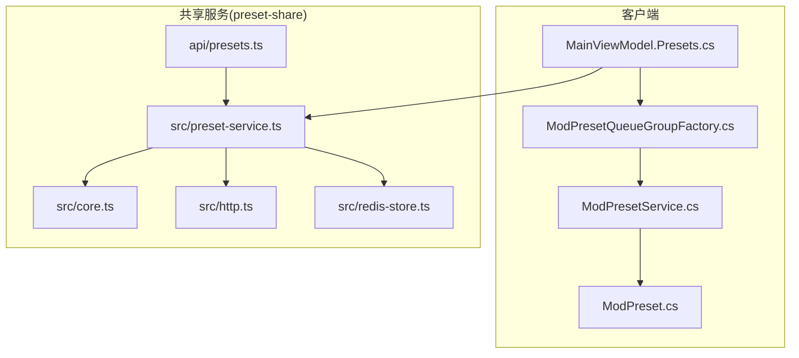
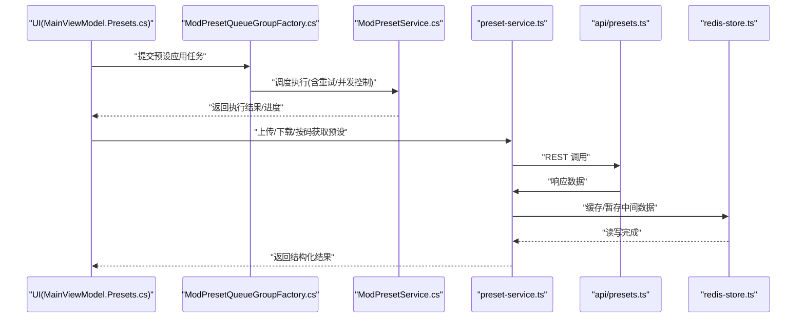
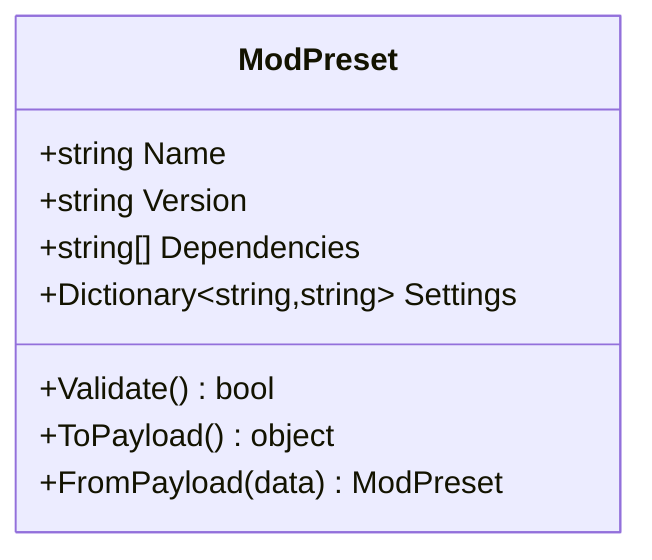
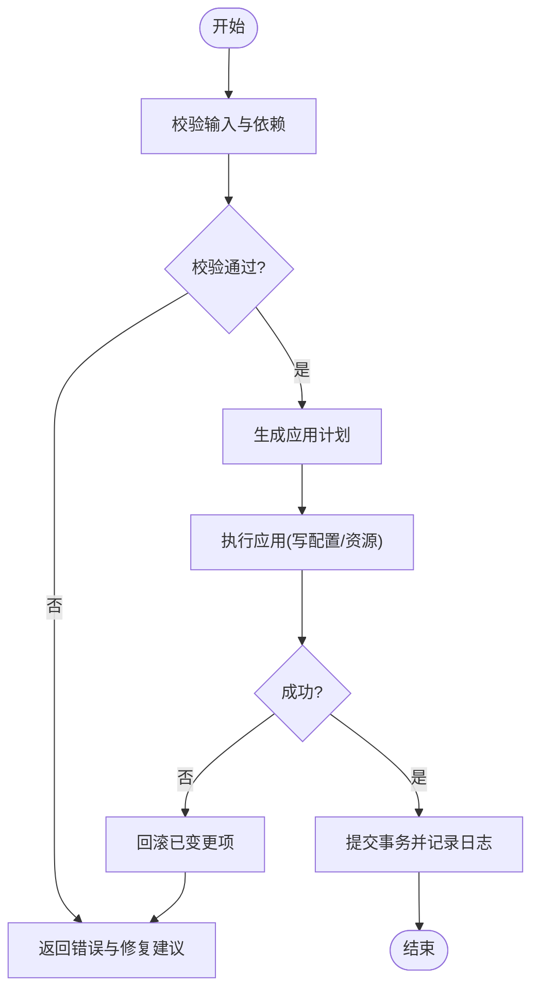
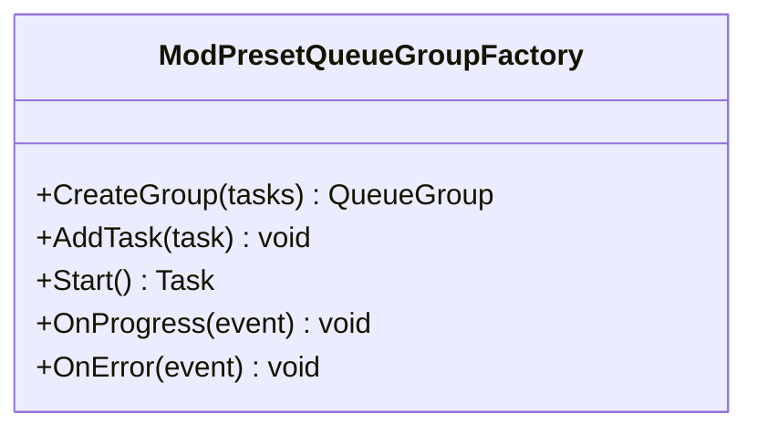
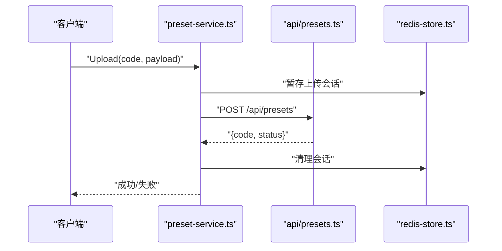
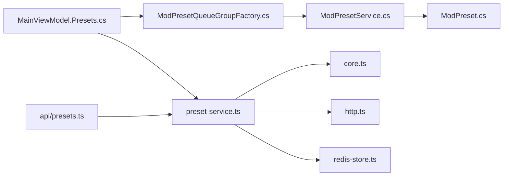

# 模组预设系统

<cite>
**本文引用的文件**   
- [ModPresetService.cs](file://src/Crystalfly.Core/Mods/ModPresetService.cs)
- [ModPreset.cs](file://src/Crystalfly.Core/Models/ModPreset.cs)
- [MainViewModel.Presets.cs](file://src/Crystalfly.App/ViewModels/MainViewModel.Presets.cs)
- [ModPresetQueueGroupFactory.cs](file://src/Crystalfly.App/Downloads/ModPresetQueueGroupFactory.cs)
- [preset-service.ts](file://services/preset-share/src/preset-service.ts)
- [core.ts](file://services/preset-share/src/core.ts)
- [http.ts](file://services/preset-share/src/http.ts)
- [redis-store.ts](file://services/preset-share/src/redis-store.ts)
- [presets.ts](file://services/preset-share/api/presets.ts)
- [api-handlers.test.ts](file://services/preset-share/test/api-handlers.test.ts)
- [core.test.ts](file://services/preset-share/test/core.test.ts)
- [http.test.ts](file://services/preset-share/test/http.test.ts)
- [preset-service.test.ts](file://services/preset-share/test/preset-service.test.ts)
- [ModPresetServiceTests.cs](file://tests/Crystalfly.Core.Tests/Mods/ModPresetServiceTests.cs)
- [ModPresetQueueGroupFactoryTests.cs](file://tests/Crystalfly.App.Tests/Downloads/ModPresetQueueGroupFactoryTests.cs)
</cite>

## 更新摘要
**所做更改**   
- 新增了完整的模组预设系统和分享基础设施文档
- 添加了ModPresetService、预设分享服务(preset-share)、代码分享功能和Redis存储支持
- 详细描述了创建、分享和应用精心策划的模组集合的功能
- 包含验证、冲突解决和依赖管理功能的完整说明

## 目录
1. [简介](#简介)
2. [项目结构](#项目结构)
3. [核心组件](#核心组件)
4. [架构总览](#架构总览)
5. [详细组件分析](#详细组件分析)
6. [依赖关系分析](#依赖关系分析)
7. [性能考量](#性能考量)
8. [故障排查指南](#故障排查指南)
9. [结论](#结论)
10. [附录](#附录)

## 简介
本文件围绕"模组预设系统"进行系统化文档化，覆盖客户端（C#/.NET）与共享服务（TypeScript/Node.js）两端的实现。该系统的目标是：
- 在本地实例中创建、应用、删除模组预设
- 通过队列机制安全地批量执行预设操作
- 提供云端共享能力，支持上传、下载、分享预设代码
- 保证数据一致性、幂等性与可恢复性

系统现在支持创建、分享和应用精心策划的模组集合，包含验证、冲突解决和依赖管理功能。

## 项目结构
从仓库视角看，模组预设系统横跨以下模块：
- 核心逻辑层（Core）：定义预设模型与服务接口，负责本地持久化与事务处理
- 应用层（App）：提供 UI 视图模型与下载队列集成，驱动用户交互与后台任务
- 共享服务（preset-share）：提供 REST API、HTTP 客户端、Redis 存储与核心业务逻辑
- 测试套件：覆盖核心服务、API 处理器、HTTP 客户端与队列工厂

图表来源
- [MainViewModel.Presets.cs](file://src/Crystalfly.App/ViewModels/MainViewModel.Presets.cs)
- [ModPresetQueueGroupFactory.cs](file://src/Crystalfly.App/Downloads/ModPresetQueueGroupFactory.cs)
- [ModPresetService.cs](file://src/Crystalfly.Core/Mods/ModPresetService.cs)
- [ModPreset.cs](file://src/Crystalfly.Core/Models/ModPreset.cs)
- [presets.ts](file://services/preset-share/api/presets.ts)
- [preset-service.ts](file://services/preset-share/src/preset-service.ts)
- [core.ts](file://services/preset-share/src/core.ts)
- [http.ts](file://services/preset-share/src/http.ts)
- [redis-store.ts](file://services/preset-share/src/redis-store.ts)

章节来源
- [ModPresetService.cs](file://src/Crystalfly.Core/Mods/ModPresetService.cs)
- [ModPreset.cs](file://src/Crystalfly.Core/Models/ModPreset.cs)
- [MainViewModel.Presets.cs](file://src/Crystalfly.App/ViewModels/MainViewModel.Presets.cs)
- [ModPresetQueueGroupFactory.cs](file://src/Crystalfly.App/Downloads/ModPresetQueueGroupFactory.cs)
- [preset-service.ts](file://services/preset-share/src/preset-service.ts)
- [core.ts](file://services/preset-share/src/core.ts)
- [http.ts](file://services/preset-share/src/http.ts)
- [redis-store.ts](file://services/preset-share/src/redis-store.ts)
- [presets.ts](file://services/preset-share/api/presets.ts)

## 核心组件
- 预设模型（ModPreset）：描述预设的元数据与内容结构，作为跨端传输与持久化的基础载体
- 预设服务（ModPresetService）：封装本地预设的增删改查与应用流程，确保事务一致性与错误回滚
- 预设队列组工厂（ModPresetQueueGroupFactory）：将预设应用任务纳入统一下载队列，支持并发控制与重试
- 预设共享服务（preset-service.ts）：封装与后端 API 的交互，包括上传、下载、按码检索与校验
- 共享核心（core.ts）：提供通用工具函数（如编码/解码、校验、幂等键生成等）
- HTTP 客户端（http.ts）：统一的网络请求封装，包含超时、重试、错误映射
- Redis 存储（redis-store.ts）：用于缓存或临时存储共享预设的中间态数据
- API 路由（api/presets.ts）：暴露 REST 接口，接收并转发到 preset-service

章节来源
- [ModPreset.cs](file://src/Crystalfly.Core/Models/ModPreset.cs)
- [ModPresetService.cs](file://src/Crystalfly.Core/Mods/ModPresetService.cs)
- [ModPresetQueueGroupFactory.cs](file://src/Crystalfly.App/Downloads/ModPresetQueueGroupFactory.cs)
- [preset-service.ts](file://services/preset-share/src/preset-service.ts)
- [core.ts](file://services/preset-share/src/core.ts)
- [http.ts](file://services/preset-share/src/http.ts)
- [redis-store.ts](file://services/preset-share/src/redis-store.ts)
- [presets.ts](file://services/preset-share/api/presets.ts)

## 架构总览
下图展示了从 UI 触发到服务端落盘的完整调用链，以及关键的数据流向与错误路径。

图表来源
- [MainViewModel.Presets.cs](file://src/Crystalfly.App/ViewModels/MainViewModel.Presets.cs)
- [ModPresetQueueGroupFactory.cs](file://src/Crystalfly.App/Downloads/ModPresetQueueGroupFactory.cs)
- [ModPresetService.cs](file://src/Crystalfly.Core/Mods/ModPresetService.cs)
- [preset-service.ts](file://services/preset-share/src/preset-service.ts)
- [presets.ts](file://services/preset-share/api/presets.ts)
- [redis-store.ts](file://services/preset-share/src/redis-store.ts)

## 详细组件分析

### 预设模型（ModPreset）
- 职责：承载预设的结构化数据，包括名称、版本、适用游戏版本、依赖说明、配置项集合等
- 复杂度：序列化/反序列化为 JSON；在本地与云端之间保持一致性
- 优化点：对大对象采用增量更新与差异合并策略，减少传输体积

图表来源
- [ModPreset.cs](file://src/Crystalfly.Core/Models/ModPreset.cs)

章节来源
- [ModPreset.cs](file://src/Crystalfly.Core/Models/ModPreset.cs)

### 预设服务（ModPresetService）
- 职责：
  - 本地预设的创建、读取、更新、删除
  - 应用预设时进行依赖解析、冲突检测与事务回滚
  - 与共享服务协作，支持按码同步
- 关键流程：
  - 应用前校验：检查目标实例状态、依赖满足情况
  - 应用过程：按顺序写入配置、安装必要资源、记录事务日志
  - 失败回滚：基于事务日志撤销已变更的文件与状态
- 错误处理：
  - 区分可重试错误（网络抖动、锁竞争）与不可重试错误（权限不足、格式非法）
  - 提供诊断信息（步骤、影响范围、建议修复）

图表来源
- [ModPresetService.cs](file://src/Crystalfly.Core/Mods/ModPresetService.cs)

章节来源
- [ModPresetService.cs](file://src/Crystalfly.Core/Mods/ModPresetService.cs)
- [ModPresetServiceTests.cs](file://tests/Crystalfly.Core.Tests/Mods/ModPresetServiceTests.cs)

### 预设队列组工厂（ModPresetQueueGroupFactory）
- 职责：
  - 将预设应用任务包装为队列项
  - 控制并发度、重试次数与退避策略
  - 聚合进度与错误，向 UI 推送状态
- 设计要点：
  - 与现有下载队列复用基础设施，降低耦合
  - 支持分组执行，避免同一实例的并发应用导致冲突

图表来源
- [ModPresetQueueGroupFactory.cs](file://src/Crystalfly.App/Downloads/ModPresetQueueGroupFactory.cs)

章节来源
- [ModPresetQueueGroupFactory.cs](file://src/Crystalfly.App/Downloads/ModPresetQueueGroupFactory.cs)
- [ModPresetQueueGroupFactoryTests.cs](file://tests/Crystalfly.App.Tests/Downloads/ModPresetQueueGroupFactoryTests.cs)

### 预设共享服务（preset-service.ts）
- 职责：
  - 封装上传、下载、按码查询等 API 调用
  - 处理网络异常、重试与超时
  - 与 Redis 存储协作，缓存热点预设或中间态
- 关键流程：
  - 上传：压缩/分片（可选）、签名校验、幂等键生成
  - 下载：按码检索、完整性校验、缓存命中优先
  - 错误映射：将底层错误转换为领域语义错误

图表来源
- [preset-service.ts](file://services/preset-share/src/preset-service.ts)
- [presets.ts](file://services/preset-share/api/presets.ts)
- [redis-store.ts](file://services/preset-share/src/redis-store.ts)

章节来源
- [preset-service.ts](file://services/preset-share/src/preset-service.ts)
- [api/preset-service.test.ts](file://services/preset-share/test/preset-service.test.ts)

### 共享核心（core.ts）
- 职责：提供通用工具函数，如哈希计算、校验和验证、编码/解码、幂等键生成
- 重要性：保障数据一致性与去重，避免重复上传/下载

章节来源
- [core.ts](file://services/preset-share/src/core.ts)
- [core.test.ts](file://services/preset-share/test/core.test.ts)

### HTTP 客户端（http.ts）
- 职责：统一封装网络请求，提供超时、重试、错误映射、日志记录
- 特性：
  - 指数退避重试
  - 可插拔的错误处理器
  - 请求/响应拦截器

章节来源
- [http.ts](file://services/preset-share/src/http.ts)
- [http.test.ts](file://services/preset-share/test/http.test.ts)

### Redis 存储（redis-store.ts）
- 职责：提供键值存储能力，用于缓存热点预设、上传会话、限流计数等
- 使用场景：
  - 上传中途断线恢复
  - 高频访问预设的内存级缓存
  - 分布式锁（可选）

章节来源
- [redis-store.ts](file://services/preset-share/src/redis-store.ts)

### API 路由（api/presets.ts）
- 职责：暴露 REST 接口，接收并转发到 preset-service
- 典型端点：
  - POST /api/presets：上传预设
  - GET /api/presets/{code}：按码下载预设
  - DELETE /api/presets/{code}：删除预设
- 安全与校验：
  - 输入校验、大小限制、类型检查
  - 鉴权与速率限制（可扩展）

章节来源
- [presets.ts](file://services/preset-share/api/presets.ts)
- [api-handlers.test.ts](file://services/preset-share/test/api-handlers.test.ts)

### UI 集成（MainViewModel.Presets.cs）
- 职责：
  - 提供预设相关的命令与状态绑定
  - 与队列工厂协作，展示进度与错误
  - 触发上传/下载共享预设的流程
- 用户体验：
  - 实时进度反馈
  - 失败提示与一键重试
  - 预设列表与详情展示

章节来源
- [MainViewModel.Presets.cs](file://src/Crystalfly.App/ViewModels/MainViewModel.Presets.cs)

## 依赖关系分析
- 客户端内部依赖：
  - MainViewModel.Presets 依赖 ModPresetQueueGroupFactory 与 ModPresetService
  - ModPresetService 依赖 ModPreset 模型与本地持久化设施
- 客户端与共享服务：
  - 通过 HTTP 调用 presets API，由 preset-service 封装
  - 使用 core 工具函数进行校验与幂等处理
  - 借助 redis-store 做缓存与会话管理

图表来源
- [MainViewModel.Presets.cs](file://src/Crystalfly.App/ViewModels/MainViewModel.Presets.cs)
- [ModPresetQueueGroupFactory.cs](file://src/Crystalfly.App/Downloads/ModPresetQueueGroupFactory.cs)
- [ModPresetService.cs](file://src/Crystalfly.Core/Mods/ModPresetService.cs)
- [ModPreset.cs](file://src/Crystalfly.Core/Models/ModPreset.cs)
- [preset-service.ts](file://services/preset-share/src/preset-service.ts)
- [core.ts](file://services/preset-share/src/core.ts)
- [http.ts](file://services/preset-share/src/http.ts)
- [redis-store.ts](file://services/preset-share/src/redis-store.ts)
- [presets.ts](file://services/preset-share/api/presets.ts)

章节来源
- [ModPresetService.cs](file://src/Crystalfly.Core/Mods/ModPresetService.cs)
- [ModPreset.cs](file://src/Crystalfly.Core/Models/ModPreset.cs)
- [MainViewModel.Presets.cs](file://src/Crystalfly.App/ViewModels/MainViewModel.Presets.cs)
- [ModPresetQueueGroupFactory.cs](file://src/Crystalfly.App/Downloads/ModPresetQueueGroupFactory.cs)
- [preset-service.ts](file://services/preset-share/src/preset-service.ts)
- [core.ts](file://services/preset-share/src/core.ts)
- [http.ts](file://services/preset-share/src/http.ts)
- [redis-store.ts](file://services/preset-share/src/redis-store.ts)
- [presets.ts](file://services/preset-share/api/presets.ts)

## 性能考量
- 本地应用：
  - 批量写入与事务合并，减少磁盘 I/O
  - 依赖图预解析，避免重复计算
- 共享服务：
  - 热点预设缓存（Redis），降低数据库压力
  - 上传分片与并行校验，提升吞吐
  - 指数退避重试，提高弱网稳定性
- UI 体验：
  - 队列分组与并发上限，避免界面卡顿
  - 增量进度上报，减少消息风暴

[本节为通用指导，不直接分析具体文件]

## 故障排查指南
- 常见错误分类：
  - 网络类：超时、连接中断、服务器错误
  - 数据类：格式非法、校验失败、缺失字段
  - 权限类：文件写入失败、实例被占用
- 定位方法：
  - 查看队列任务日志与错误堆栈
  - 核对预设校验结果与依赖满足情况
  - 检查 Redis 缓存是否命中与过期策略
- 恢复建议：
  - 重试失败任务（带退避）
  - 清理上传会话后重新上传
  - 回滚未完成的预设应用，修复依赖后重试

章节来源
- [ModPresetService.cs](file://src/Crystalfly.Core/Mods/ModPresetService.cs)
- [preset-service.ts](file://services/preset-share/src/preset-service.ts)
- [http.ts](file://services/preset-share/src/http.ts)
- [redis-store.ts](file://services/preset-share/src/redis-store.ts)

## 结论
模组预设系统通过清晰的层次划分与良好的错误处理机制，实现了本地高效应用与云端便捷共享的统一体验。客户端以队列为核心，保障并发与可恢复性；共享服务以 API 为中心，结合缓存与工具函数，提供稳定可靠的远程能力。系统在新增的完整预设管理和分享基础设施支持下，能够创建、分享和应用精心策划的模组集合，包含验证、冲突解决和依赖管理功能。建议在后续迭代中持续完善监控指标、扩展限流与鉴权策略，并进一步优化大数据量预设的传输与处理效率。

[本节为总结性内容，不直接分析具体文件]

## 附录
- 相关测试用例：
  - 核心服务测试：[ModPresetServiceTests.cs](file://tests/Crystalfly.Core.Tests/Mods/ModPresetServiceTests.cs)
  - 队列工厂测试：[ModPresetQueueGroupFactoryTests.cs](file://tests/Crystalfly.App.Tests/Downloads/ModPresetQueueGroupFactoryTests.cs)
  - 共享服务测试：
    - [api-handlers.test.ts](file://services/preset-share/test/api-handlers.test.ts)
    - [core.test.ts](file://services/preset-share/test/core.test.ts)
    - [http.test.ts](file://services/preset-share/test/http.test.ts)
    - [preset-service.test.ts](file://services/preset-share/test/preset-service.test.ts)