# 游戏实例管理

<cite>
**本文引用的文件**   
- [InstanceCloneService.cs](file://src/Crystalfly.Core/Instances/InstanceCloneService.cs)
- [InstanceDeletionService.cs](file://src/Crystalfly.Core/Instances/InstanceDeletionService.cs)
- [InstanceImportService.cs](file://src/Crystalfly.Core/Instances/InstanceImportService.cs)
- [InstanceDirectory.cs](file://src/Crystalfly.Core/Instances/InstanceDirectory.cs)
- [VersionDirectoryScanner.cs](file://src/Crystalfly.Core/Instances/VersionDirectoryScanner.cs)
- [BuildFingerprintService.cs](file://src/Crystalfly.Core/Instances/BuildFingerprintService.cs)
- [BuildIdentity.cs](file://src/Crystalfly.Core/Instances/BuildIdentity.cs)
- [LoaderStateDetector.cs](file://src/Crystalfly.Core/Loaders/LoaderStateDetector.cs)
- [InstanceRecord.cs](file://src/Crystalfly.Core/Models/InstanceRecord.cs)
- [BuildFingerprint.cs](file://src/Crystalfly.Core/Models/BuildFingerprint.cs)
- [InstanceSidecar.cs](file://src/Crystalfly.Core/Instances/InstanceSidecar.cs)
- [CrystalflyPaths.cs](file://src/Crystalfly.Core/Configuration/CrystalflyPaths.cs)
- [AtomicJsonStore.cs](file://src/Crystalfly.Core/Serialization/AtomicJsonStore.cs)
- [FileTransaction.cs](file://src/Crystalfly.Core/Transactions/FileTransaction.cs)
- [InstanceCloneServiceTests.cs](file://tests/Crystalfly.Core.Tests/Instances/InstanceCloneServiceTests.cs)
- [InstanceDeletionServiceTests.cs](file://tests/Crystalfly.Core.Tests/Instances/InstanceDeletionServiceTests.cs)
- [InstanceImportServiceTests.cs](file://tests/Crystalfly.Core.Tests/Instances/InstanceImportServiceTests.cs)
- [InstanceDirectoryTests.cs](file://tests/Crystalfly.Core.Tests/Instances/InstanceDirectoryTests.cs)
- [VersionDirectoryScannerTests.cs](file://tests/Crystalfly.Core.Tests/Instances/VersionDirectoryScannerTests.cs)
- [BuildFingerprintServiceTests.cs](file://tests/Crystalfly.Core.Tests/Instances/BuildFingerprintServiceTests.cs)
- [BuildIdentityTests.cs](file://tests/Crystalfly.Core.Tests/Instances/BuildIdentityTests.cs)
- [LoaderStateDetectorTests.cs](file://tests/Crystalfly.Core.Tests/Loaders/LoaderStateDetectorTests.cs)
</cite>

## 更新摘要
**所做更改**
- 新增 BuildIdentity 类文档，提供实例构建标识和跟踪功能
- 增强 LoaderStateDetector 的运行时证据检测能力
- 更新实例管理系统架构以反映新的构建标识机制
- 扩展冲突检测和恢复策略以支持新的标识系统

## 目录
1. [简介](#简介)
2. [项目结构](#项目结构)
3. [核心组件](#核心组件)
4. [架构总览](#架构总览)
5. [详细组件分析](#详细组件分析)
6. [依赖关系分析](#依赖关系分析)
7. [性能考量](#性能考量)
8. [故障排查指南](#故障排查指南)
9. [结论](#结论)
10. [附录](#附录)

## 简介
本章节面向"游戏实例管理"模块，聚焦以下目标：
- 实例生命周期管理：创建、克隆、导入、删除与状态维护。
- 构建指纹系统：生成与验证，确保实例一致性、可复现性与冲突检测。
- **新增构建标识系统**：通过 BuildIdentity 提供更精确的实例构建标识和跟踪功能。
- 实例克隆与导入：安全复制与外部包导入的完整流程。
- **增强的加载器检测**：LoaderStateDetector 从运行时证据检测加载器，提高应用程序对不同安装场景的鲁棒性。
- 数据模型与目录结构：InstanceRecord 模型、InstanceDirectory 目录约定与 VersionDirectoryScanner 扫描机制。
- API 接口与使用方式：核心服务的调用方法与典型用例。
- 冲突检测与恢复策略：命名冲突、版本冲突、文件锁与事务回滚。
- 性能优化与最佳实践：并发控制、增量操作、缓存与日志。

## 项目结构
实例管理相关代码位于 Crystalfly.Core/Instances 与 Models 目录，配合配置路径、序列化与事务工具共同实现。测试覆盖在 Crystalfly.Core.Tests/Instances 下。

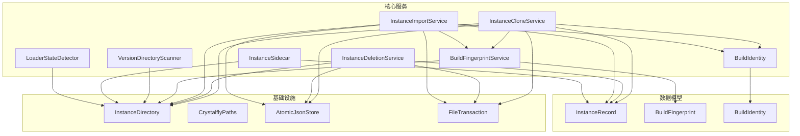

图表来源
- [InstanceCloneService.cs](file://src/Crystalfly.Core/Instances/InstanceCloneService.cs)
- [InstanceDeletionService.cs](file://src/Crystalfly.Core/Instances/InstanceDeletionService.cs)
- [InstanceImportService.cs](file://src/Crystalfly.Core/Instances/InstanceImportService.cs)
- [BuildFingerprintService.cs](file://src/Crystalfly.Core/Instances/BuildFingerprintService.cs)
- [BuildIdentity.cs](file://src/Crystalfly.Core/Instances/BuildIdentity.cs)
- [LoaderStateDetector.cs](file://src/Crystalfly.Core/Loaders/LoaderStateDetector.cs)
- [VersionDirectoryScanner.cs](file://src/Crystalfly.Core/Instances/VersionDirectoryScanner.cs)
- [InstanceDirectory.cs](file://src/Crystalfly.Core/Instances/InstanceDirectory.cs)
- [InstanceRecord.cs](file://src/Crystalfly.Core/Models/InstanceRecord.cs)
- [BuildFingerprint.cs](file://src/Crystalfly.Core/Models/BuildFingerprint.cs)
- [InstanceSidecar.cs](file://src/Crystalfly.Core/Instances/InstanceSidecar.cs)
- [CrystalflyPaths.cs](file://src/Crystalfly.Core/Configuration/CrystalflyPaths.cs)
- [AtomicJsonStore.cs](file://src/Crystalfly.Core/Serialization/AtomicJsonStore.cs)
- [FileTransaction.cs](file://src/Crystalfly.Core/Transactions/FileTransaction.cs)

## 核心组件
本节概述各核心服务的职责与交互关系，并给出关键能力说明。

- InstanceCloneService（实例克隆服务）
  - 负责基于现有实例创建新实例，支持选择性复制内容、更新元数据、重建构建指纹。
  - 处理命名冲突、目标路径存在性检查、原子写入与回滚。
  - 输出新的 InstanceRecord，并持久化到存储。

- InstanceDeletionService（实例删除服务）
  - 提供安全删除实例的能力，包括清理文件、移除记录、释放资源。
  - 支持幂等删除与部分失败恢复。

- InstanceImportService（实例导入服务）
  - 从外部包或目录导入为本地实例，校验完整性、生成构建指纹、注册记录。
  - 支持冲突检测与可选覆盖策略。

- BuildFingerprintService（构建指纹服务）
  - 对实例内容进行哈希计算，生成稳定且可复现的指纹。
  - 提供比对与验证方法，用于冲突检测与一致性校验。

- **BuildIdentity（构建标识）**
  - **新增**：提供实例构建的唯一标识和跟踪功能。
  - 包含构建时间、源信息、依赖版本等元数据。
  - 支持构建溯源和变更追踪。

- **LoaderStateDetector（加载器状态检测器）**
  - **增强**：从运行时证据检测加载器状态。
  - 提高应用程序对不同安装场景的鲁棒性。
  - 支持多种加载器类型的自动识别。

- VersionDirectoryScanner（版本目录扫描器）
  - 扫描实例的版本目录结构，识别已安装版本、依赖与清单。
  - 为导入、克隆与运行前检查提供基础信息。

- InstanceDirectory（实例目录抽象）
  - 封装实例根目录、版本子目录、配置文件与侧车文件的访问。
  - 定义目录约定与路径解析规则。

- InstanceRecord（实例记录模型）
  - 描述实例的元数据：名称、路径、版本、指纹、时间戳、标签等。
  - 作为持久化与查询的核心载体。

- InstanceSidecar（实例侧车）
  - 管理与实例相关的辅助数据与运行时上下文。

- 基础设施
  - CrystalflyPaths：全局路径配置。
  - AtomicJsonStore：原子 JSON 存储，保证记录写入的原子性。
  - FileTransaction：文件级事务，支持提交与回滚。

**章节来源**
- [InstanceCloneService.cs](file://src/Crystalfly.Core/Instances/InstanceCloneService.cs)
- [InstanceDeletionService.cs](file://src/Crystalfly.Core/Instances/InstanceDeletionService.cs)
- [InstanceImportService.cs](file://src/Crystalfly.Core/Instances/InstanceImportService.cs)
- [BuildFingerprintService.cs](file://src/Crystalfly.Core/Instances/BuildFingerprintService.cs)
- [BuildIdentity.cs](file://src/Crystalfly.Core/Instances/BuildIdentity.cs)
- [LoaderStateDetector.cs](file://src/Crystalfly.Core/Loaders/LoaderStateDetector.cs)
- [VersionDirectoryScanner.cs](file://src/Crystalfly.Core/Instances/VersionDirectoryScanner.cs)
- [InstanceDirectory.cs](file://src/Crystalfly.Core/Instances/InstanceDirectory.cs)
- [InstanceRecord.cs](file://src/Crystalfly.Core/Models/InstanceRecord.cs)
- [InstanceSidecar.cs](file://src/Crystalfly.Core/Instances/InstanceSidecar.cs)
- [CrystalflyPaths.cs](file://src/Crystalfly.Core/Configuration/CrystalflyPaths.cs)
- [AtomicJsonStore.cs](file://src/Crystalfly.Core/Serialization/AtomicJsonStore.cs)
- [FileTransaction.cs](file://src/Crystalfly.Core/Transactions/FileTransaction.cs)

## 架构总览
下图展示了实例管理的整体架构与服务间协作关系。

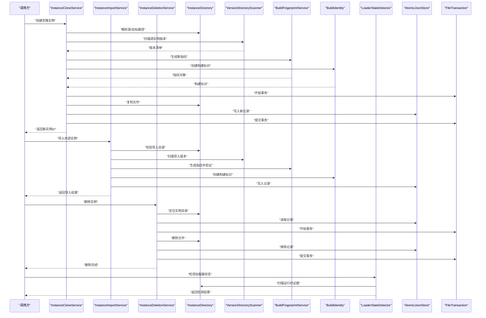

图表来源
- [InstanceCloneService.cs](file://src/Crystalfly.Core/Instances/InstanceCloneService.cs)
- [InstanceImportService.cs](file://src/Crystalfly.Core/Instances/InstanceImportService.cs)
- [InstanceDeletionService.cs](file://src/Crystalfly.Core/Instances/InstanceDeletionService.cs)
- [InstanceDirectory.cs](file://src/Crystalfly.Core/Instances/InstanceDirectory.cs)
- [VersionDirectoryScanner.cs](file://src/Crystalfly.Core/Instances/VersionDirectoryScanner.cs)
- [BuildFingerprintService.cs](file://src/Crystalfly.Core/Instances/BuildFingerprintService.cs)
- [BuildIdentity.cs](file://src/Crystalfly.Core/Instances/BuildIdentity.cs)
- [LoaderStateDetector.cs](file://src/Crystalfly.Core/Loaders/LoaderStateDetector.cs)
- [AtomicJsonStore.cs](file://src/Crystalfly.Core/Serialization/AtomicJsonStore.cs)
- [FileTransaction.cs](file://src/Crystalfly.Core/Transactions/FileTransaction.cs)

## 详细组件分析

### 实例克隆服务（InstanceCloneService）
- 功能要点
  - 输入：源实例标识或路径、目标实例名称、可选过滤规则。
  - 输出：新实例 ID 与 InstanceRecord。
  - 行为：路径校验、冲突检测、版本扫描、文件复制、指纹生成、记录持久化、事务提交。
- 关键流程
  - 解析源/目标路径，确认源实例存在且可读。
  - 使用 VersionDirectoryScanner 获取源版本清单。
  - 根据规则复制文件，必要时调整配置。
  - 调用 BuildFingerprintService 生成新指纹。
  - **新增**：创建 BuildIdentity 以跟踪构建来源和依赖信息。
  - 通过 AtomicJsonStore 写入新记录，使用 FileTransaction 保障原子性。
- 错误处理
  - 命名冲突：抛出冲突异常或返回冲突信息。
  - 权限不足：捕获 IO 异常并提示。
  - 事务失败：自动回滚并返回错误详情。

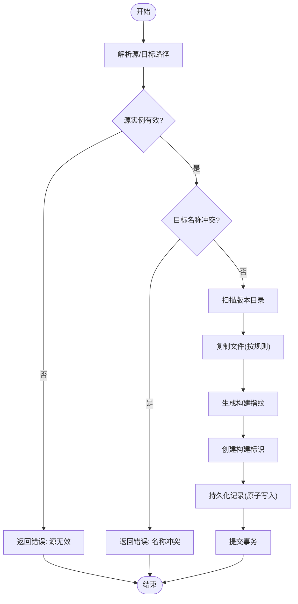

图表来源
- [InstanceCloneService.cs](file://src/Crystalfly.Core/Instances/InstanceCloneService.cs)
- [VersionDirectoryScanner.cs](file://src/Crystalfly.Core/Instances/VersionDirectoryScanner.cs)
- [BuildFingerprintService.cs](file://src/Crystalfly.Core/Instances/BuildFingerprintService.cs)
- [BuildIdentity.cs](file://src/Crystalfly.Core/Instances/BuildIdentity.cs)
- [AtomicJsonStore.cs](file://src/Crystalfly.Core/Serialization/AtomicJsonStore.cs)
- [FileTransaction.cs](file://src/Crystalfly.Core/Transactions/FileTransaction.cs)

**章节来源**
- [InstanceCloneService.cs](file://src/Crystalfly.Core/Instances/InstanceCloneService.cs)
- [InstanceCloneServiceTests.cs](file://tests/Crystalfly.Core.Tests/Instances/InstanceCloneServiceTests.cs)

### 实例删除服务（InstanceDeletionService）
- 功能要点
  - 输入：实例标识或路径。
  - 行为：定位实例目录、读取记录、删除文件、移除记录、事务提交。
  - 幂等性：重复删除不报错。
- 关键流程
  - 校验实例存在。
  - 使用 FileTransaction 包裹删除操作。
  - 删除成功后从 AtomicJsonStore 移除记录。
- 错误处理
  - 文件锁定：重试或提示用户关闭进程。
  - 权限问题：返回具体错误原因。
  - 部分失败：回滚并保留未删除部分以便后续修复。

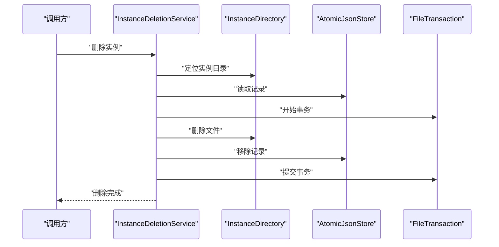

图表来源
- [InstanceDeletionService.cs](file://src/Crystalfly.Core/Instances/InstanceDeletionService.cs)
- [InstanceDirectory.cs](file://src/Crystalfly.Core/Instances/InstanceDirectory.cs)
- [AtomicJsonStore.cs](file://src/Crystalfly.Core/Serialization/AtomicJsonStore.cs)
- [FileTransaction.cs](file://src/Crystalfly.Core/Transactions/FileTransaction.cs)

**章节来源**
- [InstanceDeletionService.cs](file://src/Crystalfly.Core/Instances/InstanceDeletionService.cs)
- [InstanceDeletionServiceTests.cs](file://tests/Crystalfly.Core.Tests/Instances/InstanceDeletionServiceTests.cs)

### 实例导入服务（InstanceImportService）
- 功能要点
  - 输入：外部包或目录路径、目标实例名称、冲突策略。
  - 行为：校验导入源、扫描版本、生成指纹、冲突检测、持久化记录。
- 关键流程
  - 校验导入目录结构与必需文件。
  - 使用 VersionDirectoryScanner 获取版本清单。
  - 调用 BuildFingerprintService 生成指纹并进行一致性验证。
  - **新增**：创建 BuildIdentity 以记录导入来源和构建信息。
  - 若检测到冲突，依据策略选择跳过、覆盖或重命名。
  - 原子写入记录并返回导入结果。
- 错误处理
  - 结构不完整：返回缺失项列表。
  - 指纹不一致：提示重新打包或修复。
  - 冲突不可解决：返回冲突详情供上层决策。

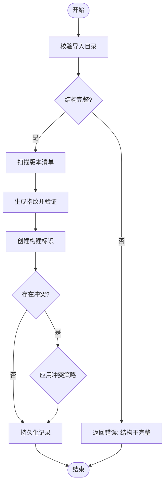

图表来源
- [InstanceImportService.cs](file://src/Crystalfly.Core/Instances/InstanceImportService.cs)
- [VersionDirectoryScanner.cs](file://src/Crystalfly.Core/Instances/VersionDirectoryScanner.cs)
- [BuildFingerprintService.cs](file://src/Crystalfly.Core/Instances/BuildFingerprintService.cs)
- [BuildIdentity.cs](file://src/Crystalfly.Core/Instances/BuildIdentity.cs)
- [AtomicJsonStore.cs](file://src/Crystalfly.Core/Serialization/AtomicJsonStore.cs)

**章节来源**
- [InstanceImportService.cs](file://src/Crystalfly.Core/Instances/InstanceImportService.cs)
- [InstanceImportServiceTests.cs](file://tests/Crystalfly.Core.Tests/Instances/InstanceImportServiceTests.cs)

### 构建指纹服务（BuildFingerprintService）
- 功能要点
  - 输入：实例目录路径、参与计算的规则集合。
  - 输出：BuildFingerprint 对象，包含算法、摘要、时间戳等。
  - 用途：一致性校验、冲突检测、变更追踪。
- 生成算法
  - 遍历受控文件集（如清单、关键二进制、配置）。
  - 使用稳定排序与规范化路径，避免平台差异。
  - 聚合哈希值，生成最终指纹。
- 验证流程
  - 对比已有指纹与新计算指纹。
  - 若不一致，返回差异详情（文件级或摘要级）。

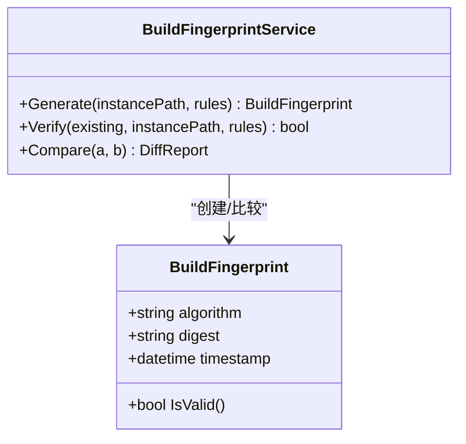

图表来源
- [BuildFingerprintService.cs](file://src/Crystalfly.Core/Instances/BuildFingerprintService.cs)
- [BuildFingerprint.cs](file://src/Crystalfly.Core/Models/BuildFingerprint.cs)

**章节来源**
- [BuildFingerprintService.cs](file://src/Crystalfly.Core/Instances/BuildFingerprintService.cs)
- [BuildFingerprint.cs](file://src/Crystalfly.Core/Models/BuildFingerprint.cs)
- [BuildFingerprintServiceTests.cs](file://tests/Crystalfly.Core.Tests/Instances/BuildFingerprintServiceTests.cs)

### 构建标识服务（BuildIdentity）
- **新增功能**
  - 提供实例构建的唯一标识和完整的跟踪信息。
  - 包含构建时间戳、源位置、依赖版本、构建环境等元数据。
  - 支持构建溯源和变更历史追踪。
- 核心特性
  - 唯一性：确保每个构建都有唯一的标识符。
  - 可追溯性：记录构建来源和依赖信息。
  - 兼容性：与现有 InstanceRecord 和 BuildFingerprint 集成。
- 使用场景
  - 实例克隆时记录源构建信息。
  - 导入外部实例时记录原始构建元数据。
  - 构建变更追踪和版本管理。

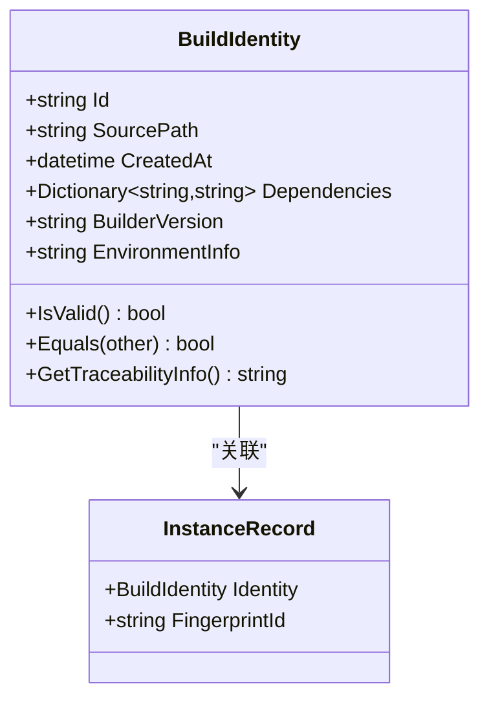

图表来源
- [BuildIdentity.cs](file://src/Crystalfly.Core/Instances/BuildIdentity.cs)
- [InstanceRecord.cs](file://src/Crystalfly.Core/Models/InstanceRecord.cs)

**章节来源**
- [BuildIdentity.cs](file://src/Crystalfly.Core/Instances/BuildIdentity.cs)
- [BuildIdentityTests.cs](file://tests/Crystalfly.Core.Tests/Instances/BuildIdentityTests.cs)

### 加载器状态检测器（LoaderStateDetector）
- **增强功能**
  - 从运行时证据检测加载器状态和环境。
  - 支持多种加载器类型的自动识别和验证。
  - 提高应用程序对不同安装场景的鲁棒性。
- 检测能力
  - 运行时环境检测：操作系统、.NET 版本、依赖库。
  - 加载器类型识别：Steam、独立、Mod 加载器等。
  - 兼容性验证：检查加载器与实例的兼容性。
- 应用场景
  - 实例启动前的环境预检。
  - 加载器故障诊断和恢复。
  - 多加载器环境的智能选择。

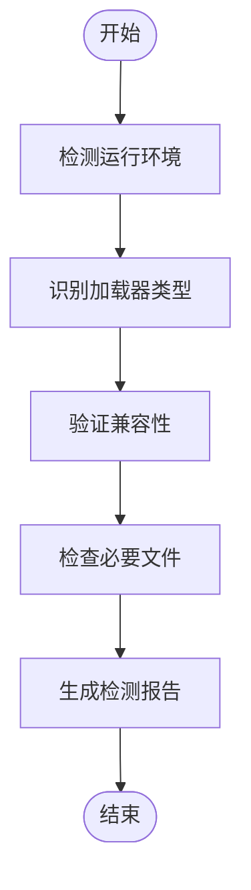

图表来源
- [LoaderStateDetector.cs](file://src/Crystalfly.Core/Loaders/LoaderStateDetector.cs)

**章节来源**
- [LoaderStateDetector.cs](file://src/Crystalfly.Core/Loaders/LoaderStateDetector.cs)
- [LoaderStateDetectorTests.cs](file://tests/Crystalfly.Core.Tests/Loaders/LoaderStateDetectorTests.cs)

### 版本目录扫描器（VersionDirectoryScanner）
- 功能要点
  - 扫描实例版本目录，识别已安装版本、依赖与清单文件。
  - 返回结构化清单，供克隆、导入与运行前检查使用。
- 扫描策略
  - 递归扫描版本子目录。
  - 解析清单文件，构建依赖图。
  - 忽略无关文件与临时文件。

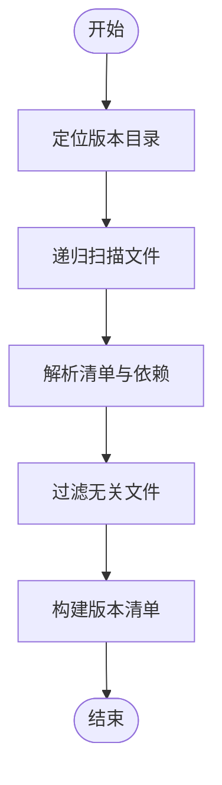

图表来源
- [VersionDirectoryScanner.cs](file://src/Crystalfly.Core/Instances/VersionDirectoryScanner.cs)

**章节来源**
- [VersionDirectoryScanner.cs](file://src/Crystalfly.Core/Instances/VersionDirectoryScanner.cs)
- [VersionDirectoryScannerTests.cs](file://tests/Crystalfly.Core.Tests/Instances/VersionDirectoryScannerTests.cs)

### 实例目录抽象（InstanceDirectory）
- 功能要点
  - 提供实例根目录、版本子目录、配置文件与侧车文件的统一访问。
  - 定义目录约定：根目录、版本目录、清单文件位置、侧车文件命名规范。
- 路径解析
  - 基于 CrystalflyPaths 提供的基路径。
  - 支持相对路径与绝对路径转换。

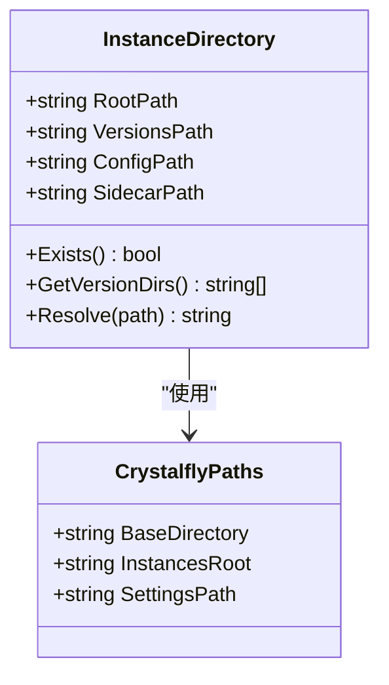

图表来源
- [InstanceDirectory.cs](file://src/Crystalfly.Core/Instances/InstanceDirectory.cs)
- [CrystalflyPaths.cs](file://src/Crystalfly.Core/Configuration/CrystalflyPaths.cs)

**章节来源**
- [InstanceDirectory.cs](file://src/Crystalfly.Core/Instances/InstanceDirectory.cs)
- [InstanceDirectoryTests.cs](file://tests/Crystalfly.Core.Tests/Instances/InstanceDirectoryTests.cs)

### 实例记录模型（InstanceRecord）
- 字段说明
  - 标识符：唯一 ID。
  - 名称：人类可读的名称。
  - 路径：实例根目录路径。
  - 版本：当前活跃版本。
  - 指纹：构建指纹引用。
  - **新增**：构建标识：BuildIdentity 引用。
  - 时间戳：创建与更新时间。
  - 标签：扩展属性。
- 用途
  - 作为持久化与查询的核心载体。
  - 与构建指纹和构建标识关联，用于一致性校验和溯源。

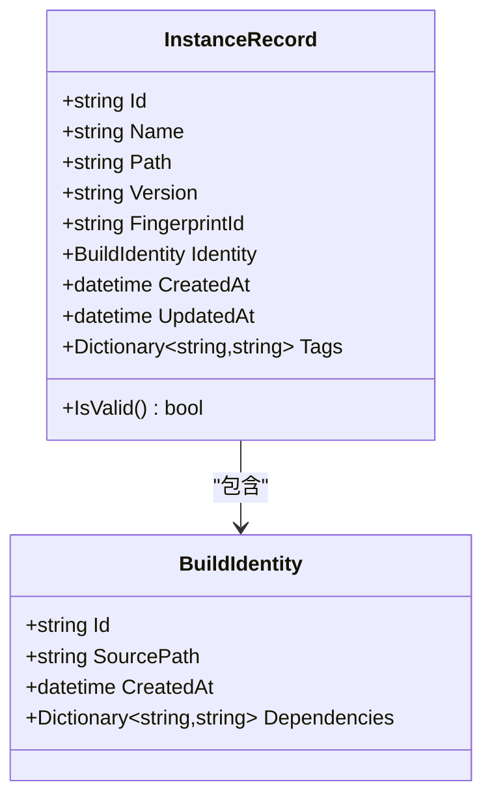

图表来源
- [InstanceRecord.cs](file://src/Crystalfly.Core/Models/InstanceRecord.cs)
- [BuildIdentity.cs](file://src/Crystalfly.Core/Instances/BuildIdentity.cs)

**章节来源**
- [InstanceRecord.cs](file://src/Crystalfly.Core/Models/InstanceRecord.cs)

### 实例侧车（InstanceSidecar）
- 功能要点
  - 管理与实例相关的辅助数据，如会话信息、运行时上下文。
  - 与 InstanceRecord 协同，提供完整的实例视图。

**章节来源**
- [InstanceSidecar.cs](file://src/Crystalfly.Core/Instances/InstanceSidecar.cs)

## 依赖关系分析
- 服务耦合
  - InstanceCloneService、InstanceImportService、InstanceDeletionService 均依赖 InstanceDirectory、AtomicJsonStore、FileTransaction。
  - 构建指纹服务独立于目录结构，但被克隆与导入服务调用。
  - **新增**：BuildIdentity 被克隆和导入服务用于构建跟踪。
  - **增强**：LoaderStateDetector 被运行时环境检测使用。
  - 版本扫描器为克隆与导入提供基础信息。
- 外部依赖
  - 文件系统访问、JSON 序列化、事务机制。
- 潜在循环依赖
  - 当前设计无直接循环依赖；服务层通过接口与数据模型解耦。

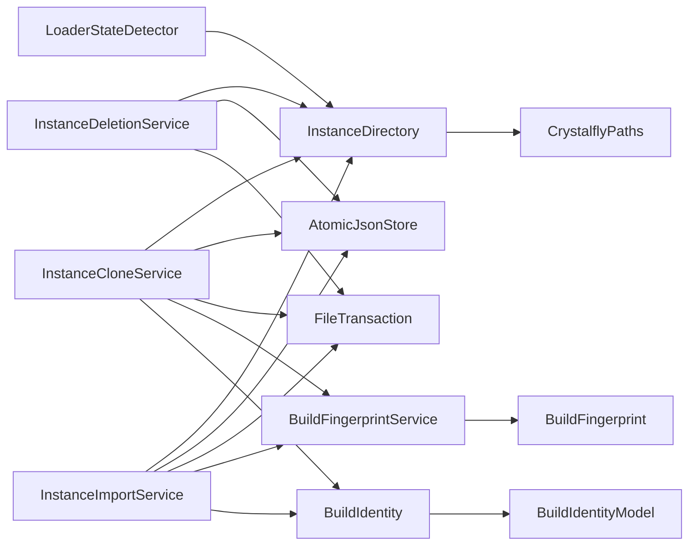

图表来源
- [InstanceCloneService.cs](file://src/Crystalfly.Core/Instances/InstanceCloneService.cs)
- [InstanceImportService.cs](file://src/Crystalfly.Core/Instances/InstanceImportService.cs)
- [InstanceDeletionService.cs](file://src/Crystalfly.Core/Instances/InstanceDeletionService.cs)
- [InstanceDirectory.cs](file://src/Crystalfly.Core/Instances/InstanceDirectory.cs)
- [BuildFingerprintService.cs](file://src/Crystalfly.Core/Instances/BuildFingerprintService.cs)
- [BuildIdentity.cs](file://src/Crystalfly.Core/Instances/BuildIdentity.cs)
- [LoaderStateDetector.cs](file://src/Crystalfly.Core/Loaders/LoaderStateDetector.cs)
- [BuildFingerprint.cs](file://src/Crystalfly.Core/Models/BuildFingerprint.cs)
- [CrystalflyPaths.cs](file://src/Crystalfly.Core/Configuration/CrystalflyPaths.cs)
- [AtomicJsonStore.cs](file://src/Crystalfly.Core/Serialization/AtomicJsonStore.cs)
- [FileTransaction.cs](file://src/Crystalfly.Core/Transactions/FileTransaction.cs)

**章节来源**
- [InstanceCloneService.cs](file://src/Crystalfly.Core/Instances/InstanceCloneService.cs)
- [InstanceImportService.cs](file://src/Crystalfly.Core/Instances/InstanceImportService.cs)
- [InstanceDeletionService.cs](file://src/Crystalfly.Core/Instances/InstanceDeletionService.cs)
- [InstanceDirectory.cs](file://src/Crystalfly.Core/Instances/InstanceDirectory.cs)
- [BuildFingerprintService.cs](file://src/Crystalfly.Core/Instances/BuildFingerprintService.cs)
- [BuildIdentity.cs](file://src/Crystalfly.Core/Instances/BuildIdentity.cs)
- [LoaderStateDetector.cs](file://src/Crystalfly.Core/Loaders/LoaderStateDetector.cs)
- [BuildFingerprint.cs](file://src/Crystalfly.Core/Models/BuildFingerprint.cs)
- [CrystalflyPaths.cs](file://src/Crystalfly.Core/Configuration/CrystalflyPaths.cs)
- [AtomicJsonStore.cs](file://src/Crystalfly.Core/Serialization/AtomicJsonStore.cs)
- [FileTransaction.cs](file://src/Crystalfly.Core/Transactions/FileTransaction.cs)

## 性能考量
- 文件复制优化
  - 使用并行复制与批量 I/O，减少系统调用开销。
  - 大文件采用流式传输，降低内存占用。
- 指纹计算优化
  - 增量计算：仅对变更文件重新计算摘要。
  - 缓存指纹结果，避免重复计算。
- **构建标识优化**
  - **新增**：延迟构建标识生成，仅在需要时创建。
  - 缓存构建标识信息，减少重复计算。
- **加载器检测优化**
  - **新增**：缓存加载器检测结果，避免重复扫描。
  - 异步检测非关键加载器状态。
- 事务与原子写入
  - 合并多次写入为单次事务提交，减少磁盘抖动。
  - 使用原子写入避免部分成功导致的脏数据。
- 扫描优化
  - 预过滤无关文件，减少递归深度。
  - 缓存扫描结果，支持失效策略。
- 并发控制
  - 限制并发任务数，避免 I/O 饱和。
  - 使用队列与背压机制保护系统稳定性。

## 故障排查指南
- 常见错误
  - 命名冲突：检查目标实例名称是否已存在，或启用自动重命名策略。
  - 权限不足：确认用户对实例目录具有读写权限。
  - 文件锁定：确保没有进程占用实例文件，或等待锁释放后重试。
  - 指纹不一致：核对构建规则与参与文件集，确保一致。
  - **新增**：构建标识冲突：检查构建标识的唯一性和冲突解决策略。
  - **新增**：加载器检测失败：验证运行环境和加载器兼容性。
- 恢复策略
  - 事务回滚：失败时自动恢复到操作前状态。
  - 部分删除恢复：记录已删除文件清单，支持断点续删。
  - 冲突解决：提供跳过、覆盖、重命名三种策略，由调用方决定。
  - **新增**：构建标识恢复：支持从备份恢复构建标识信息。
  - **新增**：加载器恢复：提供加载器降级和替代方案。
- 调试建议
  - 启用详细日志，记录关键步骤与异常堆栈。
  - 使用测试套件验证边界条件与异常路径。
  - **新增**：启用构建标识追踪，记录构建历史和依赖关系。
  - **新增**：启用加载器检测日志，记录环境信息和检测结果。

**章节来源**
- [InstanceCloneServiceTests.cs](file://tests/Crystalfly.Core.Tests/Instances/InstanceCloneServiceTests.cs)
- [InstanceDeletionServiceTests.cs](file://tests/Crystalfly.Core.Tests/Instances/InstanceDeletionServiceTests.cs)
- [InstanceImportServiceTests.cs](file://tests/Crystalfly.Core.Tests/Instances/InstanceImportServiceTests.cs)
- [BuildFingerprintServiceTests.cs](file://tests/Crystalfly.Core.Tests/Instances/BuildFingerprintServiceTests.cs)
- [BuildIdentityTests.cs](file://tests/Crystalfly.Core.Tests/Instances/BuildIdentityTests.cs)
- [LoaderStateDetectorTests.cs](file://tests/Crystalfly.Core.Tests/Loaders/LoaderStateDetectorTests.cs)

## 结论
本模块通过清晰的服务分层与数据模型，实现了稳定的实例生命周期管理。**新增的 BuildIdentity 类提供了更精确的实例构建标识和跟踪功能**，增强了构建溯源和变更追踪能力。**增强的 LoaderStateDetector 提高了应用程序对不同安装场景的鲁棒性**。构建指纹系统与版本扫描机制确保了实例的一致性与可追溯性。原子写入与事务机制提升了操作的可靠性。建议在大规模场景下引入缓存与增量计算以进一步优化性能。

## 附录
- 使用示例（以路径引用代替代码片段）
  - 创建克隆实例：参考 [InstanceCloneService.cs](file://src/Crystalfly.Core/Instances/InstanceCloneService.cs) 中的主要方法签名与参数说明。
  - 导入外部实例：参考 [InstanceImportService.cs](file://src/Crystalfly.Core/Instances/InstanceImportService.cs) 中的导入入口与冲突策略选项。
  - 删除实例：参考 [InstanceDeletionService.cs](file://src/Crystalfly.Core/Instances/InstanceDeletionService.cs) 中的删除流程与幂等处理。
  - 生成与验证指纹：参考 [BuildFingerprintService.cs](file://src/Crystalfly.Core/Instances/BuildFingerprintService.cs) 与 [BuildFingerprint.cs](file://src/Crystalfly.Core/Models/BuildFingerprint.cs)。
  - **新增**：创建构建标识：参考 [BuildIdentity.cs](file://src/Crystalfly.Core/Instances/BuildIdentity.cs) 中的构建标识创建和使用方法。
  - **新增**：检测加载器状态：参考 [LoaderStateDetector.cs](file://src/Crystalfly.Core/Loaders/LoaderStateDetector.cs) 中的运行时环境检测方法。
  - 扫描版本目录：参考 [VersionDirectoryScanner.cs](file://src/Crystalfly.Core/Instances/VersionDirectoryScanner.cs)。
  - 目录与路径：参考 [InstanceDirectory.cs](file://src/Crystalfly.Core/Instances/InstanceDirectory.cs) 与 [CrystalflyPaths.cs](file://src/Crystalfly.Core/Configuration/CrystalflyPaths.cs)。
  - 记录持久化：参考 [AtomicJsonStore.cs](file://src/Crystalfly.Core/Serialization/AtomicJsonStore.cs) 与 [FileTransaction.cs](file://src/Crystalfly.Core/Transactions/FileTransaction.cs)。