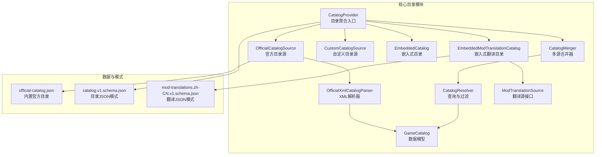
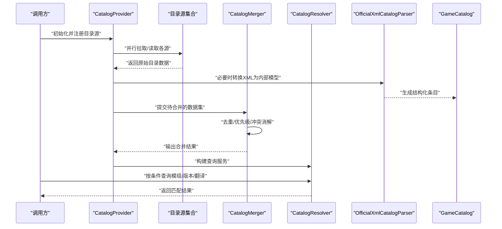
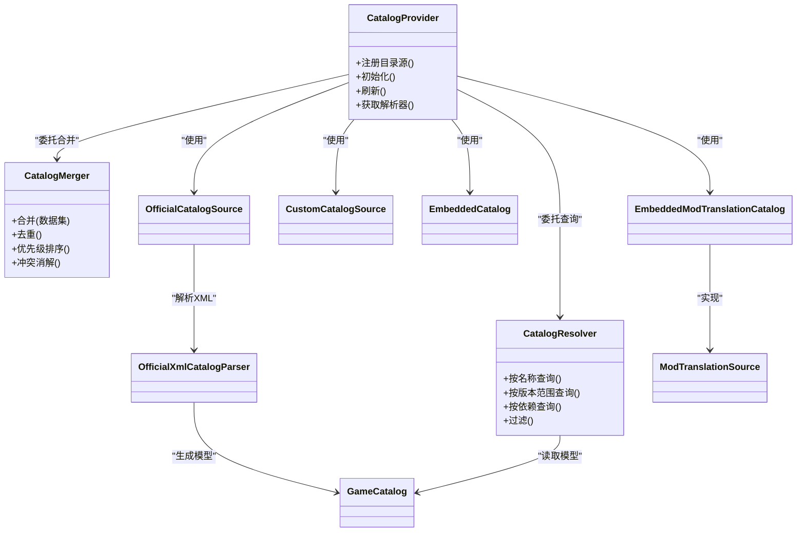
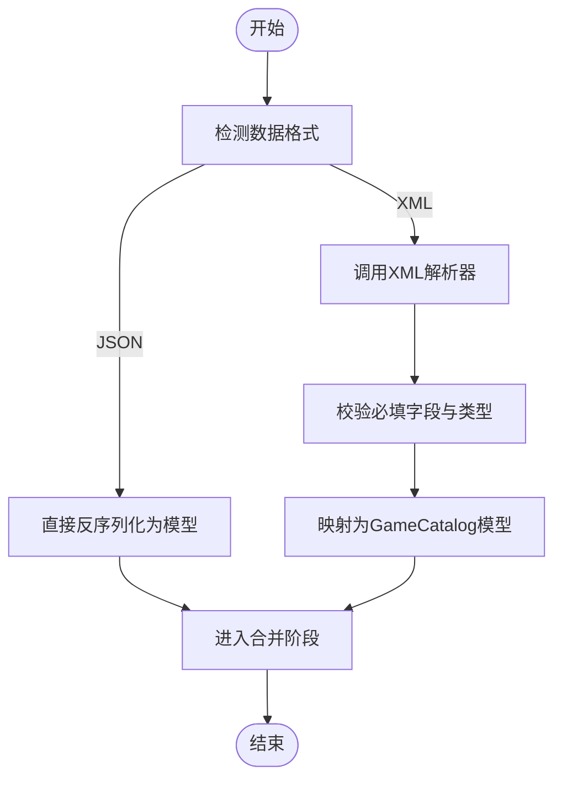
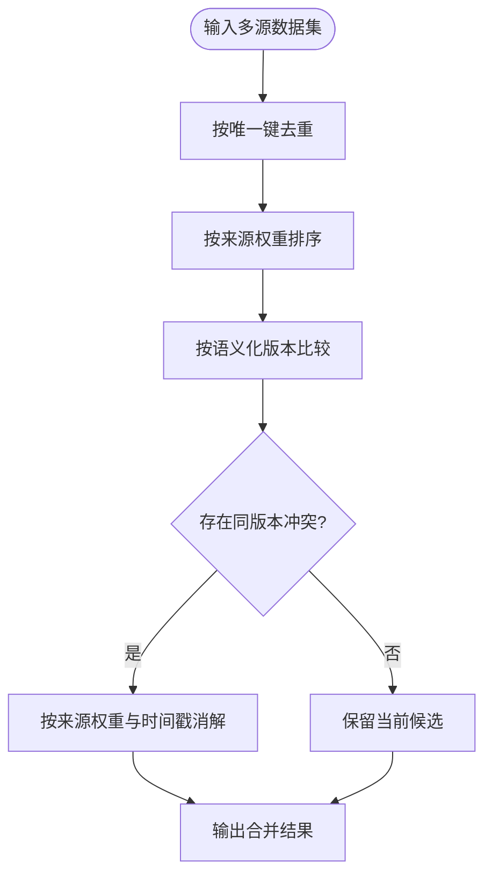
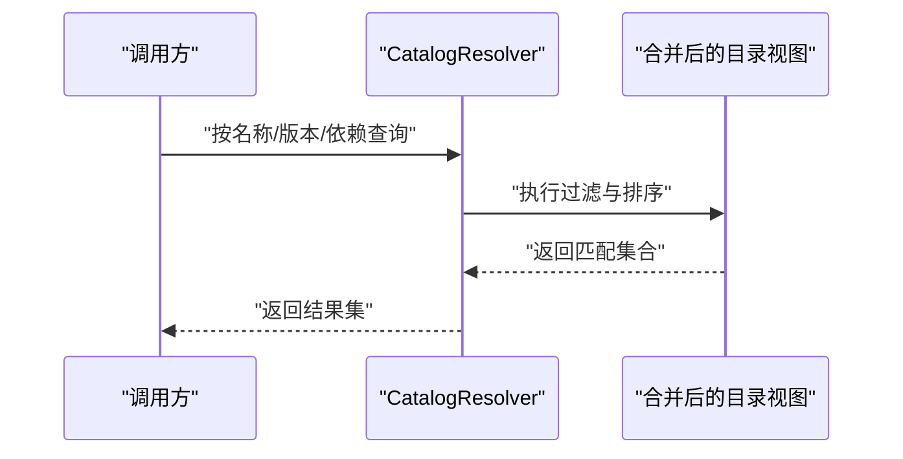
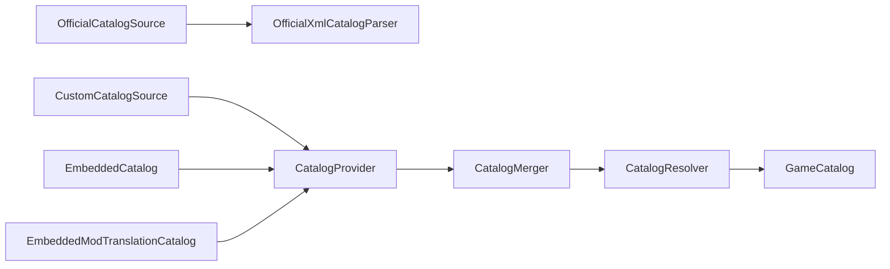

# 目录系统

<cite>
**本文引用的文件**   
- [CatalogProvider.cs](file://src/Crystalfly.Core/Catalog/CatalogProvider.cs)
- [CatalogMerger.cs](file://src/Crystalfly.Core/Catalog/CatalogMerger.cs)
- [CatalogResolver.cs](file://src/Crystalfly.Core/Catalog/CatalogResolver.cs)
- [OfficialCatalogSource.cs](file://src/Crystalfly.Core/Catalog/OfficialCatalogSource.cs)
- [CustomCatalogSource.cs](file://src/Crystalfly.Core/Catalog/CustomCatalogSource.cs)
- [EmbeddedCatalog.cs](file://src/Crystalfly.Core/Catalog/EmbeddedCatalog.cs)
- [EmbeddedModTranslationCatalog.cs](file://src/Crystalfly.Core/Catalog/EmbeddedModTranslationCatalog.cs)
- [OfficialXmlCatalogParser.cs](file://src/Crystalfly.Core/Catalog/OfficialXmlCatalogParser.cs)
- [GameCatalog.cs](file://src/Crystalfly.Core/Models/GameCatalog.cs)
- [ModTranslationSource.cs](file://src/Crystalfly.Core/Catalog/ModTranslationSource.cs)
- [official-catalog.json](file://src/Crystalfly.Core/Data/official-catalog.json)
- [catalog.v1.schema.json](file://catalog/catalog.v1.schema.json)
- [mod-translations.zh-CN.v1.schema.json](file://catalog/mod-translations.zh-CN.v1.schema.json)
- [CatalogProviderTests.cs](file://tests/Crystalfly.Core.Tests/Catalog/CatalogProviderTests.cs)
- [CatalogMergerTests.cs](file://tests/Crystalfly.Core.Tests/Catalog/CatalogMergerTests.cs)
- [CatalogResolverTests.cs](file://tests/Crystalfly.Core.Tests/Catalog/CatalogResolverTests.cs)
- [CustomCatalogSourceTests.cs](file://tests/Crystalfly.Core.Tests/Catalog/CustomCatalogSourceTests.cs)
- [EmbeddedCatalogTests.cs](file://tests/Crystalfly.Core.Tests/Catalog/EmbeddedCatalogTests.cs)
- [OfficialCatalogSourceTests.cs](file://tests/Crystalfly.Core.Tests/Catalog/OfficialCatalogSourceTests.cs)
- [OfficialXmlCatalogParserTests.cs](file://tests/Crystalfly.Core.Tests/Catalog/OfficialXmlCatalogParserTests.cs)
</cite>

## 目录
1. [简介](#简介)
2. [项目结构](#项目结构)
3. [核心组件](#核心组件)
4. [架构总览](#架构总览)
5. [详细组件分析](#详细组件分析)
6. [依赖关系分析](#依赖关系分析)
7. [性能考虑](#性能考虑)
8. [故障排查指南](#故障排查指南)
9. [结论](#结论)
10. [附录](#附录)

## 简介
本章节面向模组目录系统的整体设计与使用，重点覆盖以下目标：
- 解释 CatalogProvider、CatalogMerger、CatalogResolver 等核心组件的职责与协作方式
- 说明官方目录源、自定义目录源、嵌入式目录等数据源的集成方式
- 记录 GameCatalog 数据模型、XML 目录解析器与目录合并算法
- 提供添加自定义目录源、解析模组信息、合并多个目录数据的实践路径
- 阐述目录缓存机制与更新策略
- 给出目录格式规范与扩展指南
- 处理目录同步与冲突解决机制

## 项目结构
目录系统位于 Crystalfly.Core 的 Catalog 子命名空间下，围绕“提供者—合并—解析”的分层设计组织代码。同时包含数据模型、内置数据源与测试用例。

图表来源
- [CatalogProvider.cs](file://src/Crystalfly.Core/Catalog/CatalogProvider.cs)
- [CatalogMerger.cs](file://src/Crystalfly.Core/Catalog/CatalogMerger.cs)
- [CatalogResolver.cs](file://src/Crystalfly.Core/Catalog/CatalogResolver.cs)
- [OfficialCatalogSource.cs](file://src/Crystalfly.Core/Catalog/OfficialCatalogSource.cs)
- [CustomCatalogSource.cs](file://src/Crystalfly.Core/Catalog/CustomCatalogSource.cs)
- [EmbeddedCatalog.cs](file://src/Crystalfly.Core/Catalog/EmbeddedCatalog.cs)
- [EmbeddedModTranslationCatalog.cs](file://src/Crystalfly.Core/Catalog/EmbeddedModTranslationCatalog.cs)
- [OfficialXmlCatalogParser.cs](file://src/Crystalfly.Core/Catalog/OfficialXmlCatalogParser.cs)
- [GameCatalog.cs](file://src/Crystalfly.Core/Models/GameCatalog.cs)
- [ModTranslationSource.cs](file://src/Crystalfly.Core/Catalog/ModTranslationSource.cs)
- [official-catalog.json](file://src/Crystalfly.Core/Data/official-catalog.json)
- [catalog.v1.schema.json](file://catalog/catalog.v1.schema.json)
- [mod-translations.zh-CN.v1.schema.json](file://catalog/mod-translations.zh-CN.v1.schema.json)

章节来源
- [CatalogProvider.cs](file://src/Crystalfly.Core/Catalog/CatalogProvider.cs)
- [CatalogMerger.cs](file://src/Crystalfly.Core/Catalog/CatalogMerger.cs)
- [CatalogResolver.cs](file://src/Crystalfly.Core/Catalog/CatalogResolver.cs)
- [OfficialCatalogSource.cs](file://src/Crystalfly.Core/Catalog/OfficialCatalogSource.cs)
- [CustomCatalogSource.cs](file://src/Crystalfly.Core/Catalog/CustomCatalogSource.cs)
- [EmbeddedCatalog.cs](file://src/Crystalfly.Core/Catalog/EmbeddedCatalog.cs)
- [EmbeddedModTranslationCatalog.cs](file://src/Crystalfly.Core/Catalog/EmbeddedModTranslationCatalog.cs)
- [OfficialXmlCatalogParser.cs](file://src/Crystalfly.Core/Catalog/OfficialXmlCatalogParser.cs)
- [GameCatalog.cs](file://src/Crystalfly.Core/Models/GameCatalog.cs)
- [ModTranslationSource.cs](file://src/Crystalfly.Core/Catalog/ModTranslationSource.cs)
- [official-catalog.json](file://src/Crystalfly.Core/Data/official-catalog.json)
- [catalog.v1.schema.json](file://catalog/catalog.v1.schema.json)
- [mod-translations.zh-CN.v1.schema.json](file://catalog/mod-translations.zh-CN.v1.schema.json)

## 核心组件
本节聚焦三大核心组件的职责与交互：
- CatalogProvider：统一接入多种目录源（官方、自定义、嵌入式），负责初始化、加载与对外暴露能力
- CatalogMerger：将来自不同源的模组条目进行去重、优先级排序与冲突消解，输出一致视图
- CatalogResolver：基于合并后的目录执行查询、过滤、版本选择与依赖相关检索

关键要点
- 各目录源实现统一的读取接口，支持异步加载与错误隔离
- 合并阶段遵循“权威优先、本地覆盖、语义化版本比较”的策略
- 解析器提供稳定的查询 API，屏蔽底层数据源差异

章节来源
- [CatalogProvider.cs](file://src/Crystalfly.Core/Catalog/CatalogProvider.cs)
- [CatalogMerger.cs](file://src/Crystalfly.Core/Catalog/CatalogMerger.cs)
- [CatalogResolver.cs](file://src/Crystalfly.Core/Catalog/CatalogResolver.cs)

## 架构总览
下图展示了从数据源到查询的整体流程：Provider 聚合多个 Source，经 Merger 合并后由 Resolver 提供查询能力；官方源通过 XML 解析器转换为内部模型；嵌入式翻译目录提供本地化增强。

图表来源
- [CatalogProvider.cs](file://src/Crystalfly.Core/Catalog/CatalogProvider.cs)
- [CatalogMerger.cs](file://src/Crystalfly.Core/Catalog/CatalogMerger.cs)
- [CatalogResolver.cs](file://src/Crystalfly.Core/Catalog/CatalogResolver.cs)
- [OfficialXmlCatalogParser.cs](file://src/Crystalfly.Core/Catalog/OfficialXmlCatalogParser.cs)
- [GameCatalog.cs](file://src/Crystalfly.Core/Models/GameCatalog.cs)

## 详细组件分析

### CatalogProvider 目录提供者
职责
- 管理所有目录源的生命周期与配置
- 协调并发加载与错误恢复
- 将合并后的目录暴露给上层应用

典型用法
- 注册官方源、自定义源与嵌入式源
- 触发一次性或增量刷新
- 获取用于查询的解析器实例

章节来源
- [CatalogProvider.cs](file://src/Crystalfly.Core/Catalog/CatalogProvider.cs)
- [OfficialCatalogSource.cs](file://src/Crystalfly.Core/Catalog/OfficialCatalogSource.cs)
- [CustomCatalogSource.cs](file://src/Crystalfly.Core/Catalog/CustomCatalogSource.cs)
- [EmbeddedCatalog.cs](file://src/Crystalfly.Core/Catalog/EmbeddedCatalog.cs)
- [EmbeddedModTranslationCatalog.cs](file://src/Crystalfly.Core/Catalog/EmbeddedModTranslationCatalog.cs)
- [CatalogProviderTests.cs](file://tests/Crystalfly.Core.Tests/Catalog/CatalogProviderTests.cs)

### CatalogMerger 目录合并器
职责
- 对多源数据进行去重与优先级排序
- 依据版本语义与来源权重解决冲突
- 保证最终目录的一致性与可重现性

合并策略
- 唯一键：以模组标识为主键，避免重复
- 优先级：官方 > 内置 > 自定义（可按配置调整）
- 版本选择：采用语义化版本比较，选择最高兼容版本
- 冲突消解：当同一版本存在多条时，按来源权重与时间戳决定

章节来源
- [CatalogMerger.cs](file://src/Crystalfly.Core/Catalog/CatalogMerger.cs)
- [CatalogMergerTests.cs](file://tests/Crystalfly.Core.Tests/Catalog/CatalogMergerTests.cs)

### CatalogResolver 目录解析器
职责
- 提供稳定查询接口：按名称、标签、版本范围、依赖关系筛选
- 封装合并后的目录视图，屏蔽底层差异
- 支持分页、排序与常用过滤组合

章节来源
- [CatalogResolver.cs](file://src/Crystalfly.Core/Catalog/CatalogResolver.cs)
- [CatalogResolverTests.cs](file://tests/Crystalfly.Core.Tests/Catalog/CatalogResolverTests.cs)

### 官方目录源 OfficialCatalogSource
职责
- 从官方渠道获取目录数据
- 支持 JSON 与 XML 两种格式
- 在需要时将 XML 转换为内部模型

章节来源
- [OfficialCatalogSource.cs](file://src/Crystalfly.Core/Catalog/OfficialCatalogSource.cs)
- [OfficialCatalogSourceTests.cs](file://tests/Crystalfly.Core.Tests/Catalog/OfficialCatalogSourceTests.cs)

### 自定义目录源 CustomCatalogSource
职责
- 允许用户引入外部目录（如本地文件或远程 URL）
- 支持校验与错误隔离，不影响其他源
- 便于团队共享私有模组清单

章节来源
- [CustomCatalogSource.cs](file://src/Crystalfly.Core/Catalog/CustomCatalogSource.cs)
- [CustomCatalogSourceTests.cs](file://tests/Crystalfly.Core.Tests/Catalog/CustomCatalogSourceTests.cs)

### 嵌入式目录 EmbeddedCatalog
职责
- 打包随程序分发的目录数据
- 启动即加载，无需网络访问
- 适合基础元数据与离线场景

章节来源
- [EmbeddedCatalog.cs](file://src/Crystalfly.Core/Catalog/EmbeddedCatalog.cs)
- [EmbeddedCatalogTests.cs](file://tests/Crystalfly.Core.Tests/Catalog/EmbeddedCatalogTests.cs)

### 嵌入式翻译目录 EmbeddedModTranslationCatalog
职责
- 提供内嵌的多语言翻译资源
- 与模组条目关联，提升本地化体验

章节来源
- [EmbeddedModTranslationCatalog.cs](file://src/Crystalfly.Core/Catalog/EmbeddedModTranslationCatalog.cs)
- [ModTranslationSource.cs](file://src/Crystalfly.Core/Catalog/ModTranslationSource.cs)

### 官方XML目录解析器 OfficialXmlCatalogParser
职责
- 将官方 XML 目录解析为内部数据结构
- 校验必填字段与类型约束
- 映射为 GameCatalog 模型供后续处理

章节来源
- [OfficialXmlCatalogParser.cs](file://src/Crystalfly.Core/Catalog/OfficialXmlCatalogParser.cs)
- [OfficialXmlCatalogParserTests.cs](file://tests/Crystalfly.Core.Tests/Catalog/OfficialXmlCatalogParserTests.cs)

### 数据模型 GameCatalog
职责
- 定义模组条目的核心字段：标识、名称、版本、依赖、描述、下载链接等
- 作为跨源统一的数据载体
- 支撑序列化、验证与查询

章节来源
- [GameCatalog.cs](file://src/Crystalfly.Core/Models/GameCatalog.cs)

## 依赖关系分析
下图展示核心类之间的依赖与继承关系，体现“源—合并—解析”的清晰分层。

图表来源
- [CatalogProvider.cs](file://src/Crystalfly.Core/Catalog/CatalogProvider.cs)
- [CatalogMerger.cs](file://src/Crystalfly.Core/Catalog/CatalogMerger.cs)
- [CatalogResolver.cs](file://src/Crystalfly.Core/Catalog/CatalogResolver.cs)
- [OfficialCatalogSource.cs](file://src/Crystalfly.Core/Catalog/OfficialCatalogSource.cs)
- [CustomCatalogSource.cs](file://src/Crystalfly.Core/Catalog/CustomCatalogSource.cs)
- [EmbeddedCatalog.cs](file://src/Crystalfly.Core/Catalog/EmbeddedCatalog.cs)
- [EmbeddedModTranslationCatalog.cs](file://src/Crystalfly.Core/Catalog/EmbeddedModTranslationCatalog.cs)
- [OfficialXmlCatalogParser.cs](file://src/Crystalfly.Core/Catalog/OfficialXmlCatalogParser.cs)
- [GameCatalog.cs](file://src/Crystalfly.Core/Models/GameCatalog.cs)
- [ModTranslationSource.cs](file://src/Crystalfly.Core/Catalog/ModTranslationSource.cs)

## 详细组件分析

### 官方目录源与XML解析流程
官方源支持 JSON 与 XML 双格式。当检测到 XML 时，交由解析器转换为内部模型，再进入合并阶段。

图表来源
- [OfficialCatalogSource.cs](file://src/Crystalfly.Core/Catalog/OfficialCatalogSource.cs)
- [OfficialXmlCatalogParser.cs](file://src/Crystalfly.Core/Catalog/OfficialXmlCatalogParser.cs)
- [GameCatalog.cs](file://src/Crystalfly.Core/Models/GameCatalog.cs)

章节来源
- [OfficialCatalogSource.cs](file://src/Crystalfly.Core/Catalog/OfficialCatalogSource.cs)
- [OfficialXmlCatalogParser.cs](file://src/Crystalfly.Core/Catalog/OfficialXmlCatalogParser.cs)

### 目录合并算法
合并过程遵循“去重—优先级—版本比较—冲突消解”的流程。

图表来源
- [CatalogMerger.cs](file://src/Crystalfly.Core/Catalog/CatalogMerger.cs)

章节来源
- [CatalogMerger.cs](file://src/Crystalfly.Core/Catalog/CatalogMerger.cs)
- [CatalogMergerTests.cs](file://tests/Crystalfly.Core.Tests/Catalog/CatalogMergerTests.cs)

### 查询与过滤流程
解析器提供稳定的查询接口，屏蔽底层差异。

图表来源
- [CatalogResolver.cs](file://src/Crystalfly.Core/Catalog/CatalogResolver.cs)

章节来源
- [CatalogResolver.cs](file://src/Crystalfly.Core/Catalog/CatalogResolver.cs)
- [CatalogResolverTests.cs](file://tests/Crystalfly.Core.Tests/Catalog/CatalogResolverTests.cs)

### 数据模型与模式
- GameCatalog：定义模组条目核心字段，贯穿解析、合并与查询全流程
- catalog.v1.schema.json：目录 JSON 的结构化模式，用于校验与提示
- mod-translations.zh-CN.v1.schema.json：翻译目录的模式，确保本地化资源一致性

章节来源
- [GameCatalog.cs](file://src/Crystalfly.Core/Models/GameCatalog.cs)
- [catalog.v1.schema.json](file://catalog/catalog.v1.schema.json)
- [mod-translations.zh-CN.v1.schema.json](file://catalog/mod-translations.zh-CN.v1.schema.json)

### 内置官方目录
- official-catalog.json：随程序分发的官方目录数据，作为默认数据源之一，可在无网络环境下提供基础能力

章节来源
- [official-catalog.json](file://src/Crystalfly.Core/Data/official-catalog.json)

## 依赖关系分析
- 低耦合：各目录源独立实现，通过统一接口被 Provider 聚合
- 高内聚：合并与解析逻辑集中在对应组件中，职责清晰
- 可扩展：新增数据源只需实现标准接口，无需改动现有流程
- 可测试：每个组件均有对应测试，保障行为正确性

图表来源
- [OfficialCatalogSource.cs](file://src/Crystalfly.Core/Catalog/OfficialCatalogSource.cs)
- [OfficialXmlCatalogParser.cs](file://src/Crystalfly.Core/Catalog/OfficialXmlCatalogParser.cs)
- [CustomCatalogSource.cs](file://src/Crystalfly.Core/Catalog/CustomCatalogSource.cs)
- [EmbeddedCatalog.cs](file://src/Crystalfly.Core/Catalog/EmbeddedCatalog.cs)
- [EmbeddedModTranslationCatalog.cs](file://src/Crystalfly.Core/Catalog/EmbeddedModTranslationCatalog.cs)
- [CatalogProvider.cs](file://src/Crystalfly.Core/Catalog/CatalogProvider.cs)
- [CatalogMerger.cs](file://src/Crystalfly.Core/Catalog/CatalogMerger.cs)
- [CatalogResolver.cs](file://src/Crystalfly.Core/Catalog/CatalogResolver.cs)
- [GameCatalog.cs](file://src/Crystalfly.Core/Models/GameCatalog.cs)

## 性能考虑
- 并发加载：目录源应并行拉取，减少总体延迟
- 增量更新：仅拉取变更部分，降低带宽与 CPU 开销
- 缓存策略：对已解析的模型与查询结果进行短期缓存，避免重复计算
- 内存占用：大目录需流式处理与分页返回，避免一次性加载全部数据
- 版本比较：使用高效的语义化版本比较算法，避免字符串比较带来的性能问题

[本节为通用指导，不直接分析具体文件]

## 故障排查指南
常见问题与定位方法
- 源不可达：检查网络连通性与超时设置，确认重试与降级策略是否生效
- 解析失败：核对 JSON/XML 是否符合 schema，关注必填字段与类型约束
- 冲突未解决：检查来源权重与时间戳是否正确，确认去重键是否唯一
- 查询结果为空：确认过滤条件是否过于严格，检查版本范围与依赖声明

建议步骤
- 启用详细日志，记录各源加载状态与错误堆栈
- 使用最小复现数据集验证解析与合并逻辑
- 逐步关闭非必需源，定位问题源
- 对比 schema 与实际数据，修正不一致项

章节来源
- [OfficialCatalogSourceTests.cs](file://tests/Crystalfly.Core.Tests/Catalog/OfficialCatalogSourceTests.cs)
- [OfficialXmlCatalogParserTests.cs](file://tests/Crystalfly.Core.Tests/Catalog/OfficialXmlCatalogParserTests.cs)
- [CatalogMergerTests.cs](file://tests/Crystalfly.Core.Tests/Catalog/CatalogMergerTests.cs)
- [CatalogResolverTests.cs](file://tests/Crystalfly.Core.Tests/Catalog/CatalogResolverTests.cs)

## 结论
目录系统通过清晰的“提供者—合并—解析”分层，实现了多源目录的统一管理与高效查询。结合严格的模式校验与稳健的合并策略，系统在可扩展性、稳定性与性能方面均具备良好表现。推荐在新增数据源时遵循统一接口与模式规范，并在生产环境启用缓存与增量更新以提升用户体验。

[本节为总结性内容，不直接分析具体文件]

## 附录

### 如何添加自定义目录源
- 实现标准目录源接口（参考现有源的实现风格）
- 在 Provider 中注册该源，并配置优先级与刷新策略
- 编写单元测试覆盖异常路径与边界情况

章节来源
- [CustomCatalogSource.cs](file://src/Crystalfly.Core/Catalog/CustomCatalogSource.cs)
- [CustomCatalogSourceTests.cs](file://tests/Crystalfly.Core.Tests/Catalog/CustomCatalogSourceTests.cs)
- [CatalogProvider.cs](file://src/Crystalfly.Core/Catalog/CatalogProvider.cs)

### 如何解析模组信息
- 使用解析器提供的查询接口，按名称、版本范围或依赖进行检索
- 结合过滤器与排序选项，获得符合业务需求的模组列表

章节来源
- [CatalogResolver.cs](file://src/Crystalfly.Core/Catalog/CatalogResolver.cs)
- [CatalogResolverTests.cs](file://tests/Crystalfly.Core.Tests/Catalog/CatalogResolverTests.cs)

### 如何合并多个目录数据
- 将各源数据提交至合并器
- 根据业务需求调整优先级与冲突消解策略
- 验证合并结果的一致性与可重现性

章节来源
- [CatalogMerger.cs](file://src/Crystalfly.Core/Catalog/CatalogMerger.cs)
- [CatalogMergerTests.cs](file://tests/Crystalfly.Core.Tests/Catalog/CatalogMergerTests.cs)

### 目录缓存机制与更新策略
- 缓存层级：解析结果、查询结果、网络响应
- 失效策略：基于时间戳与版本号变化触发失效
- 更新策略：全量与增量并存，支持按需刷新

章节来源
- [CatalogProvider.cs](file://src/Crystalfly.Core/Catalog/CatalogProvider.cs)
- [CatalogMerger.cs](file://src/Crystalfly.Core/Catalog/CatalogMerger.cs)

### 目录格式规范与扩展指南
- 遵循 catalog.v1.schema.json 定义的字段与约束
- 新增字段时需保持向后兼容，并提供迁移方案
- 翻译目录遵循 mod-translations.zh-CN.v1.schema.json 的模式

章节来源
- [catalog.v1.schema.json](file://catalog/catalog.v1.schema.json)
- [mod-translations.zh-CN.v1.schema.json](file://catalog/mod-translations.zh-CN.v1.schema.json)

### 目录同步与冲突解决机制
- 同步：支持定时与事件驱动的增量同步
- 冲突：以来源权重与时间戳为依据，确保确定性结果
- 回滚：保留历史快照，便于快速恢复

章节来源
- [CatalogMerger.cs](file://src/Crystalfly.Core/Catalog/CatalogMerger.cs)
- [CatalogProvider.cs](file://src/Crystalfly.Core/Catalog/CatalogProvider.cs)