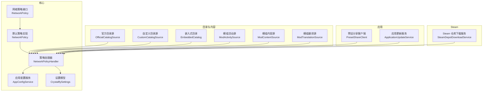
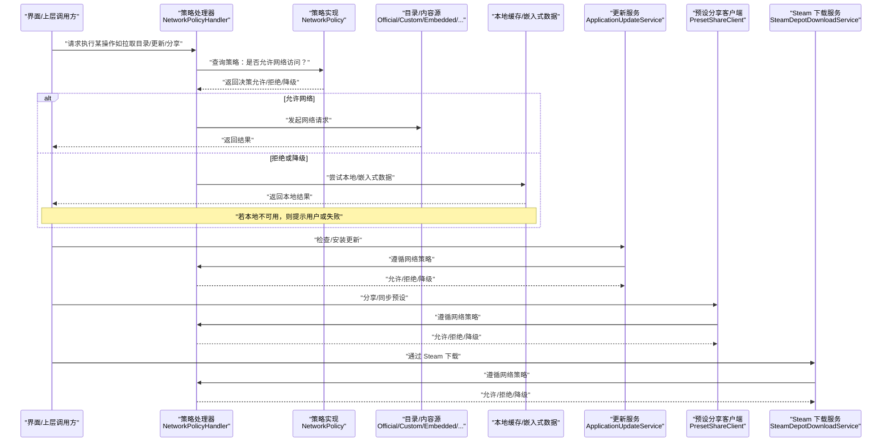
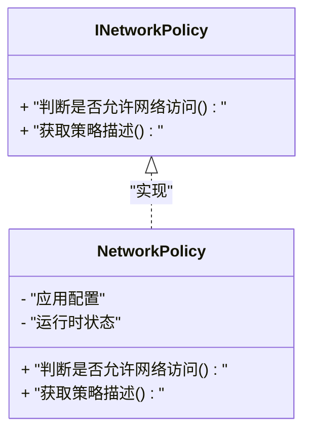
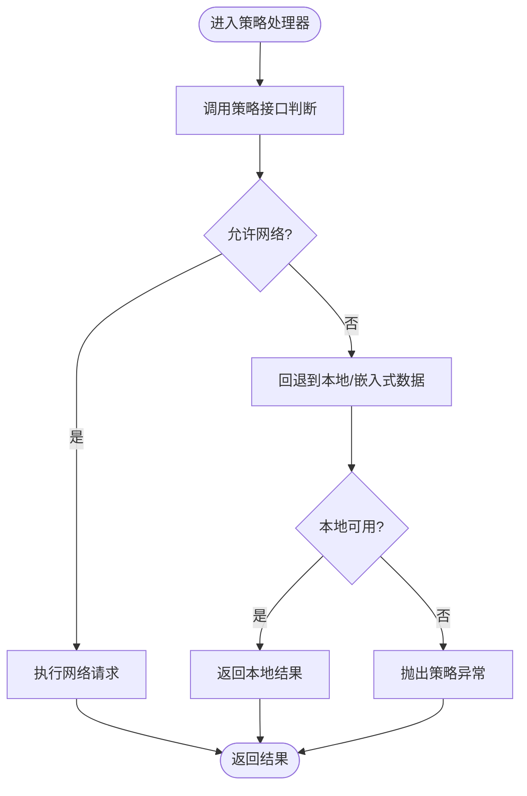
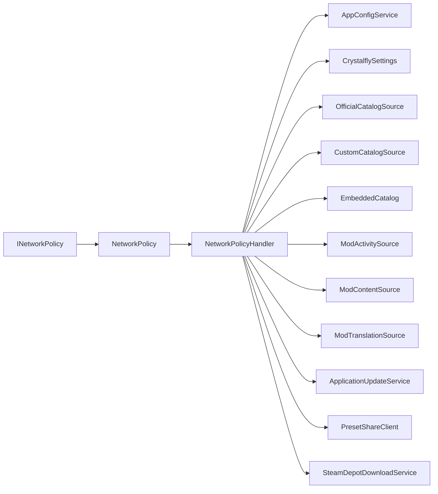

# 离线模式和网络策略

<cite>
**本文引用的文件**   
- [INetworkPolicy.cs](file://src/Crystalfly.Core/Networking/INetworkPolicy.cs)
- [NetworkPolicy.cs](file://src/Crystalfly.Core/Networking/NetworkPolicy.cs)
- [NetworkPolicyExceptions.cs](file://src/Crystalfly.Core/Networking/NetworkPolicyExceptions.cs)
- [NetworkPolicyHandler.cs](file://src/Crystalfly.Core/Networking/NetworkPolicyHandler.cs)
- [GitHubDownloadRouteHandler.cs](file://src/Crystalfly.Core/Networking/GitHubDownloadRouteHandler.cs)
- [GitHubRouteLatencyService.cs](file://src/Crystalfly.Core/Networking/GitHubRoute延迟服务.cs)
- [AppConfigService.cs](file://src/Crystalfly.Core/Configuration/AppConfigService.cs)
- [CrystalflySettings.cs](file://src/Crystalfly.Core/Configuration/CrystalflySettings.cs)
- [OfficialCatalogSource.cs](file://src/Crystalfly.Core/Catalog/OfficialCatalogSource.cs)
- [CustomCatalogSource.cs](file://src/Crystalfly.Core/Catalog/CustomCatalogSource.cs)
- [EmbeddedCatalog.cs](file://src/Crystalfly.Core/Catalog/EmbeddedCatalog.cs)
- [ModActivitySource.cs](file://src/Crystalfly.Core/Catalog/ModActivitySource.cs)
- [ModContentSource.cs](file://src/Crystalfly.Core/Catalog/ModContentSource.cs)
- [ModTranslationSource.cs](file://src/Crystalfly.Core/Catalog/ModTranslationSource.cs)
- [PresetShareClient.cs](file://src/Crystalfly.App/Downloads/PresetShareClient.cs)
- [ApplicationUpdateService.cs](file://src/Crystalfly.App/Updates/ApplicationUpdateService.cs)
- [SteamDepotDownloadService.cs](file://src/Crystalfly.Steam/Downloads/SteamDepotDownloadService.cs)
- [NetworkPolicyTests.cs](file://tests/Crystalfly.Core.Tests/Networking/NetworkPolicyTests.cs)
</cite>

## 目录
1. [简介](#简介)
2. [项目结构](#项目结构)
3. [核心组件](#核心组件)
4. [架构总览](#架构总览)
5. [详细组件分析](#详细组件分析)
6. [依赖关系分析](#依赖关系分析)
7. [性能与可用性考量](#性能与可用性考量)
8. [故障排查指南](#故障排查指南)
9. [结论](#结论)
10. [附录](#附录)

## 简介
本文件聚焦于 Crystalfly 的“离线模式”和“网络策略”能力，围绕以下目标展开：
- 明确网络策略接口、实现与拦截器的工作方式
- 梳理各模块在联网与离线场景下的行为差异（如目录源、更新、预设分享、Steam 下载等）
- 提供可操作的排障建议与最佳实践

## 项目结构
与离线和网络策略相关的代码主要分布在如下位置：
- 核心网络策略层：位于 Core 的 Networking 子目录，定义策略接口、默认策略、异常类型与处理管道
- 配置与设置：Core 的 Configuration 子目录，提供应用配置读写与设置模型
- 目录与内容源：Core 的 Catalog 子目录，包含官方目录、自定义目录、嵌入式目录以及活动、内容与翻译来源
- 应用层集成：App 的 Downloads 与 Updates 子目录，分别负责预设分享客户端与应用更新流程
- Steam 集成：Steam 的 Downloads 子目录，负责通过 Steam 渠道进行资源下载
- 测试：Core.Tests 的 Networking 子目录，覆盖网络策略的行为验证



图表来源
- [INetworkPolicy.cs](file://src/Crystalfly.Core/Networking/INetworkPolicy.cs)
- [NetworkPolicy.cs](file://src/Crystalfly.Core/Networking/NetworkPolicy.cs)
- [NetworkPolicyHandler.cs](file://src/Crystalfly.Core/Networking/NetworkPolicyHandler.cs)
- [AppConfigService.cs](file://src/Crystalfly.Core/Configuration/AppConfigService.cs)
- [CrystalflySettings.cs](file://src/Crystalfly.Core/Configuration/CrystalflySettings.cs)
- [OfficialCatalogSource.cs](file://src/Crystalfly.Core/Catalog/OfficialCatalogSource.cs)
- [CustomCatalogSource.cs](file://src/Crystalfly.Core/Catalog/CustomCatalogSource.cs)
- [EmbeddedCatalog.cs](file://src/Crystalfly.Core/Catalog/EmbeddedCatalog.cs)
- [ModActivitySource.cs](file://src/Crystalfly.Core/Catalog/ModActivitySource.cs)
- [ModContentSource.cs](file://src/Crystalfly.Core/Catalog/ModContentSource.cs)
- [ModTranslationSource.cs](file://src/Crystalfly.Core/Catalog/ModTranslationSource.cs)
- [PresetShareClient.cs](file://src/Crystalfly.App/Downloads/PresetShareClient.cs)
- [ApplicationUpdateService.cs](file://src/Crystalfly.App/Updates/ApplicationUpdateService.cs)
- [SteamDepotDownloadService.cs](file://src/Crystalfly.Steam/Downloads/SteamDepotDownloadService.cs)

章节来源
- [INetworkPolicy.cs](file://src/Crystalfly.Core/Networking/INetworkPolicy.cs)
- [NetworkPolicy.cs](file://src/Crystalfly.Core/Networking/NetworkPolicy.cs)
- [NetworkPolicyHandler.cs](file://src/Crystalfly.Core/Networking/NetworkPolicyHandler.cs)
- [AppConfigService.cs](file://src/Crystalfly.Core/Configuration/AppConfigService.cs)
- [CrystalflySettings.cs](file://src/Crystalfly.Core/Configuration/CrystalflySettings.cs)
- [OfficialCatalogSource.cs](file://src/Crystalfly.Core/Catalog/OfficialCatalogSource.cs)
- [CustomCatalogSource.cs](file://src/Crystalfly.Core/Catalog/CustomCatalogSource.cs)
- [EmbeddedCatalog.cs](file://src/Crystalfly.Core/Catalog/EmbeddedCatalog.cs)
- [ModActivitySource.cs](file://src/Crystalfly.Core/Catalog/ModActivitySource.cs)
- [ModContentSource.cs](file://src/Crystalfly.Core/Catalog/ModContentSource.cs)
- [ModTranslationSource.cs](file://src/Crystalfly.Core/Catalog/ModTranslationSource.cs)
- [PresetShareClient.cs](file://src/Crystalfly.App/Downloads/PresetShareClient.cs)
- [ApplicationUpdateService.cs](file://src/Crystalfly.App/Updates/ApplicationUpdateService.cs)
- [SteamDepotDownloadService.cs](file://src/Crystalfly.Steam/Downloads/SteamDepotDownloadService.cs)

## 核心组件
- 网络策略接口与默认实现
  - INetworkPolicy：定义网络访问决策的统一契约，供上层按策略决定是否允许发起网络请求或走本地路径。
  - NetworkPolicy：默认策略实现，通常结合应用配置决定在线/离线行为，并暴露判断方法供调用方使用。
- 策略处理器
  - NetworkPolicyHandler：作为统一入口，封装对策略接口的调用，向上层屏蔽策略细节；同时可能聚合路由与延迟信息以辅助决策。
- 配置与设置
  - AppConfigService：提供应用配置的读取与写入能力，用于持久化用户关于网络行为的偏好。
  - CrystalflySettings：承载与网络策略相关的具体设置项（例如是否强制离线、是否允许回退到本地缓存等）。
- 目录与内容来源
  - OfficialCatalogSource / CustomCatalogSource / EmbeddedCatalog：分别代表从官方、自定义与嵌入式数据源获取目录信息的能力。
  - ModActivitySource / ModContentSource / ModTranslationSource：分别负责活动、内容与翻译数据的获取。
- 应用集成点
  - PresetShareClient：预设分享客户端，涉及在线分享与同步。
  - ApplicationUpdateService：应用更新服务，负责检查与安装更新。
- Steam 集成
  - SteamDepotDownloadService：通过 Steam 渠道进行资源下载，属于另一种网络通道。

章节来源
- [INetworkPolicy.cs](file://src/Crystalfly.Core/Networking/INetworkPolicy.cs)
- [NetworkPolicy.cs](file://src/Crystalfly.Core/Networking/NetworkPolicy.cs)
- [NetworkPolicyHandler.cs](file://src/Crystalfly.Core/Networking/NetworkPolicyHandler.cs)
- [AppConfigService.cs](file://src/Crystalfly.Core/Configuration/AppConfigService.cs)
- [CrystalflySettings.cs](file://src/Crystalfly.Core/Configuration/CrystalflySettings.cs)
- [OfficialCatalogSource.cs](file://src/Crystalfly.Core/Catalog/OfficialCatalogSource.cs)
- [CustomCatalogSource.cs](file://src/Crystalfly.Core/Catalog/CustomCatalogSource.cs)
- [EmbeddedCatalog.cs](file://src/Crystalfly.Core/Catalog/EmbeddedCatalog.cs)
- [ModActivitySource.cs](file://src/Crystalfly.Core/Catalog/ModActivitySource.cs)
- [ModContentSource.cs](file://src/Crystalfly.Core/Catalog/ModContentSource.cs)
- [ModTranslationSource.cs](file://src/Crystalfly.Core/Catalog/ModTranslationSource.cs)
- [PresetShareClient.cs](file://src/Crystalfly.App/Downloads/PresetShareClient.cs)
- [ApplicationUpdateService.cs](file://src/Crystalfly.App/Updates/ApplicationUpdateService.cs)
- [SteamDepotDownloadService.cs](file://src/Crystalfly.Steam/Downloads/SteamDepotDownloadService.cs)

## 架构总览
下图展示了“网络策略”如何贯穿目录加载、内容获取、更新与分享等关键路径，并在需要时回退至本地或替代通道。



图表来源
- [NetworkPolicyHandler.cs](file://src/Crystalfly.Core/Networking/NetworkPolicyHandler.cs)
- [NetworkPolicy.cs](file://src/Crystalfly.Core/Networking/NetworkPolicy.cs)
- [OfficialCatalogSource.cs](file://src/Crystalfly.Core/Catalog/OfficialCatalogSource.cs)
- [CustomCatalogSource.cs](file://src/Crystalfly.Core/Catalog/CustomCatalogSource.cs)
- [EmbeddedCatalog.cs](file://src/Crystalfly.Core/Catalog/EmbeddedCatalog.cs)
- [ApplicationUpdateService.cs](file://src/Crystalfly.App/Updates/ApplicationUpdateService.cs)
- [PresetShareClient.cs](file://src/Crystalfly.App/Downloads/PresetShareClient.cs)
- [SteamDepotDownloadService.cs](file://src/Crystalfly.Steam/Downloads/SteamDepotDownloadService.cs)

## 详细组件分析

### 网络策略接口与默认实现
- 职责边界
  - INetworkPolicy：对外暴露统一的网络访问决策方法，使上层无需关心具体策略来源。
  - NetworkPolicy：默认实现，通常依据应用配置（如是否强制离线）与运行时状态（如网络可达性）做出决策。
- 典型用法
  - 上层在发起网络请求前，先通过策略接口判断是否允许；若不允许，则切换至本地数据或提示用户。
- 复杂度与扩展性
  - 新增策略只需实现同一接口，便于在不改动上层逻辑的前提下切换行为。



图表来源
- [INetworkPolicy.cs](file://src/Crystalfly.Core/Networking/INetworkPolicy.cs)
- [NetworkPolicy.cs](file://src/Crystalfly.Core/Networking/NetworkPolicy.cs)

章节来源
- [INetworkPolicy.cs](file://src/Crystalfly.Core/Networking/INetworkPolicy.cs)
- [NetworkPolicy.cs](file://src/Crystalfly.Core/Networking/NetworkPolicy.cs)

### 策略处理器与异常
- 职责
  - NetworkPolicyHandler：将策略判断封装为统一入口，向上层屏蔽策略细节；同时可聚合路由与延迟信息，辅助更智能的决策。
  - NetworkPolicyExceptions：定义与策略相关的异常类型，便于上层捕获并给出友好提示。
- 典型流程
  - 上层调用处理器 -> 处理器委托策略接口 -> 根据结果选择网络或本地路径 -> 必要时抛出策略异常。



图表来源
- [NetworkPolicyHandler.cs](file://src/Crystalfly.Core/Networking/NetworkPolicyHandler.cs)
- [NetworkPolicyExceptions.cs](file://src/Crystalfly.Core/Networking/NetworkPolicyExceptions.cs)

章节来源
- [NetworkPolicyHandler.cs](file://src/Crystalfly.Core/Networking/NetworkPolicyHandler.cs)
- [NetworkPolicyExceptions.cs](file://src/Crystalfly.Core/Networking/NetworkPolicyExceptions.cs)

### 配置与设置
- 作用
  - AppConfigService：提供配置的读取与写入，用于持久化用户的网络策略偏好。
  - CrystalflySettings：承载具体的策略开关与参数，供策略实现读取。
- 影响范围
  - 策略实现会读取这些设置来决定是否允许网络访问、是否优先使用本地数据等。

章节来源
- [AppConfigService.cs](file://src/Crystalfly.Core/Configuration/AppConfigService.cs)
- [CrystalflySettings.cs](file://src/Crystalfly.Core/Configuration/CrystalflySettings.cs)

### 目录与内容来源的离线行为
- 官方目录源（OfficialCatalogSource）
  - 在线：从官方地址拉取最新目录。
  - 离线：回退到本地缓存或嵌入式目录，保证基础功能可用。
- 自定义目录源（CustomCatalogSource）
  - 在线：访问用户配置的自定义源。
  - 离线：跳过或回退到其它可用源。
- 嵌入式目录（EmbeddedCatalog）
  - 始终可用，作为离线兜底数据源。
- 活动/内容/翻译源（ModActivitySource / ModContentSource / ModTranslationSource）
  - 在线：按需拉取增量数据。
  - 离线：使用本地缓存或嵌入式数据，避免阻塞主流程。

```mermaid
sequenceDiagram
participant Caller as "调用方"
participant Handler as "策略处理器"
participant Policy as "策略实现"
participant Off as "官方目录源"
participant Cus as "自定义目录源"
participant Emb as "嵌入式目录"
Caller->>Handler : "加载目录"
Handler->>Policy : "是否允许网络?"
Policy-->>Handler : "允许/拒绝"
alt 允许
Handler->>Off : "拉取官方目录"
Off-->>Caller : "返回官方目录"
else 拒绝
Handler->>Emb : "使用嵌入式目录"
Emb-->>Caller : "返回嵌入式目录"
end
```

图表来源
- [OfficialCatalogSource.cs](file://src/Crystalfly.Core/Catalog/OfficialCatalogSource.cs)
- [CustomCatalogSource.cs](file://src/Crystalfly.Core/Catalog/CustomCatalogSource.cs)
- [EmbeddedCatalog.cs](file://src/Crystalfly.Core/Catalog/EmbeddedCatalog.cs)
- [NetworkPolicyHandler.cs](file://src/Crystalfly.Core/Networking/NetworkPolicyHandler.cs)
- [NetworkPolicy.cs](file://src/Crystalfly.Core/Networking/NetworkPolicy.cs)

章节来源
- [OfficialCatalogSource.cs](file://src/Crystalfly.Core/Catalog/OfficialCatalogSource.cs)
- [CustomCatalogSource.cs](file://src/Crystalfly.Core/Catalog/CustomCatalogSource.cs)
- [EmbeddedCatalog.cs](file://src/Crystalfly.Core/Catalog/EmbeddedCatalog.cs)
- [ModActivitySource.cs](file://src/Crystalfly.Core/Catalog/ModActivitySource.cs)
- [ModContentSource.cs](file://src/Crystalfly.Core/Catalog/ModContentSource.cs)
- [ModTranslationSource.cs](file://src/Crystalfly.Core/Catalog/ModTranslationSource.cs)

### 应用更新服务的网络策略
- 行为
  - 在线：检查远程更新清单并下载更新包。
  - 离线：跳过远程检查，仅使用本地已缓存的更新信息或直接提示无法更新。
- 与策略的关系
  - 通过策略处理器统一决策，确保更新流程与整体网络策略一致。

章节来源
- [ApplicationUpdateService.cs](file://src/Crystalfly.App/Updates/ApplicationUpdateService.cs)
- [NetworkPolicyHandler.cs](file://src/Crystalfly.Core/Networking/NetworkPolicyHandler.cs)

### 预设分享客户端的网络策略
- 行为
  - 在线：上传/下载预设到分享服务。
  - 离线：禁用分享功能或提示用户切换到本地操作。
- 与策略的关系
  - 所有分享请求均经过策略处理器，确保与全局网络策略一致。

章节来源
- [PresetShareClient.cs](file://src/Crystalfly.App/Downloads/PresetShareClient.cs)
- [NetworkPolicyHandler.cs](file://src/Crystalfly.Core/Networking/NetworkPolicyHandler.cs)

### Steam 下载服务的网络策略
- 行为
  - 在线：通过 Steam 渠道下载资源。
  - 离线：无法使用 Steam 通道，需回退到其他可用通道或提示用户。
- 与策略的关系
  - 同样受策略处理器约束，保证多通道下载的一致性。

章节来源
- [SteamDepotDownloadService.cs](file://src/Crystalfly.Steam/Downloads/SteamDepotDownloadService.cs)
- [NetworkPolicyHandler.cs](file://src/Crystalfly.Core/Networking/NetworkPolicyHandler.cs)

## 依赖关系分析
- 耦合与内聚
  - 策略接口与实现解耦，上层仅依赖接口，便于替换与测试。
  - 策略处理器集中了策略判断与回退逻辑，提升内聚性。
- 外部依赖
  - 配置服务与设置模型为策略提供运行期参数。
  - 目录与内容源、更新服务、分享客户端、Steam 下载服务等均为策略的使用者。
- 可能的循环依赖
  - 策略层不应反向依赖上层业务模块，以避免循环依赖。



图表来源
- [INetworkPolicy.cs](file://src/Crystalfly.Core/Networking/INetworkPolicy.cs)
- [NetworkPolicy.cs](file://src/Crystalfly.Core/Networking/NetworkPolicy.cs)
- [NetworkPolicyHandler.cs](file://src/Crystalfly.Core/Networking/NetworkPolicyHandler.cs)
- [AppConfigService.cs](file://src/Crystalfly.Core/Configuration/AppConfigService.cs)
- [CrystalflySettings.cs](file://src/Crystalfly.Core/Configuration/CrystalflySettings.cs)
- [OfficialCatalogSource.cs](file://src/Crystalfly.Core/Catalog/OfficialCatalogSource.cs)
- [CustomCatalogSource.cs](file://src/Crystalfly.Core/Catalog/CustomCatalogSource.cs)
- [EmbeddedCatalog.cs](file://src/Crystalfly.Core/Catalog/EmbeddedCatalog.cs)
- [ModActivitySource.cs](file://src/Crystalfly.Core/Catalog/ModActivitySource.cs)
- [ModContentSource.cs](file://src/Crystalfly.Core/Catalog/ModContentSource.cs)
- [ModTranslationSource.cs](file://src/Crystalfly.Core/Catalog/ModTranslationSource.cs)
- [ApplicationUpdateService.cs](file://src/Crystalfly.App/Updates/ApplicationUpdateService.cs)
- [PresetShareClient.cs](file://src/Crystalfly.App/Downloads/PresetShareClient.cs)
- [SteamDepotDownloadService.cs](file://src/Crystalfly.Steam/Downloads/SteamDepotDownloadService.cs)

章节来源
- [INetworkPolicy.cs](file://src/Crystalfly.Core/Networking/INetworkPolicy.cs)
- [NetworkPolicy.cs](file://src/Crystalfly.Core/Networking/NetworkPolicy.cs)
- [NetworkPolicyHandler.cs](file://src/Crystalfly.Core/Networking/NetworkPolicyHandler.cs)
- [AppConfigService.cs](file://src/Crystalfly.Core/Configuration/AppConfigService.cs)
- [CrystalflySettings.cs](file://src/Crystalfly.Core/Configuration/CrystalflySettings.cs)
- [OfficialCatalogSource.cs](file://src/Crystalfly.Core/Catalog/OfficialCatalogSource.cs)
- [CustomCatalogSource.cs](file://src/Crystalfly.Core/Catalog/CustomCatalogSource.cs)
- [EmbeddedCatalog.cs](file://src/Crystalffly.Core/Catalog/EmbeddedCatalog.cs)
- [ModActivitySource.cs](file://src/Crystalfly.Core/Catalog/ModActivitySource.cs)
- [ModContentSource.cs](file://src/Crystalfly.Core/Catalog/ModContentSource.cs)
- [ModTranslationSource.cs](file://src/Crystalfly.Core/Catalog/ModTranslationSource.cs)
- [ApplicationUpdateService.cs](file://src/Crystalfly.App/Updates/ApplicationUpdateService.cs)
- [PresetShareClient.cs](file://src/Crystalfly.App/Downloads/PresetShareClient.cs)
- [SteamDepotDownloadService.cs](file://src/Crystalfly.Steam/Downloads/SteamDepotDownloadService.cs)

## 性能与可用性考量
- 减少不必要的网络往返
  - 通过策略判断尽早回退到本地/嵌入式数据，降低超时与重试带来的开销。
- 并发与队列
  - 对于批量目录/内容拉取，建议在策略允许的范围内采用并发控制与重试退避，避免雪崩。
- 缓存与一致性
  - 合理设置本地缓存过期策略，平衡新鲜度与离线可用性。
- 用户体验
  - 在网络受限场景下，提供清晰的提示与降级路径，避免长时间无响应。

[本节为通用指导，不直接分析具体文件]

## 故障排查指南
- 常见问题
  - 策略误判导致无法联网：检查策略实现与配置项是否正确加载。
  - 目录加载失败：确认官方/自定义源是否可达，必要时回退到嵌入式目录。
  - 更新失败：检查更新服务是否遵循策略，离线模式下应跳过远程检查。
  - 预设分享失败：确认分享客户端是否被策略阻止，或网络不可达。
  - Steam 下载失败：确认 Steam 通道是否可用，必要时切换其他通道。
- 定位步骤
  - 查看策略处理器日志与异常类型，确认决策分支。
  - 核对配置服务中的网络策略设置是否与预期一致。
  - 针对具体来源（官方/自定义/嵌入式）分别验证其可用性。
- 参考测试
  - 可通过单元测试用例复现与验证策略行为，快速定位问题。

章节来源
- [NetworkPolicyHandler.cs](file://src/Crystalfly.Core/Networking/NetworkPolicyHandler.cs)
- [NetworkPolicyExceptions.cs](file://src/Crystalfly.Core/Networking/NetworkPolicyExceptions.cs)
- [AppConfigService.cs](file://src/Crystalfly.Core/Configuration/AppConfigService.cs)
- [NetworkPolicyTests.cs](file://tests/Crystalfly.Core.Tests/Networking/NetworkPolicyTests.cs)

## 结论
Crystalfly 通过统一的网络策略接口与处理器，将“在线/离线”决策贯穿到目录加载、内容获取、更新与分享等关键路径，并以嵌入式数据与本地缓存作为离线兜底，确保核心体验稳定可用。配合完善的测试与清晰的异常类型，开发者可以快速定位与修复相关问题。

[本节为总结，不直接分析具体文件]

## 附录
- 术语
  - 网络策略：决定系统是否允许发起网络请求或回退到本地数据的规则集合。
  - 策略处理器：封装策略判断与回退逻辑的统一入口。
  - 嵌入式目录：内置的目录数据，用于离线场景的基础功能保障。

[本节为概念说明，不直接分析具体文件]