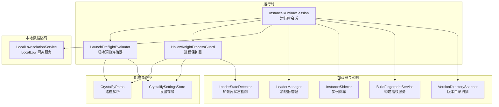
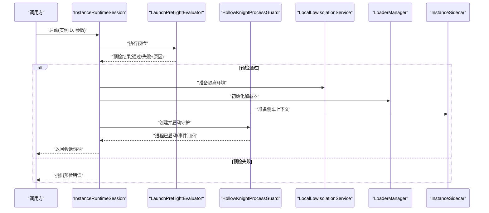
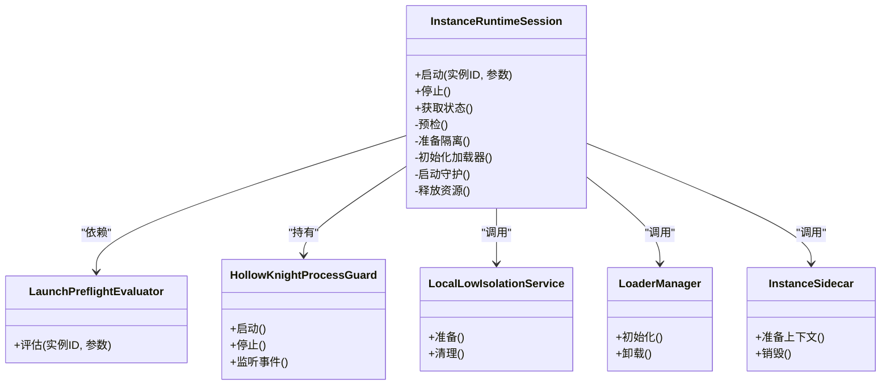
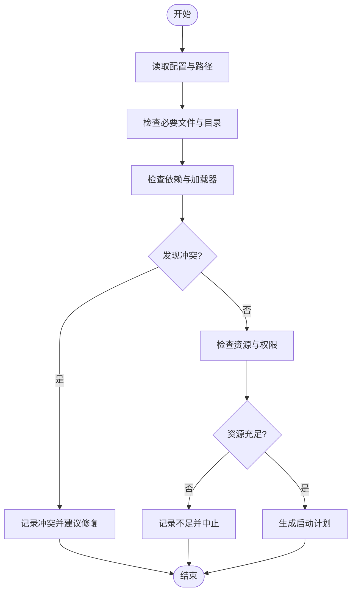
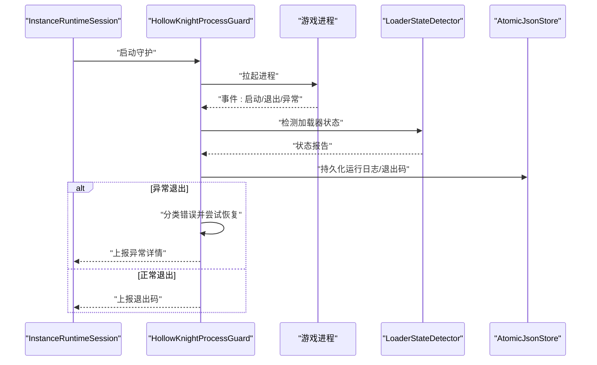
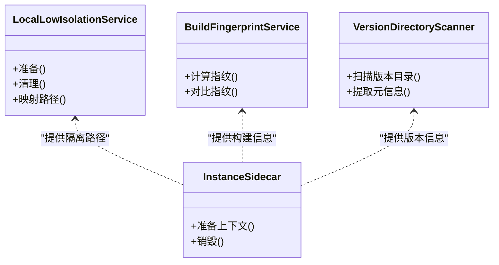
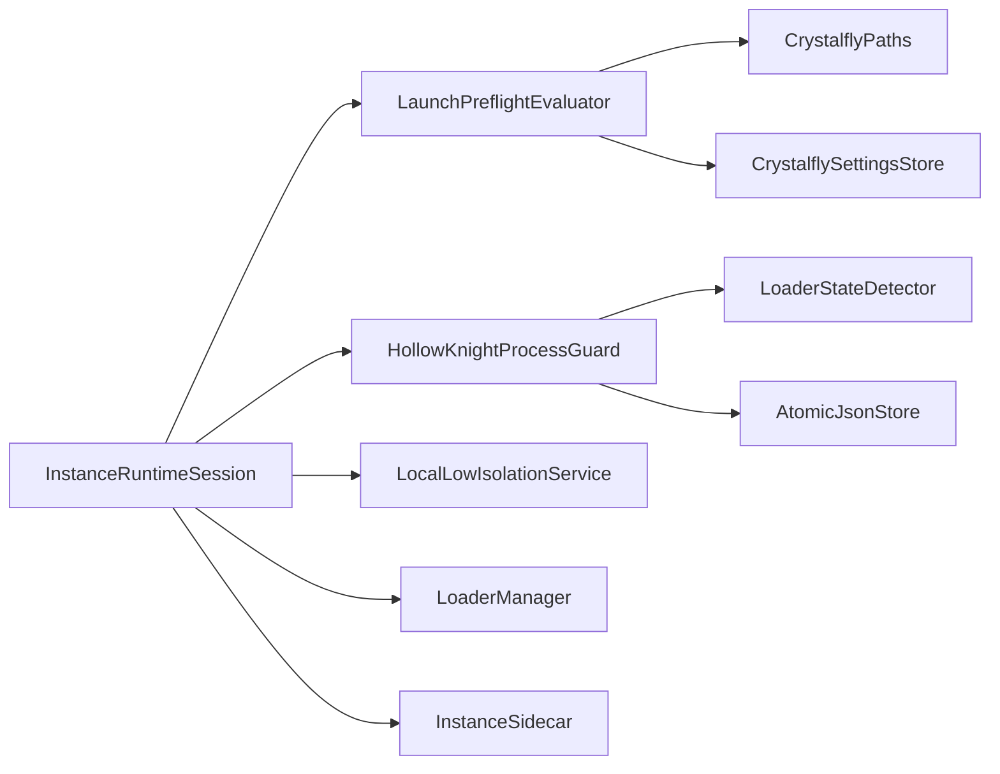

# 运行时管理

<cite>
**本文引用的文件**   
- [InstanceRuntimeSession.cs](file://src/Crystalfly.Core/Runtime/InstanceRuntimeSession.cs)
- [LaunchPreflightEvaluator.cs](file://src/Crystalfly.Core/Runtime/LaunchPreflightEvaluator.cs)
- [HollowKnightProcessGuard.cs](file://src/Crystalfly.Core/Runtime/HollowKnightProcessGuard.cs)
- [CrystalflyPaths.cs](file://src/Crystalfly.Core/Configuration/CrystalflyPaths.cs)
- [CrystalflySettingsStore.cs](file://src/Crystalfly.Core/Configuration/CrystalfflySettingsStore.cs)
- [LocalLowIsolationService.cs](file://src/Crystalfly.Core/LocalLow/LocalLowIsolationService.cs)
- [LoaderManager.cs](file://src/Crystalfly.Core/Loaders/LoaderManager.cs)
- [LoaderStateDetector.cs](file://src/Crystalfly.Core/Loaders/LoaderStateDetector.cs)
- [InstanceSidecar.cs](file://src/Crystalfly.Core/Instances/InstanceSidecar.cs)
- [BuildFingerprintService.cs](file://src/Crystalfly.Core/Instances/BuildFingerprintService.cs)
- [VersionDirectoryScanner.cs](file://src/Crystalfly.Core/Instances/VersionDirectoryScanner.cs)
- [AtomicJsonStore.cs](file://src/Crystalfly.Core/Serialization/AtomicJsonStore.cs)
- [CrystalflyCoreTests.cs](file://tests/Crystalfly.Core.Tests/Runtime/HollowKnightRuntimeTests.cs)
- [LaunchPreflightEvaluatorTests.cs](file://tests/Crystalfly.Core.Tests/Runtime/LaunchPreflightEvaluatorTests.cs)
</cite>

## 目录
1. [简介](#简介)
2. [项目结构](#项目结构)
3. [核心组件](#核心组件)
4. [架构总览](#架构总览)
5. [详细组件分析](#详细组件分析)
6. [依赖关系分析](#依赖关系分析)
7. [性能考虑](#性能考虑)
8. [故障排查指南](#故障排查指南)
9. [结论](#结论)
10. [附录](#附录)

## 简介
本章节聚焦“运行时管理”模块，围绕游戏实例的启动前预检、进程保护与会话生命周期展开。核心目标包括：
- 解释 InstanceRuntimeSession 运行时会话的职责与状态流转
- 说明 LaunchPreflightEvaluator 启动预检评估器的检查项与失败策略
- 阐述 HollowKnightProcessGuard 进程保护器的监控、异常处理与资源清理机制
- 提供安全启动、状态监控、异常处理的实践路径
- 讨论运行时隔离与资源管理、并发多实例的资源竞争问题
- 给出性能监控与调试工具使用建议

## 项目结构
运行时相关代码位于 Core 层的 Runtime 子目录，并与配置、本地数据隔离、加载器、实例侧车等模块协作。

图表来源
- [InstanceRuntimeSession.cs](file://src/Crystalfly.Core/Runtime/InstanceRuntimeSession.cs)
- [LaunchPreflightEvaluator.cs](file://src/Crystalfly.Core/Runtime/LaunchPreflightEvaluator.cs)
- [HollowKnightProcessGuard.cs](file://src/Crystalfly.Core/Runtime/HollowKnightProcessGuard.cs)
- [CrystalflyPaths.cs](file://src/Crystalfly.Core/Configuration/CrystalflyPaths.cs)
- [CrystalflySettingsStore.cs](file://src/Crystalfly.Core/Configuration/CrystalflySettingsStore.cs)
- [LocalLowIsolationService.cs](file://src/Crystalfly.Core/LocalLow/LocalLowIsolationService.cs)
- [LoaderManager.cs](file://src/Crystalfly.Core/Loaders/LoaderManager.cs)
- [LoaderStateDetector.cs](file://src/Crystalfly.Core/Loaders/LoaderStateDetector.cs)
- [InstanceSidecar.cs](file://src/Crystalfly.Core/Instances/InstanceSidecar.cs)
- [BuildFingerprintService.cs](file://src/Crystalfly.Core/Instances/BuildFingerprintService.cs)
- [VersionDirectoryScanner.cs](file://src/Crystalfly.Core/Instances/VersionDirectoryScanner.cs)

章节来源
- [InstanceRuntimeSession.cs](file://src/Crystalfly.Core/Runtime/InstanceRuntimeSession.cs)
- [LaunchPreflightEvaluator.cs](file://src/Crystalfly.Core/Runtime/LaunchPreflightEvaluator.cs)
- [HollowKnightProcessGuard.cs](file://src/Crystalfly.Core/Runtime/HollowKnightProcessGuard.cs)
- [CrystalflyPaths.cs](file://src/Crystalfly.Core/Configuration/CrystalflyPaths.cs)
- [CrystalflySettingsStore.cs](file://src/Crystalfly.Core/Configuration/CrystalflySettingsStore.cs)
- [LocalLowIsolationService.cs](file://src/Crystalfly.Core/LocalLow/LocalLowIsolationService.cs)
- [LoaderManager.cs](file://src/Crystalfly.Core/Loaders/LoaderManager.cs)
- [LoaderStateDetector.cs](file://src/Crystalfly.Core/Loaders/LoaderStateDetector.cs)
- [InstanceSidecar.cs](file://src/Crystalfly.Core/Instances/InstanceSidecar.cs)
- [BuildFingerprintService.cs](file://src/Crystalfly.Core/Instances/BuildFingerprintService.cs)
- [VersionDirectoryScanner.cs](file://src/Crystalfly.Core/Instances/VersionDirectoryScanner.cs)

## 核心组件
- 运行时会话（InstanceRuntimeSession）
  - 职责：封装一次游戏实例的生命周期，协调预检、启动、守护与回收；对外暴露启动、停止、状态查询等操作。
  - 关键能力：组合 LaunchPreflightEvaluator 进行环境校验；持有 HollowKnightProcessGuard 负责进程监控与异常恢复；与 LocalLowIsolationService 协作实现用户数据隔离；与 LoaderManager/InstanceSidecar/BuildFingerprintService/VersionDirectoryScanner 协同完成加载器与版本信息准备。
- 启动预检评估器（LaunchPreflightEvaluator）
  - 职责：在启动前执行环境检查、依赖验证与配置准备；返回可执行的启动计划或错误清单。
  - 典型检查项：路径有效性、必要文件存在性、加载器可用性、冲突检测、磁盘空间与权限、可选依赖提示。
- 进程保护器（HollowKnightProcessGuard）
  - 职责：对游戏主进程进行监控、异常捕获、日志收集、资源释放与优雅退出；支持重启策略与告警回调。
  - 关键行为：进程存活探测、崩溃/退出码采集、句柄泄漏防护、临时文件清理、与会话状态同步。

章节来源
- [InstanceRuntimeSession.cs](file://src/Crystalfly.Core/Runtime/InstanceRuntimeSession.cs)
- [LaunchPreflightEvaluator.cs](file://src/Crystalfly.Core/Runtime/LaunchPreflightEvaluator.cs)
- [HollowKnightProcessGuard.cs](file://src/Crystalfly.Core/Runtime/HollowKnightProcessGuard.cs)

## 架构总览
下图展示了从调用方到具体实现的端到端流程：会话发起启动请求，预检评估器完成环境与依赖校验，随后由进程保护器接管并监控游戏进程。

图表来源
- [InstanceRuntimeSession.cs](file://src/Crystalfly.Core/Runtime/InstanceRuntimeSession.cs)
- [LaunchPreflightEvaluator.cs](file://src/Crystalfly.Core/Runtime/LaunchPreflightEvaluator.cs)
- [HollowKnightProcessGuard.cs](file://src/Crystalfly.Core/Runtime/HollowKnightProcessGuard.cs)
- [LocalLowIsolationService.cs](file://src/Crystalfly.Core/LocalLow/LocalLowIsolationService.cs)
- [LoaderManager.cs](file://src/Crystalfly.Core/Loaders/LoaderManager.cs)
- [InstanceSidecar.cs](file://src/Crystalfly.Core/Instances/InstanceSidecar.cs)

## 详细组件分析

### 运行时会话（InstanceRuntimeSession）
- 设计要点
  - 以“会话”为单位组织生命周期，避免跨实例共享状态导致的竞态。
  - 将“预检”和“守护”解耦，便于测试与替换。
  - 与隔离服务、加载器、侧车等协作，确保每次启动具备一致的环境。
- 关键方法（概念）
  - 启动：触发预检、准备隔离、初始化加载器、启动守护、返回会话句柄。
  - 停止：通知守护退出、释放资源、清理临时文件、更新持久化状态。
  - 状态查询：获取当前运行状态、最近退出码、错误摘要。
- 并发与锁
  - 同一实例的多次启动应串行化，防止重复拉起进程或覆盖资源。
  - 会话内部状态变更需线程安全，避免 UI 与后台任务争用。

图表来源
- [InstanceRuntimeSession.cs](file://src/Crystalfly.Core/Runtime/InstanceRuntimeSession.cs)
- [LaunchPreflightEvaluator.cs](file://src/Crystalfly.Core/Runtime/LaunchPreflightEvaluator.cs)
- [HollowKnightProcessGuard.cs](file://src/Crystalfly.Core/Runtime/HollowKnightProcessGuard.cs)
- [LocalLowIsolationService.cs](file://src/Crystalfly.Core/LocalLow/LocalLowIsolationService.cs)
- [LoaderManager.cs](file://src/Crystalfly.Core/Loaders/LoaderManager.cs)
- [InstanceSidecar.cs](file://src/Crystalfly.Core/Instances/InstanceSidecar.cs)

章节来源
- [InstanceRuntimeSession.cs](file://src/Crystalfly.Core/Runtime/InstanceRuntimeSession.cs)

### 启动预检评估器（LaunchPreflightEvaluator）
- 检查维度
  - 路径与环境：根目录、版本目录、配置文件、日志目录是否存在且可写。
  - 依赖与完整性：必要文件、加载器包、第三方库是否齐全。
  - 冲突与兼容性：端口占用、同名进程、旧残留文件、不兼容的插件。
  - 资源与权限：磁盘空间、读写权限、杀毒软件白名单建议。
- 输出与策略
  - 成功：返回可执行计划（包含后续步骤与参数）。
  - 失败：返回结构化错误列表，区分致命与非致命，便于 UI 提示与自动修复。
- 可插拔扩展
  - 可通过注册新的检查项扩展预检逻辑，例如网络可达性、许可证校验等。

图表来源
- [LaunchPreflightEvaluator.cs](file://src/Crystalfly.Core/Runtime/LaunchPreflightEvaluator.cs)
- [CrystalflyPaths.cs](file://src/Crystalfly.Core/Configuration/CrystalflyPaths.cs)
- [CrystalflySettingsStore.cs](file://src/Crystalfly.Core/Configuration/CrystalflySettingsStore.cs)

章节来源
- [LaunchPreflightEvaluator.cs](file://src/Crystalfly.Core/Runtime/LaunchPreflightEvaluator.cs)
- [CrystalflyPaths.cs](file://src/Crystalfly.Core/Configuration/CrystalflyPaths.cs)
- [CrystalflySettingsStore.cs](file://src/Crystalfly.Core/Configuration/CrystalflySettingsStore.cs)

### 进程保护器（HollowKnightProcessGuard）
- 监控与事件
  - 进程存活探测、退出码采集、标准输出/错误流抓取。
  - 事件回调：启动成功、异常退出、资源不足、长时间无响应等。
- 异常处理与恢复
  - 根据退出码分类处理：正常退出、崩溃、被外部终止、依赖缺失等。
  - 支持重试与退避策略，避免频繁重启导致雪崩。
- 资源清理
  - 关闭句柄、删除临时文件、释放内存映射、清理锁文件。
  - 与原子写入服务配合，保证状态落盘一致性。
- 与加载器状态联动
  - 结合 LoaderStateDetector 判断加载器是否处于健康状态，必要时触发回滚或提示修复。

图表来源
- [HollowKnightProcessGuard.cs](file://src/Crystalfly.Core/Runtime/HollowKnightProcessGuard.cs)
- [LoaderStateDetector.cs](file://src/Crystalfly.Core/Loaders/LoaderStateDetector.cs)
- [AtomicJsonStore.cs](file://src/Crystalfly.Core/Serialization/AtomicJsonStore.cs)

章节来源
- [HollowKnightProcessGuard.cs](file://src/Crystalfly.Core/Runtime/HollowKnightProcessGuard.cs)
- [LoaderStateDetector.cs](file://src/Crystalfly.Core/Loaders/LoaderStateDetector.cs)
- [AtomicJsonStore.cs](file://src/Crystalfly.Core/Serialization/AtomicJsonStore.cs)

### 运行时隔离与资源管理
- 用户数据隔离
  - 通过 LocalLowIsolationService 为每个实例提供独立的 LocalLow 目录映射，避免存档、配置互相污染。
- 版本与构建指纹
  - BuildFingerprintService 与 VersionDirectoryScanner 用于识别版本差异与构建特征，辅助预检与回滚决策。
- 侧车上下文
  - InstanceSidecar 承载与实例相关的上下文信息，如工作目录、环境变量、注入参数等。

图表来源
- [LocalLowIsolationService.cs](file://src/Crystalfly.Core/LocalLow/LocalLowIsolationService.cs)
- [BuildFingerprintService.cs](file://src/Crystalfly.Core/Instances/BuildFingerprintService.cs)
- [VersionDirectoryScanner.cs](file://src/Crystalfly.Core/Instances/VersionDirectoryScanner.cs)
- [InstanceSidecar.cs](file://src/Crystalfly.Core/Instances/InstanceSidecar.cs)

章节来源
- [LocalLowIsolationService.cs](file://src/Crystalfly.Core/LocalLow/LocalLowIsolationService.cs)
- [BuildFingerprintService.cs](file://src/Crystalfly.Core/Instances/BuildFingerprintService.cs)
- [VersionDirectoryScanner.cs](file://src/Crystalfly.Core/Instances/VersionDirectoryScanner.cs)
- [InstanceSidecar.cs](file://src/Crystalfly.Core/Instances/InstanceSidecar.cs)

## 依赖关系分析
- 内聚与耦合
  - InstanceRuntimeSession 作为编排者，聚合多个子系统，保持高内聚；各子系统通过接口或明确的服务边界交互，降低耦合。
- 直接依赖
  - 预检评估器依赖配置与路径服务；进程保护器依赖加载器状态检测与原子写入服务；会话依赖所有上述组件。
- 潜在循环依赖
  - 应避免会话与守护之间相互引用形成环；通过事件与回调解耦。
- 外部集成点
  - 文件系统、进程管理、JSON 持久化、可能的系统 API（如进程句柄操作）。

图表来源
- [InstanceRuntimeSession.cs](file://src/Crystalfly.Core/Runtime/InstanceRuntimeSession.cs)
- [LaunchPreflightEvaluator.cs](file://src/Crystalfly.Core/Runtime/LaunchPreflightEvaluator.cs)
- [HollowKnightProcessGuard.cs](file://src/Crystalfly.Core/Runtime/HollowKnightProcessGuard.cs)
- [CrystalflyPaths.cs](file://src/Crystalfly.Core/Configuration/CrystalflyPaths.cs)
- [CrystalflySettingsStore.cs](file://src/Crystalfly.Core/Configuration/CrystalflySettingsStore.cs)
- [LocalLowIsolationService.cs](file://src/Crystalfly.Core/LocalLow/LocalLowIsolationService.cs)
- [LoaderManager.cs](file://src/Crystalfly.Core/Loaders/LoaderManager.cs)
- [LoaderStateDetector.cs](file://src/Crystalfly.Core/Loaders/LoaderStateDetector.cs)
- [InstanceSidecar.cs](file://src/Crystalfly.Core/Instances/InstanceSidecar.cs)
- [AtomicJsonStore.cs](file://src/Crystalfly.Core/Serialization/AtomicJsonStore.cs)

章节来源
- [InstanceRuntimeSession.cs](file://src/Crystalfly.Core/Runtime/InstanceRuntimeSession.cs)
- [LaunchPreflightEvaluator.cs](file://src/Crystalfly.Core/Runtime/LaunchPreflightEvaluator.cs)
- [HollowKnightProcessGuard.cs](file://src/Crystalfly.Core/Runtime/HollowKnightProcessGuard.cs)

## 性能考虑
- 预检优化
  - 并行检查互不依赖的项目（如文件存在性、磁盘空间），但注意 I/O 热点与锁粒度。
  - 缓存常用路径与元信息，减少重复扫描。
- 守护开销
  - 进程事件采样频率可调，避免高频轮询造成 CPU 抖动。
  - 日志写入采用异步与批量化，降低磁盘压力。
- 资源清理
  - 及时释放句柄与临时文件，避免长期运行后资源耗尽。
- 多实例并发
  - 使用实例级锁与队列，避免同时修改同一实例的状态或文件。
  - 不同实例间尽量隔离工作目录与日志路径，减少锁竞争。

[本节为通用指导，无需源码引用]

## 故障排查指南
- 常见症状与定位
  - 启动失败：查看预检错误清单，确认路径、依赖与权限。
  - 进程崩溃：收集退出码与堆栈片段，结合加载器状态判断是否为依赖缺失或版本不匹配。
  - 资源不足：检查磁盘空间、句柄数、内存占用。
- 诊断手段
  - 启用更详细的日志级别，关注守护的事件流与持久化记录。
  - 使用原子写入服务的快照与回滚能力，快速恢复到稳定状态。
  - 借助加载器状态检测器，确认加载器是否处于健康态。
- 恢复策略
  - 自动修复：重新下载缺失依赖、重建索引、清理残留锁文件。
  - 手动干预：调整权限、关闭冲突进程、更换安装路径。

章节来源
- [HollowKnightProcessGuard.cs](file://src/Crystalfly.Core/Runtime/HollowKnightProcessGuard.cs)
- [LaunchPreflightEvaluator.cs](file://src/Crystalfly.Core/Runtime/LaunchPreflightEvaluator.cs)
- [AtomicJsonStore.cs](file://src/Crystalfly.Core/Serialization/AtomicJsonStore.cs)
- [LoaderStateDetector.cs](file://src/Crystalfly.Core/Loaders/LoaderStateDetector.cs)

## 结论
运行时管理模块通过“预检—启动—守护—回收”的闭环，提供了健壮的游戏实例管理能力。会话层负责编排与状态管理，预检评估器保障启动前的环境正确性，进程保护器确保运行期的稳定性与可观测性。配合隔离服务与加载器状态检测，系统在多实例并发场景下也能保持稳定与可恢复。

[本节为总结性内容，无需源码引用]

## 附录

### 安全启动示例（概念步骤）
- 步骤
  - 构造会话对象并传入实例标识与启动参数。
  - 调用启动方法，等待预检完成。
  - 若预检通过，继续初始化隔离与加载器，然后启动守护。
  - 返回会话句柄供上层管理与展示。
- 参考路径
  - [InstanceRuntimeSession.cs](file://src/Crystalfly.Core/Runtime/InstanceRuntimeSession.cs)

章节来源
- [InstanceRuntimeSession.cs](file://src/Crystalfly.Core/Runtime/InstanceRuntimeSession.cs)

### 监控运行状态示例（概念步骤）
- 步骤
  - 订阅守护的事件回调（启动、退出、异常）。
  - 定期读取会话状态与最近退出码。
  - 将状态推送到 UI 或监控系统。
- 参考路径
  - [HollowKnightProcessGuard.cs](file://src/Crystalfly.Core/Runtime/HollowKnightProcessGuard.cs)
  - [InstanceRuntimeSession.cs](file://src/Crystalfly.Core/Runtime/InstanceRuntimeSession.cs)

章节来源
- [HollowKnightProcessGuard.cs](file://src/Crystalfly.Core/Runtime/HollowKnightProcessGuard.cs)
- [InstanceRuntimeSession.cs](file://src/Crystalfly.Core/Runtime/InstanceRuntimeSession.cs)

### 处理进程异常示例（概念步骤）
- 步骤
  - 捕获守护上报的异常与退出码。
  - 分类错误类型并执行相应恢复策略（重试、回滚、提示修复）。
  - 记录持久化日志并通知上层。
- 参考路径
  - [HollowKnightProcessGuard.cs](file://src/Crystalfly.Core/Runtime/HollowKnightProcessGuard.cs)
  - [LoaderStateDetector.cs](file://src/Crystalfly.Core/Loaders/LoaderStateDetector.cs)
  - [AtomicJsonStore.cs](file://src/Crystalfly.Core/Serialization/AtomicJsonStore.cs)

章节来源
- [HollowKnightProcessGuard.cs](file://src/Crystalfly.Core/Runtime/HollowKnightProcessGuard.cs)
- [LoaderStateDetector.cs](file://src/Crystalfly.Core/Loaders/LoaderStateDetector.cs)
- [AtomicJsonStore.cs](file://src/Crystalfly.Core/Serialization/AtomicJsonStore.cs)

### 性能监控与调试工具使用指南
- 指标采集
  - 启动耗时、预检耗时、守护事件间隔、I/O 吞吐、CPU/内存占用。
- 日志与追踪
  - 统一日志格式，关联会话 ID 与进程 ID，便于跨模块追踪。
  - 关键路径增加埋点，记录入参与出参摘要（脱敏）。
- 调试技巧
  - 在预检阶段开启详细模式，逐步定位失败原因。
  - 在守护中启用更细粒度的事件，观察进程生命周期。
- 参考路径
  - [LaunchPreflightEvaluator.cs](file://src/Crystalfly.Core/Runtime/LaunchPreflightEvaluator.cs)
  - [HollowKnightProcessGuard.cs](file://src/Crystalfly.Core/Runtime/HollowKnightProcessGuard.cs)

章节来源
- [LaunchPreflightEvaluator.cs](file://src/Crystalfly.Core/Runtime/LaunchPreflightEvaluator.cs)
- [HollowKnightProcessGuard.cs](file://src/Crystalfly.Core/Runtime/HollowKnightProcessGuard.cs)

### 多实例并发与资源竞争处理
- 并发模型
  - 每实例独立会话，会话内部加锁保证串行化。
  - 不同实例间使用独立目录与日志，避免文件锁竞争。
- 资源配额
  - 限制同时运行的实例数量，避免整体资源耗尽。
  - 动态调整守护采样频率与日志级别，平衡性能与可观测性。
- 参考路径
  - [InstanceRuntimeSession.cs](file://src/Crystalfly.Core/Runtime/InstanceRuntimeSession.cs)
  - [AtomicJsonStore.cs](file://src/Crystalfly.Core/Serialization/AtomicJsonStore.cs)

章节来源
- [InstanceRuntimeSession.cs](file://src/Crystalfly.Core/Runtime/InstanceRuntimeSession.cs)
- [AtomicJsonStore.cs](file://src/Crystalfly.Core/Serialization/AtomicJsonStore.cs)

### 单元测试参考
- 运行时与预检测试用例可作为理解行为与边界的参考。
- 参考路径
  - [CrystalflyCoreTests.cs](file://tests/Crystalfly.Core.Tests/Runtime/HollowKnightRuntimeTests.cs)
  - [LaunchPreflightEvaluatorTests.cs](file://tests/Crystalfly.Core.Tests/Runtime/LaunchPreflightEvaluatorTests.cs)

章节来源
- [CrystalflyCoreTests.cs](file://tests/Crystalfly.Core.Tests/Runtime/HollowKnightRuntimeTests.cs)
- [LaunchPreflightEvaluatorTests.cs](file://tests/Crystalfly.Core.Tests/Runtime/LaunchPreflightEvaluatorTests.cs)