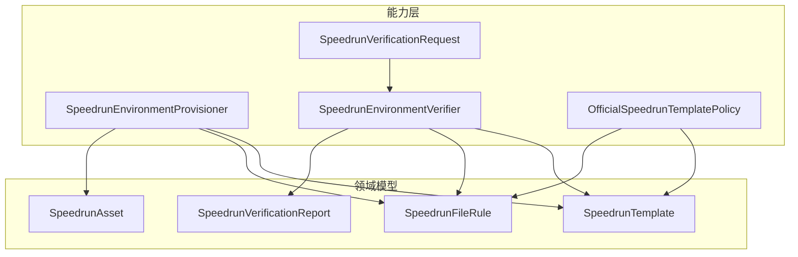
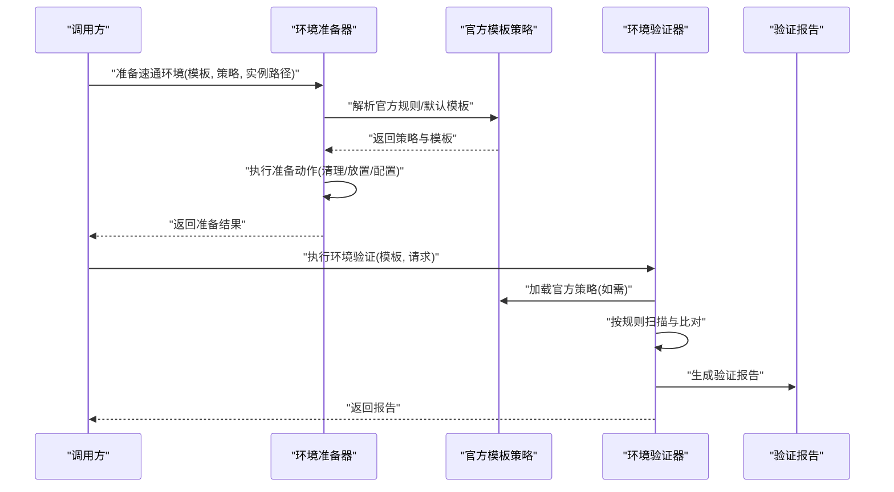
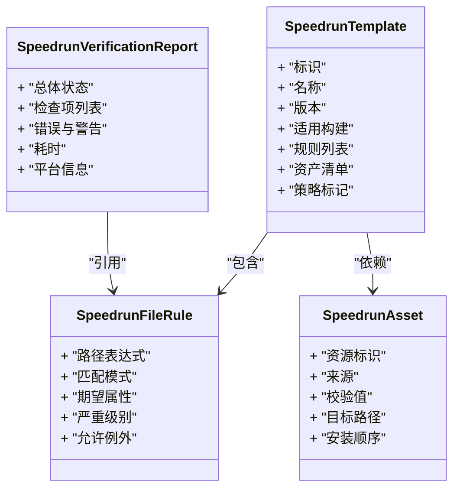
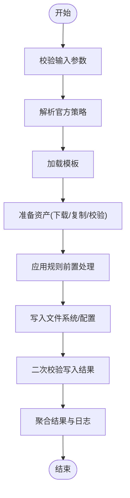
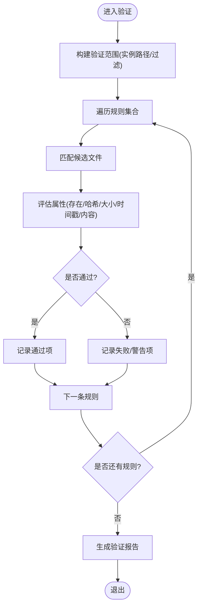
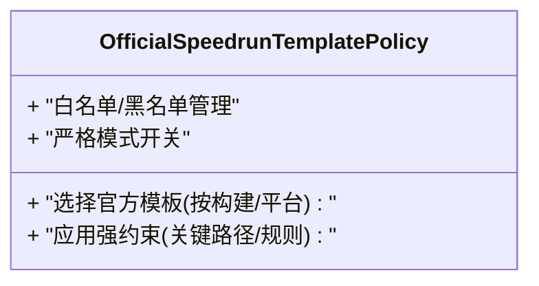
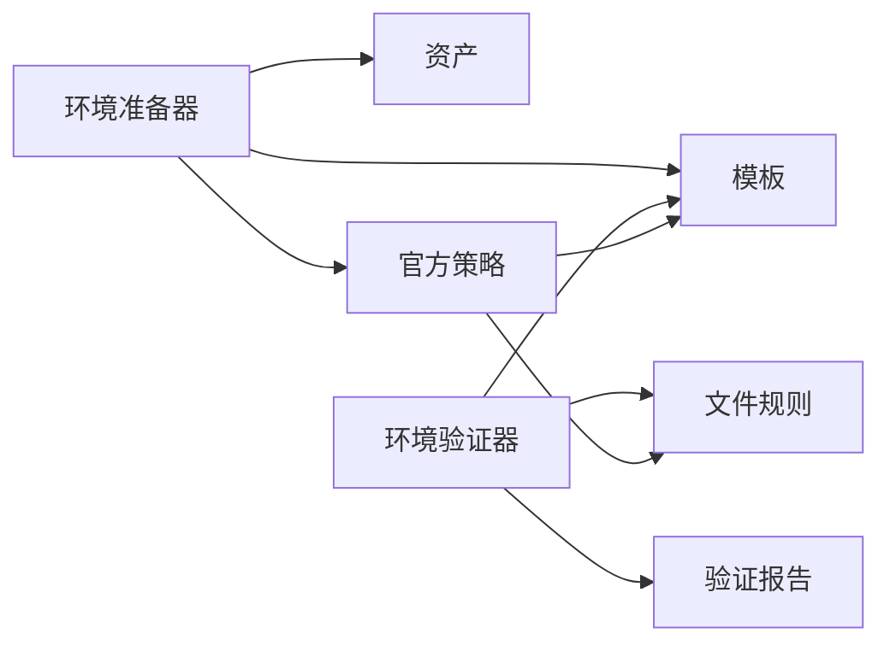

# 速通支持

<cite>
**本文引用的文件**   
- [SpeedrunEnvironmentProvisioner.cs](file://src/Crystalfly.Core/Speedrun/SpeedrunEnvironmentProvisioner.cs)
- [SpeedrunEnvironmentVerifier.cs](file://src/Crystalfly.Core/Speedrun/SpeedrunEnvironmentVerifier.cs)
- [OfficialSpeedrunTemplatePolicy.cs](file://src/Crystalfly.Core/Speedrun/OfficialSpeedrunTemplatePolicy.cs)
- [SpeedrunVerificationRequest.cs](file://src/Crystalfly.Core/Speedrun/SpeedrunVerificationRequest.cs)
- [SpeedrunTemplate.cs](file://src/Crystalfly.Core/Models/SpeedrunTemplate.cs)
- [SpeedrunFileRule.cs](file://src/Crystalfly.Core/Models/SpeedrunFileRule.cs)
- [SpeedrunAsset.cs](file://src/Crystalfly.Core/Models/SpeedrunAsset.cs)
- [SpeedrunVerificationReport.cs](file://src/Crystalfly.Core/Models/SpeedrunVerificationReport.cs)
- [SpeedrunEnvironmentProvisionerTests.cs](file://tests/Crystalfly.Core.Tests/Speedrun/SpeedrunEnvironmentProvisionerTests.cs)
- [SpeedrunEnvironmentVerifierTests.cs](file://tests/Crystalfly.Core.Tests/Speedrun/SpeedrunEnvironmentVerifierTests.cs)
- [OfficialSpeedrunTemplatePolicyTests.cs](file://tests/Crystalfly.Core.Tests/Speedrun/OfficialSpeedrunTemplatePolicyTests.cs)
</cite>

## 目录
1. [简介](#简介)
2. [项目结构](#项目结构)
3. [核心组件](#核心组件)
4. [架构总览](#架构总览)
5. [详细组件分析](#详细组件分析)
6. [依赖分析](#依赖分析)
7. [性能考虑](#性能考虑)
8. [故障排查指南](#故障排查指南)
9. [结论](#结论)
10. [附录](#附录)

## 简介
本章节面向“速通支持”模块，系统性阐述速度跑环境准备与验证系统的实现细节。重点覆盖：
- 环境准备器：负责依据模板与策略，将实例目录准备为合规的速通运行环境。
- 环境验证器：基于模板规则对当前环境进行扫描、比对与判定，并生成结构化报告。
- 官方模板策略：提供官方速通规则的强制约束与默认行为。
- 模板模型与规则定义：说明 SpeedrunTemplate、SpeedrunFileRule、SpeedrunAsset 等数据结构的职责与关系。
- 验证报告：解释 SpeedrunVerificationReport 的结构与用途。
- 使用示例：给出如何准备环境、执行验证、生成报告的步骤指引（以路径引用代替具体代码）。
- 扩展与兼容：提供定制与扩展指南，以及环境差异兼容性与版本升级策略建议。

## 项目结构
速通相关代码位于 Core 层的 Speedrun 子目录与 Models 目录中，测试用例位于对应 Tests 目录。整体采用分层组织：
- 领域模型：Models 下的模板、规则、资产与报告类型。
- 能力层：Speedrun 下的准备器、验证器、策略与请求对象。
- 测试：针对各能力的单元测试，用于保障正确性与回归。

图表来源
- [SpeedrunEnvironmentProvisioner.cs](file://src/Crystalfly.Core/Speedrun/SpeedrunEnvironmentProvisioner.cs)
- [SpeedrunEnvironmentVerifier.cs](file://src/Crystalfly.Core/Speedrun/SpeedrunEnvironmentVerifier.cs)
- [OfficialSpeedrunTemplatePolicy.cs](file://src/Crystalfly.Core/Speedrun/OfficialSpeedrunTemplatePolicy.cs)
- [SpeedrunVerificationRequest.cs](file://src/Crystalfly.Core/Speedrun/SpeedrunVerificationRequest.cs)
- [SpeedrunTemplate.cs](file://src/Crystalfly.Core/Models/SpeedrunTemplate.cs)
- [SpeedrunFileRule.cs](file://src/Crystalfly.Core/Models/SpeedrunFileRule.cs)
- [SpeedrunAsset.cs](file://src/Crystalfly.Core/Models/SpeedrunAsset.cs)
- [SpeedrunVerificationReport.cs](file://src/Crystalfly.Core/Models/SpeedrunVerificationReport.cs)

章节来源
- [SpeedrunEnvironmentProvisioner.cs](file://src/Crystalfly.Core/Speedrun/SpeedrunEnvironmentProvisioner.cs)
- [SpeedrunEnvironmentVerifier.cs](file://src/Crystalfly.Core/Speedrun/SpeedrunEnvironmentVerifier.cs)
- [OfficialSpeedrunTemplatePolicy.cs](file://src/Crystalfly.Core/Speedrun/OfficialSpeedrunTemplatePolicy.cs)
- [SpeedrunVerificationRequest.cs](file://src/Crystalfly.Core/Speedrun/SpeedrunVerificationRequest.cs)
- [SpeedrunTemplate.cs](file://src/Crystalfly.Core/Models/SpeedrunTemplate.cs)
- [SpeedrunFileRule.cs](file://src/Crystalfly.Core/Models/SpeedrunFileRule.cs)
- [SpeedrunAsset.cs](file://src/Crystalfly.Core/Models/SpeedrunAsset.cs)
- [SpeedrunVerificationReport.cs](file://src/Crystalfly.Core/Models/SpeedrunVerificationReport.cs)

## 核心组件
本节概述关键类与职责边界，便于快速理解系统分工。

- 环境准备器（SpeedrunEnvironmentProvisioner）
  - 职责：根据模板与策略，对目标实例目录执行必要的准备操作（如清理、放置资源、调整配置），使其满足速通规则。
  - 输入：模板、策略、目标实例路径、可选参数。
  - 输出：准备结果（成功/失败及原因）。
  - 关键点：幂等性、可回滚的事务式变更、错误聚合与日志。

- 环境验证器（SpeedrunEnvironmentVerifier）
  - 职责：读取当前环境状态，对照模板规则逐项校验，产出结构化验证报告。
  - 输入：模板、验证请求（包含实例路径、过滤条件等）。
  - 输出：验证报告（通过/失败项、详情、证据）。
  - 关键点：规则匹配算法、性能优化（并行/增量）、可观测性。

- 官方模板策略（OfficialSpeedrunTemplatePolicy）
  - 职责：封装官方速通规则的策略逻辑，包括默认模板选择、规则强约束、白名单/黑名单处理等。
  - 关键点：策略可扩展、可替换；对外暴露统一接口。

- 验证请求（SpeedrunVerificationRequest）
  - 职责：封装一次验证所需的上下文信息（实例路径、规则范围、是否严格模式等）。

章节来源
- [SpeedrunEnvironmentProvisioner.cs](file://src/Crystalfly.Core/Speedrun/SpeedrunEnvironmentProvisioner.cs)
- [SpeedrunEnvironmentVerifier.cs](file://src/Crystalfly.Core/Speedrun/SpeedrunEnvironmentVerifier.cs)
- [OfficialSpeedrunTemplatePolicy.cs](file://src/Crystalfly.Core/Speedrun/OfficialSpeedrunTemplatePolicy.cs)
- [SpeedrunVerificationRequest.cs](file://src/Crystalfly.Core/Speedrun/SpeedrunVerificationRequest.cs)

## 架构总览
下图展示从“准备环境”到“验证并生成报告”的整体流程，以及官方策略在其中的作用点。

图表来源
- [SpeedrunEnvironmentProvisioner.cs](file://src/Crystalfly.Core/Speedrun/SpeedrunEnvironmentProvisioner.cs)
- [OfficialSpeedrunTemplatePolicy.cs](file://src/Crystalfly.Core/Speedrun/OfficialSpeedrunTemplatePolicy.cs)
- [SpeedrunEnvironmentVerifier.cs](file://src/Crystalfly.Core/Speedrun/SpeedrunEnvironmentVerifier.cs)
- [SpeedrunVerificationReport.cs](file://src/Crystalfly.Core/Models/SpeedrunVerificationReport.cs)

## 详细组件分析

### 模板与规则模型
- SpeedrunTemplate
  - 描述：速通模板的顶层定义，包含模板元信息、适用版本、关联资产与规则集合等。
  - 典型字段：标识、名称、版本、适用游戏构建、规则列表、资产清单、策略标记等。
- SpeedrunFileRule
  - 描述：文件级规则，定义路径匹配、存在性、哈希/大小/时间戳等约束，以及违规时的严重级别。
  - 典型字段：路径表达式、匹配模式、期望属性、严重级别、是否允许例外等。
- SpeedrunAsset
  - 描述：模板所需的外部资源或内置资源定位信息，供准备阶段下载或复制。
  - 典型字段：资源标识、来源、校验值、目标路径、安装顺序等。
- SpeedrunVerificationReport
  - 描述：验证结果的载体，包含总体结论、明细项、证据与统计信息。
  - 典型字段：总体状态、检查项列表、错误与警告、耗时、平台信息等。

图表来源
- [SpeedrunTemplate.cs](file://src/Crystalfly.Core/Models/SpeedrunTemplate.cs)
- [SpeedrunFileRule.cs](file://src/Crystalfly.Core/Models/SpeedrunFileRule.cs)
- [SpeedrunAsset.cs](file://src/Crystalfly.Core/Models/SpeedrunAsset.cs)
- [SpeedrunVerificationReport.cs](file://src/Crystalfly.Core/Models/SpeedrunVerificationReport.cs)

章节来源
- [SpeedrunTemplate.cs](file://src/Crystalfly.Core/Models/SpeedrunTemplate.cs)
- [SpeedrunFileRule.cs](file://src/Crystalfly.Core/Models/SpeedrunFileRule.cs)
- [SpeedrunAsset.cs](file://src/Crystalfly.Core/Models/SpeedrunAsset.cs)
- [SpeedrunVerificationReport.cs](file://src/Crystalfly.Core/Models/SpeedrunVerificationReport.cs)

### 环境准备器（SpeedrunEnvironmentProvisioner）
- 功能要点
  - 解析模板与策略，确定需要准备的资产与规则。
  - 执行准备动作：清理冗余文件、放置必要资源、更新配置文件、设置权限等。
  - 保证幂等：重复准备不会产生副作用。
  - 错误聚合：记录所有失败项，便于一次性修复。
- 关键流程
  - 输入校验 → 策略解析 → 模板加载 → 资产准备 → 规则前置处理 → 写入与校验 → 结果汇总。
- 注意事项
  - 对敏感路径需做安全校验。
  - 大文件/网络资源应支持断点续传与校验。
  - 提供事务式回滚能力，避免半完成状态。

图表来源
- [SpeedrunEnvironmentProvisioner.cs](file://src/Crystalfly.Core/Speedrun/SpeedrunEnvironmentProvisioner.cs)
- [OfficialSpeedrunTemplatePolicy.cs](file://src/Crystalfly.Core/Speedrun/OfficialSpeedrunTemplatePolicy.cs)
- [SpeedrunTemplate.cs](file://src/Crystalfly.Core/Models/SpeedrunTemplate.cs)
- [SpeedrunAsset.cs](file://src/Crystalfly.Core/Models/SpeedrunAsset.cs)

章节来源
- [SpeedrunEnvironmentProvisioner.cs](file://src/Crystalfly.Core/Speedrun/SpeedrunEnvironmentProvisioner.cs)
- [OfficialSpeedrunTemplatePolicy.cs](file://src/Crystalfly.Core/Speedrun/OfficialSpeedrunTemplatePolicy.cs)
- [SpeedrunTemplate.cs](file://src/Crystalfly.Core/Models/SpeedrunTemplate.cs)
- [SpeedrunAsset.cs](file://src/Crystalfly.Core/Models/SpeedrunAsset.cs)

### 环境验证器（SpeedrunEnvironmentVerifier）
- 功能要点
  - 读取当前环境状态，按模板规则逐项比对。
  - 支持多种匹配策略（精确路径、通配、正则等）。
  - 生成结构化报告，包含通过/失败/跳过项及证据。
- 规则验证算法（概要）
  - 遍历规则集合 → 计算候选文件集 → 评估属性（存在/哈希/大小/时间戳/内容片段）→ 判定通过/失败/警告 → 收集证据 → 汇总报告。
- 性能优化
  - 并行扫描与校验（受 I/O 限制）。
  - 增量校验（缓存上次校验指纹）。
  - 短路策略（遇到致命错误提前终止部分分支）。

图表来源
- [SpeedrunEnvironmentVerifier.cs](file://src/Crystalfly.Core/Speedrun/SpeedrunEnvironmentVerifier.cs)
- [SpeedrunFileRule.cs](file://src/Crystalfly.Core/Models/SpeedrunFileRule.cs)
- [SpeedrunVerificationReport.cs](file://src/Crystalfly.Core/Models/SpeedrunVerificationReport.cs)

章节来源
- [SpeedrunEnvironmentVerifier.cs](file://src/Crystalfly.Core/Speedrun/SpeedrunEnvironmentVerifier.cs)
- [SpeedrunFileRule.cs](file://src/Crystalfly.Core/Models/SpeedrunFileRule.cs)
- [SpeedrunVerificationReport.cs](file://src/Crystalfly.Core/Models/SpeedrunVerificationReport.cs)

### 官方模板策略（OfficialSpeedrunTemplatePolicy）
- 功能要点
  - 提供官方速通规则的权威来源与默认模板。
  - 强制执行机制：拒绝非官方允许的修改、强制启用严格模式、锁定关键路径与规则。
  - 可扩展点：允许在保持官方约束的前提下，扩展自定义策略（例如仅放宽非关键路径）。
- 关键行为
  - 模板选择：根据游戏构建与平台自动选择最匹配的官方模板。
  - 规则强约束：对关键文件与目录施加不可覆盖的规则。
  - 白名单/黑名单：管理允许与禁止的资源集合。

图表来源
- [OfficialSpeedrunTemplatePolicy.cs](file://src/Crystalfly.Core/Speedrun/OfficialSpeedrunTemplatePolicy.cs)

章节来源
- [OfficialSpeedrunTemplatePolicy.cs](file://src/Crystalfly.Core/Speedrun/OfficialSpeedrunTemplatePolicy.cs)

### 验证请求（SpeedrunVerificationRequest）
- 作用：封装一次验证的上下文，包括实例路径、规则范围、是否严格模式、并发度等。
- 设计考量：支持分页/分批验证、超时控制、重试策略。

章节来源
- [SpeedrunVerificationRequest.cs](file://src/Crystalfly.Core/Speedrun/SpeedrunVerificationRequest.cs)

## 依赖分析
- 内部依赖
  - 准备器依赖模板与资产模型，并在必要时调用官方策略。
  - 验证器依赖模板与规则模型，并产出验证报告。
  - 官方策略独立于具体实现，提供策略抽象与默认实现。
- 外部依赖
  - 文件系统访问、网络下载（若资产来自远程）、校验算法（哈希/签名）。
- 潜在耦合点
  - 模板与策略的版本兼容性。
  - 规则表达式的解析与匹配性能。
  - 报告模型的演进与向后兼容。

图表来源
- [SpeedrunEnvironmentProvisioner.cs](file://src/Crystalfly.Core/Speedrun/SpeedrunEnvironmentProvisioner.cs)
- [SpeedrunEnvironmentVerifier.cs](file://src/Crystalfly.Core/Speedrun/SpeedrunEnvironmentVerifier.cs)
- [OfficialSpeedrunTemplatePolicy.cs](file://src/Crystalfly.Core/Speedrun/OfficialSpeedrunTemplatePolicy.cs)
- [SpeedrunTemplate.cs](file://src/Crystalfly.Core/Models/SpeedrunTemplate.cs)
- [SpeedrunFileRule.cs](file://src/Crystalfly.Core/Models/SpeedrunFileRule.cs)
- [SpeedrunAsset.cs](file://src/Crystalfly.Core/Models/SpeedrunAsset.cs)
- [SpeedrunVerificationReport.cs](file://src/Crystalfly.Core/Models/SpeedrunVerificationReport.cs)

章节来源
- [SpeedrunEnvironmentProvisioner.cs](file://src/Crystalfly.Core/Speedrun/SpeedrunEnvironmentProvisioner.cs)
- [SpeedrunEnvironmentVerifier.cs](file://src/Crystalfly.Core/Speedrun/SpeedrunEnvironmentVerifier.cs)
- [OfficialSpeedrunTemplatePolicy.cs](file://src/Crystalfly.Core/Speedrun/OfficialSpeedrunTemplatePolicy.cs)
- [SpeedrunTemplate.cs](file://src/Crystalfly.Core/Models/SpeedrunTemplate.cs)
- [SpeedrunFileRule.cs](file://src/Crystalfly.Core/Models/SpeedrunFileRule.cs)
- [SpeedrunAsset.cs](file://src/Crystalfly.Core/Models/SpeedrunAsset.cs)
- [SpeedrunVerificationReport.cs](file://src/Crystalfly.Core/Models/SpeedrunVerificationReport.cs)

## 性能考虑
- 规则匹配
  - 优先使用前缀/后缀索引与通配预编译，减少全量扫描。
  - 对大型目录树采用分片与并行处理。
- 校验开销
  - 哈希计算尽量走零拷贝或流式读取；对热点文件引入缓存。
  - 时间戳/大小等轻量属性优先判断，重校验后置。
- I/O 与网络
  - 资产下载支持并发与限速；失败重试与退避。
  - 本地写入批量合并，减少系统调用次数。
- 内存占用
  - 按需加载规则与资产清单，避免一次性载入超大模板。

[本节为通用指导，不直接分析具体文件]

## 故障排查指南
- 常见问题
  - 模板版本不匹配：确认模板与游戏构建/平台的兼容性。
  - 规则匹配失败：检查路径表达式与通配符是否正确。
  - 资产下载失败：核对来源地址、网络连通性与校验值。
  - 权限不足：确保对目标路径具备读写权限。
- 诊断手段
  - 查看验证报告中的失败项与证据。
  - 开启更详细的日志，关注准备与验证阶段的异常堆栈。
  - 使用最小化模板复现问题，逐步扩大范围定位。

章节来源
- [SpeedrunEnvironmentVerifierTests.cs](file://tests/Crystalfly.Core.Tests/Speedrun/SpeedrunEnvironmentVerifierTests.cs)
- [SpeedrunEnvironmentProvisionerTests.cs](file://tests/Crystalfly.Core.Tests/Speedrun/SpeedrunEnvironmentProvisionerTests.cs)
- [OfficialSpeedrunTemplatePolicyTests.cs](file://tests/Crystalfly.Core.Tests/Speedrun/OfficialSpeedrunTemplatePolicyTests.cs)

## 结论
速通支持模块通过模板驱动的方式，将“环境准备”和“环境验证”解耦，并以官方策略作为权威约束源，确保速通环境的合规性与一致性。借助结构化的验证报告与可扩展的策略体系，用户可在遵循官方规则的前提下灵活定制与扩展。

[本节为总结性内容，不直接分析具体文件]

## 附录

### 使用示例（步骤指引）
- 准备速通环境
  - 步骤：构造准备器 → 指定模板与官方策略 → 传入实例路径 → 执行准备 → 获取结果。
  - 参考路径：[准备器入口](file://src/Crystalfly.Core/Speedrun/SpeedrunEnvironmentProvisioner.cs)、[官方策略](file://src/Crystalfly.Core/Speedrun/OfficialSpeedrunTemplatePolicy.cs)。
- 执行环境验证
  - 步骤：构造验证请求 → 指定模板与实例路径 → 调用验证器 → 获取报告。
  - 参考路径：[验证器入口](file://src/Crystalfly.Core/Speedrun/SpeedrunEnvironmentVerifier.cs)、[验证请求](file://src/Crystalfly.Core/Speedrun/SpeedrunVerificationRequest.cs)、[验证报告](file://src/Crystalfly.Core/Models/SpeedrunVerificationReport.cs)。
- 生成合规性报告
  - 步骤：在验证完成后，读取报告中的总体状态与明细项，导出为 JSON/文本。
  - 参考路径：[验证报告模型](file://src/Crystalfly.Core/Models/SpeedrunVerificationReport.cs)。

章节来源
- [SpeedrunEnvironmentProvisioner.cs](file://src/Crystalfly.Core/Speedrun/SpeedrunEnvironmentProvisioner.cs)
- [OfficialSpeedrunTemplatePolicy.cs](file://src/Crystalfly.Core/Speedrun/OfficialSpeedrunTemplatePolicy.cs)
- [SpeedrunEnvironmentVerifier.cs](file://src/Crystalfly.Core/Speedrun/SpeedrunEnvironmentVerifier.cs)
- [SpeedrunVerificationRequest.cs](file://src/Crystalfly.Core/Speedrun/SpeedrunVerificationRequest.cs)
- [SpeedrunVerificationReport.cs](file://src/Crystalfly.Core/Models/SpeedrunVerificationReport.cs)

### 官方速通规则的强制执行机制
- 策略锁定：关键路径与规则不可被覆盖。
- 严格模式：默认开启，拒绝任何偏离官方定义的变更。
- 白名单/黑名单：集中管理允许与禁止的资源集合。
- 版本绑定：模板与游戏构建版本强绑定，防止误用。

章节来源
- [OfficialSpeedrunTemplatePolicy.cs](file://src/Crystalfly.Core/Speedrun/OfficialSpeedrunTemplatePolicy.cs)

### 速通环境定制与扩展指南
- 自定义策略
  - 在官方策略基础上派生新策略，仅放宽非关键路径规则。
  - 保留官方强约束，确保合规性不被破坏。
- 自定义模板
  - 新增模板时，明确适用构建与平台，完善资产清单与规则集合。
  - 提供最小可用模板，逐步增强约束。
- 规则扩展
  - 新增匹配模式时需兼顾性能与可读性。
  - 对复杂规则提供测试用例，确保稳定性。

章节来源
- [SpeedrunTemplate.cs](file://src/Crystalfly.Core/Models/SpeedrunTemplate.cs)
- [SpeedrunFileRule.cs](file://src/Crystalfly.Core/Models/SpeedrunFileRule.cs)
- [SpeedrunAsset.cs](file://src/Crystalfly.Core/Models/SpeedrunAsset.cs)
- [OfficialSpeedrunTemplatePolicy.cs](file://src/Crystalfly.Core/Speedrun/OfficialSpeedrunTemplatePolicy.cs)

### 环境差异兼容性与版本升级策略
- 兼容性
  - 模板版本与游戏构建版本映射表，确保选择正确的模板。
  - 规则表达式向后兼容，旧模板在新平台上尽可能降级运行。
- 升级策略
  - 渐进式升级：先只读验证，再提示变更，最后执行准备。
  - 回滚机制：准备失败时自动恢复至上一稳定状态。
  - 灰度发布：对新模板与小范围用户先行验证，再全量推广。

[本节为通用指导，不直接分析具体文件]