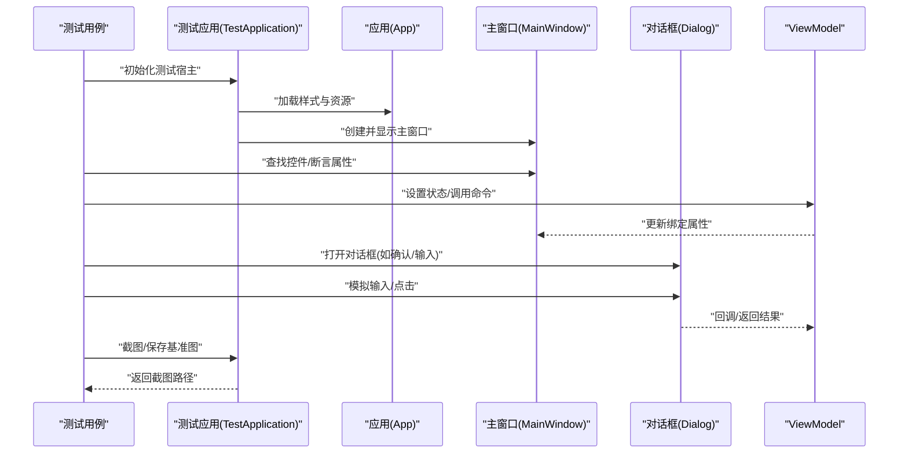
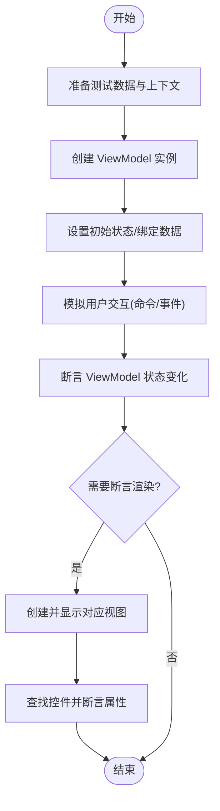
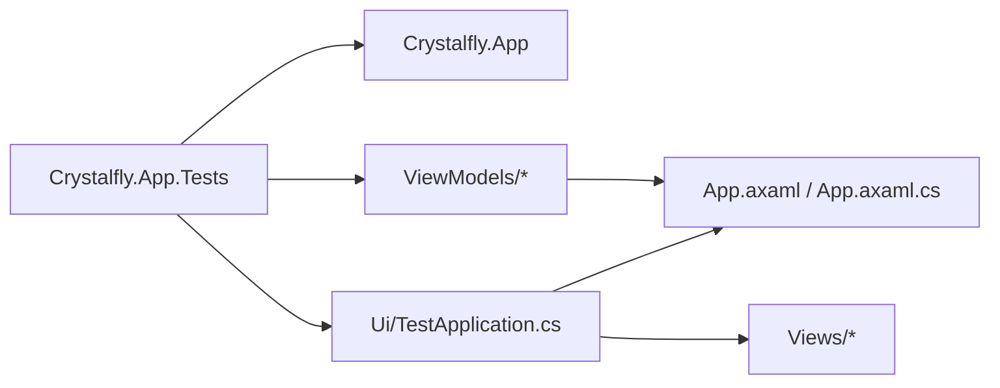

# UI 测试

<cite>
**本文引用的文件**   
- [Crystalfly.App.Tests.csproj](file://tests/Crystalfly.App.Tests/Crystalfly.App.Tests.csproj)
- [TestApplication.cs](file://tests/Crystalfly.App.Tests/Ui/TestApplication.cs)
- [MainWindowStructureTests.cs](file://tests/Crystalfly.App.Tests/Ui/MainWindowStructureTests.cs)
- [MainWindowCodeBehindTests.cs](file://tests/Crystalfly.App.Tests/Ui/MainWindowCodeBehindTests.cs)
- [LayoutRenderingTests.cs](file://tests/Crystalfly.App.Tests/Ui/LayoutRenderingTests.cs)
- [ModMarketRenderingTests.cs](file://tests/Crystalfly.App.Tests/Ui/ModMarketRenderingTests.cs)
- [DownloadQueueRenderingTests.cs](file://tests/Crystalfly.App.Tests/Ui/DownloadQueueRenderingTests.cs)
- [ThemeRenderingTests.cs](file://tests/Crystalfly.App.Tests/Ui/ThemeRenderingTests.cs)
- [DocumentationScreenshotTests.cs](file://tests/Crystalfly.App.Tests/Ui/DocumentationScreenshotTests.cs)
- [DialogViewModelTests.cs](file://tests/Crystalfly.App.Tests/ViewModels/DialogViewModelTests.cs)
- [MainViewModelStateTests.cs](file://tests/Crystalfly.App.Tests/ViewModels/MainViewModelStateTests.cs)
- [MarketInstallDialogViewModelTests.cs](file://tests/Crystalfly.App.Tests/ViewModels/MarketInstallDialogViewModelTests.cs)
- [ConfirmationDialogView.axaml](file://src/Crystalfly.App/Views/Dialogs/ConfirmationDialogView.axaml)
- [ConfirmationDialogView.axaml.cs](file://src/Crystalfly.App/Views/Dialogs/ConfirmationDialogView.axaml.cs)
- [DependencyPlanDialogView.axaml](file://src/Crystalfly.App/Views/Dialogs/DependencyPlanDialogView.axaml)
- [DependencyPlanDialogView.axaml.cs](file://src/Crystalfly.App/Views/Dialogs/DependencyPlanDialogView.axaml.cs)
- [MarketInstallDialogView.axaml](file://src/Crystalfly.App/Views/Dialogs/MarketInstallDialogView.axaml)
- [MarketInstallDialogView.axaml.cs](file://src/Crystalfly.App/Views/Dialogs/MarketInstallDialogView.axaml.cs)
- [TextInputDialogView.axaml](file://src/Crystalfly.App/Views/Dialogs/TextInputDialogView.axaml)
- [TextInputDialogView.axaml.cs](file://src/Crystalfly.App/Views/Dialogs/TextInputDialogView.axaml.cs)
- [MainWindow.axaml](file://src/Crystalfly.App/Views/MainWindow.axaml)
- [MainWindow.axaml.cs](file://src/Crystalfly.App/Views/MainWindow.axaml.cs)
- [App.axaml](file://src/Crystalfly.App/App.axaml)
- [App.axaml.cs](file://src/Crystalfly.App/App.axaml.cs)
- [CrystalflyTheme.axaml](file://src/Crystalfly.App/Styles/CrystalflyTheme.axaml)
</cite>

## 目录
1. [简介](#简介)
2. [项目结构](#项目结构)
3. [核心组件](#核心组件)
4. [架构总览](#架构总览)
5. [详细组件分析](#详细组件分析)
6. [依赖分析](#依赖分析)
7. [性能考虑](#性能考虑)
8. [故障排查指南](#故障排查指南)
9. [结论](#结论)
10. [附录](#附录)

## 简介
本文件面向 Crystalfly 项目的 UI 测试，聚焦于 Avalonia UI 测试框架的使用与策略。内容覆盖：
- MVVM 架构下的 ViewModel 状态变化、用户交互流程与界面渲染的测试方法
- 对话框、列表渲染、主题切换等典型 UI 场景的测试示例
- UI 自动化测试编写方法、截图测试与视觉回归测试
- 数据绑定验证、事件模拟与用户输入模拟
- UI 测试的性能考量与调试技巧

## 项目结构
UI 测试位于 tests/Crystalfly.App.Tests 下，按功能域组织为 Ui 与 ViewModels 两个子目录：
- Ui：基于 Avalonia 可视化树与渲染的测试，包含窗口结构、布局、市场页面、下载队列、主题与文档截图等
- ViewModels：针对 MVVM 中 ViewModel 的状态与命令行为进行单元测试

```mermaid
graph TB
subgraph "应用"
App["App.axaml / App.axaml.cs"]
MainWindow["MainWindow.axaml / MainWindow.axaml.cs"]
Theme["CrystalflyTheme.axaml"]
Dialogs["Dialogs/*.axaml & *.axaml.cs"]
end
subgraph "测试"
TestProj["Crystalfly.App.Tests.csproj"]
TestApp["Ui/TestApplication.cs"]
Structure["Ui/MainWindowStructureTests.cs"]
CodeBehind["Ui/MainWindowCodeBehindTests.cs"]
Layout["Ui/LayoutRenderingTests.cs"]
Market["Ui/ModMarketRenderingTests.cs"]
Queue["Ui/DownloadQueueRenderingTests.cs"]
ThemeT["Ui/ThemeRenderingTests.cs"]
Screenshot["Ui/DocumentationScreenshotTests.cs"]
VMDialog["ViewModels/DialogViewModelTests.cs"]
VMMain["ViewModels/MainViewModelStateTests.cs"]
VMInstall["ViewModels/MarketInstallDialogViewModelTests.cs"]
end
TestProj --> TestApp
TestApp --> App
TestApp --> MainWindow
TestApp --> Theme
TestApp --> Dialogs
Structure --> MainWindow
CodeBehind --> MainWindow
Layout --> MainWindow
Market --> MainWindow
Queue --> MainWindow
ThemeT --> Theme
Screenshot --> MainWindow
VMDialog --> Dialogs
VMMain --> MainWindow
VMInstall --> Dialogs
```

图表来源
- [Crystalfly.App.Tests.csproj](file://tests/Crystalfly.App.Tests/Crystalfly.App.Tests.csproj)
- [TestApplication.cs](file://tests/Crystalfly.App.Tests/Ui/TestApplication.cs)
- [MainWindowStructureTests.cs](file://tests/Crystalfly.App.Tests/Ui/MainWindowStructureTests.cs)
- [MainWindowCodeBehindTests.cs](file://tests/Crystalfly.App.Tests/Ui/MainWindowCodeBehindTests.cs)
- [LayoutRenderingTests.cs](file://tests/Crystalfly.App.Tests/Ui/LayoutRenderingTests.cs)
- [ModMarketRenderingTests.cs](file://tests/Crystalfly.App.Tests/Ui/ModMarketRenderingTests.cs)
- [DownloadQueueRenderingTests.cs](file://tests/Crystalfly.App.Tests/Ui/DownloadQueueRenderingTests.cs)
- [ThemeRenderingTests.cs](file://tests/Crystalfly.App.Tests/Ui/ThemeRenderingTests.cs)
- [DocumentationScreenshotTests.cs](file://tests/Crystalfly.App.Tests/Ui/DocumentationScreenshotTests.cs)
- [MainWindow.axaml](file://src/Crystalfly.App/Views/MainWindow.axaml)
- [MainWindow.axaml.cs](file://src/Crystalfly.App/Views/MainWindow.axaml.cs)
- [App.axaml](file://src/Crystalfly.App/App.axaml)
- [App.axaml.cs](file://src/Crystalfly.App/App.axaml.cs)
- [CrystalflyTheme.axaml](file://src/Crystalfly.App/Styles/CrystalflyTheme.axaml)
- [ConfirmationDialogView.axaml](file://src/Crystalfly.App/Views/Dialogs/ConfirmationDialogView.axaml)
- [ConfirmationDialogView.axaml.cs](file://src/Crystalfly.App/Views/Dialogs/ConfirmationDialogView.axaml.cs)
- [DependencyPlanDialogView.axaml](file://src/Crystalfly.App/Views/Dialogs/DependencyPlanDialogView.axaml)
- [DependencyPlanDialogView.axaml.cs](file://src/Crystalfly.App/Views/Dialogs/DependencyPlanDialogView.axaml.cs)
- [MarketInstallDialogView.axaml](file://src/Crystalfly.App/Views/Dialogs/MarketInstallDialogView.axaml)
- [MarketInstallDialogView.axaml.cs](file://src/Crystalfly.App/Views/Dialogs/MarketInstallDialogView.axaml.cs)
- [TextInputDialogView.axaml](file://src/Crystalfly.App/Views/Dialogs/TextInputDialogView.axaml)
- [TextInputDialogView.axaml.cs](file://src/Crystalfly.App/Views/Dialogs/TextInputDialogView.axaml.cs)

章节来源
- [Crystalfly.App.Tests.csproj](file://tests/Crystalfly.App.Tests/Crystalfly.App.Tests.csproj)
- [TestApplication.cs](file://tests/Crystalfly.App.Tests/Ui/TestApplication.cs)

## 核心组件
- 测试应用启动器：提供统一的测试宿主环境，负责初始化 Avalonia 运行时、加载样式与视图定位器，确保测试在一致的 UI 上下文中执行
- 主窗口结构与代码后置测试：验证主窗口的控件层次、命名与可见性，以及代码后置中的关键逻辑（如按钮点击、导航）
- 布局与渲染测试：断言不同分辨率或缩放下的布局稳定性与控件尺寸
- 市场页面与下载队列渲染测试：验证列表项渲染、滚动区域、状态标签等
- 主题渲染测试：验证主题资源切换对控件外观的影响
- 文档截图测试：生成用于文档的界面截图，便于回归对比
- ViewModel 测试：围绕对话框、主界面与安装流程的 ViewModel 状态机、命令与通知进行测试

章节来源
- [TestApplication.cs](file://tests/Crystalfly.App.Tests/Ui/TestApplication.cs)
- [MainWindowStructureTests.cs](file://tests/Crystalfly.App.Tests/Ui/MainWindowStructureTests.cs)
- [MainWindowCodeBehindTests.cs](file://tests/Crystalfly.App.Tests/Ui/MainWindowCodeBehindTests.cs)
- [LayoutRenderingTests.cs](file://tests/Crystalfly.App.Tests/Ui/LayoutRenderingTests.cs)
- [ModMarketRenderingTests.cs](file://tests/Crystalfly.App.Tests/Ui/ModMarketRenderingTests.cs)
- [DownloadQueueRenderingTests.cs](file://tests/Crystalfly.App.Tests/Ui/DownloadQueueRenderingTests.cs)
- [ThemeRenderingTests.cs](file://tests/Crystalfly.App.Tests/Ui/ThemeRenderingTests.cs)
- [DocumentationScreenshotTests.cs](file://tests/Crystalfly.App.Tests/Ui/DocumentationScreenshotTests.cs)
- [DialogViewModelTests.cs](file://tests/Crystalfly.App.Tests/ViewModels/DialogViewModelTests.cs)
- [MainViewModelStateTests.cs](file://tests/Crystalfly.App.Tests/ViewModels/MainViewModelStateTests.cs)
- [MarketInstallDialogViewModelTests.cs](file://tests/Crystalfly.App.Tests/ViewModels/MarketInstallDialogViewModelTests.cs)

## 架构总览
下图展示了 UI 测试与应用之间的交互关系：测试通过测试应用启动器创建并驱动主窗口与对话框，读取 ViewModel 状态与 UI 元素属性，必要时触发用户输入与事件，最终断言渲染结果或截图一致性。

图表来源
- [TestApplication.cs](file://tests/Crystalfly.App.Tests/Ui/TestApplication.cs)
- [MainWindow.axaml](file://src/Crystalfly.App/Views/MainWindow.axaml)
- [MainWindow.axaml.cs](file://src/Crystalfly.App/Views/MainWindow.axaml.cs)
- [App.axaml](file://src/Crystalfly.App/App.axaml)
- [App.axaml.cs](file://src/Crystalfly.App/App.axaml.cs)
- [ConfirmationDialogView.axaml](file://src/Crystalfly.App/Views/Dialogs/ConfirmationDialogView.axaml)
- [ConfirmationDialogView.axaml.cs](file://src/Crystalfly.App/Views/Dialogs/ConfirmationDialogView.axaml.cs)
- [MarketInstallDialogView.axaml](file://src/Crystalfly.App/Views/Dialogs/MarketInstallDialogView.axaml)
- [MarketInstallDialogView.axaml.cs](file://src/Crystalfly.App/Views/Dialogs/MarketInstallDialogView.axaml.cs)
- [TextInputDialogView.axaml](file://src/Crystalfly.App/Views/Dialogs/TextInputDialogView.axaml)
- [TextInputDialogView.axaml.cs](file://src/Crystalfly.App/Views/Dialogs/TextInputDialogView.axaml.cs)

## 详细组件分析

### 主窗口结构与代码后置测试
- 目标：验证主窗口控件树完整性、命名约定、可见性与可用性；验证代码后置中的交互逻辑（如按钮点击、菜单选择）
- 方法要点：
  - 使用测试应用启动器创建主窗口实例
  - 通过控件名称或类型查找节点，断言其属性
  - 触发事件后断言 ViewModel 状态或 UI 反馈
- 建议：
  - 将关键控件暴露为可测试的命名或标记，避免过度耦合
  - 对异步操作使用合适的等待机制，避免竞态条件

章节来源
- [MainWindowStructureTests.cs](file://tests/Crystalfly.App.Tests/Ui/MainWindowStructureTests.cs)
- [MainWindowCodeBehindTests.cs](file://tests/Crystalfly.App.Tests/Ui/MainWindowCodeBehindTests.cs)
- [MainWindow.axaml](file://src/Crystalfly.App/Views/MainWindow.axaml)
- [MainWindow.axaml.cs](file://src/Crystalfly.App/Views/MainWindow.axaml.cs)

### 布局与渲染测试
- 目标：在不同窗口大小、缩放比例与 DPI 下验证布局稳定性
- 方法要点：
  - 调整窗口尺寸或缩放因子后，断言关键控件的尺寸与位置
  - 检查滚动条、自适应网格与对齐是否正确
- 建议：
  - 使用固定基准尺寸与字体缩放组合，减少平台差异
  - 对复杂布局拆分为更小的可测试片段

章节来源
- [LayoutRenderingTests.cs](file://tests/Crystalfly.App.Tests/Ui/LayoutRenderingTests.cs)
- [MainWindow.axaml](file://src/Crystalfly.App/Views/MainWindow.axaml)

### 市场页面与下载队列渲染测试
- 目标：验证列表项渲染、分页/虚拟化的表现、状态标签与图标显示
- 方法要点：
  - 构造最小数据集，断言列表项数量与文本
  - 模拟网络或本地数据变更，观察 UI 刷新
  - 对下载队列，断言进度、状态与排序
- 建议：
  - 使用内存数据源或模拟服务，避免真实 I/O
  - 对长列表关注虚拟化是否生效，避免一次性渲染大量项

章节来源
- [ModMarketRenderingTests.cs](file://tests/Crystalfly.App.Tests/Ui/ModMarketRenderingTests.cs)
- [DownloadQueueRenderingTests.cs](file://tests/Crystalfly.App.Tests/Ui/DownloadQueueRenderingTests.cs)
- [MainWindow.axaml](file://src/Crystalfly.App/Views/MainWindow.axaml)

### 主题渲染测试
- 目标：验证主题切换对控件外观的影响，包括颜色、字体、图标与间距
- 方法要点：
  - 切换主题资源后，断言关键控件的外观属性
  - 对比明暗主题下的对比度与可读性
- 建议：
  - 将主题相关断言集中在单一测试类，便于维护
  - 使用稳定的基准截图辅助回归

章节来源
- [ThemeRenderingTests.cs](file://tests/Crystalfly.App.Tests/Ui/ThemeRenderingTests.cs)
- [CrystalflyTheme.axaml](file://src/Crystalfly.App/Styles/CrystalflyTheme.axaml)
- [App.axaml](file://src/Crystalfly.App/App.axaml)

### 文档截图测试
- 目标：生成用于文档的界面截图，作为视觉回归基线
- 方法要点：
  - 准备稳定数据与主题
  - 渲染到指定区域并保存为图片
  - 与基准图比较，输出差异报告
- 建议：
  - 固定 DPI、缩放与字体，确保跨平台一致
  - 将截图输出到独立目录，纳入版本控制或制品库

章节来源
- [DocumentationScreenshotTests.cs](file://tests/Crystalfly.App.Tests/Ui/DocumentationScreenshotTests.cs)

### 对话框测试（确认/输入/依赖计划/市场安装）
- 目标：验证对话框的打开、关闭、输入校验与返回值
- 方法要点：
  - 通过 ViewModel 或视图模型命令打开对话框
  - 模拟用户输入与确认/取消操作
  - 断言对话框关闭后的副作用（如安装计划生成、提示消息）
- 建议：
  - 将对话框的交互封装为可测试的命令或回调
  - 对异步流程使用明确的等待与超时策略

章节来源
- [DialogViewModelTests.cs](file://tests/Crystalfly.App.Tests/ViewModels/DialogViewModelTests.cs)
- [MarketInstallDialogViewModelTests.cs](file://tests/Crystalfly.App.Tests/ViewModels/MarketInstallDialogViewModelTests.cs)
- [ConfirmationDialogView.axaml](file://src/Crystalfly.App/Views/Dialogs/ConfirmationDialogView.axaml)
- [ConfirmationDialogView.axaml.cs](file://src/Crystalfly.App/Views/Dialogs/ConfirmationDialogView.axaml.cs)
- [DependencyPlanDialogView.axaml](file://src/Crystalfly.App/Views/Dialogs/DependencyPlanDialogView.axaml)
- [DependencyPlanDialogView.axaml.cs](file://src/Crystalfly.App/Views/Dialogs/DependencyPlanDialogView.axaml.cs)
- [MarketInstallDialogView.axaml](file://src/Crystalfly.App/Views/Dialogs/MarketInstallDialogView.axaml)
- [MarketInstallDialogView.axaml.cs](file://src/Crystalfly.App/Views/Dialogs/MarketInstallDialogView.axaml.cs)
- [TextInputDialogView.axaml](file://src/Crystalfly.App/Views/Dialogs/TextInputDialogView.axaml)
- [TextInputDialogView.axaml.cs](file://src/Crystalfly.App/Views/Dialogs/TextInputDialogView.axaml.cs)

### ViewModel 状态与命令测试（主界面）
- 目标：验证主界面 ViewModel 的状态机、命令执行与通知
- 方法要点：
  - 直接操作 ViewModel，断言属性变化与事件通知
  - 模拟用户操作对应的命令，验证副作用
- 建议：
  - 将业务逻辑尽量下沉至 ViewModel，保持 UI 层薄
  - 对耗时操作使用任务与取消令牌，便于测试注入

章节来源
- [MainViewModelStateTests.cs](file://tests/Crystalfly.App.Tests/ViewModels/MainViewModelStateTests.cs)
- [MainWindow.axaml](file://src/Crystalfly.App/Views/MainWindow.axaml)
- [MainWindow.axaml.cs](file://src/Crystalfly.App/Views/MainWindow.axaml.cs)

### 概念总览：MVVM 测试工作流

[此图为概念流程图，不映射具体源码文件]

## 依赖分析
- 测试项目引用应用项目，以便访问视图与样式资源
- 测试应用启动器负责初始化 Avalonia 运行时与资源加载
- 视图与 ViewModel 之间通过数据绑定与命令解耦，测试可直接作用于 ViewModel 或通过视图间接触发

图表来源
- [Crystalfly.App.Tests.csproj](file://tests/Crystalfly.App.Tests/Crystalfly.App.Tests.csproj)
- [TestApplication.cs](file://tests/Crystalfly.App.Tests/Ui/TestApplication.cs)
- [App.axaml](file://src/Crystalfly.App/App.axaml)
- [App.axaml.cs](file://src/Crystalfly.App/App.axaml.cs)

章节来源
- [Crystalfly.App.Tests.csproj](file://tests/Crystalfly.App.Tests/Crystalfly.App.Tests.csproj)
- [TestApplication.cs](file://tests/Crystalfly.App.Tests/Ui/TestApplication.cs)

## 性能考虑
- 避免在 UI 线程上执行耗时操作，测试中使用同步或可控的异步策略
- 对列表与大数据集，优先测试虚拟化与增量渲染逻辑
- 截图测试应固定渲染参数（DPI、缩放、字体），减少抖动
- 合理拆分测试用例，避免单测过长导致运行缓慢
- 使用内存数据源与模拟服务，降低 I/O 与外部依赖的不确定性

[本节为通用指导，不直接分析具体文件]

## 故障排查指南
- 测试无法找到控件：检查控件命名与可见性，确保在渲染完成后查找
- 异步时序问题：增加显式等待或使用测试框架提供的调度器
- 主题不一致：确认测试前已加载正确的主题资源
- 截图差异：核对 DPI、缩放与字体设置，必要时重新生成基准图
- 对话框未关闭：检查命令与回调是否正确触发，必要时添加日志或断点

[本节为通用指导，不直接分析具体文件]

## 结论
通过分层测试策略（ViewModel 单元级 + UI 渲染级 + 截图回归），可以在保证交互正确性的同时，快速发现布局与主题相关的回归问题。结合稳定的测试环境与清晰的断言规范，能够显著提升 UI 质量与交付信心。

[本节为总结性内容，不直接分析具体文件]

## 附录
- 常用测试清单
  - 主窗口结构：控件存在性、命名、可见性
  - 布局与渲染：尺寸、对齐、滚动
  - 市场与队列：列表项、状态、排序
  - 主题：颜色、字体、对比度
  - 对话框：打开/关闭、输入校验、返回值
  - ViewModel：状态变化、命令执行、通知
- 最佳实践
  - 将业务逻辑置于 ViewModel，UI 层仅做展示与交互
  - 使用稳定的数据与资源，避免外部依赖影响稳定性
  - 截图测试纳入持续集成，自动比对差异

[本节为补充信息，不直接分析具体文件]