# 单元测试

<cite>
**本文引用的文件**   
- [Crystalfly.App.Tests.csproj](file://tests/Crystalfly.App.Tests/Crystalfly.App.Tests.csproj)
- [Crystalfly.Core.Tests.csproj](file://tests/Crystalfly.Core.Tests/Crystalfly.Core.Tests.csproj)
- [Crystalfly.Steam.Tests.csproj](file://tests/Crystalfly.Steam.Tests/Crystalfly.Steam.Tests.csproj)
- [CatalogPackageQueueExecutorTests.cs](file://tests/Crystalfly.App.Tests/Downloads/CatalogPackageQueueExecutorTests.cs)
- [DownloadQueueServiceTests.cs](file://tests/Crystalfly.App.Tests/Downloads/DownloadQueueServiceTests.cs)
- [InstanceOperationCoordinatorTests.cs](file://tests/Crystalfly.App.Tests/Downloads/InstanceOperationCoordinatorTests.cs)
- [ModDependencyRepairQueueGroupFactoryTests.cs](file://tests/Crystalfly.App.Tests/Downloads/ModDependencyRepairQueueGroupFactoryTests.cs)
- [ModInstallQueueGroupFactoryTests.cs](file://tests/Crystalfly.App.Tests/Downloads/ModInstallQueueGroupFactoryTests.cs)
- [SteamDownloadQueueExecutorTests.cs](file://tests/Crystalfly.App.Tests/Downloads/SteamDownloadQueueExecutorTests.cs)
- [DocumentationScreenshotTests.cs](file://tests/Crystalfly.App.Tests/Ui/DocumentationScreenshotTests.cs)
- [DownloadQueueRenderingTests.cs](file://tests/Crystalfly.App.Tests/Ui/DownloadQueueRenderingTests.cs)
- [LayoutRenderingTests.cs](file://tests/Crystalfly.App.Tests/Ui/LayoutRenderingTests.cs)
- [MainWindowCodeBehindTests.cs](file://tests/Crystalfly.App.Tests/Ui/MainWindowCodeBehindTests.cs)
- [MainWindowStructureTests.cs](file://tests/Crystalfly.App.Tests/Ui/MainWindowStructureTests.cs)
- [ModMarketRenderingTests.cs](file://tests/Crystalfly.App.Tests/Ui/ModMarketRenderingTests.cs)
- [TestApplication.cs](file://tests/Crystalfly.App.Tests/Ui/TestApplication.cs)
- [ThemeRenderingTests.cs](file://tests/Crystalfly.App.Tests/Ui/ThemeRenderingTests.cs)
- [DialogViewModelTests.cs](file://tests/Crystalfly.App.Tests/ViewModels/DialogViewModelTests.cs)
- [DownloadQueueGroupItemViewModelTests.cs](file://tests/Crystalfly.App.Tests/ViewModels/DownloadQueueGroupItemViewModelTests.cs)
- [InstalledModItemViewModelTests.cs](file://tests/Crystalfly.App.Tests/ViewModels/InstalledModItemViewModelTests.cs)
- [LocalizationViewModelTests.cs](file://tests/Crystalfly.App.Tests/ViewModels/LocalizationViewModelTests.cs)
- [MainViewModelStateTests.cs](file://tests/Crystalfly.App.Tests/ViewModels/MainViewModelStateTests.cs)
- [MarketInstallDialogViewModelTests.cs](file://tests/Crystalfly.App.Tests/ViewModels/MarketInstallDialogViewModelTests.cs)
- [MarketModItemViewModelTests.cs](file://tests/Crystalfly.App.Tests/ViewModels/MarketModItemViewModelTests.cs)
- [CatalogMergerTests.cs](file://tests/Crystalfly.Core.Tests/Catalog/CatalogMergerTests.cs)
- [CatalogProviderTests.cs](file://tests/Crystalfly.Core.Tests/Catalog/CatalogProviderTests.cs)
- [CatalogResolverTests.cs](file://tests/Crystalfly.Core.Tests/Catalog/CatalogResolverTests.cs)
- [CustomCatalogSourceTests.cs](file://tests/Crystalfly.Core.Tests/Catalog/CustomCatalogSourceTests.cs)
- [EmbeddedCatalogTests.cs](file://tests/Crystalfly.Core.Tests/Catalog/EmbeddedCatalogTests.cs)
- [ModTranslationSourceTests.cs](file://tests/Crystalfly.Core.Tests/Catalog/ModTranslationSourceTests.cs)
- [OfficialCatalogSourceTests.cs](file://tests/Crystalfly.Core.Tests/Catalog/OfficialCatalogSourceTests.cs)
- [OfficialXmlCatalogParserTests.cs](file://tests/Crystalfly.Core.Tests/Catalog/OfficialXmlCatalogParserTests.cs)
- [CrystalflyPathsTests.cs](file://tests/Crystalfly.Core.Tests/Configuration/CrystalflyPathsTests.cs)
- [CrystalflySettingsStoreTests.cs](file://tests/Crystalfly.Core.Tests/Configuration/CrystalflySettingsStoreTests.cs)
- [BuildFingerprintServiceTests.cs](file://tests/Crystalfly.Core.Tests/Instances/BuildFingerprintServiceTests.cs)
- [InstanceCloneServiceTests.cs](file://tests/Crystalfly.Core.Tests/Instances/InstanceCloneServiceTests.cs)
- [InstanceDeletionServiceTests.cs](file://tests/Crystalfly.Core.Tests/Instances/InstanceDeletionServiceTests.cs)
- [InstanceDirectoryTests.cs](file://tests/Crystalfly.Core.Tests/Instances/InstanceDirectoryTests.cs)
- [InstanceImportServiceTests.cs](file://tests/Crystalfly.Core.Tests/Instances/InstanceImportServiceTests.cs)
- [InstanceSidecarTests.cs](file://tests/Crystalfly.Core.Tests/Instances/InstanceSidecarTests.cs)
- [VersionDirectoryScannerTests.cs](file://tests/Crystalfly.Core.Tests/Instances/VersionDirectoryScannerTests.cs)
- [LoaderManagerTests.cs](file://tests/Crystalfly.Core.Tests/Loaders/LoaderManagerTests.cs)
- [LoaderStateDetectorTests.cs](file://tests/Crystalfly.Core.Tests/Loaders/LoaderStateDetectorTests.cs)
- [LocalLoaderPackageManifestTests.cs](file://tests/Crystalfly.Core.Tests/Loaders/LocalLoaderPackageManifestTests.cs)
- [LocalLowIsolationServiceTests.cs](file://tests/Crystalfly.Core.Tests/LocalLow/LocalLowIsolationServiceTests.cs)
- [InstalledModDependencyGraphTests.cs](file://tests/Crystalfly.Core.Tests/Mods/InstalledModDependencyGraphTests.cs)
- [ModDependencyRepairPlannerTests.cs](file://tests/Crystalfly.Core.Tests/Mods/ModDependencyRepairPlannerTests.cs)
- [ModDependencyResolverTests.cs](file://tests/Crystalfly.Core.Tests/Mods/ModDependencyResolverTests.cs)
- [ModInstallServiceTests.cs](file://tests/Crystalfly.Core.Tests/Mods/ModInstallServiceTests.cs)
- [ModManagerTests.cs](file://tests/Crystalfly.Core.Tests/Mods/ModManagerTests.cs)
- [GitHubDownloadRouteHandlerTests.cs](file://tests/Crystalfly.Core.Tests/Networking/GitHubDownloadRouteHandlerTests.cs)
- [GitHubRouteLatencyServiceTests.cs](file://tests/Crystalfly.Core.Tests/Networking/GitHubRouteLatencyServiceTests.cs)
- [HollowKnightRuntimeTests.cs](file://tests/Crystalfly.Core.Tests/Runtime/HollowKnightRuntimeTests.cs)
- [LaunchPreflightEvaluatorTests.cs](file://tests/Crystalfly.Core.Tests/Runtime/LaunchPreflightEvaluatorTests.cs)
- [AtomicJsonStoreTests.cs](file://tests/Crystalfly.Core.Tests/Serialization/AtomicJsonStoreTests.cs)
- [ManifestSerializationTests.cs](file://tests/Crystalfly.Core.Tests/Serialization/ManifestSerializationTests.cs)
- [NamedSnapshotServiceTests.cs](file://tests/Crystalfly.Core.Tests/Snapshots/NamedSnapshotServiceTests.cs)
- [OfficialSpeedrunTemplatePolicyTests.cs](file://tests/Crystalfly.Core.Tests/Speedrun/OfficialSpeedrunTemplatePolicyTests.cs)
- [SpeedrunEnvironmentProvisionerTests.cs](file://tests/Crystalfly.Core.Tests/Speedrun/SpeedrunEnvironmentProvisionerTests.cs)
- [SpeedrunEnvironmentVerifierTests.cs](file://tests/Crystalfly.Core.Tests/Speedrun/SpeedrunEnvironmentVerifierTests.cs)
- [FileTransactionTests.cs](file://tests/Crystalfly.Core.Tests/Transactions/FileTransactionTests.cs)
- [DownloadPathTests.cs](file://tests/Crystalfly.Steam.Tests/Downloads/DownloadPathTests.cs)
- [DownloadProgressAggregatorTests.cs](file://tests/Crystalfly.Steam.Tests/Downloads/DownloadProgressAggregatorTests.cs)
- [SteamDepotDownloadServiceTests.cs](file://tests/Crystalfly.Steam.Tests/Downloads/SteamDepotDownloadServiceTests.cs)
- [SteamKitContentDeliveryClientTests.cs](file://tests/Crystalfly.Steam.Tests/Downloads/SteamKitContentDeliveryClientTests.cs)
- [DpapiRefreshTokenStoreTests.cs](file://tests/Crystalfly.Steam.Tests/Security/DpapiRefreshTokenStoreTests.cs)
</cite>

## 目录
1. [简介](#简介)
2. [项目结构](#项目结构)
3. [核心组件](#核心组件)
4. [架构总览](#架构总览)
5. [详细组件分析](#详细组件分析)
6. [依赖分析](#依赖分析)
7. [性能考虑](#性能考虑)
8. [故障排查指南](#故障排查指南)
9. [结论](#结论)
10. [附录](#附录)

## 简介
本文件面向 Crystalfly 项目的单元测试，目标是帮助开发者理解测试架构、组织方式与最佳实践。文档覆盖以下要点：
- 测试框架选择与理由（xUnit）
- 测试项目组织结构（按功能模块划分）
- 如何编写高质量单元测试（核心业务逻辑、Steam 集成服务、各类服务类）
- Mock 对象使用模式、测试数据工厂与环境配置
- 异步代码测试方法、异常处理与边界条件测试
- 覆盖率要求与团队最佳实践

## 项目结构
测试代码位于 tests 目录下，采用“按功能模块划分”的目录组织方式，与源码结构一一对应，便于定位与维护。

- Crystalfly.App.Tests：UI 层、ViewModel 层与 App 下载队列相关测试
  - Downloads：下载队列执行器与服务测试
  - Ui：界面渲染与结构验证测试
  - ViewModels：视图模型状态与交互测试
- Crystalfly.Core.Tests：核心领域能力测试
  - Catalog、Configuration、Instances、Loaders、LocalLow、Mods、Networking、Runtime、Serialization、Snapshots、Speedrun、Transactions 等子目录
- Crystalfly.Steam.Tests：Steam 集成能力测试
  - Downloads、Security 等子目录

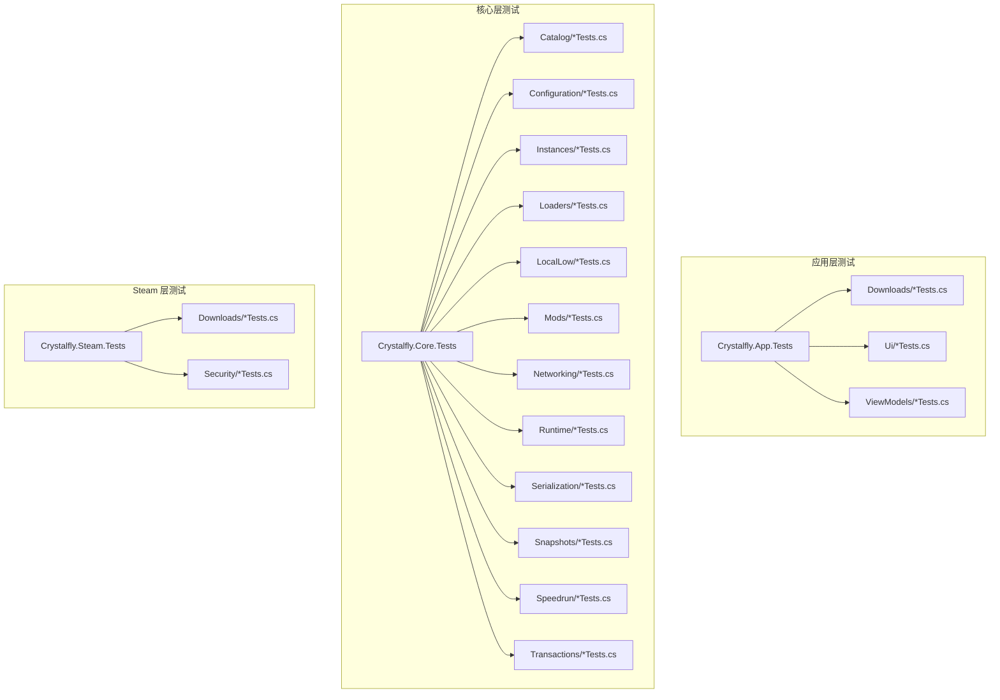

图表来源
- [Crystalfly.App.Tests.csproj](file://tests/Crystalfly.App.Tests/Crystalfly.App.Tests.csproj)
- [Crystalfly.Core.Tests.csproj](file://tests/Crystalfly.Core.Tests/Crystalfly.Core.Tests.csproj)
- [Crystalfly.Steam.Tests.csproj](file://tests/Crystalfly.Steam.Tests/Crystalfly.Steam.Tests.csproj)

章节来源
- [Crystalfly.App.Tests.csproj](file://tests/Crystalfly.App.Tests/Crystalfly.App.Tests.csproj)
- [Crystalfly.Core.Tests.csproj](file://tests/Crystalfly.Core.Tests/Crystalfly.Core.Tests.csproj)
- [Crystalfly.Steam.Tests.csproj](file://tests/Crystalfly.Steam.Tests/Crystalfly.Steam.Tests.csproj)

## 核心组件
本节聚焦测试基础设施与通用模式，涵盖 xUnit 基础、Mock 策略、测试数据工厂、环境配置与异步测试。

- 测试框架与运行
  - 使用 xUnit 作为测试框架，遵循其约定式命名与特性驱动风格。
  - 每个测试类对应一个被测主题，每个测试方法代表一个可验证场景。
- Mock 对象使用模式
  - 对 I/O、网络、外部系统（如 Steam）进行隔离，通过接口注入模拟实现。
  - 推荐在测试构造时创建最小化 Mock，仅暴露被测路径所需行为。
- 测试数据工厂
  - 为复杂对象提供工厂方法或辅助类，确保测试数据一致性与可读性。
  - 将可变状态封装在工厂内部，避免测试间相互污染。
- 测试环境配置
  - 使用临时目录、内存存储或轻量级持久化替代真实文件系统/数据库。
  - 对需要进程/平台能力的测试，提供开关或跳过机制。
- 异步代码测试
  - 使用异步测试方法返回 Task，并在断言前等待任务完成。
  - 合理设置超时与取消令牌，避免测试挂起。
- 异常与边界条件
  - 显式断言异常类型与消息片段，覆盖空值、越界、重复操作等边界。
  - 对并发与竞态条件，使用确定性输入与可控调度。

章节来源
- [CatalogPackageQueueExecutorTests.cs](file://tests/Crystalfly.App.Tests/Downloads/CatalogPackageQueueExecutorTests.cs)
- [DownloadQueueServiceTests.cs](file://tests/Crystalfly.App.Tests/Downloads/DownloadQueueServiceTests.cs)
- [InstanceOperationCoordinatorTests.cs](file://tests/Crystalfly.App.Tests/Downloads/InstanceOperationCoordinatorTests.cs)
- [ModDependencyRepairQueueGroupFactoryTests.cs](file://tests/Crystalfly.App.Tests/Downloads/ModDependencyRepairQueueGroupFactoryTests.cs)
- [ModInstallQueueGroupFactoryTests.cs](file://tests/Crystalfly.App.Tests/Downloads/ModInstallQueueGroupFactoryTests.cs)
- [SteamDownloadQueueExecutorTests.cs](file://tests/Crystalfly.App.Tests/Downloads/SteamDownloadQueueExecutorTests.cs)
- [CatalogMergerTests.cs](file://tests/Crystalfly.Core.Tests/Catalog/CatalogMergerTests.cs)
- [CatalogProviderTests.cs](file://tests/Crystalfly.Core.Tests/Catalog/CatalogProviderTests.cs)
- [CatalogResolverTests.cs](file://tests/Crystalfly.Core.Tests/Catalog/CatalogResolverTests.cs)
- [CustomCatalogSourceTests.cs](file://tests/Crystalfly.Core.Tests/Catalog/CustomCatalogSourceTests.cs)
- [EmbeddedCatalogTests.cs](file://tests/Crystalfly.Core.Tests/Catalog/EmbeddedCatalogTests.cs)
- [ModTranslationSourceTests.cs](file://tests/Crystalfly.Core.Tests/Catalog/ModTranslationSourceTests.cs)
- [OfficialCatalogSourceTests.cs](file://tests/Crystalfly.Core.Tests/Catalog/OfficialCatalogSourceTests.cs)
- [OfficialXmlCatalogParserTests.cs](file://tests/Crystalfly.Core.Tests/Catalog/OfficialXmlCatalogParserTests.cs)
- [CrystalflyPathsTests.cs](file://tests/Crystalfly.Core.Tests/Configuration/CrystalflyPathsTests.cs)
- [CrystalflySettingsStoreTests.cs](file://tests/Crystalfly.Core.Tests/Configuration/CrystalflySettingsStoreTests.cs)
- [BuildFingerprintServiceTests.cs](file://tests/Crystalfly.Core.Tests/Instances/BuildFingerprintServiceTests.cs)
- [InstanceCloneServiceTests.cs](file://tests/Crystalfly.Core.Tests/Instances/InstanceCloneServiceTests.cs)
- [InstanceDeletionServiceTests.cs](file://tests/Crystalfly.Core.Tests/Instances/InstanceDeletionServiceTests.cs)
- [InstanceDirectoryTests.cs](file://tests/Crystalfly.Core.Tests/Instances/InstanceDirectoryTests.cs)
- [InstanceImportServiceTests.cs](file://tests/Crystalfly.Core.Tests/Instances/InstanceImportServiceTests.cs)
- [InstanceSidecarTests.cs](file://tests/Crystalfly.Core.Tests/Instances/InstanceSidecarTests.cs)
- [VersionDirectoryScannerTests.cs](file://tests/Crystalfly.Core.Tests/Instances/VersionDirectoryScannerTests.cs)
- [LoaderManagerTests.cs](file://tests/Crystalfly.Core.Tests/Loaders/LoaderManagerTests.cs)
- [LoaderStateDetectorTests.cs](file://tests/Crystalfly.Core.Tests/Loaders/LoaderStateDetectorTests.cs)
- [LocalLoaderPackageManifestTests.cs](file://tests/Crystalfly.Core.Tests/Loaders/LocalLoaderPackageManifestTests.cs)
- [LocalLowIsolationServiceTests.cs](file://tests/Crystalfly.Core.Tests/LocalLow/LocalLowIsolationServiceTests.cs)
- [InstalledModDependencyGraphTests.cs](file://tests/Crystalfly.Core.Tests/Mods/InstalledModDependencyGraphTests.cs)
- [ModDependencyRepairPlannerTests.cs](file://tests/Crystalfly.Core.Tests/Mods/ModDependencyRepairPlannerTests.cs)
- [ModDependencyResolverTests.cs](file://tests/Crystalfly.Core.Tests/Mods/ModDependencyResolverTests.cs)
- [ModInstallServiceTests.cs](file://tests/Crystalfly.Core.Tests/Mods/ModInstallServiceTests.cs)
- [ModManagerTests.cs](file://tests/Crystalfly.Core.Tests/Mods/ModManagerTests.cs)
- [GitHubDownloadRouteHandlerTests.cs](file://tests/Crystalfly.Core.Tests/Networking/GitHubDownloadRouteHandlerTests.cs)
- [GitHubRouteLatencyServiceTests.cs](file://tests/Crystalfly.Core.Tests/Networking/GitHubRouteLatencyServiceTests.cs)
- [HollowKnightRuntimeTests.cs](file://tests/Crystalfly.Core.Tests/Runtime/HollowKnightRuntimeTests.cs)
- [LaunchPreflightEvaluatorTests.cs](file://tests/Crystalfly.Core.Tests/Runtime/LaunchPreflightEvaluatorTests.cs)
- [AtomicJsonStoreTests.cs](file://tests/Crystalfly.Core.Tests/Serialization/AtomicJsonStoreTests.cs)
- [ManifestSerializationTests.cs](file://tests/Crystalfly.Core.Tests/Serialization/ManifestSerializationTests.cs)
- [NamedSnapshotServiceTests.cs](file://tests/Crystalfly.Core.Tests/Snapshots/NamedSnapshotServiceTests.cs)
- [OfficialSpeedrunTemplatePolicyTests.cs](file://tests/Crystalfly.Core.Tests/Speedrun/OfficialSpeedrunTemplatePolicyTests.cs)
- [SpeedrunEnvironmentProvisionerTests.cs](file://tests/Crystalfly.Core.Tests/Speedrun/SpeedrunEnvironmentProvisionerTests.cs)
- [SpeedrunEnvironmentVerifierTests.cs](file://tests/Crystalfly.Core.Tests/Speedrun/SpeedrunEnvironmentVerifierTests.cs)
- [FileTransactionTests.cs](file://tests/Crystalfly.Core.Tests/Transactions/FileTransactionTests.cs)
- [DownloadPathTests.cs](file://tests/Crystalfly.Steam.Tests/Downloads/DownloadPathTests.cs)
- [DownloadProgressAggregatorTests.cs](file://tests/Crystalfly.Steam.Tests/Downloads/DownloadProgressAggregatorTests.cs)
- [SteamDepotDownloadServiceTests.cs](file://tests/Crystalfly.Steam.Tests/Downloads/SteamDepotDownloadServiceTests.cs)
- [SteamKitContentDeliveryClientTests.cs](file://tests/Crystalfly.Steam.Tests/Downloads/SteamKitContentDeliveryClientTests.cs)
- [DpapiRefreshTokenStoreTests.cs](file://tests/Crystalfly.Steam.Tests/Security/DpapiRefreshTokenStoreTests.cs)

## 架构总览
下图展示测试层与生产层的映射关系，以及关键测试入口与协作组件。

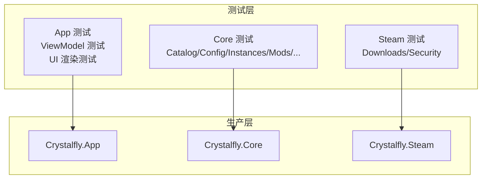

图表来源
- [Crystalfly.App.Tests.csproj](file://tests/Crystalfly.App.Tests/Crystalfly.App.Tests.csproj)
- [Crystalfly.Core.Tests.csproj](file://tests/Crystalfly.Core.Tests/Crystalfly.Core.Tests.csproj)
- [Crystalfly.Steam.Tests.csproj](file://tests/Crystalfly.Steam.Tests/Crystalfly.Steam.Tests.csproj)

## 详细组件分析

### 下载队列与协调器测试（App 层）
该组测试覆盖下载队列执行器、队列服务与实例操作协调器，重点验证：
- 任务入队、出队与执行顺序
- 失败重试与错误传播
- 多实例并发下的资源竞争与一致性

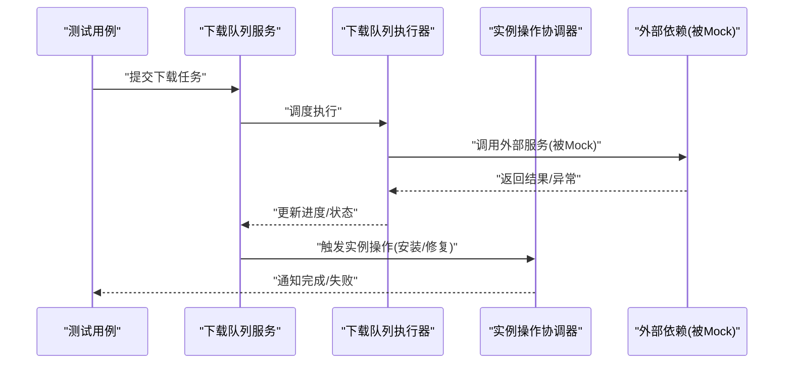

图表来源
- [DownloadQueueServiceTests.cs](file://tests/Crystalfly.App.Tests/Downloads/DownloadQueueServiceTests.cs)
- [CatalogPackageQueueExecutorTests.cs](file://tests/Crystalfly.App.Tests/Downloads/CatalogPackageQueueExecutorTests.cs)
- [InstanceOperationCoordinatorTests.cs](file://tests/Crystalfly.App.Tests/Downloads/InstanceOperationCoordinatorTests.cs)
- [SteamDownloadQueueExecutorTests.cs](file://tests/Crystalfly.App.Tests/Downloads/SteamDownloadQueueExecutorTests.cs)

章节来源
- [DownloadQueueServiceTests.cs](file://tests/Crystalfly.App.Tests/Downloads/DownloadQueueServiceTests.cs)
- [CatalogPackageQueueExecutorTests.cs](file://tests/Crystalfly.App.Tests/Downloads/CatalogPackageQueueExecutorTests.cs)
- [InstanceOperationCoordinatorTests.cs](file://tests/Crystalfly.App.Tests/Downloads/InstanceOperationCoordinatorTests.cs)
- [SteamDownloadQueueExecutorTests.cs](file://tests/Crystalfly.App.Tests/Downloads/SteamDownloadQueueExecutorTests.cs)

### UI 渲染与结构测试（App 层）
该组测试关注 Avalonia UI 的结构与渲染稳定性，包括主窗口结构、主题渲染、市场页面与下载队列渲染等。

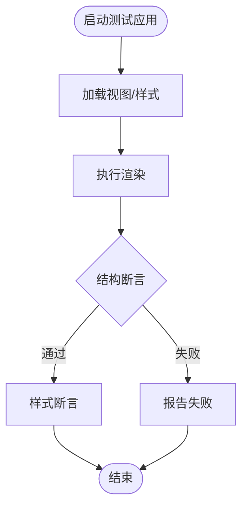

图表来源
- [MainWindowStructureTests.cs](file://tests/Crystalfly.App.Tests/Ui/MainWindowStructureTests.cs)
- [ThemeRenderingTests.cs](file://tests/Crystalfly.App.Tests/Ui/ThemeRenderingTests.cs)
- [ModMarketRenderingTests.cs](file://tests/Crystalfly.App.Tests/Ui/ModMarketRenderingTests.cs)
- [DownloadQueueRenderingTests.cs](file://tests/Crystalfly.App.Tests/Ui/DownloadQueueRenderingTests.cs)
- [LayoutRenderingTests.cs](file://tests/Crystalfly.App.Tests/Ui/LayoutRenderingTests.cs)
- [MainWindowCodeBehindTests.cs](file://tests/Crystalfly.App.Tests/Ui/MainWindowCodeBehindTests.cs)
- [DocumentationScreenshotTests.cs](file://tests/Crystalfly.App.Tests/Ui/DocumentationScreenshotTests.cs)
- [TestApplication.cs](file://tests/Crystalfly.App.Tests/Ui/TestApplication.cs)

章节来源
- [MainWindowStructureTests.cs](file://tests/Crystalfly.App.Tests/Ui/MainWindowStructureTests.cs)
- [ThemeRenderingTests.cs](file://tests/Crystalfly.App.Tests/Ui/ThemeRenderingTests.cs)
- [ModMarketRenderingTests.cs](file://tests/Crystalfly.App.Tests/Ui/ModMarketRenderingTests.cs)
- [DownloadQueueRenderingTests.cs](file://tests/Crystalfly.App.Tests/Ui/DownloadQueueRenderingTests.cs)
- [LayoutRenderingTests.cs](file://tests/Crystalfly.App.Tests/Ui/LayoutRenderingTests.cs)
- [MainWindowCodeBehindTests.cs](file://tests/Crystalfly.App.Tests/Ui/MainWindowCodeBehindTests.cs)
- [DocumentationScreenshotTests.cs](file://tests/Crystalfly.App.Tests/Ui/DocumentationScreenshotTests.cs)
- [TestApplication.cs](file://tests/Crystalfly.App.Tests/Ui/TestApplication.cs)

### ViewModel 状态与交互测试（App 层）
该组测试覆盖对话框、市场项、下载队列分组项、本地化与主视图模型的状态流转与命令响应。

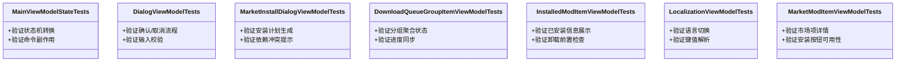

图表来源
- [MainViewModelStateTests.cs](file://tests/Crystalfly.App.Tests/ViewModels/MainViewModelStateTests.cs)
- [DialogViewModelTests.cs](file://tests/Crystalfly.App.Tests/ViewModels/DialogViewModelTests.cs)
- [MarketInstallDialogViewModelTests.cs](file://tests/Crystalfly.App.Tests/ViewModels/MarketInstallDialogViewModelTests.cs)
- [DownloadQueueGroupItemViewModelTests.cs](file://tests/Crystalfly.App.Tests/ViewModels/DownloadQueueGroupItemViewModelTests.cs)
- [InstalledModItemViewModelTests.cs](file://tests/Crystalfly.App.Tests/ViewModels/InstalledModItemViewModelTests.cs)
- [LocalizationViewModelTests.cs](file://tests/Crystalfly.App.Tests/ViewModels/LocalizationViewModelTests.cs)
- [MarketModItemViewModelTests.cs](file://tests/Crystalfly.App.Tests/ViewModels/MarketModItemViewModelTests.cs)

章节来源
- [MainViewModelStateTests.cs](file://tests/Crystalfly.App.Tests/ViewModels/MainViewModelStateTests.cs)
- [DialogViewModelTests.cs](file://tests/Crystalfly.App.Tests/ViewModels/DialogViewModelTests.cs)
- [MarketInstallDialogViewModelTests.cs](file://tests/Crystalfly.App.Tests/ViewModels/MarketInstallDialogViewModelTests.cs)
- [DownloadQueueGroupItemViewModelTests.cs](file://tests/Crystalfly.App.Tests/ViewModels/DownloadQueueGroupItemViewModelTests.cs)
- [InstalledModItemViewModelTests.cs](file://tests/Crystalfly.App.Tests/ViewModels/InstalledModItemViewModelTests.cs)
- [LocalizationViewModelTests.cs](file://tests/Crystalfly.App.Tests/ViewModels/LocalizationViewModelTests.cs)
- [MarketModItemViewModelTests.cs](file://tests/Crystalfly.App.Tests/ViewModels/MarketModItemViewModelTests.cs)

### 核心目录与解析测试（Core 层）
该组测试覆盖目录合并、提供者、解析器、官方源与自定义源、嵌入式目录与翻译源等。

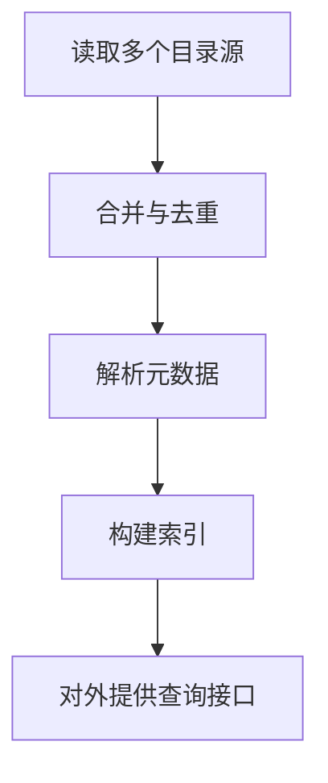

图表来源
- [CatalogMergerTests.cs](file://tests/Crystalfly.Core.Tests/Catalog/CatalogMergerTests.cs)
- [CatalogProviderTests.cs](file://tests/Crystalfly.Core.Tests/Catalog/CatalogProviderTests.cs)
- [CatalogResolverTests.cs](file://tests/Crystalfly.Core.Tests/Catalog/CatalogResolverTests.cs)
- [CustomCatalogSourceTests.cs](file://tests/Crystalfly.Core.Tests/Catalog/CustomCatalogSourceTests.cs)
- [EmbeddedCatalogTests.cs](file://tests/Crystalfly.Core.Tests/Catalog/EmbeddedCatalogTests.cs)
- [ModTranslationSourceTests.cs](file://tests/Crystalfly.Core.Tests/Catalog/ModTranslationSourceTests.cs)
- [OfficialCatalogSourceTests.cs](file://tests/Crystalfly.Core.Tests/Catalog/OfficialCatalogSourceTests.cs)
- [OfficialXmlCatalogParserTests.cs](file://tests/Crystalfly.Core.Tests/Catalog/OfficialXmlCatalogParserTests.cs)

章节来源
- [CatalogMergerTests.cs](file://tests/Crystalfly.Core.Tests/Catalog/CatalogMergerTests.cs)
- [CatalogProviderTests.cs](file://tests/Crystalfly.Core.Tests/Catalog/CatalogProviderTests.cs)
- [CatalogResolverTests.cs](file://tests/Crystalfly.Core.Tests/Catalog/CatalogResolverTests.cs)
- [CustomCatalogSourceTests.cs](file://tests/Crystalfly.Core.Tests/Catalog/CustomCatalogSourceTests.cs)
- [EmbeddedCatalogTests.cs](file://tests/Crystalfly.Core.Tests/Catalog/EmbeddedCatalogTests.cs)
- [ModTranslationSourceTests.cs](file://tests/Crystalfly.Core.Tests/Catalog/ModTranslationSourceTests.cs)
- [OfficialCatalogSourceTests.cs](file://tests/Crystalfly.Core.Tests/Catalog/OfficialCatalogSourceTests.cs)
- [OfficialXmlCatalogParserTests.cs](file://tests/Crystalfly.Core.Tests/Catalog/OfficialXmlCatalogParserTests.cs)

### 配置与路径测试（Core 层）
该组测试验证路径计算、设置存储读写与默认值策略。

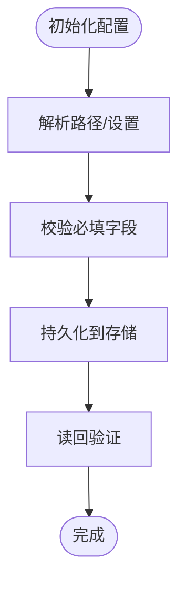

图表来源
- [CrystalflyPathsTests.cs](file://tests/Crystalfly.Core.Tests/Configuration/CrystalflyPathsTests.cs)
- [CrystalflySettingsStoreTests.cs](file://tests/Crystalfly.Core.Tests/Configuration/CrystalflySettingsStoreTests.cs)

章节来源
- [CrystalflyPathsTests.cs](file://tests/Crystalfly.Core.Tests/Configuration/CrystalflyPathsTests.cs)
- [CrystalflySettingsStoreTests.cs](file://tests/Crystalfly.Core.Tests/Configuration/CrystalflySettingsStoreTests.cs)

### 实例管理测试（Core 层）
该组测试覆盖构建指纹、克隆、删除、导入、侧车与版本目录扫描等。

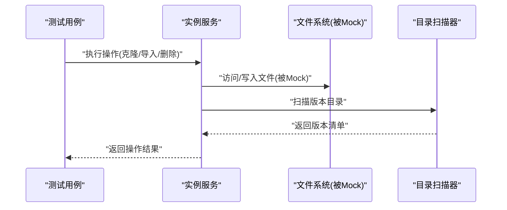

图表来源
- [BuildFingerprintServiceTests.cs](file://tests/Crystalfly.Core.Tests/Instances/BuildFingerprintServiceTests.cs)
- [InstanceCloneServiceTests.cs](file://tests/Crystalfly.Core.Tests/Instances/InstanceCloneServiceTests.cs)
- [InstanceDeletionServiceTests.cs](file://tests/Crystalfly.Core.Tests/Instances/InstanceDeletionServiceTests.cs)
- [InstanceImportServiceTests.cs](file://tests/Crystalfly.Core.Tests/Instances/InstanceImportServiceTests.cs)
- [InstanceSidecarTests.cs](file://tests/Crystalfly.Core.Tests/Instances/InstanceSidecarTests.cs)
- [VersionDirectoryScannerTests.cs](file://tests/Crystalfly.Core.Tests/Instances/VersionDirectoryScannerTests.cs)
- [InstanceDirectoryTests.cs](file://tests/Crystalfly.Core.Tests/Instances/InstanceDirectoryTests.cs)

章节来源
- [BuildFingerprintServiceTests.cs](file://tests/Crystalfly.Core.Tests/Instances/BuildFingerprintServiceTests.cs)
- [InstanceCloneServiceTests.cs](file://tests/Crystalfly.Core.Tests/Instances/InstanceCloneServiceTests.cs)
- [InstanceDeletionServiceTests.cs](file://tests/Crystalfly.Core.Tests/Instances/InstanceDeletionServiceTests.cs)
- [InstanceImportServiceTests.cs](file://tests/Crystalfly.Core.Tests/Instances/InstanceImportServiceTests.cs)
- [InstanceSidecarTests.cs](file://tests/Crystalfly.Core.Tests/Instances/InstanceSidecarTests.cs)
- [VersionDirectoryScannerTests.cs](file://tests/Crystalfly.Core.Tests/Instances/VersionDirectoryScannerTests.cs)
- [InstanceDirectoryTests.cs](file://tests/Crystalfly.Core.Tests/Instances/InstanceDirectoryTests.cs)

### 加载器与运行时测试（Core 层）
该组测试覆盖加载器管理、状态检测、包清单解析与运行时预检。

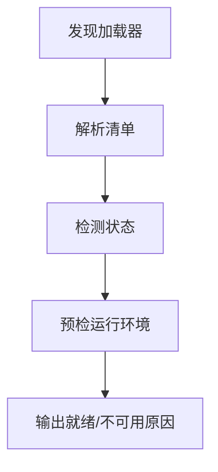

图表来源
- [LoaderManagerTests.cs](file://tests/Crystalfly.Core.Tests/Loaders/LoaderManagerTests.cs)
- [LoaderStateDetectorTests.cs](file://tests/Crystalfly.Core.Tests/Loaders/LoaderStateDetectorTests.cs)
- [LocalLoaderPackageManifestTests.cs](file://tests/Crystalfly.Core.Tests/Loaders/LocalLoaderPackageManifestTests.cs)
- [HollowKnightRuntimeTests.cs](file://tests/Crystalfly.Core.Tests/Runtime/HollowKnightRuntimeTests.cs)
- [LaunchPreflightEvaluatorTests.cs](file://tests/Crystalfly.Core.Tests/Runtime/LaunchPreflightEvaluatorTests.cs)

章节来源
- [LoaderManagerTests.cs](file://tests/Crystalfly.Core.Tests/Loaders/LoaderManagerTests.cs)
- [LoaderStateDetectorTests.cs](file://tests/Crystalfly.Core.Tests/Loaders/LoaderStateDetectorTests.cs)
- [LocalLoaderPackageManifestTests.cs](file://tests/Crystalfly.Core.Tests/Loaders/LocalLoaderPackageManifestTests.cs)
- [HollowKnightRuntimeTests.cs](file://tests/Crystalfly.Core.Tests/Runtime/HollowKnightRuntimeTests.cs)
- [LaunchPreflightEvaluatorTests.cs](file://tests/Crystalfly.Core.Tests/Runtime/LaunchPreflightEvaluatorTests.cs)

### 本地低权限隔离测试（Core 层）
该组测试验证 LocalLow 目录隔离服务的正确性与安全性。

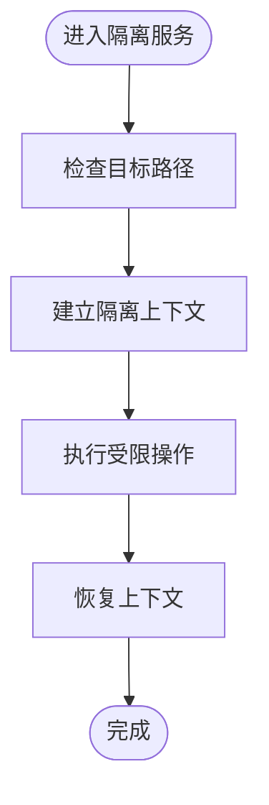

图表来源
- [LocalLowIsolationServiceTests.cs](file://tests/Crystalfly.Core.Tests/LocalLow/LocalLowIsolationServiceTests.cs)

章节来源
- [LocalLowIsolationServiceTests.cs](file://tests/Crystalfly.Core.Tests/LocalLow/LocalLowIsolationServiceTests.cs)

### Mod 管理与依赖测试（Core 层）
该组测试覆盖依赖图、修复计划、解析器、安装服务与管理器。

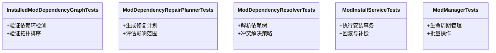

图表来源
- [InstalledModDependencyGraphTests.cs](file://tests/Crystalfly.Core.Tests/Mods/InstalledModDependencyGraphTests.cs)
- [ModDependencyRepairPlannerTests.cs](file://tests/Crystalfly.Core.Tests/Mods/ModDependencyRepairPlannerTests.cs)
- [ModDependencyResolverTests.cs](file://tests/Crystalfly.Core.Tests/Mods/ModDependencyResolverTests.cs)
- [ModInstallServiceTests.cs](file://tests/Crystalfly.Core.Tests/Mods/ModInstallServiceTests.cs)
- [ModManagerTests.cs](file://tests/Crystalfly.Core.Tests/Mods/ModManagerTests.cs)

章节来源
- [InstalledModDependencyGraphTests.cs](file://tests/Crystalfly.Core.Tests/Mods/InstalledModDependencyGraphTests.cs)
- [ModDependencyRepairPlannerTests.cs](file://tests/Crystalfly.Core.Tests/Mods/ModDependencyRepairPlannerTests.cs)
- [ModDependencyResolverTests.cs](file://tests/Crystalfly.Core.Tests/Mods/ModDependencyResolverTests.cs)
- [ModInstallServiceTests.cs](file://tests/Crystalfly.Core.Tests/Mods/ModInstallServiceTests.cs)
- [ModManagerTests.cs](file://tests/Crystalfly.Core.Tests/Mods/ModManagerTests.cs)

### 网络与序列化测试（Core 层）
该组测试覆盖 GitHub 路由处理器与延迟服务、原子 JSON 存储与清单序列化。

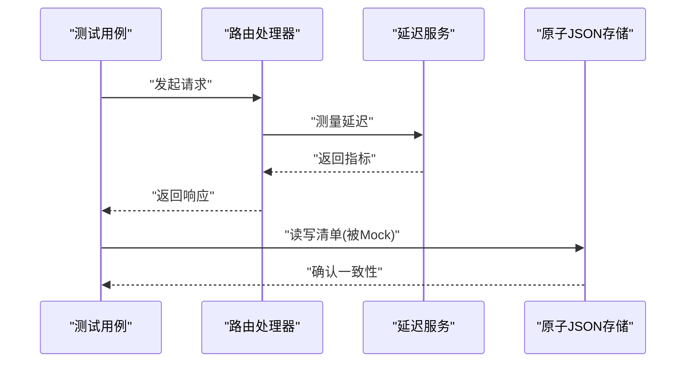

图表来源
- [GitHubDownloadRouteHandlerTests.cs](file://tests/Crystalfly.Core.Tests/Networking/GitHubDownloadRouteHandlerTests.cs)
- [GitHubRouteLatencyServiceTests.cs](file://tests/Crystalfly.Core.Tests/Networking/GitHubRouteLatencyServiceTests.cs)
- [AtomicJsonStoreTests.cs](file://tests/Crystalfly.Core.Tests/Serialization/AtomicJsonStoreTests.cs)
- [ManifestSerializationTests.cs](file://tests/Crystalfly.Core.Tests/Serialization/ManifestSerializationTests.cs)

章节来源
- [GitHubDownloadRouteHandlerTests.cs](file://tests/Crystalfly.Core.Tests/Networking/GitHubDownloadRouteHandlerTests.cs)
- [GitHubRouteLatencyServiceTests.cs](file://tests/Crystalfly.Core.Tests/Networking/GitHubRouteLatencyServiceTests.cs)
- [AtomicJsonStoreTests.cs](file://tests/Crystalfly.Core.Tests/Serialization/AtomicJsonStoreTests.cs)
- [ManifestSerializationTests.cs](file://tests/Crystalfly.Core.Tests/Serialization/ManifestSerializationTests.cs)

### 快照与速通测试（Core 层）
该组测试覆盖命名快照服务与速通模板策略、环境准备与验证。

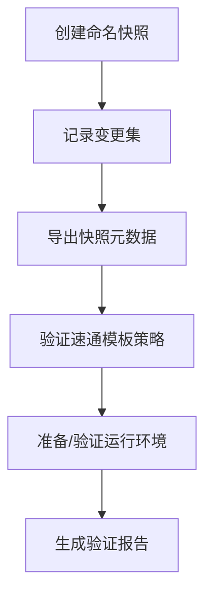

图表来源
- [NamedSnapshotServiceTests.cs](file://tests/Crystalfly.Core.Tests/Snapshots/NamedSnapshotServiceTests.cs)
- [OfficialSpeedrunTemplatePolicyTests.cs](file://tests/Crystalfly.Core.Tests/Speedrun/OfficialSpeedrunTemplatePolicyTests.cs)
- [SpeedrunEnvironmentProvisionerTests.cs](file://tests/Crystalfly.Core.Tests/Speedrun/SpeedrunEnvironmentProvisionerTests.cs)
- [SpeedrunEnvironmentVerifierTests.cs](file://tests/Crystalfly.Core.Tests/Speedrun/SpeedrunEnvironmentVerifierTests.cs)

章节来源
- [NamedSnapshotServiceTests.cs](file://tests/Crystalfly.Core.Tests/Snapshots/NamedSnapshotServiceTests.cs)
- [OfficialSpeedrunTemplatePolicyTests.cs](file://tests/Crystalfly.Core.Tests/Speedrun/OfficialSpeedrunTemplatePolicyTests.cs)
- [SpeedrunEnvironmentProvisionerTests.cs](file://tests/Crystalfly.Core.Tests/Speedrun/SpeedrunEnvironmentProvisionerTests.cs)
- [SpeedrunEnvironmentVerifierTests.cs](file://tests/Crystalfly.Core.Tests/Speedrun/SpeedrunEnvironmentVerifierTests.cs)

### 事务与文件操作测试（Core 层）
该组测试覆盖文件事务的原子性与回滚语义。

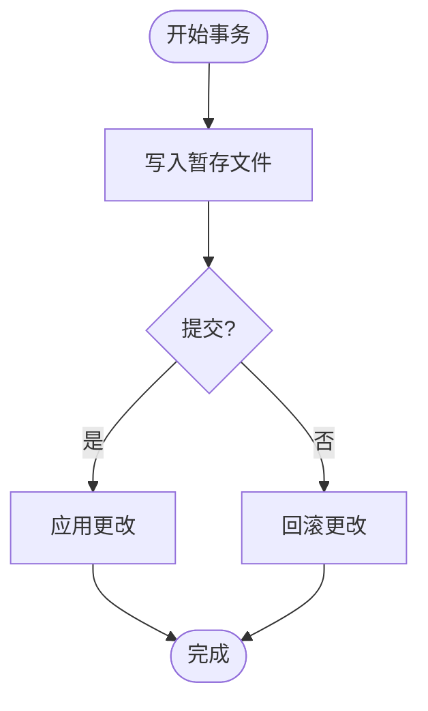

图表来源
- [FileTransactionTests.cs](file://tests/Crystalfly.Core.Tests/Transactions/FileTransactionTests.cs)

章节来源
- [FileTransactionTests.cs](file://tests/Crystalfly.Core.Tests/Transactions/FileTransactionTests.cs)

### Steam 下载与安全测试（Steam 层）
该组测试覆盖下载路径、进度聚合、Depot 下载服务、内容交付客户端与 DPAPI 刷新令牌存储。

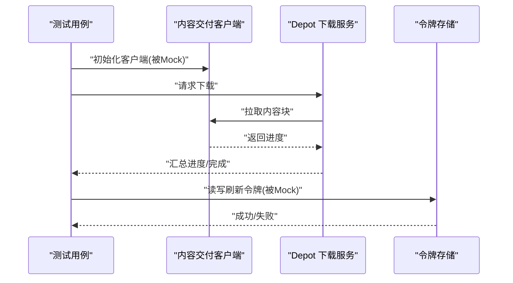

图表来源
- [DownloadPathTests.cs](file://tests/Crystalfly.Steam.Tests/Downloads/DownloadPathTests.cs)
- [DownloadProgressAggregatorTests.cs](file://tests/Crystalfly.Steam.Tests/Downloads/DownloadProgressAggregatorTests.cs)
- [SteamDepotDownloadServiceTests.cs](file://tests/Crystalfly.Steam.Tests/Downloads/SteamDepotDownloadServiceTests.cs)
- [SteamKitContentDeliveryClientTests.cs](file://tests/Crystalfly.Steam.Tests/Downloads/SteamKitContentDeliveryClientTests.cs)
- [DpapiRefreshTokenStoreTests.cs](file://tests/Crystalfly.Steam.Tests/Security/DpapiRefreshTokenStoreTests.cs)

章节来源
- [DownloadPathTests.cs](file://tests/Crystalfly.Steam.Tests/Downloads/DownloadPathTests.cs)
- [DownloadProgressAggregatorTests.cs](file://tests/Crystalfly.Steam.Tests/Downloads/DownloadProgressAggregatorTests.cs)
- [SteamDepotDownloadServiceTests.cs](file://tests/Crystalfly.Steam.Tests/Downloads/SteamDepotDownloadServiceTests.cs)
- [SteamKitContentDeliveryClientTests.cs](file://tests/Crystalfly.Steam.Tests/Downloads/SteamKitContentDeliveryClientTests.cs)
- [DpapiRefreshTokenStoreTests.cs](file://tests/Crystalfly.Steam.Tests/Security/DpapiRefreshTokenStoreTests.cs)

## 依赖分析
测试项目与生产项目之间的依赖关系如下：

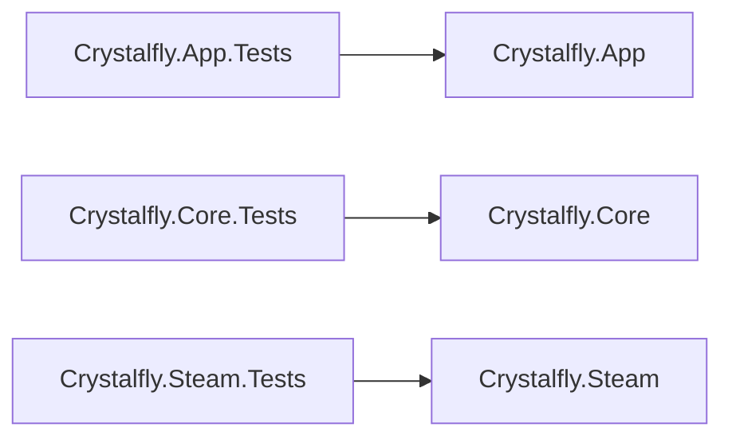

图表来源
- [Crystalfly.App.Tests.csproj](file://tests/Crystalfly.App.Tests/Crystalfly.App.Tests.csproj)
- [Crystalfly.Core.Tests.csproj](file://tests/Crystalfly.Core.Tests/Crystalfly.Core.Tests.csproj)
- [Crystalfly.Steam.Tests.csproj](file://tests/Crystalfly.Steam.Tests/Crystalfly.Steam.Tests.csproj)

章节来源
- [Crystalfly.App.Tests.csproj](file://tests/Crystalfly.App.Tests/Crystalfly.App.Tests.csproj)
- [Crystalfly.Core.Tests.csproj](file://tests/Crystalfly.Core.Tests/Crystalfly.Core.Tests.csproj)
- [Crystalfly.Steam.Tests.csproj](file://tests/Crystalfly.Steam.Tests/Crystalfly.Steam.Tests.csproj)

## 性能考虑
- 控制 I/O 与网络开销：优先使用内存与 Mock，减少磁盘与网络调用。
- 并行执行：利用 xUnit 的并行测试能力，但注意共享资源的隔离。
- 大数据集：使用流式处理与增量断言，避免一次性加载大对象。
- 基准与回归：对热点路径添加简单基准测试，防止退化。

[本节为通用指导，不直接分析具体文件]

## 故障排查指南
- 测试不稳定
  - 检查是否使用了全局状态或共享文件；改为每测试独立环境。
  - 对异步测试增加超时与取消令牌，避免卡死。
- 断言失败难以定位
  - 细化断言粒度，区分输入、中间状态与最终结果。
  - 打印关键上下文（路径、ID、时间戳），便于复现。
- 外部依赖导致失败
  - 使用 Mock 替换网络/Steam/文件系统；必要时标记为需网络的环境测试。
- UI 渲染差异
  - 固定字体与 DPI；使用无头渲染与截图对比工具。

[本节为通用指导，不直接分析具体文件]

## 结论
Crystalfly 的测试体系以 xUnit 为核心，围绕功能模块组织，覆盖了从 UI 渲染、ViewModel 状态到核心业务逻辑与 Steam 集成的全链路。通过合理的 Mock、工厂与环境隔离，测试具备高内聚、低耦合与强可维护性。建议持续完善覆盖率与自动化流水线，确保质量基线稳定提升。

[本节为总结性内容，不直接分析具体文件]

## 附录
- 编写示例指引（以路径代替代码）
  - 核心业务逻辑：参考 [ModInstallServiceTests.cs](file://tests/Crystalfly.Core.Tests/Mods/ModInstallServiceTests.cs)、[ModDependencyResolverTests.cs](file://tests/Crystalfly.Core.Tests/Mods/ModDependencyResolverTests.cs)
  - Steam 集成服务：参考 [SteamDepotDownloadServiceTests.cs](file://tests/Crystalfly.Steam.Tests/Downloads/SteamDepotDownloadServiceTests.cs)、[SteamKitContentDeliveryClientTests.cs](file://tests/Crystalfly.Steam.Tests/Downloads/SteamKitContentDeliveryClientTests.cs)
  - 服务类与协调器：参考 [DownloadQueueServiceTests.cs](file://tests/Crystalfly.App.Tests/Downloads/DownloadQueueServiceTests.cs)、[InstanceOperationCoordinatorTests.cs](file://tests/Crystalfly.App.Tests/Downloads/InstanceOperationCoordinatorTests.cs)
- 覆盖率要求与最佳实践
  - 建议行覆盖率≥80%，分支覆盖率≥70%；关键路径与公共 API 应接近 100%。
  - 测试命名遵循“当…时应…”语义，清晰表达意图。
  - 保持单测幂等与可重复性，避免依赖外部状态。
  - 对异常与边界条件进行显式覆盖，避免只测试“快乐路径”。

[本节为补充说明，不直接分析具体文件]