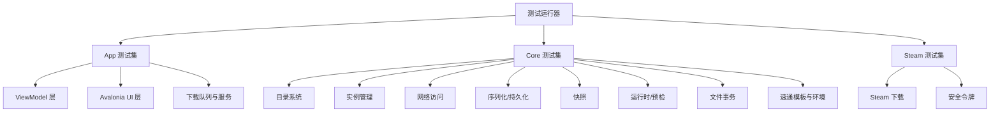
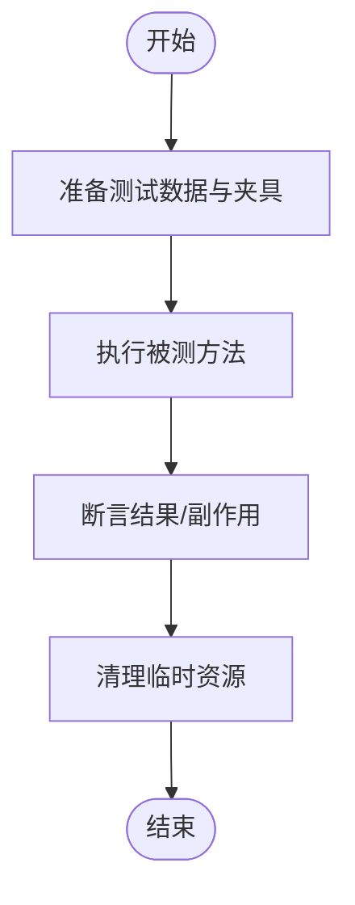
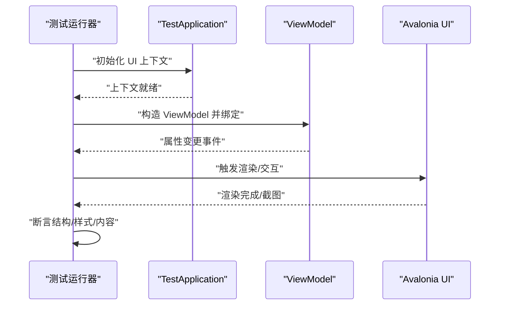
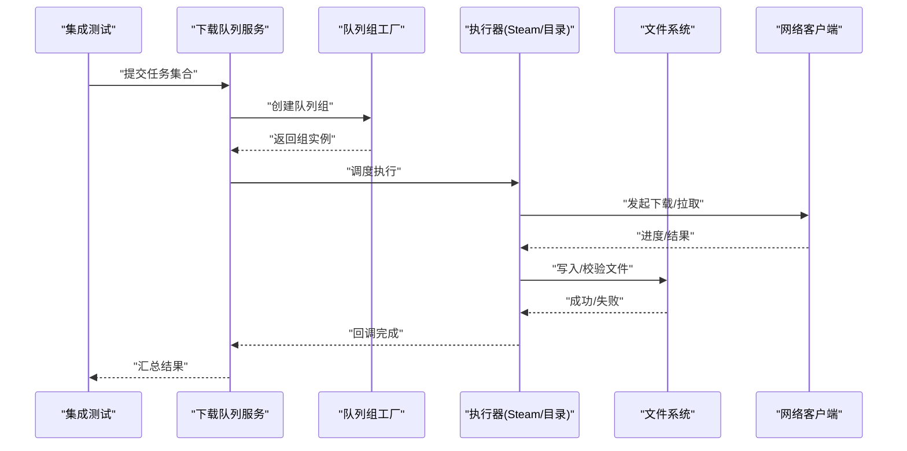
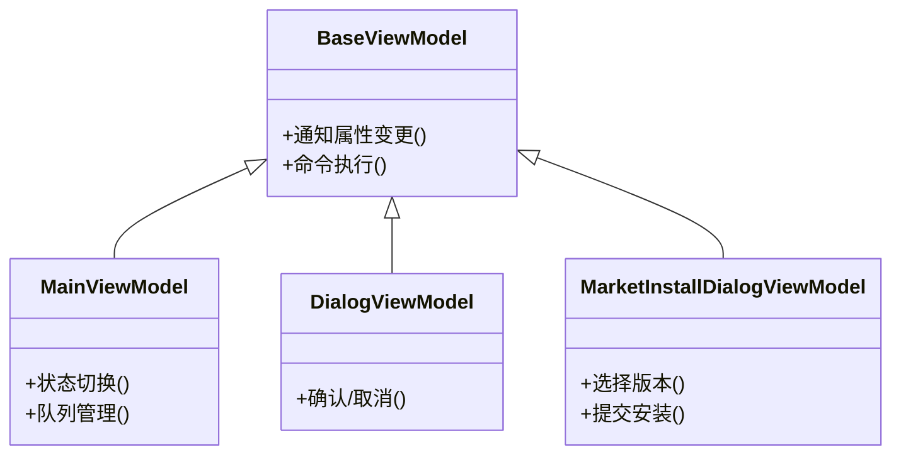
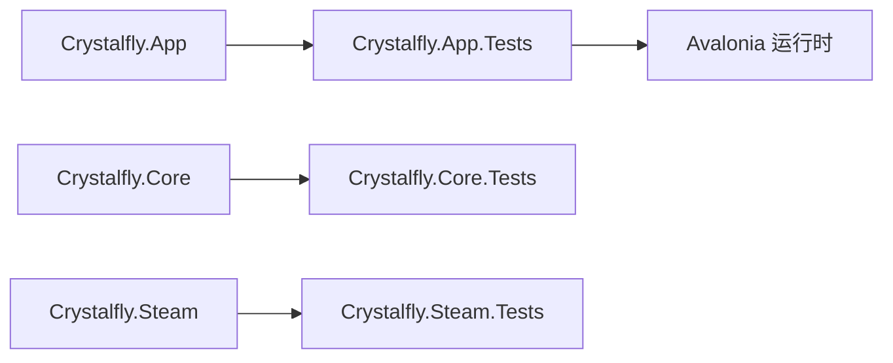

# 测试策略

<cite>
**本文引用的文件**   
- [Crystalfly.App.Tests.csproj](file://tests/Crystalfly.App.Tests/Crystalfly.App.Tests.csproj)
- [Crystalfly.Core.Tests.csproj](file://tests/Crystalfly.Core.Tests/Crystalfly.Core.Tests.csproj)
- [Crystalfly.Steam.Tests.csproj](file://tests/Crystalfly.Steam.Tests/Crystalfly.Steam.Tests.csproj)
- [TestApplication.cs](file://tests/Crystalfly.App.Tests/Ui/TestApplication.cs)
- [MainWindowStructureTests.cs](file://tests/Crystalfly.App.Tests/Ui/MainWindowStructureTests.cs)
- [LayoutRenderingTests.cs](file://tests/Crystalfly.App.Tests/Ui/LayoutRenderingTests.cs)
- [ThemeRenderingTests.cs](file://tests/Crystalfly.App.Tests/Ui/ThemeRenderingTests.cs)
- [DownloadQueueRenderingTests.cs](file://tests/Crystalfly.App.Tests/Ui/DownloadQueueRenderingTests.cs)
- [ModMarketRenderingTests.cs](file://tests/Crystalfly.App.Tests/Ui/ModMarketRenderingTests.cs)
- [DocumentationScreenshotTests.cs](file://tests/Crystalfly.App.Tests/Ui/DocumentationScreenshotTests.cs)
- [MainWindowCodeBehindTests.cs](file://tests/Crystalfly.App.Tests/Ui/MainWindowCodeBehindTests.cs)
- [DialogViewModelTests.cs](file://tests/Crystalfly.App.Tests/ViewModels/DialogViewModelTests.cs)
- [DownloadQueueGroupItemViewModelTests.cs](file://tests/Crystalfly.App.Tests/ViewModels/DownloadQueueGroupItemViewModelTests.cs)
- [InstalledModItemViewModelTests.cs](file://tests/Crystalfly.App.Tests/ViewModels/InstalledModItemViewModelTests.cs)
- [LocalizationViewModelTests.cs](file://tests/Crystalfly.App.Tests/ViewModels/LocalizationViewModelTests.cs)
- [MainViewModelStateTests.cs](file://tests/Crystalfly.App.Tests/ViewModels/MainViewModelStateTests.cs)
- [MarketInstallDialogViewModelTests.cs](file://tests/Crystalfly.App.Tests/ViewModels/MarketInstallDialogViewModelTests.cs)
- [MarketModItemViewModelTests.cs](file://tests/Crystalfly.App.Tests/ViewModels/MarketModItemViewModelTests.cs)
- [CatalogPackageQueueExecutorTests.cs](file://tests/Crystalfly.App.Tests/Downloads/CatalogPackageQueueExecutorTests.cs)
- [DownloadQueueServiceTests.cs](file://tests/Crystalfly.App.Tests/Downloads/DownloadQueueServiceTests.cs)
- [InstanceOperationCoordinatorTests.cs](file://tests/Crystalfly.App.Tests/Downloads/InstanceOperationCoordinatorTests.cs)
- [ModDependencyRepairQueueGroupFactoryTests.cs](file://tests/Crystalfly.App.Tests/Downloads/ModDependencyRepairQueueGroupFactoryTests.cs)
- [ModInstallQueueGroupFactoryTests.cs](file://tests/Crystalfly.App.Tests/Downloads/ModInstallQueueGroupFactoryTests.cs)
- [SteamDownloadQueueExecutorTests.cs](file://tests/Crystalfly.App.Tests/Downloads/SteamDownloadQueueExecutorTests.cs)
- [CatalogMergerTests.cs](file://tests/Crystalfly.Core.Tests/Catalog/CatalogMergerTests.cs)
- [CatalogProviderTests.cs](file://tests/Crystalfly.Core.Tests/Catalog/CatalogProviderTests.cs)
- [CatalogResolverTests.cs](file://tests/Crystalfly.Core.Tests/Catalog/CatalogResolverTests.cs)
- [CustomCatalogSourceTests.cs](file://tests/Crystalfly.Core.Tests/Catalog/CustomCatalogSourceTests.cs)
- [EmbeddedCatalogTests.cs](file://tests/Crystalfly.Core.Tests/Catalog/EmbeddedCatalogTests.cs)
- [ModTranslationSourceTests.cs](file://tests/Crystalfly.Core.Tests/Catalog/ModTranslationSourceTests.cs)
- [OfficialCatalogSourceTests.cs](file://tests/Crystalfly.Core.Tests/Catalog/OfficialCatalogSourceTests.cs)
- [OfficialXmlCatalogParserTests.cs](file://tests/Crystalfly.Core.Tests/Catalog/OfficialXmlCatalogParserTests.cs)
- [CrystalflyPathsTests.cs](file://tests/Crystalfly.Core.Tests/Configuration/CrystalflyPathsTests.cs)
- [CrystalflySettingsStoreTests.cs](file://tests/Crystalfly.Core.Tests/Configuration/CrystalflySettingsStoreTests.cs)
- [BuildFingerprintServiceTests.cs](file://tests/Crystalfly.Core.Tests/Instances/BuildFingerprintServiceTests.cs)
- [InstanceCloneServiceTests.cs](file://tests/Crystalfly.Core.Tests/Instances/InstanceCloneServiceTests.cs)
- [InstanceDeletionServiceTests.cs](file://tests/Crystalfly.Core.Tests/Instances/InstanceDeletionServiceTests.cs)
- [InstanceDirectoryTests.cs](file://tests/Crystalfly.Core.Tests/Instances/InstanceDirectoryTests.cs)
- [InstanceImportServiceTests.cs](file://tests/Crystalfly.Core.Tests/Instances/InstanceImportServiceTests.cs)
- [InstanceSidecarTests.cs](file://tests/Crystalfly.Core.Tests/Instances/InstanceSidecarTests.cs)
- [VersionDirectoryScannerTests.cs](file://tests/Crystalfly.Core.Tests/Instances/VersionDirectoryScannerTests.cs)
- [LoaderManagerTests.cs](file://tests/Crystalfly.Core.Tests/Loaders/LoaderManagerTests.cs)
- [LoaderStateDetectorTests.cs](file://tests/Crystalfly.Core.Tests/Loaders/LoaderStateDetectorTests.cs)
- [LocalLoaderPackageManifestTests.cs](file://tests/Crystalfly.Core.Tests/Loaders/LocalLoaderPackageManifestTests.cs)
- [LocalLowIsolationServiceTests.cs](file://tests/Crystalfly.Core.Tests/LocalLow/LocalLowIsolationServiceTests.cs)
- [InstalledModDependencyGraphTests.cs](file://tests/Crystalfly.Core.Tests/Mods/InstalledModDependencyGraphTests.cs)
- [ModDependencyRepairPlannerTests.cs](file://tests/Crystalfly.Core.Tests/Mods/ModDependencyRepairPlannerTests.cs)
- [ModDependencyResolverTests.cs](file://tests/Crystalfly.Core.Tests/Mods/ModDependencyResolverTests.cs)
- [ModInstallServiceTests.cs](file://tests/Crystalfly.Core.Tests/Mods/ModInstallServiceTests.cs)
- [ModManagerTests.cs](file://tests/Crystalfly.Core.Tests/Mods/ModManagerTests.cs)
- [GitHubDownloadRouteHandlerTests.cs](file://tests/Crystalfly.Core.Tests/Networking/GitHubDownloadRouteHandlerTests.cs)
- [GitHubRouteLatencyServiceTests.cs](file://tests/Crystalfly.Core.Tests/Networking/GitHubRouteLatencyServiceTests.cs)
- [HollowKnightRuntimeTests.cs](file://tests/Crystalfly.Core.Tests/Runtime/HollowKnightRuntimeTests.cs)
- [LaunchPreflightEvaluatorTests.cs](file://tests/Crystalfly.Core.Tests/Runtime/LaunchPreflightEvaluatorTests.cs)
- [AtomicJsonStoreTests.cs](file://tests/Crystalfly.Core.Tests/Serialization/AtomicJsonStoreTests.cs)
- [ManifestSerializationTests.cs](file://tests/Crystalfly.Core.Tests/Serialization/ManifestSerializationTests.cs)
- [NamedSnapshotServiceTests.cs](file://tests/Crystalfly.Core.Tests/Snapshots/NamedSnapshotServiceTests.cs)
- [OfficialSpeedrunTemplatePolicyTests.cs](file://tests/Crystalfly.Core.Tests/Speedrun/OfficialSpeedrunTemplatePolicyTests.cs)
- [SpeedrunEnvironmentProvisionerTests.cs](file://tests/Crystalfly.Core.Tests/Speedrun/SpeedrunEnvironmentProvisionerTests.cs)
- [SpeedrunEnvironmentVerifierTests.cs](file://tests/Crystalfly.Core.Tests/Speedrun/SpeedrunEnvironmentVerifierTests.cs)
- [FileTransactionTests.cs](file://tests/Crystalfly.Core.Tests/Transactions/FileTransactionTests.cs)
- [DownloadPathTests.cs](file://tests/Crystalfly.Steam.Tests/Downloads/DownloadPathTests.cs)
- [DownloadProgressAggregatorTests.cs](file://tests/Crystalfly.Steam.Tests/Downloads/DownloadProgressAggregatorTests.cs)
- [SteamDepotDownloadServiceTests.cs](file://tests/Crystalfly.Steam.Tests/Downloads/SteamDepotDownloadServiceTests.cs)
- [SteamKitContentDeliveryClientTests.cs](file://tests/Crystalfly.Steam.Tests/Downloads/SteamKitContentDeliveryClientTests.cs)
- [DpapiRefreshTokenStoreTests.cs](file://tests/Crystalfly.Steam.Tests/Security/DpapiRefreshTokenStoreTests.cs)
</cite>

## 目录
1. [简介](#简介)
2. [项目结构](#项目结构)
3. [核心组件](#核心组件)
4. [架构总览](#架构总览)
5. [详细组件分析](#详细组件分析)
6. [依赖分析](#依赖分析)
7. [性能考虑](#性能考虑)
8. [故障排查指南](#故障排查指南)
9. [结论](#结论)
10. [附录](#附录)

## 简介
本测试策略文档面向 Crystalfly 项目的测试体系建设，覆盖单元测试、UI 测试与集成测试的架构设计、组织方式、命名约定、Mock 对象使用、测试数据管理、环境配置、覆盖率要求与持续集成流程。同时给出异步代码测试、UI 自动化测试、性能测试的方法论与实践建议，并说明测试依赖注入、数据库（持久化）测试与外部服务模拟的策略。

## 项目结构
测试工程按功能域与分层进行组织，遵循“按特性/模块分组 + 按类型细分”的结构：
- 应用层测试（UI、ViewModel、下载队列等）位于 tests/Crystalfly.App.Tests
- 核心逻辑测试（目录、实例、加载器、网络、序列化、快照、速通、事务等）位于 tests/Crystalfly.Core.Tests
- Steam 相关测试（下载、安全令牌等）位于 tests/Crystalfly.Steam.Tests

每个测试项目与其对应源码项目一一对应，便于定位与维护。测试类以业务域为根目录，内部再按被测单元类型或场景进一步细分。

```mermaid
graph TB
subgraph "测试工程"
AppT["Crystalfly.App.Tests"]
CoreT["Crystalfly.Core.Tests"]
SteamT["Crystalfly.Steam.Tests"]
end
subgraph "应用层"
AppVM["ViewModels<br/>Dialog / Main / Market / Localization"]
AppUI["UI<br/>MainWindow / Dialogs / Theme / Layout"]
AppDL["Downloads<br/>Queue Executors / Coordinators"]
end
subgraph "核心层"
CoreCat["Catalog<br/>解析/合并/提供/解析"]
CoreInst["Instances<br/>克隆/删除/导入/扫描"]
CoreLoad["Loaders<br/>检测/清单"]
CoreNet["Networking<br/>GitHub 路由/延迟"]
CoreSer["Serialization<br/>JSON 原子存储/清单"]
CoreSnap["Snapshots<br/>命名快照"]
CoreRun["Runtime<br/>进程守护/预检"]
CoreTrans["Transactions<br/>文件事务"]
CoreSpeed["Speedrun<br/>模板/环境准备/校验"]
end
subgraph "Steam 层"
SteamDL["Downloads<br/>路径/进度/客户端/服务"]
SteamSec["Security<br/>DPAPI 刷新令牌"]
end
AppT --> AppVM
AppT --> AppUI
AppT --> AppDL
CoreT --> CoreCat
CoreT --> CoreInst
CoreT --> CoreLoad
CoreT --> CoreNet
CoreT --> CoreSer
CoreT --> CoreSnap
CoreT --> CoreRun
CoreT --> CoreTrans
CoreT --> CoreSpeed
SteamT --> SteamDL
SteamT --> SteamSec
```

图表来源
- [Crystalfly.App.Tests.csproj](file://tests/Crystalfly.App.Tests/Crystalfly.App.Tests.csproj)
- [Crystalfly.Core.Tests.csproj](file://tests/Crystalfly.Core.Tests/Crystalfly.Core.Tests.csproj)
- [Crystalfly.Steam.Tests.csproj](file://tests/Crystalfly.Steam.Tests/Crystalfly.Steam.Tests.csproj)

章节来源
- [Crystalfly.App.Tests.csproj](file://tests/Crystalfly.App.Tests/Crystalfly.App.Tests.csproj)
- [Crystalfly.Core.Tests.csproj](file://tests/Crystalfly.Core.Tests/Crystalfly.Core.Tests.csproj)
- [Crystalfly.Steam.Tests.csproj](file://tests/Crystalfly.Steam.Tests/Crystalfly.Steam.Tests.csproj)

## 核心组件
- 测试框架与运行
  - 采用 .NET 测试生态，各测试项目通过 csproj 声明依赖与运行参数。
  - UI 测试需要 Avalonia 可视化上下文，由专用启动器初始化。
- 测试分类
  - 单元测试：针对纯函数、算法、状态机、序列化的快速断言。
  - UI 测试：验证视图结构、主题渲染、布局与交互行为。
  - 集成测试：跨模块协作、文件系统、网络、Steam 客户端等端到端场景。
- Mock 与隔离
  - 对 I/O、网络、Steam API、时间、随机数等进行替换，保证可重复性与速度。
- 测试数据
  - 使用内嵌资源、临时目录、固定种子数据，确保幂等与可重现。
- 环境与配置
  - 通过测试夹具设置工作目录、配置文件、日志级别、超时与重试策略。

章节来源
- [Crystalfly.App.Tests.csproj](file://tests/Crystalfly.App.Tests/Crystalfly.App.Tests.csproj)
- [Crystalfly.Core.Tests.csproj](file://tests/Crystalfly.Core.Tests/Crystalffly.Core.Tests.csproj)
- [Crystalfly.Steam.Tests.csproj](file://tests/Crystalfly.Steam.Tests/Crystalfly.Steam.Tests.csproj)

## 架构总览
下图展示测试层与生产层的映射关系，以及关键测试入口与典型调用链。

图表来源
- [Crystalfly.App.Tests.csproj](file://tests/Crystalfly.App.Tests/Crystalfly.App.Tests.csproj)
- [Crystalfly.Core.Tests.csproj](file://tests/Crystalfly.Core.Tests/Crystalfly.Core.Tests.csproj)
- [Crystalfly.Steam.Tests.csproj](file://tests/Crystalfly.Steam.Tests/Crystalfly.Steam.Tests.csproj)

## 详细组件分析

### 单元测试架构与示例
- 目标
  - 覆盖核心算法、状态转换、解析与序列化、依赖图构建、安装计划生成等。
- 组织与命名
  - 按领域分目录，测试类名以“被测类型+Tests”结尾，方法名表达意图与输入输出。
- 示例参考
  - 目录解析与合并：[CatalogMergerTests.cs](file://tests/Crystalfly.Core.Tests/Catalog/CatalogMergerTests.cs)、[CatalogResolverTests.cs](file://tests/Crystalfly.Core.Tests/Catalog/CatalogResolverTests.cs)
  - 清单与序列化：[ManifestSerializationTests.cs](file://tests/Crystalfly.Core.Tests/Serialization/ManifestSerializationTests.cs)、[AtomicJsonStoreTests.cs](file://tests/Crystalfly.Core.Tests/Serialization/AtomicJsonStoreTests.cs)
  - 依赖与安装：[ModDependencyResolverTests.cs](file://tests/Crystalfly.Core.Tests/Mods/ModDependencyResolverTests.cs)、[ModInstallServiceTests.cs](file://tests/Crystalfly.Core.Tests/Mods/ModInstallServiceTests.cs)
  - 实例与扫描：[InstanceCloneServiceTests.cs](file://tests/Crystalfly.Core.Tests/Instances/InstanceCloneServiceTests.cs)、[VersionDirectoryScannerTests.cs](file://tests/Crystalfly.Core.Tests/Instances/VersionDirectoryScannerTests.cs)
  - 网络与延迟：[GitHubRouteLatencyServiceTests.cs](file://tests/Crystalfly.Core.Tests/Networking/GitHubRouteLatencyServiceTests.cs)
  - 事务与快照：[FileTransactionTests.cs](file://tests/Crystalfly.Core.Tests/Transactions/FileTransactionTests.cs)、[NamedSnapshotServiceTests.cs](file://tests/Crystalfly.Core.Tests/Snapshots/NamedSnapshotServiceTests.cs)
  - 速通环境：[SpeedrunEnvironmentProvisionerTests.cs](file://tests/Crystalfly.Core.Tests/Speedrun/SpeedrunEnvironmentProvisionerTests.cs)

章节来源
- [CatalogMergerTests.cs](file://tests/Crystalfly.Core.Tests/Catalog/CatalogMergerTests.cs)
- [CatalogResolverTests.cs](file://tests/Crystalfly.Core.Tests/Catalog/CatalogResolverTests.cs)
- [ManifestSerializationTests.cs](file://tests/Crystalfly.Core.Tests/Serialization/ManifestSerializationTests.cs)
- [AtomicJsonStoreTests.cs](file://tests/Crystalfly.Core.Tests/Serialization/AtomicJsonStoreTests.cs)
- [ModDependencyResolverTests.cs](file://tests/Crystalfly.Core.Tests/Mods/ModDependencyResolverTests.cs)
- [ModInstallServiceTests.cs](file://tests/Crystalfly.Core.Tests/Mods/ModInstallServiceTests.cs)
- [InstanceCloneServiceTests.cs](file://tests/Crystalfly.Core.Tests/Instances/InstanceCloneServiceTests.cs)
- [VersionDirectoryScannerTests.cs](file://tests/Crystalfly.Core.Tests/Instances/VersionDirectoryScannerTests.cs)
- [GitHubRouteLatencyServiceTests.cs](file://tests/Crystalfly.Core.Tests/Networking/GitHubRouteLatencyServiceTests.cs)
- [FileTransactionTests.cs](file://tests/Crystalfly.Core.Tests/Transactions/FileTransactionTests.cs)
- [NamedSnapshotServiceTests.cs](file://tests/Crystalfly.Core.Tests/Snapshots/NamedSnapshotServiceTests.cs)
- [SpeedrunEnvironmentProvisionerTests.cs](file://tests/Crystalfly.Core.Tests/Speedrun/SpeedrunEnvironmentProvisionerTests.cs)

### UI 测试方案与示例
- 目标
  - 验证主窗口结构、对话框、主题与布局渲染、下载队列与市场页面渲染、截图一致性。
- 运行环境
  - 使用 Avalonia 测试宿主，在测试前初始化 UI 上下文与应用生命周期。
- 示例参考
  - 应用启动与上下文：[TestApplication.cs](file://tests/Crystalfly.App.Tests/Ui/TestApplication.cs)
  - 主窗口结构与后置代码：[MainWindowStructureTests.cs](file://tests/Crystalfly.App.Tests/Ui/MainWindowStructureTests.cs)、[MainWindowCodeBehindTests.cs](file://tests/Crystalfly.App.Tests/Ui/MainWindowCodeBehindTests.cs)
  - 布局与主题渲染：[LayoutRenderingTests.cs](file://tests/Crystalfly.App.Tests/Ui/LayoutRenderingTests.cs)、[ThemeRenderingTests.cs](file://tests/Crystalfly.App.Tests/Ui/ThemeRenderingTests.cs)
  - 下载队列与市场渲染：[DownloadQueueRenderingTests.cs](file://tests/Crystalfly.App.Tests/Ui/DownloadQueueRenderingTests.cs)、[ModMarketRenderingTests.cs](file://tests/Crystalfly.App.Tests/Ui/ModMarketRenderingTests.cs)
  - 文档截图：[DocumentationScreenshotTests.cs](file://tests/Crystalfly.App.Tests/Ui/DocumentationScreenshotTests.cs)

图表来源
- [TestApplication.cs](file://tests/Crystalfly.App.Tests/Ui/TestApplication.cs)
- [MainWindowStructureTests.cs](file://tests/Crystalfly.App.Tests/Ui/MainWindowStructureTests.cs)
- [LayoutRenderingTests.cs](file://tests/Crystalfly.App.Tests/Ui/LayoutRenderingTests.cs)
- [ThemeRenderingTests.cs](file://tests/Crystalfly.App.Tests/Ui/ThemeRenderingTests.cs)
- [DownloadQueueRenderingTests.cs](file://tests/Crystalfly.App.Tests/Ui/DownloadQueueRenderingTests.cs)
- [ModMarketRenderingTests.cs](file://tests/Crystalfly.App.Tests/Ui/ModMarketRenderingTests.cs)
- [DocumentationScreenshotTests.cs](file://tests/Crystalfly.App.Tests/Ui/DocumentationScreenshotTests.cs)

章节来源
- [TestApplication.cs](file://tests/Crystalfly.App.Tests/Ui/TestApplication.cs)
- [MainWindowStructureTests.cs](file://tests/Crystalfly.App.Tests/Ui/MainWindowStructureTests.cs)
- [MainWindowCodeBehindTests.cs](file://tests/Crystalfly.App.Tests/Ui/MainWindowCodeBehindTests.cs)
- [LayoutRenderingTests.cs](file://tests/Crystalfly.App.Tests/Ui/LayoutRenderingTests.cs)
- [ThemeRenderingTests.cs](file://tests/Crystalfly.App.Tests/Ui/ThemeRenderingTests.cs)
- [DownloadQueueRenderingTests.cs](file://tests/Crystalfly.App.Tests/Ui/DownloadQueueRenderingTests.cs)
- [ModMarketRenderingTests.cs](file://tests/Crystalfly.App.Tests/Ui/ModMarketRenderingTests.cs)
- [DocumentationScreenshotTests.cs](file://tests/Crystalfly.App.Tests/Ui/DocumentationScreenshotTests.cs)

### 集成测试策略与示例
- 目标
  - 验证跨模块协作：下载队列编排、实例操作协调、Steam 下载、网络路由与延迟评估、本地低权限目录隔离、速通环境准备与校验。
- 示例参考
  - 下载队列与服务：[DownloadQueueServiceTests.cs](file://tests/Crystalfly.App.Tests/Downloads/DownloadQueueServiceTests.cs)、[CatalogPackageQueueExecutorTests.cs](file://tests/Crystalfly.App.Tests/Downloads/CatalogPackageQueueExecutorTests.cs)、[SteamDownloadQueueExecutorTests.cs](file://tests/Crystalfly.App.Tests/Downloads/SteamDownloadQueueExecutorTests.cs)
  - 实例操作协调：[InstanceOperationCoordinatorTests.cs](file://tests/Crystalfly.App.Tests/Downloads/InstanceOperationCoordinatorTests.cs)
  - 工厂与分组：[ModDependencyRepairQueueGroupFactoryTests.cs](file://tests/Crystalfly.App.Tests/Downloads/ModDependencyRepairQueueGroupFactoryTests.cs)、[ModInstallQueueGroupFactoryTests.cs](file://tests/Crystalfly.App.Tests/Downloads/ModInstallQueueGroupFactoryTests.cs)
  - Steam 下载与客户端：[SteamDepotDownloadServiceTests.cs](file://tests/Crystalfly.Steam.Tests/Downloads/SteamDepotDownloadServiceTests.cs)、[SteamKitContentDeliveryClientTests.cs](file://tests/Crystalfly.Steam.Tests/Downloads/SteamKitContentDeliveryClientTests.cs)
  - 网络与路由：[GitHubDownloadRouteHandlerTests.cs](file://tests/Crystalfly.Core.Tests/Networking/GitHubDownloadRouteHandlerTests.cs)
  - 本地低权限隔离：[LocalLowIsolationServiceTests.cs](file://tests/Crystalfly.Core.Tests/LocalLow/LocalLowIsolationServiceTests.cs)
  - 速通环境：[SpeedrunEnvironmentVerifierTests.cs](file://tests/Crystalfly.Core.Tests/Speedrun/SpeedrunEnvironmentVerifierTests.cs)

图表来源
- [DownloadQueueServiceTests.cs](file://tests/Crystalfly.App.Tests/Downloads/DownloadQueueServiceTests.cs)
- [CatalogPackageQueueExecutorTests.cs](file://tests/Crystalfly.App.Tests/Downloads/CatalogPackageQueueExecutorTests.cs)
- [SteamDownloadQueueExecutorTests.cs](file://tests/Crystalfly.App.Tests/Downloads/SteamDownloadQueueExecutorTests.cs)
- [InstanceOperationCoordinatorTests.cs](file://tests/Crystalfly.App.Tests/Downloads/InstanceOperationCoordinatorTests.cs)
- [ModDependencyRepairQueueGroupFactoryTests.cs](file://tests/Crystalfly.App.Tests/Downloads/ModDependencyRepairQueueGroupFactoryTests.cs)
- [ModInstallQueueGroupFactoryTests.cs](file://tests/Crystalfly.App.Tests/Downloads/ModInstallQueueGroupFactoryTests.cs)
- [SteamDepotDownloadServiceTests.cs](file://tests/Crystalfly.Steam.Tests/Downloads/SteamDepotDownloadServiceTests.cs)
- [SteamKitContentDeliveryClientTests.cs](file://tests/Crystalfly.Steam.Tests/Downloads/SteamKitContentDeliveryClientTests.cs)
- [GitHubDownloadRouteHandlerTests.cs](file://tests/Crystalfly.Core.Tests/Networking/GitHubDownloadRouteHandlerTests.cs)
- [LocalLowIsolationServiceTests.cs](file://tests/Crystalfly.Core.Tests/LocalLow/LocalLowIsolationServiceTests.cs)
- [SpeedrunEnvironmentVerifierTests.cs](file://tests/Crystalfly.Core.Tests/Speedrun/SpeedrunEnvironmentVerifierTests.cs)

章节来源
- [DownloadQueueServiceTests.cs](file://tests/Crystalfly.App.Tests/Downloads/DownloadQueueServiceTests.cs)
- [CatalogPackageQueueExecutorTests.cs](file://tests/Crystalfly.App.Tests/Downloads/CatalogPackageQueueExecutorTests.cs)
- [SteamDownloadQueueExecutorTests.cs](file://tests/Crystalfly.App.Tests/Downloads/SteamDownloadQueueExecutorTests.cs)
- [InstanceOperationCoordinatorTests.cs](file://tests/Crystalfly.App.Tests/Downloads/InstanceOperationCoordinatorTests.cs)
- [ModDependencyRepairQueueGroupFactoryTests.cs](file://tests/Crystalfly.App.Tests/Downloads/ModDependencyRepairQueueGroupFactoryTests.cs)
- [ModInstallQueueGroupFactoryTests.cs](file://tests/Crystalfly.App.Tests/Downloads/ModInstallQueueGroupFactoryTests.cs)
- [SteamDepotDownloadServiceTests.cs](file://tests/Crystalfly.Steam.Tests/Downloads/SteamDepotDownloadServiceTests.cs)
- [SteamKitContentDeliveryClientTests.cs](file://tests/Crystalfly.Steam.Tests/Downloads/SteamKitContentDeliveryClientTests.cs)
- [GitHubDownloadRouteHandlerTests.cs](file://tests/Crystalfly.Core.Tests/Networking/GitHubDownloadRouteHandlerTests.cs)
- [LocalLowIsolationServiceTests.cs](file://tests/Crystalfly.Core.Tests/LocalLow/LocalLowIsolationServiceTests.cs)
- [SpeedrunEnvironmentVerifierTests.cs](file://tests/Crystalfly.Core.Tests/Speedrun/SpeedrunEnvironmentVerifierTests.cs)

### ViewModel 测试与交互
- 目标
  - 验证命令、属性变更、状态流转、国际化、市场项与安装对话框交互。
- 示例参考
  - 通用对话框：[DialogViewModelTests.cs](file://tests/Crystalfly.App.Tests/ViewModels/DialogViewModelTests.cs)
  - 下载队列项：[DownloadQueueGroupItemViewModelTests.cs](file://tests/Crystalfly.App.Tests/ViewModels/DownloadQueueGroupItemViewModelTests.cs)
  - 已安装模组项：[InstalledModItemViewModelTests.cs](file://tests/Crystalfly.App.Tests/ViewModels/InstalledModItemViewModelTests.cs)
  - 国际化：[LocalizationViewModelTests.cs](file://tests/Crystalfly.App.Tests/ViewModels/LocalizationViewModelTests.cs)
  - 主界面状态：[MainViewModelStateTests.cs](file://tests/Crystalfly.App.Tests/ViewModels/MainViewModelStateTests.cs)
  - 市场安装对话框：[MarketInstallDialogViewModelTests.cs](file://tests/Crystalfly.App.Tests/ViewModels/MarketInstallDialogViewModelTests.cs)
  - 市场模组项：[MarketModItemViewModelTests.cs](file://tests/Crystalfly.App.Tests/ViewModels/MarketModItemViewModelTests.cs)

图表来源
- [DialogViewModelTests.cs](file://tests/Crystalfly.App.Tests/ViewModels/DialogViewModelTests.cs)
- [MainViewModelStateTests.cs](file://tests/Crystalfly.App.Tests/ViewModels/MainViewModelStateTests.cs)
- [MarketInstallDialogViewModelTests.cs](file://tests/Crystalfly.App.Tests/ViewModels/MarketInstallDialogViewModelTests.cs)

章节来源
- [DialogViewModelTests.cs](file://tests/Crystalfly.App.Tests/ViewModels/DialogViewModelTests.cs)
- [DownloadQueueGroupItemViewModelTests.cs](file://tests/Crystalfly.App.Tests/ViewModels/DownloadQueueGroupItemViewModelTests.cs)
- [InstalledModItemViewModelTests.cs](file://tests/Crystalfly.App.Tests/ViewModels/InstalledModItemViewModelTests.cs)
- [LocalizationViewModelTests.cs](file://tests/Crystalfly.App.Tests/ViewModels/LocalizationViewModelTests.cs)
- [MainViewModelStateTests.cs](file://tests/Crystalfly.App.Tests/ViewModels/MainViewModelStateTests.cs)
- [MarketInstallDialogViewModelTests.cs](file://tests/Crystalfly.App.Tests/ViewModels/MarketInstallDialogViewModelTests.cs)
- [MarketModItemViewModelTests.cs](file://tests/Crystalfly.App.Tests/ViewModels/MarketModItemViewModelTests.cs)

### 异步代码测试
- 原则
  - 使用异步测试模式，避免阻塞；合理设置超时与取消令牌；对并发队列与后台任务进行顺序化控制。
- 关注点
  - 下载进度聚合、任务编排、错误重试与回滚、状态同步。
- 参考实现
  - 下载进度聚合：[DownloadProgressAggregatorTests.cs](file://tests/Crystalfly.Steam.Tests/Downloads/DownloadProgressAggregatorTests.cs)
  - 下载服务与客户端：[SteamDepotDownloadServiceTests.cs](file://tests/Crystalfly.Steam.Tests/Downloads/SteamDepotDownloadServiceTests.cs)、[SteamKitContentDeliveryClientTests.cs](file://tests/Crystalfly.Steam.Tests/Downloads/SteamKitContentDeliveryClientTests.cs)
  - 队列执行器与服务：[DownloadQueueServiceTests.cs](file://tests/Crystalfly.App.Tests/Downloads/DownloadQueueServiceTests.cs)、[SteamDownloadQueueExecutorTests.cs](file://tests/Crystalfly.App.Tests/Downloads/SteamDownloadQueueExecutorTests.cs)

章节来源
- [DownloadProgressAggregatorTests.cs](file://tests/Crystalfly.Steam.Tests/Downloads/DownloadProgressAggregatorTests.cs)
- [SteamDepotDownloadServiceTests.cs](file://tests/Crystalfly.Steam.Tests/Downloads/SteamDepotDownloadServiceTests.cs)
- [SteamKitContentDeliveryClientTests.cs](file://tests/Crystalfly.Steam.Tests/Downloads/SteamKitContentDeliveryClientTests.cs)
- [DownloadQueueServiceTests.cs](file://tests/Crystalfly.App.Tests/Downloads/DownloadQueueServiceTests.cs)
- [SteamDownloadQueueExecutorTests.cs](file://tests/Crystalfly.App.Tests/Downloads/SteamDownloadQueueExecutorTests.cs)

### 外部服务模拟与依赖注入
- 策略
  - 通过接口抽象与构造函数注入，将网络、Steam 客户端、文件系统、时间源等替换为测试替身。
- 示例参考
  - GitHub 路由与延迟：[GitHubDownloadRouteHandlerTests.cs](file://tests/Crystalfly.Core.Tests/Networking/GitHubDownloadRouteHandlerTests.cs)、[GitHubRouteLatencyServiceTests.cs](file://tests/Crystalfly.Core.Tests/Networking/GitHubRouteLatencyServiceTests.cs)
  - Steam 客户端与服务：[SteamKitContentDeliveryClientTests.cs](file://tests/Crystalfly.Steam.Tests/Downloads/SteamKitContentDeliveryClientTests.cs)、[SteamDepotDownloadServiceTests.cs](file://tests/Crystalfly.Steam.Tests/Downloads/SteamDepotDownloadServiceTests.cs)
  - 安全令牌存储：[DpapiRefreshTokenStoreTests.cs](file://tests/Crystalfly.Steam.Tests/Security/DpapiRefreshTokenStoreTests.cs)

章节来源
- [GitHubDownloadRouteHandlerTests.cs](file://tests/Crystalfly.Core.Tests/Networking/GitHubDownloadRouteHandlerTests.cs)
- [GitHubRouteLatencyServiceTests.cs](file://tests/Crystalfly.Core.Tests/Networking/GitHubRouteLatencyServiceTests.cs)
- [SteamKitContentDeliveryClientTests.cs](file://tests/Crystalfly.Steam.Tests/Downloads/SteamKitContentDeliveryClientTests.cs)
- [SteamDepotDownloadServiceTests.cs](file://tests/Crystalfly.Steam.Tests/Downloads/SteamDepotDownloadServiceTests.cs)
- [DpapiRefreshTokenStoreTests.cs](file://tests/Crystalfly.Steam.Tests/Security/DpapiRefreshTokenStoreTests.cs)

### 测试数据管理与环境配置
- 数据
  - 使用内嵌 JSON/XML 清单、样例目录结构、最小化数据集，避免对外部仓库的强依赖。
- 环境
  - 通过夹具设置工作目录、临时文件夹、配置文件路径、语言包与主题资源。
- 参考实现
  - 清单与序列化：[ManifestSerializationTests.cs](file://tests/Crystalfly.Core.Tests/Serialization/ManifestSerializationTests.cs)、[AtomicJsonStoreTests.cs](file://tests/Crystalfly.Core.Tests/Serialization/AtomicJsonStoreTests.cs)
  - 路径与设置：[CrystalflyPathsTests.cs](file://tests/Crystalfly.Core.Tests/Configuration/CrystalflyPathsTests.cs)、[CrystalflySettingsStoreTests.cs](file://tests/Crystalfly.Core.Tests/Configuration/CrystalflySettingsStoreTests.cs)
  - 目录与实例：[InstanceDirectoryTests.cs](file://tests/Crystalfly.Core.Tests/Instances/InstanceDirectoryTests.cs)、[VersionDirectoryScannerTests.cs](file://tests/Crystalfly.Core.Tests/Instances/VersionDirectoryScannerTests.cs)

章节来源
- [ManifestSerializationTests.cs](file://tests/Crystalfly.Core.Tests/Serialization/ManifestSerializationTests.cs)
- [AtomicJsonStoreTests.cs](file://tests/Crystalfly.Core.Tests/Serialization/AtomicJsonStoreTests.cs)
- [CrystalflyPathsTests.cs](file://tests/Crystalfly.Core.Tests/Configuration/CrystalflyPathsTests.cs)
- [CrystalflySettingsStoreTests.cs](file://tests/Crystalfly.Core.Tests/Configuration/CrystalflySettingsStoreTests.cs)
- [InstanceDirectoryTests.cs](file://tests/Crystalfly.Core.Tests/Instances/InstanceDirectoryTests.cs)
- [VersionDirectoryScannerTests.cs](file://tests/Crystalfly.Core.Tests/Instances/VersionDirectoryScannerTests.cs)

### 数据库与持久化测试
- 说明
  - 当前项目主要基于文件系统与 JSON 原子存储，未见传统数据库驱动。持久化测试围绕文件事务与原子写入展开。
- 参考实现
  - 原子存储与事务：[AtomicJsonStoreTests.cs](file://tests/Crystalfly.Core.Tests/Serialization/AtomicJsonStoreTests.cs)、[FileTransactionTests.cs](file://tests/Crystalfly.Core.Tests/Transactions/FileTransactionTests.cs)

章节来源
- [AtomicJsonStoreTests.cs](file://tests/Crystalfly.Core.Tests/Serialization/AtomicJsonStoreTests.cs)
- [FileTransactionTests.cs](file://tests/Crystalfly.Core.Tests/Transactions/FileTransactionTests.cs)

### 性能测试方法
- 建议
  - 对大清单解析、依赖图计算、批量下载与快照创建进行基准测试；使用固定数据集与多次迭代统计。
- 参考切入点
  - 清单解析与合并：[OfficialXmlCatalogParserTests.cs](file://tests/Crystalfly.Core.Tests/Catalog/OfficialXmlCatalogParserTests.cs)、[CatalogMergerTests.cs](file://tests/Crystalfly.Core.Tests/Catalog/CatalogMergerTests.cs)
  - 依赖解析与修复：[ModDependencyResolverTests.cs](file://tests/Crystalfly.Core.Tests/Mods/ModDependencyResolverTests.cs)、[ModDependencyRepairPlannerTests.cs](file://tests/Crystalfly.Core.Tests/Mods/ModDependencyRepairPlannerTests.cs)
  - 快照与序列化：[NamedSnapshotServiceTests.cs](file://tests/Crystalfly.Core.Tests/Snapshots/NamedSnapshotServiceTests.cs)、[ManifestSerializationTests.cs](file://tests/Crystalfly.Core.Tests/Serialization/ManifestSerializationTests.cs)

章节来源
- [OfficialXmlCatalogParserTests.cs](file://tests/Crystalfly.Core.Tests/Catalog/OfficialXmlCatalogParserTests.cs)
- [CatalogMergerTests.cs](file://tests/Crystalfly.Core.Tests/Catalog/CatalogMergerTests.cs)
- [ModDependencyResolverTests.cs](file://tests/Crystalfly.Core.Tests/Mods/ModDependencyResolverTests.cs)
- [ModDependencyRepairPlannerTests.cs](file://tests/Crystalfly.Core.Tests/Mods/ModDependencyRepairPlannerTests.cs)
- [NamedSnapshotServiceTests.cs](file://tests/Crystalfly.Core.Tests/Snapshots/NamedSnapshotServiceTests.cs)
- [ManifestSerializationTests.cs](file://tests/Crystalfly.Core.Tests/Serialization/ManifestSerializationTests.cs)

## 依赖分析
测试工程与生产工程的依赖关系清晰，UI 测试额外依赖 Avalonia 运行时。

图表来源
- [Crystalfly.App.Tests.csproj](file://tests/Crystalfly.App.Tests/Crystalfly.App.Tests.csproj)
- [Crystalfly.Core.Tests.csproj](file://tests/Crystalfly.Core.Tests/Crystalfly.Core.Tests.csproj)
- [Crystalfly.Steam.Tests.csproj](file://tests/Crystalfly.Steam.Tests/Crystalfly.Steam.Tests.csproj)

章节来源
- [Crystalfly.App.Tests.csproj](file://tests/Crystalfly.App.Tests/Crystalfly.App.Tests.csproj)
- [Crystalfly.Core.Tests.csproj](file://tests/Crystalfly.Core.Tests/Crystalfly.Core.Tests.csproj)
- [Crystalfly.Steam.Tests.csproj](file://tests/Crystalfly.Steam.Tests/Crystalfly.Steam.Tests.csproj)

## 性能考虑
- 测试粒度
  - 优先编写快速、确定性的单测；将耗时场景放入集成或性能测试套件。
- 资源隔离
  - 使用独立临时目录与内存缓存，避免共享状态导致的竞态与污染。
- 并行与顺序
  - 对无副作用的测试启用并行；对涉及文件系统/网络的测试串行化或加锁。
- 指标采集
  - 记录关键路径耗时（解析、依赖计算、下载、快照），设定阈值告警。

## 故障排查指南
- UI 测试失败
  - 检查 UI 上下文初始化、主题资源加载、控件树结构是否匹配预期。
  - 参考：[TestApplication.cs](file://tests/Crystalfly.App.Tests/Ui/TestApplication.cs)、[MainWindowStructureTests.cs](file://tests/Crystalfly.App.Tests/Ui/MainWindowStructureTests.cs)
- 下载与网络问题
  - 确认网络客户端替换、重试与超时策略、进度回调链路。
  - 参考：[SteamKitContentDeliveryClientTests.cs](file://tests/Crystalfly.Steam.Tests/Downloads/SteamKitContentDeliveryClientTests.cs)、[GitHubDownloadRouteHandlerTests.cs](file://tests/Crystalfly.Core.Tests/Networking/GitHubDownloadRouteHandlerTests.cs)
- 持久化异常
  - 检查原子写入、事务回滚、文件权限与路径隔离。
  - 参考：[AtomicJsonStoreTests.cs](file://tests/Crystalfly.Core.Tests/Serialization/AtomicJsonStoreTests.cs)、[FileTransactionTests.cs](file://tests/Crystalfly.Core.Tests/Transactions/FileTransactionTests.cs)
- 依赖与安装计划
  - 验证依赖图构建、冲突检测、修复计划生成。
  - 参考：[ModDependencyResolverTests.cs](file://tests/Crystalfly.Core.Tests/Mods/ModDependencyResolverTests.cs)、[ModDependencyRepairPlannerTests.cs](file://tests/Crystalfly.Core.Tests/Mods/ModDependencyRepairPlannerTests.cs)

章节来源
- [TestApplication.cs](file://tests/Crystalfly.App.Tests/Ui/TestApplication.cs)
- [MainWindowStructureTests.cs](file://tests/Crystalfly.App.Tests/Ui/MainWindowStructureTests.cs)
- [SteamKitContentDeliveryClientTests.cs](file://tests/Crystalfly.Steam.Tests/Downloads/SteamKitContentDeliveryClientTests.cs)
- [GitHubDownloadRouteHandlerTests.cs](file://tests/Crystalfly.Core.Tests/Networking/GitHubDownloadRouteHandlerTests.cs)
- [AtomicJsonStoreTests.cs](file://tests/Crystalfly.Core.Tests/Serialization/AtomicJsonStoreTests.cs)
- [FileTransactionTests.cs](file://tests/Crystalfly.Core.Tests/Transactions/FileTransactionTests.cs)
- [ModDependencyResolverTests.cs](file://tests/Crystalfly.Core.Tests/Mods/ModDependencyResolverTests.cs)
- [ModDependencyRepairPlannerTests.cs](file://tests/Crystalfly.Core.Tests/Mods/ModDependencyRepairPlannerTests.cs)

## 结论
本测试策略以清晰的工程划分、严格的隔离与 Mock 策略、完善的 UI 与集成测试覆盖为核心，兼顾性能与稳定性。通过统一的命名与组织规范、稳定的测试数据与环境配置，确保测试的可维护性与可扩展性。后续可在覆盖率度量与 CI 流水线中进一步强化质量门禁。

## 附录
- 命名约定
  - 测试项目：{ProjectName}.Tests
  - 测试类：{被测类型}Tests
  - 测试方法：{方法名}_{场景}_{期望结果}
- 覆盖率建议
  - 核心逻辑行覆盖率≥80%，分支覆盖率≥70%；UI 与集成测试侧重回归与冒烟。
- 持续集成
  - 在 CI 中并行运行三类测试，收集覆盖率报告与 UI 截图差异，失败时阻断合并。