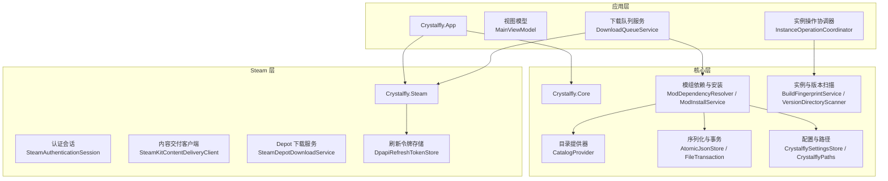
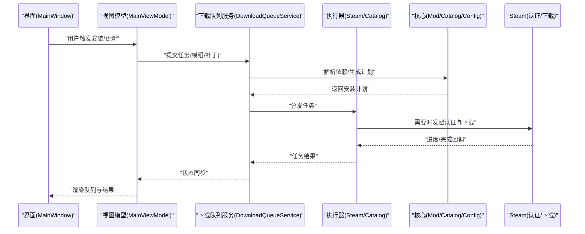
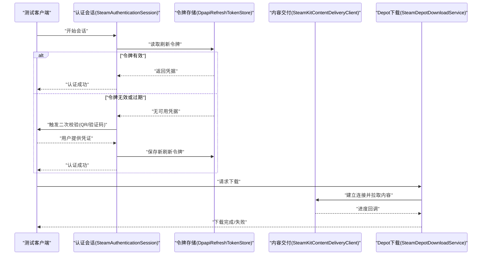
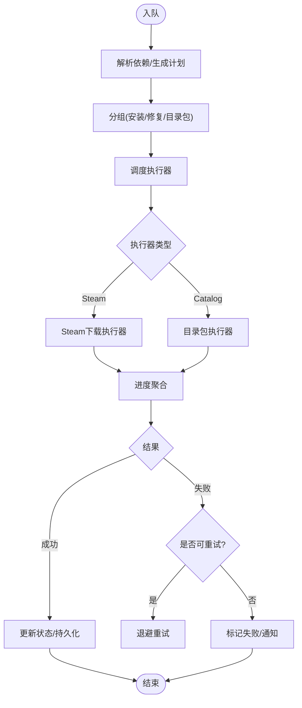
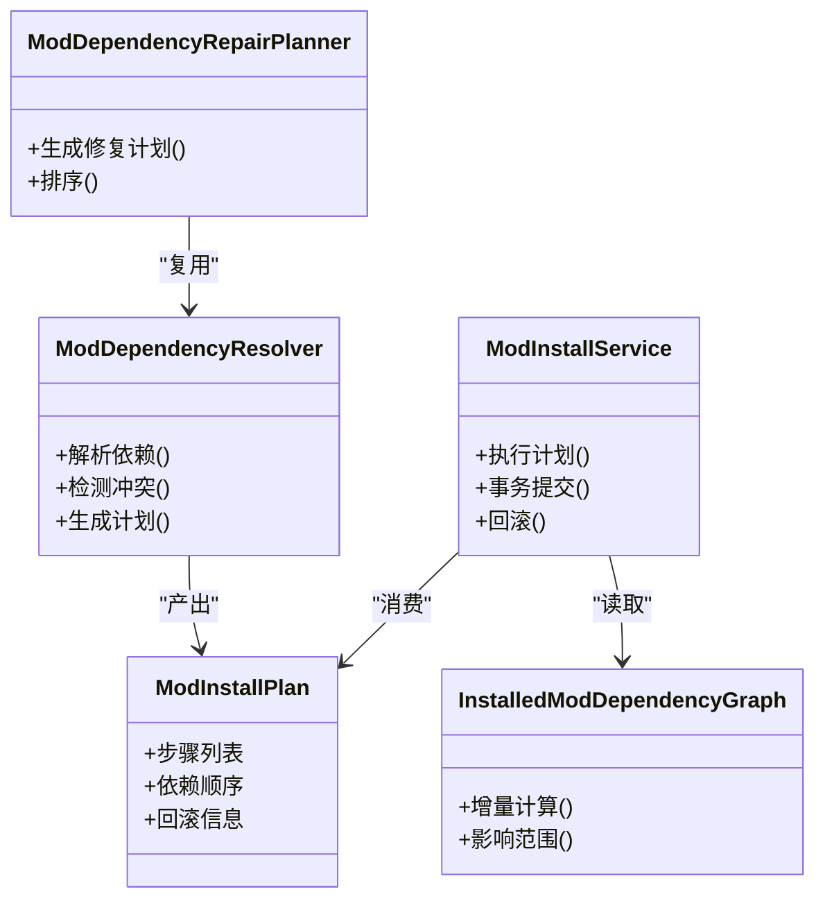
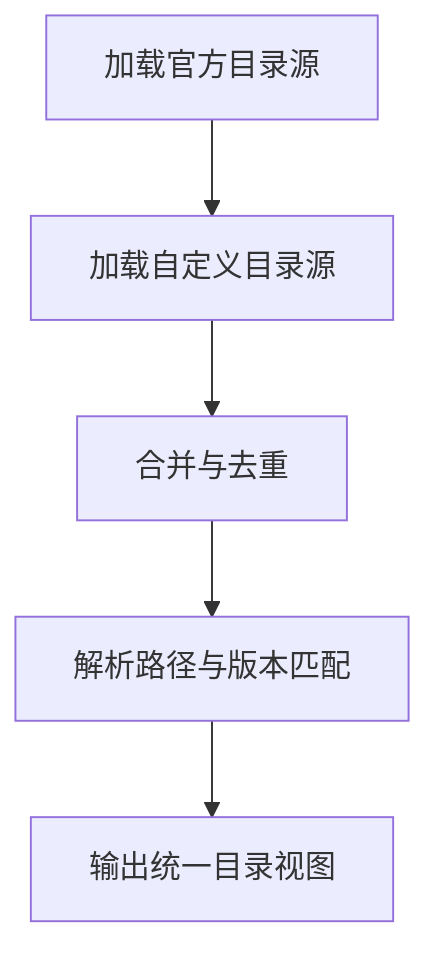
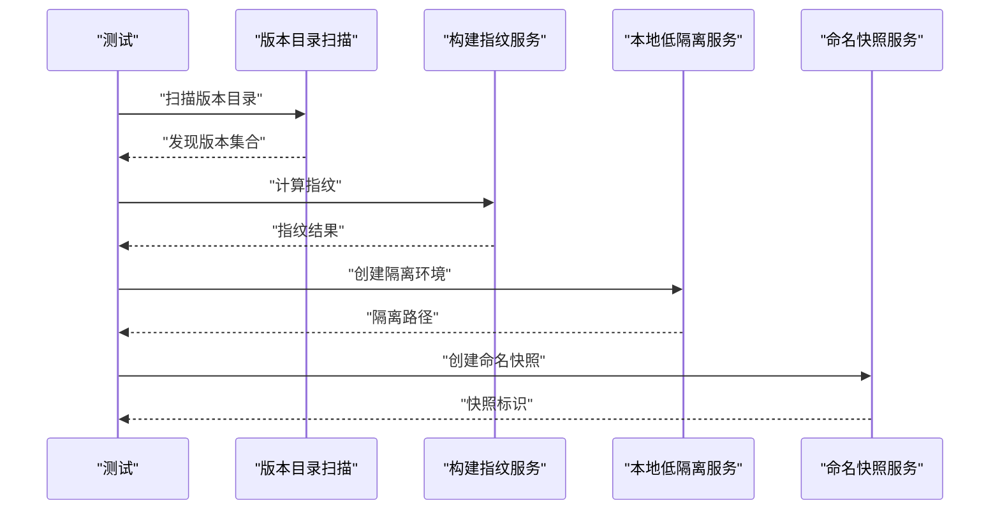
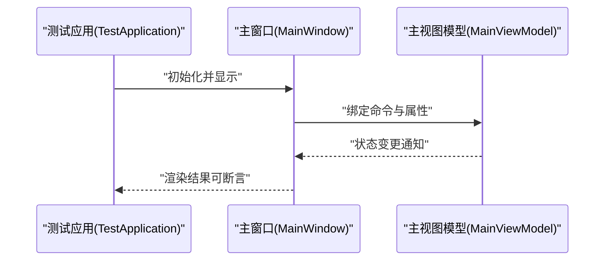
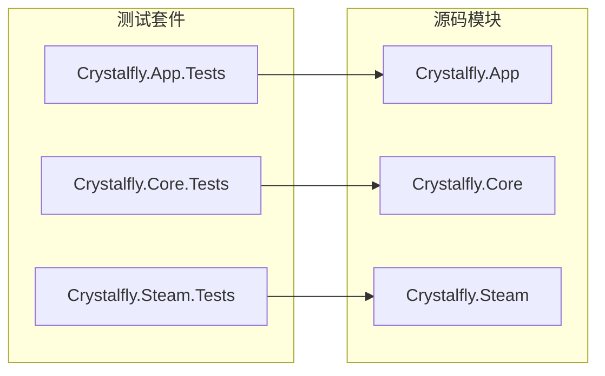

# 集成测试

<cite>
**本文引用的文件**   
- [Crystalfly.slnx](file://Crystalfly.slnx)
- [Directory.Build.props](file://Directory.Build.props)
- [Directory.Packages.props](file://Directory.Packages.props)
- [Program.cs](file://src/Crystalfly.App/Program.cs)
- [App.axaml.cs](file://src/Crystalfly.App/App.axaml.cs)
- [MainWindow.axaml.cs](file://src/Crystalfly.App/Views/MainWindow.axaml.cs)
- [MainViewModel.cs](file://src/Crystalfly.App/ViewModels/MainViewModel.cs)
- [DownloadQueueService.cs](file://src/Crystalfly.App/Downloads/DownloadQueueService.cs)
- [CatalogPackageQueueExecutor.cs](file://src/Crystalfly.App/Downloads/CatalogPackageQueueExecutor.cs)
- [SteamDownloadQueueExecutor.cs](file://src/Crystalfly.App/Downloads/SteamDownloadQueueExecutor.cs)
- [ModInstallQueueGroupFactory.cs](file://src/Crystalfly.App/Downloads/ModInstallQueueGroupFactory.cs)
- [ModDependencyRepairQueueGroupFactory.cs](file://src/Crystalfly.App/Downloads/ModDependencyRepairQueueGroupFactory.cs)
- [InstanceOperationCoordinator.cs](file://src/Crystalfly.App/Downloads/InstanceOperationCoordinator.cs)
- [IDownloadQueueExecutor.cs](file://src/Crystalfly.App/Downloads/IDownloadQueueExecutor.cs)
- [DownloadQueueModels.cs](file://src/Crystalfly.App/Downloads/DownloadQueueModels.cs)
- [SteamAuthenticationSession.cs](file://src/Crystalfly.Steam/Authentication/SteamAuthenticationSession.cs)
- [ISteamGuardCallback.cs](file://src/Crystalfly.Steam/Authentication/ISteamGuardCallback.cs)
- [QrChallengeEventArgs.cs](file://src/Crystalfly.Steam/Authentication/QrChallengeEventArgs.cs)
- [SteamDepotDownloadService.cs](file://src/Crystalfly.Steam/Downloads/SteamDepotDownloadService.cs)
- [SteamKitContentDeliveryClient.cs](file://src/Crystalfly.Steam/Downloads/SteamKitContentDeliveryClient.cs)
- [DownloadProgressAggregator.cs](file://src/Crystalfly.Steam/Downloads/DownloadProgressAggregator.cs)
- [DpapiRefreshTokenStore.cs](file://src/Crystalfly.Steam/Security/DpapiRefreshTokenStore.cs)
- [RefreshTokenCredential.cs](file://src/Crystalfly.Steam/Security/RefreshTokenCredential.cs)
- [ModDependencyResolver.cs](file://src/Crystalfly.Core/Mods/ModDependencyResolver.cs)
- [ModInstallPlan.cs](file://src/Crystalfly.Core/Mods/ModInstallPlan.cs)
- [ModInstallService.cs](file://src/Crystalfly.Core/Mods/ModInstallService.cs)
- [InstalledModDependencyGraph.cs](file://src/Crystalfly.Core/Mods/InstalledModDependencyGraph.cs)
- [ModDependencyRepairPlanner.cs](file://src/Crystalfly.Core/Mods/ModDependencyRepairPlanner.cs)
- [ModDependencyRepairPlan.cs](file://src/Crystalfly.Core/Mods/ModDependencyRepairPlan.cs)
- [CatalogProvider.cs](file://src/Crystalfly.Core/Catalog/CatalogProvider.cs)
- [OfficialCatalogSource.cs](file://src/Crystalfly.Core/Catalog/OfficialCatalogSource.cs)
- [CustomCatalogSource.cs](file://src/Crystalfly.Core/Catalog/CustomCatalogSource.cs)
- [EmbeddedCatalog.cs](file://src/Crystalfly.Core/Catalog/EmbeddedCatalog.cs)
- [CrystalflySettingsStore.cs](file://src/Crystalfly.Core/Configuration/CrystalflySettingsStore.cs)
- [CrystalflyPaths.cs](file://src/Crystalfly.Core/Configuration/CrystalflyPaths.cs)
- [AtomicJsonStore.cs](file://src/Crystalfly.Core/Serialization/AtomicJsonStore.cs)
- [FileTransaction.cs](file://src/Crystalfly.Core/Transactions/FileTransaction.cs)
- [BuildFingerprintService.cs](file://src/Crystalfly.Core/Instances/BuildFingerprintService.cs)
- [VersionDirectoryScanner.cs](file://src/Crystalfly.Core/Instances/VersionDirectoryScanner.cs)
- [LocalLowIsolationService.cs](file://src/Crystalfly.Core/LocalLow/LocalLowIsolationService.cs)
- [NamedSnapshotService.cs](file://src/Crystalfly.Core/Snapshots/NamedSnapshotService.cs)
- [HollowKnightProcessGuard.cs](file://src/Crystalfly.Core/Runtime/HollowKnightProcessGuard.cs)
- [LaunchPreflightEvaluator.cs](file://src/Crystalfly.Core/Runtime/LaunchPreflightEvaluator.cs)
- [GitHubRouteLatencyService.cs](file://src/Crystalfly.Core/Networking/GitHubRouteLatencyService.cs)
- [GitHubDownloadRouteHandler.cs](file://src/Crystalfly.Core/Networking/GitHubDownloadRouteHandler.cs)
- [Crystalfly.App.Tests.csproj](file://tests/Crystalfly.App.Tests/Crystalfly.App.Tests.csproj)
- [Crystalfly.Core.Tests.csproj](file://tests/Crystalfly.Core.Tests/Crystalfly.Core.Tests.csproj)
- [Crystalfly.Steam.Tests.csproj](file://tests/Crystalfly.Steam.Tests/Crystalfly.Steam.Tests.csproj)
- [DownloadQueueServiceTests.cs](file://tests/Crystalfly.App.Tests/Downloads/DownloadQueueServiceTests.cs)
- [CatalogPackageQueueExecutorTests.cs](file://tests/Crystalfly.App.Tests/Downloads/CatalogPackageQueueExecutorTests.cs)
- [SteamDownloadQueueExecutorTests.cs](file://tests/Crystalfly.App.Tests/Downloads/SteamDownloadQueueExecutorTests.cs)
- [ModInstallQueueGroupFactoryTests.cs](file://tests/Crystalfly.App.Tests/Downloads/ModInstallQueueGroupFactoryTests.cs)
- [ModDependencyRepairQueueGroupFactoryTests.cs](file://tests/Crystalfly.App.Tests/Downloads/ModDependencyRepairQueueGroupFactoryTests.cs)
- [InstanceOperationCoordinatorTests.cs](file://tests/Crystalfly.App.Tests/Downloads/InstanceOperationCoordinatorTests.cs)
- [TestApplication.cs](file://tests/Crystalfly.App.Tests/Ui/TestApplication.cs)
- [MainWindowCodeBehindTests.cs](file://tests/Crystalfly.App.Tests/Ui/MainWindowCodeBehindTests.cs)
- [MainWindowStructureTests.cs](file://tests/Crystalfly.App.Tests/Ui/MainWindowStructureTests.cs)
- [DownloadQueueRenderingTests.cs](file://tests/Crystalfly.App.Tests/Ui/DownloadQueueRenderingTests.cs)
- [ThemeRenderingTests.cs](file://tests/Crystalfly.App.Tests/Ui/ThemeRenderingTests.cs)
- [DocumentationScreenshotTests.cs](file://tests/Crystalfly.App.Tests/Ui/DocumentationScreenshotTests.cs)
- [ModMarketRenderingTests.cs](file://tests/Crystalfly.App.Tests/Ui/ModMarketRenderingTests.cs)
- [LayoutRenderingTests.cs](file://tests/Crystalfly.App.Tests/Ui/LayoutRenderingTests.cs)
- [DialogViewModelTests.cs](file://tests/Crystalfly.App.Tests/ViewModels/DialogViewModelTests.cs)
- [DownloadQueueGroupItemViewModelTests.cs](file://tests/Crystalfly.App.Tests/ViewModels/DownloadQueueGroupItemViewModelTests.cs)
- [InstalledModItemViewModelTests.cs](file://tests/Crystalfly.App.Tests/ViewModels/InstalledModItemViewModelTests.cs)
- [LocalizationViewModelTests.cs](file://tests/Crystalfly.App.Tests/ViewModels/LocalizationViewModelTests.cs)
- [MainViewModelStateTests.cs](file://tests/Crystalfly.App.Tests/ViewModels/MainViewModelStateTests.cs)
- [MarketInstallDialogViewModelTests.cs](file://tests/Crystalfly.App.Tests/ViewModels/MarketInstallDialogViewModelTests.cs)
- [MarketModItemViewModelTests.cs](file://tests/Crystalfly.App.Tests/ViewModels/MarketModItemViewModelTests.cs)
- [InstalledModDependencyGraphTests.cs](file://tests/Crystalfly.Core.Tests/Mods/InstalledModDependencyGraphTests.cs)
- [ModDependencyRepairPlannerTests.cs](file://tests/Crystalfly.Core.Tests/Mods/ModDependencyRepairPlannerTests.cs)
- [ModDependencyResolverTests.cs](file://tests/Crystalfly.Core.Tests/Mods/ModDependencyResolverTests.cs)
- [ModInstallServiceTests.cs](file://tests/Crystalfly.Core.Tests/Mods/ModInstallServiceTests.cs)
- [ModManagerTests.cs](file://tests/Crystalfly.Core.Tests/Mods/ModManagerTests.cs)
- [CatalogMergerTests.cs](file://tests/Crystalfly.Core.Tests/Catalog/CatalogMergerTests.cs)
- [CatalogProviderTests.cs](file://tests/Crystalfly.Core.Tests/Catalog/CatalogProviderTests.cs)
- [CatalogResolverTests.cs](file://tests/Crystalfly.Core.Tests/Catalog/CatalogResolverTests.cs)
- [CustomCatalogSourceTests.cs](file://tests/Crystalfly.Core.Tests/Catalog/CustomCatalogSourceTests.cs)
- [EmbeddedCatalogTests.cs](file://tests/Crystalfly.Core.Tests/Catalog/EmbeddedCatalogTests.cs)
- [ModTranslationSourceTests.cs](file://tests/Crystalfly.Core.Tests/Catalog/ModTranslationSourceTests.cs)
- [OfficialCatalogSourceTests.cs](file://tests/Crystalfly.Core.Tests/Catalog/OfficialCatalogSourceTests.cs)
- [OfficialXmlCatalogParserTests.cs](file://tests/Crystalfly.Core.Tests/Catalog/OfficialXmlCatalogParserTests.cs)
- [CrystalflyPathsTests.cs](file://tests/Crystalfly.Core.Tests/Configuration/CrystalflyPathsTests.cs)
- [CrystalflySettingsStoreTests.cs](file://tests/Crystalfly.Core.Tests/Configuration/CrystalfflySettingsStoreTests.cs)
- [BuildFingerprintServiceTests.cs](file://tests/Crystalfly.Core.Tests/Instances/BuildFingerprintServiceTests.cs)
- [InstanceCloneServiceTests.cs](file://tests/Crystalfly.Core.Tests/Instances/InstanceCloneServiceTests.cs)
- [InstanceDeletionServiceTests.cs](file://tests/Crystalfly.Core.Tests/Instances/InstanceDeletionServiceTests.cs)
- [InstanceDirectoryTests.cs](file://tests/Crystalfly.Core.Tests/Instances/InstanceDirectoryTests.cs)
- [InstanceImportServiceTests.cs](file://tests/Crystalfly.Core.Tests/Instances/InstanceImportServiceTests.cs)
- [InstanceSidecarTests.cs](file://tests/Crystalfly.Core.Tests/Instances/InstanceSidecarTests.cs)
- [VersionDirectoryScannerTests.cs](file://tests/Crystalfly.Core.Tests/Instances/VersionDirectoryScannerTests.cs)
- [LoaderManagerTests.cs](file://tests/Crystalfly.Core.Tests/Loaders/LoaderManagerTests.cs)
- [LoaderStateDetectorTests.cs](file://tests/Crystalfly.Core.Tests/Loaders/LoaderStateDetectorTests.cs)
- [LocalLoaderPackageManifestTests.cs](file://tests/Crystalfly.Core.Tests/Loaders/LocalLoaderPackageManifestTests.cs)
- [LocalLowIsolationServiceTests.cs](file://tests/Crystalfly.Core.Tests/LocalLow/LocalLowIsolationServiceTests.cs)
- [GitHubDownloadRouteHandlerTests.cs](file://tests/Crystalfly.Core.Tests/Networking/GitHubDownloadRouteHandlerTests.cs)
- [GitHubRouteLatencyServiceTests.cs](file://tests/Crystalfly.Core.Tests/Networking/GitHubRouteLatencyServiceTests.cs)
- [AtomicJsonStoreTests.cs](file://tests/Crystalfly.Core.Tests/Serialization/AtomicJsonStoreTests.cs)
- [ManifestSerializationTests.cs](file://tests/Crystalfly.Core.Tests/Serialization/ManifestSerializationTests.cs)
- [NamedSnapshotServiceTests.cs](file://tests/Crystalfly.Core.Tests/Snapshots/NamedSnapshotServiceTests.cs)
- [OfficialSpeedrunTemplatePolicyTests.cs](file://tests/Crystalfly.Core.Tests/Speedrun/OfficialSpeedrunTemplatePolicyTests.cs)
- [SpeedrunEnvironmentProvisionerTests.cs](file://tests/Crystalfly.Core.Tests/Speedrun/SpeedrunEnvironmentProvisionerTests.cs)
- [SpeedrunEnvironmentVerifierTests.cs](file://tests/Crystalfly.Core.Tests/Speedrun/SpeedrunEnvironmentVerifierTests.cs)
- [FileTransactionTests.cs](file://tests/Crystalfly.Core.Tests/Transactions/FileTransactionTests.cs)
- [DownloadPathTests.cs](file://tests/Crystalfly.Steam.Tests/Downloads/DownloadPathTests.cs)
- [DownloadProgressAggregatorTests.cs](file://tests/Crystalfly.Steam.Tests/Downloads/DownloadProgressAggregatorTests.cs)
- [SteamDepotDownloadServiceTests.cs](file://tests/Crystalfly.Steam.Tests/Downloads/SteamDepotDownloadServiceTests.cs)
- [SteamKitContentDeliveryClientTests.cs](file://tests/Crystalfly.Steam.Tests/Downloads/SteamKitContentDeliveryClientTests.cs)
- [DpapiRefreshTokenStoreTests.cs](file://tests/Crystalfly.Steam.Tests/Security/DpapiRefreshTokenStoreTests.cs)
</cite>

## 目录
1. [简介](#简介)
2. [项目结构](#项目结构)
3. [核心组件](#核心组件)
4. [架构总览](#架构总览)
5. [详细组件分析](#详细组件分析)
6. [依赖关系分析](#依赖关系分析)
7. [性能考虑](#性能考虑)
8. [故障排查指南](#故障排查指南)
9. [结论](#结论)
10. [附录](#附录)

## 简介
本文件面向 Crystalfly 项目的集成测试，聚焦跨组件交互的验证策略与实现方法。内容覆盖：
- Steam 认证流程、下载队列系统、模组依赖解析等关键链路的集成测试设计
- 外部服务模拟、数据库（持久化）与文件系统操作的测试方案
- 测试环境搭建与管理、测试数据准备与清理
- 并发测试、性能测试与端到端测试的实现要点
- 最佳实践与常见问题解决方案

## 项目结构
Crystalfly 采用分层与按功能域组织的方式：
- 应用层（App）：UI、视图模型、下载队列编排与实例操作协调
- 核心层（Core）：目录、配置、序列化、事务、模组管理、目录扫描、快照、运行时前置检查、网络路由选择等
- Steam 层（Steam）：认证、令牌存储、内容交付客户端与下载进度聚合
- 测试层（Tests）：针对 App、Core、Steam 的单元测试与集成测试

图表来源
- [Program.cs:1-200](file://src/Crystalfly.App/Program.cs#L1-L200)
- [App.axaml.cs:1-200](file://src/Crystalfly.App/App.axaml.cs#L1-L200)
- [MainWindow.axaml.cs:1-200](file://src/Crystalfly.App/Views/MainWindow.axaml.cs#L1-L200)
- [MainViewModel.cs:1-200](file://src/Crystalfly.App/ViewModels/MainViewModel.cs#L1-L200)
- [DownloadQueueService.cs:1-200](file://src/Crystalfly.App/Downloads/DownloadQueueService.cs#L1-L200)
- [InstanceOperationCoordinator.cs:1-200](file://src/Crystalfly.App/Downloads/InstanceOperationCoordinator.cs#L1-L200)
- [ModDependencyResolver.cs:1-200](file://src/Crystalfly.Core/Mods/ModDependencyResolver.cs#L1-L200)
- [ModInstallService.cs:1-200](file://src/Crystalfly.Core/Mods/ModInstallService.cs#L1-L200)
- [CatalogProvider.cs:1-200](file://src/Crystalfly.Core/Catalog/CatalogProvider.cs#L1-L200)
- [BuildFingerprintService.cs:1-200](file://src/Crystalfly.Core/Instances/BuildFingerprintService.cs#L1-L200)
- [VersionDirectoryScanner.cs:1-200](file://src/Crystalfly.Core/Instances/VersionDirectoryScanner.cs#L1-L200)
- [AtomicJsonStore.cs:1-200](file://src/Crystalfly.Core/Serialization/AtomicJsonStore.cs#L1-L200)
- [FileTransaction.cs:1-200](file://src/Crystalfly.Core/Transactions/FileTransaction.cs#L1-L200)
- [CrystalflySettingsStore.cs:1-200](file://src/Crystalfly.Core/Configuration/CrystalflySettingsStore.cs#L1-L200)
- [CrystalflyPaths.cs:1-200](file://src/Crystalfly.Core/Configuration/CrystalflyPaths.cs#L1-L200)
- [SteamAuthenticationSession.cs:1-200](file://src/Crystalfly.Steam/Authentication/SteamAuthenticationSession.cs#L1-L200)
- [SteamKitContentDeliveryClient.cs:1-200](file://src/Crystalfly.Steam/Downloads/SteamKitContentDeliveryClient.cs#L1-L200)
- [SteamDepotDownloadService.cs:1-200](file://src/Crystalfly.Steam/Downloads/SteamDepotDownloadService.cs#L1-L200)
- [DpapiRefreshTokenStore.cs:1-200](file://src/Crystalfly.Steam/Security/DpapiRefreshTokenStore.cs#L1-L200)

章节来源
- [Crystalfly.slnx](file://Crystalfly.slnx)
- [Directory.Build.props:1-200](file://Directory.Build.props#L1-L200)
- [Directory.Packages.props:1-200](file://Directory.Packages.props#L1-L200)

## 核心组件
本节概述与集成测试密切相关的核心组件及其职责边界，便于在跨组件场景下定位断言点与模拟点。

- 下载队列与应用编排
  - 下载队列服务负责任务入队、调度与状态同步
  - 各类执行器封装不同来源的下载逻辑（如 Steam Depot、目录包）
  - 组工厂用于将相关任务分组（例如模组安装、依赖修复）
  - 实例操作协调器负责在实例生命周期内协调下载与安装顺序

- Steam 认证与内容交付
  - 认证会话处理登录、二次校验与回调事件
  - 刷新令牌存储负责安全持久化凭据
  - 内容交付客户端对接底层库进行实际下载
  - Depot 下载服务抽象下载任务与进度聚合

- 模组依赖与安装
  - 依赖解析器构建安装计划并检测冲突
  - 安装服务执行计划、回滚与事务保障
  - 已安装依赖图用于增量变更评估
  - 依赖修复规划器生成修复计划

- 目录与配置
  - 目录提供器聚合官方、自定义与嵌入式目录源
  - 设置与路径服务提供可配置的根路径与数据位置
  - 原子 JSON 存储与文件事务确保一致性

- 实例与运行时
  - 构建指纹服务与版本目录扫描用于识别游戏版本
  - 本地低隔离服务与快照服务辅助环境隔离与恢复
  - 进程守护与前评估器保证启动前条件满足

章节来源
- [DownloadQueueService.cs:1-200](file://src/Crystalfly.App/Downloads/DownloadQueueService.cs#L1-L200)
- [CatalogPackageQueueExecutor.cs:1-200](file://src/Crystalfly.App/Downloads/CatalogPackageQueueExecutor.cs#L1-L200)
- [SteamDownloadQueueExecutor.cs:1-200](file://src/Crystalfly.App/Downloads/SteamDownloadQueueExecutor.cs#L1-L200)
- [ModInstallQueueGroupFactory.cs:1-200](file://src/Crystalfly.App/Downloads/ModInstallQueueGroupFactory.cs#L1-L200)
- [ModDependencyRepairQueueGroupFactory.cs:1-200](file://src/Crystalfly.App/Downloads/ModDependencyRepairQueueGroupFactory.cs#L1-L200)
- [InstanceOperationCoordinator.cs:1-200](file://src/Crystalfly.App/Downloads/InstanceOperationCoordinator.cs#L1-L200)
- [IDownloadQueueExecutor.cs:1-200](file://src/Crystalfly.App/Downloads/IDownloadQueueExecutor.cs#L1-L200)
- [DownloadQueueModels.cs:1-200](file://src/Crystalfly.App/Downloads/DownloadQueueModels.cs#L1-L200)
- [SteamAuthenticationSession.cs:1-200](file://src/Crystalfly.Steam/Authentication/SteamAuthenticationSession.cs#L1-L200)
- [ISteamGuardCallback.cs:1-200](file://src/Crystalfly.Steam/Authentication/ISteamGuardCallback.cs#L1-L200)
- [QrChallengeEventArgs.cs:1-200](file://src/Crystalfly.Steam/Authentication/QrChallengeEventArgs.cs#L1-L200)
- [SteamDepotDownloadService.cs:1-200](file://src/Crystalfly.Steam/Downloads/SteamDepotDownloadService.cs#L1-L200)
- [SteamKitContentDeliveryClient.cs:1-200](file://src/Crystalfly.Steam/Downloads/SteamKitContentDeliveryClient.cs#L1-L200)
- [DownloadProgressAggregator.cs:1-200](file://src/Crystalfly.Steam/Downloads/DownloadProgressAggregator.cs#L1-L200)
- [DpapiRefreshTokenStore.cs:1-200](file://src/Crystalfly.Steam/Security/DpapiRefreshTokenStore.cs#L1-L200)
- [RefreshTokenCredential.cs:1-200](file://src/Crystalfly.Steam/Security/RefreshTokenCredential.cs#L1-L200)
- [ModDependencyResolver.cs:1-200](file://src/Crystalfly.Core/Mods/ModDependencyResolver.cs#L1-L200)
- [ModInstallPlan.cs:1-200](file://src/Crystalfly.Core/Mods/ModInstallPlan.cs#L1-L200)
- [ModInstallService.cs:1-200](file://src/Crystalfly.Core/Mods/ModInstallService.cs#L1-L200)
- [InstalledModDependencyGraph.cs:1-200](file://src/Crystalfly.Core/Mods/InstalledModDependencyGraph.cs#L1-L200)
- [ModDependencyRepairPlanner.cs:1-200](file://src/Crystalfly.Core/Mods/ModDependencyRepairPlanner.cs#L1-L200)
- [ModDependencyRepairPlan.cs:1-200](file://src/Crystalfly.Core/Mods/ModDependencyRepairPlan.cs#L1-L200)
- [CatalogProvider.cs:1-200](file://src/Crystalfly.Core/Catalog/CatalogProvider.cs#L1-L200)
- [OfficialCatalogSource.cs:1-200](file://src/Crystalfly.Core/Catalog/OfficialCatalogSource.cs#L1-L200)
- [CustomCatalogSource.cs:1-200](file://src/Crystalfly.Core/Catalog/CustomCatalogSource.cs#L1-L200)
- [EmbeddedCatalog.cs:1-200](file://src/Crystalfly.Core/Catalog/EmbeddedCatalog.cs#L1-L200)
- [CrystalflySettingsStore.cs:1-200](file://src/Crystalfly.Core/Configuration/CrystalflySettingsStore.cs#L1-L200)
- [CrystalflyPaths.cs:1-200](file://src/Crystalfly.Core/Configuration/CrystalflyPaths.cs#L1-L200)
- [AtomicJsonStore.cs:1-200](file://src/Crystalfly.Core/Serialization/AtomicJsonStore.cs#L1-L200)
- [FileTransaction.cs:1-200](file://src/Crystalfly.Core/Transactions/FileTransaction.cs#L1-L200)
- [BuildFingerprintService.cs:1-200](file://src/Crystalfly.Core/Instances/BuildFingerprintService.cs#L1-L200)
- [VersionDirectoryScanner.cs:1-200](file://src/Crystalfly.Core/Instances/VersionDirectoryScanner.cs#L1-L200)
- [LocalLowIsolationService.cs:1-200](file://src/Crystalfly.Core/LocalLow/LocalLowIsolationService.cs#L1-L200)
- [NamedSnapshotService.cs:1-200](file://src/Crystalfly.Core/Snapshots/NamedSnapshotService.cs#L1-L200)
- [HollowKnightProcessGuard.cs:1-200](file://src/Crystalfly.Core/Runtime/HollowKnightProcessGuard.cs#L1-L200)
- [LaunchPreflightEvaluator.cs:1-200](file://src/Crystalfly.Core/Runtime/LaunchPreflightEvaluator.cs#L1-L200)
- [GitHubRouteLatencyService.cs:1-200](file://src/Crystalfly.Core/Networking/GitHubRouteLatencyService.cs#L1-L200)
- [GitHubDownloadRouteHandler.cs:1-200](file://src/Crystalfly.Core/Networking/GitHubDownloadRouteHandler.cs#L1-L200)

## 架构总览
下图展示从 UI 到核心与 Steam 层的调用链路，以及下载与安装的协作方式。

图表来源
- [MainWindow.axaml.cs:1-200](file://src/Crystalfly.App/Views/MainWindow.axaml.cs#L1-L200)
- [MainViewModel.cs:1-200](file://src/Crystalfly.App/ViewModels/MainViewModel.cs#L1-L200)
- [DownloadQueueService.cs:1-200](file://src/Crystalfly.App/Downloads/DownloadQueueService.cs#L1-L200)
- [SteamDownloadQueueExecutor.cs:1-200](file://src/Crystalfly.App/Downloads/SteamDownloadQueueExecutor.cs#L1-L200)
- [CatalogPackageQueueExecutor.cs:1-200](file://src/Crystalfly.App/Downloads/CatalogPackageQueueExecutor.cs#L1-L200)
- [ModDependencyResolver.cs:1-200](file://src/Crystalfly.Core/Mods/ModDependencyResolver.cs#L1-L200)
- [ModInstallService.cs:1-200](file://src/Crystalfly.Core/Mods/ModInstallService.cs#L1-L200)
- [SteamAuthenticationSession.cs:1-200](file://src/Crystalfly.Steam/Authentication/SteamAuthenticationSession.cs#L1-L200)
- [SteamDepotDownloadService.cs:1-200](file://src/Crystalfly.Steam/Downloads/SteamDepotDownloadService.cs#L1-L200)

## 详细组件分析

### Steam 认证流程集成测试
目标：验证登录、二次校验、令牌缓存与后续下载的完整链路，包括异常与重试。

图表来源
- [SteamAuthenticationSession.cs:1-200](file://src/Crystalfly.Steam/Authentication/SteamAuthenticationSession.cs#L1-L200)
- [ISteamGuardCallback.cs:1-200](file://src/Crystalfly.Steam/Authentication/ISteamGuardCallback.cs#L1-L200)
- [QrChallengeEventArgs.cs:1-200](file://src/Crystalfly.Steam/Authentication/QrChallengeEventArgs.cs#L1-L200)
- [DpapiRefreshTokenStore.cs:1-200](file://src/Crystalfly.Steam/Security/DpapiRefreshTokenStore.cs#L1-L200)
- [RefreshTokenCredential.cs:1-200](file://src/Crystalfly.Steam/Security/RefreshTokenCredential.cs#L1-L200)
- [SteamKitContentDeliveryClient.cs:1-200](file://src/Crystalfly.Steam/Downloads/SteamKitContentDeliveryClient.cs#L1-L200)
- [SteamDepotDownloadService.cs:1-200](file://src/Crystalfly.Steam/Downloads/SteamDepotDownloadService.cs#L1-L200)

编写示例要点
- 使用内存或临时目录替换真实令牌存储，避免写入系统密钥存储
- 通过回调接口注入二次校验事件，模拟扫码/输入流程
- 对内容交付客户端进行轻量代理，返回固定进度与成功/失败信号
- 断言：会话状态机转换、令牌读写次数、下载进度聚合值、错误码映射

章节来源
- [SteamAuthenticationSession.cs:1-200](file://src/Crystalfly.Steam/Authentication/SteamAuthenticationSession.cs#L1-L200)
- [DpapiRefreshTokenStore.cs:1-200](file://src/Crystalfly.Steam/Security/DpapiRefreshTokenStore.cs#L1-L200)
- [SteamKitContentDeliveryClient.cs:1-200](file://src/Crystalfly.Steam/Downloads/SteamKitContentDeliveryClient.cs#L1-L200)
- [SteamDepotDownloadService.cs:1-200](file://src/Crystalfly.Steam/Downloads/SteamDepotDownloadService.cs#L1-L200)

### 下载队列系统集成测试
目标：验证多任务并发、优先级、失败重试、取消与状态同步。

图表来源
- [DownloadQueueService.cs:1-200](file://src/Crystalfly.App/Downloads/DownloadQueueService.cs#L1-L200)
- [SteamDownloadQueueExecutor.cs:1-200](file://src/Crystalfly.App/Downloads/SteamDownloadQueueExecutor.cs#L1-L200)
- [CatalogPackageQueueExecutor.cs:1-200](file://src/Crystalfly.App/Downloads/CatalogPackageQueueExecutor.cs#L1-L200)
- [ModInstallQueueGroupFactory.cs:1-200](file://src/Crystalfly.App/Downloads/ModInstallQueueGroupFactory.cs#L1-L200)
- [ModDependencyRepairQueueGroupFactory.cs:1-200](file://src/Crystalfly.App/Downloads/ModDependencyRepairQueueGroupFactory.cs#L1-L200)
- [DownloadProgressAggregator.cs:1-200](file://src/Crystalfly.Steam/Downloads/DownloadProgressAggregator.cs#L1-L200)

编写示例要点
- 构造最小化的依赖图与安装计划，减少外部 IO
- 使用可控的执行器替身，注入延迟与随机失败以验证重试与取消
- 断言：队列长度变化、并发度上限、最终一致性与幂等性

章节来源
- [DownloadQueueService.cs:1-200](file://src/Crystalfly.App/Downloads/DownloadQueueService.cs#L1-L200)
- [DownloadProgressAggregator.cs:1-200](file://src/Crystalfly.Steam/Downloads/DownloadProgressAggregator.cs#L1-L200)

### 模组依赖解析与安装集成测试
目标：验证依赖解析正确性、冲突检测、修复计划与安装事务回滚。

图表来源
- [ModDependencyResolver.cs:1-200](file://src/Crystalfly.Core/Mods/ModDependencyResolver.cs#L1-L200)
- [ModInstallPlan.cs:1-200](file://src/Crystalfly.Core/Mods/ModInstallPlan.cs#L1-L200)
- [ModInstallService.cs:1-200](file://src/Crystalfly.Core/Mods/ModInstallService.cs#L1-L200)
- [InstalledModDependencyGraph.cs:1-200](file://src/Crystalfly.Core/Mods/InstalledModDependencyGraph.cs#L1-L200)
- [ModDependencyRepairPlanner.cs:1-200](file://src/Crystalfly.Core/Mods/ModDependencyRepairPlanner.cs#L1-L200)

编写示例要点
- 使用嵌入式目录与自定义目录源构造已知依赖集
- 通过事务包装文件操作，断言失败时的回滚完整性
- 验证修复计划能消除循环依赖与版本不兼容

章节来源
- [ModDependencyResolver.cs:1-200](file://src/Crystalfly.Core/Mods/ModDependencyResolver.cs#L1-L200)
- [ModInstallService.cs:1-200](file://src/Crystalfly.Core/Mods/ModInstallService.cs#L1-L200)
- [InstalledModDependencyGraph.cs:1-200](file://src/Crystalfly.Core/Mods/InstalledModDependencyGraph.cs#L1-L200)
- [ModDependencyRepairPlanner.cs:1-200](file://src/Crystalfly.Core/Mods/ModDependencyRepairPlanner.cs#L1-L200)

### 目录与配置集成测试
目标：验证目录提供器的合并策略、路径解析与设置持久化。

图表来源
- [CatalogProvider.cs:1-200](file://src/Crystalfly.Core/Catalog/CatalogProvider.cs#L1-L200)
- [OfficialCatalogSource.cs:1-200](file://src/Crystalfly.Core/Catalog/OfficialCatalogSource.cs#L1-L200)
- [CustomCatalogSource.cs:1-200](file://src/Crystalfly.Core/Catalog/CustomCatalogSource.cs#L1-L200)
- [EmbeddedCatalog.cs:1-200](file://src/Crystalfly.Core/Catalog/EmbeddedCatalog.cs#L1-L200)
- [CrystalflyPaths.cs:1-200](file://src/Crystalfly.Core/Configuration/CrystalflyPaths.cs#L1-L200)
- [CrystalflySettingsStore.cs:1-200](file://src/Crystalfly.Core/Configuration/CrystalflySettingsStore.cs#L1-L200)

编写示例要点
- 使用临时目录作为数据根，避免污染用户环境
- 断言：合并后的条目数量、唯一键约束、路径规范化结果

章节来源
- [CatalogProvider.cs:1-200](file://src/Crystalfly.Core/Catalog/CatalogProvider.cs#L1-L200)
- [CrystalflyPaths.cs:1-200](file://src/Crystalfly.Core/Configuration/CrystalflyPaths.cs#L1-L200)
- [CrystalflySettingsStore.cs:1-200](file://src/Crystalfly.Core/Configuration/CrystalflySettingsStore.cs#L1-L200)

### 实例与运行时前置检查集成测试
目标：验证构建指纹识别、版本目录扫描、本地低隔离与快照恢复。

图表来源
- [VersionDirectoryScanner.cs:1-200](file://src/Crystalfly.Core/Instances/VersionDirectoryScanner.cs#L1-L200)
- [BuildFingerprintService.cs:1-200](file://src/Crystalfly.Core/Instances/BuildFingerprintService.cs#L1-L200)
- [LocalLowIsolationService.cs:1-200](file://src/Crystalfly.Core/LocalLow/LocalLowIsolationService.cs#L1-L200)
- [NamedSnapshotService.cs:1-200](file://src/Crystalfly.Core/Snapshots/NamedSnapshotService.cs#L1-L200)

编写示例要点
- 使用受控的文件树模拟不同版本结构
- 断言：指纹稳定性、隔离目录独立性、快照可恢复性

章节来源
- [VersionDirectoryScanner.cs:1-200](file://src/Crystalfly.Core/Instances/VersionDirectoryScanner.cs#L1-L200)
- [BuildFingerprintService.cs:1-200](file://src/Crystalfly.Core/Instances/BuildFingerprintService.cs#L1-L200)
- [LocalLowIsolationService.cs:1-200](file://src/Crystalfly.Core/LocalLow/LocalLowIsolationService.cs#L1-L200)
- [NamedSnapshotService.cs:1-200](file://src/Crystalfly.Core/Snapshots/NamedSnapshotService.cs#L1-L200)

### UI 与 ViewModel 集成测试
目标：验证主窗口结构与主题渲染、下载队列渲染与状态绑定。

图表来源
- [TestApplication.cs:1-200](file://tests/Crystalfly.App.Tests/Ui/TestApplication.cs#L1-L200)
- [MainWindow.axaml.cs:1-200](file://src/Crystalfly.App/Views/MainWindow.axaml.cs#L1-L200)
- [MainViewModel.cs:1-200](file://src/Crystalfly.App/ViewModels/MainViewModel.cs#L1-L200)
- [DownloadQueueRenderingTests.cs:1-200](file://tests/Crystalfly.App.Tests/Ui/DownloadQueueRenderingTests.cs#L1-L200)
- [ThemeRenderingTests.cs:1-200](file://tests/Crystalfly.App.Tests/Ui/ThemeRenderingTests.cs#L1-L200)

编写示例要点
- 使用无头 UI 测试框架初始化应用上下文
- 断言：控件可见性、样式应用、数据绑定一致性

章节来源
- [MainWindowCodeBehindTests.cs:1-200](file://tests/Crystalfly.App.Tests/Ui/MainWindowCodeBehindTests.cs#L1-L200)
- [MainWindowStructureTests.cs:1-200](file://tests/Crystalfly.App.Tests/Ui/MainWindowStructureTests.cs#L1-L200)
- [DownloadQueueRenderingTests.cs:1-200](file://tests/Crystalfly.App.Tests/Ui/DownloadQueueRenderingTests.cs#L1-L200)
- [ThemeRenderingTests.cs:1-200](file://tests/Crystalfly.App.Tests/Ui/ThemeRenderingTests.cs#L1-L200)

## 依赖关系分析
下图展示测试项目与对应源码模块的依赖关系，有助于理解各测试套件的作用域。

图表来源
- [Crystalfly.App.Tests.csproj:1-200](file://tests/Crystalfly.App.Tests/Crystalfly.App.Tests.csproj#L1-L200)
- [Crystalfly.Core.Tests.csproj:1-200](file://tests/Crystalfly.Core.Tests/Crystalfly.Core.Tests.csproj#L1-L200)
- [Crystalfly.Steam.Tests.csproj:1-200](file://tests/Crystalfly.Steam.Tests/Crystalfly.Steam.Tests.csproj#L1-L200)

章节来源
- [Crystalfly.App.Tests.csproj:1-200](file://tests/Crystalfly.App.Tests/Crystalfly.App.Tests.csproj#L1-L200)
- [Crystalfly.Core.Tests.csproj:1-200](file://tests/Crystalfly.Core.Tests/Crystalfly.Core.Tests.csproj#L1-L200)
- [Crystalfly.Steam.Tests.csproj:1-200](file://tests/Crystalfly.Steam.Tests/Crystalfly.Steam.Tests.csproj#L1-L200)

## 性能考虑
- 并发下载
  - 限制最大并发度，避免资源争用导致吞吐下降
  - 使用进度聚合器汇总子任务进度，降低 UI 更新频率
- 依赖解析
  - 缓存已解析的依赖图，避免重复计算
  - 增量计算影响范围，减少不必要的重新安装
- 文件 IO
  - 批量写入与原子事务结合，减少磁盘抖动
  - 预分配与顺序写入提升大文件下载效率
- 网络
  - 根据 GitHub 路由延迟服务动态选择最优下载源
  - 合理设置超时与重试退避策略

[本节为通用指导，无需具体文件引用]

## 故障排查指南
- 认证失败
  - 检查刷新令牌存储是否可写、权限是否正确
  - 确认二次校验回调是否被正确订阅与响应
- 下载中断
  - 验证进度聚合器状态是否与执行器一致
  - 检查网络路由选择与重试策略
- 依赖冲突
  - 查看依赖图与修复计划，确认是否存在循环依赖
  - 核对版本约束与兼容性矩阵
- 文件不一致
  - 确认事务提交与回滚路径是否覆盖所有受影响文件
  - 使用快照快速恢复到稳定状态

章节来源
- [DpapiRefreshTokenStore.cs:1-200](file://src/Crystalfly.Steam/Security/DpapiRefreshTokenStore.cs#L1-L200)
- [DownloadProgressAggregator.cs:1-200](file://src/Crystalfly.Steam/Downloads/DownloadProgressAggregator.cs#L1-L200)
- [InstalledModDependencyGraph.cs:1-200](file://src/Crystalfly.Core/Mods/InstalledModDependencyGraph.cs#L1-L200)
- [ModDependencyRepairPlanner.cs:1-200](file://src/Crystalfly.Core/Mods/ModDependencyRepairPlanner.cs#L1-L200)
- [FileTransaction.cs:1-200](file://src/Crystalfly.Core/Transactions/FileTransaction.cs#L1-L200)
- [NamedSnapshotService.cs:1-200](file://src/Crystalfly.Core/Snapshots/NamedSnapshotService.cs#L1-L200)

## 结论
通过围绕 Steam 认证、下载队列与模组依赖解析的关键链路设计集成测试，并结合外部服务模拟、持久化与文件系统操作的可控环境，能够显著提升跨组件交互的可靠性与可维护性。建议持续完善并发与性能测试用例，沉淀最佳实践，形成稳定的质量基线。

[本节为总结，无需具体文件引用]

## 附录

### 测试环境搭建与管理
- 使用独立的数据根目录，避免与用户环境交叉
- 通过配置服务注入路径与设置，支持测试间切换
- 在测试前后进行环境初始化与清理，确保幂等

章节来源
- [CrystalflySettingsStore.cs:1-200](file://src/Crystalfly.Core/Configuration/CrystalflySettingsStore.cs#L1-L200)
- [CrystalflyPaths.cs:1-200](file://src/Crystalfly.Core/Configuration/CrystalflyPaths.cs#L1-L200)

### 测试数据准备与清理
- 使用嵌入式目录与自定义目录源提供稳定数据集
- 借助原子 JSON 存储与事务保证数据一致性
- 在测试结束后删除临时目录与快照

章节来源
- [EmbeddedCatalog.cs:1-200](file://src/Crystalfly.Core/Catalog/EmbeddedCatalog.cs#L1-L200)
- [CustomCatalogSource.cs:1-200](file://src/Crystalfly.Core/Catalog/CustomCatalogSource.cs#L1-L200)
- [AtomicJsonStore.cs:1-200](file://src/Crystalfly.Core/Serialization/AtomicJsonStore.cs#L1-L200)
- [FileTransaction.cs:1-200](file://src/Crystalfly.Core/Transactions/FileTransaction.cs#L1-L200)
- [NamedSnapshotService.cs:1-200](file://src/Crystalfly.Core/Snapshots/NamedSnapshotService.cs#L1-L200)

### 并发测试、性能测试与端到端测试
- 并发测试
  - 控制并发度，验证竞争条件下的状态一致性与幂等性
- 性能测试
  - 记录关键路径耗时，关注下载吞吐与依赖解析时间
- 端到端测试
  - 从 UI 触发到后台完成的全链路验证，包含错误注入与恢复

章节来源
- [DownloadQueueService.cs:1-200](file://src/Crystalfly.App/Downloads/DownloadQueueService.cs#L1-L200)
- [ModDependencyResolver.cs:1-200](file://src/Crystalfly.Core/Mods/ModDependencyResolver.cs#L1-L200)
- [MainWindow.axaml.cs:1-200](file://src/Crystalfly.App/Views/MainWindow.axaml.cs#L1-L200)

### 最佳实践与常见问题
- 最佳实践
  - 明确模拟边界，尽量靠近真实接口
  - 使用确定性数据与可复现的错误注入
  - 保持测试独立与可并行运行
- 常见问题
  - 外部服务不稳定：引入降级与超时策略
  - 文件系统权限问题：使用受限账户或容器化环境
  - 并发竞态：增加等待与重试机制，细化断言粒度

[本节为通用指导，无需具体文件引用]