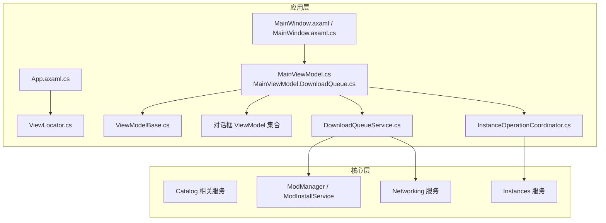
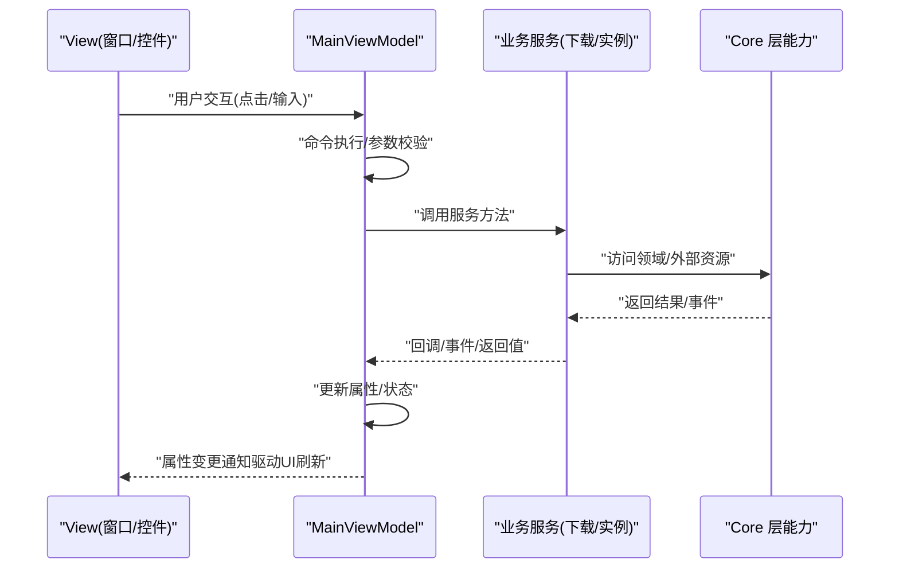
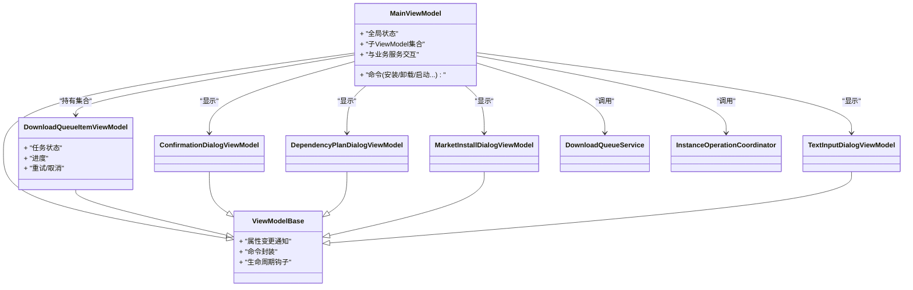
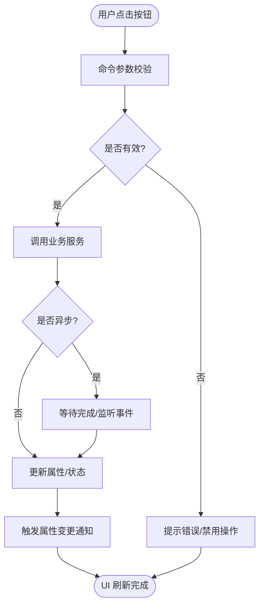
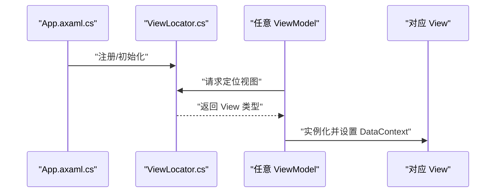
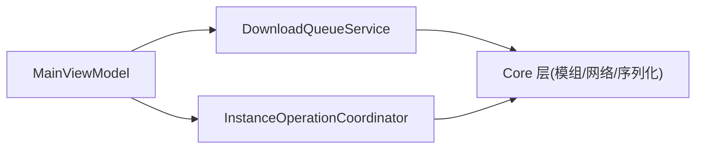

# MVVM 架构模式

<cite>
**本文引用的文件**   
- [ViewModelBase.cs](file://src/Crystalfly.App/ViewModels/ViewModelBase.cs)
- [MainViewModel.cs](file://src/Crystalfly.App/ViewModels/MainViewModel.cs)
- [MainViewModel.DownloadQueue.cs](file://src/Crystalfly.App/ViewModels/MainViewModel.DownloadQueue.cs)
- [ViewLocator.cs](file://src/Crystalfly.App/ViewLocator.cs)
- [App.axaml.cs](file://src/Crystalfly.App/App.axaml.cs)
- [MainWindow.axaml.cs](file://src/Crystalfly.App/Views/MainWindow.axaml.cs)
- [MainWindow.axaml](file://src/Crystalfly.App/Views/MainWindow.axaml)
- [ConfirmationDialogViewModel.cs](file://src/Crystalfly.App/ViewModels/Dialogs/ConfirmationDialogViewModel.cs)
- [DependencyPlanDialogViewModel.cs](file://src/Crystalfly.App/ViewModels/Dialogs/DependencyPlanDialogViewModel.cs)
- [MarketInstallDialogViewModel.cs](file://src/Crystalfly.App/ViewModels/Dialogs/MarketInstallDialogViewModel.cs)
- [TextInputDialogViewModel.cs](file://src/Crystalfly.App/ViewModels/Dialogs/TextInputDialogViewModel.cs)
- [DownloadQueueService.cs](file://src/Crystalfly.App/Downloads/DownloadQueueService.cs)
- [InstanceOperationCoordinator.cs](file://src/Crystalfly.App/Downloads/InstanceOperationCoordinator.cs)
</cite>

## 目录
1. [简介](#简介)
2. [项目结构](#项目结构)
3. [核心组件](#核心组件)
4. [架构总览](#架构总览)
5. [详细组件分析](#详细组件分析)
6. [依赖关系分析](#依赖关系分析)
7. [性能考虑](#性能考虑)
8. [故障排查指南](#故障排查指南)
9. [结论](#结论)
10. [附录](#附录)

## 简介
本文件面向 Avalonia UI 应用中的 MVVM（Model-View-ViewModel）架构，结合 Crystalfly 项目的实际代码，系统阐述 View、ViewModel、Model 的分离原则与实现方式。重点覆盖：
- ViewModelBase 基类的作用与继承机制
- MainViewModel 的职责划分与数据绑定模式
- 命令模式的实现与属性变更通知机制
- ViewLocator 的视图定位策略
- 如何创建新的 ViewModel、处理用户交互事件、与业务逻辑层通信
- 最佳实践与常见陷阱

## 项目结构
MVVM 在 Crystalfly 中按功能分层组织：
- App 层（UI 与绑定）：包含 Views、ViewModels、ViewLocator、App 启动配置等
- Core 层（领域与基础设施）：提供 Catalog、Instances、Mods、Networking、Serialization 等能力
- Steam 层（平台集成）：Steam 认证、下载等

图表来源
- [App.axaml.cs](file://src/Crystalfly.App/App.axaml.cs)
- [ViewLocator.cs](file://src/Crystalfly.App/ViewLocator.cs)
- [MainWindow.axaml.cs](file://src/Crystalfly.App/Views/MainWindow.axaml.cs)
- [MainWindow.axaml](file://src/Crystalfly.App/Views/MainWindow.axaml)
- [ViewModelBase.cs](file://src/Crystalfly.App/ViewModels/ViewModelBase.cs)
- [MainViewModel.cs](file://src/Crystalfly.App/ViewModels/MainViewModel.cs)
- [MainViewModel.DownloadQueue.cs](file://src/Crystalfly.App/ViewModels/MainViewModel.DownloadQueue.cs)
- [DownloadQueueService.cs](file://src/Crystalfly.App/Downloads/DownloadQueueService.cs)
- [InstanceOperationCoordinator.cs](file://src/Crystalfly.App/Downloads/InstanceOperationCoordinator.cs)

章节来源
- [App.axaml.cs](file://src/Crystalfly.App/App.axaml.cs)
- [ViewLocator.cs](file://src/Crystalfly.App/ViewLocator.cs)
- [MainWindow.axaml.cs](file://src/Crystalfly.App/Views/MainWindow.axaml.cs)
- [MainWindow.axaml](file://src/Crystalfly.App/Views/MainWindow.axaml)

## 核心组件
- ViewModelBase：为所有 ViewModel 提供通用能力（如属性变更通知、命令封装等），是 MVVM 的基础设施。
- MainViewModel：主界面状态与交互编排中心，聚合子 ViewModel（如下载队列项、对话框等），协调业务服务。
- Dialog ViewModels：各对话框对应的 ViewModel，负责展示与输入校验、确认/取消等交互流程。
- ViewLocator：根据类型名或约定将 ViewModel 映射到对应 View，简化 XAML 绑定。
- 业务服务：DownloadQueueService、InstanceOperationCoordinator 等，承载具体业务逻辑，被 ViewModel 调用。

章节来源
- [ViewModelBase.cs](file://src/Crystalfly.App/ViewModels/ViewModelBase.cs)
- [MainViewModel.cs](file://src/Crystalfly.App/ViewModels/MainViewModel.cs)
- [MainViewModel.DownloadQueue.cs](file://src/Crystalfly.App/ViewModels/MainViewModel.DownloadQueue.cs)
- [ConfirmationDialogViewModel.cs](file://src/Crystalfly.App/ViewModels/Dialogs/ConfirmationDialogViewModel.cs)
- [DependencyPlanDialogViewModel.cs](file://src/Crystalfly.App/ViewModels/Dialogs/DependencyPlanDialogViewModel.cs)
- [MarketInstallDialogViewModel.cs](file://src/Crystalfly.App/ViewModels/Dialogs/MarketInstallDialogViewModel.cs)
- [TextInputDialogViewModel.cs](file://src/Crystalfly.App/ViewModels/Dialogs/TextInputDialogViewModel.cs)
- [DownloadQueueService.cs](file://src/Crystalfly.App/Downloads/DownloadQueueService.cs)
- [InstanceOperationCoordinator.cs](file://src/Crystalfly.App/Downloads/InstanceOperationCoordinator.cs)

## 架构总览
下图展示了从 UI 到业务层的典型请求路径：用户操作触发 View 的事件，交由绑定的命令执行；命令在 ViewModel 中编排并调用服务；服务完成工作后通过属性变更通知回推 UI。

图表来源
- [MainViewModel.cs](file://src/Crystalfly.App/ViewModels/MainViewModel.cs)
- [MainViewModel.DownloadQueue.cs](file://src/Crystalfly.App/ViewModels/MainViewModel.DownloadQueue.cs)
- [DownloadQueueService.cs](file://src/Crystalfly.App/Downloads/DownloadQueueService.cs)
- [InstanceOperationCoordinator.cs](file://src/Crystalfly.App/Downloads/InstanceOperationCoordinator.cs)

## 详细组件分析

### ViewModelBase 基类与属性变更通知
- 职责
  - 提供统一的属性变更通知能力，使 View 能自动响应属性变化
  - 提供命令封装基础，便于在 View 中绑定可执行动作
  - 统一生命周期钩子（如初始化、销毁）
- 关键机制
  - 属性变更通知：通过基类提供的 API 在属性 setter 中触发通知
  - 命令模式：封装 ICommand，支持 CanExecute 与 Execute
  - 线程安全：确保跨线程更新 UI 时的调度
- 使用建议
  - 所有自定义 ViewModel 均继承自该基类
  - 仅暴露必要的只读属性给 View，避免直接修改内部状态
  - 将复杂逻辑下沉至服务层，保持 ViewModel 轻量

章节来源
- [ViewModelBase.cs](file://src/Crystalfly.App/ViewModels/ViewModelBase.cs)

### MainViewModel 职责与数据绑定
- 职责划分
  - 作为主窗口的根 ViewModel，维护全局状态（如当前选中的实例、下载队列、对话框状态）
  - 编排子 ViewModel（例如下载队列项、对话框）的生命周期与显示
  - 协调业务服务（下载队列、实例操作）以响应用户操作
- 数据绑定模式
  - 通过属性暴露集合与单项对象，供 XAML 列表/详情绑定
  - 使用命令绑定按钮点击、菜单项选择等交互
  - 通过事件/回调更新进度、错误信息，并触发属性变更通知
- 与业务层通信
  - 调用 DownloadQueueService 管理下载任务
  - 调用 InstanceOperationCoordinator 进行实例级操作（启动、克隆、删除等）

图表来源
- [ViewModelBase.cs](file://src/Crystalfly.App/ViewModels/ViewModelBase.cs)
- [MainViewModel.cs](file://src/Crystalfly.App/ViewModels/MainViewModel.cs)
- [MainViewModel.DownloadQueue.cs](file://src/Crystalfly.App/ViewModels/MainViewModel.DownloadQueue.cs)
- [ConfirmationDialogViewModel.cs](file://src/Crystalfly.App/ViewModels/Dialogs/ConfirmationDialogViewModel.cs)
- [DependencyPlanDialogViewModel.cs](file://src/Crystalfly.App/ViewModels/Dialogs/DependencyPlanDialogViewModel.cs)
- [MarketInstallDialogViewModel.cs](file://src/Crystalfly.App/ViewModels/Dialogs/MarketInstallDialogViewModel.cs)
- [TextInputDialogViewModel.cs](file://src/Crystalfly.App/ViewModels/Dialogs/TextInputDialogViewModel.cs)
- [DownloadQueueService.cs](file://src/Crystalfly.App/Downloads/DownloadQueueService.cs)
- [InstanceOperationCoordinator.cs](file://src/Crystalfly.App/Downloads/InstanceOperationCoordinator.cs)

章节来源
- [MainViewModel.cs](file://src/Crystalfly.App/ViewModels/MainViewModel.cs)
- [MainViewModel.DownloadQueue.cs](file://src/Crystalfly.App/ViewModels/MainViewModel.DownloadQueue.cs)

### 命令模式与用户交互
- 设计要点
  - 每个可执行的用户操作（如“安装”、“取消”、“确认”）都对应一个命令
  - 命令应包含 CanExecute 判断，控制按钮可用状态
  - 异步命令需正确处理异常与完成回调，更新 UI 状态
- 典型流程
  - View 绑定 Command 到按钮 Click 事件
  - ViewModel 的命令执行前校验参数
  - 调用服务执行耗时操作
  - 完成后更新属性，触发 UI 刷新

图表来源
- [MainViewModel.cs](file://src/Crystalfly.App/ViewModels/MainViewModel.cs)
- [MainViewModel.DownloadQueue.cs](file://src/Crystalfly.App/ViewModels/MainViewModel.DownloadQueue.cs)
- [DownloadQueueService.cs](file://src/Crystalfly.App/Downloads/DownloadQueueService.cs)

章节来源
- [MainViewModel.cs](file://src/Crystalfly.App/ViewModels/MainViewModel.cs)
- [MainViewModel.DownloadQueue.cs](file://src/Crystalfly.App/ViewModels/MainViewModel.DownloadQueue.cs)

### 属性变更通知机制
- 工作原理
  - ViewModel 属性 setter 中调用基类通知 API
  - View 通过数据绑定订阅变更，自动刷新
- 注意事项
  - 避免在频繁更新的属性上执行重计算
  - 大数据集更新时考虑批量通知或使用集合变更通知
  - 跨线程更新需调度到 UI 线程

章节来源
- [ViewModelBase.cs](file://src/Crystalfly.App/ViewModels/ViewModelBase.cs)

### ViewLocator 视图定位策略
- 作用
  - 根据 ViewModel 类型名或命名约定，自动解析到对应 View 类型
  - 简化 XAML 中 DataContext 的显式指定
- 策略
  - 默认基于命名空间与类型名的映射规则
  - 可在 App 启动时注册自定义映射
- 使用场景
  - 对话框弹窗、动态加载的页面/面板

图表来源
- [App.axaml.cs](file://src/Crystalfly.App/App.axaml.cs)
- [ViewLocator.cs](file://src/Crystalfly.App/ViewLocator.cs)

章节来源
- [ViewLocator.cs](file://src/Crystalfly.App/ViewLocator.cs)
- [App.axaml.cs](file://src/Crystalfly.App/App.axaml.cs)

### 对话框 ViewModel 示例
- 常见对话框
  - 确认对话框：用于二次确认危险操作
  - 文本输入对话框：收集用户输入
  - 依赖计划对话框：展示依赖修复方案
  - 市场安装对话框：引导从市场安装模组
- 交互流程
  - 打开对话框：设置初始数据与默认值
  - 用户操作：提交/取消
  - 关闭对话框：返回结果或状态码

章节来源
- [ConfirmationDialogViewModel.cs](file://src/Crystalfly.App/ViewModels/Dialogs/ConfirmationDialogViewModel.cs)
- [TextInputDialogViewModel.cs](file://src/Crystalfly.App/ViewModels/Dialogs/TextInputDialogViewModel.cs)
- [DependencyPlanDialogViewModel.cs](file://src/Crystalfly.App/ViewModels/Dialogs/DependencyPlanDialogViewModel.cs)
- [MarketInstallDialogViewModel.cs](file://src/Crystalffly.App/ViewModels/Dialogs/MarketInstallDialogViewModel.cs)

## 依赖关系分析
- 松耦合
  - ViewModel 仅依赖抽象的服务接口或具体服务，不直接依赖 UI 框架细节
  - 业务逻辑集中在 Core 与服务层，便于测试与复用
- 内聚性
  - 每个 ViewModel 聚焦单一职责（如下载队列项、对话框）
  - 基类提供通用能力，减少重复代码
- 外部依赖
  - 网络、文件系统、Steam 等平台能力由 Core/Steam 层提供

图表来源
- [MainViewModel.cs](file://src/Crystalfly.App/ViewModels/MainViewModel.cs)
- [DownloadQueueService.cs](file://src/Crystalfly.App/Downloads/DownloadQueueService.cs)
- [InstanceOperationCoordinator.cs](file://src/Crystalfly.App/Downloads/InstanceOperationCoordinator.cs)

章节来源
- [MainViewModel.cs](file://src/Crystalfly.App/ViewModels/MainViewModel.cs)
- [DownloadQueueService.cs](file://src/Crystalfly.App/Downloads/DownloadQueueService.cs)
- [InstanceOperationCoordinator.cs](file://src/Crystalfly.App/Downloads/InstanceOperationCoordinator.cs)

## 性能考虑
- 属性变更频率
  - 高频更新属性（如进度条）应避免在 setter 中进行昂贵计算
  - 使用防抖或节流策略降低通知开销
- 集合绑定
  - 大数据集使用虚拟化和分页
  - 增量更新而非全量替换
- 异步与并发
  - 长时间运行的操作必须异步执行，避免阻塞 UI 线程
  - 合理处理异常与取消令牌，防止内存泄漏

[本节为通用指导，无需源码引用]

## 故障排查指南
- 常见问题
  - 属性未更新：检查是否在 setter 中触发了属性变更通知
  - 命令不可用：检查 CanExecute 条件是否正确
  - 视图未显示：检查 ViewLocator 映射规则与命名约定
  - 跨线程异常：确保 UI 更新调度到 UI 线程
- 调试技巧
  - 在 ViewModel 构造函数或服务注入点添加日志
  - 使用单元测试验证命令与服务交互
  - 对对话框 ViewModel 编写交互流程断言

章节来源
- [ViewModelBase.cs](file://src/Crystalfly.App/ViewModels/ViewModelBase.cs)
- [MainViewModel.cs](file://src/Crystalfly.App/ViewModels/MainViewModel.cs)
- [ViewLocator.cs](file://src/Crystalfly.App/ViewLocator.cs)

## 结论
Crystalfly 采用清晰的 MVVM 分层，通过 ViewModelBase 提供统一基础设施，MainViewModel 承担编排职责，配合 ViewLocator 简化视图定位，实现了高内聚、低耦合的可维护 UI 架构。遵循本文的最佳实践与注意事项，可有效提升开发效率与运行稳定性。

[本节为总结，无需源码引用]

## 附录

### 如何创建新的 ViewModel
- 步骤
  - 新建类并继承 ViewModelBase
  - 定义需要暴露的属性，并在 setter 中触发变更通知
  - 定义命令，绑定到 View 的交互事件
  - 如需弹窗，使用 ViewLocator 自动定位对应 View
- 参考路径
  - [ViewModelBase.cs](file://src/Crystalfly.App/ViewModels/ViewModelBase.cs)
  - [MainViewModel.cs](file://src/Crystalfly.App/ViewModels/MainViewModel.cs)
  - [ViewLocator.cs](file://src/Crystalfly.App/ViewLocator.cs)

### 如何处理用户交互事件
- 推荐做法
  - 使用命令绑定代替事件处理器
  - 在命令中做参数校验与状态切换
  - 将耗时操作委托给服务层
- 参考路径
  - [MainViewModel.cs](file://src/Crystalfly.App/ViewModels/MainViewModel.cs)
  - [MainViewModel.DownloadQueue.cs](file://src/Crystalfly.App/ViewModels/MainViewModel.DownloadQueue.cs)

### 如何与业务逻辑层通信
- 推荐做法
  - 通过构造器注入或静态容器获取服务实例
  - 在服务调用前后更新 ViewModel 状态
  - 使用事件或回调接收进度与错误
- 参考路径
  - [DownloadQueueService.cs](file://src/Crystalfly.App/Downloads/DownloadQueueService.cs)
  - [InstanceOperationCoordinator.cs](file://src/Crystalfly.App/Downloads/InstanceOperationCoordinator.cs)

### 最佳实践
- 保持 ViewModel 薄，业务逻辑下沉到服务层
- 使用只读属性暴露状态，避免外部直接修改内部字段
- 命令应具备幂等性与健壮的错误处理
- 对话框 ViewModel 明确输入输出契约，便于测试

### 常见陷阱
- 忘记触发属性变更通知导致 UI 不刷新
- 在 UI 线程外更新属性造成异常
- 过度在 ViewModel 中实现业务逻辑，难以测试与维护
- 忽略 CanExecute 导致按钮状态与实际行为不一致