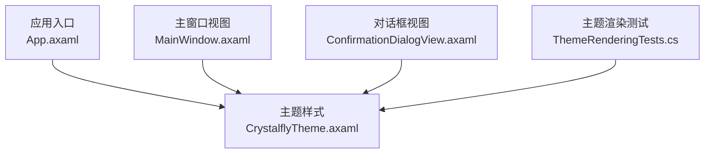
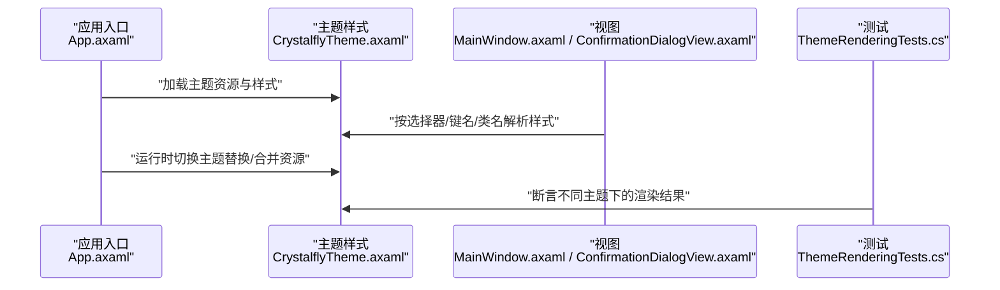
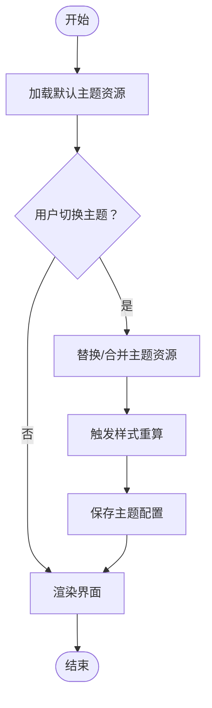
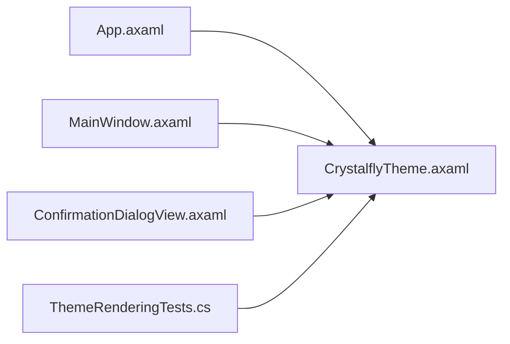

# 主题系统

<cite>
**本文引用的文件**   
- [CrystalflyTheme.axaml](file://src/Crystalfly.App/Styles/CrystalflyTheme.axaml)
- [App.axaml](file://src/Crystalfly.App/App.axaml)
- [MainWindow.axaml](file://src/Crystalfly.App/Views/MainWindow.axaml)
- [ConfirmationDialogView.axaml](file://src/Crystalfly.App/Views/Dialogs/ConfirmationDialogView.axaml)
- [ThemeRenderingTests.cs](file://tests/Crystalfly.App.Tests/Ui/ThemeRenderingTests.cs)
</cite>

## 目录
1. [简介](#简介)
2. [项目结构](#项目结构)
3. [核心组件](#核心组件)
4. [架构总览](#架构总览)
5. [详细组件分析](#详细组件分析)
6. [依赖关系分析](#依赖关系分析)
7. [性能考虑](#性能考虑)
8. [故障排查指南](#故障排查指南)
9. [结论](#结论)
10. [附录](#附录)

## 简介
本章节面向主题系统与样式定制，围绕 CrystalflyTheme.axaml 的主题定义结构与样式继承机制展开，说明颜色资源、字体设置、控件模板的定义与使用方式；阐述动态主题切换的实现原理与配置选项；提供自定义主题的创建指南，展示如何扩展现有样式或创建全新主题；记录 Avalonia UI 的样式优先级与覆盖机制；并包含暗色模式与亮色模式的实现思路。

## 项目结构
主题相关的关键文件位于应用层：
- 主题样式文件：src/Crystalfly.App/Styles/CrystalflyTheme.axaml
- 应用入口样式加载：src/Crystalfly.App/App.axaml
- 主窗口视图（示例引用主题）：src/Crystalfly.App/Views/MainWindow.axaml
- 对话框视图（示例引用主题）：src/Crystalfly.App/Views/Dialogs/ConfirmationDialogView.axaml
- 主题渲染测试：tests/Crystalfly.App.Tests/Ui/ThemeRenderingTests.cs

图表来源
- [App.axaml](file://src/Crystalfly.App/App.axaml)
- [CrystalflyTheme.axaml](file://src/Crystalfly.App/Styles/CrystalflyTheme.axaml)
- [MainWindow.axaml](file://src/Crystalfly.App/Views/MainWindow.axaml)
- [ConfirmationDialogView.axaml](file://src/Crystalfly.App/Views/Dialogs/ConfirmationDialogView.axaml)
- [ThemeRenderingTests.cs](file://tests/Crystalfly.App.Tests/Ui/ThemeRenderingTests.cs)

章节来源
- [CrystalflyTheme.axaml](file://src/Crystalfly.App/Styles/CrystalflyTheme.axaml)
- [App.axaml](file://src/Crystalfly.App/App.axaml)
- [MainWindow.axaml](file://src/Crystalfly.App/Views/MainWindow.axaml)
- [ConfirmationDialogView.axaml](file://src/Crystalfly.App/Views/Dialogs/ConfirmationDialogView.axaml)
- [ThemeRenderingTests.cs](file://tests/Crystalfly.App.Tests/Ui/ThemeRenderingTests.cs)

## 核心组件
- 主题样式文件 CrystalflyTheme.axaml：集中定义颜色资源、字体、控件模板与通用样式，供全局应用与局部覆盖。
- 应用入口 App.axaml：负责加载主题样式，并在需要时进行运行时切换。
- 视图文件（如 MainWindow.axaml、ConfirmationDialogView.axaml）：通过样式选择器、键名或类名引用主题中的资源与模板。
- 测试用例 ThemeRenderingTests.cs：验证主题在不同状态下的渲染行为，辅助定位样式问题。

章节来源
- [CrystalflyTheme.axaml](file://src/Crystalfly.App/Styles/CrystalflyTheme.axaml)
- [App.axaml](file://src/Crystalfly.App/App.axaml)
- [MainWindow.axaml](file://src/Crystalfly.App/Views/MainWindow.axaml)
- [ConfirmationDialogView.axaml](file://src/Crystalfly.App/Views/Dialogs/ConfirmationDialogView.axaml)
- [ThemeRenderingTests.cs](file://tests/Crystalfly.App.Tests/Ui/ThemeRenderingTests.cs)

## 架构总览
主题系统的整体流程如下：
- 启动阶段：应用入口加载主题样式，建立资源字典与样式树。
- 运行阶段：视图通过样式选择器、键名或类名解析到主题资源与模板。
- 切换阶段：在运行时替换或合并主题资源，触发样式重算与界面刷新。
- 测试阶段：通过测试驱动验证主题切换后的渲染一致性。

图表来源
- [App.axaml](file://src/Crystalfly.App/App.axaml)
- [CrystalflyTheme.axaml](file://src/Crystalfly.App/Styles/CrystalflyTheme.axaml)
- [MainWindow.axaml](file://src/Crystalfly.App/Views/MainWindow.axaml)
- [ConfirmationDialogView.axaml](file://src/Crystalfly.App/Views/Dialogs/ConfirmationDialogView.axaml)
- [ThemeRenderingTests.cs](file://tests/Crystalfly.App.Tests/Ui/ThemeRenderingTests.cs)

## 详细组件分析

### 主题定义结构与样式继承机制
- 资源字典组织：将颜色、字体、尺寸等作为可复用资源集中管理，便于统一修改与按需覆盖。
- 样式继承：通过基于现有控件样式扩展的方式，减少重复定义，保持风格一致。
- 选择器策略：结合类型选择器、键名选择器与类名选择器，实现细粒度控制。
- 模板化：为复杂控件提供模板，确保外观与交互的可控性。

章节来源
- [CrystalflyTheme.axaml](file://src/Crystalfly.App/Styles/CrystalflyTheme.axaml)

### 颜色资源与字体设置
- 颜色资源：以语义化键名定义前景、背景、强调色、禁用态等，支持明暗两套调色板。
- 字体设置：定义全局字体族、字号、行高与字重，保证跨平台一致性。
- 使用方式：在控件样式中通过资源引用绑定，避免硬编码。

章节来源
- [CrystalflyTheme.axaml](file://src/Crystalfly.App/Styles/CrystalflyTheme.axaml)

### 控件模板的定义与使用
- 模板结构：为按钮、列表项、对话框等常用控件定义模板，统一视觉语言。
- 数据绑定：在模板中使用数据绑定与触发器，响应状态变化。
- 组合复用：通过模板组合与样式叠加，快速构建新控件外观。

章节来源
- [CrystalflyTheme.axaml](file://src/Crystalfly.App/Styles/CrystalflyTheme.axaml)

### 动态主题切换的实现原理与配置选项
- 切换入口：在应用入口或设置模块中提供切换方法，根据用户偏好或系统主题更新资源字典。
- 资源替换：通过替换主题资源键值或合并新的资源字典，实现运行时切换。
- 触发刷新：切换后触发样式重算，确保所有已加载控件立即生效。
- 配置持久化：将当前主题写入配置，重启后恢复。

[此图为概念流程图，不直接映射具体源码文件]

### 自定义主题的创建指南
- 扩展现有主题：新建样式文件，仅覆盖需要变更的资源与样式，保留其余默认定义。
- 创建全新主题：复制基础主题结构，调整颜色与字体，逐步完善控件模板。
- 命名规范：为资源键名与样式类名制定统一前缀，避免冲突。
- 集成步骤：在应用入口注册新主题，并提供切换入口。

章节来源
- [CrystalflyTheme.axaml](file://src/Crystalfly.App/Styles/CrystalflyTheme.axaml)
- [App.axaml](file://src/Crystalfly.App/App.axaml)

### Avalonia UI 样式优先级与覆盖机制
- 优先级顺序：内联样式 > 本地样式 > 样式选择器 > 资源字典 > 默认样式。
- 覆盖策略：通过更具体的选择器或更高优先级的资源键覆盖默认值。
- 作用域：局部样式仅影响指定元素及其子树，全局样式影响整个应用。
- 调试技巧：利用测试与可视化调试工具确认最终生效的样式。

章节来源
- [CrystalflyTheme.axaml](file://src/Crystalfly.App/Styles/CrystalflyTheme.axaml)
- [MainWindow.axaml](file://src/Crystalfly.App/Views/MainWindow.axaml)
- [ConfirmationDialogView.axaml](file://src/Crystalfly.App/Views/Dialogs/ConfirmationDialogView.axaml)

### 暗色模式与亮色模式的支持实现
- 双调色板：在同一资源字典中维护明暗两套颜色键，通过选择器或运行时切换激活。
- 系统联动：监听系统主题变化，自动切换应用主题。
- 回退策略：当缺少某资源键时，回退到默认值，确保稳定性。
- 测试保障：通过测试用例验证两种模式下的关键控件渲染。

章节来源
- [CrystalflyTheme.axaml](file://src/Crystalfly.App/Styles/CrystalflyTheme.axaml)
- [ThemeRenderingTests.cs](file://tests/Crystalfly.App.Tests/Ui/ThemeRenderingTests.cs)

## 依赖关系分析
主题样式被多个视图与应用入口依赖，形成清晰的单向依赖关系。

图表来源
- [App.axaml](file://src/Crystalfly.App/App.axaml)
- [CrystalflyTheme.axaml](file://src/Crystalfly.App/Styles/CrystalflyTheme.axaml)
- [MainWindow.axaml](file://src/Crystalfly.App/Views/MainWindow.axaml)
- [ConfirmationDialogView.axaml](file://src/Crystalfly.App/Views/Dialogs/ConfirmationDialogView.axaml)
- [ThemeRenderingTests.cs](file://tests/Crystalfly.App.Tests/Ui/ThemeRenderingTests.cs)

章节来源
- [CrystalflyTheme.axaml](file://src/Crystalfly.App/Styles/CrystalflyTheme.axaml)
- [App.axaml](file://src/Crystalfly.App/App.axaml)
- [MainWindow.axaml](file://src/Crystalfly.App/Views/MainWindow.axaml)
- [ConfirmationDialogView.axaml](file://src/Crystalfly.App/Views/Dialogs/ConfirmationDialogView.axaml)
- [ThemeRenderingTests.cs](file://tests/Crystalfly.App.Tests/Ui/ThemeRenderingTests.cs)

## 性能考虑
- 资源复用：尽量使用共享资源与样式，减少重复定义带来的内存占用。
- 延迟加载：对大型主题资源采用按需加载，降低启动开销。
- 样式缓存：避免频繁切换导致的大量样式重算，必要时批量更新。
- 模板优化：简化模板复杂度，减少绑定与触发器的数量。

[本节为通用指导，无需源码引用]

## 故障排查指南
- 样式未生效：检查选择器优先级与作用域，确认资源键是否存在。
- 主题切换无效：确认资源替换逻辑与样式重算是否执行。
- 明暗模式异常：核对两套调色板的键名一致性，检查回退策略。
- 测试失败：查看渲染测试输出，定位具体控件与属性差异。

章节来源
- [ThemeRenderingTests.cs](file://tests/Crystalfly.App.Tests/Ui/ThemeRenderingTests.cs)
- [CrystalflyTheme.axaml](file://src/Crystalfly.App/Styles/CrystalflyTheme.axaml)

## 结论
通过集中化的主题样式与清晰的样式继承机制，本项目实现了灵活且可维护的主题系统。借助资源字典、选择器与模板的组合，既能满足统一的视觉规范，又支持个性化定制与动态切换。配合测试用例，能够保障主题在不同场景下的稳定表现。

[本节为总结性内容，无需源码引用]

## 附录
- 最佳实践：
  - 使用语义化资源键名，提升可读性与可维护性。
  - 遵循选择器最小作用域原则，避免全局污染。
  - 为新主题提供增量覆盖，减少复制成本。
- 参考路径：
  - 主题样式：src/Crystalfly.App/Styles/CrystalflyTheme.axaml
  - 应用入口：src/Crystalfly.App/App.axaml
  - 主窗口视图：src/Crystalfly.App/Views/MainWindow.axaml
  - 对话框视图：src/Crystalfly.App/Views/Dialogs/ConfirmationDialogView.axaml
  - 主题测试：tests/Crystalfly.App.Tests/Ui/ThemeRenderingTests.cs

[本节为补充信息，无需源码引用]